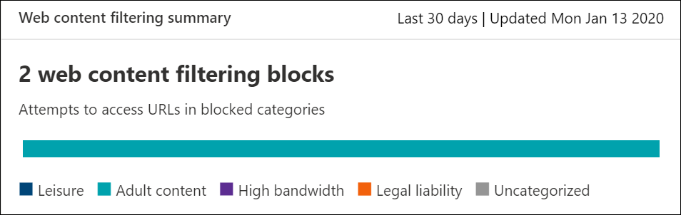

# Internet-InhaltsfilterungWeb content filtering

[!INCLUDE [Microsoft 365 Defender rebranding](../../includes/microsoft-defender.md)]

**Gilt für:****Applies to:**
- [Microsoft Defender für EndpunktMicrosoft Defender for Endpoint](https://go.microsoft.com/fwlink/p/?linkid=2154037)
- [Microsoft 365 DefenderMicrosoft 365 Defender](https://go.microsoft.com/fwlink/?linkid=2118804)

> [!IMPORTANT]
> **Webinhaltsfilterung befindet sich derzeit in der öffentlichen Vorschau****Web content filtering is currently in public preview** 
> Diese Vorschauversion wird ohne Vereinbarung zum Servicelevel bereitgestellt und wird für Produktionsworkloads nicht empfohlen.This preview version is provided without a service level agreement, and it's not recommended for production workloads. Bestimmte Features werden möglicherweise nicht unterstützt oder verfügen möglicherweise über eingeschränkte Funktionen.Certain features might not be supported or might have constrained capabilities.
> Weitere Informationen finden Sie unter [Microsoft Defender for Endpoint Preview Features](preview.md).For more information, see [Microsoft Defender for Endpoint preview features](preview.md).

> [!TIP]
> Möchten Sie Microsoft Defender for Endpoint erleben?Want to experience Microsoft Defender for Endpoint? [Registrieren Sie sich für eine kostenlose Testversion.Sign up for a free trial.](https://www.microsoft.com/microsoft-365/windows/microsoft-defender-atp?ocid=docs-wdatp-main-abovefoldlink&rtc=1)

Die Webinhaltsfilterung ist Teil der [Webschutzfunktionen](web-protection-overview.md) in Microsoft Defender for Endpoint.Web content filtering is part of [Web protection](web-protection-overview.md) capabilities in Microsoft Defender for Endpoint. Sie ermöglicht Es Ihrer Organisation, den Zugriff auf Websites basierend auf ihren Inhaltskategorien nachverfolgt und zu regeln.It enables your organization to track and regulate access to websites based on their content categories. Viele dieser Websites sind zwar nicht bösartig, können jedoch aufgrund von Compliancebestimmungen, Bandbreitennutzung oder anderen Bedenken problematisch sein.Many of these websites, while not malicious, might be problematic because of compliance regulations, bandwidth usage, or other concerns.

Konfigurieren Sie Richtlinien für alle Gerätegruppen, um bestimmte Kategorien zu blockieren.Configure policies across your device groups to block certain categories. Das Blockieren einer Kategorie verhindert, dass Benutzer innerhalb angegebener Gerätegruppen auf URLs zugreifen, die der Kategorie zugeordnet sind.Blocking a category prevents users within specified device groups from accessing URLs associated with the category. Für jede Kategorie, die nicht blockiert ist, werden die URLs automatisch überwacht.For any category that's not blocked, the URLs are automatically audited. Ihre Benutzer können ohne Unterbrechung auf die URLs zugreifen, und Sie sammeln Zugriffsstatistiken, um eine benutzerdefiniertere Richtlinienentscheidung zu erstellen.Your users can access the URLs without disruption, and you'll gather access statistics to help create a more custom policy decision. Ihren Benutzern wird eine Sperrbenachrichtigung angezeigt, wenn ein Element auf der angezeigten Seite Aufrufe einer blockierten Ressource vor sich hat.Your users will see a block notification if an element on the page they're viewing is making calls to a blocked resource.

Die Webinhaltsfilterung ist in den wichtigsten Webbrowsern mit Blöcken verfügbar, die von Windows Defender SmartScreen (Microsoft Edge) und Network Protection (Chrome, Firefox, Brave und Opera) ausgeführt werden.Web content filtering is available on the major web browsers, with blocks performed by Windows Defender SmartScreen (Microsoft Edge) and Network Protection (Chrome, Firefox, Brave and Opera). Weitere Informationen zur Browserunterstützung finden Sie im Abschnitt Voraussetzungen.For more information about browser support, see the prerequisites section.

Zusammenfassung der Vorteile:Summarizing the benefits:

- Benutzer werden am Zugriff auf Websites in blockierten Kategorien gehindert, unabhängig davon, ob sie lokal oder fern surfenUsers are prevented from accessing websites in blocked categories, whether they're browsing on-premises or away
- Ihr Sicherheitsteam kann Richtlinien mithilfe von Gerätegruppen, die in rollenbasierten Zugriffssteuerungseinstellungen von Microsoft Defender for Endpoint definiert sind, bequem für Benutzergruppen [bereitstellen.](/microsoft-365/security/defender-endpoint/rbac)Your security team can conveniently deploy policies to groups of users using device groups defined in [Microsoft Defender for Endpoint role-based access control settings](/microsoft-365/security/defender-endpoint/rbac)
- Ihr Sicherheitsteam kann auf Webberichte am gleichen zentralen Speicherort zugreifen, mit Sichtbarkeit über tatsächliche Blöcke und WebnutzungYour security team can access web reports in the same central location, with visibility over actual blocks and web usage

## Verwendung durch den BenutzerUser experience

Die Sperrerfahrung für von Drittanbietern unterstützte Browser wird von Network Protection bereitgestellt, das ein Popup auf Systemebene bietet, das den Benutzer über eine blockierte Verbindung informiert.The blocking experience for 3rd party supported browsers is provided by Network Protection, which provides a system-level toast notifying the user of a blocked connection. Für eine benutzerfreundlichere, browserfreundlichere Benutzeroberfläche sollten Sie die Verwendung von Microsoft Edge.For a more user-friendly, in-browser experience, consider using Microsoft Edge.

## VoraussetzungenPrerequisites

Stellen Sie vor dem Ausprobieren dieses Features sicher, dass Die folgenden Anforderungen erfüllt sind:Before trying out this feature, make sure you have the following requirements:

- Windows 10 Enterprise E5, Microsoft 365 E5, Microsoft 365 E5 Security, Microsoft 365 E3 + Microsoft 365 E5 Security oder die eigenständige Microsoft Defender for Endpoint-Lizenz.Windows 10 Enterprise E5, Microsoft 365 E5, Microsoft 365 E5 Security, Microsoft 365 E3 + Microsoft 365 E5 Security add-on or the Microsoft Defender for Endpoint standalone license. 
- Zugriff auf Microsoft Defender Security Center Portal ( https://securitycenter.windows.com) .Access to Microsoft Defender Security Center portal (https://securitycenter.windows.com).
- Geräte mit Windows 10 Anniversary Update (Version 1607) oder höher mit dem neuesten MoCAMP-Update.Devices running Windows 10 Anniversary Update (version 1607) or later with the latest MoCAMP update.

## DatenverarbeitungData handling

Wir folgen der Region, die Sie als Teil Ihrer [Microsoft Defender for Endpoint-Datenverarbeitungseinstellungen verwendet haben.](data-storage-privacy.md)We will follow whichever region you have elected to use as part of your [Microsoft Defender for Endpoint data handling settings](data-storage-privacy.md). Ihre Daten verlassen das Rechenzentrum nicht in dieser Region.Your data will not leave the data center in that region. Darüber hinaus werden Ihre Daten nicht an Dritte, einschließlich unserer Datenanbieter, weitergegeben.In addition, your data will not be shared with any third-parties, including our data providers.

## Aktivieren der WebinhaltsfilterungTurn on web content filtering

Wählen Sie im linken Navigationsmenü die **Option Einstellungen**  >  **Erweiterte Features**  >  **aus.**From the left-hand navigation menu, select **Settings** > **General** > **Advanced Features**. Scrollen Sie nach unten, bis der Eintrag für die **Webinhaltsfilterung angezeigt wird.**Scroll down until you see the entry for **Web content filtering**. Wechseln Sie zum Umschalten zu **Ein** und **Speichern der Einstellungen**.Switch the toggle to **On** and **Save preferences**.

### Konfigurieren von WebinhaltsfilterrichtlinienConfigure web content filtering policies

Web content filtering policies specify which site categories are blocked on which device groups.Web content filtering policies specify which site categories are blocked on which device groups. Um die Richtlinien zu verwalten, wechseln Sie **zu Einstellungen**  >  **Rules**  >  **Web content filtering**.To manage the policies, go to **Settings** > **Rules** > **Web content filtering**.

Verwenden Sie den Filter, um Richtlinien zu finden, die bestimmte blockierte Kategorien enthalten oder auf bestimmte Gerätegruppen angewendet werden.Use the filter to locate policies that contain certain blocked categories or are applied to specific device groups.

### Erstellen einer RichtlinieCreate a policy

So fügen Sie eine neue Richtlinie hinzu:To add a new policy:

1. Wählen **Sie Richtlinie hinzufügen** auf der **Webinhaltsfilterseite** in **Einstellungen**.Select **Add policy** on the **Web content filtering** page in **Settings**.

2. Geben Sie einen Namen an.Specify a name.

3. Wählen Sie die zu blockierende Kategorie aus.Select the categories to block. Verwenden Sie das Erweiterungssymbol, um alle übergeordneten Kategorien vollständig zu erweitern und bestimmte Webinhaltskategorien auszuwählen.Use the expand icon to fully expand each parent category and select specific web content categories.

4. Geben Sie den Richtlinienbereich an.Specify the policy scope. Wählen Sie die Gerätegruppen aus, um anzugeben, wo die Richtlinie angewendet werden soll.Select the device groups to specify where to apply the policy. Nur Geräte in den ausgewählten Gerätegruppen können nicht auf Websites in den ausgewählten Kategorien zugreifen.Only devices in the selected device groups will be prevented from accessing websites in the selected categories.

5. Überprüfen Sie die Zusammenfassung, und speichern Sie die Richtlinie.Review the summary and save the policy. Die Richtlinienaktualisierung kann bis zu 2 Stunden dauern, bis sie auf ihre ausgewählten Geräte angewendet wird.The policy refresh may take up to 2 hours to apply to your selected devices.

> [!TIP]
> Sie können eine Richtlinie bereitstellen, ohne eine Kategorie in einer Gerätegruppe auswählen zu müssen.You can deploy a policy without selecting any category on a device group. Mit dieser Aktion wird eine Nur-Überwachung-Richtlinie erstellt, damit Sie das Benutzerverhalten besser verstehen können, bevor Sie eine Sperrrichtlinie erstellen.This action will create an audit only policy, to help you understand user behavior before creating a block policy.

>[!NOTE]
>Wenn Sie gleichzeitig eine Richtlinie entfernen oder Gerätegruppen ändern, kann dies zu verzögerungen bei der Richtlinienbereitstellung führen.If you are removing a policy or changing device groups at the same time, this might cause a delay in policy deployment.

>[!IMPORTANT]
>Das Blockieren der Kategorie "Uncategorized" kann zu unerwarteten und unerwünschten Ergebnissen führen.Blocking the "Uncategorized" category may lead to unexpected and undesired results.  

### Zulassen bestimmter WebsitesAllow specific websites

Es ist möglich, die blockierte Kategorie in der Webinhaltsfilterung außer Kraft zu setzen, um eine einzelne Website durch Erstellen einer benutzerdefinierten Indikatorrichtlinie zu ermöglichen.It's possible to override the blocked category in web content filtering to allow a single site by creating a custom indicator policy. Die benutzerdefinierte Indikatorrichtlinie ersetzt die Webinhaltsfilterrichtlinie, wenn sie auf die entsprechende Gerätegruppe angewendet wird.The custom indicator policy will supersede the web content filtering policy when it's applied to the device group in question.

1. Erstellen Sie einen benutzerdefinierten Indikator im Microsoft Defender Security Center, indem Sie **Einstellungen**  >    >  **Indikatoren-URL/Domänen-Add-Element**  >  **.**Create a custom indicator in the Microsoft Defender Security Center by going to **Settings** > **Indicators** > **URL/Domain** > **Add Item**.

2. Geben Sie die Domäne der Website ein.Enter the domain of the site.

3. Legen Sie die Richtlinienaktion auf **Zulassen .**Set the policy action to **Allow**.  

### Melden von UngenauigkeitenReporting inaccuracies

Wenn Eine Domäne fälschlicherweise kategorisiert wurde, können Sie Ungenauigkeiten direkt über die Seite Web content filtering reports melden.If you encounter a domain that has been incorrectly categorized, you can report inaccuracies directly to us from the Web Content Filtering reports page. Dieses Feature ist nur im neuen Microsoft 365 Security Center (security.microsoft.com) verfügbar.This feature is available only in the new Microsoft 365 security center (security.microsoft.com).

Um eine Ungenauigkeit zu melden, navigieren Sie zu **Berichte**  >  **Webschutz Web** Content Filtering  >  **Details**  >  **Domains**.To report an inaccuracy, navigate to **Reports** > **Web protection** > **Web Content Filtering Details** > **Domains**. Auf der Registerkarte Domänen unserer Web Content Filtering-Berichte wird neben jeder Domäne ein Auslassungsauslassungsblatt angezeigt.On the domains tab of our Web Content Filtering reports, you will see an ellipsis beside each of the domains. Zeigen Sie auf diese Auslassungspunkte, und wählen **Sie Ungenauigkeit melden aus.**Hover over this ellipsis and select **Report Inaccuracy**.

Ein Bereich wird geöffnet, in dem Sie die Priorität auswählen und zusätzliche Details hinzufügen können, z. B. die vorgeschlagene Kategorie für die erneute Kategorisierung.A panel will open where you can select the priority and add additional details such as the suggested category for re-categorization. Nachdem Sie das Formular abgeschlossen haben, wählen Sie **Absenden aus.**Once you complete the form, select **Submit**. Unser Team überprüft die Anforderung innerhalb eines Arbeitstags.Our team will review the request within one business day. Erstellen Sie zum sofortigen Aufheben der Blockierung einen [benutzerdefinierten Zulässigen Indikator](indicator-ip-domain.md).For immediate unblocking, create a [custom allow indicator](indicator-ip-domain.md).

## Webinhaltsfilterkarten und -detailsWeb content filtering cards and details

Wählen **Sie Berichte > Webschutz aus,** um Karten mit Informationen zur Filterung von Webinhalten und zum Schutz vor Webbedrohungen anzuzeigen.Select **Reports > Web protection** to view cards with information about web content filtering and web threat protection. Die folgenden Karten enthalten Zusammenfassende Informationen zur Webinhaltsfilterung.The following cards provide summary information about web content filtering.

### Webaktivität nach KategorieWeb activity by category

Diese Karte listet die übergeordneten Webinhaltskategorien mit der größten Zunahme oder Verringerung der Anzahl der Zugriffsversuche auf.This card lists the parent web content categories with the largest increase or decrease in the number of access attempts. Verstehen Sie drastische Änderungen an Webaktivitätsmustern in Ihrer Organisation seit den letzten 30 Tagen, 3 Monaten oder 6 Monaten.Understand drastic changes in web activity patterns in your organization from last 30 days, 3 months, or 6 months. Wählen Sie einen Kategorienamen aus, um weitere Informationen anzeigen zu können.Select a category name to view more information.

In den ersten 30 Tagen nach der Verwendung dieses Features verfügt Ihre Organisation möglicherweise nicht über genügend Daten, um diese Informationen anzeigen zu können.In the first 30 days of using this feature, your organization might not have enough data to display this information.

### Zusammenfassungskarte für die WebinhaltsfilterungWeb content filtering  summary card

Diese Karte zeigt die Verteilung blockierter Zugriffsversuche auf die verschiedenen übergeordneten Webinhaltskategorien an.This card displays the distribution of blocked access attempts across the different parent web content categories. Wählen Sie einen der farbigen Balken aus, um weitere Informationen zu einer bestimmten übergeordneten Webkategorie anzeigen zu können.Select one of the colored bars to view more information about a specific parent web category.

### Zusammenfassungskarte für WebaktivitätWeb activity summary card

Diese Karte zeigt die Gesamtzahl der Anforderungen für Webinhalte in allen URLs an.This card displays the total number of requests for web content in all URLs.

### Anzeigen von KartendetailsView card details

Sie können auf die **Berichtsdetails** für jede Karte zugreifen, indem Sie im Diagramm auf der Karte eine Tabellenzeile oder einen farbigen Balken auswählen.You can access the **Report details** for each card by selecting a table row or colored bar from the chart in the card. Die Berichtsdetailsepage für jede Karte enthält umfangreiche statistische Daten zu Webinhaltskategorien, Websitedomänen und Gerätegruppen.The report details page for each card contains extensive statistical data about web content categories, website domains, and device groups.

- **Webkategorien:** Listet die Webinhaltskategorien auf, für die in Ihrer Organisation Zugriffsversuche versucht wurden.**Web categories**: Lists the web content categories that have had access attempts in your organization. Wählen Sie eine bestimmte Kategorie aus, um ein Zusammenfassungsf flyout zu öffnen.Select a specific category to open a summary flyout.

- **Domänen:** Listet die Webdomänen auf, auf die in Ihrer Organisation zugegriffen oder blockiert wurde.**Domains**: Lists the web domains that have been accessed or blocked in your organization. Wählen Sie eine bestimmte Domäne aus, um detaillierte Informationen zu dieser Domäne anzeigen zu können.Select a specific domain to view detailed information about that domain.

- **Gerätegruppen**: Listet alle Gerätegruppen auf, die Webaktivitäten in Ihrer Organisation generiert haben**Device groups**: Lists all the device groups that have generated web activity in your organization

Verwenden Sie den Zeitbereichsfilter oben links auf der Seite, um einen Zeitraum auszuwählen.Use the time range filter at the top left of the page to select a time period. Sie können die Informationen auch filtern oder die Spalten anpassen.You can also filter the information or customize the columns. Wählen Sie eine Zeile aus, um einen Flyoutbereich mit noch mehr Informationen zum ausgewählten Element zu öffnen.Select a row to open a flyout pane with even more information about the selected item.

## Fehler und ProblemeErrors and issues

### Einschränkungen und bekannte Probleme in dieser VorschauLimitations and known issues in this preview

- Nur Microsoft Edge wird unterstützt, wenn die Betriebssystemkonfiguration Ihres Geräts Server (**cmd**  >  **Systeminfo** OS Configuration )  >  **ist.**Only Microsoft Edge is supported if your device's OS configuration is Server (**cmd** > **Systeminfo** > **OS Configuration**). Network Protection wird nur im Inspect-Modus auf Servergeräten unterstützt, der für die Sicherung des Datenverkehrs über unterstützte Browser von Drittanbietern verantwortlich ist.Network Protection is only supported in Inspect mode on Server devices, which is responsible for securing traffic across supported 3rd party browsers.

- Auf nicht zugewiesenen Geräten werden falsche Daten im Bericht angezeigt.Unassigned devices will have incorrect data shown within the report. Im **Pivot "Berichtdetails**  >  **Gerätegruppen"** wird möglicherweise eine Zeile mit einem leeren Feld Gerätegruppe angezeigt.In the **Report details** > **Device groups** pivot, you might see a row with a blank Device Group field. Diese Gruppe enthält Ihre nicht zugewiesenen Geräte, bevor sie in Ihre angegebene Gruppe eingesenert werden.This group contains your unassigned devices before they get put into your specified group. Der Bericht für diese Zeile enthält möglicherweise keine genaue Anzahl von Geräten oder Zugriffsanzahlen.The report for this row might not contain an accurate count of devices or access counts.

- Web content filtering reports are currently limited to showing the top 5000 records.Web Content Filtering reports are currently limited to showing the top 5000 records. Der Domänenbericht zeigt beispielsweise nur maximal 5000 Domänen für eine bestimmte Filterabfrage an, sofern zutreffend.For example, the Domains report will only show a maximum of the top 5000 domains for a given filter query, if applicable. 

## Verwandte ThemenRelated topics

- [Übersicht über InternetschutzWeb protection overview](web-protection-overview.md)
- [Internet-BedrohungsschutzWeb threat protection](web-threat-protection.md)
- [Überwachen der WebsicherheitMonitor web security](web-protection-monitoring.md)
- [Reagieren auf InternetbedrohungenRespond to web threats](web-protection-response.md)
