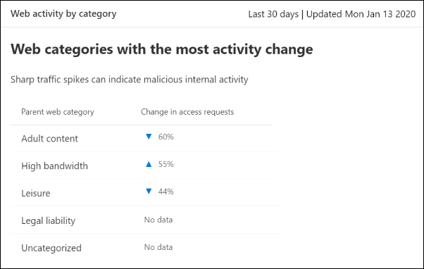

# Filtern von Webinhalten

[!INCLUDE [Microsoft 365 Defender rebranding](../../includes/microsoft-defender.md)]

**Gilt für:**
- [Microsoft Defender für Endpunkt](https://go.microsoft.com/fwlink/p/?linkid=2154037)
- [Microsoft 365 Defender](https://go.microsoft.com/fwlink/?linkid=2118804)

> [!IMPORTANT]
> **Webinhaltsfilterung befindet sich derzeit in der öffentlichen Vorschau** 
> Diese Vorschauversion wird ohne Vereinbarung zum Servicelevel bereitgestellt und wird für Produktionsworkloads nicht empfohlen. Bestimmte Features werden möglicherweise nicht unterstützt oder verfügen möglicherweise über eingeschränkte Funktionen.
> Weitere Informationen finden Sie unter [Microsoft Defender for Endpoint Preview Features](preview.md).

>Möchten Sie Microsoft Defender for Endpoint erleben? [Registrieren Sie sich für eine kostenlose Testversion.](https://www.microsoft.com/microsoft-365/windows/microsoft-defender-atp?ocid=docs-wdatp-main-abovefoldlink&rtc=1)

Die Webinhaltsfilterung ist Teil der [Webschutzfunktionen](web-protection-overview.md) in Microsoft Defender for Endpoint. Sie ermöglicht Es Ihrer Organisation, den Zugriff auf Websites basierend auf ihren Inhaltskategorien nachverfolgt und zu regeln. Viele dieser Websites sind zwar nicht bösartig, können jedoch aufgrund von Compliancebestimmungen, Bandbreitennutzung oder anderen Bedenken problematisch sein.

Konfigurieren Sie Richtlinien für alle Gerätegruppen, um bestimmte Kategorien zu blockieren. Das Blockieren einer Kategorie verhindert, dass Benutzer innerhalb angegebener Gerätegruppen auf URLs zugreifen, die der Kategorie zugeordnet sind. Für jede Kategorie, die nicht blockiert ist, werden die URLs automatisch überwacht. Ihre Benutzer können ohne Unterbrechung auf die URLs zugreifen, und Sie sammeln Zugriffsstatistiken, um eine benutzerdefiniertere Richtlinienentscheidung zu erstellen. Ihren Benutzern wird eine Sperrbenachrichtigung angezeigt, wenn ein Element auf der angezeigten Seite Aufrufe einer blockierten Ressource vor sich hat.

Die Webinhaltsfilterung ist in den wichtigsten Webbrowsern mit Blöcken verfügbar, die von Windows Defender SmartScreen (Microsoft Edge) und Network Protection (Chrome, Firefox, Brave und Opera) ausgeführt werden. Weitere Informationen zur Browserunterstützung finden Sie im Abschnitt Voraussetzungen.

Zusammenfassung der Vorteile:

- Benutzer werden am Zugriff auf Websites in blockierten Kategorien gehindert, unabhängig davon, ob sie lokal oder fern surfen
- Bereitstellen von Richtlinien für Benutzergruppen mithilfe von Gerätegruppen, die in [rollenbasierten](https://docs.microsoft.com/microsoft-365/security/defender-endpoint/rbac) Zugriffssteuerungseinstellungen von Microsoft Defender for Endpoint definiert sind
- Zugreifen auf Webberichte am gleichen zentralen Speicherort mit Sichtbarkeit über tatsächliche Blöcke und Webnutzung

## Verwendung durch den Benutzer

Die Sperrerfahrung für von Drittanbietern unterstützte Browser wird von Network Protection bereitgestellt, das ein Popup auf Systemebene bietet, das den Benutzer über eine blockierte Verbindung informiert. 

Um eine benutzerfreundlichere Browsererfahrung zu ermöglichen, sollten Sie Microsoft Edge verwenden.

## Voraussetzungen

Stellen Sie vor dem Ausprobieren dieses Features sicher, dass Die folgenden Anforderungen erfüllt sind:

- Windows 10 Enterprise E5-Lizenz ODER Microsoft 365 E3 + Microsoft 365 E5 Security-Add-On.
- Zugriff auf das Microsoft Defender Security Center-Portal
- Geräte mit Windows 10 Anniversary Update (Version 1607) oder höher mit dem neuesten MoCAMP-Update.

Wenn Windows Defender SmartScreen nicht aktiviert ist, übernimmt Network Protection die Blockierung. Es erfordert [das Aktivieren von Netzwerkschutz](enable-network-protection.md) auf dem Gerät. Chrome, Firefox, Brave und Opera sind derzeit Browser von Drittanbietern, in denen dieses Feature aktiviert ist.

## Datenverarbeitung

Wir folgen der Region, die Sie als Teil Ihrer [Microsoft Defender for Endpoint-Datenverarbeitungseinstellungen verwendet haben.](https://docs.microsoft.com/microsoft-365/security/defender-endpoint/data-storage-privacy) Ihre Daten verlassen das Rechenzentrum nicht in dieser Region. Darüber hinaus werden Ihre Daten nicht an Dritte, einschließlich unserer Datenanbieter, weitergegeben.

## Aktivieren der Webinhaltsfilterung

Wählen Sie im linken Navigationsmenü Einstellungen **> Allgemeine > Erweiterte Features aus.** Scrollen Sie nach unten, bis der Eintrag für die **Webinhaltsfilterung angezeigt wird.** Wechseln Sie zum Umschalten zu **Ein** und **Speichern der Einstellungen**.

### Konfigurieren von Webinhaltsfilterrichtlinien

Web content filtering policies specify which site categories are blocked on which device groups. Um die Richtlinien zu verwalten, wechseln Sie zu **Einstellungen > Regeln > Webinhaltsfilterung**.

Verwenden Sie den Filter, um Richtlinien zu finden, die bestimmte blockierte Kategorien enthalten oder auf bestimmte Gerätegruppen angewendet werden.

### Erstellen einer Richtlinie

So fügen Sie eine neue Richtlinie hinzu:

1. Wählen **Sie auf der** **Webinhaltsfilterseite** unter Einstellungen die Option Richtlinie hinzufügen **aus.**
2. Geben Sie einen Namen an.
3. Wählen Sie die zu blockierende Kategorie aus. Verwenden Sie das Erweiterungssymbol, um alle übergeordneten Kategorien vollständig zu erweitern und bestimmte Webinhaltskategorien auszuwählen.
4. Geben Sie den Richtlinienbereich an. Wählen Sie die Gerätegruppen aus, um anzugeben, wo die Richtlinie angewendet werden soll. Nur Geräte in den ausgewählten Gerätegruppen können nicht auf Websites in den ausgewählten Kategorien zugreifen.
5. Überprüfen Sie die Zusammenfassung, und speichern Sie die Richtlinie. Die Richtlinienaktualisierung kann bis zu 2 Stunden dauern, bis sie auf ihre ausgewählten Geräte angewendet wird.

Tipp: Sie können eine Richtlinie bereitstellen, ohne eine Kategorie in einer Gerätegruppe auswählen zu müssen. Mit dieser Aktion wird eine Nur-Überwachung-Richtlinie erstellt, damit Sie das Benutzerverhalten besser verstehen können, bevor Sie eine Sperrrichtlinie erstellen.

>[!NOTE]
>Wenn Sie gleichzeitig eine Richtlinie entfernen oder Gerätegruppen ändern, kann dies zu verzögerungen bei der Richtlinienbereitstellung führen.

>[!IMPORTANT]
>Das Blockieren der Kategorie "Uncategorized" kann zu unerwarteten und unerwünschten Ergebnissen führen.  

### Zulassen bestimmter Websites

Es ist möglich, die blockierte Kategorie in der Webinhaltsfilterung außer Kraft zu setzen, um eine einzelne Website durch Erstellen einer benutzerdefinierten Indikatorrichtlinie zu ermöglichen. Die benutzerdefinierte Indikatorrichtlinie ersetzt die Webinhaltsfilterrichtlinie, wenn sie auf die entsprechende Gerätegruppe angewendet wird.

1. Erstellen eines benutzerdefinierten Indikators im Microsoft Defender Security Center, indem Sie zu  >  **Einstellungsindikatoren**  >  **URL/Domänen-Add-Element**  >  **gehen**
2. Eingeben der Domäne der Website
3. Legen Sie die Richtlinienaktion auf **Zulassen .**  

### Melden von Ungenauigkeiten

Wenn Eine Domäne fälschlicherweise kategorisiert wurde, können Sie Ungenauigkeiten direkt über die Seite Web content filtering reports melden. Dieses Feature ist nur im neuen Microsoft 365 Security Center (security.microsoft.com).

Navigieren Sie zum Melden einer Ungenauigkeit zu Berichte **> web protection > Web Content Filtering Details > Domains**. Auf der Registerkarte Domänen unserer Web Content Filtering-Berichte wird neben jeder Domäne ein Auslassungsauslassungsblatt angezeigt. Zeigen Sie auf diese Auslassungspunkte, und wählen **Sie Ungenauigkeit melden aus.**

Ein Bereich wird geöffnet, in dem Sie die Priorität auswählen und zusätzliche Details hinzufügen können, z. B. die vorgeschlagene Kategorie für die erneute Kategorisierung. Nachdem Sie das Formular abgeschlossen haben, wählen Sie **Absenden aus.** Unser Team überprüft die Anforderung innerhalb eines Arbeitstags. Erstellen Sie zum sofortigen Aufheben der Blockierung einen [benutzerdefinierten Zulässigen Indikator](indicator-ip-domain.md).

## Webinhaltsfilterkarten und -details

Wählen **Sie Berichte > Webschutz aus,** um Karten mit Informationen zur Filterung von Webinhalten und zum Schutz vor Webbedrohungen anzuzeigen. Die folgenden Karten enthalten Zusammenfassende Informationen zur Webinhaltsfilterung.

### Webaktivität nach Kategorie

Diese Karte listet die übergeordneten Webinhaltskategorien mit der größten Zunahme oder Verringerung der Anzahl der Zugriffsversuche auf. Verstehen Sie drastische Änderungen an Webaktivitätsmustern in Ihrer Organisation seit den letzten 30 Tagen, 3 Monaten oder 6 Monaten. Wählen Sie einen Kategorienamen aus, um weitere Informationen anzeigen zu können.

In den ersten 30 Tagen nach der Verwendung dieses Features verfügt Ihre Organisation möglicherweise nicht über genügend Daten, um diese Informationen anzeigen zu können.

### Zusammenfassungskarte für die Webinhaltsfilterung

Diese Karte zeigt die Verteilung blockierter Zugriffsversuche auf die verschiedenen übergeordneten Webinhaltskategorien an. Wählen Sie einen der farbigen Balken aus, um weitere Informationen zu einer bestimmten übergeordneten Webkategorie anzeigen zu können.

### Zusammenfassungskarte für Webaktivität

Diese Karte zeigt die Gesamtzahl der Anforderungen für Webinhalte in allen URLs an.

### Anzeigen von Kartendetails

Sie können auf die **Berichtsdetails** für jede Karte zugreifen, indem Sie im Diagramm auf der Karte eine Tabellenzeile oder einen farbigen Balken auswählen. Die Berichtsdetailsepage für jede Karte enthält umfangreiche statistische Daten zu Webinhaltskategorien, Websitedomänen und Gerätegruppen.

- **Webkategorien:** Listet die Webinhaltskategorien auf, für die in Ihrer Organisation Zugriffsversuche versucht wurden. Wählen Sie eine bestimmte Kategorie aus, um ein Zusammenfassungsf flyout zu öffnen.

- **Domänen:** Listet die Webdomänen auf, auf die in Ihrer Organisation zugegriffen oder blockiert wurde. Wählen Sie eine bestimmte Domäne aus, um detaillierte Informationen zu dieser Domäne anzeigen zu können.

- **Gerätegruppen**: Listet alle Gerätegruppen auf, die Webaktivitäten in Ihrer Organisation generiert haben

Verwenden Sie den Zeitbereichsfilter oben links auf der Seite, um einen Zeitraum auszuwählen. Sie können die Informationen auch filtern oder die Spalten anpassen. Wählen Sie eine Zeile aus, um einen Flyoutbereich mit noch mehr Informationen zum ausgewählten Element zu öffnen.

## Fehler und Probleme

### Einschränkungen und bekannte Probleme in dieser Vorschau

- Nur Microsoft Edge wird unterstützt, wenn die Betriebssystemkonfiguration Ihres Geräts Server ist (cmd > Systeminfo > Betriebssystemkonfiguration). Network Protection wird nur im Inspect-Modus auf Servergeräten unterstützt, der für die Sicherung des Datenverkehrs über unterstützte Browser von Drittanbietern verantwortlich ist.

- Auf nicht zugewiesenen Geräten werden falsche Daten im Bericht angezeigt. Im Pivot "Berichtdetails" > Gerätegruppen wird möglicherweise eine Zeile mit einem leeren Feld Gerätegruppe angezeigt. Diese Gruppe enthält Ihre nicht zugewiesenen Geräte, bevor sie in Ihre angegebene Gruppe eingesenert werden. Der Bericht für diese Zeile enthält möglicherweise keine genaue Anzahl von Geräten oder Zugriffsanzahlen.

## Verwandte Themen

- [Übersicht über den Webschutz](web-protection-overview.md)
- [Schutz vor Webbedrohungen](web-threat-protection.md)
- [Überwachen der Websicherheit](web-protection-monitoring.md)
- [Reagieren auf Webbedrohungen](web-protection-response.md)
