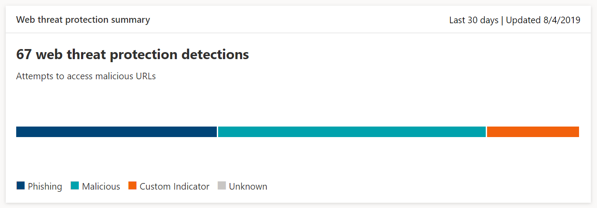

# Überwachen der Sicherheit des Browsens im WebMonitor web browsing security

[!INCLUDE [Microsoft 365 Defender rebranding](../../includes/microsoft-defender.md)]

**Gilt für:****Applies to:**
- [Microsoft Defender für EndpunktMicrosoft Defender for Endpoint](https://go.microsoft.com/fwlink/p/?linkid=2154037)
- [Microsoft 365 DefenderMicrosoft 365 Defender](https://go.microsoft.com/fwlink/?linkid=2118804)

>Möchten Sie Microsoft Defender for Endpoint erleben?Want to experience Microsoft Defender for Endpoint? [Registrieren Sie sich für eine kostenlose Testversion.Sign up for a free trial.](https://www.microsoft.com/microsoft-365/windows/microsoft-defender-atp?ocid=docs-wdatp-main-abovefoldlink&rtc=1)

Mit Dem Webschutz können Sie die Sicherheit des Webbrowsens Ihrer Organisation mithilfe von Berichten unter **Berichte > Webschutz** im Microsoft Defender Security Center überwachen.Web protection lets you monitor your organization’s web browsing security through reports under **Reports > Web protection** in the Microsoft Defender Security Center. Der Bericht enthält Karten, die Statistiken zur Erkennung von Webbedrohungen bereitstellen.The report contains cards that provide web threat detection statistics.

- **Erkennungen** von Webbedrohungen im Laufe der Zeit – diese Trendkarte zeigt die Anzahl von Webbedrohungen an, die während des ausgewählten Zeitraums vom Typ erkannt wurden (Letzte 30 Tage, Letzte 3 Monate, letzte 6 Monate)**Web threat protection detections over time** - this trending card displays the number of web threats detected by type during the selected time period (Last 30 days, Last 3 months, Last 6 months)
 
    

- **Zusammenfassung zum** Schutz von Webbedrohungen – diese Karte zeigt die gesamten Erkennungen von Webbedrohungen in den letzten 30 Tagen an und zeigt die Verteilung auf die verschiedenen Arten von Webbedrohungen an.**Web threat protection summary** - this card displays the total web threat detections in the past 30 days, showing distribution across the different types of web threats. Durch Auswählen eines Datenschnitts wird die Liste der Domänen geöffnet, die mit schädlichen oder unerwünschten Websites gefunden wurden.Selecting a slice opens the list of the domains that were found with malicious or unwanted websites.

    

>[!Note]
>Es kann bis zu 12 Stunden dauern, bis ein Block in den Karten oder in der Domänenliste angezeigt wird.It can take up to 12 hours before a block is reflected in the cards or the domain list.

## Arten von WebbedrohungenTypes of web threats

Der Webschutz kategorisiert schädliche und unerwünschte Websites wie folgt:Web protection categorizes malicious and unwanted websites as:

- **Phishing** – Websites mit gefälschten Webformularen und anderen Phishingmechanismen, die Benutzer dazu verleiten sollen, Anmeldeinformationen und andere vertrauliche Informationen zu verleiten**Phishing** - websites that contain spoofed web forms and other phishing mechanisms designed to trick users into divulging credentials and other sensitive information
- **Bösartig** – Websites, die Schadsoftware und Exploitcode hosten**Malicious** - websites that host malware and exploit code
- **Benutzerdefinierter** Indikator – Websites, deren URLs oder Domänen Sie Ihrer benutzerdefinierten Indikatorliste zum Blockieren [hinzugefügt](manage-indicators.md) haben**Custom indicator** - websites whose URLs or domains you've added to your [custom indicator list](manage-indicators.md) for blocking

## Anzeigen der DomänenlisteView the domain list

Wählen Sie auf der Sammelkarte web threat protection eine bestimmte Kategorie für **Webbedrohungen** aus, um die Seite **Domänen zu** öffnen.Select a specific web threat category in the **Web threat protection summary** card to open the **Domains** page. Auf dieser Seite wird die Liste der Domänen unter dieser Bedrohungskategorie angezeigt.This page displays the list of the domains under that threat category. Die Seite enthält die folgenden Informationen für jede Domäne:The page provides the following information for each domain:

- **Zugriffsanzahl** – Anzahl der Anforderungen für URLs in der Domäne**Access count** - number of requests for URLs in the domain
- **Blöcke** – Anzahl der blockierten Anforderungen**Blocks** - number of times requests were blocked
- **Zugriffstrend** – Änderung der Anzahl der Zugriffsversuche**Access trend** - change in number of access attempts
- **Bedrohungskategorie** – Typ der Webbedrohung**Threat category** - type of web threat
- **Geräte** – Anzahl der Geräte mit Zugriffsversuchen**Devices** - number of devices with access attempts

Wählen Sie eine Domäne aus, um die Liste der Geräte, die versucht haben, auf URLs in dieser Domäne zu zugreifen, und die Liste der URLs anzeigen.Select a domain to view the list of devices that have attempted to access URLs in that domain and the list of URLs.

## Verwandte ThemenRelated topics

- [Übersicht über InternetschutzWeb protection overview](web-protection-overview.md)
- [Internet-InhaltsfilterungWeb content filtering](web-content-filtering.md)
- [Internet-BedrohungsschutzWeb threat protection](web-threat-protection.md)
- [Reagieren auf InternetbedrohungenRespond to web threats](web-protection-response.md)
