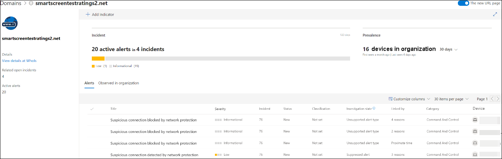

# Reagieren auf Internetbedrohungen

[!INCLUDE [Microsoft 365 Defender rebranding](../../includes/microsoft-defender.md)]

**Gilt für:**
- [Microsoft Defender für Endpunkt](https://go.microsoft.com/fwlink/p/?linkid=2154037)
- [Microsoft 365 Defender](https://go.microsoft.com/fwlink/?linkid=2118804)

>Möchten Sie Microsoft Defender for Endpoint erleben? [Registrieren Sie sich für eine kostenlose Testversion.](https://www.microsoft.com/microsoft-365/windows/microsoft-defender-atp?ocid=docs-wdatp-main-abovefoldlink&rtc=1)

Mit web protection in Microsoft Defender for Endpoint können Sie Warnungen im Zusammenhang mit schädlichen Websites und Websites in Ihrer benutzerdefinierten Indikatorliste effizient untersuchen und darauf reagieren.

## Anzeigen von Webbedrohungswarnungen
Microsoft Defender for Endpoint generiert die folgenden [Warnungen für](manage-alerts.md) böswillige oder verdächtige Webaktivitäten:
- **Verdächtige** Verbindung, die vom Netzwerkschutz blockiert wird – diese Warnung wird generiert, wenn der Versuch, auf eine schädliche Website oder eine Website in Ihrer benutzerdefinierten Indikatorliste zu zugreifen, durch den Netzwerkschutz im  *Sperrmodus beendet* wird.
- **Verdächtige** Verbindung, die vom Netzwerkschutz erkannt wird – diese Warnung wird generiert, wenn ein Versuch, auf eine schädliche Website oder eine Website in Ihrer benutzerdefinierten Indikatorliste zu zugreifen, vom Netzwerkschutz im Überwachungsmodus erkannt *wird.*

Jede Warnung enthält die folgenden Informationen: 
- Gerät, das versucht hat, auf die blockierte Website zu zugreifen
- Anwendung oder Programm zum Senden der Webanforderung
- Bösartige URL oder URL in der Liste der benutzerdefinierten Indikatoren
- Empfohlene Aktionen für Responder

>[!Note]
>Um das Volumen der Warnungen zu reduzieren, konsolidiert Microsoft Defender for Endpoint die Erkennung von Webbedrohungen für dieselbe Domäne auf demselben Gerät jeden Tag in einer einzelnen Warnung. Es wird nur eine Warnung generiert und in den [Webschutzbericht gezählt.](web-protection-monitoring.md)

## Überprüfen von Websitedetails
Sie können tiefer gehen, indem Sie die URL oder Domäne der Website in der Warnung auswählen. Dadurch wird eine Seite zu dieser bestimmten URL oder Domäne mit verschiedenen Informationen geöffnet, einschließlich:
- Geräte, die versucht haben, auf die Website zu zugreifen
- Vorfälle und Warnungen im Zusammenhang mit der Website
- Wie häufig die Website in Ereignissen in Ihrer Organisation gesehen wurde

    

[Weitere Informationen zu URL- oder Domänenentitätsseiten](investigate-domain.md)

## Überprüfen des Geräts
Sie können auch das Gerät überprüfen, das versucht hat, auf eine blockierte URL zu zugreifen. Wenn Sie den Namen des Geräts auf der Warnungsseite auswählen, wird eine Seite mit umfassenden Informationen zum Gerät geöffnet.

[Weitere Informationen zu Geräteentitätsseiten](investigate-machines.md)

## Webbrowser- und Windows-Benachrichtigungen für Endbenutzer

Mit dem Webschutz in Microsoft Defender for Endpoint werden Endbenutzer daran gehindert, schädliche oder unerwünschte Websites mit Microsoft Edge oder anderen Browsern zu besuchen. Da das Blockieren durch den [Netzwerkschutz ausgeführt wird,](network-protection.md)wird ein allgemeiner Fehler vom Webbrowser angezeigt. Außerdem wird eine Benachrichtigung von Windows angezeigt.

 *auf Microsoft Edge blockiert ist*

 *in Chrome blockiert ist*

## Verwandte Themen
- [Übersicht über Internetschutz](web-protection-overview.md)
- [Internet-Inhaltsfilterung](web-content-filtering.md)
- [Internet-Bedrohungsschutz](web-threat-protection.md)
- [Überwachen der Websicherheit](web-protection-monitoring.md)
