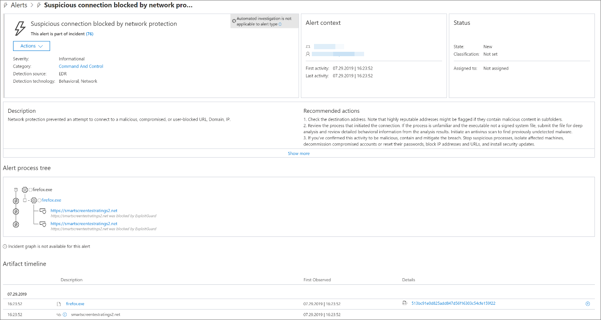

# Reagieren auf WebbedrohungenRespond to web threats

[!INCLUDE [Microsoft 365 Defender rebranding](../../includes/microsoft-defender.md)]

**Gilt für:****Applies to:**
- [Microsoft Defender für EndpunktMicrosoft Defender for Endpoint](https://go.microsoft.com/fwlink/p/?linkid=2146631)
- [Microsoft 365 DefenderMicrosoft 365 Defender](https://go.microsoft.com/fwlink/?linkid=2118804)

>Möchten Sie Microsoft Defender for Endpoint erleben?Want to experience Microsoft Defender for Endpoint? [Registrieren Sie sich für eine kostenlose Testversion.Sign up for a free trial.](https://www.microsoft.com/microsoft-365/windows/microsoft-defender-atp?ocid=docs-wdatp-main-abovefoldlink&rtc=1)

Mit web protection in Microsoft Defender for Endpoint können Sie Warnungen im Zusammenhang mit schädlichen Websites und Websites in Ihrer benutzerdefinierten Indikatorliste effizient untersuchen und darauf reagieren.Web protection in Microsoft Defender for Endpoint lets you efficiently investigate and respond to alerts related to malicious websites and websites in your custom indicator list.

## Anzeigen von WebbedrohungswarnungenView web threat alerts
Microsoft Defender for Endpoint generiert die folgenden [Warnungen für](manage-alerts.md) böswillige oder verdächtige Webaktivitäten:Microsoft Defender for Endpoint generates the following [alerts](manage-alerts.md) for malicious or suspicious web activity:
- **Verdächtige** Verbindung, die vom Netzwerkschutz blockiert wird – diese Warnung wird generiert, wenn der Versuch, auf eine schädliche Website oder eine Website in Ihrer benutzerdefinierten Indikatorliste zu zugreifen, durch den Netzwerkschutz im  *Sperrmodus beendet* wird.**Suspicious connection blocked by network protection** — this alert is generated when an attempt to access a malicious website or a website in your custom indicator list is *stopped* by network protection in *block* mode
- **Verdächtige** Verbindung, die vom Netzwerkschutz erkannt wird – diese Warnung wird generiert, wenn ein Versuch, auf eine schädliche Website oder eine Website in Ihrer benutzerdefinierten Indikatorliste zu zugreifen, vom Netzwerkschutz im Überwachungsmodus erkannt *wird.***Suspicious connection detected by network protection** — this alert is generated when an attempt to access a malicious website or a website in your custom indicator list is detected by network protection in *audit only* mode

Jede Warnung enthält die folgenden Informationen:Each alert provides the following information: 
- Gerät, das versucht hat, auf die blockierte Website zu zugreifenDevice that attempted to access the blocked website
- Anwendung oder Programm zum Senden der WebanforderungApplication or program used to send the web request
- Bösartige URL oder URL in der Liste der benutzerdefinierten IndikatorenMalicious URL or URL in the custom indicator list
- Empfohlene Aktionen für ResponderRecommended actions for responders

>[!Note]
>Um das Volumen der Warnungen zu reduzieren, konsolidiert Microsoft Defender for Endpoint die Erkennung von Webbedrohungen für dieselbe Domäne auf demselben Gerät jeden Tag in einer einzelnen Warnung.To reduce the volume of alerts, Microsoft Defender for Endpoint consolidates web threat detections for the same domain on the same device each day to a single alert. Es wird nur eine Warnung generiert und in den [Webschutzbericht gezählt.](web-protection-monitoring.md)Only one alert is generated and counted into the [web protection report](web-protection-monitoring.md).

## Überprüfen von WebsitedetailsInspect website details
Sie können tiefer gehen, indem Sie die URL oder Domäne der Website in der Warnung auswählen.You can dive deeper by selecting the URL or domain of the website in the alert. Dadurch wird eine Seite zu dieser bestimmten URL oder Domäne mit verschiedenen Informationen geöffnet, einschließlich:This opens a page about that particular URL or domain with various information, including:
- Geräte, die versucht haben, auf die Website zu zugreifenDevices that attempted to access website
- Vorfälle und Warnungen im Zusammenhang mit der WebsiteIncidents and alerts related to the website
- Wie häufig die Website in Ereignissen in Ihrer Organisation gesehen wurdeHow frequent the website was seen in events in your organization

    

[Weitere Informationen zu URL- oder DomänenentitätsseitenLearn more about URL or domain entity pages](investigate-domain.md)

## Überprüfen des GerätsInspect the device
Sie können auch das Gerät überprüfen, das versucht hat, auf eine blockierte URL zu zugreifen.You can also check the device that attempted to access a blocked URL. Wenn Sie den Namen des Geräts auf der Warnungsseite auswählen, wird eine Seite mit umfassenden Informationen zum Gerät geöffnet.Selecting the name of the device on the alert page opens a page with comprehensive information about the device.

[Weitere Informationen zu GeräteentitätsseitenLearn more about device entity pages](investigate-machines.md)

## Webbrowser- und Windows-Benachrichtigungen für EndbenutzerWeb browser and Windows notifications for end users

Mit dem Webschutz in Microsoft Defender for Endpoint werden Endbenutzer daran gehindert, schädliche oder unerwünschte Websites mit Microsoft Edge oder anderen Browsern zu besuchen.With web protection in Microsoft Defender for Endpoint, your end users will be prevented from visiting malicious or unwanted websites using Microsoft Edge or other browsers. Da das Blockieren durch den [Netzwerkschutz ausgeführt wird,](network-protection.md)wird ein allgemeiner Fehler vom Webbrowser angezeigt.Because blocking is performed by [network protection](network-protection.md), they will see a generic error from the web browser. Außerdem wird eine Benachrichtigung von Windows angezeigt.They will also see a notification from Windows.

 *auf Microsoft Edge blockiert ist*
*Web threat blocked on Microsoft Edge*

 *in Chrome blockiert ist*
*Web threat blocked on Chrome*

## Verwandte ThemenRelated topics
- [Übersicht über den WebschutzWeb protection overview](web-protection-overview.md)
- [Filtern von WebinhaltenWeb content filtering](web-content-filtering.md)
- [Schutz vor WebbedrohungenWeb threat protection](web-threat-protection.md)
- [Überwachen der WebsicherheitMonitor web security](web-protection-monitoring.md)
