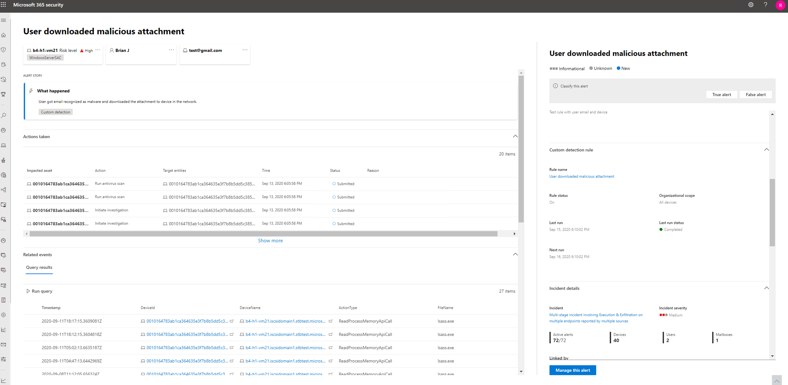

# <a name="migrate-advanced-hunting-queries-from-microsoft-defender-for-endpoint"></a>Migrieren erweiterter Suchabfragen von Microsoft Defender for Endpoint

[!INCLUDE [Microsoft 365 Defender rebranding](../includes/microsoft-defender.md)]

**Gilt für:**
- Microsoft 365 Defender

Verschieben Sie Ihre erweiterten Workflows für die Suche von Microsoft Defender for Endpoint, um mit einem umfassenderen Datensatz proaktiv nach Bedrohungen zu fahnen. In Microsoft 365 Defender erhalten Sie Zugriff auf Daten aus anderen Microsoft 365-Sicherheitslösungen, einschließlich:

- Microsoft Defender für Endpunkt
- Microsoft Defender für Office 365
- Microsoft Cloud App Security
- Microsoft Defender for Identity

>[!NOTE]
>Die meisten Microsoft Defender for Endpoint-Kunden können [Microsoft 365 Defender ohne zusätzliche Lizenzen verwenden.](prerequisites.md#licensing-requirements) Aktivieren Sie [Microsoft 365 Defender,](m365d-enable.md)um mit dem Übergang ihrer workflows für die erweiterte Suche von Defender for Endpoint zu beginnen.

Sie können ohne Auswirkungen auf ihre vorhandenen Defender for Endpoint-Workflows umwechseln. Gespeicherte Abfragen bleiben erhalten, und benutzerdefinierte Erkennungsregeln werden weiterhin ausgeführt und Warnungen generiert. Sie sind jedoch in Microsoft 365 Defender sichtbar. 

## <a name="schema-tables-in-microsoft-365-defender-only"></a>Schematabellen nur in Microsoft 365 Defender
Das [Microsoft 365 Defender Advanced Hunting-Schema](advanced-hunting-schema-tables.md) enthält zusätzliche Tabellen mit Daten aus verschiedenen Microsoft 365-Sicherheitslösungen. Die folgenden Tabellen sind nur in Microsoft 365 Defender verfügbar:

| Tabellenname | Beschreibung |
|------------|-------------|
| [AlertEvidence](advanced-hunting-alertevidence-table.md) | Dateien, IP-Adressen, URLs, Benutzer oder Geräte, die Warnungen zugeordnet sind |
| [AlertInfo](advanced-hunting-alertinfo-table.md) | Warnungen von Microsoft Defender for Endpoint, Microsoft Defender für Office 365, Microsoft Cloud App Security und Microsoft Defender for Identity, einschließlich Schweregradinformationen und Bedrohungskategorien  |
| [AppFileEvents](advanced-hunting-appfileevents-table.md) | Dateibezogene Aktivitäten in Cloud-Apps und -Diensten |
| [EmailAttachmentInfo](advanced-hunting-emailattachmentinfo-table.md) | Informationen zu Dateien, die an E-Mails angefügt sind |
| [EmailEvents](advanced-hunting-emailevents-table.md) | Microsoft 365-E-Mail-Ereignisse, einschließlich E-Mail-Zustellung und Blockieren von Ereignissen |
| [EmailPostDeliveryEvents](advanced-hunting-emailpostdeliveryevents-table.md) | Sicherheitsereignisse, die nach der Zustellung auftreten, nachdem Microsoft 365 die E-Mails an das Empfängerpostfach zugestellt hat |
| [EmailUrlInfo](advanced-hunting-emailurlinfo-table.md) | Informationen zu URLs in E-Mails |
| [IdentityDirectoryEvents](advanced-hunting-identitydirectoryevents-table.md) | Ereignisse mit einem lokalen Domänencontroller, auf dem Active Directory (AD) ausgeführt wird. Diese Tabelle enthält eine Reihe von identitätsbezogenen Ereignissen und Systemereignissen auf dem Domänencontroller. |
| [IdentityInfo](advanced-hunting-identityinfo-table.md) | Kontoinformationen aus verschiedenen Quellen, einschließlich Azure Active Directory |
| [IdentityLogonEvents](advanced-hunting-identitylogonevents-table.md) | Authentifizierungsereignisse in Active Directory und Microsoft Online Services |
| [IdentityQueryEvents](advanced-hunting-identityqueryevents-table.md) | Abfragen für Active Directory-Objekte, z. B. Benutzer, Gruppen, Geräte und Domänen |

>[!IMPORTANT]
> Abfragen und benutzerdefinierte Erkennungen, die Schematabellen verwenden, die nur in Microsoft 365 Defender verfügbar sind, können nur in Microsoft 365 Defender angezeigt werden.

## <a name="map-devicealertevents-table"></a>DeviceAlertEvents-Tabelle zuordnung
Die `AlertInfo` Tabellen und ersetzen die Tabelle im Microsoft Defender for `AlertEvidence` `DeviceAlertEvents` Endpoint-Schema. Neben Daten zu Gerätewarnungen enthalten diese beiden Tabellen Daten zu Warnungen für Identitäten, Apps und E-Mails.

Verwenden Sie die folgende Tabelle, um zu überprüfen, `DeviceAlertEvents` wie Spalten Spalten in und Tabellen `AlertInfo` `AlertEvidence` zuordnungen.

>[!TIP]
>Zusätzlich zu den Spalten in der folgenden Tabelle enthält die Tabelle viele weitere Spalten, die ein ganzheitliches Bild von Warnungen aus `AlertEvidence` verschiedenen Quellen bieten. [Alle AlertEvidence-Spalten anzeigen](advanced-hunting-alertevidence-table.md) 

| Spalte DeviceAlertEvents | Wo sie dieselben Daten in Microsoft 365 Defender finden |
|-------------|-----------|-------------|-------------|
| `AlertId` | `AlertInfo` und  `AlertEvidence` Tabellen |
| `Timestamp` | `AlertInfo` und  `AlertEvidence` Tabellen |
| `DeviceId` | `AlertEvidence` Tabelle |
| `DeviceName` | `AlertEvidence` Tabelle |
| `Severity` | `AlertInfo` Tabelle |
| `Category` | `AlertInfo` Tabelle |
| `Title` | `AlertInfo` Tabelle |
| `FileName` | `AlertEvidence` Tabelle |
| `SHA1` | `AlertEvidence` Tabelle |
| `RemoteUrl` | `AlertEvidence` Tabelle |
| `RemoteIP` | `AlertEvidence` Tabelle |
| `AttackTechniques` | `AlertInfo` Tabelle |
| `ReportId` | Diese Spalte wird in der Regel in Microsoft Defender for Endpoint verwendet, um verwandte Datensätze in anderen Tabellen zu finden. In Microsoft 365 Defender können Sie verwandte Daten direkt aus der Tabelle `AlertEvidence` erhalten. |
| `Table` | Diese Spalte wird in der Regel in Microsoft Defender for Endpoint für zusätzliche Ereignisinformationen in anderen Tabellen verwendet. In Microsoft 365 Defender können Sie verwandte Daten direkt aus der Tabelle `AlertEvidence` erhalten. |

## <a name="adjust-existing-microsoft-defender-for-endpoint-queries"></a>Anpassen vorhandener Microsoft Defender for Endpoint-Abfragen
Microsoft Defender for Endpoint-Abfragen funktionieren wie folgt, es sei denn, sie verweisen auf die `DeviceAlertEvents` Tabelle. Wenden Sie die folgenden Änderungen an, um diese Abfragen in Microsoft 365 Defender zu verwenden:

- Ersetzen `DeviceAlertEvents` Sie durch `AlertInfo` .
- Schließen Sie sich `AlertInfo` der Tabelle und den Tabellen an `AlertEvidence` `AlertId` an, um gleichwertige Daten zu erhalten.

### <a name="original-query"></a>Ursprüngliche Abfrage
Die folgende Abfrage wird `DeviceAlertEvents` in Microsoft Defender for __ Endpoint verwendet, um die Warnungen zu erhalten, diepowershell.exe:

```kusto
DeviceAlertEvents
| where Timestamp > ago(7d) 
| where AttackTechniques has "PowerShell (T1086)" and FileName == "powershell.exe"
```
### <a name="modified-query"></a>Geänderte Abfrage
Die folgende Abfrage wurde für die Verwendung in Microsoft 365 Defender angepasst. Anstatt den Dateinamen direkt aus zu überprüfen, wird der Dateiname in dieser Tabelle bei- und `DeviceAlertEvents` `AlertEvidence` überprüft.

```kusto
AlertInfo 
| where Timestamp > ago(7d) 
| where AttackTechniques has "PowerShell (T1086)" 
| join AlertEvidence on AlertId
| where FileName == "powershell.exe"
```

## <a name="migrate-custom-detection-rules"></a>Migrieren von benutzerdefinierten Erkennungsregeln

Wenn Microsoft Defender for Endpoint-Regeln in Microsoft 365 Defender bearbeitet werden, funktionieren sie weiterhin wie zuvor, wenn die resultierende Abfrage nur Gerätetabellen betrachtet. 

Beispielsweise werden Warnungen, die von benutzerdefinierten Erkennungsregeln generiert werden, die nur Gerätetabellen abfragen, weiterhin an Ihr SIEM übermittelt und E-Mail-Benachrichtigungen generiert, je nachdem, wie Sie diese in Microsoft Defender for Endpoint konfiguriert haben. Alle vorhandenen Unterdrückungsregeln in Defender for Endpoint gelten weiterhin.

Nachdem Sie eine Defender for Endpoint-Regel so bearbeitet haben, dass sie Identitäts- und E-Mail-Tabellen abfragt, die nur in Microsoft 365 Defender verfügbar sind, wird die Regel automatisch zu Microsoft 365 Defender verschoben. 

Von der migrierten Regel generierte Warnungen:

- Sind im Defender for Endpoint-Portal nicht mehr sichtbar (Microsoft Defender Security Center)
- Beenden Sie die Zugestelltung an Ihr SIEM oder generieren Sie E-Mail-Benachrichtigungen. Um diese Änderung zu ändern, konfigurieren Sie Benachrichtigungen über Microsoft 365 Defender, um die Warnungen zu erhalten. Sie können die [Microsoft 365 Defender-API](api-incident.md) verwenden, um Benachrichtigungen für Kundenerkennungswarnungen oder damit zusammenhängende Vorfälle zu erhalten.
- Wird nicht von Microsoft Defender for Endpoint-Unterdrückungsregeln unterdrückt. Um zu verhindern, dass Warnungen für bestimmte Benutzer, Geräte oder Postfächer generiert werden, ändern Sie die entsprechenden Abfragen so, dass diese Entitäten explizit ausgeschlossen werden.

Wenn Sie eine Regel auf diese Weise bearbeiten, werden Sie zur Bestätigung aufgefordert, bevor diese Änderungen angewendet werden.

Neue Warnungen, die von benutzerdefinierten Erkennungsregeln im Microsoft 365 Defender-Portal generiert werden, werden auf einer Warnungsseite angezeigt, die die folgenden Informationen enthält:

- Titel und Beschreibung der Warnung 
- Auswirkungen auf Ressourcen
- Aktionen, die als Reaktion auf die Warnung ergriffen wurden
- Abfrageergebnisse, die die Warnung ausgelöst haben 
- Informationen zur benutzerdefinierten Erkennungsregel 
 


## <a name="write-queries-without-devicealertevents"></a>Schreiben von Abfragen ohne DeviceAlertEvents

Im Microsoft 365 Defender-Schema werden die Tabellen und bereitgestellt, um die vielfältigen Informationen zu nutzen, die Warnungen aus verschiedenen `AlertInfo` `AlertEvidence` Quellen begleiten. 

Um die gleichen Warnungsinformationen zu erhalten, die Sie aus der Tabelle im Microsoft Defender for Endpoint-Schema erhalten haben, filtern Sie die Tabelle nach, und schließen Sie dann jede eindeutige ID mit der Tabelle an, die detaillierte Ereignis- und Entitätsinformationen `DeviceAlertEvents` `AlertInfo` `ServiceSource` `AlertEvidence` enthält. 

Sehen Sie sich die folgende Beispielabfrage an:

```kusto
AlertInfo
| where Timestamp > ago(7d)
| where ServiceSource == "Microsoft Defender for Endpoint"
| join AlertEvidence on AlertId
```

Diese Abfrage liefert viel mehr Spalten als `DeviceAlertEvents` im Microsoft Defender for Endpoint-Schema. Um die Ergebnisse verwaltbar zu halten, verwenden Sie, um nur die Spalten zu `project` erhalten, die Sie interessieren. Das folgende Beispiel projektiert Spalten, an denen Sie möglicherweise interessiert sind, wenn die Untersuchung die PowerShell-Aktivität erkannt hat:

```kusto
AlertInfo
| where Timestamp > ago(7d)
| where ServiceSource == "Microsoft Defender for Endpoint"
    and AttackTechniques has "powershell"
| join AlertEvidence on AlertId
| project Timestamp, Title, AlertId, DeviceName, FileName, ProcessCommandLine 
```

Wenn Sie nach bestimmten Entitäten filtern möchten, die an den Warnungen beteiligt sind, können Sie dazu den Entitätstyp und den Wert angeben, nach dem Sie `EntityType` filtern möchten. Im folgenden Beispiel wird nach einer bestimmten IP-Adresse sucht:

```kusto
AlertInfo
| where Title == "Insert_your_alert_title"
| join AlertEvidence on AlertId 
| where EntityType == "Ip" and RemoteIP == "192.88.99.01" 
```

## <a name="see-also"></a>Siehe auch
- [Microsoft 365 Defender aktivieren](advanced-hunting-query-language.md)
- [Übersicht über die erweiterte Suche](advanced-hunting-overview.md)
- [Grundlegendes zum Schema](advanced-hunting-schema-tables.md)
- [Erweiterte Suche in Microsoft Defender for Endpoint](/windows/security/threat-protection/microsoft-defender-atp/advanced-hunting-overview)