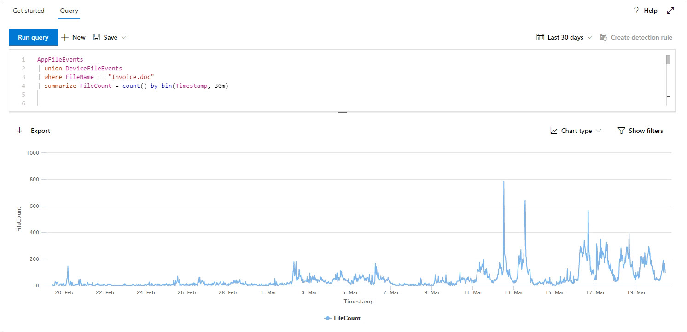

# <a name="work-with-advanced-hunting-query-results"></a><span data-ttu-id="68ea5-104">Arbeiten mit erweiterten Suchabfrageergebnissen</span><span class="sxs-lookup"><span data-stu-id="68ea5-104">Work with advanced hunting query results</span></span>

[!INCLUDE [Microsoft 365 Defender rebranding](../includes/microsoft-defender.md)]


<span data-ttu-id="68ea5-105">**Gilt für:**</span><span class="sxs-lookup"><span data-stu-id="68ea5-105">**Applies to:**</span></span>
- <span data-ttu-id="68ea5-106">Microsoft 365 Defender</span><span class="sxs-lookup"><span data-stu-id="68ea5-106">Microsoft 365 Defender</span></span>
- <span data-ttu-id="68ea5-107">Microsoft Defender für Endpunkt</span><span class="sxs-lookup"><span data-stu-id="68ea5-107">Microsoft Defender for Endpoint</span></span>

[!INCLUDE [Prerelease information](../includes/prerelease.md)]

<span data-ttu-id="68ea5-108">Während Sie Ihre [](advanced-hunting-overview.md) erweiterten Suchabfragen erstellen können, um sehr genaue Informationen zurück zu geben, können Sie auch mit den Abfrageergebnissen arbeiten, um weitere Einblicke zu erhalten und bestimmte Aktivitäten und Indikatoren zu untersuchen.</span><span class="sxs-lookup"><span data-stu-id="68ea5-108">While you can construct your [advanced hunting](advanced-hunting-overview.md) queries to return very precise information, you can also work with the query results to gain further insight and investigate specific activities and indicators.</span></span> <span data-ttu-id="68ea5-109">Sie können die folgenden Aktionen für Die Abfrageergebnisse ausführen:</span><span class="sxs-lookup"><span data-stu-id="68ea5-109">You can take the following actions on your query results:</span></span>

- <span data-ttu-id="68ea5-110">Anzeigen von Ergebnissen als Tabelle oder Diagramm</span><span class="sxs-lookup"><span data-stu-id="68ea5-110">View results as a table or chart</span></span>
- <span data-ttu-id="68ea5-111">Exportieren von Tabellen und Diagrammen</span><span class="sxs-lookup"><span data-stu-id="68ea5-111">Export tables and charts</span></span>
- <span data-ttu-id="68ea5-112">Drilldown zu detaillierten Entitätsinformationen</span><span class="sxs-lookup"><span data-stu-id="68ea5-112">Drill down to detailed entity information</span></span>
- <span data-ttu-id="68ea5-113">Optimieren Sie Ihre Abfragen direkt aus den Ergebnissen, oder wenden Sie Filter an.</span><span class="sxs-lookup"><span data-stu-id="68ea5-113">Tweak your queries directly from the results or apply filters</span></span>

## <a name="view-query-results-as-a-table-or-chart"></a><span data-ttu-id="68ea5-114">Anzeigen von Abfrageergebnissen als Tabelle oder Diagramm</span><span class="sxs-lookup"><span data-stu-id="68ea5-114">View query results as a table or chart</span></span>
<span data-ttu-id="68ea5-115">Standardmäßig zeigt die erweiterte Suche Abfrageergebnisse als tabellarische Daten an.</span><span class="sxs-lookup"><span data-stu-id="68ea5-115">By default, advanced hunting displays query results as tabular data.</span></span> <span data-ttu-id="68ea5-116">Sie können auch die gleichen Daten wie ein Diagramm anzeigen.</span><span class="sxs-lookup"><span data-stu-id="68ea5-116">You can also display the same data as a chart.</span></span> <span data-ttu-id="68ea5-117">Die erweiterte Suche unterstützt die folgenden Ansichten:</span><span class="sxs-lookup"><span data-stu-id="68ea5-117">Advanced hunting supports the following views:</span></span>

| <span data-ttu-id="68ea5-118">Ansichtstyp</span><span class="sxs-lookup"><span data-stu-id="68ea5-118">View type</span></span> | <span data-ttu-id="68ea5-119">Beschreibung</span><span class="sxs-lookup"><span data-stu-id="68ea5-119">Description</span></span> |
| -- | -- |
| <span data-ttu-id="68ea5-120">**Table**</span><span class="sxs-lookup"><span data-stu-id="68ea5-120">**Table**</span></span> | <span data-ttu-id="68ea5-121">Zeigt die Abfrageergebnisse im tabellarischen Format an</span><span class="sxs-lookup"><span data-stu-id="68ea5-121">Displays the query results in tabular format</span></span> |
| <span data-ttu-id="68ea5-122">**Säulendiagramm**</span><span class="sxs-lookup"><span data-stu-id="68ea5-122">**Column chart**</span></span> | <span data-ttu-id="68ea5-123">Rendert eine Reihe eindeutiger Elemente auf der X-Achse als vertikale Balken, deren Höhen numerische Werte aus einem anderen Feld darstellen</span><span class="sxs-lookup"><span data-stu-id="68ea5-123">Renders a series of unique items on the x-axis as vertical bars whose heights represent numeric values from another field</span></span> |
| <span data-ttu-id="68ea5-124">**Gestapelte Säulendiagramm**</span><span class="sxs-lookup"><span data-stu-id="68ea5-124">**Stacked column chart**</span></span> | <span data-ttu-id="68ea5-125">Rendert eine Reihe eindeutiger Elemente auf der X-Achse als gestapelte vertikale Balken, deren Höhen numerische Werte aus einem oder mehreren anderen Feldern darstellen</span><span class="sxs-lookup"><span data-stu-id="68ea5-125">Renders a series of unique items on the x-axis as stacked vertical bars whose heights represent numeric values from one or more other fields</span></span> |
| <span data-ttu-id="68ea5-126">**Kreisdiagramm**</span><span class="sxs-lookup"><span data-stu-id="68ea5-126">**Pie chart**</span></span> | <span data-ttu-id="68ea5-127">Rendert Abschnitts-Kreise, die eindeutige Elemente darstellen.</span><span class="sxs-lookup"><span data-stu-id="68ea5-127">Renders sectional pies representing unique items.</span></span> <span data-ttu-id="68ea5-128">Die Größe der einzelnen Kreise stellt numerische Werte aus einem anderen Feld dar.</span><span class="sxs-lookup"><span data-stu-id="68ea5-128">The size of each pie represents numeric values from another field.</span></span> |
| <span data-ttu-id="68ea5-129">**Donut-Diagramm**</span><span class="sxs-lookup"><span data-stu-id="68ea5-129">**Donut chart**</span></span> | <span data-ttu-id="68ea5-130">Rendert Abschnittsbögen, die eindeutige Elemente darstellen.</span><span class="sxs-lookup"><span data-stu-id="68ea5-130">Renders sectional arcs representing unique items.</span></span> <span data-ttu-id="68ea5-131">Die Länge jedes Bogens stellt numerische Werte aus einem anderen Feld dar.</span><span class="sxs-lookup"><span data-stu-id="68ea5-131">The length of each arc represents numeric values from another field.</span></span> |
| <span data-ttu-id="68ea5-132">**Liniendiagramm**</span><span class="sxs-lookup"><span data-stu-id="68ea5-132">**Line chart**</span></span> | <span data-ttu-id="68ea5-133">Zeichnet numerische Werte für eine Reihe eindeutiger Elemente und verbindet die plotten Werte.</span><span class="sxs-lookup"><span data-stu-id="68ea5-133">Plots numeric values for a series of unique items and connects the plotted values</span></span> |
| <span data-ttu-id="68ea5-134">**Punktdiagramm**</span><span class="sxs-lookup"><span data-stu-id="68ea5-134">**Scatter chart**</span></span> | <span data-ttu-id="68ea5-135">Zeichnet numerische Werte für eine Reihe eindeutiger Elemente</span><span class="sxs-lookup"><span data-stu-id="68ea5-135">Plots numeric values for a series of unique items</span></span> |
| <span data-ttu-id="68ea5-136">**Flächendiagramm**</span><span class="sxs-lookup"><span data-stu-id="68ea5-136">**Area chart**</span></span> | <span data-ttu-id="68ea5-137">Zeichnet numerische Werte für eine Reihe eindeutiger Elemente und füllt die Abschnitte unterhalb der dargestellten Werte aus.</span><span class="sxs-lookup"><span data-stu-id="68ea5-137">Plots numeric values for a series of unique items and fills the sections below the plotted values</span></span> |

### <a name="construct-queries-for-effective-charts"></a><span data-ttu-id="68ea5-138">Erstellen von Abfragen für effektive Diagramme</span><span class="sxs-lookup"><span data-stu-id="68ea5-138">Construct queries for effective charts</span></span>
<span data-ttu-id="68ea5-139">Beim Rendern von Diagrammen identifiziert die erweiterte Suche automatisch die von Interesse interessierten Spalten und die numerischen Werte, die aggregiert werden sollen.</span><span class="sxs-lookup"><span data-stu-id="68ea5-139">When rendering charts, advanced hunting automatically identifies columns of interest and the numeric values to aggregate.</span></span> <span data-ttu-id="68ea5-140">Um aussagekräftige Diagramme zu erhalten, erstellen Sie Ihre Abfragen, um die spezifischen Werte zurück zu geben, die visualisiert angezeigt werden möchten.</span><span class="sxs-lookup"><span data-stu-id="68ea5-140">To get meaningful charts, construct your queries to return the specific values you want to see visualized.</span></span> <span data-ttu-id="68ea5-141">Hier sind einige Beispielabfragen und die resultierenden Diagramme.</span><span class="sxs-lookup"><span data-stu-id="68ea5-141">Here are some sample queries and the resulting charts.</span></span>

#### <a name="alerts-by-severity"></a><span data-ttu-id="68ea5-142">Warnungen nach Schweregrad</span><span class="sxs-lookup"><span data-stu-id="68ea5-142">Alerts by severity</span></span>
<span data-ttu-id="68ea5-143">Verwenden Sie den Operator, um eine numerische Anzahl der Werte zu `summarize` erhalten, die Sie diagrammen möchten.</span><span class="sxs-lookup"><span data-stu-id="68ea5-143">Use the `summarize` operator to obtain a numeric count of the values you want to chart.</span></span> <span data-ttu-id="68ea5-144">Die folgende Abfrage verwendet den Operator, um die Anzahl der Warnungen nach `summarize` Schweregrad zu erhalten.</span><span class="sxs-lookup"><span data-stu-id="68ea5-144">The query below uses the `summarize` operator to get the number of alerts by severity.</span></span>

```kusto
AlertInfo
| summarize Total = count() by Severity
```
<span data-ttu-id="68ea5-145">Beim Rendern der Ergebnisse zeigt ein Spaltendiagramm jeden Schweregrad als separate Spalte an:</span><span class="sxs-lookup"><span data-stu-id="68ea5-145">When rendering the results, a column chart displays each severity value as a separate column:</span></span>

<span data-ttu-id="68ea5-146">
 *als Spaltendiagramm angezeigt werden*</span><span class="sxs-lookup"><span data-stu-id="68ea5-146">
*Query results for alerts by severity displayed as a column chart*</span></span>

#### <a name="alert-severity-by-operating-system"></a><span data-ttu-id="68ea5-147">Warnungsschweregrad nach Betriebssystem</span><span class="sxs-lookup"><span data-stu-id="68ea5-147">Alert severity by operating system</span></span>
<span data-ttu-id="68ea5-148">Sie können den Operator auch `summarize` verwenden, um Ergebnisse für die Diagrammwerte aus mehreren Feldern vorzubereiten.</span><span class="sxs-lookup"><span data-stu-id="68ea5-148">You could also use the `summarize` operator to prepare results for charting values from multiple fields.</span></span> <span data-ttu-id="68ea5-149">Sie sollten beispielsweise wissen, wie Warnungsschweregrade auf betriebssystemübergreifend verteilt werden.</span><span class="sxs-lookup"><span data-stu-id="68ea5-149">For example, you might want to understand how alert severities are distributed across operating systems (OS).</span></span> 

<span data-ttu-id="68ea5-150">Die folgende Abfrage verwendet einen Operator, um Betriebssysteminformationen aus der Tabelle zu ziehen, und verwendet dann die Anzahl von Werten in den Spalten und `join` `DeviceInfo` in den `summarize` `OSPlatform` `Severity` Spalten:</span><span class="sxs-lookup"><span data-stu-id="68ea5-150">The query below uses a `join` operator to pull in OS information from the `DeviceInfo` table, and then uses `summarize` to count values in both the `OSPlatform` and `Severity` columns:</span></span>

```kusto
AlertInfo
| join AlertEvidence on AlertId
| join DeviceInfo on DeviceId
| summarize Count = count() by OSPlatform, Severity 
```
<span data-ttu-id="68ea5-151">Diese Ergebnisse werden am besten mithilfe eines gestapelten Säulendiagramms visualisiert:</span><span class="sxs-lookup"><span data-stu-id="68ea5-151">These results are best visualized using a stacked column chart:</span></span>

<span data-ttu-id="68ea5-152">
 *gestapeltes Diagramm angezeigt werden*</span><span class="sxs-lookup"><span data-stu-id="68ea5-152">
*Query results for alerts by OS and severity displayed as a stacked chart*</span></span>

#### <a name="phishing-emails-across-top-ten-sender-domains"></a><span data-ttu-id="68ea5-153">Phishing-E-Mails in den top 10 Absenderdomänen</span><span class="sxs-lookup"><span data-stu-id="68ea5-153">Phishing emails across top ten sender domains</span></span>
<span data-ttu-id="68ea5-154">Wenn Sie es mit einer Liste von Werten zu tun haben, die nicht endlich ist, können Sie den Operator verwenden, um nur die Werte mit den meisten `Top` Instanzen zu diagrammieren.</span><span class="sxs-lookup"><span data-stu-id="68ea5-154">If you're dealing with a list of values that isn’t finite, you can use the `Top` operator to chart only the values with the most instances.</span></span> <span data-ttu-id="68ea5-155">Um beispielsweise die zehn häufigsten Absenderdomänen mit den meisten Phishing-E-Mails zu erhalten, verwenden Sie die folgende Abfrage:</span><span class="sxs-lookup"><span data-stu-id="68ea5-155">For example, to get the top ten sender domains with the most phishing emails, use the query below:</span></span>

```kusto
EmailEvents
| where ThreatTypes has "Phish" 
| summarize Count = count() by SenderFromDomain 
| top 10 by Count
```
<span data-ttu-id="68ea5-156">Verwenden Sie die Kreisdiagrammansicht, um die Verteilung über die obersten Domänen effektiv zu zeigen:</span><span class="sxs-lookup"><span data-stu-id="68ea5-156">Use the pie chart view to effectively show distribution across the top domains:</span></span>

<span data-ttu-id="68ea5-157">
 *auf die Domänen mit den meisten Absendern zeigt*</span><span class="sxs-lookup"><span data-stu-id="68ea5-157">
*Pie chart showing distribution of phishing emails across top sender domains*</span></span>

#### <a name="file-activities-over-time"></a><span data-ttu-id="68ea5-158">Dateiaktivitäten im Laufe der Zeit</span><span class="sxs-lookup"><span data-stu-id="68ea5-158">File activities over time</span></span>
<span data-ttu-id="68ea5-159">Mithilfe des Operators mit der Funktion können Sie im Laufe der Zeit nach Ereignissen mit `summarize` `bin()` einem bestimmten Indikator suchen.</span><span class="sxs-lookup"><span data-stu-id="68ea5-159">Using the `summarize` operator with the `bin()` function, you can check for events involving a particular indicator over time.</span></span> <span data-ttu-id="68ea5-160">Die folgende Abfrage zählt Ereignisse, die die Datei in Intervallen von 30 Minuten enthalten, um Spitzen der Aktivität im Zusammenhang mit `invoice.doc` dieser Datei zu zeigen:</span><span class="sxs-lookup"><span data-stu-id="68ea5-160">The query below counts events involving the file `invoice.doc` at 30 minute intervals to show spikes in activity related to that file:</span></span>

```kusto
AppFileEvents
| union DeviceFileEvents
| where FileName == "invoice.doc"
| summarize FileCount = count() by bin(Timestamp, 30m)
```
<span data-ttu-id="68ea5-161">Das folgende Liniendiagramm zeigt deutlich Zeiträume mit mehr Aktivität `invoice.doc` an:</span><span class="sxs-lookup"><span data-stu-id="68ea5-161">The line chart below clearly highlights time periods with more activity involving `invoice.doc`:</span></span> 

<span data-ttu-id="68ea5-162">
 *Zeit enthalten*</span><span class="sxs-lookup"><span data-stu-id="68ea5-162">
*Line chart showing the number of events involving a file over time*</span></span>


## <a name="export-tables-and-charts"></a><span data-ttu-id="68ea5-163">Exportieren von Tabellen und Diagrammen</span><span class="sxs-lookup"><span data-stu-id="68ea5-163">Export tables and charts</span></span>
<span data-ttu-id="68ea5-164">Wählen Sie nach dem Ausführen einer Abfrage **Exportieren** aus, um die Ergebnisse in der lokalen Datei zu speichern.</span><span class="sxs-lookup"><span data-stu-id="68ea5-164">After running a query, select **Export** to save the results to local file.</span></span> <span data-ttu-id="68ea5-165">Die ausgewählte Ansicht bestimmt, wie die Ergebnisse exportiert werden:</span><span class="sxs-lookup"><span data-stu-id="68ea5-165">Your chosen view determines how the results are exported:</span></span>

- <span data-ttu-id="68ea5-166">**Tabellenansicht** : Die Abfrageergebnisse werden in tabellarischer Form als Microsoft Excel exportiert.</span><span class="sxs-lookup"><span data-stu-id="68ea5-166">**Table view** — the query results are exported in tabular form as a Microsoft Excel workbook</span></span>
- <span data-ttu-id="68ea5-167">**Jedes Diagramm** – die Abfrageergebnisse werden als JPEG-Bild des gerenderten Diagramms exportiert.</span><span class="sxs-lookup"><span data-stu-id="68ea5-167">**Any chart** — the query results are exported as a JPEG image of the rendered chart</span></span>

## <a name="drill-down-from-query-results"></a><span data-ttu-id="68ea5-168">Drilldown aus Abfrageergebnissen</span><span class="sxs-lookup"><span data-stu-id="68ea5-168">Drill down from query results</span></span>
<span data-ttu-id="68ea5-169">Um einen Datensatz in den Abfrageergebnissen schnell zu überprüfen, wählen Sie die entsprechende Zeile aus, um den **Datensatzbereich** überprüfen zu öffnen.</span><span class="sxs-lookup"><span data-stu-id="68ea5-169">To quickly inspect a record in your query results, select the corresponding row to open the **Inspect record** panel.</span></span> <span data-ttu-id="68ea5-170">Der Bereich stellt die folgenden Informationen basierend auf dem ausgewählten Datensatz zur Verfügung:</span><span class="sxs-lookup"><span data-stu-id="68ea5-170">The panel provides the following information based on the selected record:</span></span>

- <span data-ttu-id="68ea5-171">**Assets** – zusammengefasste Ansicht der wichtigsten Objekte (Postfächer, Geräte und Benutzer), die in dem Datensatz enthalten sind, bereichert mit verfügbaren Informationen, z. B. Risiko- und Risikostufen</span><span class="sxs-lookup"><span data-stu-id="68ea5-171">**Assets** — summarized view of the main assets (mailboxes, devices, and users) found in the record, enriched with available information, such as risk and exposure levels</span></span>
- <span data-ttu-id="68ea5-172">**Prozessstruktur** – für Datensätze mit Prozessinformationen generiert und mithilfe verfügbarer Kontextinformationen bereichert; Im Allgemeinen können Abfragen, die mehr Spalten zurückgeben, zu reichhaltigeren Prozessstrukturen führen.</span><span class="sxs-lookup"><span data-stu-id="68ea5-172">**Process tree** — generated for records with process information and enriched using available contextual information; in general, queries that return more columns can result in richer process trees.</span></span>
- <span data-ttu-id="68ea5-173">**Alle Details** – alle Werte aus den Spalten im Datensatz</span><span class="sxs-lookup"><span data-stu-id="68ea5-173">**All details** — all the values from the columns in the record</span></span>  


<span data-ttu-id="68ea5-175">Wenn Sie weitere Informationen zu einer bestimmten Entität in Den Abfrageergebnissen anzeigen möchten, z. B. einen Computer, eine Datei, einen Benutzer, eine IP-Adresse oder eine URL, wählen Sie die Entitäts-ID aus, um eine detaillierte Profilseite für diese Entität zu öffnen.</span><span class="sxs-lookup"><span data-stu-id="68ea5-175">To view more information about a specific entity in your query results, such as a machine, file, user, IP address, or URL, select the entity identifier to open a detailed profile page for that entity.</span></span>

## <a name="tweak-your-queries-from-the-results"></a><span data-ttu-id="68ea5-176">Optimieren von Abfragen aus den Ergebnissen</span><span class="sxs-lookup"><span data-stu-id="68ea5-176">Tweak your queries from the results</span></span>
<span data-ttu-id="68ea5-177">Klicken Sie mit der rechten Maustaste auf einen Wert im Resultset, um die Abfrage schnell zu erweitern.</span><span class="sxs-lookup"><span data-stu-id="68ea5-177">Right-click a value in the result set to quickly enhance your query.</span></span> <span data-ttu-id="68ea5-178">Sie können die folgenden Optionen für Folgendes verwenden:</span><span class="sxs-lookup"><span data-stu-id="68ea5-178">You can use the options to:</span></span>

- <span data-ttu-id="68ea5-179">Explizites Suchen nach dem ausgewählten Wert (`==`)</span><span class="sxs-lookup"><span data-stu-id="68ea5-179">Explicitly look for the selected value (`==`)</span></span>
- <span data-ttu-id="68ea5-180">Ausschließen des ausgewählten Werts aus der Abfrage (`!=`)</span><span class="sxs-lookup"><span data-stu-id="68ea5-180">Exclude the selected value from the query (`!=`)</span></span>
- <span data-ttu-id="68ea5-181">Abrufen weiterer erweiterter Operatoren zum Hinzufügen des Werts zu Ihrer Abfrage, z. B. `contains`, `starts with` und `ends with`</span><span class="sxs-lookup"><span data-stu-id="68ea5-181">Get more advanced operators for adding the value to your query, such as `contains`, `starts with` and `ends with`</span></span> 


## <a name="filter-the-query-results"></a><span data-ttu-id="68ea5-183">Filtern der Abfrageergebnisse</span><span class="sxs-lookup"><span data-stu-id="68ea5-183">Filter the query results</span></span>
<span data-ttu-id="68ea5-184">Die rechts angezeigten Filter bieten eine Zusammenfassung des Resultsets.</span><span class="sxs-lookup"><span data-stu-id="68ea5-184">The filters displayed to the right provide a summary of the result set.</span></span> <span data-ttu-id="68ea5-185">Jede Spalte verfügt über einen eigenen Abschnitt, in dem die für diese Spalte und die Anzahl der Instanzen eindeutigen Werte aufgelistet werden.</span><span class="sxs-lookup"><span data-stu-id="68ea5-185">Each column has its own section that lists the distinct values found for that column and the number of instances.</span></span>

<span data-ttu-id="68ea5-186">Verfeinern Sie Ihre Abfrage, indem Sie die Schaltflächen oder für die Werte auswählen, die Sie ein- oder ausschließen möchten, und wählen Sie `+` `-` dann Abfrage ausführen **aus.**</span><span class="sxs-lookup"><span data-stu-id="68ea5-186">Refine your query by selecting the `+` or `-` buttons on the values that you want to include or exclude and then selecting **Run query**.</span></span>


<span data-ttu-id="68ea5-188">Sobald der Filter zum Ändern der Abfrage angewendet und die Abfrage ausgeführt wurde, werden die Ergebnisse entsprechend aktualisiert.</span><span class="sxs-lookup"><span data-stu-id="68ea5-188">Once you apply the filter to modify the query and then run the query, the results are updated accordingly.</span></span>

>[!NOTE]
><span data-ttu-id="68ea5-189">Einige Tabellen in diesem Artikel sind möglicherweise nicht in Microsoft Defender for Endpoint verfügbar.</span><span class="sxs-lookup"><span data-stu-id="68ea5-189">Some tables in this article might not be available in Microsoft Defender for Endpoint.</span></span> <span data-ttu-id="68ea5-190">[Aktivieren Sie Microsoft 365 Defender,](m365d-enable.md) um bedrohungen mithilfe von weiteren Datenquellen nach Bedrohungen zu fahnen.</span><span class="sxs-lookup"><span data-stu-id="68ea5-190">[Turn on Microsoft 365 Defender](m365d-enable.md) to hunt for threats using more data sources.</span></span> <span data-ttu-id="68ea5-191">Sie können Ihre workflows für die erweiterte Suche von Microsoft Defender for Endpoint zu Microsoft 365 Defender verschieben, indem Sie die Schritte unter [Migrate advanced hunting queries from Microsoft Defender for Endpoint ausführen.](advanced-hunting-migrate-from-mde.md)</span><span class="sxs-lookup"><span data-stu-id="68ea5-191">You can move your advanced hunting workflows from Microsoft Defender for Endpoint to Microsoft 365 Defender by following the steps in [Migrate advanced hunting queries from Microsoft Defender for Endpoint](advanced-hunting-migrate-from-mde.md).</span></span>

## <a name="related-topics"></a><span data-ttu-id="68ea5-192">Verwandte Themen</span><span class="sxs-lookup"><span data-stu-id="68ea5-192">Related topics</span></span>
- [<span data-ttu-id="68ea5-193">Übersicht über die erweiterte Suche</span><span class="sxs-lookup"><span data-stu-id="68ea5-193">Advanced hunting overview</span></span>](advanced-hunting-overview.md)
- [<span data-ttu-id="68ea5-194">Lernen der Abfragesprache</span><span class="sxs-lookup"><span data-stu-id="68ea5-194">Learn the query language</span></span>](advanced-hunting-query-language.md)
- [<span data-ttu-id="68ea5-195">Verwenden freigegebener Abfragen</span><span class="sxs-lookup"><span data-stu-id="68ea5-195">Use shared queries</span></span>](advanced-hunting-shared-queries.md)
- [<span data-ttu-id="68ea5-196">Suche über Geräte, E-Mails, Apps und Identitäten hinweg</span><span class="sxs-lookup"><span data-stu-id="68ea5-196">Hunt across devices, emails, apps, and identities</span></span>](advanced-hunting-query-emails-devices.md)
- [<span data-ttu-id="68ea5-197">Grundlegendes zum Schema</span><span class="sxs-lookup"><span data-stu-id="68ea5-197">Understand the schema</span></span>](advanced-hunting-schema-tables.md)
- [<span data-ttu-id="68ea5-198">Anwenden bewährter Methoden für Abfragen</span><span class="sxs-lookup"><span data-stu-id="68ea5-198">Apply query best practices</span></span>](advanced-hunting-best-practices.md)
- [<span data-ttu-id="68ea5-199">Benutzerdefinierte Erkennungen – Übersicht</span><span class="sxs-lookup"><span data-stu-id="68ea5-199">Custom detections overview</span></span>](custom-detections-overview.md)
