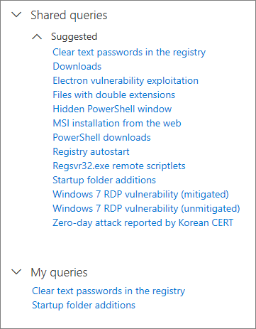

# Verwenden von freigegebenen Abfragen bei der erweiterten Suche

[!INCLUDE [Microsoft 365 Defender rebranding](../includes/microsoft-defender.md)]

**Gilt für:**
- Microsoft 365 Defender
- Microsoft Defender für Endpunkt

[Erweiterte Suche](advanced-hunting-overview.md)-Abfragen können von Benutzern derselben Organisation geteilt werden. Sie können öffentlich freigegebene Abfragen auch auf GitHub finden. Mit diesen Abfragen können Sie bestimmte Bedrohungsszenarien schnell verfolgen, ohne dass Sie Abfragen von Grund auf neu erstellen müssen.

## Speichern, Ändern und Freigeben einer Abfrage
Sie können eine neue oder vorhandene Abfrage so speichern, dass Sie nur für Sie zugänglich oder für andere Benutzer in Ihrer Organisation freigegeben ist. 

1. Erstellen oder Ändern einer Abfrage. 

2. Klicken Sie auf die Dropdownschaltfläche **Abfrage speichern**, und wählen Sie **Speichern unter** aus.
    
3. Geben Sie einen Namen für die Abfrage ein. 

   

4. Wählen Sie den Ordner aus, in dem Sie die Abfrage speichern möchten.
    - **Freigegebene Abfragen** – für alle Benutzer in Ihrer Organisation freigegeben
    - **Meine Abfragen** – nur für Sie zugänglich
    
5. Klicken Sie auf **Speichern**. 

## Löschen oder Umbenennen einer Abfrage
1. Klicken Sie mit der rechten Maustaste auf eine Abfrage, die Sie umbenennen oder löschen möchten.

    

2. Wählen Sie **Löschen** aus, und bestätigen Sie Löschung. Oder wählen Sie **Umbenennen** aus und geben Sie einen neuen Namen für die Abfrage ein.

## Erstellen eines direkten Links zu einer Abfrage
Um einen Link zu generieren, der Ihre Abfrage direkt im Editor für erweiterte Suchabfragen öffnet, müssen Sie Ihre Abfrage abschließend ausführen und link **freigeben auswählen.**

## Access-Abfragen im GitHub-Repository  
Microsoft-Sicherheitsexperten Teilen regelmäßig Abfragen zur erweiterten Suche in einem [dazu vorgesehenen öffentlichen Repository auf GitHub](https://aka.ms/hunting-queries). Dieses Repository ist für Beiträge geöffnet. Um dazu beizutragen, [treten Sie GitHub kostenlos bei](https://github.com/).

>[!tip]
>Microsoft-Sicherheitsexperten stellen zudem Abfragen zur erweiterten Suche bereit, mit denen Sie Aktivitäten und Indikatoren finden können, die mit neuen Bedrohungen verbunden sind. Diese Abfragen werden als Bestandteil der [Bedrohungsanalyse](/windows/security/threat-protection/microsoft-defender-atp/threat-analytics)-Berichte im Microsoft Defender Security Center bereitgestellt.

>[!NOTE]
>Einige Tabellen in diesem Artikel sind möglicherweise nicht in Microsoft Defender for Endpoint verfügbar. [Aktivieren Sie Microsoft 365 Defender,](m365d-enable.md) um bedrohungen mithilfe von weiteren Datenquellen nach Bedrohungen zu fahnen. Sie können Ihre workflows für die erweiterte Suche von Microsoft Defender for Endpoint zu Microsoft 365 Defender verschieben, indem Sie die Schritte unter [Migrate advanced hunting queries from Microsoft Defender for Endpoint ausführen.](advanced-hunting-migrate-from-mde.md)

## Verwandte Themen
- [Übersicht über die erweiterte Suche](advanced-hunting-overview.md)
- [Lernen der Abfragesprache](advanced-hunting-query-language.md)
- [Arbeiten mit Abfrageergebnissen](advanced-hunting-query-results.md)
- [Suche über Geräte, E-Mails, Apps und Identitäten hinweg](advanced-hunting-query-emails-devices.md)
- [Grundlegendes zum Schema](advanced-hunting-schema-tables.md)
- [Anwenden bewährter Methoden für Abfragen](advanced-hunting-best-practices.md)