# Konfigurieren von Microsoft 365 Defender-Säulen für Ihre Testumgebung oder Pilotumgebung

[!INCLUDE [Microsoft 365 Defender rebranding](../includes/microsoft-defender.md)]

**Gilt für:**
- Microsoft 365 Defender

Das Erstellen einer Microsoft 365 Defender-Testumgebung oder Pilotumgebung und deren Bereitstellung ist ein drei phasenweiser Prozess:

| [Phase 1: Vorbereiten](prepare-m365d-eval.md) | [Phase 2: Einrichten](setup-m365deval.md) | Phase 3: Onboarding |  [Zurück zum Testspielbuch](m365d-pilot.md) |
|--|--|--|--|
|| |*Sie sind hier!* | |

Sie sind derzeit in der Konfigurationsphase.

Die Vorbereitung ist der Schlüssel zu jeder erfolgreichen Bereitstellung. In diesem Artikel werden Sie zu den Punkten geführt, die Sie bei der Vorbereitung der Bereitstellung von Microsoft Defender for Endpoint berücksichtigen müssen.

## Microsoft 365 Defender-Säulen
Microsoft 365 Defender besteht aus vier Säulen. Obwohl eine Säule bereits einen Mehrwert für die Sicherheit Ihrer Netzwerkorganisation bieten kann, bietet das Aktivieren der vier Microsoft 365 Defender-Säulen Ihrer Organisation den größten Nutzen.

In diesem Abschnitt werden Sie beim Konfigurieren von:
-   Microsoft Defender für Office 365
-   Microsoft Defender for Identity 
-   Microsoft Cloud App Security
-   Microsoft Defender für Endpunkt

## Konfigurieren von Microsoft Defender für Office 365

>[!NOTE]
>Überspringen Sie diesen Schritt, wenn Sie Defender für Office 365 bereits aktiviert haben. 

Es gibt ein PowerShell-Modul namens *Office 365 Advanced Threat Protection Recommended Configuration Analyzer (ORCA),* das einige dieser Einstellungen bestimmt. Wenn get-ORCAReport als Administrator in Ihrem Mandanten ausgeführt wird, wird eine Bewertung der Antispam-, Antispam- und anderen Nachrichtenhygieneeinstellungen generiert. Sie können dieses Modul von https://www.powershellgallery.com/packages/ORCA/ herunterladen. 

1. Navigieren Sie [zu Office 365 Security & Compliance Center](https://protection.office.com/homepage)Threat  >  **Management**  >  **Policy**.

   
 
2. Klicken **Sie auf Antiphishing,** wählen **Sie Erstellen** aus, und geben Sie den Richtliniennamen und die Beschreibung ein. Klicken Sie auf **Weiter**.

   

   > [!NOTE]
   > Bearbeiten Sie Ihre Erweiterte Antiphishingrichtlinie in Microsoft Defender für Office 365. Ändern **des erweiterten Phishingschwellenwerts** **auf 2 – Aggressiv**.

3. Klicken Sie **auf das Dropdownmenü** Bedingung hinzufügen, und wählen Sie Ihre Domäne als Empfängerdomäne aus. Klicken Sie auf **Weiter**.

   
 
4. Überprüfen Sie Ihre Einstellungen. Klicken **Sie auf Diese Richtlinie erstellen,** um dies zu bestätigen. 

   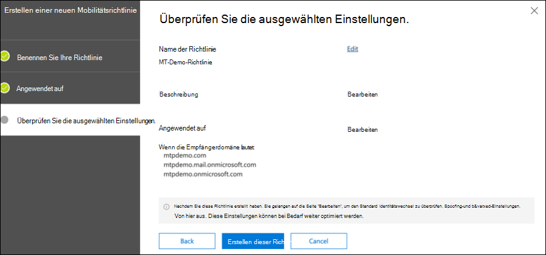
 
5. Wählen **Sie Sichere Anlagen** aus, und wählen Sie die Option **ATP für SharePoint, OneDrive** und Microsoft Teams aktivieren aus.

   

6. Klicken Sie auf das Symbol +, um eine neue Richtlinie für sichere Anlagen zu erstellen, und wenden Sie sie als Empfängerdomäne auf Ihre Domänen an. Klicken Sie auf **Speichern**.

   
 
7. Wählen Sie als Nächstes die Richtlinie für **sichere** Links aus, und klicken Sie dann auf das Stiftsymbol, um die Standardrichtlinie zu bearbeiten.

8. Stellen Sie sicher, dass die Option Nicht **nachverfolgen, wenn** Benutzer auf sichere Links klicken, nicht ausgewählt ist, während die restlichen Optionen ausgewählt sind. Weitere [Informationen finden Sie unter Einstellungen für sichere](/microsoft-365/security/office-365-security/recommended-settings-for-eop-and-office365) Links. Klicken Sie auf **Speichern**. 

   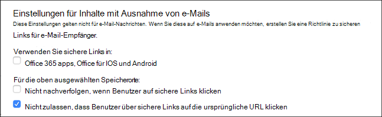

9. Wählen Sie als Nächstes **die Richtlinie An malware** aus, wählen Sie die Standardeinstellung aus, und wählen Sie das Stiftsymbol aus.

10. Klicken **Sie auf** Einstellungen, und wählen Sie Ja aus, und verwenden Sie den Standardbenachrichtigungstext, um die Reaktion auf  **schadsoftwareerkennung zu aktivieren.** Aktivieren Sie **den Filter für allgemeine Anlagentypen.** Klicken Sie auf **Speichern**.

    
  
11. Navigieren Sie [zu Office 365 Security & Compliance Center](https://protection.office.com/homepage)Search  >  **Audit** log  >  **search,** und aktivieren Sie die Überwachung.

    

12. Integrieren Sie Microsoft Defender für Office 365 in Microsoft Defender for Endpoint. Navigieren Sie [zu Office 365 Security & Compliance Center](https://protection.office.com/homepage)Threat Management Explorer, und wählen Sie microsoft Defender for Endpoint Settings in der oberen rechten Ecke des  >    >   Bildschirms aus.  Aktivieren Sie im Dialogfeld Verbindung mit Defender for Endpoint die Verbindung **mit Microsoft Defender for Endpoint verbinden.**

    

## Konfigurieren von Microsoft Defender for Identity

>[!NOTE]
>Überspringen Sie diesen Schritt, wenn Sie Microsoft Defender for Identity bereits aktiviert haben.

1. Navigieren Sie [zu Microsoft 365 Security Center,](https://security.microsoft.com/info) > Weitere **Ressourcen** Microsoft Defender for  >  **Identity auswählen.**

   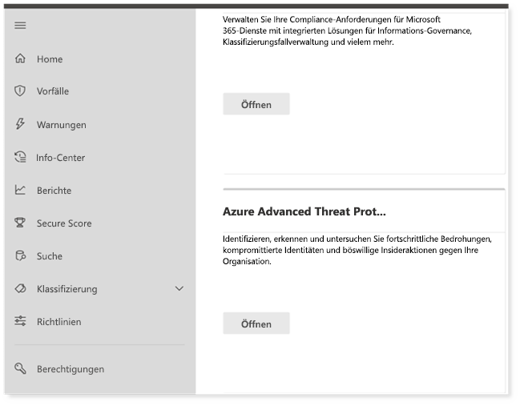

2. Klicken **Sie auf Erstellen,** um den Microsoft Defender for Identity-Assistenten zu starten. 

   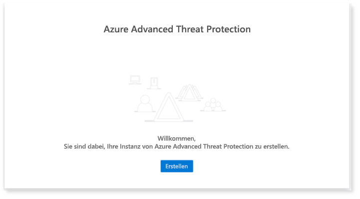

3. Wählen **Sie Geben Sie einen Benutzernamen und ein Kennwort an, um eine Verbindung mit Ihrer Active Directory-Gesamtstruktur herzustellen.**  

   

4. Geben Sie Ihre lokalen Active Directory-Anmeldeinformationen ein. Dies kann ein beliebiges Benutzerkonto sein, das Lesezugriff auf Active Directory hat.

   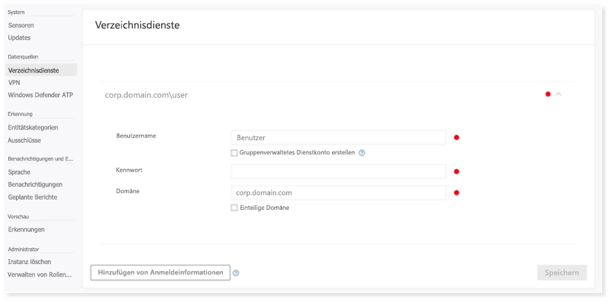

5. Wählen Sie als Nächstes **Sensoreinrichtung herunterladen aus,** und übertragen Sie die Datei auf den Domänencontroller.

   

6. Führen Sie das Microsoft Defender for Identity Sensor Setup aus, und beginnen Sie mit dem Ausführen des Assistenten.

   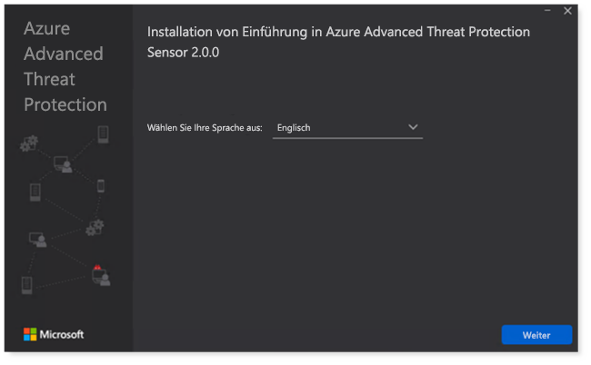
 
7. Klicken **Sie im** Sensorbereitstellungstyp auf Weiter.

   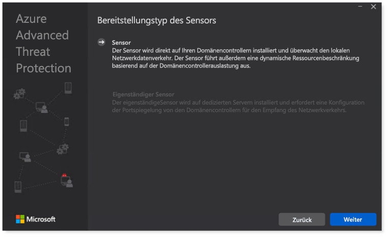
 
8. Kopieren Sie den Zugriffsschlüssel, da Sie ihn als Nächstes im Assistenten eingeben müssen.

   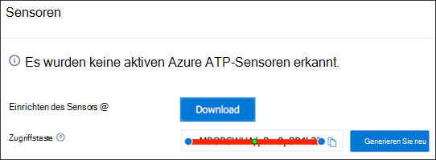
 
9. Kopieren Sie die Zugriffstaste in den Assistenten, und klicken Sie auf **Installieren**. 

   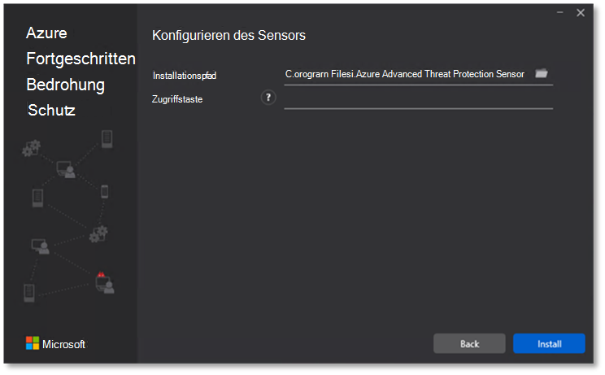

10. Herzlichen Glückwunsch, Sie haben Microsoft Defender for Identity auf Ihrem Domänencontroller erfolgreich konfiguriert.

    
 
11. Wählen Sie [im Abschnitt Microsoft Defender for Identity-Einstellungen](https://go.microsoft.com/fwlink/?linkid=2040449) **Microsoft Defender for Endpoint **, und aktivieren Sie dann den Umschalter. Klicken Sie auf **Speichern**. 

    

## Konfigurieren von Microsoft Cloud App Security

> [!NOTE]
> Überspringen Sie diesen Schritt, wenn Sie Microsoft Cloud App Security bereits aktiviert haben. 

1. Navigieren Sie [zu Microsoft 365 Security Center](https://security.microsoft.com/info)Weitere  >  **Ressourcen** Microsoft Cloud  >  **App Security**.

   

2. Wählen Sie an der Eingabeaufforderung zum Integrieren von Microsoft Defender for Identity die Option **Microsoft Defender for Identity-Datenintegration aktivieren aus.**
  
   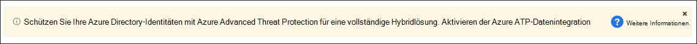

   > [!NOTE]
   > Wenn diese Eingabeaufforderung nicht angezeigt wird, kann dies bedeuten, dass Ihre Microsoft Defender for Identity-Datenintegration bereits aktiviert wurde. Wenn Sie jedoch nicht sicher sind, wenden Sie sich an Ihren IT-Administrator, um dies zu bestätigen. 

3. Wechseln Sie zu **Einstellungen,** aktivieren Sie die **Umschalte Microsoft Defender for Identity-Integration,** und klicken Sie dann auf **Speichern**. 

   
   
   > [!NOTE]
   > Bei neuen Microsoft Defender for Identity-Instanzen wird diese Integrationsschalte automatisch aktiviert. Vergewissern Sie sich, dass Ihre Microsoft Defender for Identity-Integration aktiviert wurde, bevor Sie mit dem nächsten Schritt fortfahren.
 
4. Wählen Sie unter cloud discovery settings **die Option Microsoft Defender for Endpoint integration** aus, und aktivieren Sie dann die Integration. Klicken Sie auf **Speichern**.

   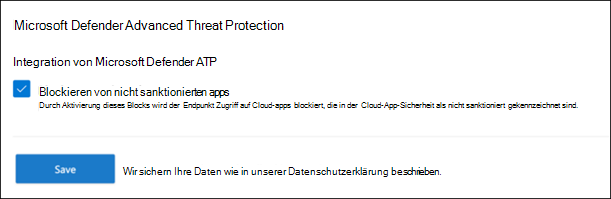

5. Wählen Sie unter Einstellungen für die Clouderkennung **die Option Benutzererweiterung** aus, und aktivieren Sie dann die Integration in Azure Active Directory.

   

## Konfigurieren von Microsoft Defender for Endpoint

>[!NOTE]
>Überspringen Sie diesen Schritt, wenn Sie Microsoft Defender for Endpoint bereits aktiviert haben.

1. Navigieren Sie [zu Microsoft 365 Security Center](https://security.microsoft.com/info)Weitere  >  **Ressourcen** Microsoft Defender  >  **Security Center**. Klicken Sie auf **Öffnen**.

   
 
2. Folgen Sie dem Microsoft Defender for Endpoint-Assistenten. Klicken Sie auf **Weiter**. 

   

3. Wählen Sie basierend auf Dem bevorzugten Datenspeicherort, Datenaufbewahrungsrichtlinie, Organisationsgröße und Opt-In für Vorschaufeatures aus.

   
   
   > [!NOTE]
   > Sie können einige der Einstellungen, z. B. den Datenspeicherort, danach nicht mehr ändern. 

   Klicken Sie auf **Weiter**. 

4. Klicken **Sie auf Weiter,** und der Microsoft Defender for Endpoint-Mandant wird bereitgestellt.

   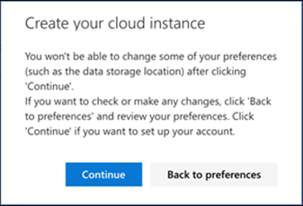

5. Onboarding Ihrer Endpunkte über Gruppenrichtlinien, Microsoft Endpoint Manager oder durch Ausführen eines lokalen Skripts für Microsoft Defender for Endpoint. Der Einfachheit halber verwendet dieses Handbuch das lokale Skript.

6. Klicken **Sie auf Paket herunterladen,** und kopieren Sie das Onboardingskript auf Ihre Endpunkte.

   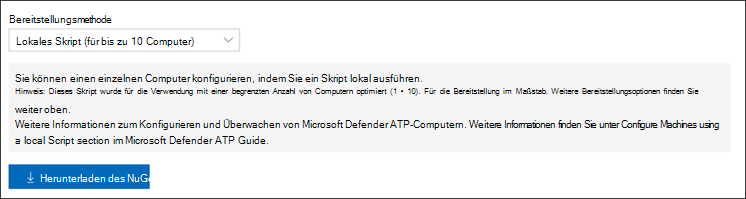

7. Führen Sie auf Ihrem Endpunkt das Onboardingskript als Administrator aus, und wählen Sie Y aus. 

   

8. Herzlichen Glückwunsch, Sie haben Ihren ersten Endpunkt onboardiert.

   

9. Kopieren Sie den Erkennungstest aus dem Microsoft Defender for Endpoint-Assistenten.

   

10. Kopieren Sie das PowerShell-Skript in eine Eingabeaufforderung mit erhöhten Rechten, und führen Sie es aus. 

    

11. Wählen **Sie im Assistenten Starten mit Microsoft Defender for Endpoint** aus.

    
 
12. Besuchen Sie [das Microsoft Defender Security Center](https://securitycenter.windows.com/). Wechseln Sie zu **Einstellungen,** und wählen Sie **dann Erweiterte Features aus.** 

    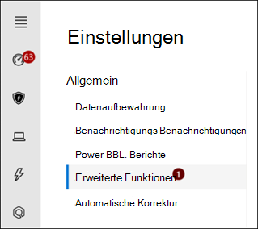

13. Aktivieren Sie die Integration in **Microsoft Defender for Identity**.  

    

14. Aktivieren Sie die Integration in **Office 365 Threat Intelligence**.

    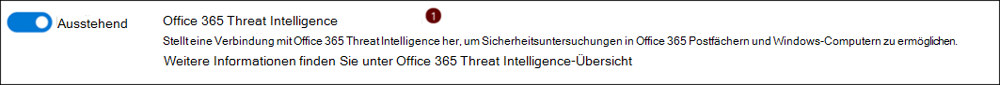

15. Aktivieren der Integration in **Microsoft Cloud App Security**.

    

16. Scrollen Sie nach unten, und klicken **Sie auf Einstellungen speichern,** um die neuen Integrationen zu bestätigen.

    

## Starten des Microsoft 365 Defender-Diensts

>[!NOTE]
>Ab dem 1. Juni 2020 aktiviert Microsoft automatisch Microsoft 365 Defender-Features für alle berechtigten Mandanten. Weitere Informationen finden Sie in diesem [Microsoft Tech Community-Artikel](https://techcommunity.microsoft.com/t5/security-privacy-and-compliance/microsoft-threat-protection-will-automatically-turn-on-for/ba-p/1345426) zur Lizenzberechtigung. 

Wechseln Sie zu [Microsoft 365 Security Center](https://security.microsoft.com/homepage). Navigieren Sie zu **Einstellungen,** und wählen Sie **dann Microsoft 365 Defender aus.**

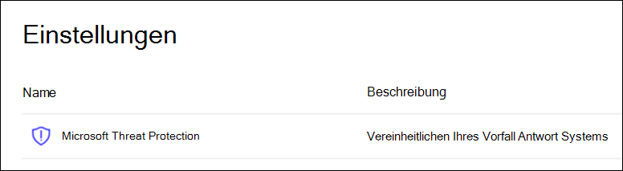  

Eine umfassendere Anleitung finden Sie unter [Turn on Microsoft 365 Defender](m365d-enable.md). 

Glückwunsch! Sie haben gerade Ihre Microsoft 365 Defender-Testumgebung oder Pilotumgebung erstellt! Jetzt können Sie sich mit der Microsoft 365 Defender-Benutzeroberfläche vertraut machen! Erfahren Sie, was Sie aus dem folgenden interaktiven Microsoft 365 Defender-Leitfaden lernen können, und erfahren Sie, wie Sie jedes Dashboard für Ihre täglichen Sicherheitsaufgaben verwenden.

[Sehen Sie sich den interaktiven Leitfaden an](https://aka.ms/MTP-Interactive-Guide)

Als Nächstes können Sie einen Angriff simulieren und sehen, wie produktübergreifende Funktionen Warnungen erkennen, erstellen und automatisch auf einen dateilosen Angriff auf einen Endpunkt reagieren.

## Nächster Schritt

- [Generieren einer Testwarnung](generate-test-alert.md) – Führen Sie eine Angriffssimulation in Ihrem Microsoft 365 Defender-Testlabor aus.