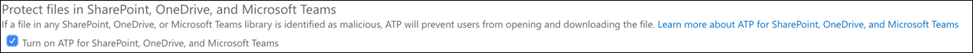

# Konfigurieren Microsoft 365 Defender Säulen für Ihre Testumgebung oder PilotumgebungConfigure Microsoft 365 Defender pillars for your trial lab or pilot environment

[!INCLUDE [Microsoft 365 Defender rebranding](../includes/microsoft-defender.md)]

**Gilt für:****Applies to:**
- Microsoft 365 DefenderMicrosoft 365 Defender

Das Erstellen einer Microsoft 365 Defender Testumgebung oder Einer Pilotumgebung und deren Bereitstellung ist ein dreistufiger Prozess:Creating a Microsoft 365 Defender trial lab or pilot environment and deploying it is a three-phase process:

| [Phase 1: VorbereitenPhase 1: Prepare](prepare-m365d-eval.md) | [Phase 2: EinrichtenPhase 2: Set up](setup-m365deval.md) | Phase 3: OnboardingPhase 3: Onboard |  [Zurück zum Pilot-PlaybookBack to pilot playbook](m365d-pilot.md) |
|--|--|--|--|
|| |*Sie sind hier!**You are here!* | |

Sie befinden sich derzeit in der Konfigurationsphase.You're currently in the configuration phase.

Die Vorbereitung ist der Schlüssel für eine erfolgreiche Bereitstellung.Preparation is key to any successful deployment. In diesem Artikel werden Sie zu den Punkten geführt, die Sie bei der Vorbereitung der Bereitstellung von Microsoft Defender für Endpunkt berücksichtigen müssen.In this article, you'll be guided on the points you'll need to consider as you prepare to deploy Microsoft Defender for Endpoint.

## Microsoft 365 Defender SäulenMicrosoft 365 Defender pillars
Microsoft 365 Defender besteht aus vier Säulen.Microsoft 365 Defender consists of four pillars. Obwohl eine Säule bereits einen Wert für die Sicherheit Ihrer Netzwerkorganisation bieten kann, bietet die Aktivierung der vier säulen Microsoft 365 Defender Ihrer Organisation den größten Nutzen.Although one pillar can already provide value to your network organization's security, enabling the four Microsoft 365 Defender pillars will give your organization the most value.

In diesem Abschnitt erfahren Sie, wie Sie Folgendes konfigurieren:This section will guide you to configure:

- Microsoft Defender für Office 365Microsoft Defender for Office 365
- Microsoft Defender for IdentityMicrosoft Defender for Identity
- Microsoft Cloud App SecurityMicrosoft Cloud App Security
- Microsoft Defender für EndpunktMicrosoft Defender for Endpoint

## Konfigurieren von Microsoft Defender für Office 365Configure Microsoft Defender for Office 365

> [!NOTE]
> Überspringen Sie diesen Schritt, wenn Sie Defender bereits für Office 365 aktiviert haben.Skip this step if you've already enabled Defender for Office 365.

Es gibt ein PowerShell-Modul namens *Office 365 Advanced Threat Protection Recommended Configuration Analyzer (ORCA),* das einige dieser Einstellungen bestimmt.There's a PowerShell Module called the *Office 365 Advanced Threat Protection Recommended Configuration Analyzer (ORCA)* that helps determine some of these settings. Wenn sie als Administrator in Ihrem Mandanten ausgeführt wird, hilft get-ORCAReport dabei, eine Bewertung der Antispam-, Antiphishing- und anderen Nachrichtenschutzeinstellungen zu erstellen.When run as an administrator in your tenant, get-ORCAReport will help generate an assessment of the anti-spam, anti-phish, and other message hygiene settings. Sie können dieses Modul von https://www.powershellgallery.com/packages/ORCA/ herunterladen.You can download this module from https://www.powershellgallery.com/packages/ORCA/.

1. Navigieren Sie zu [Office 365 Security & Compliance Center](https://protection.office.com/homepage)Threat  >  **Management**  >  **Policy.**Navigate to [Office 365 Security & Compliance Center](https://protection.office.com/homepage) > **Threat management** > **Policy**.

   

2. Klicken Sie auf **"Antiphishing",** wählen Sie **"Erstellen"** aus, und geben Sie den Richtliniennamen und die Beschreibung ein.Click **Anti-phishing**, select **Create** and fill in the policy name and description. Klicken Sie auf **Weiter**.Click **Next**.

   

   > [!NOTE]
   > Bearbeiten Sie Ihre erweiterte Antiphishingrichtlinie in Microsoft Defender für Office 365.Edit your Advanced anti-phishing policy in Microsoft Defender for Office 365. Ändern Sie den **Erweiterten Phishingschwellenwert** auf **2 – Aggressiv.**Change **Advanced Phishing Threshold** to **2 - Aggressive**.

3. Klicken Sie auf das Dropdownmenü **"Bedingung hinzufügen",** und wählen Sie Ihre Domäne(n) als Empfängerdomäne aus.Click the **Add a condition** drop-down menu and select your domain(s) as recipient domain. Klicken Sie auf **Weiter**.Click **Next**.

   

4. Überprüfen Sie Ihre Einstellungen.Review your settings. Klicken Sie auf **"Diese Richtlinie** erstellen", um dies zu bestätigen.Click **Create this policy** to confirm.

   

5. Wählen Sie **Tresor Anlagen** aus, und aktivieren Sie **atP für SharePoint, OneDrive und Microsoft Teams** Option.Select **Safe Attachments** and select the **Turn on ATP for SharePoint, OneDrive, and Microsoft Teams** option.

   

6. Klicken Sie auf das Symbol +, um eine neue Richtlinie für sichere Anlagen zu erstellen und sie als Empfängerdomäne auf Ihre Domänen anzuwenden.Click the + icon to create a new safe attachment policy, apply it as recipient domain to your domains. Klicken Sie auf **Speichern**.Click **Save**.

   

7. Wählen Sie als Nächstes die **Richtlinie Tresor Links** aus, und klicken Sie dann auf das Stiftsymbol, um die Standardrichtlinie zu bearbeiten.Next, select the **Safe Links** policy, then click the pencil icon to edit the default policy.

8. Stellen Sie sicher, dass die Option **"Nicht nachverfolgen", wenn Benutzer auf** die Option "Sichere Links" klicken, nicht ausgewählt ist, während die restlichen Optionen ausgewählt sind.Make sure that the **Do not track when users click safe links** option is not selected, while the rest of the options are selected. Weitere Informationen finden Sie [unter Tresor Links-Einstellungen.](/microsoft-365/security/office-365-security/recommended-settings-for-eop-and-office365)See [Safe Links settings](/microsoft-365/security/office-365-security/recommended-settings-for-eop-and-office365) for details. Klicken Sie auf **Speichern**.Click **Save**.

   

9. Wählen Sie als Nächstes die **Antischadsoftwarerichtlinie** aus, wählen Sie die Standardeinstellung aus, und wählen Sie das Stiftsymbol aus.Next select the **Anti-malware** policy, select the default, and choose the pencil icon.

10. Klicken Sie auf **Einstellungen,** und wählen Sie **"Ja" aus, und verwenden Sie den Standardbenachrichtigungstext,** um die **Schadsoftwareerkennungsantwort** zu aktivieren.Click **Settings** and select **Yes and use the default notification text** to enable **Malware Detection Response**. Aktivieren Sie den **Filter für allgemeine Anlagentypen.**Turn the **Common Attachment Types Filter** on. Klicken Sie auf **Speichern**.Click **Save**.

    

11. Navigieren Sie zu Office 365 Überwachungsprotokollsuche [im Security & Compliance](https://protection.office.com/homepage)  >    >   Center, und aktivieren Sie die Überwachung.Navigate to [Office 365 Security & Compliance Center](https://protection.office.com/homepage) > **Search** > **Audit log search** and turn Auditing on.

    

12. Integrieren Sie Microsoft Defender für Office 365 in Microsoft Defender für Endpunkt.Integrate Microsoft Defender for Office 365 with Microsoft Defender for Endpoint. Navigieren Sie zu [Office 365 Security & Compliance Center](https://protection.office.com/homepage)Threat  >  **Management**  >  **Explorer,** und wählen Sie **Microsoft Defender für Endpunkt Einstellungen** in der oberen rechten Ecke des Bildschirms aus.Navigate to [Office 365 Security & Compliance Center](https://protection.office.com/homepage) > **Threat management** > **Explorer** and select **Microsoft Defender for Endpoint Settings** on the upper right corner of the screen. Aktivieren Sie im Dialogfeld "Defender für Endpunkt-Verbindung" **Verbinden zu Microsoft Defender für Endpunkt.**In the Defender for Endpoint connection dialog box, turn on **Connect to Microsoft Defender for Endpoint**.

    

## Konfigurieren von Microsoft Defender for IdentityConfigure Microsoft Defender for Identity

> [!NOTE]
> Überspringen Sie diesen Schritt, wenn Sie Microsoft Defender for Identity bereits aktiviert haben.Skip this step if you've already enabled Microsoft Defender for Identity

1. Navigieren Sie zu [Microsoft 365 Security Center](https://security.microsoft.com/info) > wählen Sie weitere **Ressourcen** Microsoft Defender  >  **for Identity** aus.Navigate to [Microsoft 365 Security Center](https://security.microsoft.com/info) > select **More Resources** > **Microsoft Defender for Identity**.

   

2. Klicken Sie auf **"Erstellen",** um den Microsoft Defender for Identity-Assistenten zu starten.Click **Create** to start the Microsoft Defender for Identity wizard.

   

3. Wählen **Sie Einen Benutzernamen und ein Kennwort angeben, um eine Verbindung mit Ihrer Active Directory-Gesamtstruktur herzustellen.**Choose **Provide a username and password to connect to your Active Directory forest**.

   

4. Geben Sie Ihre lokalen Active Directory-Anmeldeinformationen ein.Enter your Active Directory on-premises credentials. Dies kann ein beliebiges Benutzerkonto sein, das Lesezugriff auf Active Directory hat.This can be any user account that has read access to Active Directory.

   

5. Wählen Sie als Nächstes **"Sensorsetup herunterladen"** aus, und übertragen Sie die Datei an Ihren Domänencontroller.Next, choose **Download Sensor Setup** and transfer file to your domain controller.

   

6. Führen Sie das Microsoft Defender for Identity Sensor-Setup aus, und beginnen Sie mit dem Folgen des Assistenten.Execute the Microsoft Defender for Identity Sensor Setup and begin following the wizard.

   

7. Klicken Sie im Sensorbereitstellungstyp auf **"Weiter".**Click **Next** at the sensor deployment type.

   

8. Kopieren Sie die Zugriffstaste, da Sie sie als Nächstes im Assistenten eingeben müssen.Copy the access key because you need to enter it next in the Wizard.

   

9. Kopieren Sie die Zugriffstaste in den Assistenten, und klicken Sie auf **"Installieren".**Copy the access key into the Wizard and click **Install**.

   

10. Herzlichen Glückwunsch, Sie haben Microsoft Defender for Identity auf Ihrem Domänencontroller erfolgreich konfiguriert.Congratulations, you've successfully configured Microsoft Defender for Identity on your domain controller.

    

11. Wählen Sie im Abschnitt ["Einstellungen für Microsoft Defender for Identity"](https://go.microsoft.com/fwlink/?linkid=2040449) \*\*Microsoft Defender für Endpunkt \*\* aus, und aktivieren Sie dann die Umschaltfläche.Under the [Microsoft Defender for Identity](https://go.microsoft.com/fwlink/?linkid=2040449) settings section, select \*\*Microsoft Defender for Endpoint \*\*, then turn on the toggle. Klicken Sie auf **Speichern**.Click **Save**.

    

## Konfigurieren Microsoft Cloud App SecurityConfigure Microsoft Cloud App Security

> [!NOTE]
> Überspringen Sie diesen Schritt, wenn Sie Microsoft Cloud App Security bereits aktiviert haben.Skip this step if you've already enabled Microsoft Cloud App Security.

1. Navigieren Sie zu [Microsoft 365 Security Center](https://security.microsoft.com/info)Weitere  >  **Ressourcen**  >  **Microsoft Cloud App Security**.Navigate to [Microsoft 365 Security Center](https://security.microsoft.com/info) > **More Resources** > **Microsoft Cloud App Security**.

   

2. Wählen Sie an der Informationsaufforderung zum Integrieren von Microsoft Defender for Identity die Option **"Microsoft Defender for Identity-Datenintegration aktivieren"** aus.At the information prompt to integrate Microsoft Defender for Identity, select **Enable Microsoft Defender for Identity data integration**.

   

   > [!NOTE]
   > Wenn diese Aufforderung nicht angezeigt wird, bedeutet dies möglicherweise, dass Die Microsoft Defender for Identity-Datenintegration bereits aktiviert wurde.If you don’t see this prompt, it might mean that your Microsoft Defender for Identity data integration has already been enabled. Wenn Sie sich jedoch nicht sicher sind, wenden Sie sich an Ihren IT-Administrator, um dies zu bestätigen.However, if you are not sure, contact your IT Administrator to confirm.

3. Wechseln Sie zu **Einstellungen,** aktivieren Sie die **Microsoft Defender for Identity-Integrationsschaltfläche,** und klicken Sie dann auf **"Speichern".**Go to **Settings**, turn on the **Microsoft Defender for Identity integration** toggle, then click **Save**.

   

   > [!NOTE]
   > Bei neuen Microsoft Defender for Identity-Instanzen wird diese Integrationsschaltfläche automatisch aktiviert.For new Microsoft Defender for Identity instances, this integration toggle is automatically turned on. Vergewissern Sie sich, dass Ihre Microsoft Defender for Identity-Integration aktiviert wurde, bevor Sie mit dem nächsten Schritt fortfahren.Confirm that your Microsoft Defender for Identity integration has been enabled before you proceed to the next step.

4. Wählen Sie unter den Cloud-Ermittlungseinstellungen **die Integration von Microsoft Defender für Endpunkt** aus, und aktivieren Sie dann die Integration.Under the Cloud discovery settings, select **Microsoft Defender for Endpoint integration**, then enable the integration. Klicken Sie auf **Speichern**.Click **Save**.

   

5. Wählen Sie unter "Cloud Discovery"-Einstellungen **"Benutzererweiterung"** aus, und aktivieren Sie dann die Integration mit Azure Active Directory.Under Cloud discovery settings, select **User enrichment**, then enable the integration with Azure Active Directory.

   

## Konfigurieren von Microsoft Defender für EndpunktConfigure Microsoft Defender for Endpoint

> [!NOTE]
> Überspringen Sie diesen Schritt, wenn Sie Microsoft Defender für Endpunkt bereits aktiviert haben.Skip this step if you've already enabled Microsoft Defender for Endpoint.

1. Navigieren Sie zu [Microsoft 365 Security Center](https://security.microsoft.com/info)Weitere  >  **Ressourcen**  >  **Microsoft Defender Security Center**.Navigate to [Microsoft 365 Security Center](https://security.microsoft.com/info) > **More Resources** > **Microsoft Defender Security Center**. Klicken Sie auf **Öffnen**.Click **Open**.

   

2. Folgen Sie dem Microsoft Defender für Endpunkt-Assistenten.Follow the Microsoft Defender for Endpoint wizard. Klicken Sie auf **Weiter**.Click **Next**.

   

3. Wählen Sie basierend auf Ihrem bevorzugten Datenspeicherort, der Datenaufbewahrungsrichtlinie, der Organisationsgröße und dem Opt-In für Vorschaufeatures.Choose based on your preferred data storage location, data retention policy, organization size, and opt-in for preview features.

   

   > [!NOTE]
   > Sie können einige Einstellungen, z. B. den Datenspeicherort, danach nicht ändern.You cannot change some of the settings, like data storage location, afterwards.

   Klicken Sie auf **Weiter**.Click **Next**.

4. Klicken Sie auf **"Weiter",** und es wird Ihr Microsoft Defender für Endpunkt-Mandant bereitgestellt.Click **Continue** and it will provision your Microsoft Defender for Endpoint tenant.

   

5. Integrieren Sie Ihre Endpunkte über Gruppenrichtlinien, Microsoft Endpoint Manager oder durch Ausführen eines lokalen Skripts in Microsoft Defender für Endpunkt.Onboard your endpoints through Group Policies, Microsoft Endpoint Manager or by running a local script to Microsoft Defender for Endpoint. Der Einfachheit halber wird in diesem Leitfaden das lokale Skript verwendet.For simplicity, this guide uses the local script.

6. Klicken Sie auf **"Paket herunterladen",** und kopieren Sie das Onboarding-Skript auf Ihre Endpunkte.Click **Download package** and copy the onboarding script to your endpoint(s).

   

7. Führen Sie auf Ihrem Endpunkt das Onboardingskript als Administrator aus, und wählen Sie "Y" aus.On your endpoint, run the onboarding script as Administrator and choose Y.

   

8. Herzlichen Glückwunsch, Sie haben Ihren ersten Endpunkt integriert.Congratulations, you've onboarded your first endpoint.

   

9. Kopieren Sie den Erkennungstest aus dem Microsoft Defender für Endpunkt-Assistenten.Copy-paste the detection test from the Microsoft Defender for Endpoint wizard.

   

10. Kopieren Sie das PowerShell-Skript in eine Eingabeaufforderung mit erhöhten Rechten, und führen Sie es aus.Copy the PowerShell script to an elevated command prompt and run it.

    

11. Wählen Sie **"Start using Microsoft Defender for Endpoint"** aus dem Assistenten aus.Select **Start using Microsoft Defender for Endpoint** from the Wizard.

    

12. Besuchen Sie die [Microsoft Defender Security Center](https://securitycenter.windows.com/).Visit the [Microsoft Defender Security Center](https://securitycenter.windows.com/). Wechseln Sie zu **Einstellungen,** und wählen Sie dann **erweiterte Features aus.**Go to **Settings** and then select **Advanced features**.

    

13. Aktivieren Sie die Integration in **Microsoft Defender for Identity.**Turn on the integration with **Microsoft Defender for Identity**.

    

14. Aktivieren Sie die Integration mit **Office 365 Threat Intelligence.**Turn on the integration with **Office 365 Threat Intelligence**.

    

15. Aktivieren Sie die Integration in **Microsoft Cloud App Security.**Turn on integration with **Microsoft Cloud App Security**.

    

16. Scrollen Sie nach unten, und klicken Sie auf **"Einstellungen speichern",** um die neuen Integrationen zu bestätigen.Scroll down and click **Save preferences** to confirm the new integrations.

    

## Starten des Microsoft 365 Defender-DienstsStart the Microsoft 365 Defender service

> [!NOTE]
> Ab dem 1. Juni 2020 aktiviert Microsoft automatisch Microsoft 365 Defender Features für alle berechtigten Mandanten.Starting June 1, 2020, Microsoft automatically enables Microsoft 365 Defender features for all eligible tenants. Weitere Informationen finden Sie in diesem [Microsoft Tech Community Artikel zur Lizenzberechtigung.](https://techcommunity.microsoft.com/t5/security-privacy-and-compliance/microsoft-threat-protection-will-automatically-turn-on-for/ba-p/1345426)See this [Microsoft Tech Community article on license eligibility](https://techcommunity.microsoft.com/t5/security-privacy-and-compliance/microsoft-threat-protection-will-automatically-turn-on-for/ba-p/1345426) for details.

Wechseln Sie zu [Microsoft 365 Security Center.](https://security.microsoft.com/homepage)Go to [Microsoft 365 Security Center](https://security.microsoft.com/homepage). Navigieren Sie zu **Einstellungen,** und wählen Sie dann **Microsoft 365 Defender** aus.Navigate to **Settings** and then select **Microsoft 365 Defender**.

Eine umfassendere Anleitung finden Sie unter [Aktivieren Microsoft 365 Defender.](m365d-enable.md)For a more comprehensive guidance, see [Turn on Microsoft 365 Defender](m365d-enable.md).

Herzlichen Glückwunsch!Congratulations! Sie haben gerade Ihre Microsoft 365 Defender Testumgebung oder Pilotumgebung erstellt!You've just created your Microsoft 365 Defender trial lab or pilot environment! Jetzt können Sie sich mit der Microsoft 365 Defender Benutzeroberfläche vertraut machen!Now you can familiarize yourself with the Microsoft 365 Defender user interface! Erfahren Sie, was Sie aus dem folgenden Microsoft 365 Defender interaktiven Leitfaden lernen und wissen, wie Sie jedes Dashboard für Ihre täglichen Sicherheitsaufgaben verwenden.See what you can learn from the following Microsoft 365 Defender interactive guide and know how to use each dashboard for your day-to-day security operation tasks.

[Sehen Sie sich den interaktiven Leitfaden anCheck out the interactive guide](https://aka.ms/MTP-Interactive-Guide)

Als Nächstes können Sie einen Angriff simulieren und sehen, wie die produktübergreifenden Funktionen Warnungen erkennen, erstellen und automatisch auf einen dateilosen Angriff auf einen Endpunkt reagieren.Next, you can simulate an attack and see how the cross product capabilities detect, create alerts, and automatically respond to a fileless attack on an endpoint.

## Nächster SchrittNext step

- [Generieren Sie eine Testwarnung–](generate-test-alert.md) Führen Sie eine Angriffssimulation in Ihrem Microsoft 365 Defender Testlabor aus.[Generate a test alert](generate-test-alert.md) - Run an attack simulation in your Microsoft 365 Defender trial lab.
