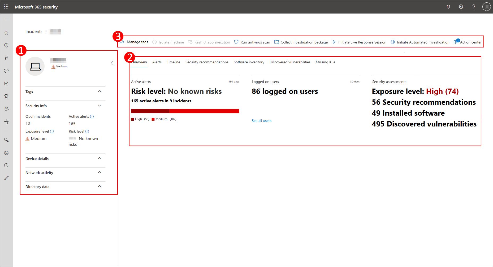

# Seite "Geräteprofil"

[!INCLUDE [Microsoft 365 Defender rebranding](../includes/microsoft-defender.md)]

Das Microsoft 365-Sicherheitsportal stellt Ihnen Geräteprofilseiten zur Verfügung, sodass Sie den Zustand und Status von Geräten in Ihrem Netzwerk schnell bewerten können.

> [!IMPORTANT]
> Je nachdem, ob das Gerät in Microsoft Defender for Endpoint, Microsoft Defender for Identity oder beides registriert ist, kann die Geräteprofilseite etwas anders angezeigt werden.

Wenn das Gerät in Microsoft Defender for Endpoint registriert ist, können Sie auch die Geräteprofilseite verwenden, um einige allgemeine Sicherheitsaufgaben auszuführen.

## Navigieren auf der Geräteprofilseite

Die Profilseite ist in mehrere breite Abschnitte unterteilt.

Die Seitenleiste (1) listet grundlegende Details zum Gerät auf.

Der Hauptinhaltsbereich (2) enthält Registerkarten, die Sie umschalten können, um verschiedene Arten von Informationen über das Gerät anzuzeigen.

Wenn das Gerät in Microsoft Defender for Endpoint registriert ist, wird auch eine Liste der Reaktionsaktionen (3) angezeigt. Mit Reaktionsaktionen können Sie allgemeine sicherheitsbezogene Aufgaben ausführen.

## Sidebar

Neben dem Hauptinhaltsbereich der Geräteprofilseite befindet sich die Seitenleiste.

Die Seitenleiste listet den vollständigen Namen und die Belichtungsstufe des Geräts auf. Es enthält auch einige wichtige grundlegende Informationen in kleinen Unterabschnitten, die geöffnet oder geschlossen umschalten können, z. B.:

* **Tags** – Alle Microsoft Defender for Endpoint-, Microsoft Defender for Identity- oder benutzerdefinierten Tags, die dem Gerät zugeordnet sind. Tags von Microsoft Defender for Identity können nicht bearbeitet werden.
* **Sicherheitsinformationen** – Öffnen von Vorfällen und aktiven Warnungen. Auf Geräten, die in Microsoft Defender for Endpoint registriert sind, werden auch die Risikostufe und die Risikostufe angezeigt.

> [!TIP]
> Die Risikostufe bezieht sich darauf, wie sehr das Gerät sicherheitsempfehlungen entspricht, während die Risikostufe basierend auf einer Reihe von Faktoren berechnet wird, einschließlich der Typen und des Schweregrads aktiver Warnungen.

* **Gerätedetails** : Domäne, Betriebssystem, Zeitstempel für das erste Anzeigen des Geräts, IP-Adressen, Ressourcen. Geräte, die in Microsoft Defender for Endpoint registriert sind, zeigen auch den Integritätsstatus an. Geräte, die in Microsoft Defender for Identity registriert sind, zeigen den SAM-Namen und einen Zeitstempel für den Zeitpunkt an, zu dem das Gerät zum ersten Mal erstellt wurde.
* **Netzwerkaktivität** – Zeitstempel zum ersten Mal und zum letzten Mal, wenn das Gerät im Netzwerk angezeigt wurde.
* **Verzeichnisdaten** (*nur für Geräte,* die in Microsoft Defender for Identity registriert sind ) – [UAC-Flags,](/windows/security/identity-protection/user-account-control/user-account-control-overview) [SPNs](/windows/win32/ad/service-principal-names)und Gruppenmitgliedschaften.

## Reaktionsaktionen

Reaktionsaktionen bieten eine schnelle Möglichkeit, bedrohungen zu schützen und zu analysieren.

> [!IMPORTANT]
> * [Reaktionsaktionen](/windows/security/threat-protection/microsoft-defender-atp/respond-machine-alerts) sind nur verfügbar, wenn das Gerät in Microsoft Defender for Endpoint registriert ist.
> * Auf Geräten, die in Microsoft Defender for Endpoint registriert sind, werden je nach Betriebssystem und Versionsnummer des Geräts möglicherweise unterschiedliche Anzahl von Reaktionsaktionen angezeigt.

Auf der Seite "Geräteprofil" verfügbare Aktionen umfassen:

* **Verwalten von Tags** – Aktualisiert benutzerdefinierte Tags, die Sie auf dieses Gerät angewendet haben.
* **Gerät isolieren** : Isoliert das Gerät vom Netzwerk Ihrer Organisation, während es mit Microsoft Defender for Endpoint verbunden bleibt. Sie können festlegen, dass Outlook, Teams und Skype for Business ausgeführt werden können, während das Gerät isoliert ist, und zwar aus Kommunikationsgründen.
* **Aktionscenter** – Zeigt den Status der übermittelten Aktionen an. Nur verfügbar, wenn bereits eine andere Aktion ausgewählt wurde.
* **Einschränken der App-Ausführung** – Verhindert die Ausführung von Anwendungen, die nicht von Microsoft signiert sind.
* **Antivirusscan ausführen** – Updates Windows Defender Antivirusdefinitionen und führen sofort eine Antivirenscan aus. Wählen Sie zwischen Schnellscan oder Vollständiger Scan aus.
* **Untersuchungspaket sammeln** – Sammelt Informationen über das Gerät. Wenn die Untersuchung abgeschlossen ist, können Sie sie herunterladen.
* **Initiieren der Liveantwortsitzung** – Lädt eine Remoteshell auf dem Gerät für [eingehende Sicherheitsuntersuchungen.](/microsoft-365/security/defender-endpoint/live-response)
* **Initiieren einer automatisierten** Untersuchung – Bedrohungen werden [automatisch untersucht und behoben.](../office-365-security/office-365-air.md) Obwohl Sie automatisierte Untersuchungen manuell auslösen [können,](../../compliance/alert-policies.md?view=o365-worldwide#default-alert-policies) um von dieser Seite aus ausgeführt zu werden, lösen bestimmte Warnungsrichtlinien automatische Untersuchungen allein aus.
* **Aktionscenter** – Zeigt Informationen zu allen derzeit ausgeführten Reaktionsaktionen an.

## Tabs section

Mit den Registerkarten des Geräteprofils können Sie eine Übersicht über Sicherheitsdetails zum Gerät und Tabellen mit einer Liste von Warnungen umschalten.

Auf Geräten, die in Microsoft Defender for Endpoint registriert sind, werden auch Registerkarten angezeigt, die über eine Zeitachse, eine Liste von Sicherheitsempfehlungen, ein Softwareinventar, eine Liste der erkannten Sicherheitsrisiken und fehlende KBs (Sicherheitsupdates) verfügen.

### Registerkarte "Übersicht"

Die Standardregisterkarte ist **Overview**. Es bietet einen schnellen Überblick über die wichtigsten Sicherheitsrisiken des Geräts.

Hier erhalten Sie einen kurzen Überblick über die aktiven Warnungen des Geräts und alle aktuell angemeldeten Benutzer.

Wenn das Gerät in Microsoft Defender for Endpoint registriert ist, werden auch die Risikostufe des Geräts und alle verfügbaren Daten zu Sicherheitsbewertungen angezeigt. In den Sicherheitsbewertungen wird die Belichtungsstufe des Geräts beschrieben, Sicherheitsempfehlungen gegeben, betroffene Software auflistet und Sicherheitsrisiken erkannt.

### Registerkarte "Warnungen"

Die **Registerkarte Warnungen** enthält eine Liste der Warnungen, die auf dem Gerät ausgelöst wurden, sowohl von Microsoft Defender for Identity als auch von Microsoft Defender for Endpoint.

Sie können die Anzahl der angezeigten Elemente sowie die Spalten anpassen, die für jedes Element angezeigt werden. Das Standardverhalten besteht im Auflisten von 30 Elementen pro Seite.

Die Spalten auf dieser Registerkarte enthalten Informationen zum Schweregrad der Bedrohung, die die Warnung ausgelöst hat, sowie status, Untersuchungsstatus und wem die Warnung zugewiesen wurde.

Die *Spalte "Betroffene Entitäten"* bezieht sich auf das Gerät (Entität), dessen Profil Sie gerade anzeigen, sowie alle anderen Geräte in Ihrem Netzwerk, die betroffen sind.

Wenn Sie ein Element aus dieser Liste auswählen, wird ein Flyout geöffnet, das noch mehr Informationen zur ausgewählten Warnung enthält.

Diese Liste kann nach Schweregrad, Status oder dem Zugewiesenen der Warnung gefiltert werden.

### Registerkarte "Zeitachse"

Die **Registerkarte Zeitachse** enthält ein interaktives, chronologisches Diagramm aller ereignisse, die auf dem Gerät ausgelöst werden. Durch Verschieben des hervorgehobenen Bereichs des Diagramms nach links oder rechts können Sie Ereignisse über verschiedene Zeiträume anzeigen. Sie können auch einen benutzerdefinierten Datumsbereich im Dropdownmenü zwischen dem interaktiven Diagramm und der Liste der Ereignisse auswählen.

Unterhalb des Diagramms befindet sich eine Liste der Ereignisse für den ausgewählten Datumsbereich.

Die Anzahl der angezeigten Elemente und die Spalten in der Liste können beide angepasst werden. In den Standardspalten sind ereigniszeit, aktiver Benutzer, Aktionstyp, Entitäten (Prozesse) und zusätzliche Informationen zum Ereignis aufgeführt.

Wenn Sie ein Element aus dieser Liste auswählen, wird ein Flyout geöffnet, in dem ein Ereignisentitätendiagramm angezeigt wird, in dem die übergeordneten und untergeordneten Prozesse angezeigt werden, die an dem Ereignis beteiligt sind.

Die Liste kann nach dem jeweiligen Ereignistyp gefiltert werden. z. B. Registrierungsereignisse oder Smart Screen-Ereignisse.

Die Liste kann auch zum Herunterladen in eine CSV-Datei exportiert werden. Obwohl die Datei nicht durch die Anzahl der Ereignisse begrenzt ist, beträgt der maximale Zeitraum, den Sie exportieren möchten, sieben Tage.

### Registerkarte "Sicherheitsempfehlungen"

Auf **der Registerkarte Sicherheitsempfehlungen** sind Aktionen aufgeführt, die Sie zum Schutz des Geräts ergreifen können. Wenn Sie ein Element in dieser Liste auswählen, wird ein Flyout geöffnet, in dem Sie Anweisungen zum Anwenden der Empfehlung erhalten.

Wie bei den vorherigen Registerkarten kann auch die Anzahl der pro Seite angezeigten Elemente sowie die sichtbaren Spalten angepasst werden.

Die Standardansicht enthält Spalten, in der die sicherheitsrelevanten Schwachstellen, die zugeordnete Bedrohung, die zugehörige Komponente oder Software, die von der Bedrohung betroffen ist, und vieles mehr beschrieben werden. Elemente können nach dem Status der Empfehlung gefiltert werden.

### Softwarebestand

Auf **der Registerkarte Softwareinventar** werden auf dem Gerät installierte Software aufgeführt.

In der Standardansicht werden der Softwareanbieter, die installierte Versionsnummer, die Anzahl der bekannten Softwareschwächen, Bedrohungseinblicke, Produktcode und Tags angezeigt. Die Anzahl der angezeigten Elemente und die angezeigten Spalten können beide angepasst werden.

Wenn Sie ein Element aus dieser Liste auswählen, wird ein Flyout geöffnet, das weitere Details zur ausgewählten Software sowie den Pfad und den Zeitstempel für das letzte Mal enthält, wenn die Software gefunden wurde.

Diese Liste kann nach Produktcode gefiltert werden.

### Registerkarte "Sicherheitsrisiken" ermittelt

Auf **der Registerkarte Gefundene Sicherheitsrisiken** werden alle allgemeinen Sicherheitsrisiken und Exploits (Common Vulnerabilities and Exploits, CVEs) aufgeführt, die sich auf das Gerät auswirken können.

In der Standardansicht werden der Schweregrad des CVE, das Allgemeine Sicherheitsrisikoergebnis (Common Vulnerability Score, CVS), die Software im Zusammenhang mit dem CVE, der Veröffentlichung des CVE, der letzten Aktualisierung des CVE und bedrohungen im Zusammenhang mit dem CVE aufgeführt.

Wie bei den vorherigen Registerkarten kann die Anzahl der angezeigten Elemente und die sichtbaren Spalten angepasst werden.

Wenn Sie ein Element aus dieser Liste auswählen, wird ein Flyout geöffnet, das den CVE beschreibt.

### Fehlende KBs

Auf der Registerkarte Fehlende **KBs** werden alle Microsoft-Updates aufgeführt, die noch auf das Gerät angewendet werden müssen. Bei den "KBs" handelt es sich um [Knowledge #A0 zur](https://support.microsoft.com/help/242450/how-to-query-the-microsoft-knowledge-base-by-using-keywords-and-query) Beschreibung dieser Updates. Beispiel: [KB4551762](https://support.microsoft.com/help/4551762/windows-10-update-kb4551762).

In der Standardansicht wird das Bulletin mit den Updates, der Betriebssystemversion, den betroffenen Produkten, den adressierten CVEs, der KB-Nummer und den Tags aufgeführt.

Die Anzahl der pro Seite angezeigten Elemente und die angezeigten Spalten können angepasst werden.

Wenn Sie ein Element auswählen, wird ein Flyout geöffnet, das mit dem Update verknüpft ist.

## Verwandte Themen

* [Übersicht über Microsoft 365 Defender](microsoft-365-defender.md)
* [Aktivieren von Microsoft 365 Defender](m365d-enable.md)
* [Untersuchen von Entitäten auf Geräten mithilfe von Liveantworten](../defender-endpoint/live-response.md)
* [Automatisierte Untersuchung und Reaktion (AIR) in Office 365](../office-365-security/office-365-air.md)
