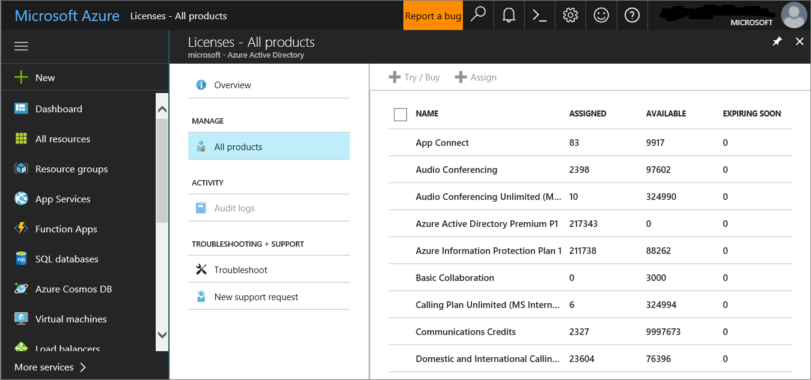

# Aktivieren der Evaluierungsumgebung von Microsoft Defender für Endpunkt

Dieser Artikel führt Sie durch die Schritte zum Einrichten der Evaluierungsumgebung für Microsoft Defender für Endpunkt unter Verwendung von Produktionsgeräten. 

>[!TIP]
>Microsoft Defender für Endpunkt enthält auch ein Produktbewertungslabor, in dem Sie vorkonfigurierte Geräte hinzufügen und Simulationen ausführen können, um die Funktionen der Plattform zu bewerten. Die Übung bietet eine vereinfachte Einrichtungsoberfläche, die ihnen dabei helfen kann, den Nutzen von Microsoft Defender für Enpdoint schnell zu demonstrieren, einschließlich Anleitungen für viele Features wie erweiterte Suche und Bedrohungsanalyse. Weitere Informationen finden Sie unter ["Auswerten von Funktionen".](/defender-endpoint/evaluation-lab.md)   Der Hauptunterschied zwischen den Anleitungen in diesem Artikel und dem Evaluierungslabor besteht in der Evaluierungsumgebung, in der Produktionsgeräte verwendet werden, während das Evaluierungslabor Nicht-Produktionsgeräte verwendet. 

Führen Sie die folgenden Schritte aus, um die Auswertung für Microsoft Defender für Endpunkt zu aktivieren.

- [Schritt 1. Überprüfen des Lizenzstatus](#step-1-check-license-state)
- [Schritt 2. Integrieren von Endpunkten](#step-2-onboard-endpoints-using-any-of-the-supported-management-tools)

## Schritt 1. Überprüfen des Lizenzstatus

Zunächst müssen Sie den Lizenzstatus überprüfen, um sicherzustellen, dass er ordnungsgemäß bereitgestellt wurde. Sie können dies über das Admin Center oder über das **Microsoft Azure-Portal** tun.

1. Um Ihre Lizenzen anzuzeigen, wechseln Sie zum **Microsoft Azure-Portal,** und navigieren Sie zum [Lizenzabschnitt Microsoft Azure Portal.](https://portal.azure.com/#blade/Microsoft_AAD_IAM/LicensesMenuBlade/Products)

   

1. Navigieren Sie alternativ im Admin Center zu **Abrechnungsabonnements.**  >  

    Auf dem Bildschirm werden alle bereitgestellten Lizenzen und deren aktueller **Status angezeigt.**

    

## Schritt 2. Integrieren von Endpunkten mithilfe der unterstützten Verwaltungstools

Nachdem Sie überprüft haben, ob der Lizenzstatus ordnungsgemäß bereitgestellt wurde, können Sie mit dem Onboarding von Geräten in den Dienst beginnen. 

Für die Bewertung von Microsoft Defender für Endpunkt empfehlen wir, ein paar Windows 10 Geräte auszuwählen, auf denen die Bewertung durchgeführt werden soll. 

Das Thema ["Planbereitstellung"](../defender-endpoint/deployment-strategy.md) beschreibt die allgemeinen Schritte, die Sie zum Bereitstellen von Defender für Endpunkt ausführen müssen.  

Sehen Sie sich dieses Video an, um einen schnellen Überblick über den Onboardingprozess zu erhalten und mehr über die verfügbaren Tools und Methoden zu erfahren.

> [!VIDEO https://www.microsoft.com/videoplayer/embed/RE4bGqr]

### Onboarding-Tooloptionen

In der folgenden Tabelle sind die verfügbaren Tools aufgeführt, die auf dem Endpunkt basieren, den Sie integrieren müssen.

Endpunkt | Tooloptionen
:---|:---
**Windows** | [Lokales Skript (bis zu 10 Geräte),](../defender-endpoint/configure-endpoints-script.md) [Gruppenrichtlinie,](../defender-endpoint/configure-endpoints-gp.md) [Microsoft Endpoint Manager/Mobile Device Manager,](../defender-endpoint/configure-endpoints-mdm.md) [Microsoft Endpoint Configuration Manager,](../defender-endpoint/configure-endpoints-sccm.md) [VDI-Skripts,](../defender-endpoint/configure-endpoints-vdi.md) [Integration in Azure Defender](../defender-endpoint/configure-server-endpoints.md#integration-with-azure-defender)
**macOS** | [Lokale Skripts,](../defender-endpoint/mac-install-manually.md) [Microsoft Endpoint Manager,](../defender-endpoint/mac-install-with-intune.md) [JAMF-Pro,](../defender-endpoint/mac-install-with-jamf.md) [Verwaltung mobiler Geräte](../defender-endpoint/mac-install-with-other-mdm.md)
**Linux Server** | [Lokales Skript,](../defender-endpoint/linux-install-manually.md)  [Überzeichen,](../defender-endpoint/linux-install-with-puppet.md)  [Ansible](../defender-endpoint/linux-install-with-ansible.md)
**iOS** | [App-basiert](../defender-endpoint/ios-install.md)
**Android** | [Microsoft Endpoint Manager](../defender-endpoint/android-intune.md)

## Nächster Schritt
[Einrichten des Pilotprojekts für Microsoft Defender für Endpunkt](eval-defender-endpoint-pilot.md)
 
Kehren Sie zur Übersicht für ["Auswerten von Microsoft Defender für Endpunkt"](eval-defender-endpoint-overview.md) zurück.

Kehren Sie zur Übersicht für [Evaluierungs- und Pilot-Microsoft 365 Defender](eval-overview.md)