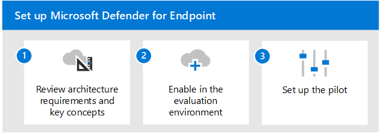

# Bewerten der Übersicht über Microsoft Defender für Endpunkt

**Gilt für:**

- Microsoft 365 Defender

In diesem Artikel wird der Prozess zum Aktivieren und Testen von Microsoft Defender für Endpunkt beschrieben. Bevor Sie mit diesem Prozess beginnen, stellen Sie sicher, dass Sie den allgemeinen Prozess für die [Auswertung von Microsoft 365 Defender](eval-overview.md) überprüft und die Microsoft 365 Defender [Evaluierungsumgebung erstellt](eval-create-eval-environment.md)haben. 
 

Führen Sie die folgenden Schritte aus, um Microsoft Defender für Endpunkt zu aktivieren und zu testen.

In der folgenden Tabelle werden die Schritte in der Abbildung beschrieben.

 |Schritt   |Beschreibung
|---------|---------|
| [Schritt 1. Überprüfen der Architekturanforderungen und der wichtigsten Konzepte](eval-defender-endpoint-architecture.md)    | Grundlegendes zur Defender für Endpunkt-Architektur und den ihnen zur Verfügung stehenden Funktionen.       |
|[Schritt 2. Aktivieren der Evaluierungsumgebung](eval-defender-office-365-enable-eval.md)     |   Führen Sie die Schritte zum Einrichten der Evaluierungsumgebung aus.      |
|[Schritt 3. Einrichten des Pilotprojekts ](eval-defender-office-365-pilot.md)    |    Überprüfen Sie Ihre Pilotgruppe, führen Sie Simulationen aus, und machen Sie sich mit den wichtigsten Features und Dashboards vertraut.     |

