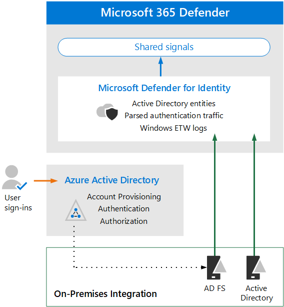

# Überprüfen der Architekturanforderungen und der wichtigsten Konzepte für Microsoft Defender for Identity

**Gilt für:**
- Microsoft 365 Defender

Dieser Artikel ist [Schritt 1 von 3](eval-defender-identity-overview.md) beim Einrichten der Evaluierungsumgebung für Microsoft Defender for Identity. Weitere Informationen zu diesem Prozess finden Sie im [Übersichtsartikel.](eval-defender-identity-overview.md)

Bevor Sie Microsoft Defender for Identity aktivieren, müssen Sie die Architektur verstehen und die Anforderungen erfüllen.

Microsoft Defender for Identity verwendet Machine Learning- und Verhaltensanalysen, um Angriffe in Ihrem lokalen Netzwerk zu erkennen und benutzerbezogene Anmelderisiken im Zusammenhang mit Cloudidentitäten zu erkennen und proaktiv zu verhindern. Weitere Informationen finden Sie unter [Was ist Microsoft Defender for Identity?](/defender-for-identity/what-is)

Defender for Identity schützt Ihre lokalen Active Directory-Benutzer und/oder Benutzer, die mit Ihrem Azure Active Directory synchronisiert werden (Azure AD). Informationen zum Schutz einer Umgebung, die nur aus Azure AD-Benutzern besteht, finden Sie unter [Azure AD Identity Protection.](/azure/active-directory/identity-protection/overview-identity-protection)

## Grundlegendes zur Architektur

Das folgende Diagramm veranschaulicht die Basisarchitektur für Defender for Identity. 

In dieser Abbildung:
- Auf AD-Domänencontrollern installierte Sensoren analysieren Protokolle und Netzwerkdatenverkehr und senden sie zur Analyse und Berichterstellung an Microsoft Defender for Identity.
-  Sensoren können auch Active Directory-Verbunddienste (AD FS) analysieren, wenn Azure AD für die Verwendung der Verbundauthentifizierung konfiguriert ist (gepunktete Linie in der Abbildung). 
- Microsoft Defender for Identity teilt Signale an Microsoft 365 Defender für die erweiterte Erkennung und Reaktion (Extended Detection and Response, XDR).

Defender for Identity-Sensoren können direkt auf den folgenden Servern installiert werden:

- Domänencontroller: Der Sensor überwacht den Domänencontrollerdatenverkehr direkt, ohne dass ein dedizierter Server oder eine Konfiguration der Portspiegelung erforderlich ist.
- AD FS: Der Sensor überwacht den Netzwerkdatenverkehr und Authentifizierungsereignisse direkt.

Einen tieferen Einblick in die Architektur von Defender for Identity, einschließlich der Integration in Cloud App Security, finden Sie in der [Microsoft Defender for Identity-Architektur.](/defender-for-identity/architecture)

## Grundlegendes zu den wichtigsten Konzepten

In der folgenden Tabelle sind die wichtigsten Konzepte aufgeführt, die beim Auswerten, Konfigurieren und Bereitstellen von Microsoft Defender for Identity zu verstehen sind.

|Konzept  |Beschreibung |Weitere Informationen  |
|---------|---------|---------|
| Überwachte Aktivitäten | Defender for Identity überwacht Signale, die aus Ihrer Organisation generiert werden, um verdächtige oder bösartige Aktivitäten zu erkennen, und hilft Ihnen, die Gültigkeit jeder potenziellen Bedrohung zu ermitteln, damit Sie effektiv selektieren und darauf reagieren können.  |  [Von Microsoft Defender for Identity überwachte Aktivitäten](/defender-for-identity/monitored-activities)       |
| Sicherheitswarnungen    | Sicherheitswarnungen von Defender for Identity erläutern die verdächtigen Aktivitäten, die von Sensoren in Ihrem Netzwerk erkannt werden, zusammen mit den an jeder Bedrohung beteiligten Akteure und Computern.   | [Sicherheitswarnungen für Microsoft Defender for Identity](/defender-for-identity/suspicious-activity-guide?tabs=external)    |
| Entitätsprofile    | Entitätsprofile bieten eine umfassende umfassende Untersuchung von Benutzern, Computern, Geräten und Ressourcen sowie deren Zugriffsverlauf.   | [Grundlegendes zu Entitätsprofilen](/defender-for-identity/entity-profiles)  |
| Laterale Bewegungspfade    | Eine wichtige Komponente von MDI-Sicherheitseinblicken ist die Identifizierung lateraler Bewegungspfade, in denen ein Angreifer nicht vertrauliche Konten verwendet, um Zugriff auf vertrauliche Konten oder Computer im gesamten Netzwerk zu erhalten.  | [Lateral Movement Paths (LMPs) von Microsoft Defender for Identity](/defender-for-identity/use-case-lateral-movement-path)  |
| Netzwerknamenauflösung    |  Die Netzwerknamenauflösung (Network Name Resolution, NNR) ist eine Komponente der MDI-Funktionalität, die Aktivitäten basierend auf Netzwerkdatenverkehr, Windows Ereignissen, ETW usw. erfasst und diese Rohdaten mit den relevanten Computern korreliert, die an jeder Aktivität beteiligt sind.       | [Was ist Netzwerknamenauflösung?](/defender-for-identity/nnr-policy)      |
| Berichte    | Mit Defender for Identity-Berichten können Sie Berichte planen oder sofort generieren und herunterladen, die System- und Entitätsstatusinformationen bereitstellen.  Sie können Berichte zu Systemintegrität, Sicherheitswarnungen und potenziellen lateralen Bewegungspfaden erstellen, die in Ihrer Umgebung erkannt werden.   | [Microsoft Defender for Identity-Berichte ](/defender-for-identity/reports)       |
| Rollengruppen    | Defender for Identity bietet rollenbasierte Gruppen und delegierten Zugriff, um Daten gemäß den spezifischen Sicherheits- und Complianceanforderungen Ihrer Organisation zu schützen, einschließlich Administratoren, Benutzern und Viewern.        |  [Microsoft Defender for Identity-Rollengruppen](/defender-for-identity/role-groups)       |
| Verwaltungsportal    |  Zusätzlich zum Microsoft 365 Security Center wird die Cab des Defender for Identity-Portals verwendet, um verdächtige Aktivitäten zu überwachen und darauf zu reagieren.      | [Arbeiten mit dem Microsoft Defender for Identity-Portal](/defender-for-identity/workspace-portal)        |
| Microsoft Cloud App Security Integration   | Microsoft Cloud App Security lässt sich in Microsoft Defender for Identity integrieren, um Verhaltensanalysen für Benutzerentitäten (User Entity Behavioral Analytics, UEBA) in einer Hybridumgebung bereitzustellen – sowohl in der Cloud-App als auch lokal.   | Microsoft Defender for Identity-Integration  |
| | | |

## Überprüfen der Voraussetzungen

Defender for Identity erfordert einige erforderliche Arbeit, um sicherzustellen, dass Ihre lokale Identität und Netzwerkkomponenten die Mindestanforderungen erfüllen. Verwenden Sie diesen Artikel als Prüfliste, um sicherzustellen, dass Ihre Umgebung bereit ist: [Voraussetzungen für Microsoft Defender for Identity.](/defender-for-identity/prerequisites)

## Nächste Schritte

Schritt 2 von 3: [Aktivieren der Evaluierungsumgebung defender for Identity](eval-defender-identity-enable-eval.md)

Kehren Sie zur Übersicht für ["Auswerten von Microsoft Defender for Identity"](eval-defender-identity-overview.md) zurück.

Kehren Sie zur Übersicht für [Evaluierungs- und Pilot-Microsoft 365 Defender](eval-overview.md) 