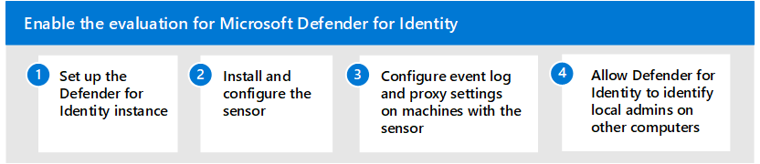

# Aktivieren der Evaluierungsumgebung für Microsoft Defender for IdentityEnable the evaluation environment for Microsoft Defender for Identity

**Gilt für:****Applies to:**
- Microsoft 365 DefenderMicrosoft 365 Defender

Dieser Artikel ist [Schritt 2 von 2](eval-defender-identity-overview.md) beim Einrichten der Evaluierungsumgebung für Microsoft Defender for Identity.This article is [Step 2 of 2](eval-defender-identity-overview.md) in the process of setting up the evaluation environment for Microsoft Defender for Identity. Weitere Informationen zu diesem Prozess finden Sie im [Übersichtsartikel.](eval-defender-identity-overview.md)For more information about this process, see the [overview article](eval-defender-identity-overview.md).

Führen Sie die folgenden Schritte aus, um Ihre Microsoft Defender for Identity-Umgebung einzurichten.Use the following steps to set up your Microsoft Defender for Identity environment. 

- [Schritt 1. Einrichten der Defender for Identity-InstanzStep 1. Set up the Defender for Identity Instance](#step-1-set-up-the-defender-for-identity-instance)
- [Schritt 2. Installieren und Konfigurieren des SensorsStep 2. Install and configure the sensor](#step-2-install-and-configure-the-sensor)
- [Schritt 3. Konfigurieren von Ereignisprotokoll- und Proxyeinstellungen auf Computern mit dem SensorStep 3. Configure event log and proxy settings on machines with the sensor](#step-3-configure-event-log-and-proxy-settings-on-machines-with-the-sensor)
- [Schritt 4. Zulassen, dass Defender for Identity lokale Administratoren auf anderen Computern identifiziertStep 4. Allow Defender for Identity to identify local admins on other computers](#step-4-allow-defender-for-identity-to-identify-local-admins-on-other-computers)

## Schritt 1.Step 1. Einrichten der Defender for Identity-InstanzSet up the Defender for Identity Instance

Melden Sie sich beim Defender for Identity-Portal an, um Ihre Instanz zu erstellen, und verbinden Sie diese Instanz mit Ihrer Active Directory-Umgebung.Sign in to the Defender for Identity portal to create your instance and then connect this instance to your Active Directory environment. 

|  |SchrittStep     |Weitere InformationenMore information  |
|---------|---------|---------|
|11     | Erstellen der Defender for Identity-InstanzCreate the Defender for Identity instance        | [Schnellstart: Erstellen Ihrer Microsoft Defender for Identity-InstanzQuickstart: Create your Microsoft Defender for Identity instance](/defender-for-identity/install-step1)        |
|22     | Verbinden der Defender for Identity-Instanz zu Ihrer Active Directory-GesamtstrukturConnect the Defender for Identity instance to your Active Directory forest   | [Schnellstart: Verbinden zu Ihrer Active Directory-GesamtstrukturQuickstart: Connect to your Active Directory Forest](/defender-for-identity/install-step2)  |
| | |

## Schritt 2.Step 2. Installieren und Konfigurieren des SensorsInstall and configure the sensor

Laden Sie als Nächstes den Defender for Identity-Sensor auf den Domänencontrollern und AD FS-Servern in Ihrer lokalen Umgebung herunter, installieren und konfigurieren Sie diesen.Next, download, install, and configure the Defender for Identity sensor on the domain controllers and AD FS servers in your on-premises environment.

|  |SchrittStep     |Weitere InformationenMore information  |
|---------|---------|---------|
|11     | Ermitteln Sie, wie viele Microsoft Defender for Identity-Sensoren Sie benötigen.Determine how many Microsoft Defender for Identity sensors you need.        | [Planen der Kapazität für Microsoft Defender for IdentityPlan capacity for Microsoft Defender for Identity](/defender-for-identity/capacity-planning)   |
|22     | Herunterladen des SensoreinrichtungspaketsDownload the sensor setup package  |  [Schnellstart: Herunterladen des Setuppakets für den Microsoft Defender for Identity-SensorQuickstart: Download the Microsoft Defender for Identity sensor setup package](/defender-for-identity/install-step3)   |
|33     | Installieren des Defender for Identity-SensorsInstall the Defender for Identity sensor    |  [Schnellstart: Installieren des Microsoft Defender for Identity-SensorsQuickstart: Install the Microsoft Defender for Identity sensor](/defender-for-identity/install-step4)       |
|4 4     | Konfigurieren des SensorsConfigure the sensor       |  [Konfigurieren von Microsoft Defender for Identity-Sensoreinstellungen Configure Microsoft Defender for Identity sensor settings ](/defender-for-identity/install-step5)   |
|   |         |         |

## Schritt 3:Step 3. Konfigurieren von Ereignisprotokoll- und Proxyeinstellungen auf Computern mit dem SensorConfigure event log and proxy settings on machines with the sensor

Konfigurieren Sie auf den Computern, auf denen Sie den Sensor installiert haben, Windows Ereignisprotokollsammlung und Internetproxyeinstellungen, um erkennungsfunktionen zu aktivieren und zu verbessern.On the machines that you installed the sensor on, configure Windows event log collection and Internet proxy settings to enable and enhance detection capabilities.

|  |SchrittStep     |Weitere InformationenMore information  |
|---------|---------|---------|
|11     | Konfigurieren Windows EreignisprotokollsammlungConfigure Windows event log collection         | [Konfigurieren Windows-EreignissammlungConfigure Windows Event collection](/defender-for-identity/configure-windows-event-collection)        |
|22     | Konfigurieren von InternetproxyeinstellungenConfigure Internet proxy settings        | [Konfigurieren von Endpunktproxy- und Internetkonnektivitätseinstellungen für Ihren Microsoft Defender for Identity SensorConfigure endpoint proxy and Internet connectivity settings for your Microsoft Defender for Identity Sensor](/defender-for-identity/configure-proxy)        |
|   |         |         |

## Schritt 4.Step 4. Zulassen, dass Defender for Identity lokale Administratoren auf anderen Computern identifiziertAllow Defender for Identity to identify local admins on other computers

Die Lateral Movement Path-Erkennung von Microsoft Defender for Identity basiert auf Abfragen, die lokale Administratoren auf bestimmten Computern identifizieren.Microsoft Defender for Identity lateral movement path detection relies on queries that identify local admins on specific machines. Diese Abfragen werden mit dem SAM-R-Protokoll unter Verwendung des Defender for Identity Service-Kontos ausgeführt.These queries are performed with the SAM-R protocol, using the Defender for Identity Service account. 

Um sicherzustellen Windows Clients und Server Ihrem Defender for Identity-Konto die Ausführung von SAM-R gestatten, muss eine Änderung an der Gruppenrichtlinie vorgenommen werden, um das Defender for Identity-Dienstkonto zusätzlich zu den konfigurierten Konten hinzuzufügen, die in der Netzwerkzugriffsrichtlinie aufgeführt sind.To ensure Windows clients and servers allow your Defender for Identity account to perform SAM-R, a modification to Group Policy must be made to add the Defender for Identity service account in addition to the configured accounts listed in the Network access policy. Stellen Sie sicher, dass Gruppenrichtlinien auf alle Computer **außer Domänencontrollern** angewendet werden.Make sure to apply group policies to all computers **except domain controllers**.

Anweisungen hierzu finden Sie unter [Konfigurieren von Microsoft Defender for Identity für Remoteaufrufe an SAM.](/defender-for-identity/install-step8-samr)For instructions on how to do this, see [Configure Microsoft Defender for Identity to make remote calls to SAM](/defender-for-identity/install-step8-samr). 

## Nächste SchritteNext steps

Schritt 3 von 3: Testen von [Microsoft Defender for Identity](eval-defender-identity-pilot.md)Step 3 of 3: [Pilot Microsoft Defender for Identity](eval-defender-identity-pilot.md)

Kehren Sie zur Übersicht für ["Auswerten von Microsoft Defender for Identity"](eval-defender-identity-overview.md) zurück.Return to the overview for [Evaluate Microsoft Defender for Identity](eval-defender-identity-overview.md)

Kehren Sie zur Übersicht für [Evaluierungs- und Pilot-Microsoft 365 Defender](eval-overview.md)Return to the overview for [Evaluate and pilot Microsoft 365 Defender](eval-overview.md)