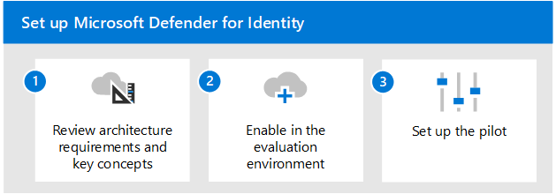

# Bewerten der Übersicht über Microsoft Defender for IdentityEvaluate Microsoft Defender for Identity overview

**Gilt für:****Applies to:**
- Microsoft 365 DefenderMicrosoft 365 Defender

In diesem Artikel wird der Prozess zum Aktivieren und Testen von Microsoft Defender for Identity beschrieben.This article outlines the process to enable and pilot Microsoft Defender for Identity. Bevor Sie mit diesem Prozess beginnen, stellen Sie sicher, dass Sie den allgemeinen Prozess für die [Auswertung von Microsoft 365 Defender](eval-overview.md) überprüft und die Microsoft 365 Defender [Evaluierungsumgebung erstellt](eval-create-eval-environment.md)haben.Before starting this process, be sure you've reviewed the overall process for [evaluating Microsoft 365 Defender](eval-overview.md) and you have [created the Microsoft 365 Defender evaluation environment](eval-create-eval-environment.md). 
 

Führen Sie die folgenden Schritte aus, um Microsoft Defender for Identity zu aktivieren und zu testen.Use the following steps to enable and pilot Microsoft Defender for Identity.

In der folgenden Tabelle werden die Schritte in der Abbildung beschrieben.The following table describes the steps in the illustration.

| |SchrittStep  |BeschreibungDescription  |
|---------|---------|---------|
|11|[Überprüfen der Architekturanforderungen und der wichtigsten KonzepteReview architecture requirements and key concepts](eval-defender-identity-architecture.md)    | Verstehen Sie die Defender for Identity-Architektur, und stellen Sie sicher, dass Ihre Umgebung die Architekturvoraussetzungen erfüllt.Understand the Defender for Identity architecture and be sure your environment meets the architecture prerequisites.       |
|22|[Aktivieren der EvaluierungsumgebungEnable the evaluation environment](eval-defender-identity-enable-eval.md)     |   Führen Sie die Schritte zum Einrichten der Evaluierungsumgebung aus.Follow the steps to set up the evaluation environment.      |
|33|[Einrichten des PilotprojektsSet up the pilot](eval-defender-identity-pilot.md)     |   Erfahren Sie mehr über Benchmark-Einstellungen für Ihre Identitätsumgebung, und testen Sie Defender for Identity-Lernprogramme.Learn about benchmark settings for your identity environment and try out Defender for Identity tutorials.     |
||||

