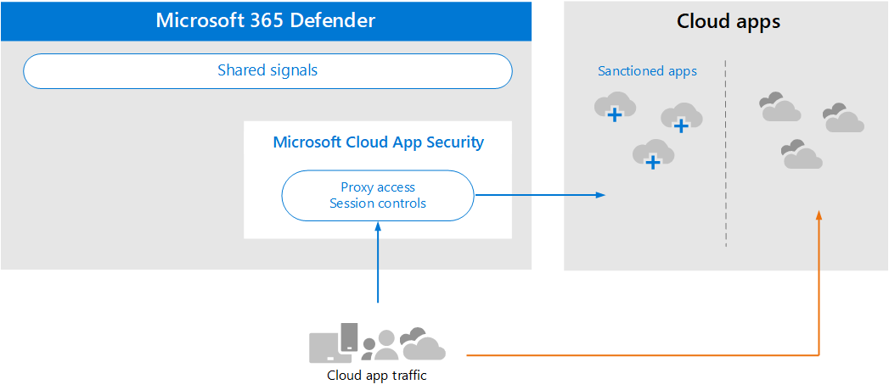

# Überprüfen der Architekturanforderungen und der wichtigsten Konzepte für Microsoft Cloud App SecurityReview architecture requirements and key concepts for Microsoft Cloud App Security

**Gilt für:****Applies to:**

- Microsoft 365 DefenderMicrosoft 365 Defender

Dieser Artikel ist [Schritt 1 von 3](eval-defender-mcas-overview.md) bei der Einrichtung der Evaluierungsumgebung für Microsoft Cloud App Security zusammen mit Microsoft 365 Defender.This article is [Step 1 of 3](eval-defender-mcas-overview.md) in the process of setting up the evaluation environment for Microsoft Cloud App Security alongside Microsoft 365 Defender. Weitere Informationen zu diesem Prozess finden Sie im [Übersichtsartikel.](eval-defender-identity-overview.md)For more information about this process, see the [overview article](eval-defender-identity-overview.md).

Bevor Sie Microsoft Cloud App Security aktivieren, stellen Sie sicher, dass Sie die Architektur verstehen und die Anforderungen erfüllen können.Before enabling Microsoft Cloud App Security, be sure you understand the architecture and can meet the requirements. 

## Grundlegendes zur ArchitekturUnderstand the architecture

Microsoft Cloud App Security ist ein Cloud Access Security Broker (CASB).Microsoft Cloud App Security is a Cloud Access Security Broker (CASB). CASBs fungieren als Torwart, um den Zugriff in Echtzeit zwischen Ihren Unternehmensbenutzern und den von ihnen verwendeten Cloudressourcen zu vermitteln, unabhängig davon, wo sich Ihre Benutzer befinden und unabhängig vom verwendeten Gerät.CASBs act a gatekeeper to broker access in real time between your enterprise users and cloud resources they use, wherever your users are located and regardless of the device they are using. Microsoft Cloud App Security lässt sich systemintern in die Sicherheitsfunktionen von Microsoft integrieren, einschließlich Microsoft 365 Defender.Microsoft Cloud App Security natively integrates with Microsoft security capabilities, including Microsoft 365 Defender. 

Ohne Cloud App Security sind Cloud-Apps, die von Ihrer Organisation verwendet werden, nicht verwaltet und ungeschützte, wie dargestellt.Without Cloud App Security, cloud apps that are used by your organization are unmanaged and unprotected, as illustrated.

In der Abbildung sehen Sie Folgendes:In the illustration:
- Die Verwendung von Cloud-Apps durch eine Organisation wird nicht überwacht und nicht geschützt.The use of cloud apps by an organization is unmonitored and unprotected. 
- Diese Verwendung unterliegt nicht den Schutzmaßnahmen, die in einer verwalteten Organisation erreicht wurden.This use falls outside the protections achieved within a managed organization. 

#### Entdecken von Cloud-AppsDiscovering cloud apps

Der erste Schritt bei der Verwaltung der Verwendung von Cloud-Apps besteht darin, zu ermitteln, welche Cloud-Apps von Ihrer Organisation verwendet werden.The first step to managing the use of cloud apps is to discover which cloud apps are used by your organization. Dieses nächste Diagramm veranschaulicht, wie cloud discovery mit Cloud App Security funktioniert.This next diagram illustrates how cloud discovery works with Cloud App Security.

In dieser Abbildung gibt es zwei Methoden, die verwendet werden können, um den Netzwerkdatenverkehr zu überwachen und Cloud-Apps zu ermitteln, die von Ihrer Organisation verwendet werden.In this illustration, there are two methods that can be used to monitor network traffic and discover cloud apps that are being used by your organization.
- A:A. Cloud App Discovery lässt sich systemintern in Microsoft Defender für Endpunkt integrieren.Cloud App Discovery integrates with Microsoft Defender for Endpoint natively. Defender für Endpunkt meldet Cloud-Apps und -Dienste, auf die von IT-verwalteten Windows 10 Geräten zugegriffen wird.Defender for Endpoint reports cloud apps and services being accessed from IT-managed Windows 10 devices. 
- B.B. Für die Abdeckung auf allen Geräten, die mit einem Netzwerk verbunden sind, wird der Cloud App Security Protokollsammler in Firewalls und anderen Proxys installiert, um Daten von Endpunkten zu sammeln.For coverage on all devices connected to a network, the Cloud App Security log collector is installed on firewalls and other proxies to collect data from endpoints. Diese Daten werden zur Analyse an Cloud App Security gesendet.This data is sent to Cloud App Security for analysis.

#### Verwalten von Cloud-AppsManaging cloud apps

Nachdem Sie Cloud-Apps ermittelt und das Verhalten ihrer Nutzung durch Ihre Organisation analysiert haben, können Sie mit der Verwaltung der von Ihnen ausgewählten Cloud-Apps beginnen.After you discover cloud apps and analyze the behavior of how these are used by your organization, you can begin managing cloud apps that you choose. 

In dieser Abbildung:In this illustration:
- Einige Apps werden für die Verwendung sanktioniert.Some apps are sanctioned for use. Dies ist eine einfache Möglichkeit, mit der Verwaltung von Apps zu beginnen.This is a simple way of beginning to manage apps.
- Sie können eine bessere Sichtbarkeit und Kontrolle ermöglichen, indem Sie Apps mit App-Connectors verbinden.You can enable greater visibility and control by connecting apps with app connectors. App-Connectors verwenden die APIs von App-Anbietern.App connectors use the APIs of app providers.

#### Anwenden von Sitzungssteuerelementen auf Cloud-AppsApplying session controls to cloud apps

Microsoft Cloud App Security dient als Reverseproxy und bietet Proxyzugriff auf sanktionierte Cloud-Apps.Microsoft Cloud App Security serves as a reverse proxy, providing proxy access to sanctioned cloud apps. Dadurch können Cloud App Security von Ihnen konfigurierte Sitzungssteuerelemente anwenden.This allows Cloud App Security to apply session controls that you configure. 

In dieser Abbildung:In this illustration:
- Der Zugriff auf sanktionierte Cloud-Apps von Benutzern und Geräten in Ihrer Organisation wird über Cloud App Security weitergeleitet.Access to sanctioned cloud apps from users and devices in your organization is routed through Cloud App Security.
- Dieser Proxyzugriff ermöglicht die Anwendung von Sitzungssteuerelementen.This proxy access allows session controls to be applied.
- Cloud-Apps, die Sie nicht sanktioniert oder explizit nicht genehmigt haben, sind davon nicht betroffen.Cloud apps that you have not sanctioned or explicitly unsanctioned are not affected.

Mit Sitzungssteuerelementen können Sie Parameter auf die Verwendung von Cloud-Apps in Ihrer Organisation anwenden.Session controls allow you to apply parameters to how cloud apps are used by your organization. Wenn Ihre Organisation beispielsweise Salesforce verwendet, können Sie eine Sitzungsrichtlinie konfigurieren, die nur verwalteten Geräten den Zugriff auf die Daten Ihrer Organisation in Salesforce ermöglicht.For example, if your organization is using Salesforce, you can configure a session policy that allows only managed devices to access your organization's data in Salesforce. Ein einfacheres Beispiel könnte das Konfigurieren einer Richtlinie zum Überwachen des Datenverkehrs von nicht verwalteten Geräten sein, damit Sie das Risiko dieses Datenverkehrs analysieren können, bevor Sie strengere Richtlinien anwenden.A simpler example could be configuring a policy to monitor traffic from unmanaged devices so you can analyze the risk of this traffic before applying stricter policies.

#### Integration in Azure AD mit app-Steuerung für bedingten ZugriffIntegrating with Azure AD with Conditional Access App Control

Möglicherweise wurden Ihrem Azure AD-Mandanten bereits SaaS-Apps hinzugefügt, um die mehrstufige Authentifizierung und andere Richtlinien für bedingten Zugriff zu erzwingen.You might already have SaaS apps added to your Azure AD tenant to enforce multi-factor authentication and other conditional access policies. Microsoft Cloud App Security kann nativ in Azure AD integriert werden.Microsoft Cloud App Security natively integrates with Azure AD. Sie müssen nur eine Richtlinie in Azure AD konfigurieren, um die App-Steuerung für bedingten Zugriff in Cloud App Security zu verwenden.All you have to do is configure a policy in Azure AD to use Conditional Access App Control in Cloud App Security. Dadurch wird der Netzwerkdatenverkehr für diese verwalteten SaaS-Apps als Proxy über Cloud App Security geleitet, wodurch Cloud App Security diesen Datenverkehr überwachen und Sitzungssteuerelemente anwenden können.This routes network traffic for these managed SaaS apps through Cloud App Security as a proxy, which allows Cloud App Security to monitor this traffic and to apply session controls. 

In dieser Abbildung:In this illustration:
- SaaS-Apps sind in den Azure AD-Mandanten integriert.SaaS apps are integrated with the Azure AD tenant. Dadurch kann Azure AD Richtlinien für bedingten Zugriff erzwingen, einschließlich der mehrstufigen Authentifizierung.This allows Azure AD to enforce conditional access policies, including multi-factor authentication.
- Azure Active Directory wird eine Richtlinie hinzugefügt, um den Datenverkehr für SaaS-Apps an Cloud App Security zu leiten.A policy is added to Azure Active Directory to direct traffic for SaaS apps to Cloud App Security. Die Richtlinie gibt an, auf welche SaaS-Apps diese Richtlinie angewendet werden soll.The policy specifies which SaaS apps to apply this policy to. Daher leitet Azure AD den Sitzungsdatenverkehr über Cloud App Security, nachdem Azure AD bedingte Zugriffsrichtlinien erzwungen hat, die für diese SaaS-Apps gelten.Consequently, after Azure AD enforces any conditional access policies that apply to these SaaS apps, Azure AD then directs (proxies) the session traffic through Cloud App Security.
- Cloud App Security überwacht diesen Datenverkehr und wendet alle Sitzungssteuerungsrichtlinien an, die von Administratoren konfiguriert wurden.Cloud App Security monitors this traffic and applies any session control policies that have been configured by administrators. 

Möglicherweise haben Sie Cloud-Apps mit Cloud App Security ermittelt und sanktioniert, die azure AD nicht hinzugefügt wurden.You might have discovered and sanctioned cloud apps using Cloud App Security that have not been added to Azure AD. Sie können die App-Steuerung für bedingten Zugriff nutzen, indem Sie diese Cloud-Apps Ihrem Azure AD-Mandanten und dem Umfang Ihrer Regeln für bedingten Zugriff hinzufügen.You can take advantage of Conditional Access App Control by adding these cloud apps to your Azure AD tenant and the scope of your conditional access rules.

#### Schützen Ihrer Organisation vor HackernProtecting your organization from hackers

Cloud App Security bietet allein leistungsstarken Schutz.Cloud App Security provides powerful protection on its own. In Kombination mit den anderen Funktionen von Microsoft 365 Defender stellt Cloud App Security jedoch Daten in die gemeinsamen Signale bereit, die zusammen dazu beiträgt, Angriffe zu stoppen.However, when combined with the other capabilities of Microsoft 365 Defender, Cloud App Security provides data into the shared signals which, together, helps stop attacks.

Es empfiehlt sich, diese Abbildung aus der Übersicht bis zu diesem Microsoft 365 Defender Evaluierungs- und Pilotleitfaden zu wiederholen.It's worth repeating this illustration from the overview to this Microsoft 365 Defender evaluation and pilot guide. 

Auf der rechten Seite dieser Abbildung zeigt Microsoft Cloud App Security anomales Verhalten wie unmögliche Reisen, Zugriff auf Anmeldeinformationen und ungewöhnliche Download-, Dateifreigabe- oder E-Mail-Weiterleitungsaktivitäten und meldet diese an das Sicherheitsteam.Focusing on the right side of this illustration, Microsoft Cloud App Security notices anomalous behavior like impossible-travel, credential access, and unusual download, file share, or mail forwarding activity and reports these to the security team. Daher trägt Cloud App Security dazu bei, laterale Bewegungen durch Hacker und die Exfiltration vertraulicher Daten zu verhindern.Consequently, Cloud App Security helps prevent lateral movement by hackers and exfiltration of sensitive data. Microsoft 356 Defender korreliert die Signale aller Komponenten, um den gesamten Angriffsabschnitt bereitzustellen.Microsoft 356 Defender correlates the signals from all the components to provide the full attack story.

## Grundlegendes zu den wichtigsten KonzeptenUnderstand key concepts

In der folgenden Tabelle sind wichtige Konzepte aufgeführt, die beim Auswerten, Konfigurieren und Bereitstellen von Microsoft Cloud App Security zu verstehen sind.The following table identified key concepts that are important to understand when evaluating, configuring, and deploying Microsoft Cloud App Security.

|KonzeptConcept  |BeschreibungDescription |Weitere InformationenMore information  |
|---------|---------|---------|
| Cloud App Security InstrumententafelCloud App Security Dashboard | Enthält eine Übersicht über die wichtigsten Informationen zu Ihrer Organisation und bietet Links zu ausführlicheren Untersuchungen.Presents an overview of the most important information about your organization and gives links to deeper investigation.        | [Arbeiten mit dem Dashboard Working with the dashboard ](/cloud-app-security/daily-activities-to-protect-your-cloud-environment)       |
| App-Steuerung für bedingten ZugriffConditional Access App Control    | Reverseproxyarchitektur, die in Ihren Identitätsanbieter (IdP) integriert ist, um Azure AD-Richtlinien für bedingten Zugriff zu erteilen und sitzungssteuerungen selektiv zu erzwingen.Reverse proxy architecture that integrates with your Identity Provider (IdP) to give Azure AD conditional access policies and selectively enforce session controls.        |  [Schützen von Apps mit Microsoft Cloud App Security App-Steuerung für bedingten ZugriffProtect apps with Microsoft Cloud App Security Conditional Access App Control](/cloud-app-security/proxy-intro-aad)       |
|  Cloud-App-KatalogCloud App Catalog   | Der Cloud-App-Katalog bietet Ihnen ein vollständiges Bild im Vergleich zum Microsoft-Katalog mit über 16.000 Cloud-Apps, die basierend auf mehr als 80 Risikofaktoren bewertet und bewertet werden.The Cloud App Catalog gives you a full picture against Microsoft catalog of over 16,000 cloud apps that are ranked and scored based on more than 80 risk factors.    |  [Arbeiten mit App-RisikobewertungenWorking with App risk scores](/cloud-app-security/risk-score)       |
| Cloud Discovery-DashboardCloud Discovery Dashboard    | Cloud Discovery analysiert Ihre Datenverkehrsprotokolle und soll mehr Einblick in die Verwendung von Cloud-Apps in Ihrer Organisation sowie Warnungen und Risikostufen geben.Cloud Discovery analyzes your traffic logs and is designed to give more insight into how cloud apps are being used in your organization as well as give alerts and risk levels.     |  [Arbeiten mit entdeckten Apps   Working with discovered apps   ](/cloud-app-security/discovered-apps)    |
|Verbundene AppsConnected Apps |Cloud App Security bietet End-to-End-Schutz für verbundene Apps mit Cloud-zu-Cloud-Integration, API-Connectors und Echtzeitzugriffs- und Sitzungssteuerelementen, die unsere bedingten App-Zugriffssteuerungen nutzen.Cloud App Security provides end-to-end protection for connected apps using Cloud-to-Cloud integration, API connectors, and real-time access and session controls leveraging our Conditional App Access Controls. |[Schützen verbundener AppsProtecting connected apps](/cloud-app-security/protect-connected-apps) |
| | | |

## Überprüfen der ArchitekturanforderungenReview architecture requirements

### Entdecken von Cloud-AppsDiscovering cloud apps

Um die in Ihrer Umgebung verwendeten Cloud-Apps zu ermitteln, können Sie eine oder beide der folgenden Aktionen ausführen:To discover cloud apps used in your environment, you can do one or both of the following:

- Beginnen Sie schnell mit Cloud Discovery, indem Sie sich in Microsoft Defender für Endpunkt integrieren.Get up and running quickly with Cloud Discovery by integrating with Microsoft Defender for Endpoint. Mit dieser systemeigenen Integration können Sie sofort mit der Erfassung von Daten im Clouddatenverkehr auf Ihren Windows 10 Geräten, in ihrem Netzwerk und außerhalb Ihres Netzwerks beginnen.This native integration enables you to immediately start collecting data on cloud traffic across your Windows 10 devices, on and off your network.
- Um alle Cloud-Apps zu ermitteln, auf die von allen Geräten zugegriffen wird, die mit Ihrem Netzwerk verbunden sind, stellen Sie den Cloud App Security Protokollsammler in Ihren Firewalls und anderen Proxys bereit.To discover all cloud apps accessed by all devices connected to your network, deploy the Cloud App Security log collector on your firewalls and other proxies. Dadurch werden Daten von Ihren Endpunkten gesammelt und zur Analyse an Cloud App Security gesendet.This collects data from your endpoints and sends it to Cloud App Security for analysis. Cloud App Security lässt sich nativ in einige Proxys von Drittanbietern integrieren, um noch mehr Funktionen zu bieten.Cloud App Security natively integrates with some third-party proxies for even more capabilities.

Diese Optionen sind in [Schritt 2 enthalten. Aktivieren Sie die Evaluierungsumgebung.](eval-defender-mcas-enable-eval.md)These options are included in [Step 2. Enable the evaluation environment](eval-defender-mcas-enable-eval.md). 

### Anwenden von Azure AD-Richtlinien für bedingten Zugriff auf Cloud-AppsApplying Azure AD Conditional Access policies to cloud apps

Die App-Steuerung für bedingten Zugriff (die Möglichkeit, Richtlinien für bedingten Zugriff auf Cloud-Apps anzuwenden) erfordert eine Integration in Azure AD.Conditional Access App Control (the ability to apply Conditional Access policies to cloud apps) requires integration with Azure AD. Dies ist keine Voraussetzung für die ersten Schritte mit Cloud App Security.This isn't a requirement for getting started with Cloud App Security. Es ist ein Schritt, den wir Ihnen empfehlen, während der Pilotphase – Schritt 3 – [auszuprobieren. Pilot Microsoft Cloud App Security](eval-defender-mcas-pilot.md).It is a step we encourage you to try out during the pilot phase — [Step 3. Pilot Microsoft Cloud App Security](eval-defender-mcas-pilot.md).

## SIEM-IntegrationSIEM integration

Sie können Microsoft Cloud App Security mit Ihrem generischen SIEM-Server oder mit Azure Sentinel integrieren, um die zentrale Überwachung von Warnungen und Aktivitäten von verbundenen Apps zu ermöglichen.You can integrate Microsoft Cloud App Security with your generic SIEM server or with Azure Sentinel to enable centralized monitoring of alerts and activities from connected apps. 

Darüber hinaus enthält Azure Sentinel einen Microsoft Cloud App Security Connector, um eine tiefere Integration in Azure Sentinel zu ermöglichen.Additionally, Azure Sentinel includes a Microsoft Cloud App Security connector to provide deeper integration with Azure Sentinel. Auf diese Weise erhalten Sie nicht nur Einblicke in Ihre Cloud-Apps, sondern auch komplexe Analysen, um Cyberbedrohungen zu erkennen und zu bekämpfen und zu steuern, wie Ihre Daten übertragen werden.This enables you to not only gain visibility into your cloud apps but to also get sophisticated analytics to identify and combat cyberthreats and to control how your data travels.

- [Generische SIEM-IntegrationGeneric SIEM integration](/cloud-app-security/siem)
- [Streamen von Warnungen und Cloud Discovery-Protokollen von MCAS in Azure SentinelStream alerts and Cloud Discovery logs from MCAS into Azure Sentinel](/azure/sentinel/connect-cloud-app-security)

### Nächste SchritteNext steps

Schritt 2 von 3: [Aktivieren der Evaluierungsumgebung für Microsoft Cloud App Security](eval-defender-mcas-enable-eval.md)Step 2 of 3: [Enable the evaluation environment for Microsoft Cloud App Security](eval-defender-mcas-enable-eval.md)

Kehren Sie zur Übersicht für ["Auswerten Microsoft Cloud App Security"](eval-defender-mcas-overview.md) zurück.Return to the overview for [Evaluate Microsoft Cloud App Security](eval-defender-mcas-overview.md)

Kehren Sie zur Übersicht für [Evaluierungs- und Pilot-Microsoft 365 Defender](eval-overview.md)Return to the overview for [Evaluate and pilot Microsoft 365 Defender](eval-overview.md)