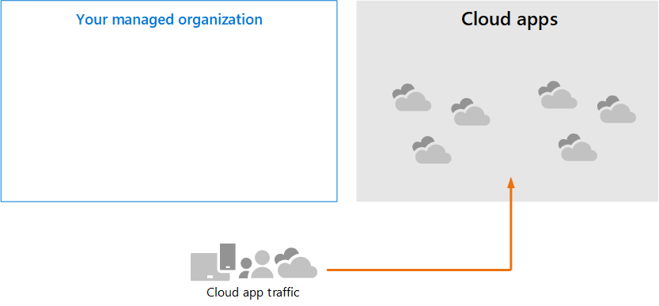
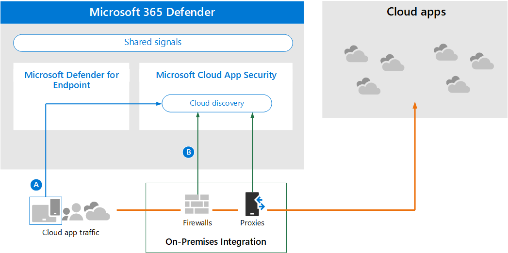

# Überprüfen der Architekturanforderungen und der wichtigsten Konzepte für Microsoft Cloud App Security

**Gilt für:**

- Microsoft 365 Defender

Dieser Artikel ist [Schritt 1 von 3](eval-defender-mcas-overview.md) bei der Einrichtung der Evaluierungsumgebung für Microsoft Cloud App Security zusammen mit Microsoft 365 Defender. Weitere Informationen zu diesem Prozess finden Sie im [Übersichtsartikel.](eval-defender-identity-overview.md)

Bevor Sie Microsoft Cloud App Security aktivieren, stellen Sie sicher, dass Sie die Architektur verstehen und die Anforderungen erfüllen können. 

## Grundlegendes zur Architektur

Microsoft Cloud App Security ist ein Cloud Access Security Broker (CASB). CASBs fungieren als Torwart, um den Zugriff in Echtzeit zwischen Ihren Unternehmensbenutzern und den von ihnen verwendeten Cloudressourcen zu vermitteln, unabhängig davon, wo sich Ihre Benutzer befinden und unabhängig vom verwendeten Gerät. Microsoft Cloud App Security lässt sich systemintern in die Sicherheitsfunktionen von Microsoft integrieren, einschließlich Microsoft 365 Defender. 

Ohne Cloud App Security sind Cloud-Apps, die von Ihrer Organisation verwendet werden, nicht verwaltet und ungeschützte, wie dargestellt.

In der Abbildung sehen Sie Folgendes:
- Die Verwendung von Cloud-Apps durch eine Organisation wird nicht überwacht und nicht geschützt. 
- Diese Verwendung unterliegt nicht den Schutzmaßnahmen, die in einer verwalteten Organisation erreicht wurden. 

#### Entdecken von Cloud-Apps

Der erste Schritt bei der Verwaltung der Verwendung von Cloud-Apps besteht darin, zu ermitteln, welche Cloud-Apps von Ihrer Organisation verwendet werden. Dieses nächste Diagramm veranschaulicht, wie cloud discovery mit Cloud App Security funktioniert.

In dieser Abbildung gibt es zwei Methoden, die verwendet werden können, um den Netzwerkdatenverkehr zu überwachen und Cloud-Apps zu ermitteln, die von Ihrer Organisation verwendet werden.
- A: Cloud App Discovery lässt sich systemintern in Microsoft Defender für Endpunkt integrieren. Defender für Endpunkt meldet Cloud-Apps und -Dienste, auf die von IT-verwalteten Windows 10 Geräten zugegriffen wird. 
- B. Für die Abdeckung auf allen Geräten, die mit einem Netzwerk verbunden sind, wird der Cloud App Security Protokollsammler in Firewalls und anderen Proxys installiert, um Daten von Endpunkten zu sammeln. Diese Daten werden zur Analyse an Cloud App Security gesendet.

#### Verwalten von Cloud-Apps

Nachdem Sie Cloud-Apps ermittelt und das Verhalten ihrer Nutzung durch Ihre Organisation analysiert haben, können Sie mit der Verwaltung der von Ihnen ausgewählten Cloud-Apps beginnen. 

In dieser Abbildung:
- Einige Apps werden für die Verwendung sanktioniert. Dies ist eine einfache Möglichkeit, mit der Verwaltung von Apps zu beginnen.
- Sie können eine bessere Sichtbarkeit und Kontrolle ermöglichen, indem Sie Apps mit App-Connectors verbinden. App-Connectors verwenden die APIs von App-Anbietern.

#### Anwenden von Sitzungssteuerelementen auf Cloud-Apps

Microsoft Cloud App Security dient als Reverseproxy und bietet Proxyzugriff auf sanktionierte Cloud-Apps. Dadurch können Cloud App Security von Ihnen konfigurierte Sitzungssteuerelemente anwenden. 

In dieser Abbildung:
- Der Zugriff auf sanktionierte Cloud-Apps von Benutzern und Geräten in Ihrer Organisation wird über Cloud App Security weitergeleitet.
- Dieser Proxyzugriff ermöglicht die Anwendung von Sitzungssteuerelementen.
- Cloud-Apps, die Sie nicht sanktioniert oder explizit nicht genehmigt haben, sind davon nicht betroffen.

Mit Sitzungssteuerelementen können Sie Parameter auf die Verwendung von Cloud-Apps in Ihrer Organisation anwenden. Wenn Ihre Organisation beispielsweise Salesforce verwendet, können Sie eine Sitzungsrichtlinie konfigurieren, die nur verwalteten Geräten den Zugriff auf die Daten Ihrer Organisation in Salesforce ermöglicht. Ein einfacheres Beispiel könnte das Konfigurieren einer Richtlinie zum Überwachen des Datenverkehrs von nicht verwalteten Geräten sein, damit Sie das Risiko dieses Datenverkehrs analysieren können, bevor Sie strengere Richtlinien anwenden.

#### Integration in Azure AD mit app-Steuerung für bedingten Zugriff

Möglicherweise wurden Ihrem Azure AD-Mandanten bereits SaaS-Apps hinzugefügt, um die mehrstufige Authentifizierung und andere Richtlinien für bedingten Zugriff zu erzwingen. Microsoft Cloud App Security kann nativ in Azure AD integriert werden. Sie müssen nur eine Richtlinie in Azure AD konfigurieren, um die App-Steuerung für bedingten Zugriff in Cloud App Security zu verwenden. Dadurch wird der Netzwerkdatenverkehr für diese verwalteten SaaS-Apps als Proxy über Cloud App Security geleitet, wodurch Cloud App Security diesen Datenverkehr überwachen und Sitzungssteuerelemente anwenden können. 

In dieser Abbildung:
- SaaS-Apps sind in den Azure AD-Mandanten integriert. Dadurch kann Azure AD Richtlinien für bedingten Zugriff erzwingen, einschließlich der mehrstufigen Authentifizierung.
- Azure Active Directory wird eine Richtlinie hinzugefügt, um den Datenverkehr für SaaS-Apps an Cloud App Security zu leiten. Die Richtlinie gibt an, auf welche SaaS-Apps diese Richtlinie angewendet werden soll. Daher leitet Azure AD den Sitzungsdatenverkehr über Cloud App Security, nachdem Azure AD bedingte Zugriffsrichtlinien erzwungen hat, die für diese SaaS-Apps gelten.
- Cloud App Security überwacht diesen Datenverkehr und wendet alle Sitzungssteuerungsrichtlinien an, die von Administratoren konfiguriert wurden. 

Möglicherweise haben Sie Cloud-Apps mit Cloud App Security ermittelt und sanktioniert, die azure AD nicht hinzugefügt wurden. Sie können die App-Steuerung für bedingten Zugriff nutzen, indem Sie diese Cloud-Apps Ihrem Azure AD-Mandanten und dem Umfang Ihrer Regeln für bedingten Zugriff hinzufügen.

#### Schützen Ihrer Organisation vor Hackern

Cloud App Security bietet allein leistungsstarken Schutz. In Kombination mit den anderen Funktionen von Microsoft 365 Defender stellt Cloud App Security jedoch Daten in die gemeinsamen Signale bereit, die zusammen dazu beiträgt, Angriffe zu stoppen.

Es empfiehlt sich, diese Abbildung aus der Übersicht bis zu diesem Microsoft 365 Defender Evaluierungs- und Pilotleitfaden zu wiederholen. 

Auf der rechten Seite dieser Abbildung zeigt Microsoft Cloud App Security anomales Verhalten wie unmögliche Reisen, Zugriff auf Anmeldeinformationen und ungewöhnliche Download-, Dateifreigabe- oder E-Mail-Weiterleitungsaktivitäten und meldet diese an das Sicherheitsteam. Daher trägt Cloud App Security dazu bei, laterale Bewegungen durch Hacker und die Exfiltration vertraulicher Daten zu verhindern. Microsoft 356 Defender korreliert die Signale aller Komponenten, um den gesamten Angriffsabschnitt bereitzustellen.

## Grundlegendes zu den wichtigsten Konzepten

In der folgenden Tabelle sind wichtige Konzepte aufgeführt, die beim Auswerten, Konfigurieren und Bereitstellen von Microsoft Cloud App Security zu verstehen sind.

|Konzept  |Beschreibung |Weitere Informationen  |
|---------|---------|---------|
| Cloud App Security Instrumententafel | Enthält eine Übersicht über die wichtigsten Informationen zu Ihrer Organisation und bietet Links zu ausführlicheren Untersuchungen.        | [Arbeiten mit dem Dashboard ](/cloud-app-security/daily-activities-to-protect-your-cloud-environment)       |
| App-Steuerung für bedingten Zugriff    | Reverseproxyarchitektur, die in Ihren Identitätsanbieter (IdP) integriert ist, um Azure AD-Richtlinien für bedingten Zugriff zu erteilen und sitzungssteuerungen selektiv zu erzwingen.        |  [Schützen von Apps mit Microsoft Cloud App Security App-Steuerung für bedingten Zugriff](/cloud-app-security/proxy-intro-aad)       |
|  Cloud-App-Katalog   | Der Cloud-App-Katalog bietet Ihnen ein vollständiges Bild im Vergleich zum Microsoft-Katalog mit über 16.000 Cloud-Apps, die basierend auf mehr als 80 Risikofaktoren bewertet und bewertet werden.    |  [Arbeiten mit App-Risikobewertungen](/cloud-app-security/risk-score)       |
| Cloud Discovery-Dashboard    | Cloud Discovery analysiert Ihre Datenverkehrsprotokolle und soll mehr Einblick in die Verwendung von Cloud-Apps in Ihrer Organisation sowie Warnungen und Risikostufen geben.     |  [Arbeiten mit entdeckten Apps   ](/cloud-app-security/discovered-apps)    |
|Verbundene Apps |Cloud App Security bietet End-to-End-Schutz für verbundene Apps mit Cloud-zu-Cloud-Integration, API-Connectors und Echtzeitzugriffs- und Sitzungssteuerelementen, die unsere bedingten App-Zugriffssteuerungen nutzen. |[Schützen verbundener Apps](/cloud-app-security/protect-connected-apps) |
| | | |

## Überprüfen der Architekturanforderungen

### Entdecken von Cloud-Apps

Um die in Ihrer Umgebung verwendeten Cloud-Apps zu ermitteln, können Sie eine oder beide der folgenden Aktionen ausführen:

- Beginnen Sie schnell mit Cloud Discovery, indem Sie sich in Microsoft Defender für Endpunkt integrieren. Mit dieser systemeigenen Integration können Sie sofort mit der Erfassung von Daten im Clouddatenverkehr auf Ihren Windows 10 Geräten, in ihrem Netzwerk und außerhalb Ihres Netzwerks beginnen.
- Um alle Cloud-Apps zu ermitteln, auf die von allen Geräten zugegriffen wird, die mit Ihrem Netzwerk verbunden sind, stellen Sie den Cloud App Security Protokollsammler in Ihren Firewalls und anderen Proxys bereit. Dadurch werden Daten von Ihren Endpunkten gesammelt und zur Analyse an Cloud App Security gesendet. Cloud App Security lässt sich nativ in einige Proxys von Drittanbietern integrieren, um noch mehr Funktionen zu bieten.

Diese Optionen sind in [Schritt 2 enthalten. Aktivieren Sie die Evaluierungsumgebung.](eval-defender-mcas-enable-eval.md) 

### Anwenden von Azure AD-Richtlinien für bedingten Zugriff auf Cloud-Apps

Die App-Steuerung für bedingten Zugriff (die Möglichkeit, Richtlinien für bedingten Zugriff auf Cloud-Apps anzuwenden) erfordert eine Integration in Azure AD. Dies ist keine Voraussetzung für die ersten Schritte mit Cloud App Security. Es ist ein Schritt, den wir Ihnen empfehlen, während der Pilotphase – Schritt 3 – [auszuprobieren. Pilot Microsoft Cloud App Security](eval-defender-mcas-pilot.md).

## SIEM-Integration

Sie können Microsoft Cloud App Security mit Ihrem generischen SIEM-Server oder mit Azure Sentinel integrieren, um die zentrale Überwachung von Warnungen und Aktivitäten von verbundenen Apps zu ermöglichen. 

Darüber hinaus enthält Azure Sentinel einen Microsoft Cloud App Security Connector, um eine tiefere Integration in Azure Sentinel zu ermöglichen. Auf diese Weise erhalten Sie nicht nur Einblicke in Ihre Cloud-Apps, sondern auch komplexe Analysen, um Cyberbedrohungen zu erkennen und zu bekämpfen und zu steuern, wie Ihre Daten übertragen werden.

- [Generische SIEM-Integration](/cloud-app-security/siem)
- [Streamen von Warnungen und Cloud Discovery-Protokollen von MCAS in Azure Sentinel](/azure/sentinel/connect-cloud-app-security)

### Nächste Schritte

Schritt 2 von 3: [Aktivieren der Evaluierungsumgebung für Microsoft Cloud App Security](eval-defender-mcas-enable-eval.md)

Kehren Sie zur Übersicht für ["Auswerten Microsoft Cloud App Security"](eval-defender-mcas-overview.md) zurück.

Kehren Sie zur Übersicht für [Evaluierungs- und Pilot-Microsoft 365 Defender](eval-overview.md)