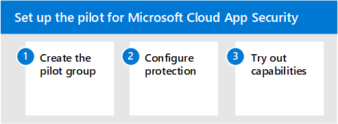

# Pilot-Microsoft Cloud App Security mit Microsoft 365 Defender

**Gilt für:**
- Microsoft 365 Defender

Dieser Artikel ist [Schritt 3 von 3](eval-defender-mcas-overview.md) beim Einrichten der Evaluierungsumgebung für Microsoft Cloud App Security. Weitere Informationen zu diesem Prozess finden Sie im [Übersichtsartikel.](eval-defender-mcas-overview.md)

Führen Sie die folgenden Schritte aus, um das Pilotprojekt für Microsoft Cloud App Security einzurichten und zu konfigurieren.

- Schritt 1. [Erstellen der Pilotgruppe – Einschränken der Pilotbereitstellung auf bestimmte Benutzergruppen](#step-1-create-the-pilot-group--scope-your-pilot-deployment-to-certain-user-groups)
- [Schritt 2. Konfigurieren des Schutzes – App-Steuerung für bedingten Zugriff](#step-2-configure-protection--conditional-access-app-control)
- [Schritt 3. Testen von Funktionen – Exemplarische Lernprogramme zum Schutz Ihrer Umgebung](#step-3-try-out-capabilities--walk-through-tutorials-for-protecting-your-environment) 

## Schritt 1. Erstellen der Pilotgruppe – Einschränken der Pilotbereitstellung auf bestimmte Benutzergruppen

mit Microsoft Cloud App Security können Sie die Bereitstellung einschränken. Mit der Bereichsdefinition können Sie bestimmte Benutzergruppen auswählen, die für Apps überwacht oder von der Überwachung ausgeschlossen werden sollen. Sie können Benutzergruppen einschließen oder ausschließen. Informationen zum Umfang der Pilotbereitstellung finden Sie unter ["Bereichsbereitstellung".](/cloud-app-security/scoped-deployment)

## Schritt 2. Konfigurieren des Schutzes – App-Steuerung für bedingten Zugriff

Einer der leistungsstärksten Schutzmaßnahmen, die Sie konfigurieren können, ist die App-Steuerung für bedingten Zugriff. Dies erfordert die Integration in Azure Active Directory (Azure AD). Damit können Sie Richtlinien für bedingten Zugriff, einschließlich verwandter Richtlinien (z. B. das Anfordern von fehlerfreien Geräten), auf Cloud-Apps anwenden, die Sie sanktioniert haben. 

Der erste Schritt bei der Verwendung von Microsoft Cloud App Security zum Verwalten von SaaS-Apps besteht darin, diese zu ermitteln und dann Ihrem Azure AD-Mandanten hinzuzufügen. Wenn Sie Hilfe bei der Ermittlung benötigen, lesen [Sie "Entdecken und Verwalten von SaaS-Apps in Ihrem Netzwerk".](/cloud-app-security/tutorial-shadow-it) Nachdem Sie Apps entdeckt haben, [fügen Sie diese Ihrem Azure AD-Mandanten hinzu.](/azure/active-directory/manage-apps/add-application-portal)

Sie können beginnen, diese zu verwalten, indem Sie folgendermaßen vorgehen:

- Erstellen Sie zunächst in Azure AD eine neue Richtlinie für bedingten Zugriff, und konfigurieren Sie sie für "App-Steuerung für bedingten Zugriff verwenden". Dadurch wird die Anforderung an Cloud App Security weitergeleitet. Sie können eine Richtlinie erstellen und dieser Richtlinie alle SaaS-Apps hinzufügen.
- Erstellen Sie als Nächstes in Cloud App Security Sitzungsrichtlinien. Erstellen Sie eine Richtlinie für jedes Steuerelement, das Sie anwenden möchten.

Weitere Informationen, einschließlich unterstützter Apps und Clients, finden Sie unter ["Schützen von Apps mit Microsoft Cloud App Security App-Steuerung für bedingten Zugriff".](/cloud-app-security/proxy-intro-aad) 

Beispiele für Richtlinien finden Sie unter ["Empfohlene Microsoft Cloud App Security Richtlinien für SaaS-Apps".](../office-365-security/mcas-saas-access-policies.md) Diese Richtlinien basieren auf einer Reihe [allgemeiner Identitäts- und Gerätezugriffsrichtlinien,](../office-365-security/microsoft-365-policies-configurations.md) die als Ausgangspunkt für alle Kunden empfohlen werden. 

## Schritt 3: Testen von Funktionen – Exemplarische Lernprogramme zum Schutz Ihrer Umgebung 

Die Microsoft Cloud App Security Dokumentation enthält eine Reihe von Lernprogrammen, die Ihnen helfen, Risiken zu erkennen und Ihre Umgebung zu schützen. 

Testen Sie Cloud App Security Lernprogramme:

- [Erkennen verdächtiger Benutzeraktivitäten](/cloud-app-security/tutorial-suspicious-activity)
- [Untersuchen riskanter Benutzer](/cloud-app-security/tutorial-ueba)
- [Untersuchen riskanter OAuth-Apps](/cloud-app-security/investigate-risky-oauth)
- [Ermitteln und Schützen vertraulicher Informationen](/cloud-app-security/tutorial-dlp)
- [Schützen von Apps in Ihrer Organisation in Echtzeit](/cloud-app-security/tutorial-proxy)
- [Blockieren von Downloads vertraulicher Informationen](/cloud-app-security/use-case-proxy-block-session-aad)
- [Schützen Ihrer Dateien mit Administratorquarantäne](/cloud-app-security/use-case-admin-quarantine)
- [Erfordert eine schrittweise Authentifizierung bei riskanten Aktionen](/cloud-app-security/tutorial-step-up-authentication)

## Nächste Schritte

[Untersuchen und Reagieren mithilfe von Microsoft 365 Defender in einer Pilotumgebung](eval-defender-investigate-respond.md)

Kehren Sie zur Übersicht für ["Auswerten Microsoft Cloud App Security"](eval-defender-mcas-overview.md) zurück.

Kehren Sie zur Übersicht für [Evaluierungs- und Pilot-Microsoft 365 Defender](eval-overview.md)