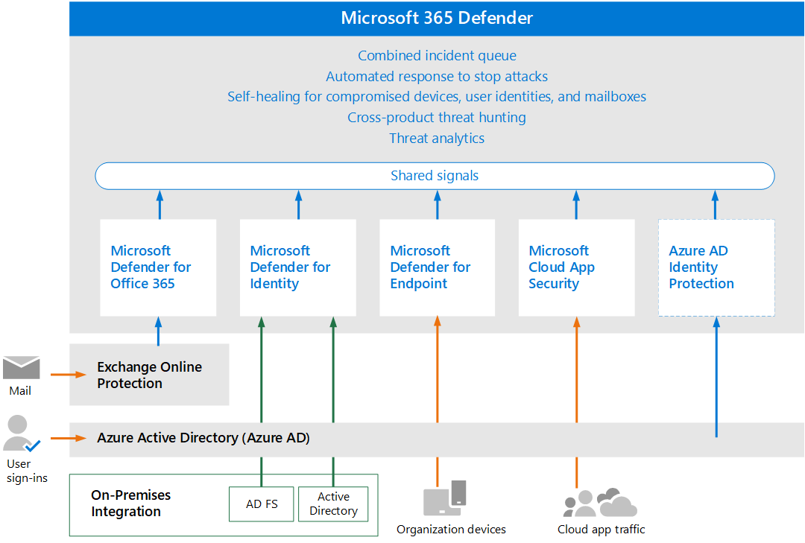

# Auswerten und Testen Microsoft 365 DefenderEvaluate and pilot Microsoft 365 Defender

**Gilt für:****Applies to:**

- Microsoft 365 DefenderMicrosoft 365 Defender

Microsoft 365 Defender ist eine erweiterte Erkennungs- und Antwortlösung (Extended Detection and Response, XDR), die automatisch Signal-, Bedrohungs- und Warnungsdaten aus Ihrer Microsoft 365 Umgebung erfasst, korreliert und analysiert, einschließlich Endpunkt, E-Mail, Anwendungen und Identitäten.Microsoft 365 Defender is an extended detection and response (XDR) solution that automatically collects, correlates and analyzes signal, threat and alert data from across your Microsoft 365 environment, including endpoint, email, applications and identities. Sie nutzt umfassende KI und Automatisierung, um Angriffe automatisch zu stoppen und betroffene Objekte in einen sicheren Zustand zu versetzen.It leverages extensive AI and automation to automatically stop attacks and remediate affected assets to a safe state. Die folgenden Artikel führen Sie durch den Prozess des Einrichtens einer Testumgebung, damit Sie die Features und Funktionen von Microsoft 365 Defender bewerten können.The following articles step you through the process of setting up a trial environment so you can evaluate the features and capabilities of Microsoft 365 Defender. 

Während Sie durch diese Artikel gehen, werden die Schritte veranschaulichen, wie Sie jede Komponente aktivieren, Einstellungen konfigurieren und mit der Überwachung mit einer Pilotgruppe beginnen.As you walk through these articles, the steps will illustrate how to enable each component, configure settings, and begin monitoring with a pilot group. Wenn Sie fertig sind, können Sie fertig sein, indem Sie Ihre Evaluierungsumgebung direkt in die Produktion umwandeln.When you’re ready, you can finish by promotion your evaluation environment directly into production. 

Microsoft empfiehlt, die Auswertung in einem vorhandenen Produktionsabonnement von Office 365 zu erstellen.Microsoft recommends you create your evaluation in an existing production subscription of Office 365. Auf diese Weise erhalten Sie sofort Einblicke in die Praxis und können Einstellungen so optimieren, dass sie auf aktuelle Bedrohungen in Ihrer Umgebung angewendet werden.This way you will gain real-world insights immediately and can tune settings to work against current threats in your environment. Nachdem Sie Erfahrung gesammelt haben und mit der Plattform vertraut sind, bewerben Sie einfach jede Komponente nacheinander für die Produktion.After you’ve gained experience and are comfortable with the platform, simply promote each component, one at a time, to production. 

## Die Anatomie eines AngriffsThe anatomy of an attack

Microsoft 365 Defender ist eine cloudbasierte, einheitliche Verteidigungssuite vor und nach der Verletzung des Unternehmens.Microsoft 365 Defender is a Cloud-based, unified, pre- and post-breach enterprise defense suite. Sie koordiniert *die Verhinderung,* *Erkennung,* *Untersuchung* und *Reaktion* über Endpunkte, Identitäten, Apps, E-Mails, Anwendungen für die Zusammenarbeit und alle ihre Daten hinweg.It coordinates *prevention*, *detection*, *investigation*, and *response* across endpoints, identities, apps, email, collaborative applications, and all of their data.

In dieser Abbildung wird ein Angriff ausgeführt.In this illustration an attack is underway. Phishing-E-Mails werden im Posteingang eines Mitarbeiters in Ihrer Organisation eintreffen, der die E-Mail-Anlage unwissentlich öffnet.Phishing email arrives at the Inbox of an employee in your organization, who unknowingly opens the email attachment. Dadurch wird Schadsoftware installiert, die zu einer Kette von Ereignissen führt, die mit dem Diebstahl vertraulicher Daten enden könnten.This installs malware, which leads to a chain of events that could end with the theft of sensitive data. In diesem Fall ist Defender für Office 365 jedoch in Betrieb.But in this case, Defender for Office 365 is in operation.

In der Abbildung sehen Sie Folgendes:In the illustration:

- **Exchange Online Protection**, Teil von Microsoft Defender für Office 365, kann die Phishing-E-Mail erkennen und E-Mail-Flussregeln verwenden, um sicher zu stellen, dass sie nie im Posteingang eintrifft.**Exchange Online Protection**, part of Microsoft Defender for Office 365, can detect the phishing email and use mail flow rules to make certain it never arrives in the Inbox.
- **Defender für Office 365** sichere Anlagen testet die Anlage und ermittelt, dass sie schädlich ist, sodass die eingehende E-Mail vom Benutzer nicht bearbeitet werden kann oder Richtlinien verhindern, dass die E-Mails überhaupt eintreffen.**Defender for Office 365** safe attachments tests the attachment and determines it is harmful, so the mail that arrives either isn't actionable by the user, or policies prevent the mail from arriving at all.
- **Defender für Endpunkt** verwaltet Geräte, die eine Verbindung mit dem Unternehmensnetzwerk herstellen und Geräte- und Netzwerkschwachstellen erkennen, die andernfalls möglicherweise ausgenutzt werden.**Defender for Endpoint** manages devices that connect to the corporate network and detect device and network vulnerabilities that might otherwise be exploited.
- **Defender for Identity** nimmt plötzliche Kontoänderungen wie die Rechteeskalation oder die laterale Bewegung mit hohem Risiko zur Kenntnis.**Defender for Identity** takes note of sudden account changes like privilege escalation, or high-risk lateral movement. Es meldet auch leicht ausgenutzte Identitätsprobleme wie die uneingeschränkte Kerberos-Delegierung zur Korrektur durch das Sicherheitsteam.It also reports on easily exploited identity issues like unconstrained Kerberos delegation, for correction by the security team.
- **Microsoft Cloud App Security** bemerkt anomales Verhalten wie unmögliche Reise, Zugriff auf Anmeldeinformationen und ungewöhnliche Download-, Dateifreigabe- oder E-Mail-Weiterleitungsaktivitäten und meldet diese an das Sicherheitsteam.**Microsoft Cloud App Security** notices anomalous behavior like impossible-travel, credential access, and unusual download, file share, or mail forwarding activity and reports these to the security team.

### Microsoft 365 Defender KomponentenMicrosoft 365 Defender components

Microsoft 365 Defender besteht aus diesen Sicherheitstechnologien, die zusammen ausgeführt werden.Microsoft 365 Defender is made up of these security technologies, operating in tandem. Sie benötigen nicht alle diese Komponenten, um von den Funktionen von XDR und Microsoft 365 Defender zu profitieren.You don’t need all of these components to benefit from the capabilities of XDR and Microsoft 365 Defender. Sie werden auch durch die Verwendung von ein oder zwei Vorteilen und Effizienzsteigerungen profitieren.You will realize gains and efficiencies through using one or two as well. 

|KomponenteComponent  |BeschreibungDescription  |ReferenzmaterialReference material  |
|---------|---------|---------|
|Microsoft Defender for IdentityMicrosoft Defender for Identity     |      Microsoft Defender for Identity verwendet Active Directory-Signale, um erweiterte Bedrohungen, kompromittierte Identitäten und böswillige Insideraktionen gegen Ihre Organisation zu identifizieren, zu erkennen und zu untersuchen.Microsoft Defender for Identity uses Active Directory signals to identify, detect, and investigate advanced threats, compromised identities, and malicious insider actions directed at your organization.     |     [Was ist Microsoft Defender for Identity?What is Microsoft Defender for Identity?](/defender-for-identity/what-is)   |
|Exchange Online ProtectionExchange Online Protection     |      Exchange Online Protection ist der systemeigene cloudbasierte SMTP-Relay- und Filterdienst, der Ihre Organisation vor Spam und Schadsoftware schützt.Exchange Online Protection is the native cloud-based SMTP relay and filtering service that helps protect your organization against spam and malware.      |   [Übersicht über Exchange Online Protection (EOP) – Office 365Exchange Online Protection (EOP) overview - Office 365](../office-365-security/overview.md)     |
|Microsoft Defender für Office 365Microsoft Defender for Office 365     |     Microsoft Defender für Office 365 schützt Ihre Organisation vor bösartigen Bedrohungen durch E-Mail-Nachrichten, Links (URLs) und Tools für die Zusammenarbeit.Microsoft Defender for Office 365 safeguards your organization against malicious threats posed by email messages, links (URLs) and collaboration tools.      |    [Microsoft Defender für Office 365 – Office 365Microsoft Defender for Office 365 - Office 365](../office-365-security/overview.md)    |
|Microsoft Defender für EndpunktMicrosoft Defender for Endpoint     |     Microsoft Defender für Endpunkt ist eine einheitliche Plattform für Geräteschutz, Erkennung nach Einer Sicherheitsverletzung, automatisierte Untersuchung und empfohlene Reaktion.Microsoft Defender for Endpoint is a unified platform for device protection, post-breach detection, automated investigation, and recommended response.      |   [Microsoft Defender für Endpunkt – Windows SicherheitMicrosoft Defender for Endpoint - Windows security](../defender-endpoint/microsoft-defender-endpoint.md)    |
|Microsoft Cloud App SecurityMicrosoft Cloud App Security     |      Microsoft Cloud App Security ist eine umfassende SaaS-übergreifende Lösung, die umfassende Sichtbarkeit, starke Datenkontrollen und verbesserten Bedrohungsschutz für Ihre Cloud-Apps bietet.Microsoft Cloud App security is a comprehensive cross-SaaS solution bringing deep visibility, strong data controls, and enhanced threat protection to your cloud apps.       |    [Was ist Microsoft Cloud App Security?What is Cloud App Security?](/cloud-app-security/what-is-cloud-app-security)    |
|Azure AD Identity ProtectionAzure AD Identity Protection|Azure AD Identity Protection wertet Risikodaten aus Milliarden von Anmeldeversuchen aus und verwendet diese Daten, um das Risiko jeder Anmeldung in Ihrer Umgebung zu bewerten.Azure AD Identity Protection evaluates risk data from billions of sign-in attempts and uses this data to evaluate the risk of each sign-in to your environment. Diese Daten werden von Azure AD verwendet, um den Kontozugriff zuzulassen oder zu verhindern, je nachdem, wie Richtlinien für bedingten Zugriff konfiguriert sind.This data is used by Azure AD to allow or prevent account access, depending on how Conditional Access policies are configured. Azure AD Identity Protection wird separat von Microsoft 365 Defender lizenziert.Azure AD Identity Protection is licensed separately from Microsoft 365 Defender. Es ist in Azure Active Directory Premium P2 enthalten.It is included with Azure Active Directory Premium P2.|[Was ist Identitätsschutz?What is Identity Protection?](/azure/active-directory/identity-protection/overview-identity-protection)|
| | | |

## Microsoft 365 Defender ArchitekturMicrosoft 365 Defender architecture

Das folgende Diagramm veranschaulicht die allgemeine Architektur für wichtige Microsoft 365 Defender Komponenten und Integrationen.The diagram below illustrates high-level architecture for key Microsoft 365 Defender components and integrations. *Detaillierte* Architektur für jede Defender-Komponente und Anwendungsszenarien finden Sie in dieser Artikelreihe.*Detailed* architecture for each Defender component, and use-case scenarios, are given throughout this series of articles.

In dieser Abbildung:In this illustration:

- Microsoft 365 Defender kombiniert die Signale aller Defender-Komponenten, um die erweiterte Erkennung und Reaktion (Extended Detection and Response, XDR) domänenübergreifend bereitzustellen.Microsoft 365 Defender combines the signals from all of the Defender components to provide extended detection and response (XDR) across domains. Dazu gehören eine einheitliche Vorfallwarteschlange, automatisierte Reaktion auf das Beenden von Angriffen, Selbstkorrektur (für kompromittierte Geräte, Benutzeridentitäten und Postfächer), bedrohungsübergreifende Suche und Bedrohungsanalyse.This includes a unified incident queue, automated response to stop attacks, self-healing (for compromised devices, user identities, and mailboxes), cross-threat hunting, and threat analytics.
- Microsoft Defender schützt Ihre Organisation vor bösartigen Bedrohungen durch E-Mail-Nachrichten, Links (URLs) und Tools für die Zusammenarbeit.Microsoft Defender safeguards your organization against malicious threats posed by email messages, links (URLs), and collaboration tools. Sie teilt Signale, die sich aus diesen Aktivitäten ergeben, mit Microsoft 365 Defender.It shares signals resulting from these activities with Microsoft 365 Defender. Exchange Online Protection (EOP) ist integriert, um einen End-to-End-Schutz für eingehende E-Mails und Anlagen bereitzustellen.Exchange Online Protection (EOP) is integrated to provide end-to-end protection for incoming emails and attachments.
- Microsoft Defender for Identity sammelt Signale von Servern, auf denen Active Directory-Verbunddienste (AD FS) und lokale Active Directory Domain Services (AD DS) ausgeführt werden.Microsoft Defender for Identity gathers signals from servers running Active Directory Federated Services (AD FS) and on-premises Active Directory Domain Services (AD DS). Sie verwendet diese Signale, um Ihre Hybrididentitätsumgebung zu schützen, einschließlich des Schutzes vor Hackern, die kompromittierte Konten verwenden, um sich seitlich über Arbeitsstationen in der lokalen Umgebung zu bewegen.It uses these signals to protect your hybrid identity environment, including protecting against hackers that use compromised accounts to move laterally across workstations in the on-premises environment.
- Microsoft Defender für Endpunkt sammelt Signale von Geräten, die von Ihrer Organisation verwendet werden, und schützt sie.Microsoft Defender for Endpoint gathers signals from and protects devices used by your organization.
- Microsoft Cloud App Security sammelt Signale aus der Verwendung von Cloud-Apps in Ihrer Organisation und schützt den Datenfluss zwischen Ihrer Umgebung und diesen Apps, einschließlich sanktionierten und nicht genehmigten Cloud-Apps.Microsoft Cloud App Security gathers signals from your organization's use of cloud apps and protects data flowing between your environment and these apps, including both sanctioned and unsanctioned cloud apps.
- Azure AD Identity Protection wertet Risikodaten aus Milliarden von Anmeldeversuchen aus und verwendet diese Daten, um das Risiko jeder Anmeldung in Ihrer Umgebung zu bewerten.Azure AD Identity Protection evaluates risk data from billions of sign-in attempts and uses this data to evaluate the risk of each sign-in to your environment. Diese Daten werden von Azure AD verwendet, um den Kontozugriff zuzulassen oder zu verhindern, je nachdem, wie Richtlinien für bedingten Zugriff konfiguriert sind.This data is used by Azure AD to allow or prevent account access, depending on how Conditional Access policies are configured. Azure AD Identity Protection wird separat von Microsoft 365 Defender lizenziert.Azure AD Identity Protection is licensed separately from Microsoft 365 Defender. Es ist in Azure Active Directory Premium P2 enthalten.It is included with Azure Active Directory Premium P2.  

Zusätzliche optionale Architekturkomponenten, die nicht in dieser Abbildung enthalten sind:Additional optional architecture components not included in this illustration:

- Detaillierte Signaldaten aus allen Microsoft Defender-Komponenten können in Azure Sentinel integriert und mit anderen Protokollierungsquellen kombiniert werden, um vollständige SIEM- und SOAR-Funktionen und -Einblicke zu bieten.Detailed signal data from all Microsoft Defender components can be integrated into Azure Sentinel and combined with other logging sources to offer full SIEM and SOAR capabilities and insights.

## Der EvaluierungsprozessThe evaluation process

Microsoft empfiehlt, die Komponenten von Microsoft 365 in der folgenden Reihenfolge zu aktivieren:Microsoft recommends enabling the components of Microsoft 365 in the order illustrated:

In der folgenden Tabelle wird diese Abbildung beschrieben.The following table describes this illustration.

|      |SchrittStep  |BeschreibungDescription  |
|------|---------|---------|
|11     | [Erstellen der EvaluierungsumgebungCreate the evaluation environment](eval-create-eval-environment.md)       |Mit diesem Schritt wird sichergestellt, dass Sie über die Testlizenz für Microsoft 365 Defender verfügen.This step ensures you have the trial license for Microsoft 365 Defender.         |
|22     | [Aktivieren von Defender for IdentityEnable Defender for Identity](eval-defender-identity-overview.md)        | Überprüfen Sie die Architekturanforderungen, aktivieren Sie die Auswertung, und durchlaufen Sie Lernprogramme zum Identifizieren und Beheben verschiedener Angriffstypen.Review the architecture requirements, enable the evaluation, and walk through tutorials for identifying and remediating different attack types.   |
|33     | [Aktivieren von Defender für Office 365Enable Defender for Office 365 ](eval-defender-office-365-overview.md)       | Stellen Sie sicher, dass Sie die Architekturanforderungen erfüllen, aktivieren Sie die Auswertung, und erstellen Sie dann die Pilotumgebung.Ensure you meet the architecture requirements, enable the evaluation, and then create the pilot environment. Diese Komponente enthält Exchange Online Protection, sodass Sie *beide* wertet.This component includes Exchange Online Protection and so you will actually evaluate *both* here.      |
|4 4     | [Aktivieren von Defender für Endpunkt Enable Defender for Endpoint ](eval-defender-endpoint-overview.md)       | Stellen Sie sicher, dass Sie die Architekturanforderungen erfüllen, aktivieren Sie die Auswertung, und erstellen Sie dann die Pilotumgebung.Ensure you meet the architecture requirements, enable the evaluation, and then create the pilot environment.         |
|5 5     | [Aktivieren Microsoft Cloud App SecurityEnable Microsoft Cloud App Security](eval-defender-mcas-overview.md)        |  Stellen Sie sicher, dass Sie die Architekturanforderungen erfüllen, aktivieren Sie die Auswertung, und erstellen Sie dann die Pilotumgebung.Ensure you meet the architecture requirements, enable the evaluation, and then create the pilot environment.        |
|6 6     | [Untersuchen und Reagieren auf BedrohungenInvestigate and respond to threats](eval-defender-investigate-respond.md)        |   Simulieren Sie einen Angriff und beginnen Sie mit der Verwendung von Vorfallreaktionsfunktionen.Simulate an attack and begin using incident response capabilities.      |
|7 7     | [Bewerben der Testversion zur ProduktionPromote the trial to production](eval-defender-promote-to-production.md)        | Höherstufen sie die Microsoft 365 Komponenten nacheinander in die Produktion.Promote the Microsoft 365 components to production one-by-one.        |
| | | |

Dies ist eine allgemein empfohlene Reihenfolge, die entwickelt wurde, um den Nutzen der Funktionen schnell basierend darauf zu gewinnen, wie viel Aufwand in der Regel erforderlich ist, um die Funktionen bereitzustellen und zu konfigurieren.This is a commonly recommended order designed to gain the value of the capabilities quickly based on how much effort is typically required to deploy and configure the capabilities. Beispielsweise kann Defender für Office 365 viel schneller konfiguriert werden, als für die Registrierung von Geräten für Defender für Endpunkt erforderlich ist.For example, Defender for Office 365 can be configured much quicker than is required to enroll devices for Defender for Endpoint. Natürlich können Sie die Komponenten priorisieren, um Ihre Geschäftlichen Anforderungen zu erfüllen und diese in einer anderen Reihenfolge zu aktivieren.Of course you can prioritize the components to meet your business needs and enable these in a different order.

## Nächste SchritteNext steps

[Erstellen der Microsoft 365 Defender-EvaluierungsumgebungCreate the Microsoft 365 Defender Evaluation Environment](eval-create-eval-environment.md)
