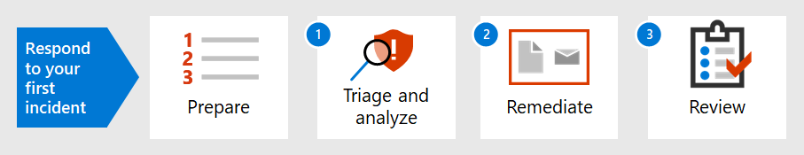

# Einführung in die Reaktion auf Ihren ersten VorfallIntroduction to responding to your first incident

[!INCLUDE [Microsoft 365 Defender rebranding](../includes/microsoft-defender.md)]

**Gilt für:****Applies to:**
- Microsoft 365 DefenderMicrosoft 365 Defender

Die Strategie für die Reaktion auf Vorfälle in einer Organisation bestimmt, dass sie zunehmend störende Sicherheitsvorfälle und Cyberkriminalität umgehen kann.An organization's incident response strategy determines its ability to deal with increasingly disruptive security incidents and cybercrime. Es ist zwar wichtig, vorbeugende Maßnahmen zu ergreifen, aber die Fähigkeit, schnell zu handeln, um erkannte Vorfälle zu eindähmen, auszulöschen und von erkannten Vorfällen wiederhergestellt zu werden, kann Schäden und Geschäftsverluste minimieren.While taking preventative measures is important, the ability to act quickly to contain, eradicate, and recover from detected incidents can minimize damage and business losses.

Diese exemplarische Vorgehensweise zur Reaktion auf Vorfälle zeigt, wie Sie als Teil eines Sicherheitseinsatzteams die meisten der wichtigsten Schritte zur Reaktion auf Vorfälle in Microsoft 365 ausführen können.This incident response walkthrough shows how you, as part of a security operations team, can perform most of the key incident response steps within Microsoft 365 Defender. Die Schritte sind hier aufgeführt:Here are the steps:

- Vorbereiten Ihrer SicherheitslagePreparation of your security posture
- Für jeden Vorfall:For each incident:
  - Schritt 1: Triage und AnalyseStep 1: Triage and analysis
  - Schritt 2: Korrektur (Eindämmung, Auslöschung und Wiederherstellung)Step 2: Remediation (containment, eradication, and recovery)
  - Schritt 3: Überprüfung nach einem VorfallStep 3: Post-incident review

Ein Sicherheitsvorfall wird vom National Institute of Standards and Technology (NIST) als "ein Ereignis definiert, das tatsächlich oder potenziell die Vertraulichkeit, Integrität oder Verfügbarkeit eines Informationssystems gefährdet; oder die Informationen, die das System verarbeitet, speichert oder überträgt; oder die eine Verletzung oder unmittelbar bevorstehende Gefahr einer Verletzung von Sicherheitsrichtlinien, Sicherheitsverfahren oder akzeptablen Verwendungsrichtlinien darstellt."A security incident is defined by National Institute of Standards and Technology (NIST) as "an occurrence that actually or potentially jeopardizes the confidentiality, integrity, or availability of an information system; or the information the system processes, stores, or transmits; or that constitutes a violation or imminent threat of violation of security policies, security procedures, or acceptable use policies."

Vorfälle in Microsoft 365 Defender sind die logischen Ausgangspunkte für die Analyse und Reaktion auf Vorfälle.Incidents in Microsoft 365 Defender are the logical starting points for analysis and incident response. Die Analyse und Behebung von Vorfällen macht in der Regel die meisten Aufgaben eines Sicherheitsteams aus.Analyzing and remediating incidents typically makes up most of a security operations team's tasks.

## Nächster SchrittNext step

Stellen Sie sicher, dass Ihre Organisation Microsoft 365 Mandanten [für die Behandlung von Vorfällen vorbereitet ist.](first-incident-prepare.md)Make sure your organization and Microsoft 365 tenant is [prepared for incident handling](first-incident-prepare.md).

## Siehe auchSee also

- [Übersicht über VorfälleIncidents overview](incidents-overview.md)
- [Analysieren von VorfällenAnalyze incidents](investigate-incidents.md)
- [Verwalten von VorfällenManage incidents](manage-incidents.md)
