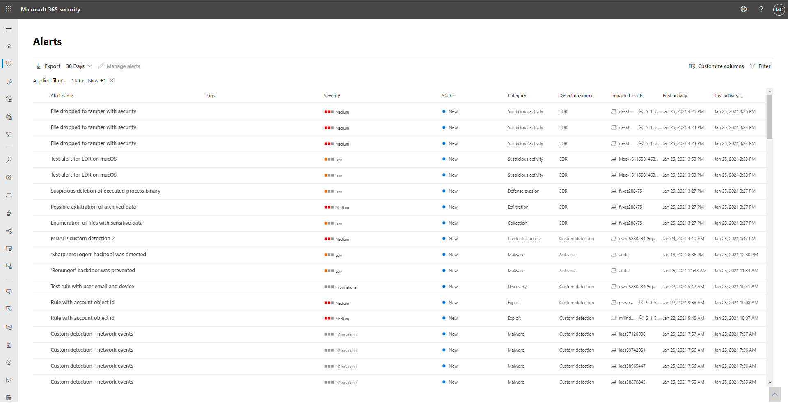

# Untersuchen von Warnungen in Microsoft 365 DefenderInvestigate alerts in Microsoft 365 Defender

[!INCLUDE [Microsoft 365 Defender rebranding](../includes/microsoft-defender.md)]

**Gilt für:****Applies to:**
- Microsoft 365 DefenderMicrosoft 365 Defender

[!INCLUDE [Prerelease](../includes/prerelease.md)]

Warnungen sind die Grundlage aller Vorfälle und geben das Auftreten von böswilligen oder verdächtigen Ereignissen in Ihrer Umgebung an.Alerts are the basis of all incidents and indicate the occurrence of malicious or suspicious events in your environment. Warnungen sind in der Regel Teil eines umfassenderen Angriffs und liefern Hinweise zu einem Vorfall.Alerts are typically part of a broader attack and provide pieces of clues about an incident.

In Microsoft 365 Defender werden verwandte Warnungen zu Vorfällen zusammengefasst.In Microsoft 365 Defender, related alerts are aggregated together to form incidents. Vorfälle bieten immer den umfassenderen Kontext eines Angriffs. Es kann jedoch hilfreich sein, Warnungen zu untersuchen, wenn eine tiefergehende Analyse erforderlich ist.Incidents will always provide the broader context of an attack, however, investigating alerts can be valuable when deeper analysis is required. 

## Verwenden von Warnungsseiten in UntersuchungenUsing alert pages in investigations

Auf der Registerkarte Warnungen auf jeder Vorfallseite gelangen Sie durch Auswählen einer Warnung zu den einzelnen Warnungsseiten.From the Alerts tab of any incident page, selecting an alert brings you to the individual alert pages. Eine Warnungsseite besteht aus drei Abschnitten: betroffenen Ressourcen, Warnungsabschnitt und Detailbereich.An alert page is composed of three sections: affected assets, alert story, and the details pane.

Auf einer Warnungsseite können Sie das Symbol mit drei Punkten (**...**) neben jeder Entität auswählen, damit Sie verfügbare Aktionen wie das Öffnen der bestimmten Objektseite oder bestimmte Korrekturschritte sehen können.Throughout an alert page, you can select the three-dot icon (**...**) beside any entity so you can see available actions like opening the specific asset page or doing specific remediation steps.

### Analysieren betroffener ObjekteAnalyze affected assets
Im Abschnitt betroffene Objekte werden Postfächer, Geräte und Benutzer aufgeführt, die von dieser Warnung betroffen sind.The affected assets section lists mailboxes, devices, and users affected by this alert. Wenn Sie eine der Objektkarten auswählen, wird der Detailseitenbereich mit Informationen auffüllt, einschließlich anderer Warnungen, die im Zusammenhang mit den Ressourcen aufgetreten sind.Selecting any of the asset cards populates the details side pane with information, including other alerts that occurred involving the assets, if any.

### Verfolgen der Rolle einer Warnung im WarnungsstoryTrace an alert's role in the alert story
Der Warnungsstory zeigt alle Ressourcen oder Entitäten im Zusammenhang mit der Warnung in einer Prozessstrukturansicht an.The alert story displays all assets or entities related to the alert in a process tree view. Die Warnung im Titel ist die Warnung, die beim ersten Landen auf der Seite der ausgewählten Warnung im Fokus steht.The alert in the title is the one in focus when you first land on your selected alert's page. Objekte im Warnungsstory können erweitert und angeklickt werden.Assets in the alert story are expandable and clickable. Sie bieten zusätzliche Informationen und beschleunigen die Reaktion, indem Sie Aktionen direkt im Kontext der Warnungsseite ausführen können.They provide additional information and expedite response by allowing you to take actions right in the context of the alert page. 

> [!NOTE]
> Der Abschnitt "Warnungsabschnitt" kann mehrere Warnungen enthalten, und zusätzliche Warnungen im Zusammenhang mit derselben Ausführungsstruktur werden vor oder nach der ausgewählten Warnung angezeigt.The alert story section may contain more than one alert, with additional alerts related to the same execution tree appearing before or after the alert you've selected.

### Weitere Benachrichtigungsinformationen im Detailbereich anzeigenView more alert information in the details pane

Im Detailbereich werden zunächst die Details der ausgewählten Warnung mit Details und Aktionen angezeigt.The details pane shows the details of the selected alert at first, with details and actions related to it. Wenn Sie eine der betroffenen Objekte oder Entitäten im Warnungsstory auswählen, wird der Detailbereich geändert, um kontextbezogene Informationen und Aktionen für das ausgewählte Objekt zur Verfügung zu stellen.If you select any of the affected assets or entities in the alert story, the details pane changes to provide contextual information and actions for the selected object.

Nachdem Sie eine entität von Interesse ausgewählt haben, ändert sich der Detailbereich so, dass Informationen zum ausgewählten Entitätstyp, historische Informationen, sobald diese verfügbar ist, und Optionen zum Ergreifen von Aktionen für diese Entität direkt auf der Warnungsseite angezeigt werden.Once you've selected an entity of interest, the details pane changes to display information about the selected entity type, historic information when it's available, and options to take action on this entity directly from the alert page.

### Verwalten von WarnungenManage alerts

Nachdem Sie die Untersuchung der Warnungen durchgeführt haben, können Sie zurück zu der Benachrichtigung, mit der Sie begonnen haben, den Status der Warnung als Aufgelöst markieren und als False- oder True-Warnung klassifizieren.Once you're done investigating the alerts, you can go back to the alert you started with, mark the alert's status as Resolved and classify it as either a False alert or True alert. Das Klassifizieren von Warnungen trägt dazu bei, Ihr Produkt so zu optimieren, dass mehr echte Warnungen und weniger falsche Warnungen angezeigt werden.Classifying alerts helps tune your product to provide more true alerts and less false alerts.

> [!NOTE]
> Eine Möglichkeit zum Verwalten von Warnungen mithilfe von Tags.One way of managing alerts it through the use of tags. Die Taggingfunktion für Microsoft Defender für Office 365 wird inkrementell ausgeführt und befindet sich derzeit in der Vorschau.The tagging capability for Microsoft Defender for Office 365 in incrementally being rolled out and is currently in preview.  
> Derzeit werden geänderte Tagnamen nur auf Warnungen angewendet, die nach *dem Update* erstellt wurden.Currently, modified tag names are only applied to alerts created *after* the update. Warnungen, die vor der Änderung generiert wurden, spiegeln nicht den aktualisierten Tagnamen wider.Alerts that were generated prior to the modification will not reflect the updated tag name. 

## Verwalten der einheitlichen WarnungswarteschlangeManage the unified alert queue

Durch Auswählen von Warnungen & Warnungen im Navigationsbereich des Microsoft 365 Security Center werden Sie zur einheitlichen Warnungswarteschlange angezeigt.Selecting Alerts under Incidents & Alerts in the Microsoft 365 security center navigation pane brings you to the unified alert queue. Warnungen von verschiedenen Microsoft-Sicherheitslösungen wie Microsoft Defender for Endpoint, Microsoft Defender für Office 365 und Microsoft 365 Defender werden in diesem Abschnitt angezeigt.Alerts from different Microsoft security solutions like Microsoft Defender for Endpoint, Microsoft Defender for Office 365, and Microsoft 365 Defender appear in this section. 

Die Warnungswarteschlange zeigt eine Liste der Warnungen an, die in Ihrem Netzwerk gekennzeichnet wurden.The Alerts queue shows a list of alerts that were flagged in your network. Standardmäßig werden in der Warteschlange Warnungen angezeigt, die in den letzten 30 Tagen angezeigt wurden.By default, the queue displays alerts seen in the last 30 days. Die neuesten Warnungen werden am Anfang der Liste angezeigt, damit Sie zuerst die neuesten Warnungen sehen können.The most recent alerts are shown at the top of the list helping you see the most recent alerts first.

> [!NOTE]
> Zum Zeitpunkt des Startes ist die Warteschlange für einheitliche Warnungen nur für 7 Tage mit Microsoft Defender für Office 365-Warnungen verfügbar.At the time of launch, the unified alerts queue will only have 7 days’ worth of Microsoft Defender for Office 365 alerts available. Die Warteschlange wird im Laufe der Zeit weiter aufbaut.The queue will continue to build over time. Wenn Sie Warnungen vor dem Start der einheitlichen Benachrichtigungswarteschlange triagen müssen, verwenden Sie die Benachrichtigungswarteschlange im [Security and Compliance Center](https://protection.office.com/viewalerts).If you need to triage alerts prior to the launch of the unified alerts queue, use the alerts queue in the [Security and Compliance Center](https://protection.office.com/viewalerts).

Im oberen Navigationsbereich können Sie:On the top navigation, you can:

- Anwenden von FilternApply filters
- Anpassen von Spalten zum Hinzufügen oder Entfernen von SpaltenCustomize columns to add or remove columns
- Exportieren von DatenExport data

Sie können Warnungen auch nach unterschiedlichen Kriterien filtern:You can also filter alerts according to different criteria:

- SeveritySeverity
- StatusStatus
- KategorieCategory
- ErkennungsquelleDetection source
- RichtliniePolicy
- Auswirkungen auf RessourcenImpacted assets
- Erste AktivitätFirst activity
- Letzte AktivitätLast activity

Lesen Sie Untersuchen von Vorfällen [in Microsoft 365 Defender,](investigate-incidents.md) um eine Untersuchung zu einem Vorfall zu starten.To start an investigation on an incident, read [Investigate incidents in Microsoft 365 Defender](investigate-incidents.md)
## Siehe auchSee also

- [Übersicht über VorfälleIncidents overview](incidents-overview.md)
- [Untersuchen von VorfällenInvestigate incidents](investigate-incidents.md)
- [Verwalten von VorfällenManage incidents](manage-incidents.md)
