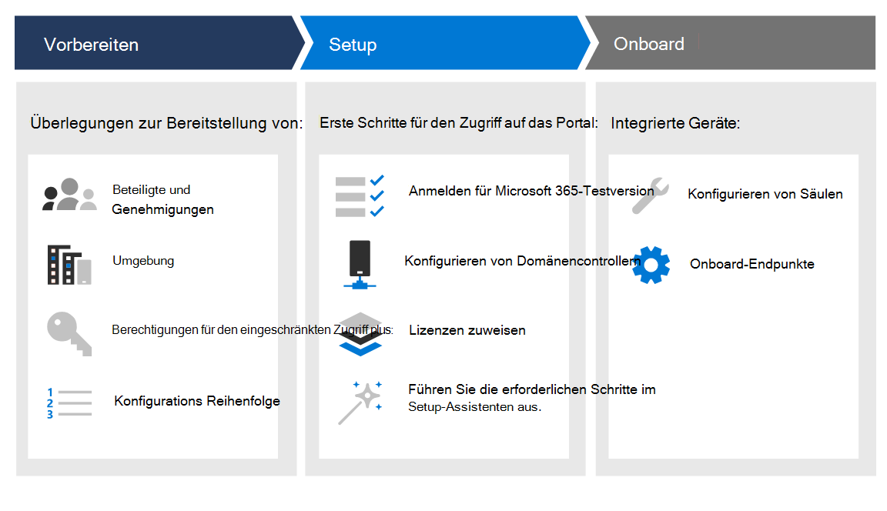

# Erstellen einer Microsoft 365 Defender-Testumgebung oder Pilotumgebung 

[!INCLUDE [Microsoft 365 Defender rebranding](../includes/microsoft-defender.md)]

**Gilt für:**
- Microsoft 365 Defender

Dieses Handbuch hilft Ihnen bei der Einrichtung einer Laborumgebung mit Benutzern und Gruppen und führt Sie dann durch die Konfiguration der Funktionen in Microsoft 365 Defender, damit Sie einen Bedrohungsangriff imitieren und ein aussagekräftiges Testergebnis erhalten können. 

Das Erstellen dieser Testumgebung oder Pilotumgebung dient dazu, die umfassenden und integrierten Microsoft 365 Defender-Funktionen zu veranschaulichen. Erfahren Sie, wie diese intelligente Sicherheitslösung erweiterte Bedrohungen in Ihrer Organisation erkennt, verhindert, automatisch untersucht und reagiert. 

Sie werden durch die Schritte geführt, um Ihre Microsoft 365 Defender-Evaluierung basierend auf den empfohlenen Bereitstellungspfaden zu starten. Das Ziel besteht in der Einrichtung der Sicherheitslösung entweder in einer Laborumgebung mit einem Testkonto oder in einer Pilotumgebung in der Produktion mit volllizenz. Durch die Vorbereitung Ihrer Testumgebung oder Pilotumgebung können Sie Entscheidungsträgern in Ihrer Organisation Verwendungsfälle für Sicherheitsoperation präsentieren. Wenn Sie mit der Ausführung Ihrer Angriffssimulationen fertig sind und mit den Ergebnissen zufrieden sind, können Sie sie in Ihrer Organisation vollständig bereitstellen und mithilfe von Microsoft Technical Sales Professionals oder Experten in Ihrer Organisation operationalisieren. 

Dieses Handbuch hilft Ihnen dabei:
- Einrichten des Laborservers und der Computer
- Konfigurieren von Active Directory mit Benutzern und Gruppen
- Einrichten und Konfigurieren von Microsoft Defender for Identity, Microsoft Defender für Office 365, Microsoft Defender for Endpoint und Microsoft Cloud App Security
- Einrichten lokaler Richtlinien für Server und Computer
- Imitieren eines Bedrohungsangriffs zum Generieren eines Testvorfalls oder einer Warnung in Microsoft 365 Defender

>[!IMPORTANT]
>Um optimale Ergebnisse zu erzielen, befolgen Sie die Anweisungen zum Einrichten des Labors so genau wie möglich.

## Bereitstellungsphasen

Es gibt drei Phasen beim Erstellen einer Microsoft 365 Defender-Testumgebung.

|Phase | Beschreibung | 
|:-------|:-----|
|[Phase 1: Vorbereiten](prepare-m365d-eval.md)| Erfahren Sie, was Sie bei der Bereitstellung von Microsoft 365 Defender in einer Testumgebung oder Pilotumgebung berücksichtigen müssen:   – Beteiligte und Abmelden   – Überlegungen zur Umgebung  - Access  – Azure Active Directory-Setup   - Konfigurationsreihenfolge
|[Phase 2: Setup](setup-m365deval.md)|  Gehen Sie zunächst auf Microsoft 365 Security Center zu, um Ihre Microsoft 365 Defender-Testumgebung oder Pilotumgebung zu einrichten. Sie werden geführt zu:  - Registrieren für Microsoft 365 E5-Testversion    - Konfigurieren der Domäne – Zuweisen von Microsoft 365 E5-Lizenzen – Abschließen des Setup-Assistenten im Portal|
|[Phase 3: Konfigurieren & Onboard](config-m365d-eval.md) | Konfigurieren Sie die einzelnen Microsoft 365 Defender-Säulen und onboard-Endpunkte. Sie werden geführt zu:  - Konfigurieren von Microsoft Defender für Office 365 - Konfigurieren von Microsoft Cloud App Security - Konfigurieren von Microsoft Defender for Identity - Konfigurieren von Microsoft Defender for Endpoint

Nachdem Sie dieses Handbuch abgeschlossen haben, hätten Sie die beteiligten Beteiligten und die erforderlichen Genehmigungen identifiziert, über die richtigen Zugriffsberechtigungen verfügen, sich für die Testversion angemeldet, Domänen und die einzelnen Microsoft 365 Defender-Säulen konfiguriert, und Ihre Endpunkte werden in den Dienst eingebunden.

## Wichtige Funktionen

Obwohl Microsoft 365 Defender viele Funktionen bietet, besteht der Hauptzweck dieses Bereitstellungshandbuchs in der Einführung in das Onboarding von Geräten. Zusätzlich zum Onboarding werden Sie in diesem Leitfaden mit den folgenden Funktionen gestartet.

Funktion | Beschreibung 
:---|:---
Microsoft Defender für Office 365 | Schützt Ihre gesamte Office 365-Neid vor heutigen Bedrohungen
Microsoft Defender for Identity | Identifiziert und erkennt Bedrohungen für gefährdete Identitäten und böswillige Insideraktionen.
Microsoft Cloud App Security | Bietet umfassende Sichtbarkeit, steuern Sie den Datenverkehr und erkennen Cyberangriffe über Clouddienste hinweg.
Microsoft Defender für Endpunkt | Verhindert, erkennt und stellt Reaktionsfunktionen für erweiterte Bedrohungen mit umfassender Endpunktsicherheit bereit.

## Im Bereich

Die folgenden Aufgaben sind für dieses Handbuch im Bereich:
-   Einrichten von Azure Active Directory
-   Einrichten von Microsoft 365 Defender
    -   Registrieren Sie sich für Microsoft 365 E5-Testversion, oder verwenden Sie Ihre Volllizenz, wenn Sie ein Pilotprojekt ausführen
    -   Konfigurieren der Domäne
    -   Zuweisen von Microsoft 365 E5-Lizenzen
    -   Abschließen des Setup-Assistenten im Portal
-   Konfigurieren aller Microsoft 365 Defender-Säulen basierend auf bewährten Methoden
    -   Microsoft Defender für Office 365
    -   Microsoft Defender for Identity
    -   Microsoft Cloud App Security
    -   Microsoft Defender für Endpunkt

## Nicht inbegriffen

Die folgenden Informationen sind nicht in diesem Bereitstellungshandbuch beschrieben:

-   Konfiguration von Drittanbieterlösungen, die in Microsoft 365 Defender integriert werden können
-   Penetrationstests in der Produktionsumgebung

## Nächster Schritt
[Phase 1: Vorbereiten](prepare-m365d-eval.md) 
  Vorbereiten Ihrer Microsoft 365 Defender-Testumgebung oder Pilotumgebung
