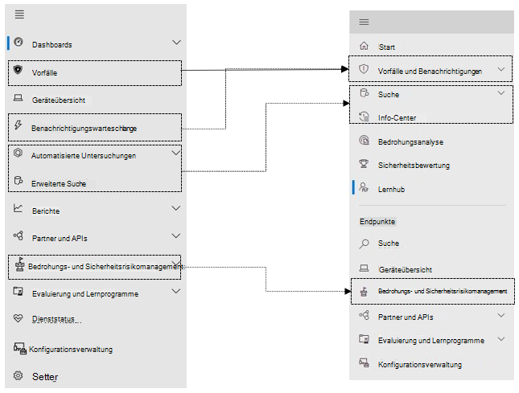
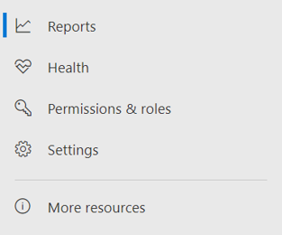

# Microsoft Defender für Endpunkt im Microsoft 365 Security CenterMicrosoft Defender for Endpoint in the Microsoft 365 security center

[!INCLUDE [Microsoft 365 Defender rebranding](../includes/microsoft-defender.md)]

**Gilt für:****Applies to:**

- [Microsoft 365 DefenderMicrosoft 365 Defender](microsoft-365-defender.md)
- [Microsoft Defender für EndpunktMicrosoft Defender for Endpoint](https://go.microsoft.com/fwlink/p/?linkid=2154037)
- [Microsoft Defender für Office 365Microsoft Defender for Office 365](/microsoft-365/security/office-365-security/defender-for-office-365)

## KurzübersichtQuick reference

In der Abbildung und der tabelle unten sind die Änderungen in der Navigation zwischen dem Microsoft Defender Security Center und dem Microsoft 365 Security Center aufgeführt.The image and the table below lists the changes in navigation between the Microsoft Defender Security Center and the Microsoft 365 security center.

> [!div class="mx-imgBorder"]
> 

| Microsoft Defender Security CenterMicrosoft Defender Security Center | Microsoft 365 Security CenterMicrosoft 365 security center |
|---------|---------|
| DashboardsDashboards <ul><li>SicherheitsvorgängeSecurity Operations</li><li>BedrohungsanalyseThreat Analytics</li></ul>  |StartHome <ul><li>BedrohungsanalyseThreat analytics</li></ul>   |
| VorfälleIncidents | Vorfälle und BenachrichtigungenIncidents & alerts |
| GeräteübersichtDevice inventory | GeräteübersichtDevice inventory |
| BenachrichtigungswarteschlangeAlerts queue | Vorfälle und BenachrichtigungenIncidents & alerts |
| Automatisierte UntersuchungenAutomated investigations | Info-CenterAction center |
| Erweiterte SucheAdvanced hunting | SucheHunting |
| BerichteReports | BerichteReports |
| Partner & APIsPartners & APIs | Partner & APIsPartners & APIs |
| Bedrohungs- &-SicherheitsrisikoverwaltungThreat & Vulnerability Management | Bedrohungs- und SicherheitsrisikomanagementVulnerability management |
| Evaluierung und LernprogrammeEvaluation and tutorials | Lernprogramme zu Evaluierungs- &Evaluation & tutorials |
| KonfigurationsverwaltungConfiguration management | KonfigurationsverwaltungConfiguration management |
| EinstellungenSettings | EinstellungenSettings | 

Das verbesserte [Microsoft 365 Security Center](overview-security-center.md) kombiniert [https://security.microsoft.com](https://security.microsoft.com) Sicherheitsfunktionen, die E-Mail-, Zusammenarbeits-, Identitäts- und Gerätebedrohungen schützen, erkennen, untersuchen und darauf reagieren.The improved [Microsoft 365 security center](overview-security-center.md) at [https://security.microsoft.com](https://security.microsoft.com) combines security capabilities that protect, detect, investigate, and respond to email, collaboration, identity, and device threats. Dieses Security Center vereint Funktionen aus vorhandenen Microsoft-Sicherheitsportalen, einschließlich Microsoft Defender Security Center und dem Office 365 Security & Compliance Center.This security center brings together functionality from existing Microsoft security portals, including Microsoft Defender Security Center and the Office 365 Security & Compliance center.

Wenn Sie mit dem Microsoft Defender Security Center vertraut sind, beschreibt dieser Artikel einige der Änderungen und Verbesserungen im verbesserten Microsoft 365 Security Center.If you're familiar with the Microsoft Defender Security Center, this article helps describe some of the changes and improvements in the improved Microsoft 365 security center. Es gibt jedoch einige neue und aktualisierte Elemente, die Sie beachten sollten.However there are some new and updated elements to be aware of.

In der Vergangenheit war die [Microsoft Defender Security Center](/windows/security/threat-protection/microsoft-defender-atp/portal-overview) die Startseite von Microsoft Defender für Endpunkt.Historically, the [Microsoft Defender Security Center](/windows/security/threat-protection/microsoft-defender-atp/portal-overview) has been the home for Microsoft Defender for Endpoint. Enterprise Sicherheitsteams haben es verwendet, um Warnungen über potenzielle fortgeschrittene dauerhafte Bedrohungsaktivitäten oder Datenschutzverletzungen zu überwachen und darauf zu reagieren.Enterprise security teams have used it to monitor and help responding to alerts of potential advanced persistent threat activity or data breaches. Um die Anzahl der Portale zu reduzieren, ist das Microsoft 365 Security Center die Zentrale für die Überwachung und Verwaltung der Sicherheit über Ihre Microsoft-Identitäten, Daten, Geräte, Apps und Infrastruktur hinweg.To help reduce the number of portals, the Microsoft 365 security center will be the home for monitoring and managing security across your Microsoft identities, data, devices, apps, and infrastructure.

Microsoft Defender für Endpunkt im Microsoft 365 Security Center unterstützt das Gewähren des [Zugriffs auf verwaltete Sicherheitsdienstanbieter (Managed Security Service Providers, MSSPs)](/windows/security/threat-protection/microsoft-defender-atp/grant-mssp-access) auf die gleiche Weise, wie [der Zugriff im Microsoft Defender Security Center gewährt wird.](mssp-access.md)Microsoft Defender for Endpoint in the Microsoft 365 security center supports [granting access to managed security service providers (MSSPs)](/windows/security/threat-protection/microsoft-defender-atp/grant-mssp-access) in the same way [access is granted in the Microsoft Defender security center](mssp-access.md).

> [!IMPORTANT]
> Was im Microsoft 365 Security Center angezeigt wird, hängt von Ihren aktuellen Abonnements ab.What you see in the Microsoft 365 security center depends on your current subscriptions. Wenn Sie beispielsweise keine Lizenz für Microsoft Defender für Office 365 haben, wird der Abschnitt "E-Mail & Zusammenarbeit" nicht angezeigt.For example, if you don't have a license for Microsoft Defender for Office 365, then the Email & Collaboration section will not be shown.

>[!Note]
>Das neue einheitliche Portal ist nicht verfügbar für:The new unified portal is not available for:
>- US Government Community Cloud (GCC)US Government Community Cloud (GCC)
>- US Government Community Cloud High (GCC High)US Government Community Cloud High (GCC High)
>- US-VerteidigungsministeriumUS Department of Defense
>- Alle US-Regierungseinrichtungen mit kommerziellen LizenzenAll US government institutions with commercial licenses

Werfen Sie einen Blick auf das verbesserte Microsoft 365 Security Center: [https://security.microsoft.com](https://security.microsoft.com) .Take a look at the improved Microsoft 365 security center: [https://security.microsoft.com](https://security.microsoft.com).

Weitere Informationen zu den Vorteilen: [Übersicht über das Microsoft 365 Security Center](overview-security-center.md)Learn more about the benefits: [Overview of the Microsoft 365 security center](overview-security-center.md)

## ÄnderungenWhat's changed

Diese Tabelle ist eine Kurzübersicht der Änderungen zwischen dem Microsoft Defender Security Center und dem Microsoft 365 Security Center.This table is a quick reference of the changes between the Microsoft Defender Security Center and the Microsoft 365 security center.

### Warnungen und AktionenAlerts and actions

| BereichArea | Beschreibung der ÄnderungDescription of change |
|---------|---------|
| [Vorfälle & WarnungenIncidents & alerts](incidents-overview.md)  | Im Microsoft 365 Security Center können Sie Vorfälle und Warnungen über alle Endpunkte, E-Mails und Identitäten hinweg verwalten.In the Microsoft 365 security center, you can manage incidents and alerts across all of your endpoints, email, and identities. Wir haben die Erfahrung zusammengeführt, um Ihnen zu helfen, verwandte Ereignisse einfacher zu finden.We've converged the experience to help you find related events more easily. Weitere Informationen finden Sie unter [Incidents Overview](incidents-overview.md).For more information, see [Incidents Overview](incidents-overview.md).   |
| [SucheHunting](advanced-hunting-overview.md)  |  Wenn Sie benutzerdefinierte Erkennungsregeln ändern, die in Microsoft Defender für Endpunkt erstellt wurden, um Identitäts- und E-Mail-Tabellen einzuschließen, werden sie automatisch zu Microsoft 365 Defender verschoben.Modifying custom detection rules created in Microsoft Defender for Endpoint to include identity and email tables automatically moves them to Microsoft 365 Defender. Die entsprechenden Warnungen werden auch in Microsoft 365 Defender angezeigt.Their corresponding alerts will also appear in Microsoft 365 Defender. Weitere Informationen zu diesen Änderungen finden Sie unter [Migrieren benutzerdefinierter Erkennungsregeln.](advanced-hunting-migrate-from-mde.md#migrate-custom-detection-rules)For more details about these changes, read [Migrate custom detection rules](advanced-hunting-migrate-from-mde.md#migrate-custom-detection-rules).   Die `DeviceAlertEvents` Tabelle für die erweiterte Suche ist in Microsoft 365 Defender nicht verfügbar.The `DeviceAlertEvents` table for advanced hunting isn't available in Microsoft 365 Defender. Wenn Sie gerätespezifische Warnungsinformationen in Microsoft 365 Defender abfragen möchten, können Sie die Und-Tabellen verwenden, `AlertInfo` um noch mehr Informationen aus einer Vielzahl von Quellen `AlertEvidence` aufzunehmen.To query device-specific alert information in Microsoft 365 Defender, you can use the `AlertInfo` and `AlertEvidence` tables to accommodate even more information from a diverse set of sources. Erstellen Sie Ihre nächste gerätebezogene Abfrage, indem [Sie Write-Abfragen ohne DeviceAlertEvents](advanced-hunting-migrate-from-mde.md#write-queries-without-devicealertevents)ausführen.Craft your next device-related query by following [Write queries without DeviceAlertEvents](advanced-hunting-migrate-from-mde.md#write-queries-without-devicealertevents).|
|[Info-CenterAction center](m365d-action-center.md)    | Listet ausstehende und abgeschlossene Aktionen auf, die nach automatisierten Untersuchungen und Abhilfemaßnahmen ausgeführt wurden.Lists pending and completed actions that were taken following automated investigations and remediation actions. Früher wurden im Info-Center im Microsoft Defender Security Center ausstehende und abgeschlossene Aktionen für Abhilfemaßnahmen aufgelistet, die nur auf Geräten durchgeführt wurden, während automatisierte Untersuchungen Warnungen und Status aufgelistet haben.Formerly, the Action center in the Microsoft Defender Security Center listed pending and completed actions for remediation actions taken on devices only, while Automated investigations listed alerts and status. Im verbesserten Microsoft 365 Security Center vereint das Info-Center Abhilfemaßnahmen und Untersuchungen für E-Mails, Geräte und Benutzer – alles an einem Ort.In the  improved Microsoft 365 security center, the Action center brings together remediation actions and investigations across email, devices, and users—all in one location.  |
| [BedrohungsanalyseThreat analytics](threat-analytics.md) |  Zur einfacheren Ermittlung und Verwendung an den oberen Rand der Navigationsleiste verschoben.Moved to the top of the navigation bar for easier discovery and use. Enthält jetzt Bedrohungsinformationen sowohl für Endpunkte als auch für E-Mails und die Zusammenarbeit.Now includes threat information for both endpoints and email and collaboration.    |

### EndpunkteEndpoints

| BereichArea | Beschreibung der ÄnderungDescription of change |
|---------|---------|
|SuchenSearch   |  Anstatt in der Überschrift zu sein, wird die Microsoft Defender für Endpunkt-Suchleiste unter den Endpunktabschnitt verschoben.Instead of being in the heading, Microsoft Defender for Endpoint search bar is moving under the Endpoints section. Sie können weiterhin nach Geräten, Dateien, Benutzern, URLs, IPs, Sicherheitsrisiken, Software und Empfehlungen suchen.You can continue to search for devices, files, users, URLs, IPs, vulnerabilities, software, and recommendations.  |
|[DashboardDashboard](/windows/security/threat-protection/microsoft-defender-atp/security-operations-dashboard)   |  Dies ist Ihr Dashboard für den Sicherheitsbetrieb.This is your security operations dashboard. Eine Übersicht darüber, wie viele aktive Warnungen ausgelöst wurden, welche Geräte gefährdet sind, welche Benutzer gefährdet sind und schweregrade für Warnungen, Geräte und Benutzer.See an overview of how many active alerts were triggered, which devices are at risk, which users are at risk, and severity level for alerts, devices, and users. Sie können auch sehen, ob Geräte Sensorprobleme haben, wie der allgemeine Dienststatus und wie unaufgelöste Warnungen erkannt wurden.You can also see if any devices have sensor issues, your overall service health, and how any unresolved alerts were detected. |
|GeräteübersichtDevice inventory | Keine Änderungen.No changes. |
|[Bedrohungs- und SicherheitsrisikomanagementVulnerability management](/windows/security/threat-protection/microsoft-defender-atp/next-gen-threat-and-vuln-mgt)    |    Der Name wurde so gekürzt, dass er in den Navigationsbereich passt.Name was shortened to fit in the navigation pane. Es ist identisch mit dem Bedrohungs- und Sicherheitsrisikomanagement Abschnitt mit allen Seiten darunter.It's the same as the threat and vulnerability management section, with all the pages underneath.     |
| Partner und APIsPartners and APIs | Keine Änderungen.No changes. |
| Lernprogramme zu Evaluierungen &Evaluations & tutorials    |     Neue Test- und Lernfunktionen.New testing and learning capabilities.     |
| KonfigurationsverwaltungConfiguration management   |  Keine Änderungen.No changes.  |

> [!NOTE]
> **Die automatische Untersuchung und Behebung** ist jetzt Teil von Vorfällen.**Automatic investigation and remediation** is now a part of  incidents. Auf der Registerkarte **"Vorfall > Untersuchung"** werden automatisierte Untersuchungs- und Wartungsereignisse angezeigt.You can see Automated  investigation and remediation events in the **Incident > Investigation** tab.

> [!TIP]
> Die Gerätesuche erfolgt über Endpunkte > Suche.Device search is done from Endpoints > Search.

### Zugriff und BerichterstellungAccess and reporting

| BereichArea | Beschreibung der ÄnderungDescription of change |
|---------|---------|
| BerichteReports  | Siehe Berichte zu Endpunkten und E-Mail-& Zusammenarbeit, einschließlich Bedrohungsschutz, Geräteintegrität und Compliance sowie anfällige Geräte.See reports for endpoints and email & collaboration, including Threat protection, Device health and compliance, and Vulnerable devices. |
| GesundheitswesenHealth  |  Derzeit werden Links zur Seite "Dienststatus" im [Microsoft 365 Admin Center angezeigt.](https://admin.microsoft.com/)Currently links out to the "Service health" page in the [Microsoft 365 admin center](https://admin.microsoft.com/). |
| EinstellungenSettings |  Verwalten Sie Ihre Einstellungen für das Microsoft 365 Security Center, Microsoft 365 Defender, Endpunkte, E-Mail-& Zusammenarbeit, Identitäten und Geräteermittlung.Manage your settings for the Microsoft 365 security center, Microsoft 365 Defender, Endpoints, Email & collaboration, Identities, and Device discovery.   |

## Microsoft 365 Sicherheitsnavigation und -funktionenMicrosoft 365 security navigation and capabilities

Die linke Navigationsleiste oder Schnellstartleiste wird Ihnen vertraut vorkommen.The left navigation, or quick launch bar, will look familiar. Dieses Sicherheitscenter enthält jedoch einige neue und aktualisierte Elemente.However, there are some new and updated elements in this security center.

### Vorfälle und WarnungenIncidents and alerts

Vereint die Verwaltung von Vorfällen und Warnungen über Ihre E-Mails, Geräte und Identitäten hinweg.Brings together incident and alert management across your email, devices, and identities. Die Warnungsseite bietet den vollständigen Kontext der Warnung, indem Angriffssignale kombiniert werden, um eine detaillierte Story zu erstellen.The alert page provides full context to the alert by combining attack signals to construct a detailed story. Eine neue, zentralisierte Ansicht führt nun Warnungen über Workloads hinweg zusammen.A new, unified experience now brings together a consistent view of alerts across workloads. Sie können die Daten schnell sichten, untersuchen und entsprechende effektive Maßnahmen ergreifen.You can quickly triage, investigate, and take effective action.

- Erfahren Sie mehr über [Vorfälle](incidents-overview.md)[Learn more about incidents](incidents-overview.md)
- [Erfahren Sie mehr über das Verwalten von Warnungen.Learn more about managing alerts](investigate-alerts.md)

### SucheHunting

Suchen Sie proaktiv mithilfe von [erweiterten Suchabfragen](advanced-hunting-overview.md) über Ihre Endpunkte, Office 365-Postfächer und mehr hinweg nach Bedrohungen, Schadsoftware und schädlichen Aktivitäten.Proactively search for threats, malware, and malicious activity across your endpoints, Office 365 mailboxes, and more by using [advanced hunting queries](advanced-hunting-overview.md). Diese leistungsstarken Abfragen können verwendet werden, um Bedrohungsindikatoren und Entitäten für bekannte und potenzielle Bedrohungen zu suchen und zu überprüfen.These powerful queries can be used to locate and review threat indicators and entities for both known and potential threats.

[Benutzerdefinierte Erkennungsregeln](custom-detection-rules.md) können aus erweiterten Suchabfragen erstellt werden, um Proaktive Überwachung auf Ereignisse zu ermöglichen, die möglicherweise auf Aktivitäten bei Sicherheitsverletzungen und falsch konfigurierte Geräte hindeuten.[Custom detection rules](custom-detection-rules.md) can be built from advanced hunting queries to help you proactively watch for events that might be indicative of breach activity and misconfigured devices.

### Info-CenterAction center

Im Info-Center zeigt werden die Untersuchungen angezeigt, die durch automatisierte Untersuchungs- und Reaktionsfunktionen erstellt wurden.Action center shows you the investigations created by automated investigation and response capabilities. Diese Möglichkeit der automatisierten Selbstreparatur in Microsoft 365 Defender unterstützt Sicherheitsteams durch automatische Reaktionen auf bestimmte Ereignisse.This automated, self-healing in Microsoft 365 Defender can help security teams by automatically responding to specific events.

[Erfahren Sie mehr über das Info-Center.](m365d-action-center.md)[Learn more about the Action center](m365d-action-center.md).

### BedrohungsanalyseThreat Analytics

Nutzen Sie Informationen zu Bedrohungen von erfahrenen Microsoft-Sicherheitsexperten.Get threat intelligence from expert Microsoft security researchers. Die Bedrohungsanalyse ermöglicht es Sicherheitsteams, aufkommenden Bedrohungen und Risiken effizienter zu begegnen.Threat Analytics helps security teams be more efficient when facing emerging threats. Die Bedrohungsanalyse umfasst:Threat Analytics includes:

- E-Mail-bezogene Erkennungen und Gegenmaßnahmen durch Microsoft Defender für Office 365Email-related detections and mitigations from Microsoft Defender for Office 365. zusätzlich zu den Endpunktdaten, die bereits über Microsoft Defender für Endpunkt verfügbar sind.This is in addition to the endpoint data already available from Microsoft Defender for Endpoint.
- Anzeigen von Vorfällen im Zusammenhang mit den Bedrohungen.Incidents view related to the threats.
- Verbesserte Benutzeroberfläche für die schnelle Identifizierung und Verwendung nützlicher Informationen in den Berichten.Enhanced experience for quickly identifying and using actionable information in the reports.

Sie können auf die Bedrohungsanalyse entweder über die obere linke Navigationsleiste im Microsoft 365 Security Center oder über eine dedizierte Dashboardkarte zugreifen, die die wichtigsten Bedrohungen für Ihre Organisation anzeigt.You can access threat analytics either from the upper left navigation bar in the Microsoft 365 security center, or from a dedicated dashboard card that shows the top threats for your organization.

Erfahren Sie mehr darüber, wie Sie [neue Bedrohungen mithilfe von Bedrohungsanalysen nachverfolgen und darauf reagieren](./threat-analytics.md)können.Learn more about how to [track and respond to emerging threats with threat analytics](./threat-analytics.md).

### EndpunktabschnittEndpoints section

Anzeigen und Verwalten der Sicherheit von Endpunkten in Ihrer Organisation.View and manage the security of endpoints in your organization. Wenn Sie die Microsoft Defender Security Center verwendet haben, sieht sie vertraut aus.If you've used the Microsoft Defender Security Center, it will look familiar.

### Zugriff und BerichteAccess and reports

Zeigen Sie Berichte an, und nehmen Sie Änderungen an Einstellungen und Benutzerrollen vor.View reports, change your settings, and modify user roles.

### SIEM-API-VerbindungenSIEM API connections

Wenn Sie die [Defender für Endpunkt-SIEM-API](../defender-endpoint/enable-siem-integration.md)verwenden, können Sie dies weiterhin tun.If you use the [Defender for Endpoint SIEM API](../defender-endpoint/enable-siem-integration.md), you can continue to do so. Wir haben neue Links zur API-Nutzlast hinzugefügt, die auf die Warnungsseite oder die Vorfallseite im Microsoft 365 Sicherheitsportal verweisen.We’ve added new links on the API payload that point to the alert page or the incident page in the Microsoft 365 security portal. Zu den neuen API-Feldern gehören LinkToMTP und IncidentLinkToMTP.New API fields include LinkToMTP and IncidentLinkToMTP. Weitere Informationen finden Sie unter [Umleiten von Konten von Microsoft Defender für Endpunkt an das Microsoft 365 Security Center.](./microsoft-365-security-mde-redirection.md)For more information, see [Redirecting accounts from Microsoft Defender for Endpoint to the Microsoft 365 security center](./microsoft-365-security-mde-redirection.md).

### E-Mail-WarnungenEmail alerts

Sie können weiterhin E-Mail-Warnungen für Defender für Endpunkt verwenden.You can continue to use email alerts for Defender for Endpoint. Wir haben neue Links in den E-Mails hinzugefügt, die auf die Warnungsseite oder die Vorfallseite im Microsoft 365 Security Center verweisen.We've added new links in the emails that point to the alert page or the incident page in the Microsoft 365 security center. Weitere Informationen finden Sie unter [Umleiten von Konten von Microsoft Defender für Endpunkt an das Microsoft 365 Security Center.](./microsoft-365-security-mde-redirection.md)For more information, see [Redirecting accounts from Microsoft Defender for Endpoint to the Microsoft 365 security center](./microsoft-365-security-mde-redirection.md).

### Managed Security Service Providers (MSSP)Managed Security Service Providers (MSSP)

Die Gleichzeitige Anmeldung bei mehreren Mandanten in derselben Browsersitzung wird im einheitlichen Portal derzeit nicht unterstützt.Logging in to multiple tenants simultaneously in the same browsing session is currently not supported in the unified portal. Sie können die automatische Umleitung deaktivieren, indem Sie [zum früheren Microsoft Defender für Endpunkt-Portal wechseln,](microsoft-365-security-mde-redirection.md#can-i-go-back-to-using-the-former-portal)um diese Funktionalität beizubehalten, bis das Problem behoben ist.You can opt-out of the automatic redirection by [reverting to the former Microsoft Defender for Endpoint portal](microsoft-365-security-mde-redirection.md#can-i-go-back-to-using-the-former-portal), to maintain this functionality until the issue is resolved.

## Verwandte InformationenRelated information

- [Microsoft 365 Security CenterMicrosoft 365 security center](overview-security-center.md)
- [Microsoft Defender für Endpunkt im Microsoft 365 Security CenterMicrosoft Defender for Endpoint in the Microsoft 365 security center](microsoft-365-security-center-mde.md)
- [Umleiten von Konten von Microsoft Defender für Endpunkt zum Microsoft 365 Security CenterRedirecting accounts from Microsoft Defender for Endpoint to the Microsoft 365 security center](microsoft-365-security-mde-redirection.md)
