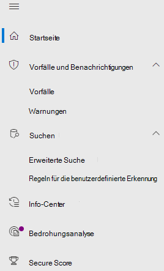

# Microsoft Defender für Office 365 in Microsoft 365 Defender

[!INCLUDE [Microsoft 365 Defender rebranding](../includes/microsoft-defender.md)]

**Gilt für:**
- [Microsoft 365 Defender](microsoft-365-defender.md)
- [Microsoft Defender für Office 365](/microsoft-365/security/office-365-security/defender-for-office-365)

## Kurzübersicht

In der folgenden Tabelle sind die Änderungen in der Navigation zwischen dem Office 365 Security & Compliance Center und dem Microsoft 365 Defender aufgeführt.

 

****

|[Office 365 Security & Compliance](https://protection.office.com)|[Microsoft 365 Defender](https://security.microsoft.com)|[Microsoft 365 Compliance Center](https://compliance.microsoft.com/homepage)|[Exchange Admin Center](https://admin.exchange.microsoft.com/#/)|
|---|---|---|---|
|Warnungen|<ul><li>[Warnungsrichtlinien](https://security.microsoft.com/alertpolicies)</li><li>[Vorfälle & Warnungen](https://security.microsoft.com/alerts)</li></ul>|[Seite "Warnungen"](https://compliance.microsoft.com/homepage)||
|Klassifizierung||Siehe [Microsoft 365 Compliance Center](https://compliance.microsoft.com/homepage)||
|Verhinderung von Datenverlust||Siehe [Microsoft 365 Compliance Center](https://compliance.microsoft.com/homepage)||
|Datensatzverwaltung||Siehe [Microsoft 365 Compliance Center](https://compliance.microsoft.com/homepage)||
|Informationsgovernance||Siehe [Microsoft 365 Compliance Center](https://compliance.microsoft.com/homepage)||
|Bedrohungsverwaltung|[E-Mail-& Zusammenarbeit](https://security.microsoft.com/homepage)|||
|Berechtigungen|[Berechtigungen & Rollen](https://security.microsoft.com/emailandcollabpermissions)|Siehe [Microsoft 365 Compliance Center](https://compliance.microsoft.com/homepage)||
|Nachrichtenübermittlung|||Siehe [Exchange Admin Center](https://admin.exchange.microsoft.com/#/)|
|Datenschutz||Siehe [Microsoft 365 Compliance Center](https://compliance.microsoft.com/homepage)||
|Suchen|[Audit](https://security.microsoft.com/auditlogsearch?viewid=Async%20Search)|Suche (Inhaltssuche)||
|Berichte|[Bericht](https://security.microsoft.com/emailandcollabreport)|||
|Dienstüberprüfung||Siehe [Microsoft 365 Compliance Center](https://compliance.microsoft.com/homepage)||
|Aufsicht||Siehe [Microsoft 365 Compliance Center](https://compliance.microsoft.com/homepage)||
|eDiscovery||Siehe [Microsoft 365 Compliance Center](https://compliance.microsoft.com/homepage)||

[Microsoft 365 Defender](./overview-security-center.md) at <https://security.microsoft.com> kombiniert Sicherheitsfunktionen aus vorhandenen Microsoft-Sicherheitsportalen, einschließlich des Office 365 Security & Compliance Centers. Dieses verbesserte Center unterstützt Sicherheitsteams dabei, ihre Organisationen effektiver und effizienter vor Bedrohungen zu schützen.

Wenn Sie mit dem Office 365 Security and Compliance-Portal (protection.office.com) vertraut sind, werden in diesem Artikel einige änderungen und Verbesserungen in Microsoft 365 Defender beschrieben.

Weitere Informationen zu den Vorteilen: [Übersicht über Microsoft 365 Defender](overview-security-center.md)

Wenn Sie nach Elementen im Zusammenhang mit der Compliance suchen, besuchen Sie das [Microsoft 365 Compliance Center](https://compliance.microsoft.com/homepage).

## Neue und verbesserte Funktionen

Die linke Navigationsleiste oder Schnellstartleiste wird Ihnen vertraut vorkommen. Dieses Sicherheitscenter enthält jedoch einige neue und aktualisierte Elemente.

Mit der einheitlichen Microsoft 365 Defender Lösung können Sie die Bedrohungssignale zusammenfügen und den vollständigen Umfang und die Auswirkungen der Bedrohung sowie deren Auswirkungen auf die Organisation bestimmen.

:::image type="content" source="../../media/M365-defender-converge-experience.png" alt-text="Abbildung Microsoft 365 Defender zusammengeführten Umgebung":::

Defender für Office 365 schützt Ihre Organisation vor bösartigen Bedrohungen durch E-Mail-Nachrichten, Links (URLs) und Tools für die Zusammenarbeit.

:::image type="content" source="../../media/Defender-for-O365.png" alt-text="Abbildung von Defender für Office 365":::

### Vorfälle und Warnungen

Vereint die Verwaltung von Vorfällen und Warnungen über Ihre E-Mails, Geräte und Identitäten hinweg. Warnungen sind jetzt unter dem Knoten "Untersuchung" verfügbar und helfen dabei, sich einen umfassenderen Überblick über einen Angriff zu verschaffen. Die Warnungsseite bietet den vollständigen Kontext zu einer Warnung durch die Kombination von Angriffssignalen, um einen detaillierten Ablauf zu erstellen. Zuvor waren Warnungen auf verschiedene Arbeitslasten bezogen. Eine neue, zentralisierte Ansicht führt nun Warnungen über Workloads hinweg zusammen. Sie können die Daten schnell sichten, untersuchen und entsprechende effektive Maßnahmen ergreifen.

- [Weitere Informationen zu Untersuchungen](incidents-overview.md)
- [Erfahren Sie mehr über das Verwalten von Warnungen.](/windows/security/threat-protection/microsoft-defender-atp/review-alerts)

### Suche

Suchen Sie proaktiv mithilfe von [erweiterten Suchabfragen](advanced-hunting-overview.md) über Ihre Endpunkte, Office 365-Postfächer und mehr hinweg nach Bedrohungen, Schadsoftware und schädlichen Aktivitäten. Diese leistungsstarken Abfragen können zum Suchen und Überprüfen von Bedrohungsindikatoren und Entitäten sowohl für bekannte als auch potenzielle Bedrohungen verwendet werden.

[Benutzerdefinierte Erkennungsregeln](/windows/security/threat-protection/microsoft-defender-atp/custom-detection-rules) können aus erweiterten Suchabfragen erstellt werden, um Proaktive Überwachung auf Ereignisse zu ermöglichen, die möglicherweise auf Aktivitäten bei Sicherheitsverletzungen und falsch konfigurierte Geräte hindeuten.

Hier ist ein Beispiel für die [erweiterte Suche](advanced-hunting-example.md) in Microsoft Defender für Office 365.  

### Info-Center

Im Info-Center zeigt werden die Untersuchungen angezeigt, die durch automatisierte Untersuchungs- und Reaktionsfunktionen erstellt wurden. Diese Möglichkeit der automatisierten Selbstreparatur in Microsoft 365 Defender unterstützt Sicherheitsteams durch automatische Reaktionen auf bestimmte Ereignisse.

Weitere Informationen [zum Info-Center](m365d-action-center.md).

#### Bedrohungsanalyse

Nutzen Sie Informationen zu Bedrohungen von erfahrenen Microsoft-Sicherheitsexperten. Die Bedrohungsanalyse ermöglicht es Sicherheitsteams, aufkommenden Bedrohungen und Risiken effizienter zu begegnen. Die Bedrohungsanalyse umfasst:

- E-Mail-bezogene Erkennungen und Gegenmaßnahmen durch Microsoft Defender für Office 365 zusätzlich zu den Endpunktdaten, die bereits über Microsoft Defender für Endpunkt verfügbar sind.
- Anzeigen von Vorfällen im Zusammenhang mit den Bedrohungen.
- Verbesserte Benutzeroberfläche für die schnelle Identifizierung und Verwendung nützlicher Informationen in den Berichten.

Sie können auf die Bedrohungsanalyse entweder über die obere linke Navigationsleiste in Microsoft 365 Defender oder über eine dedizierte Dashboardkarte zugreifen, die die wichtigsten Bedrohungen für Ihre Organisation anzeigt.

Erfahren Sie mehr darüber, wie Sie [neue Bedrohungen mithilfe von Bedrohungsanalysen nachverfolgen und darauf reagieren](./threat-analytics.md)können.

### E-Mail und Zusammenarbeit

Verfolgen und untersuchen Sie E-Mails Ihrer Benutzer betreffende Risiken und Bedrohungen, verfolgen Sie Kampagnen nach und mehr. Wenn Sie das Office 365 Security & Compliance Center bereits verwendet haben, ist Ihnen das vertraut.

:::image type="content" source="../../media/converge-3-email-and-collab-new.png" alt-text="Das Schnellstartmenü für E-Mail-& Collab (oder MSDO) auf der linken Seite von Microsoft 365 Defender.":::

#### Die Seite "E-Mail-Entität" 

Die [Entitätsseite "E-Mail"](../office-365-security/mdo-email-entity-page.md) *vereinheitlicht* E-Mail-Informationen, die in der Vergangenheit auf verschiedene Seiten oder Ansichten verteilt wurden. Die Untersuchung von E-Mails auf Bedrohungen und Trends ist *zentralisiert*. Auf Kopfzeileninformationen und die E-Mail-Vorschau sowie auf andere nützliche E-Mail-bezogene Informationen kann über dieselbe E-Mail-Seite zugegriffen werden. Ebenso ist der Detonationsstatus für schädliche Dateianlagen oder URLs auf einer Registerkarte derselben Seite zu finden. Die Seite "E-Mail-Entität" versetzt Administratoren und Sicherheitsteams in die Lage, eine E-Mail-Bedrohung und deren Status schnell zu ermitteln, und dann schnell die Reaktion darauf zu bestimmen.

### Zugriff und Berichte

Zeigen Sie Berichte an, und nehmen Sie Änderungen an Einstellungen und Benutzerrollen vor.

:::image type="content" source="../../media/converge-4-access-and-reporting-new.png" alt-text="Das Schnellstartmenü für Microsoft 365 Defender Berechtigungen und Berichte auf der linken Seite des Sicherheitscenters.":::

> [!NOTE]
> DomainKeys Identified Mail (DKIM) stellt sicher, dass Ziel-E-Mail-Systeme Nachrichten vertrauen, die ausgehend von Ihrer benutzerdefinierten Domäne gesendet werden.
> For Defender for Office 365 users, you can now *manage and rotate* DKIM keys through Microsoft 365 Defender: , or navigate to Policy & <https://security.microsoft.com/threatpolicy> **rules** \> **Threat policies** \> **DKIM**.
> 
> Weitere Informationen finden Sie unter [Verwenden von DKIM zum Überprüfen ausgehender E-Mails, die von Ihrer benutzerdefinierten Domäne gesendet werden.](/microsoft-365/security/office-365-security/use-dkim-to-validate-outbound-email)

## Änderungen

Diese Tabelle ist eine Kurzübersicht zur Bedrohungsverwaltung, bei der änderungen zwischen dem **Security & Compliance Center** und dem **Microsoft 365 Defender-Portal** vorgenommen wurden. Klicken Sie auf die Links, um weitere Informationen zu diesen Bereichen zu lesen.

 

****

|Bereich|Beschreibung der Änderung|
|---|---|
|[Untersuchung](../office-365-security/office-365-air.md#changes-are-coming-soon-in-your-microsoft-365-defender-portal)|Vereint die AIR-Funktionen in [Defender für Office 365](/microsoft-365/security/office-365-security/defender-for-office-365) und [Defender für Endpunkt](../defender-endpoint/automated-investigations.md). Dank dieser Updates und Verbesserungen kann Ihr Sicherheitsteam Details zu automatisierten Untersuchungen und Abhilfemaßnahmen für Ihre E-Mails, von mehreren Personen gemeinsam erstellte/genutzte Inhalte, Benutzerkonten und Geräte an einem Ort anzeigen.|
|[Warnungswarteschlange](../../compliance/alert-policies.md)|Der Flyoutbereich **"Warnungen anzeigen"** im Office Security and Compliance Center enthält jetzt Links zu Microsoft 365 Defender. Klicken Sie auf den Link **"Warnungsseite öffnen",** und Microsoft 365 Defender wird geöffnet. Auf die Seite **Warnungen anzeigen** gelangen Sie, indem Sie in der "Warnungen"-Warteschlange auf eine beliebige Office 365-Warnung klicken.|
|[Angriffssimulationstraining](../office-365-security/attack-simulation-training-insights.md)|Nutzen Sie das Angriffssimulationstraining, um realistische Angriffsszenarien in Ihrer Organisation zu erstellen. Mithilfe dieser simulierten Angriffe können Ihre Mitarbeiter geschult werden, bevor Ihre Organisation von echten Angriffen betroffen ist. Das Angriffssimulationstraining umfasst verschiedene Optionen, erweiterte Berichte und verbesserte Schulungsabläufe, die die Bereitstellung und Verwaltung Ihrer Angriffssimulation und Schulungszenarien vereinfachen.|
|

Keine Änderungen an diesen Bereichen:

- [Explorer](../office-365-security/threat-explorer.md)
- [Richtlinien und Regeln](../../compliance/alert-policies.md)
- [Kampagnen](../office-365-security/campaigns.md)
- [Übermittlungen](../office-365-security/admin-submission.md)
- [Überprüfung](./m365d-action-center.md)
- [Bedrohungs-Tracker](../office-365-security/threat-trackers.md)

Lesen Sie auch den Abschnitt **Verwandte Informationen** am Ende dieses Artikels.

> [!IMPORTANT]
> Das Microsoft 365 Defender-Portal ( <https://security.microsoft.com> ) kombiniert Sicherheitsfeatures in <https://securitycenter.windows.com> und <https://protection.office.com> . Was Sie darin sehen, hängt jedoch von Ihrem Abonnement ab. Wenn Sie z. B. nur über Microsoft Defender für Office 365 Plan 1 oder 2 als eigenständige Abonnements verfügen, werden Sie keine Funktionen für die Sicherheit von Endpunkten sehen, und Kunden mit Defender für Office Plan 1 werden Elemente wie "Bedrohungsanalyse" nicht angezeigt.

> [!TIP]
> Alle funktionen Exchange Online Protection (EOP) werden in Microsoft 365 Defender einbezogen, da EOP ein Kernelement von Defender für Office 365 ist.

## Microsoft 365 Defender Startseite

Auf der Startseite des Portals werden wichtige zusammenfassende Informationen zum Sicherheitsstatus Ihrer Microsoft 365 umgebung angezeigt.

Auf einer **Geführten Tour** können Sie eine schnelle Tour durch die Seiten "Endpunkt" oder "E-Mail und Zusammenarbeit" unternehmen. Beachten Sie bitte: Was Sie hier sehen, hängt davon ab, ob Sie über eine Lizenz für Defender für Office 365 und/oder Defender für Endpunkt verfügen.

Ebenfalls enthalten ist ein Link zum **Office 365 Security & Compliance Center** für einen Vergleich. Der letzte Link führt zur Seite **Neuigkeiten**, auf der die neuesten Updates erläutert werden.

## Verwandte Informationen

- [Umleiten des Office 365 Security &amp; Compliance Centers an Microsoft 365 Defender](microsoft-365-security-mdo-redirection.md)
- [Das Info-Center](./m365d-action-center.md)
- [Warnungen für E-Mail & Zusammenarbeit](../../compliance/alert-policies.md#default-alert-policies)
- [Regeln für die benutzerdefinierte Erkennung](/microsoft-365/security/defender-endpoint/custom-detection-rules)
- [Erstellen einer Phishing-Angriffssimulation](../office-365-security/attack-simulation-training.md) und [Erstellen einer Nutzlast für die Schulung Ihrer Teams](../office-365-security/attack-simulation-training-payloads.md)
