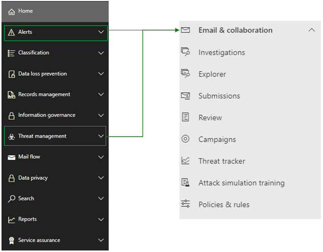

# <a name="microsoft-defender-for-office-365-in-microsoft-365-defender"></a>Microsoft Defender für Office 365 in Microsoft 365 Defender

[!INCLUDE [Microsoft 365 Defender rebranding](../includes/microsoft-defender.md)]

**Gilt für:**
- [Microsoft 365 Defender](microsoft-365-defender.md)
- [Microsoft Defender für Endpunkt](https://go.microsoft.com/fwlink/p/?linkid=2154037)
- [Microsoft Defender für Office 365](/microsoft-365/security/office-365-security/defender-for-office-365)

## <a name="quick-reference"></a>Kurzübersicht

In der Abbildung und der tabelle unten sind die Änderungen in der Navigation zwischen dem Office 365 Security & Compliance Center und Microsoft 365 Defender aufgeführt.

> [!div class="mx-imgBorder"]
> 

<br>

****

|Office 365 Security & Compliance|Microsoft 365 Defender|Microsoft 365 Compliance Center|Exchange Admin-Center|
|---|---|---|---|
|Warnungen|E-Mail und Zusammenarbeit|||
|Klassifizierung||Siehe [Microsoft 365 Compliance Center](https://compliance.microsoft.com/homepage)||
|Verhinderung von Datenverlust||Siehe [Microsoft 365 Compliance Center](https://compliance.microsoft.com/homepage)||
|Datensatzverwaltung||Siehe [Microsoft 365 Compliance Center](https://compliance.microsoft.com/homepage) ||
|Informationsgovernance||Siehe [Microsoft 365 Compliance Center](https://compliance.microsoft.com/homepage)||
|Bedrohungsverwaltung|E-Mail und Zusammenarbeit|||
|Nachrichtenübermittlung|||Siehe [Exchange Admin Center](https://admin.exchange.microsoft.com/#/)|
|Datenschutz||Siehe [Microsoft 365 Compliance Center](https://compliance.microsoft.com/homepage)||
|Suche|Suche|||
|Berichte|Bericht|||
|Dienstüberprüfung|Einstellungen|||
|

[Microsoft 365 Defender](./overview-security-center.md) at <https://security.microsoft.com> kombiniert Sicherheitsfunktionen aus vorhandenen Microsoft-Sicherheitsportalen, einschließlich Microsoft Defender Security Center und dem Office 365 Security & Compliance Center. Dieses verbesserte Center unterstützt Sicherheitsteams dabei, ihre Organisationen effektiver und effizienter vor Bedrohungen zu schützen.

Wenn Sie mit dem Office 365 Security and Compliance-Portal (protection.office.com) vertraut sind, werden in diesem Artikel einige änderungen und Verbesserungen in Microsoft 365 Defender beschrieben.

Weitere Informationen zu den Vorteilen: [Übersicht über Microsoft 365 Defender](overview-security-center.md)

Wenn Sie nach Elementen im Zusammenhang mit der Compliance suchen, besuchen Sie das [Microsoft 365 Compliance Center](https://compliance.microsoft.com/homepage).

## <a name="whats-changed"></a>Änderungen

Diese Tabelle ist eine Kurzübersicht zu den Bereichen "E-Mail“ und „Zusammenarbeit", bei denen es im **Security & Compliance Center** und im **Microsoft 365 Security**-Portal zu Änderungen gekommen ist. Klicken Sie auf die Links, um weitere Informationen zu diesen Bereichen zu lesen.

<br>

****

|Bereich|Beschreibung der Änderung|
|---|---|
|[Die Seite "E-Mail-Entität"](../office-365-security/mdo-email-entity-page.md)|Auf dieser Seite werden E-Mail-Informationen **zusammengeführt**, die in der Vergangenheit über verschiedene Seiten oder Ansichten verteilt waren. Die Untersuchung von E-Mails auf Bedrohungen und Trends ist *zentralisiert*. Auf Kopfzeileninformationen und die E-Mail-Vorschau sowie auf andere nützliche E-Mail-bezogene Informationen kann über dieselbe E-Mail-Seite zugegriffen werden. Ebenso ist der Detonationsstatus für schädliche Dateianlagen oder URLs auf einer Registerkarte derselben Seite zu finden. Die Seite "E-Mail-Entität" versetzt Administratoren und Sicherheitsteams in die Lage, eine E-Mail-Bedrohung und deren Status schnell zu ermitteln, und dann schnell die Reaktion darauf zu bestimmen.|
|[Untersuchung](../office-365-security/office-365-air.md#changes-are-coming-soon-in-your-security-center)|Vereint die AIR-Funktionen in [Defender für Office 365](/microsoft-365/security/office-365-security/defender-for-office-365) und [Defender für Endpunkt](../defender-endpoint/automated-investigations.md). Dank dieser Updates und Verbesserungen kann Ihr Sicherheitsteam Details zu automatisierten Untersuchungen und Abhilfemaßnahmen für Ihre E-Mails, von mehreren Personen gemeinsam erstellte/genutzte Inhalte, Benutzerkonten und Geräte an einem Ort anzeigen.|
|[Warnungsansicht](../../compliance/alert-policies.md)|Der Flyoutbereich **"Warnungen anzeigen"** im Office Security and Compliance Center enthält jetzt Links zu Microsoft 365 Defender. Klicken Sie auf den Link **"Warnungsseite öffnen",** und Microsoft 365 Defender geöffnet wird. Auf die Seite **Warnungen anzeigen** gelangen Sie, indem Sie in der "Warnungen"-Warteschlange auf eine beliebige Office 365-Warnung klicken.|
|[Angriffssimulationstraining](../office-365-security/attack-simulation-training-insights.md)|Nutzen Sie das Angriffssimulationstraining, um realistische Angriffsszenarien in Ihrer Organisation zu erstellen. Mithilfe dieser simulierten Angriffe können Ihre Mitarbeiter geschult werden, bevor Ihre Organisation von echten Angriffen betroffen ist. Das Angriffssimulationstraining umfasst verschiedene Optionen, erweiterte Berichte und verbesserte Schulungsabläufe, die die Bereitstellung und Verwaltung Ihrer Angriffssimulation und Schulungszenarien vereinfachen.|
|

Keine Änderungen an diesen Bereichen:

- [Explorer](../office-365-security/threat-explorer.md)
- [Richtlinien und Regeln](../../compliance/alert-policies.md)
- [Kampagnen](../office-365-security/campaigns.md)
- [Übermittlungen](../office-365-security/admin-submission.md)
- [Überprüfung](./m365d-action-center.md)
- [Bedrohungs-Tracker](../office-365-security/threat-trackers.md)

Lesen Sie auch den Abschnitt **Verwandte Informationen** am Ende dieses Artikels.

> [!IMPORTANT]
> Das Microsoft 365-Sicherheitsportal ( <https://security.microsoft.com> ) kombiniert Sicherheitsfeatures in <https://securitycenter.windows.com> und <https://protection.office.com> . Was Sie darin sehen, hängt jedoch von Ihrem Abonnement ab. Wenn Sie z. B. nur über Microsoft Defender für Office 365 Plan 1 oder 2 als eigenständige Abonnements verfügen, werden Sie keine Funktionen für die Sicherheit von Endpunkten sehen, und Kunden mit Defender für Office Plan 1 werden Elemente wie "Bedrohungsanalyse" nicht angezeigt.

> [!TIP]
> Alle funktionen Exchange Online Protection (EOP) werden in Microsoft 365 Defender einbezogen, da EOP ein Kernelement von Defender für Office 365 ist.

## <a name="microsoft-365-defender-home-page"></a>Microsoft 365 Defender-Startseite

Auf der Startseite des Portals wird Folgendes angezeigt:

- Sicherheitsbewertungen
- Anzahl der gefährdeten Benutzer und Geräte
- Aktive Vorfallwarteschlange
- Listen privilegierter OAuth-Apps
- Daten zur Geräteintegrität
- Tweets aus dem Twitter-Feed "Security Intelligence" von Microsoft
- sowie weitere Kurzinformationen.

Auf einer **Geführten Tour** können Sie eine schnelle Tour durch die Seiten "Endpunkt" oder "E-Mail und Zusammenarbeit" unternehmen. Beachten Sie bitte: Was Sie hier sehen, hängt davon ab, ob Sie über eine Lizenz für Defender für Office 365 und/oder Defender für Endpunkt verfügen.

Ebenfalls enthalten ist ein Link zum **Office 365 Security & Compliance Center** für einen Vergleich. Der letzte Link führt zur Seite **Neuigkeiten**, auf der die neuesten Updates erläutert werden.

## <a name="improved-capabilities"></a>Verbesserte Funktionen

Die linke Navigationsleiste oder Schnellstartleiste wird Ihnen vertraut vorkommen. Dieses Sicherheitscenter enthält jedoch einige neue und aktualisierte Elemente.

### <a name="incidents-and-alerts"></a>Vorfälle und Warnungen

Vereint die Verwaltung von Vorfällen und Warnungen über Ihre E-Mails, Geräte und Identitäten hinweg. Warnungen sind jetzt unter dem Knoten "Untersuchung" verfügbar und helfen dabei, sich einen umfassenderen Überblick über einen Angriff zu verschaffen. Die Warnungsseite bietet den vollständigen Kontext zu einer Warnung durch die Kombination von Angriffssignalen, um einen detaillierten Ablauf zu erstellen. Zuvor waren Warnungen auf verschiedene Arbeitslasten bezogen. Eine neue, zentralisierte Ansicht führt nun Warnungen über Workloads hinweg zusammen. Sie können die Daten schnell sichten, untersuchen und entsprechende effektive Maßnahmen ergreifen.

- [Weitere Informationen zu Untersuchungen](incidents-overview.md)
- [Erfahren Sie mehr über das Verwalten von Warnungen.](/windows/security/threat-protection/microsoft-defender-atp/review-alerts)


### <a name="hunting"></a>Suche

Suchen Sie proaktiv mithilfe von [erweiterten Suchabfragen](advanced-hunting-overview.md) über Ihre Endpunkte, Office 365-Postfächer und mehr hinweg nach Bedrohungen, Schadsoftware und schädlichen Aktivitäten. Diese leistungsstarken Abfragen können zum Suchen und Überprüfen von Bedrohungsindikatoren und Entitäten sowohl für bekannte als auch potenzielle Bedrohungen verwendet werden.

[Benutzerdefinierte Erkennungsregeln](/windows/security/threat-protection/microsoft-defender-atp/custom-detection-rules) können aus erweiterten Suchabfragen erstellt werden, die Ihnen dabei helfen, proaktiv nach Ereignissen zu suchen, die ein Zeichen für Sicherheitsverletzungen und falsch konfigurierte Geräte sein könnten.

### <a name="action-center"></a>Info-Center

Im Info-Center zeigt werden die Untersuchungen angezeigt, die durch automatisierte Untersuchungs- und Reaktionsfunktionen erstellt wurden. Diese Möglichkeit der automatisierten Selbstreparatur in Microsoft 365 Defender unterstützt Sicherheitsteams durch automatische Reaktionen auf bestimmte Ereignisse.

[Weitere Informationen zum Info-Center](m365d-action-center.md)

#### <a name="threat-analytics"></a>Bedrohungsanalyse

Nutzen Sie Informationen zu Bedrohungen von erfahrenen Microsoft-Sicherheitsexperten. Die Bedrohungsanalyse ermöglicht es Sicherheitsteams, aufkommenden Bedrohungen und Risiken effizienter zu begegnen. Die Bedrohungsanalyse umfasst:

- E-Mail-bezogene Erkennungen und Gegenmaßnahmen durch Microsoft Defender für Office 365 zusätzlich zu den Endpunktdaten, die bereits über Microsoft Defender für Endpunkt verfügbar sind.
- Anzeigen von Vorfällen im Zusammenhang mit den Bedrohungen.
- Verbesserte Benutzeroberfläche für die schnelle Identifizierung und Verwendung nützlicher Informationen in den Berichten.
Sie können auf die Bedrohungsanalyse entweder über die obere linke Navigationsleiste in Microsoft 365 Defender oder über eine dedizierte Dashboardkarte zugreifen, die die wichtigsten Bedrohungen für Ihre Organisation anzeigt.

Erfahren Sie mehr über das [Nachverfolgen und Reagieren auf neue Bedrohungen mit Bedrohungsanalysen](./threat-analytics.md).

### <a name="email--collaboration"></a>E-Mail und Zusammenarbeit

Verfolgen und untersuchen Sie E-Mails Ihrer Benutzer betreffende Risiken und Bedrohungen, verfolgen Sie Kampagnen nach und mehr. Wenn Sie das Office 365 Security & Compliance Center bereits verwendet haben, ist Ihnen das vertraut.

:::image type="content" source="../../media/converge-3-email-and-collab-new.png" alt-text="Das Schnellstartmenü für E-Mail-& Collab (oder MSDO) auf der linken Seite von Microsoft 365 Defender.":::

### <a name="access-and-reports"></a>Zugriff und Berichte

Zeigen Sie Berichte an, und nehmen Sie Änderungen an Einstellungen und Benutzerrollen vor.

:::image type="content" source="../../media/converge-4-access-and-reporting-new.png" alt-text="Das Schnellstartmenü für Microsoft 365 Defender-Berechtigungen und -Berichte auf der linken Seite des Sicherheitscenters.":::

> [!NOTE]
> Für Defender für Office 365 Benutzer können Sie jetzt DomainKeys Identified Mail (DKIM)-Schlüssel über Microsoft 365 *Defender: verwalten und drehen* <https://security.microsoft.com/threatpolicy> oder zu Richtlinien & **Regeln** für \> **Bedrohungsrichtlinien** \> **DKIM** navigieren.

## <a name="advanced-hunting-example-for-microsoft-defender-for-office-365"></a>Beispiel für erweiterte Bedrohungssuche für Microsoft Defender für Office 365

Möchten Sie mit der erweiterten Bedrohungssuche nach E-Mail-Bedrohungen beginnen? Dann probieren Sie Folgendes aus:

Der Abschnitt [Erste Schritte](/microsoft-365/security/office-365-security/defender-for-office-365.md#getting-started) im Artikel [Microsoft Defender für Office 365](/microsoft-365/security/office-365-security/defender-for-office-365) enthält logische erste Konfigurationsblöcke, die so aussehen:

1. Konfigurieren Sie alles mit "Anti" im Namen.
   - Antischadsoftware
   - Antiphishing
   - Antispam
2. Richten Sie alles mit "Sicher" im Namen ein.
   - Sichere Links
   - Sichere Anlagen
3. Sichern Sie die Workloads (z. B. SharePoint Online, OneDrive und Teams).
4. Schützen Mit automatischer Nullstunde-Bereinigung.

Zusammen mit einem [Link](../office-365-security/protect-against-threats.md) für den Sofortstart und um schon am ersten Tag mit der Konfiguration zu beginnen.

Der letzte Schritt in **Erste Schritte** dient dem Schutz von Benutzern mittels **automatischer Bereinigung zur Nullstunde**, auch bekannt als ZAP (Zero-Hour auto purge). Es kann sehr wichtig sein zu wissen, ob Ihre Bemühungen, ZAP auf verdächtige oder schädliche E-Mails nach der Zustellung anzuwenden, erfolgreich waren.

Der schnelle Wechsel zur Kusto-Abfragesprache, um nach Problemen zu suchen, stellt einen Vorteil der Zusammenführung dieser beiden Sicherheitscenter dar. Sicherheitsteams können ZAP-Fehler überwachen, indem sie [hier](https://security.microsoft.com/advanced-hunting)unter **"Erweiterte Suche"** die nächsten Schritte \> ausführen.

1. Klicken Sie auf der Seite "Erweiterte Bedrohungssuche" auf "Abfrage".
1. Kopieren Sie die nachstehende Abfrage in das Abfragefenster.
1. Wählen Sie "Abfrage ausführen" aus.

```kusto
EmailPostDeliveryEvents 
| where Timestamp > ago(7d)
//List malicious emails that were not zapped successfullyconverge-2-endpoints-new.png
| where ActionType has "ZAP" and ActionResult == "Error"
| project ZapTime = Timestamp, ActionType, NetworkMessageId , RecipientEmailAddress 
//Get logon activity of recipients using RecipientEmailAddress and AccountUpn
| join kind=inner IdentityLogonEvents on $left.RecipientEmailAddress == $right.AccountUpn
| where Timestamp between ((ZapTime-24h) .. (ZapTime+24h))
//Show only pertinent info, such as account name, the app or service, protocol, the target device, and type of logon
| project ZapTime, ActionType, NetworkMessageId , RecipientEmailAddress, AccountUpn, 
LogonTime = Timestamp, AccountDisplayName, Application, Protocol, DeviceName, LogonType
```

:::image type="content" source="../../media/converge-13-advanced-hunt-an-email-zap-new.png" alt-text="Die Seite &quot;Erweiterte Suche&quot; (unter &quot;Suche&quot;) mit ausgewählter Abfrage am oberen Rand des Abfragebereichs und ausführen einer Kusto-Abfrage, um ZAP-Aktionen in den letzten 7 Tagen zu erfassen.":::

Die Daten aus dieser Abfrage werden im Ergebnisbereich unterhalb der Abfrage selbst angezeigt. Die Ergebnisse enthalten Informationen wie "DeviceName", "AccountDisplayName" und "ZapTime" in einem anpassbaren Ergebnisset. Die Ergebnisse können auch zur Dokumentation exportiert werden. Wenn die Abfrage später erneut benötigt wird, wählen Sie **Speichern** > **Speichern unter**, und fügen Sie die Abfrage Ihrer Liste von Abfragen, freigegebenen oder Communityabfragen hinzu.

## <a name="related-information"></a>Verwandte Informationen

- [Microsoft Defender für Office 365 in Microsoft 365 Defender](microsoft-365-security-center-mdo.md)
- [Das Info-Center](./m365d-action-center.md)
- [Warnungen für E-Mail & Zusammenarbeit](../../compliance/alert-policies.md#default-alert-policies)
- [Gefahrensuche über Geräte, E-Mails, Apps und Identitäten hinweg](./advanced-hunting-query-emails-devices.md)
- [Regeln für die benutzerdefinierte Erkennung](/microsoft-365/security/defender-endpoint/custom-detection-rules)
- [Erstellen einer Phishing-Angriffssimulation](../office-365-security/attack-simulation-training.md) und [Erstellen einer Nutzlast für die Schulung Ihrer Teams](../office-365-security/attack-simulation-training-payloads.md)
