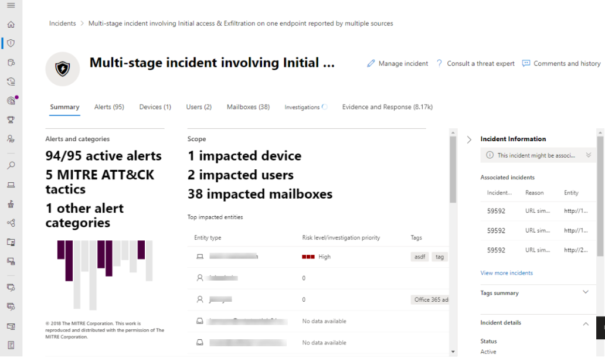

# Microsoft 365 Übersicht über DefenderMicrosoft 365 Defender overview

[!INCLUDE [Microsoft 365 Defender rebranding](../includes/microsoft-defender.md)]

**Gilt für:****Applies to:**

- [Microsoft 365 DefenderMicrosoft 365 Defender](microsoft-365-defender.md)
- [Microsoft Defender für EndpunktMicrosoft Defender for Endpoint](https://go.microsoft.com/fwlink/p/?linkid=2154037)
- [Microsoft Defender für Office 365Microsoft Defender for Office 365](/microsoft-365/security/office-365-security/defender-for-office-365)

> Sie möchten Microsoft 365 Defender ausprobieren?Want to experience Microsoft 365 Defender? Sie können [in einer Laborumgebung auswerten](m365d-evaluation.md?ocid=cx-docs-MTPtriallab) oder [ein Pilotprojekt in der Produktionsumgebung ausführen](m365d-pilot.md?ocid=cx-evalpilot).You can [evaluate it in a lab environment](m365d-evaluation.md?ocid=cx-docs-MTPtriallab) or [run your pilot project in production](m365d-pilot.md?ocid=cx-evalpilot).

**Microsoft 365 Defender** ( [https://security.microsoft.com](https://security.microsoft.com) ) kombiniert Schutz, Erkennung, Untersuchung und Reaktion auf *E-Mail-, Zusammenarbeits-,* *Identitäts-* und *Gerätebedrohungen* in einem zentralen Portal. **Microsoft 365 Defender** ([https://security.microsoft.com](https://security.microsoft.com)) combines protection, detection, investigation, and response to *email*, *collaboration*, *identity*, and *device* threats, in a central portal.

Microsoft 365 Defender vereint Funktionen aus vorhandenen Microsoft-Sicherheitsportalen wie Microsoft Defender Security Center und dem Office 365 Security & Compliance Center.Microsoft 365 Defender brings together functionality from existing Microsoft security portals, like Microsoft Defender Security Center and the Office 365 Security & Compliance center. Das Security Center legt wert auf den schnellen Zugriff auf Informationen, einfachere Layouts und das Zusammenbringen verwandter Informationen zur einfacheren Nutzung.The security center emphasizes quick access to information, simpler layouts, and bringing related information together for easier use. Dieses Center umfasst:This center includes:

- **[Microsoft Defender für Office 365](/microsoft-365/security/office-365-security/defender-for-office-365)** Microsoft Defender für Office 365 hilft Organisationen, ihr Unternehmen mit einer Reihe von Features zur Verhinderung, Erkennung, Untersuchung und Suche zum Schutz von E-Mails und Office 365-Ressourcen zu schützen.**[Microsoft Defender for Office 365](/microsoft-365/security/office-365-security/defender-for-office-365)** Microsoft Defender for Office 365 helps organizations secure their enterprise with a set of prevention, detection, investigation and hunting features to protect email, and Office 365 resources.
- **[Microsoft Defender für Endpunkt](/microsoft-365/security/defender-endpoint/microsoft-defender-advanced-threat-protection)** liefert präventiven Schutz, Erkennung nach einem Angriff, automatisierte Untersuchung und Reaktion für Geräte in Ihrer Organisation.**[Microsoft Defender for Endpoint](/microsoft-365/security/defender-endpoint/microsoft-defender-advanced-threat-protection)** delivers preventative protection, post-breach detection, automated investigation, and response for devices in your organization.
- **[Microsoft 365 Defender](microsoft-365-defender.md)** ist Teil der Microsoft-Lösung *Extended Detection and Response* (XDR), die das Sicherheitsportfolio von Microsoft 365 nutzt, um Bedrohungsdaten domänenübergreifend automatisch zu analysieren und ein Bild eines Angriffs auf einem einzelnen Dashboard zu erstellen.**[Microsoft 365 Defender](microsoft-365-defender.md)** is part of Microsoft’s *Extended Detection and Response* (XDR) solution that leverages the Microsoft 365 security portfolio to automatically analyze threat data across domains, and build a picture of an attack on a single dashboard.

Wenn Sie Informationen zu den Aktualisierungen im Office 365 Security & Compliance Center oder im Microsoft Defender Security Center benötigen, lesen Sie:If you need information about what's changed from the Office 365 Security & Compliance center or the Microsoft Defender Security Center, see:

- [Defender für Office 365 in Microsoft 365 DefenderDefender for Office 365 in Microsoft 365 Defender](microsoft-365-security-center-mdo.md)
- [Defender für Endpunkt in Microsoft 365 DefenderDefender for Endpoint in Microsoft 365 Defender](microsoft-365-security-center-mde.md)

> [!NOTE]
> Das Microsoft 365 Sicherheitsportal verwendet und erzwingt vorhandenen rollenbasierten Zugriff und verschenken jedes Sicherheitsmodell in das einheitliche Portal.The Microsoft 365 security portal uses and enforces existing roles-based access, and will move each security model into the unified portal. Jede zusammengeführte Workload (z. B. MDO oder MDE) verfügt über einen eigenen rollenbasierten Zugriff.Each converged workload (such as MDO or MDE) has its own roles-based access. Die bereits in den Produkten enthaltenen Rollen werden automatisch im Microsoft 365 Sicherheitsportal zusammengeführt.The roles already in the products will be converged into the Microsoft 365 security portal, automatically. Rollen und Berechtigungen für MCAS werden jedoch weiterhin in MCAS verarbeitet.However, roles and permissions for MCAS will still handled over in MCAS.

## Das erwartet SieWhat to expect

Alle Sicherheitsinhalte, die Sie im Office 365 Security and Compliance Center (protection.office.com) und im Microsoft Defender Security Center (securitycenter.microsoft.com) verwenden, finden Sie jetzt im *Microsoft 365 Defender*.All the security content that you use in the Office 365 Security and Compliance Center (protection.office.com) and the Microsoft Defender security center (securitycenter.microsoft.com) can now be found in the *Microsoft 365 Defender*.

Microsoft 365 Defender hilft Sicherheitsteams, Angriffe zu untersuchen und darauf zu reagieren, indem Signale aus verschiedenen Workloads in eine Reihe von einheitlichen Umgebungen für Folgendes integriert werden:Microsoft 365 Defender helps security teams investigate and respond to attacks by bringing in signals from different workloads into a set of unified experiences for:

- Vorfälle und BenachrichtigungenIncidents & alerts
- SuchenHunting
- Info-CenterAction center
- BedrohungsanalyseThreat analytics

Microsoft 365 Defender setzt bei der Zusammenführung von Microsoft Defender für Office 365 und Microsoft Defender für Endpunkt auf *Einheit, Klarheit und gemeinsame Ziele.*Microsoft 365 Defender emphasizes *unity, clarity, and common goals* as it merges Microsoft Defender for Office 365 and Microsoft Defender for Endpoint. Die Zusammenführung basierte auf den unten aufgeführten Prioritäten und wurde ohne Einbußen an den Funktionen vorgenommen, die jede Sicherheitssuite in die Kombination von:The merge was based on the priorities listed below, and made without sacrificing the capabilities that each security suite brought to the combination of:

- Allgemeine BausteineCommon building blocks
- Allgemeine TerminologieCommon terminology
- Allgemeine EntitätenCommon entities
- Featureparität mit anderen WorkloadsFeature parity with other workloads

> [!NOTE]
> Microsoft 365 Auf Defender kann zugegriffen werden, ohne dass Kunden Migrationsschritte ausführen oder eine neue Lizenz erwerben müssen.Microsoft 365 Defender will be accessible without any need for customers to take migration steps or purchase a new license. Beispielsweise kann auf dieses neue Portal für Administratoren mit einem E3-Abonnement genauso zugegriffen werden wie auf diejenigen mit Microsoft Defender für Office 365 Plan 1 und Plan 2. Exchange Online Protection- oder MDO Plan 1-Kunden werden jedoch nur die Sicherheitsfeatures angezeigt, die ihre Abonnementlizenz unterstützt.For example, this new portal will be accessible to administrators with an E3 subscription, just as it is to those with Microsoft Defender for Office 365 Plan 1 and Plan 2; however, Exchange Online Protection, or MDO Plan 1 customers will see only the security features their subscription license supports. Das Ziel des neuen Centers besteht darin, die Sicherheit zu zentralisieren.The goal of the new center is to centralize security.

## Vereinheitlichte UntersuchungenUnified investigations

Durch das Zusammenstellen von Sicherheitscentern wird ein einzelner Ort für die Untersuchung von Sicherheitsvorfällen über Microsoft 365 hinweg erstellt.Converging security centers creates a single place for investigating security incidents across Microsoft 365. Ein **primäres** Beispiel sind Vorfälle unter **Vorfällen & Warnungen** bei der Schnellstartleiste von Microsoft 365 Defender.A primary example is **Incidents** under **Incidents & alerts** on the quick launch of Microsoft 365 Defender.

:::image type="content" source="../../media/converged-incidents-2.png.png" alt-text="Die Seite &quot;Vorfälle&quot; in Microsoft 365 Defender.":::

Wenn Sie einen Vorfallnamen auswählen, wird eine Seite angezeigt, die den Wert der Zusammenführung von Sicherheitscentern veranschaulicht.Selecting an incident name displays a page that demonstrates the value of converging security centers.

:::image type="content" source="../../media/converged-incident-info-3.png" alt-text="Beispiel für die Seite &quot;Zusammenfassung&quot; für einen Vorfall in Microsoft 365 Defender":::

<!--

--> 

Oben auf einer Vorfallseite werden die **Registerkarten "Zusammenfassung",** **"Warnungen",** **"Geräte",** **"Benutzer",** **"Postfächer",** **"Untersuchungen"** und **"Nachweise"** angezeigt.Along the top of an incident page, you'll see the **Summary**, **Alerts**, **Devices**, **Users**, **Mailboxes**, **Investigations**, and **Evidence** tabs. Wählen Sie diese Registerkarten aus, um ausführlichere Informationen zu finden.Select these tabs for more detailed information. Auf der Registerkarte **"Benutzer"** werden beispielsweise Informationen für Benutzer aus zusammengeführten Workloads (Microsoft Defender für Endpunkt, Microsoft Defender for Identity und Microsoft Cloud App Security) sowie eine Reihe von Quellen angezeigt, z. B. lokale Active Directory Domain Services (AD DS), Azure Active Directory (Azure AD) und Identitätsanbieter von Drittanbietern.For example, the **Users** tab displays information for users from converged workloads (Microsoft Defender for Endpoint, Microsoft Defender for Identity, and Microsoft Cloud App Security) and a range of sources such as on-premises Active Directory Domain Services (AD DS), Azure Active Directory (Azure AD), and third-party identity providers. Weitere Informationen finden Sie unter Untersuchen von [Benutzern.](investigate-users.md)For more information, see [investigate users](investigate-users.md).

Nehmen Sie sich Zeit, um die Vorfälle in Ihrer Umgebung zu überprüfen, führen Sie einen Drilldown zu diesen Registerkarten durch, und üben Sie es, ein Verständnis dafür zu entwickeln, wie Sie auf die Informationen zugreifen können, die für Vorfälle für verschiedene Arten von Bedrohungen bereitgestellt werden.Take the time to review the incidents in your environment, drill down into these tabs, and practice building an understanding of how to access the information provided for incidents for different kinds of threats.

Weitere Informationen finden Sie unter [Vorfälle in Microsoft 365 Defender](incidents-overview.md).For more information, see [incidents in Microsoft 365 Defender](incidents-overview.md).

## Verbesserte ProzesseImproved processes

Allgemeine Steuerelemente und Inhalte werden entweder an derselben Stelle angezeigt oder sind zu einem Datenfeed zusammengefasst, wodurch sie einfacher zu finden sind.Common controls and content either appear in the same place, or are condensed into one feed of data making it easier to find. Beispielsweise einheitliche Einstellungen.For example, unified settings.

### Einheitliche EinstellungenUnified settings

### Berechtigungen und RollenPermissions & roles

 Der Zugriff auf Microsoft 365 Defender wird mit Azure Active Directory globalen Rollen oder mithilfe von benutzerdefinierten Rollen konfiguriert.Access to Microsoft 365 Defender is configured with Azure Active Directory global roles or by using custom roles. Für Defender für Endpunkt, siehe [Zuweisen des Benutzerzugriffs auf das Microsoft Defender Security Center](/microsoft-365/security/defender-endpoint/assign-portal-access).For Defender for Endpoint, see [Assign user access to Microsoft Defender Security Center](/microsoft-365/security/defender-endpoint/assign-portal-access). Informationen zu Defender für Office 365 finden Sie unter [Berechtigungen im Microsoft 365 Compliance Center und Microsoft 365 Defender](../office-365-security/permissions-microsoft-365-compliance-security.md).For Defender for Office 365, see [Permissions in the Microsoft 365 compliance center and Microsoft 365 Defender](../office-365-security/permissions-microsoft-365-compliance-security.md).

- Weitere Informationen zum [Verwalten des Zugriffs auf Microsoft 365 Defender](m365d-permissions.md)Learn more about how to [manage access to Microsoft 365 Defender](m365d-permissions.md)
- Weitere Informationen zum [Erstellen benutzerdefinierter Rollen](custom-roles.md) in Microsoft 365 DefenderLearn more about how to [create custom roles](custom-roles.md) in Microsoft 365 Defender

> [!NOTE]
> Microsoft Defender für Endpunkt in Microsoft 365 Defender unterstützt das Gewähren des [Zugriffs auf verwaltete Sicherheitsdienstanbieter (Managed Security Service Providers, MSSPs)](/windows/security/threat-protection/microsoft-defender-atp/grant-mssp-access) auf die gleiche Weise, wie der Zugriff [im Microsoft Defender Security Center gewährt](./mssp-access.md)wird.Microsoft Defender for Endpoint in Microsoft 365 Defender supports [granting access to managed security service providers (MSSPs)](/windows/security/threat-protection/microsoft-defender-atp/grant-mssp-access) in the same that way access is [granted in the Microsoft Defender security center](./mssp-access.md).

### Integrierte BerichteIntegrated reports

Berichte sind auch in Microsoft 365 Defender vereinheitlicht.Reports are also unified in Microsoft 365 Defender. Administratoren können mit einem allgemeinen Sicherheitsbericht beginnen und dann in bestimmte Berichte zu Endpunkten, E-Mail und Zusammenarbeit verzweigen.Admins can start with a general security report, and branch into specific reports about endpoints, email & collaboration. Die Links hier werden dynamisch basierend auf der Workloadkonfiguration generiert.The links here are dynamically generated based upon workload configuration.

### Schnelles Anzeigen Ihrer Microsoft 365-UmgebungQuickly view your Microsoft 365 environment

Die **Startseite** zeigt viele der allgemeinen Karten, die Sicherheitsteams benötigen.The **Home** page shows many of the common cards that security teams need. Die Zusammenstellung von Karten und Daten hängt von der Benutzerrolle ab.The composition of cards and data is dependent on the user role. Da Microsoft 365 Security Center die rollenbasierte Zugriffssteuerung verwendet, sehen unterschiedliche Rollen Karten, die für ihre täglichen Aufgaben aussagekräftiger sind.Because Microsoft 365 security center uses role-based access control, different roles will see cards that are more meaningful to their day to day jobs.  

Diese Informationen auf einen Blick helfen Ihnen, über die neuesten Aktivitäten in Ihrer Organisation auf dem Laufenden zu bleiben.This at-a-glance information helps you keep up with the latest activities in your organization. Microsoft 365 Defender vereint Signale aus verschiedenen Quellen, um eine ganzheitliche Ansicht Ihrer Microsoft 365 Umgebung darzustellen.Microsoft 365 Defender brings together signals from different sources to present a holistic view of your Microsoft 365 environment.

Die Karten können in vier Kategorien unterteilt werden:The cards fall into these categories:

- **Identitäten**: Überwachen Sie die Identitäten in Ihrer Organisation, und verfolgen Sie verdächtige oder riskante Verhaltensweisen nach.**Identities**- Monitor the identities in your organization and keep track of suspicious or risky behaviors. [Weitere Informationen zum Identitätsschutz](/azure/active-directory/identity-protection/overview-identity-protection).[Learn more about identity protection](/azure/active-directory/identity-protection/overview-identity-protection).
- **Daten**: Hilft beim Nachverfolgen von Benutzeraktivitäten, die zu einer nicht autorisierten Datenweitergabe führen könnten.**Data** - Help track user activity that could lead to unauthorized data disclosure.
- **Geräte**: Hier erhalten Sie aktuelle Informationen zu Benachrichtigungen, Sicherheitsverletzungsaktivitäten und anderen Bedrohungen auf Ihren Geräten.**Devices** - Get up-to-date information on alerts, breach activity, and other threats on your devices.
- **Apps**: Gewinnen Sie Einblicke in die Verwendung von Cloud-Apps in Ihrer Organisation.**Apps** - Gain insight into how cloud apps are being used in your organization. [Weitere Informationen zu von Cloud App Security gefundenen Apps](/cloud-app-security/discovered-apps).[Learn more about Cloud App Security discovered apps](/cloud-app-security/discovered-apps).

## Bedrohungsanalysen mit besserer DatenabdeckungThreat analytics with better data coverage
Verfolgen Sie aufkommende Bedrohungen und reagieren Sie darauf mit den folgenden integrierten Bedrohungsanalysen von Microsoft 365 Defender:Track and respond to emerging threats with the following Microsoft 365 Defender threat analytics integrated experience:

- Bessere Datenabdeckung zwischen Microsoft Defender für Endpunkt und Microsoft Defender für Office 365, so dass kombiniertes Vorfallmanagement, automatische Untersuchung, Behebung und proaktive oder reaktive Bedrohungssuche domänenübergreifend möglich sind.Better data coverage between Microsoft Defender for Endpoint and Microsoft Defender for Office 365, making combined incident management, automatic investigation, remediation, and proactive or reactive threat hunting across-domain possible. 
- E-Mail-bezogene Erkennungen und Begrenzungen durch Microsoft Defender für Office 365 zusätzlich zu den Endpunktdaten, die bereits von Microsoft Defender für Endpoint verfügbar sind.Email-related detections and mitigations from Microsoft Defender for Office 365, in addition to the endpoint data already available from Microsoft Defender for Endpoint.
- Eine Ansicht bedrohungsbezogener Vorfälle, die Benachrichtigungen zu durchgängigen Angriffsgeschichten in Microsoft Defender für Endpunkt und Microsoft Defender für Office 365 zusammenfasst, um den Arbeitsaufwand zu reduzieren sowie Ihre Untersuchung zu vereinfachen und zu beschleunigen.A view of threat-related incidents which aggregate alerts into end-to-end attack stories across Microsoft Defender for Endpoint and Microsoft Defender for Office 365 to reduce the work queue, as well as simplify and speed up your investigation.
- Angriffsversuche, die von Microsoft 365 Defender-Lösungen erkannt und blockiert wurden.Attack attempts detected and blocked by Microsoft 365 Defender solutions. Es gibt auch Daten, die Sie verwenden können, um vorbeugende Maßnahmen zu ergreifen, mit denen das Risiko einer weiteren Gefährdung entschärft und die Resilienz erhöht wird.There's also data that you can use to drive preventive actions that mitigate the risk of further exposure and increase resilience. 
- Verbessertes Design, das umsetzbare Informationen in den Vordergrund stellt, damit Sie schnell die Daten identifizieren können, auf die Sie sich dringend konzentrieren, die Sie untersuchen und die Sie aus den Berichten nutzen müssen.Enhanced design that puts actionable information in the spotlight to help you  quickly identify data to urgently focus on, investigate, and leverage from the reports.

## Ein zentraler LernhubA centralized Learning Hub

Microsoft 365 Security Center umfasst einen Lernhub, der offizielle Anleitungen aus Ressourcen wie dem Microsoft-Sicherheitsblog, der Microsoft-Sicherheitscommunity auf YouTube und der offiziellen Dokumentation auf docs.microsoft.com zusammenstellen kann.Microsoft 365 security center includes a learning hub that bubbles up official guidance from resources such as the Microsoft security blog, the Microsoft security community on YouTube, and the official documentation at docs.microsoft.com.

Innerhalb des Learning Hubs stehen die Anleitungen für E-Mail & Zusammenarbeit (Microsoft Defender für Office 365 oder MDO) Seite an Seite mit den Lernressourcen für Endpunkt (Microsoft Defender für Endpunkt oder MDE) und Microsoft 365 Defender.Inside the learning hub, Email & Collaboration (Microsoft Defender for Office 365 or MDO) guidance is side-by-side with Endpoint (Microsoft Defender for Endpoint or MDE), and Microsoft 365 Defender learning resources.

Der Lernhub wird mit Lernpfaden geöffnet, die nach Themen organisiert sind, wie "So untersuchen Sie mit Microsoft 365 Defender"The learning hub opens with Learning paths organized around topics such as “How to Investigate Using Microsoft 365 Defender?” und "Bewährte Methoden für Microsoft Defender für Office 365“.and “Microsoft Defender for Office 365 Best Practices”. Dieser Abschnitt wird derzeit von der Sicherheitsproduktgruppe in Microsoft erstellt.This section is currently curated by the security Product Group inside Microsoft. Jeder Lernpfad spiegelt eine geplante Zeit wider, die es dauert, um die Konzepte zu durchlaufen.Each Learning path reflects a projected time it takes to get through the concepts. Beispiel: "Schritte, die sie unternehmen müssen, wenn ein Benutzerkonto von Microsoft Defender für Office 365 kompromittiert ist" dauert voraussichtlich 8 Minuten und ist ein wertvolles Lernprogramm für unterwegs.For example 'Steps to take when a Microsoft Defender for Office 365 user account is compromised' is projected to take 8 minutes, and is valuable learning on the fly.

Nachdem Sie sich durch den Inhalt geklickt haben, kann es hilfreich sein, für diese Website ein Lesezeichen zu setzen und Lesezeichen in einem Ordner "Sicherheit" oder "Kritisch" zu organisieren.After clicking through to the content, it may be useful to bookmark this site and organize bookmarks into a 'Security' or 'Critical' folder. Zum Anzeigen aller Lernpfade klicken Sie im Hauptbereich auf den Link "Alle anzeigen".To see all Learning paths, click the Show all link in the main panel.

> [!NOTE]
> Es gibt hilfreiche **Filter** am oberen Rand Microsoft 365 Defender-Lernhubs, mit denen Sie zwischen Produkten auswählen können (derzeit Microsoft 365 Defender, Microsoft Defender für Endpunkt und Microsoft Defender für Office 365).There are helpful **filters** along the top of Microsoft 365 Defender learning hub that will let you choose between products (currently Microsoft 365 Defender, Microsoft Defender for Endpoint, and Microsoft Defender for Office 365). Beachten Sie, dass die Anzahl der Lernressourcen für jeden Abschnitt aufgelistet ist, was Lernenden dabei helfen kann, zu verfolgen, wie viele Ressourcen für Schulung und Lernen zur Verfügung stehen.Notice that the number of learning resources for each section is listed, which can help learners keep track of how many resources they have at hand for training and learning.
>
> Neben dem Produktfilter werden aktuelle Themen, Ressourcentypen (von Videos bis Webinaren), Stufen der Vertrautheit oder Erfahrung mit Sicherheitsbereichen, Sicherheitsrollen und Produktfeatures aufgelistet.Along with the Product filter, current topics, types of resources (from videos to webinars), levels of familiarity or experience with security areas, security roles, and product features are listed.

> [!TIP]
> Es gibt viele andere Lernmöglichkeiten in [Microsoft Learn.](/e/learn/)There are lots of other learning opportunities in [Microsoft Learn](/e/learn/). Sie finden Zertifizierungsschulungen wie [Kurs MS-500T02-A: Implementieren von Microsoft 365 Threat Protection.](/learn/certifications/courses/ms-500t02)You'll find certification training such as [Course MS-500T02-A: Implementing Microsoft 365 Threat Protection](/learn/certifications/courses/ms-500t02).

## Feedback sendenSend us your feedback

Wir freuen uns über Ihr Feedback.We need your feedback. Wir suchen ständig nach Verbesserung. Wenn es also etwas gibt, das Sie gerne sehen würden, [senden Sie uns Ihr Microsoft 365 Defender-Feedback](https://www.microsoft.com/videoplayer/embed/RE4K5Ci).We're always looking to improve, so if there's something you'd like to see, [send us your Microsoft 365 Defender feedback](https://www.microsoft.com/videoplayer/embed/RE4K5Ci).

Sie können auch Feedback in diesem Artikel abgeben.You can also leave feedback from this article. Im Abschnitt "Feedback" am Ende unter "Senden und Anzeigen von Feedback für" sind die Optionen *Dieses Produkt* oder *Diese Seite*.In the 'Feedback' section at the end under 'Submit and view feedback for', the options are *This product*, or *This page*.

Verwenden Sie die Schaltfläche **Dieses Produkt** für *Prdukt*-Feedback:Use the **This product** button for *product* feedback:

1. Wählen Sie *Dieses Produkt* am Ende des Artikels aus.Select *This product* at the bottom of the article.
    1. Klicken Sie mit der rechten Maustaste auf die Schaltfläche und dann auf "In einer neuen Registerkarte öffnen", wenn Sie diese Anweisungen weiterlesen möchten.Right-click the button and 'Open in a new tab' if you want to keep reading these directions.
2. Damit navigieren Sie zum **UserVoice-Forum**.This will navigate to the **UserVoice forum**.
3. Sie haben zwei Möglichkeiten:You have 2 options:
    1. Scrollen Sie nach unten zum Textfeld Wie können wir die *Compliance verbessern oder Ihre Benutzer in Office 365 besser schützen?* und in Microsoft 365 *Defender* einfügen.Scroll down to the text box *How can we improve compliance or protect your users better in Office 365?* and paste in *Microsoft 365 Defender*. Sie können die Ergebnisse nach einer Idee wie Ihrer durchsuchen und für diese stimmen, oder Sie können die Schaltfläche für **Posten einer neuen Idee** verwenden.You can search the results for an idea like yours and up-vote it, or use the button for **Post a new idea**.
    1. Wenn Sie sicher sind, dass dieses Problem bereits gemeldet wurde, und Sie es durch eine Stimme (oder Stimmen) hervorheben möchten, verwenden Sie das Feld *Feedback geben* auf der rechten Seite von UserVoice.If you feel certain this issue is already reported, and want to raise its profile with a vote (or votes), use the *Give Feedback* box on the right side of UserVoice. Suchen Sie nach *Microsoft 365 Defender,* **suchen Sie das Problem, und verwenden Sie die Abstimmungsschaltfläche,** um den Status zu erhöhen.Search for *Microsoft 365 Defender*, **find the issue, and use the vote button** to raise its status.

Verwenden Sie *Diese Seite*, um Feedback zum Artikel selbst zu geben.Use *This page* for feedback on the article itself. Vielen Dank für Ihr Feedback.Thanks for your feedback. Ihre Stimme hilft uns, die Produkte zu verbessern.Your voice helps us improve products.

### Erkunden, was das Sicherheitscenter zu bieten hatExplore what the security center has to offer

Erkunden Sie die Features und Funktionen in Microsoft 365 Defender:Keep exploring the features and capabilities in Microsoft 365 Defender:

- [Verwalten von Vorfällen und BenachrichtigungenManage incidents and alerts](manage-incidents.md)
- [Nachverfolgen und Reagieren auf neue Bedrohungen mit BedrohungsanalysenTrack and respond to emerging threats with threat analytics](threat-analytics.md)
- [Das Info-CenterThe Action center](m365d-action-center.md)
- [Gefahrensuche über Geräte, E-Mails, Apps und Identitäten hinwegHunt for threats across devices, emails, apps, and identities](./advanced-hunting-query-emails-devices.md)
- [Regeln für die benutzerdefinierte ErkennungCustom detection rules](./custom-detection-rules.md)
- [Benachrichtigungen für E-Mail & ZusammenarbeitEmail & collaboration alerts](../../compliance/alert-policies.md#default-alert-policies)
- [Erstellen einer Phishingangriff-Simulation](../office-365-security/attack-simulation-training.md) und [Erstellen einer Nutzlast für die Schulung Ihrer Teams](/microsoft-365/security/office-365-security/attack-simulation-training-payloads)[Create a phishing attack simulation](../office-365-security/attack-simulation-training.md) and [create a payload for training your teams](/microsoft-365/security/office-365-security/attack-simulation-training-payloads)
 
### Verwandte InformationenRelated information
- [Microsoft Defender für Office 365 in Microsoft 365 DefenderMicrosoft Defender for Office 365 in Microsoft 365 Defender](microsoft-365-security-center-mdo.md)
- [Microsoft Defender für Endpunkt in Microsoft 365 DefenderMicrosoft Defender for Endpoint in Microsoft 365 Defender](microsoft-365-security-center-mde.md)
- [Umleiten von Konten von Microsoft Defender für Endpunkt zu Microsoft 365 DefenderRedirecting accounts from Microsoft Defender for Endpoint to Microsoft 365 Defender](microsoft-365-security-mde-redirection.md)