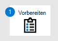
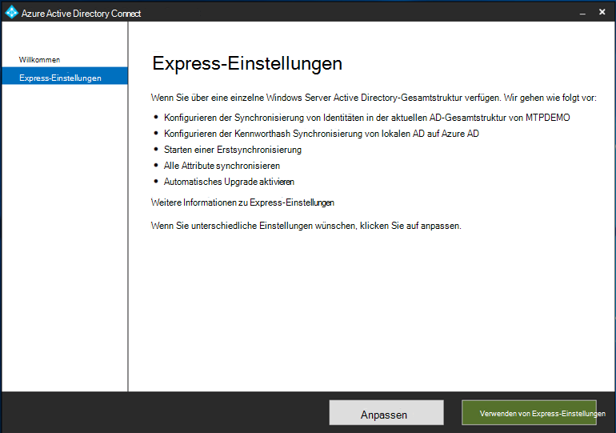

# Vorbereiten Ihrer Microsoft 365 Defender-Testumgebung oder Pilotumgebung

[!INCLUDE [Microsoft 365 Defender rebranding](../includes/microsoft-defender.md)]

**Gilt für:**
- Microsoft 365 Defender

Das Erstellen einer Microsoft 365 Defender-Testumgebung oder Pilotumgebung und deren Bereitstellung ist ein drei phasenweiser Prozess:

| Phase 1: Vorbereiten | [Phase 2: Einrichten](setup-m365deval.md) | [Phase 3: Onboarding](config-m365d-eval.md) |  [Zurück zum Testspielbuch](m365d-pilot.md) |
|--|--|--|--|
|*Sie sind hier!* | || |

Sie sind derzeit in der Vorbereitungsphase.

Die Vorbereitung ist der Schlüssel zu jeder erfolgreichen Bereitstellung. Dieser Abschnitt führt Sie durch das, was Sie bei der Vorbereitung der Erstellung einer Testumgebung oder Pilotumgebung für Ihre Microsoft 365 Defender-Bereitstellung berücksichtigen müssen.

## Voraussetzungen
Erfahren Sie mehr über die Lizenzierungs-, Hardware- und Softwareanforderungen sowie andere Konfigurationseinstellungen für die Bereitstellung und Verwendung von Microsoft 365 Defender. Siehe die Mindestanforderungen für [Microsoft 365 Defender](https://docs.microsoft.com/microsoft-365/security/defender/prerequisites), [Microsoft Defender for Endpoint](https://docs.microsoft.com/windows/security/threat-protection/microsoft-defender-atp/minimum-requirements), Microsoft Defender für Office [365](https://docs.microsoft.com/office365/servicedescriptions/office-365-advanced-threat-protection-service-description), [Microsoft Defender for Identity](https://docs.microsoft.com/azure-advanced-threat-protection/atp-prerequisites), Microsoft Cloud App [Security](https://docs.microsoft.com/azure-advanced-threat-protection/atp-prerequisites).

## Interessengruppen und Abmelden
Identifizieren Sie alle Interessengruppen, die an dem Projekt beteiligt sind und die möglicherweise abmelden, überprüfen oder auf dem Laufenden bleiben müssen, unabhängig davon, ob es sich um eine Evaluierung oder das Ausführen eines Pilotprojekts handelt.

>[!NOTE]
>Möglicherweise verfügen nicht alle Organisationen über die Fälligkeit der Sicherheitsorganisation, um über solche Rollen zu verfügen. Wenden Sie sich in diesem Fall an Ihr Führungsteam zur Überprüfung und Genehmigung von Kontorabilitäten.

Fügen Sie der tabelle unten aufgeführten Projektbeteiligten entsprechend Ihrer Organisation hinzu.

-   SO = Abmelden für dieses Projekt

-   R = Überprüfen dieses Projekts und Bereitstellen von Eingaben

-   I = Informiert über dieses Projekt

| Name                 | Rolle                                                                                                                                                                                                          | Aktion |
|----------------------|---------------------------------------------------------------------------------------------------------------------------------------------------------------------------------------------------------------|--------|
| Geben Sie Namen und E-Mail ein. | **Chief Information Security Officer (CISO)** Ein Leitender Vertreter, der innerhalb der Organisation als Sponsor für die *neue Technologiebereitstellung fungiert.*                                                  | Also     |
| Geben Sie Namen und E-Mail ein. | **Leiter des Cyber Defense Operations Center (CDOC)** Ein Vertreter des CDOC-Teams, der die Ausrichtung dieser Änderung an den Prozessen im Sicherheitsteam der Kunden *definiert.*       | Also     |
| Geben Sie Namen und E-Mail ein. | **Security Architect** Ein Vertreter des Sicherheitsteams, der für die Definition der Ausrichtung dieser Änderung an der zentralen Sicherheitsarchitektur *in der Organisation zuständig ist.*                         | R      |
| Geben Sie Namen und E-Mail ein. | **Workplace Architect** Ein Vertreter des IT-Teams, der für die Definition der Ausrichtung dieser Änderung an die zentrale Arbeitsplatzarchitektur *in der Organisation zuständig ist.*                             | R      |
| Geben Sie Namen und E-Mail ein. | **Security Analyst** Ein Vertreter des CDOC-Teams, der Feedback zu den Erkennungsfunktionen, der Benutzererfahrung und der allgemeinen Nützlichkeit dieser Änderung aus Sicht des *Sicherheitsbetriebs geben kann.* | I      |

## Vorbereiten Ihres Azure Active Directory
Überspringen Sie diesen Schritt, wenn Sie die Synchronisierung zwischen Active Directory und Azure Active Directory bereits lokal aktiviert haben. Überprüfen Sie die vorhandene Dokumentation zu bewährten Methoden aus Azure Active Directory. Die folgenden Schritte sind für die Auswertung oder Ausführung eines Microsoft 365 Defender-Pilotprojekts optimiert.

1. Wechseln Sie zum [Azure Active Directory-Portal](https://portal.azure.com/#blade/Microsoft_AAD_IAM/ActiveDirectoryMenuBlade) > **Azure AD Connect**. 
   

2. Klicken **Sie auf Herunterladen** von Microsoft Azure Active Directory **Connect,** und übertragen Sie es an Ihren Domänencontroller.
  

3. Folgen Sie auf dem Domänencontroller dem Azure Active Directory Connect-Assistenten. Lesen Sie die Lizenzbedingungen und den Datenschutzhinweise, und aktivieren Sie das Kontrollkästchen, wenn Sie zustimmen. Klicken Sie auf **Weiter**.
  

4. Navigieren Sie zu **Express-Einstellungen**.
  

5. Geben Sie Ihre globalen Administratoranmeldeinformationen ein. Klicken Sie auf **Weiter**.
  

6. Geben Sie Ihre Active Directory Domain Services-Unternehmensadministratoranmeldeinformationen ein. Klicken Sie auf **Weiter**.
  

7. Klicken **Sie auf Installieren,** um die Konfiguration zu bestätigen.
  

8. Herzlichen Glückwunsch, Sie haben Azure Active Directory Connect erfolgreich konfiguriert.
  

Sie können nun [Benutzer und Gruppen zu Active Directory hinzufügen](/azure-advanced-threat-protection/atp-playbook-setup-lab#bkmk_hydrate) und eine [SAM-R-Richtlinie konfigurieren.](/azure-advanced-threat-protection/atp-playbook-setup-lab#configure-sam-r-capabilities-from-contosodc)  

## Konfigurationsreihenfolge
In der folgenden Tabelle ist die Reihenfolge aufgeführt, die Microsoft zum Konfigurieren der Microsoft 365 Defender-Komponenten für Ihre Testumgebungs- oder Pilotumgebungsbereitstellung empfiehlt.

| Komponente                               | Beschreibung                                                                                                                                                                                                                                                                                                                                                                                                                                                                                                                                                                                                                                                                                              | Rangfolge der Konfigurationsreihenfolge |
|-----------------------------------------|----------------------------------------------------------------------------------------------------------------------------------------------------------------------------------------------------------------------------------------------------------------------------------------------------------------------------------------------------------------------------------------------------------------------------------------------------------------------------------------------------------------------------------------------------------------------------------------------------------------------------------------------------------------------------------------------------------|---------------------|
|Microsoft Defender für Office 365|Microsoft Defender für Office 365 schützt Ihre Organisation vor bösartigen Bedrohungen durch E-Mail-Nachrichten, Links (URLs) und Tools für die Zusammenarbeit.   [Weitere Informationen.](/microsoft-365/security/defender-365-security/defender-for-office-365)                                                                                                                                                                                                                                             | 1                   |
|Microsoft Defender for Identity|Microsoft Defender for Identity verwendet Active Directory-Signale, um erweiterte Bedrohungen, gefährdete Identitäten und schädliche Insideraktionen zu identifizieren, zu erkennen und zu untersuchen, die auf Ihre Organisation gerichtet sind.   [Weitere Informationen](/azure-advanced-threat-protection/).| 2 |
|Microsoft Cloud App Security| Microsoft Cloud App Security ist ein Cloud Access Security Broker (CASB), der auf mehreren Clouds arbeitet. Es bietet umfassende Sichtbarkeit, Kontrolle über Den Datenverkehr und ausgefeilte Analysen, um Cyberangriffe in allen Clouddiensten zu identifizieren und zu bekämpfen.   [Weitere Informationen](/cloud-app-security/).                                                                                                                                                                                                                                                                                                                                                                       |3                   |
|Microsoft Defender für Endpunkt | Die Microsoft Defender für Endpunkt-Funktionen für die Endpunkterkennung und Beantwortung bieten erweiterte Angriffserkennungen, die nahezu in Echtzeit umgesetzt werden können. Sicherheitsanalysten können Benachrichtigungen effektiv priorisieren, Einblick in den gesamten Umfang einer Verletzung erhalten und Aktionen ergreifen, um Bedrohungen zu beheben.   [Weitere Informationen.](/windows/security/threat-protection/microsoft-defender-atp/microsoft-defender-advanced-threat-protection)                                     |4                    |                                                                                                                                                                                                                                    

## Nächster Schritt
|  [Phase 2: Setup](setup-m365deval.md) | Einrichten Ihrer Microsoft 365 Defender-Testumgebung oder Pilotumgebung
|:-------|:-----|
