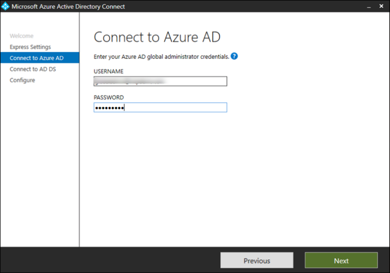

# Vorbereiten ihrer Microsoft 365 Defender-Testumgebung oder Pilotumgebung

[!INCLUDE [Microsoft 365 Defender rebranding](../includes/microsoft-defender.md)]

**Gilt für:**
- Microsoft 365 Defender

Das Erstellen einer Microsoft 365 Defender-Testumgebung oder -Pilotumgebung und deren Bereitstellung erfolgt in drei Phasen:

| Phase 1: Vorbereiten | [Phase 2: Einrichten](setup-m365deval.md) | [Phase 3: Onboarding](config-m365d-eval.md) |  [Zurück zum Pilot-Playbook](m365d-pilot.md) |
|--|--|--|--|
|*Sie sind hier!* | || |

Sie befinden sich derzeit in der Vorbereitungsphase.

Die Vorbereitung ist der Schlüssel für eine erfolgreiche Bereitstellung. Dieser Abschnitt führt Sie durch das, was Sie bei der Vorbereitung auf die Erstellung einer Testumgebung oder Pilotumgebung für Ihre Microsoft 365 Defender-Bereitstellung berücksichtigen müssen.

## Voraussetzungen
Erfahren Sie mehr über die Lizenzierungs-, Hardware- und Softwareanforderungen sowie andere Konfigurationseinstellungen für die Bereitstellung und Verwendung von Microsoft 365 Defender. Lesen Sie die Mindestanforderungen für [Microsoft 365 Defender](/microsoft-365/security/defender/prerequisites), Microsoft Defender [für Endpunkt](/windows/security/threat-protection/microsoft-defender-atp/minimum-requirements), Microsoft Defender für [Office 365](/office365/servicedescriptions/office-365-advanced-threat-protection-service-description), Microsoft Defender [for Identity](/azure-advanced-threat-protection/atp-prerequisites), [Microsoft Cloud App Security](/azure-advanced-threat-protection/atp-prerequisites).

## Projektbeteiligten und Abmeldung
Identifizieren Sie alle Projektbeteiligten, die am Projekt beteiligt sind und die sich möglicherweise abmelden, überprüfen oder auf dem Laufenden bleiben müssen, sei es für die Evaluierung oder die Ausführung eines Pilotprojekts.

>[!NOTE]
>Möglicherweise verfügen nicht alle Organisationen über die Fälligkeit der Sicherheitsorganisation, solche Rollen zu haben. Wenden Sie sich in diesem Fall an Ihr Führungsteam, um Überprüfungs- und Genehmigungskonten zu besprechen.

Fügen Sie in der tabelle unten aufgeführte Projektbeteiligten nach Bedarf für Ihre Organisation hinzu.

-   SO = Anmeldung bei diesem Projekt

-   R = Überprüfen Sie dieses Projekt, und geben Sie Eingaben ein.

-   I = Über dieses Projekt informiert

| Name                 | Rolle                                                                                                                                                                                                          | Aktion |
|----------------------|---------------------------------------------------------------------------------------------------------------------------------------------------------------------------------------------------------------|--------|
| Geben Sie Namen und E-Mail ein. | **Chief Information Security Officer (CISO)** *Ein leitender Vertreter, der innerhalb der Organisation als Sponsor für die neue Technologiebereitstellung fungiert.*                                                  | Also     |
| Geben Sie Namen und E-Mail ein. | **Leiter des Cyber Defense Operations Centers (CDOC)** *Ein Vertreter des CDOC-Teams, der definiert, wie diese Änderung an die Prozesse im Sicherheitsteam des Kunden angepasst wird.*       | Also     |
| Geben Sie Namen und E-Mail ein. | **Sicherheitsarchitekt** *Ein Vertreter des Sicherheitsteams, der definiert, wie diese Änderung an die kernbezogene Sicherheitsarchitektur in der Organisation angepasst wird.*                         | R      |
| Geben Sie Namen und E-Mail ein. | **Workplace Architect** *Ein Vertreter des IT-Teams, der definiert, wie diese Änderung an die zentrale Arbeitsplatzarchitektur in der Organisation angepasst wird.*                             | R      |
| Geben Sie Namen und E-Mail ein. | **Sicherheitsanalyst** *Ein Vertreter des CDOC-Teams, der Feedback zu den Erkennungsfunktionen, der Benutzererfahrung und der allgemeinen Nützlichkeit dieser Änderung aus Sicht des Sicherheitsbetriebs geben kann.* | I      |

## Vorbereiten der Azure Active Directory
Überspringen Sie diesen Schritt, wenn Sie die Synchronisierung zwischen Active Directory und Azure Active Directory lokal bereits aktiviert haben. Überprüfen Sie die vorhandene Dokumentation zu bewährten Methoden aus Azure Active Directory. Die folgenden Schritte sind optimiert, um ein Pilotprojekt Microsoft 365 Defender-Projekts auszuwerten oder auszuführen.

1. Wechseln Sie zum [Azure Active Directory-Portal](https://portal.azure.com/#blade/Microsoft_AAD_IAM/ActiveDirectoryMenuBlade) > **Azure AD-Verbinden.** 
   

2. Klicken Sie auf **"Von Microsoft Azure Active Directory Verbinden** **herunterladen",** und übertragen Sie sie an Ihren Domänencontroller.
  

3. Folgen Sie auf dem Domänencontroller dem Assistenten Azure Active Directory Verbinden. Lesen Sie die Lizenzbedingungen und den Datenschutzhinweis, und aktivieren Sie das Kontrollkästchen, wenn Sie damit einverstanden sind. Klicken Sie auf **Weiter**.
  

4. Navigieren Sie zu **Express Einstellungen**.
  

5. Geben Sie Ihre globalen Administratoranmeldeinformationen ein. Klicken Sie auf **Weiter**.
  

6. Geben Sie Ihre Anmeldeinformationen für den Active Directory Domain Services-Unternehmensadministrator ein. Klicken Sie auf **Weiter**.
  

7. Klicken Sie auf **"Installieren",** um die Konfiguration zu bestätigen.
  

8. Herzlichen Glückwunsch, Sie haben Azure Active Directory Verbinden erfolgreich konfiguriert.
  

Sie können nun [Benutzer und Gruppen zu Active Directory hinzufügen](/azure-advanced-threat-protection/atp-playbook-setup-lab#bkmk_hydrate) und eine [SAM-R-Richtlinie konfigurieren.](/azure-advanced-threat-protection/atp-playbook-setup-lab#configure-sam-r-capabilities-from-contosodc)  

## Konfigurationsreihenfolge
In der folgenden Tabelle ist die Reihenfolge aufgeführt, die Microsoft für die Konfiguration der Microsoft 365 Defender-Komponenten für die Bereitstellung Ihrer Testumgebung oder Pilotumgebung empfiehlt.

| Komponente                               | Beschreibung                                                                                                                                                                                                                                                                                                                                                                                                                                                                                                                                                                                                                                                                                              | Rang der Konfigurationsreihenfolge |
|-----------------------------------------|----------------------------------------------------------------------------------------------------------------------------------------------------------------------------------------------------------------------------------------------------------------------------------------------------------------------------------------------------------------------------------------------------------------------------------------------------------------------------------------------------------------------------------------------------------------------------------------------------------------------------------------------------------------------------------------------------------|---------------------|
|Microsoft Defender für Office 365|Microsoft Defender für Office 365 schützt Ihre Organisation vor bösartigen Bedrohungen durch E-Mail-Nachrichten, Links (URLs) und Tools für die Zusammenarbeit.   [Weitere Informationen.](/microsoft-365/security/office-365-security/defender-for-office-365)                                                                                                                                                                                                                                             | 1                   |
|Microsoft Defender for Identity|Microsoft Defender for Identity verwendet Active Directory-Signale, um erweiterte Bedrohungen, kompromittierte Identitäten und böswillige Insideraktionen gegen Ihre Organisation zu identifizieren, zu erkennen und zu untersuchen.   [Weitere Informationen](/azure-advanced-threat-protection/).| 2 |
|Microsoft Cloud App Security| Microsoft Cloud App Security ist ein Cloud Access Security Broker (CASB), der in mehreren Clouds ausgeführt wird. Es bietet umfassende Sichtbarkeit, Kontrolle über datenbasierte Reisen und komplexe Analysen, um Cyberbedrohungen in allen Ihren Clouddiensten zu erkennen und zu bekämpfen.   [Weitere Informationen](/cloud-app-security/).                                                                                                                                                                                                                                                                                                                                                                       |3                   |
|Microsoft Defender für Endpunkt | Die Microsoft Defender für Endpunkt-Funktionen für die Endpunkterkennung und Beantwortung bieten erweiterte Angriffserkennungen, die nahezu in Echtzeit umgesetzt werden können. Sicherheitsanalysten können Benachrichtigungen effektiv priorisieren, Einblick in den gesamten Umfang einer Verletzung erhalten und Aktionen ergreifen, um Bedrohungen zu beheben.   [Weitere Informationen.](/windows/security/threat-protection/microsoft-defender-atp/microsoft-defender-advanced-threat-protection)                                     |4                    |                                                                                                                                                                                                                                    

## Nächster Schritt
|  [Phase 2: Setup](setup-m365deval.md) | Einrichten Ihrer Microsoft 365 Defender-Testumgebung oder Pilotumgebung
|:-------|:-----|
