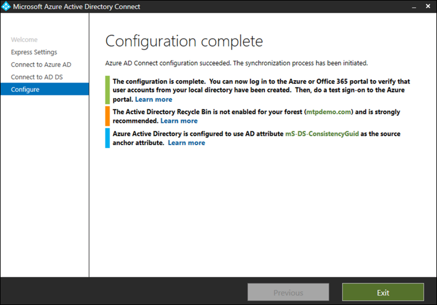

# Vorbereiten ihrer Microsoft 365 Defender-Testumgebung oder PilotumgebungPrepare your Microsoft 365 Defender trial lab or pilot environment

[!INCLUDE [Microsoft 365 Defender rebranding](../includes/microsoft-defender.md)]

**Gilt für:****Applies to:**
- Microsoft 365 DefenderMicrosoft 365 Defender

Das Erstellen einer Microsoft 365 Defender-Testumgebung oder -Pilotumgebung und deren Bereitstellung erfolgt in drei Phasen:Creating a Microsoft 365 Defender trial lab or pilot environment and deploying it is a three-phase process:

| Phase 1: VorbereitenPhase 1: Prepare | [Phase 2: EinrichtenPhase 2: Set up](setup-m365deval.md) | [Phase 3: OnboardingPhase 3: Onboard](config-m365d-eval.md) |  [Zurück zum Pilot-PlaybookBack to pilot playbook](m365d-pilot.md) |
|--|--|--|--|
|*Sie sind hier!**You are here!* | || |

Sie befinden sich derzeit in der Vorbereitungsphase.You're currently in the preparation phase.

Die Vorbereitung ist der Schlüssel für eine erfolgreiche Bereitstellung.Preparation is key to any successful deployment. Dieser Abschnitt führt Sie durch das, was Sie bei der Vorbereitung auf die Erstellung einer Testumgebung oder Pilotumgebung für Ihre Microsoft 365 Defender-Bereitstellung berücksichtigen müssen.This section will guide you through what you need to consider as you prepare to create a trial lab or pilot environment for your Microsoft 365 Defender deployment.

## VoraussetzungenPrerequisites
Erfahren Sie mehr über die Lizenzierungs-, Hardware- und Softwareanforderungen sowie andere Konfigurationseinstellungen für die Bereitstellung und Verwendung von Microsoft 365 Defender.Learn about the licensing, hardware and software requirements, and other configuration settings to provision and use Microsoft 365 Defender. Lesen Sie die Mindestanforderungen für [Microsoft 365 Defender](/microsoft-365/security/defender/prerequisites), Microsoft Defender [für Endpunkt](/windows/security/threat-protection/microsoft-defender-atp/minimum-requirements), Microsoft Defender für [Office 365](/office365/servicedescriptions/office-365-advanced-threat-protection-service-description), Microsoft Defender [for Identity](/azure-advanced-threat-protection/atp-prerequisites), [Microsoft Cloud App Security](/azure-advanced-threat-protection/atp-prerequisites).See the minimum requirements for [Microsoft 365 Defender](/microsoft-365/security/defender/prerequisites), [Microsoft Defender for Endpoint](/windows/security/threat-protection/microsoft-defender-atp/minimum-requirements), [Microsoft Defender for Office 365](/office365/servicedescriptions/office-365-advanced-threat-protection-service-description), [Microsoft Defender for Identity](/azure-advanced-threat-protection/atp-prerequisites), [Microsoft Cloud App Security](/azure-advanced-threat-protection/atp-prerequisites).

## Projektbeteiligten und AbmeldungStakeholders and sign-off
Identifizieren Sie alle Projektbeteiligten, die am Projekt beteiligt sind und die sich möglicherweise abmelden, überprüfen oder auf dem Laufenden bleiben müssen, sei es für die Evaluierung oder die Ausführung eines Pilotprojekts.Identify all the stakeholders that are involved in the project and who may need to sign-off, review, or stay informed, whether for evaluation or running a pilot project.

>[!NOTE]
>Möglicherweise verfügen nicht alle Organisationen über die Fälligkeit der Sicherheitsorganisation, solche Rollen zu haben.Not all organizations might have the security organization maturity to have such roles. Wenden Sie sich in diesem Fall an Ihr Führungsteam, um Überprüfungs- und Genehmigungskonten zu besprechen.In such case, consult with your leadership team on review and approval accountabilities.

Fügen Sie in der tabelle unten aufgeführte Projektbeteiligten nach Bedarf für Ihre Organisation hinzu.Add stakeholders to the table below as appropriate for your organization.

-   SO = Anmeldung bei diesem ProjektSO = Sign-off on this project

-   R = Überprüfen Sie dieses Projekt, und geben Sie Eingaben ein.R = Review this project and provide input

-   I = Über dieses Projekt informiertI = Informed of this project

| NameName                 | RolleRole                                                                                                                                                                                                          | AktionAction |
|----------------------|---------------------------------------------------------------------------------------------------------------------------------------------------------------------------------------------------------------|--------|
| Geben Sie Namen und E-Mail ein.Enter name and email | **Chief Information Security Officer (CISO)** *Ein leitender Vertreter, der innerhalb der Organisation als Sponsor für die neue Technologiebereitstellung fungiert.***Chief Information Security Officer (CISO)** *An executive representative who serves as sponsor inside the organization for the new technology deployment.*                                                  | AlsoSO     |
| Geben Sie Namen und E-Mail ein.Enter name and email | **Leiter des Cyber Defense Operations Centers (CDOC)** *Ein Vertreter des CDOC-Teams, der definiert, wie diese Änderung an die Prozesse im Sicherheitsteam des Kunden angepasst wird.***Head of Cyber Defense Operations Center (CDOC)** *A representative from the CDOC team in charge of defining how this change is aligned with the processes in the customers security operations team.*       | AlsoSO     |
| Geben Sie Namen und E-Mail ein.Enter name and email | **Sicherheitsarchitekt** *Ein Vertreter des Sicherheitsteams, der definiert, wie diese Änderung an die kernbezogene Sicherheitsarchitektur in der Organisation angepasst wird.***Security Architect** *A representative from the Security team in charge of defining how this change is aligned with the core Security architecture in the organization.*                         | RR      |
| Geben Sie Namen und E-Mail ein.Enter name and email | **Workplace Architect** *Ein Vertreter des IT-Teams, der definiert, wie diese Änderung an die zentrale Arbeitsplatzarchitektur in der Organisation angepasst wird.***Workplace Architect** *A representative from the IT team in charge of defining how this change is aligned with the core workplace architecture in the organization.*                             | RR      |
| Geben Sie Namen und E-Mail ein.Enter name and email | **Sicherheitsanalyst** *Ein Vertreter des CDOC-Teams, der Feedback zu den Erkennungsfunktionen, der Benutzererfahrung und der allgemeinen Nützlichkeit dieser Änderung aus Sicht des Sicherheitsbetriebs geben kann.***Security Analyst** *A representative from the CDOC team who can provide feedback on the detection capabilities, user experience, and overall usefulness of this change from a security operations perspective.* | II      |

## Vorbereiten der Azure Active DirectoryPrepare your Azure Active Directory
Überspringen Sie diesen Schritt, wenn Sie die Synchronisierung zwischen Active Directory und Azure Active Directory lokal bereits aktiviert haben.Skip this step if you have already enabled synchronization between Active Directory and Azure Active Directory on premises. Überprüfen Sie die vorhandene Dokumentation zu bewährten Methoden aus Azure Active Directory.Review existing best practices documentation from Azure Active Directory. Die folgenden Schritte sind optimiert, um ein Pilotprojekt Microsoft 365 Defender-Projekts auszuwerten oder auszuführen.The following steps are optimized to evaluate or run a pilot Microsoft 365 Defender project.

1. Wechseln Sie zum [Azure Active Directory-Portal](https://portal.azure.com/#blade/Microsoft_AAD_IAM/ActiveDirectoryMenuBlade) > **Azure AD-Verbinden.**Go to the [Azure Active Directory](https://portal.azure.com/#blade/Microsoft_AAD_IAM/ActiveDirectoryMenuBlade) portal > **Azure AD Connect**. 
   

2. Klicken Sie auf **"Von Microsoft Azure Active Directory Verbinden** **herunterladen",** und übertragen Sie sie an Ihren Domänencontroller.Click **Download** from **Microsoft Azure Active Directory Connect** and transfer it to your Domain Controller.
  

3. Folgen Sie auf dem Domänencontroller dem Assistenten Azure Active Directory Verbinden.On the domain controller, follow the Azure Active Directory Connect wizard. Lesen Sie die Lizenzbedingungen und den Datenschutzhinweis, und aktivieren Sie das Kontrollkästchen, wenn Sie damit einverstanden sind.Read the license terms and privacy notice and select the checkbox if you agree. Klicken Sie auf **Weiter**.Click **Continue**.
  

4. Navigieren Sie zu **Express Einstellungen**.Navigate to **Express Settings**.
  

5. Geben Sie Ihre globalen Administratoranmeldeinformationen ein.Enter your global administrator credentials. Klicken Sie auf **Weiter**.Click **Next**.
  

6. Geben Sie Ihre Anmeldeinformationen für den Active Directory Domain Services-Unternehmensadministrator ein.Enter your Active Directory Domain Services enterprise administrator credentials. Klicken Sie auf **Weiter**.Click **Next**.
  

7. Klicken Sie auf **"Installieren",** um die Konfiguration zu bestätigen.Click **Install** to confirm the configuration.
  

8. Herzlichen Glückwunsch, Sie haben Azure Active Directory Verbinden erfolgreich konfiguriert.Congratulations, you have successfully configured Azure Active Directory Connect.
  

Sie können nun [Benutzer und Gruppen zu Active Directory hinzufügen](/azure-advanced-threat-protection/atp-playbook-setup-lab#bkmk_hydrate) und eine [SAM-R-Richtlinie konfigurieren.](/azure-advanced-threat-protection/atp-playbook-setup-lab#configure-sam-r-capabilities-from-contosodc)You can now [add users and groups to Active Directory](/azure-advanced-threat-protection/atp-playbook-setup-lab#bkmk_hydrate) and [configure a SAM-R policy](/azure-advanced-threat-protection/atp-playbook-setup-lab#configure-sam-r-capabilities-from-contosodc).  

## KonfigurationsreihenfolgeConfiguration order
In der folgenden Tabelle ist die Reihenfolge aufgeführt, die Microsoft für die Konfiguration der Microsoft 365 Defender-Komponenten für die Bereitstellung Ihrer Testumgebung oder Pilotumgebung empfiehlt.The following table indicates the order Microsoft recommends for configuring the Microsoft 365 Defender components for your trial lab or pilot environment deployment.

| KomponenteComponent                               | BeschreibungDescription                                                                                                                                                                                                                                                                                                                                                                                                                                                                                                                                                                                                                                                                                              | Rang der KonfigurationsreihenfolgeConfiguration order rank |
|-----------------------------------------|----------------------------------------------------------------------------------------------------------------------------------------------------------------------------------------------------------------------------------------------------------------------------------------------------------------------------------------------------------------------------------------------------------------------------------------------------------------------------------------------------------------------------------------------------------------------------------------------------------------------------------------------------------------------------------------------------------|---------------------|
|Microsoft Defender für Office 365Microsoft Defender for Office 365|Microsoft Defender für Office 365 schützt Ihre Organisation vor bösartigen Bedrohungen durch E-Mail-Nachrichten, Links (URLs) und Tools für die Zusammenarbeit.Microsoft Defender for Office 365 safeguards your organization against malicious threats posed by email messages, links (URLs), and collaboration tools.   [Weitere Informationen.Learn more.](/microsoft-365/security/office-365-security/defender-for-office-365)                                                                                                                                                                                                                                             | 11                   |
|Microsoft Defender for IdentityMicrosoft Defender for Identity|Microsoft Defender for Identity verwendet Active Directory-Signale, um erweiterte Bedrohungen, kompromittierte Identitäten und böswillige Insideraktionen gegen Ihre Organisation zu identifizieren, zu erkennen und zu untersuchen.Microsoft Defender for Identity uses Active Directory signals to identify, detect, and investigate advanced threats, compromised identities, and malicious insider actions directed at your organization.   [Weitere Informationen](/azure-advanced-threat-protection/).[Learn more](/azure-advanced-threat-protection/).| 22 |
|Microsoft Cloud App SecurityMicrosoft Cloud App Security| Microsoft Cloud App Security ist ein Cloud Access Security Broker (CASB), der in mehreren Clouds ausgeführt wird.Microsoft Cloud App Security is a Cloud Access Security Broker (CASB) that operates on multiple clouds. Es bietet umfassende Sichtbarkeit, Kontrolle über datenbasierte Reisen und komplexe Analysen, um Cyberbedrohungen in allen Ihren Clouddiensten zu erkennen und zu bekämpfen.It provides rich visibility, control over data travel, and sophisticated analytics to identify and combat cyberthreats across all your cloud services.   [Weitere Informationen](/cloud-app-security/).[Learn more](/cloud-app-security/).                                                                                                                                                                                                                                                                                                                                                                       |33                   |
|Microsoft Defender für EndpunktMicrosoft Defender for Endpoint | Die Microsoft Defender für Endpunkt-Funktionen für die Endpunkterkennung und Beantwortung bieten erweiterte Angriffserkennungen, die nahezu in Echtzeit umgesetzt werden können.Microsoft Defender for Endpoint endpoint detection and response capabilities provide advanced attack detections that are near real-time and actionable. Sicherheitsanalysten können Benachrichtigungen effektiv priorisieren, Einblick in den gesamten Umfang einer Verletzung erhalten und Aktionen ergreifen, um Bedrohungen zu beheben.Security analysts can prioritize alerts effectively, gain visibility into the full scope of a breach, and take response actions to remediate threats.   [Weitere Informationen.Learn more.](/windows/security/threat-protection/microsoft-defender-atp/microsoft-defender-advanced-threat-protection)                                     |4 4                   |                                                                                                                                                                                                                                    

## Nächster SchrittNext step
|  [Phase 2: SetupPhase 2: Setup](setup-m365deval.md) | Einrichten Ihrer Microsoft 365 Defender-Testumgebung oder PilotumgebungSet up your Microsoft 365 Defender trial lab or pilot environment
|:-------|:-----|
