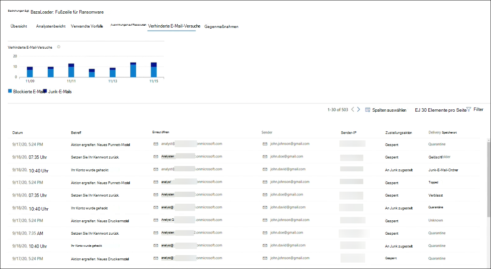
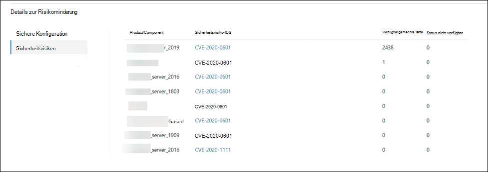

# Nachverfolgen und Reagieren auf neue Bedrohungen mit Bedrohungsanalysen 

[!INCLUDE [Microsoft 365 Defender rebranding](../includes/microsoft-defender.md)]

**Gilt für:**
- Microsoft 365 Defender

> Sie möchten Microsoft 365 Defender ausprobieren? Sie können [in einer Laborumgebung auswerten](m365d-evaluation.md?ocid=cx-docs-MTPtriallab) oder [ein Pilotprojekt in der Produktionsumgebung ausführen](m365d-pilot.md?ocid=cx-evalpilot).
>

[!INCLUDE [Prerelease](../includes/prerelease.md)]

Die Bedrohungsanalyse ist unsere produktin-produktintelligente Lösung von experten Microsoft-Sicherheitsexperten, die Sicherheitsteams dabei unterstützen sollen, so effizient wie möglich zu sein, während sie neuen Bedrohungen ausgesetzt sind, einschließlich:

- Aktive Bedrohungsakteure und ihre Kampagnen
- Beliebte und neue Angriffstechniken
- Kritische Sicherheitsrisiken
- Allgemeine Angriffsoberflächen
- Verbreitete Schadsoftware

Sehen Sie sich dieses kurze Video an, um mehr darüber zu erfahren, wie Sie mithilfe von Bedrohungsanalysen die neuesten Bedrohungen nachverfolgen und beenden können.

>[!VIDEO https://www.microsoft.com/en-us/videoplayer/embed/RWwJfU]

Sie können auf bedrohungsanalyse entweder von der oberen linken Seite der Navigationsleiste des Microsoft 365-Sicherheitsportals oder von einer dedizierten Dashboardkarte zugreifen, auf der die obersten Bedrohungen in Ihrer Organisation angezeigt werden. Das Erhalten von Einblicken in aktive oder laufende Kampagnen und wissen, was mithilfe von Bedrohungsanalysen zu tun ist, kann Ihr Sicherheitsteam mit fundierten Entscheidungen ausstatten. 

_Zugriff auf Bedrohungsanalysen_

Da anspruchsvollere Gegner und neue Bedrohungen häufig und weit verbreitet entstehen, ist es wichtig, schnell in der Lage zu sein:

- Identifizieren und Reagieren auf neue Bedrohungen 
- Erfahren Sie, ob Sie derzeit angegriffen werden
- Bewerten der Auswirkungen der Bedrohung auf Ihre Ressourcen
- Überprüfen Der Ausfallsicherheit gegenüber oder der Gefährdung der Bedrohungen
- Identifizieren der Maßnahmen zur Risikominderung, Wiederherstellung oder Verhinderung, die Sie zum Beenden oder Eindäugen der Bedrohungen ergreifen können

Jeder Bericht enthält eine Analyse einer nachverfolgten Bedrohung und umfassende Anleitungen zum Schutz vor dieser Bedrohung. Es enthält auch Daten aus Ihrem Netzwerk, die angeben, ob die Bedrohung aktiv ist und ob Sie über entsprechende Schutzmaßnahmen verfügen.

## Anzeigen des Dashboards für die Bedrohungsanalyse

Das Dashboard für die[Bedrohungsanalyse](https://security.microsoft.com/threatanalytics3)( security.microsoft.com/threatanalytics3 ) hebt die Berichte hervor, die für Ihre Organisation am relevantesten sind. Es fasst die Bedrohungen in den folgenden Abschnitten zusammen:

- **Neueste Bedrohungen**– listet die zuletzt veröffentlichten oder aktualisierten Bedrohungsberichte sowie die Anzahl der aktiven und aufgelösten Warnungen auf.
- **Bedrohungen mit hoher** Auswirkung – listet die Bedrohungen auf, die die größten Auswirkungen auf Ihre Organisation haben. In diesem Abschnitt werden zuerst Bedrohungen mit der höchsten Anzahl aktiver und aufgelöster Warnungen aufgeführt.
- **Bedrohungszusammenfassung**– bietet die Gesamtwirkung aller nachverfolgten Bedrohungen, indem die Anzahl der Bedrohungen mit aktiven und aufgelösten Warnungen angezeigt wird.

Wählen Sie eine Bedrohung aus dem Dashboard aus, um den Bericht für diese Bedrohung anzuzeigen.

_Dashboard für Die Bedrohungsanalyse. Sie können auch auf das Suchsymbol klicken, um in einem Schlüsselwort im Zusammenhang mit dem Bericht zur Bedrohungsanalyse zu klicken, den Sie lesen möchten._ 

## Anzeigen eines Berichts zur Bedrohungsanalyse

Jeder Bericht zur Bedrohungsanalyse enthält Informationen in mehreren Abschnitten: 

- [**Übersicht**](#overview-quickly-understand-the-threat-assess-its-impact-and-review-defenses) 
- [**Analystenbericht**](#analyst-report-get-expert-insight-from-microsoft-security-researchers)
- [**Verwandte Vorfälle**](#related-incidents-view-and-manage-related-incidents)
- [**Auswirkungen auf Ressourcen**](#impacted-assets-get-list-of-impacted-devices-and-mailboxes)
- [**Verhinderte E-Mail-Versuche**](#prevented-email-attempts-view-blocked-or-junked-threat-emails)
- [**Gegenmaßnahmen**](#mitigations-review-list-of-mitigations-and-the-status-of-your-devices)

### Übersicht: Schnelles Verständnis der Bedrohung, Bewerten der Auswirkungen und Überprüfen der Abwehr

Der **Abschnitt Übersicht** bietet eine Vorschau des detaillierten Analystenberichts. Außerdem enthält sie Diagramme, die die Auswirkungen der Bedrohung für Ihre Organisation und Ihre Gefährdung durch falsch konfigurierte und nicht gepatchte Geräte hervorheben.

_Übersichtsabschnitt eines Berichts zur Bedrohungsanalyse_

#### Bewerten der Auswirkungen auf Ihre Organisation
Jeder Bericht enthält Diagramme, die Informationen zu den organisatorischen Auswirkungen einer Bedrohung liefern sollen:
- **Verwandte Vorfälle –** bietet eine Übersicht über die Auswirkungen der nachverfolgten Bedrohung auf Ihre Organisation mit den folgenden Daten:
  - Anzahl der aktiven Warnungen und anzahl der aktiven Vorfälle, mit der sie verknüpft sind
  - Schweregrad aktiver Vorfälle
- **Warnungen im Laufe der** Zeit – zeigt die Anzahl der zugehörigen **aktiven** und **aufgelösten** Warnungen im Laufe der Zeit an. Die Anzahl der aufgelösten Warnungen gibt an, wie schnell Ihre Organisation auf Warnungen reagiert, die einer Bedrohung zugeordnet sind. Idealerweise sollte das Diagramm Warnungen anzeigen, die innerhalb weniger Tage aufgelöst wurden.
- **Betroffene Objekte**– zeigt die Anzahl unterschiedlicher Geräte und E-Mail-Konten (Postfächer), die derzeit mindestens eine aktive Warnung der nachverfolgten Bedrohung zugeordnet sind. Warnungen werden für Postfächer ausgelöst, die Bedrohungs-E-Mails erhalten haben. Überprüfen Sie sowohl Richtlinien auf Organisationsebene als auch auf Benutzerebene auf Außerkraftsetzungen, die die Zustellung von Bedrohungs-E-Mails verursachen.
- **Verhinderte E-Mail-Versuche**– zeigt die Anzahl der E-Mails aus den letzten sieben Tagen an, die entweder vor der Zustellung blockiert oder an den Junk-E-Mail-Ordner zugestellt wurden.

#### Überprüfen der Ausfallsicherheit und -haltung
Jeder Bericht enthält Diagramme, die einen Überblick darüber bieten, wie widerstandsfähig Ihre Organisation gegen eine bestimmte Bedrohung ist:
- **Sicherer Konfigurationsstatus**– zeigt die Anzahl der Geräte mit falsch konfigurierten Sicherheitseinstellungen an. Wenden Sie die empfohlenen Sicherheitseinstellungen an, um die Bedrohung zu mindern. Geräte gelten als **sicher,** wenn sie _alle_ nachverfolgten Einstellungen angewendet haben.
- **Status des Sicherheitsrisikopatchings**– zeigt die Anzahl anfälliger Geräte an. Wenden Sie Sicherheitsupdates oder Patches an, um von der Bedrohung ausgenutzte Sicherheitsrisiken zu schließen.

### Analystenbericht: Experten-Einblick von Microsoft-Sicherheitsforschern erhalten
Lesen Sie **im Abschnitt Analystenbericht** die detaillierten Experten-Schreibzugriffe durch. Die meisten Berichte enthalten detaillierte Beschreibungen von Angriffsketten, einschließlich Taktiken und Techniken, die dem MITRE ATT&CK-Framework zugeordnet sind, umfassende Empfehlungen und leistungsstarke Anleitungen zur [Bedrohungssuche.](advanced-hunting-overview.md)

[Weitere Informationen zum Analystenbericht](threat-analytics-analyst-reports.md)

### Verwandte Vorfälle: Anzeigen und Verwalten verwandter Vorfälle
Die **Registerkarte Verwandte Vorfälle** enthält die Liste aller Vorfälle im Zusammenhang mit der nachverfolgten Bedrohung. Sie können Vorfälle zuweisen oder Warnungen verwalten, die mit jedem Vorfall verknüpft sind. 

_Abschnitt "Verwandte Vorfälle" eines Berichts zur Bedrohungsanalyse_

### Auswirkungen auf Ressourcen: Liste betroffener Geräte und Postfächer erhalten
Eine Ressource wird als betroffen betrachtet, wenn sie von einer aktiven, nicht aufgelösten Warnung betroffen ist. Auf **der Registerkarte Auswirkungen auf Ressourcen** werden die folgenden Arten von betroffenen Ressourcen aufgeführt:
- **Betroffener Geräte**– Endpunkte, für die Microsoft Defender for Endpoint-Warnungen nicht aufgelöst wurden. Diese Warnungen werden in der Regel bei Denkanzeigen bekannter Bedrohungsindikatoren und -aktivitäten ausgelöst.
- **Auswirkungen auf Postfächer –** Postfächer, die E-Mail-Nachrichten empfangen haben, die Microsoft Defender für Office 365-Warnungen ausgelöst haben. Während die meisten Nachrichten, die Warnungen auslösen, in der Regel blockiert werden, können Richtlinien auf Benutzer- oder Organisationsebene Filter außer Kraft setzen.

_Abschnitt "Auswirkungen auf Ressourcen" eines Berichts zur Bedrohungsanalyse_

### Verhinderte E-Mail-Versuche: Anzeigen blockierter oder junked Threat-E-Mails
Microsoft Defender für Office 365 blockiert in der Regel E-Mails mit bekannten Bedrohungsindikatoren, einschließlich schädlicher Links oder Anlagen. In einigen Fällen senden proaktive Filtermechanismen, die auf verdächtige Inhalte überprüfen, stattdessen Bedrohungs-E-Mails an den Junk-E-Mail-Ordner. In beiden Fällen ist die Wahrscheinlichkeit reduziert, dass der Code für das Starten von Schadsoftware auf dem Gerät von Bedrohungen gestartet wird.

Auf **der Registerkarte Verhinderte** E-Mail-Versuche werden alle E-Mails aufgeführt, die entweder vor der Zustellung blockiert oder von Microsoft Defender für Office 365 an den Junk-E-Mail-Ordner gesendet wurden. 

_Abschnitt "Verhinderte E-Mail-Versuche" eines Berichts zur Bedrohungsanalyse_

### Gegenmaßnahmen: Überprüfen der Liste der Gegenmaßnahmen und des Status Ihrer Geräte
Überprüfen Sie **im Abschnitt** Gegenmaßnahmen die Liste der spezifischen Empfehlungen für Aktionen, die Ihnen helfen können, Ihre Ausfallsicherheit gegenüber der Bedrohung zu erhöhen. Die Liste der nachverfolgten Gegenmaßnahmen umfasst:

- **Sicherheitsupdates**– Bereitstellung von unterstützten Softwaresicherheitsupdates für Sicherheitsrisiken auf integrierten Geräten
- **Unterstützte Sicherheitskonfigurationen**
  - In der Cloud zugestellter Schutz  
  - Schutz potenziell unerwünschter Anwendungen (PUA)
  - Echtzeitschutz
 
Informationen zur Risikominderung in diesem Abschnitt enthalten Daten aus der Bedrohungs- und Sicherheitsrisikoverwaltung, die auch detaillierte Drilldowninformationen aus verschiedenen Links im Bericht enthält.

 

_Abschnitt "Risikominderungen" eines Berichts zur Bedrohungsanalyse_

## Zusätzliche Berichtsdetails und Einschränkungen
>[!NOTE]
>Im Rahmen der einheitlichen Sicherheitserfahrung ist die Bedrohungsanalyse jetzt nicht nur für Microsoft Defender for Endpoint, sondern auch für Microsoft Defender für Office E5-Lizenzinhaber verfügbar.
>Wenn Sie das Microsoft 365-Sicherheitsportal (Microsoft 365 Defender) nicht verwenden, können Sie die Berichtdetails (ohne die Microsoft Defender for Office-Daten) auch im Microsoft Defender Security Center-Portal (Microsoft Defender for Endpoint) anzeigen. 

Für den Zugriff auf den Bericht zur Bedrohungsanalyse benötigen Sie bestimmte Rollen und Berechtigungen. Weitere Informationen finden Sie unter Benutzerdefinierte Rollen in der rollenbasierten Zugriffssteuerung für [Microsoft 365 Defender.](custom-roles.md)
  - Zum Anzeigen von Warnungen, Vorfällen oder Daten betroffener Objekte benötigen Sie Berechtigungen für Microsoft Defender for Office- oder Microsoft Defender for Endpoint-Benachrichtigungsdaten oder beides.
  - Um verhinderte E-Mail-Versuche anzeigen zu können, benötigen Sie Berechtigungen für Microsoft Defender for Office-Nachschlagedaten. 
  - Zum Anzeigen von Gegenmaßnahmen benötigen Sie Berechtigungen für Daten zur Bedrohungs- und Sicherheitsrisikoverwaltung in Microsoft Defender for Endpoint.

Beachten Sie beim Blick auf die Daten zur Bedrohungsanalyse die folgenden Faktoren:
- Diagramme spiegeln nur nachverfolgte Gegenmaßnahmen wider. Überprüfen Sie die Berichtsübersicht auf zusätzliche Gegenmaßnahmen, die nicht in den Diagrammen angezeigt werden.
- Gegenmaßnahmen garantieren keine vollständige Ausfallsicherheit. Die bereitgestellten Gegenmaßnahmen spiegeln die bestmöglichen Maßnahmen wider, die zur Verbesserung der Ausfallsicherheit erforderlich sind.
- Geräte werden als "nicht verfügbar" gezählt, wenn sie keine Daten an den Dienst übermittelt haben.
- Antivirusbezogene Statistiken basieren auf Microsoft Defender Antivirus-Einstellungen. Geräte mit Antivirenlösungen von Drittanbietern können als "verfügbar" angezeigt werden.

## Verwandte Themen
- [Proaktives Aufsuchen von Bedrohungen mit erweiterter Suche](advanced-hunting-overview.md) 
- [Verstehen des Abschnitts "Analystenbericht"](threat-analytics-analyst-reports.md)
- [Bewerten und Beheben von Sicherheitsschwächen und -risiken](/windows/security/threat-protection/microsoft-defender-atp/next-gen-threat-and-vuln-mgt)