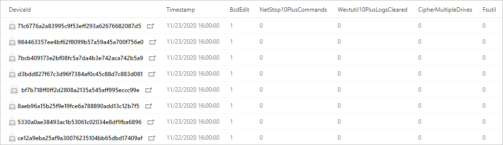

# <a name="hunt-for-ransomware"></a>Hunt für Ransomware

[!INCLUDE [Microsoft 365 Defender rebranding](../includes/microsoft-defender.md)]

**Gilt für:**
- Microsoft 365 Defender

Ransomware hat sich schnell von der einfachen Rohstoff-Schadsoftware für einzelne Computer Benutzer zu einer Unternehmens Bedrohung entwickelt, die Branchen und Regierungsinstitutionen stark beeinträchtigt. Während [Microsoft 365 Defender](microsoft-threat-protection.md) viele Funktionen bereitstellt, die Ransomware und zugehörige Intrusions Aktivitäten erkennen und blockieren, kann das durchführen proaktiver Überprüfungen auf Zeichen von Kompromissen dazu beitragen, dass Ihr Netzwerk geschützt bleibt.

> [Lesen Sie mehr über die von Menschen betriebene Ransomware](https://www.microsoft.com/security/blog/2020/03/05/human-operated-ransomware-attacks-a-preventable-disaster/)

Mit [Advanced Hunting](advanced-hunting-overview.md) in Microsoft 365 Defender können Sie Abfragen erstellen, die einzelne Artefakte im Zusammenhang mit der Ransomware-Aktivität finden. Sie können auch komplexere Abfragen ausführen, die nach Aktivitäts Zeichen suchen und diese Zeichen abwägen können, um Geräte zu finden, die sofortige Aufmerksamkeit erfordern.

## <a name="signs-of-ransomware-activity"></a>Zeichen der Ransomware-Aktivität
Microsoft-Sicherheitsforscher haben verschiedene häufige, aber subtile Artefakte in vielen Ransomware-Kampagnen beobachtet, die von anspruchsvollen Eindringlingen gestartet wurden. Diese Zeichen beinhalten hauptsächlich die Verwendung von System Tools, um die Verschlüsselung vorzubereiten, die Erkennung zu verhindern und forensische Beweise zu löschen.

| Ransomware-Aktivität | Allgemeine Tools | Intent |
|--|--|--|
| Beenden von Prozessen | _taskkill.exe_, _net stop_ | Stellen Sie sicher, dass Dateien, die für die Verschlüsselung vorgesehen sind, nicht von verschiedenen Anwendungen gesperrt werden. |
| Deaktivieren von Diensten | _sc.exe_ | -Sicherstellen, dass für die Verschlüsselung vorgesehene Dateien nicht von verschiedenen Anwendungen gesperrt werden.<br>-Verhindert, dass Sicherheitssoftware die Verschlüsselung und andere Ransomware-Aktivitäten stört.<br>-Beenden der Erstellung von wiederherstellbaren Kopien durch Sicherungssoftware.  |
| Löschen von Protokollen und Dateien | _cipher.exe_, _wevtutil_, _fsutil.exe_ | Entfernen Sie forensische Beweise. |
| Löschen von Schattenkopien  | _vsadmin.exe_ _wmic.exe_ | Entfernen von Laufwerks Schattenkopien, die zum Wiederherstellen verschlüsselter Dateien verwendet werden können. |
| Löschen und Beenden von Sicherungen | _wbadmin.exe_ | Löschen Sie vorhandene Sicherungen, und beenden Sie geplante Sicherungsaufgaben, wodurch die Wiederherstellung nach der Verschlüsselung verhindert wird. |
| Ändern von Start Einstellungen | _bcdedit.exe_ | Deaktivieren Sie Warnungen und automatische Reparaturen nach Startfehlern, die durch den Verschlüsselungsprozess verursacht werden können. |
| Deaktivieren von Wiederherstellungstools | _schtasks.exe_, _regedit.exe_ | Deaktivieren Sie die Systemwiederherstellung und andere Systemwiederherstellungsoptionen. |

## <a name="check-for-individual-signs-of-ransomware-activity"></a>Überprüfen auf einzelne Zeichen der Ransomware-Aktivität
Viele Aktivitäten, die das Ransomware-Verhalten darstellen, einschließlich der im vorherigen Abschnitt beschriebenen Aktivitäten, können gutartig sein. Wenn Sie die folgenden Abfragen zum Auffinden von Ransomware verwenden, führen Sie mehrere Abfragen aus, um zu überprüfen, ob dieselben Geräte verschiedene Zeichen möglicher Ransomware-Aktivitäten aufweisen.

### <a name="stopping-multiple-processes-using-_taskkillexe_"></a>Beenden mehrerer Prozesse mit _taskkill.exe_
Diese Abfrage prüft, ob versucht wird, mindestens 10 getrennte Prozesse mit dem _taskkill.exe_ -Dienstprogramm zu beenden. [Abfrage ausführen](https://security.microsoft.com/hunting?query=H4sIAAAAAAAEAI2RS2vCUBCFz7rgfwiuIkit3eumVSgtpYvuS9SLDTY2eLUvxN_eb8YHKlFkyNzJzDkn505aailRX7mmGlFlmhNBhUrOSGeuT3L0s6QqNaMagolEcMyCbApjx2e8TYhcH8Q1mB-emq50z_lF39gvBzo9-gEF-6Yhlyh9653ejCfRK6zCsaZfuJOu-x2jkqqN-0Yls-8-gp6dZ52OVuT6Sad1plulyN0KIkMt15_zt7zHDe8OBwv3btoJToa7Tnp0T8Ou9WzfT761gPOm3_FQ16Zxp2qcCdg33_rlyokG-iXv7_4BRNMnhkortmvTW6rqnZ7bgP2Vtm70D3d9wcFaAgAA&runQuery=true&timeRangeId=week)

```kusto
// Find attempts to stop processes using taskkill.exe
DeviceProcessEvents
| where Timestamp > ago(1d)
| where FileName =~ "taskkill.exe" 
| summarize taskKillCount = dcount(ProcessCommandLine), TaskKillList = make_set(ProcessCommandLine) by DeviceId, bin(Timestamp, 2m)
| where taskKillCount > 10
```
  
### <a name="stopping-processes-using-_net-stop_"></a>Beenden von Prozessen mit _net stop_
Diese Abfrage prüft, ob versucht wird, mindestens 10 getrennte Prozesse mit dem Befehl _net stop_ zu beenden. [Abfrage ausführen](https://security.microsoft.com/hunting?query=H4sIAAAAAAAEAI2RQUvDUBCE5yz0P4ScUijWereXVkGQIti7aA1pqakhL7VVxN_ebzc1NBChPLJv2Z2ZN5sdaqhId1ppozeyF1WcVLkK7kCl0gcx-F2QFSrJFmACJ3XMlmgKGfmGWnXC6OlCU2qfIIz12OLfUk_h2FuG_IG505JayRdpDit3bIW33B2M3WeGSqIRrvudTJvpnWzmPKvc6JcYHx1eEvd8savV07e9TchzTt198AlNZ0kluNLfjHHjIPAvak4J_tvx9XtPR6ypbn1icxShvGgqyVkO-hrAm7VUrRcaTWOs6T_7hs7XjfSqL-Lpvu5BDLxjqKRjI9a9Juvew__T2x5HutIB3T1qt4QCAAA&runQuery=true&timeRangeId=week)

```kusto
// Find attempts to stop processes using net stop
DeviceProcessEvents
| where Timestamp > ago(1d)
| where FileName =~ "net.exe" and ProcessCommandLine has "stop"
| summarize netStopCount = dcount(ProcessCommandLine), NetStopList = make_set(ProcessCommandLine) by DeviceId, bin(Timestamp, 2m)
| where netStopCount > 10
```
### <a name="deletion-of-data-on-multiple-drives-using-_cipherexe_"></a>Löschen von Daten auf mehreren Laufwerken mit _cipher.exe_
Diese Abfrage sucht nach versuchen, Daten auf mehreren Laufwerken mit _cipher.exe_ zu löschen. Diese Aktivität wird in der Regel von Ransomware ausgeführt, um die Wiederherstellung von Daten nach der Verschlüsselung zu verhindern. [Abfrage ausführen](https://security.microsoft.com/hunting?query=H4sIAAAAAAAEAI1SXUvDQBCcZ8H_cOQpgWLoD7AvVUEo4oPvElO1pblUcmn9QPztzk6TEuEsIdzdZndndm73cuRwWGDLb0PrhWfDs8Qab1jhmX8X3D-4HJbcK66W0Rqv8hT8K4RsiPW0PHbMasVQdbiGf3vaAec4wxWtPT0lz3vhSsUCrpVVE33I_Cb6vdNhTA9EeeVaVc8KDjOugmq2SDFlrSyKvCHS1NwJZ55L_HBPondNGDGWXP2JdyMnv927UnXHWwf6l4MunupXTOPfXszVT8_smriFOCxrRU-QclOQDLgCNRwQ1u8vZc8H2o1xp-7a7U1NefSko6pnmKjakNVi4chpiA39j-rGeF6HJ3xyH76NW2ZMFLGsNDJ9i05pZSPmVdDfq-jncfqtOuU5zSuQz6Zq92w7Hfbm-9cUm-d_vZ9J9S81O2KIfAMAAA&runQuery=true&timeRangeId=week)

```kusto
// Look for cipher.exe deleting data from multiple drives
DeviceProcessEvents
| where Timestamp > ago(1d)
| where FileName =~ "cipher.exe" 
// cipher.exe /w flag used for deleting data 
| where ProcessCommandLine has "/w" 
| summarize CipherCount = dcount(ProcessCommandLine),
CipherList = make_set(ProcessCommandLine) by DeviceId, bin(Timestamp, 1m) 
// cipher.exe accessing multiple drives in a short timeframe 
| where CipherCount > 1
```

### <a name="clearing-of-forensic-evidence-from-event-logs-using-_wevtutil_"></a>Löschen forensischer Beweise aus Ereignisprotokollen mithilfe von _wevtutil_
Diese Abfrage prüft, ob versucht wird, mindestens 10 Protokolleinträge aus Ereignisprotokollen mithilfe von _wevtutil_ zu löschen. [Abfrage ausführen](https://security.microsoft.com/hunting?query=H4sIAAAAAAAEAJWRTU_CQBCG37OJ_2HDqSQkwMGjXgoHEg4cUI-m2hUaqGu6BaPxx_vsEFCTxmA225nOvB_tzFBDOc0VOBuyZ2JD3CnKEwMVpzfyPbVWlba8t9Sdnsi9CsPXdLfWf7Wq4xm0QuVSF5oYv4LhtQAfLIucKXWvF5gH5Ke5rak1prKEVRu2xalG3emGW6AdlGmsUv1O5m-fnLzmFHiV_G9FTKg1lUjs6Z5vucPvljsD0TOXhP6_Vm7841dFZnPAN2A_DDu36eSnCSbNnc3B6Zpb4nasZGf59zWA963orZdcEiKelBNvQ_fBNny-utOj3nn-3OUMxMA6CZV1bCt1r8i6d_TXFNKWxxrpC48hm8miAgAA&runQuery=true&timeRangeId=week)

```kusto
// Look for use of wevtutil to clear multiple logs
DeviceProcessEvents
| where Timestamp > ago(1d)
| where ProcessCommandLine has "WEVTUTIL" and ProcessCommandLine has "CL"
| summarize LogClearCount = dcount(ProcessCommandLine), ClearedLogList = make_set(ProcessCommandLine) by DeviceId, bin(Timestamp, 5m)
| where LogClearCount > 10
```

### <a name="turning-off-services-using-_scexe_"></a>Deaktivieren von Diensten mit _sc.exe_
Diese Abfrage prüft, ob versucht wird, mindestens 10 vorhandene Dienste mit _sc.exe_ zu deaktivieren. [Abfrage ausführen](https://security.microsoft.com/hunting?query=H4sIAAAAAAAEAKWST2vCQBDF31nodwg5RZCqhx7bi3ooeCjovaQxraIxxfU_fvj-ZoiiEIqlhM3Ozrz3ZnZm22or0lAl3xzrk33FHpTpUbn2rEgTzfCk-tACa6kvR-Qgt5wzrKAHNdTHOnveiJZVLGiAP4e5rpAnFHaauoZlGMMqHLsmT6FvfC-slFylEnWpoVnLvM3Twy74UnJNuJdVa6gpnsAe-81iVzbE3_kZiCV9mlHZf3Sue5pzii-3C9pU3BWYo_NGKPdvGJZh4x2N9Owzyi6e5K5qmmrVKg_9dNY11hzvu0_8fu0ItQP_6zfxCqLlEUMlNVO36BNW_ax_74K9l646-gFts39I1AIAAA&runQuery=true&timeRangeId=week)

```kusto
// Look for sc.exe disabling services
DeviceProcessEvents
| where Timestamp > ago(1d)
| where ProcessCommandLine has "sc" and ProcessCommandLine has "config" and ProcessCommandLine has "disabled"
| summarize ScDisableCount = dcount(ProcessCommandLine), ScDisableList = make_set(ProcessCommandLine) by DeviceId, bin(Timestamp, 5m)
| where ScDisableCount > 10
```

### <a name="turning-off-system-restore"></a>Deaktivieren der System Wiederherstellung
Diese Abfrage identifiziert Versuche, die Systemwiederherstellung zu beenden und das System daran zu hindern, Wiederherstellungspunkte zu erstellen, die zum Wiederherstellen von von Ransomware verschlüsselten Daten verwendet werden können. [Abfrage ausführen](https://security.microsoft.com/hunting?query=H4sIAAAAAAAEAK2S3UrDQBCFz7XgO6y9id4o6HWvrIVCkaJPENOYFNumZGO1ID673w4xJA1isbJMZnZ-zpzM7EiptlooQc9UqjDLc-7wp1qrwj7Via44MzK35FTotTI5PXMr0aVe8cy15NzoGo-zqg_0m3KQSsRpQtbC6uMGpdt3jHeJfU_GymqG-uQb9XpcEn1HIuvmGpZT0Aq99Dim4G3ousNO8K04sSE6EEN22kL6jvzO-LaDNW2QzqxLmGBsPo9vUMt_oA8Na3DQv3vwcmPiifpmds48jkhut8T2FLikxm_T4bI_m_6uQt-wrXO28lPPSBcdziOqPFlP9RYy47tDKtuZM07hVtSvaJ_HYRPL63-NyMgtmtWv5684jy2WDx2O0ZEM562ZBLQvURxur6gDAAA&runQuery=true&timeRangeId=week)

```kusto
DeviceProcessEvents
//Pivoting for rundll32  
| where InitiatingProcessFileName =~ 'rundll32.exe'   
//Looking for empty command line   
and InitiatingProcessCommandLine !contains " " and InitiatingProcessCommandLine != ""  
//Looking for schtasks.exe as the created process  
and FileName in~ ('schtasks.exe')  
//Disabling system restore   
and ProcessCommandLine has 'Change' and ProcessCommandLine has 'SystemRestore' 
and ProcessCommandLine has 'disable'
```

### <a name="backup-deletion"></a>Sicherungs Löschung
Diese Abfrage identifiziert die Verwendung von _wmic.exe_ zum Löschen von Shadow Copy-Momentaufnahmen vor der Verschlüsselung. [Abfrage ausführen](https://security.microsoft.com/hunting?query=H4sIAAAAAAAEAJWS2wqCQBCG_-ugd5CupTfoqgMIEV70AqFLGp5QyYLo2fsavEjxwlhWZ7-df2Z2dndyuitVxD9UrdKshrGHOxVqsZda6CVPnRJYzfR0QJVhnXRRbmSjN98VXrlFXEMfzNWkfphti50zLmSMdURfmFcCaSxqY3aMX4eqVKUn1OsV_8eLWX_rbwcVVhblBovY8bT76U-AxoedWeeWp7WzV0YDMqSQFNZavuuopnHH_Iku-lbJnLPMyxnYDTp4bZ5P9M5uNpsZIWSn7l_CuNoPSggb4z4CAAA&runQuery=true&timeRangeId=week)

```kusto
DeviceProcessEvents
| where FileName =~ "wmic.exe"
| where ProcessCommandLine has "shadowcopy" and ProcessCommandLine has "delete"
| project DeviceId, Timestamp, InitiatingProcessFileName, FileName,
ProcessCommandLine, InitiatingProcessIntegrityLevel, InitiatingProcessParentFileName
```

## <a name="check-for-multiple-signs-of-ransomware-activity"></a>Überprüfen auf mehrere Zeichen der Ransomware-Aktivität
Anstatt mehrere Abfragen separat auszuführen, können Sie auch eine umfassende Abfrage verwenden, die auf mehrere Anzeichen von Ransomware-Aktivitäten prüft, um betroffene Geräte zu identifizieren. Die folgende konsolidierte Abfrage:
- Sucht nach relativ konkreten und subtilen Zeichen der Ransomware-Aktivität
- Wiegt das vorhanden sein dieser Zeichen
- Identifiziert Geräte mit einer höheren Wahrscheinlichkeit, Ziele von Ransomware zu sein. 

Wenn diese konsolidierte Abfrage ausgeführt wird, wird eine Liste der Geräte zurückgegeben, die mehrere Angriffs Zeichen aufweisen. Die Anzahl der einzelnen Ransomware-Aktivitätstypen wird ebenfalls angezeigt. Um diese konsolidierte Abfrage auszuführen, kopieren Sie Sie direkt in den [erweiterten Jagd Abfrage-Editor](https://security.microsoft.com/advanced-hunting). 

```kusto
// Find attempts to stop processes using taskkill.exe
let taskKill = DeviceProcessEvents
| where Timestamp > ago(1d)
| where FileName =~ "taskkill.exe" 
| summarize taskKillCount = dcount(ProcessCommandLine), TaskKillList = make_set(ProcessCommandLine) by DeviceId, bin(Timestamp, 2m)
| where taskKillCount > 10;
// Find attempts to stop processes using net stop
let netStop = DeviceProcessEvents
| where Timestamp > ago(1d)
| where FileName =~ "net.exe" and ProcessCommandLine has "stop"
| summarize netStopCount = dcount(ProcessCommandLine), NetStopList = make_set(ProcessCommandLine) by DeviceId, bin(Timestamp, 2m)
| where netStopCount > 10;
// Look for cipher.exe deleting data from multiple drives
let cipher = DeviceProcessEvents
| where Timestamp > ago(1d)
| where FileName =~ "cipher.exe" 
// cipher.exe /w flag used for deleting data 
| where ProcessCommandLine has "/w" 
| summarize CipherCount = dcount(ProcessCommandLine), 
CipherList = make_set(ProcessCommandLine) by DeviceId, bin(Timestamp, 1m) 
// cipher.exe accessing multiple drives in a short timeframe 
| where CipherCount > 1;
// Look for use of wevtutil to clear multiple logs
let wevtutilClear = DeviceProcessEvents
| where Timestamp > ago(1d)
| where ProcessCommandLine has "WEVTUTIL" and ProcessCommandLine has "CL"
| summarize LogClearCount = dcount(ProcessCommandLine), ClearedLogList = make_set(ProcessCommandLine) by DeviceId, bin(Timestamp, 5m)
| where LogClearCount > 10;
// Look for sc.exe disabling services
let scDisable = DeviceProcessEvents
| where Timestamp > ago(1d)
| where ProcessCommandLine has "sc" and ProcessCommandLine has "config" and ProcessCommandLine has "disabled"
| summarize ScDisableCount = dcount(ProcessCommandLine), ScDisableList = make_set(ProcessCommandLine) by DeviceId, bin(Timestamp, 5m)
| where ScDisableCount > 10;
// Main query for counting and aggregating evidence
DeviceProcessEvents
| where Timestamp > ago(1d)
| where FileName =~ "vssadmin.exe" and ProcessCommandLine has_any("list shadows", "delete shadows")
or FileName =~ "fsutil.exe" and ProcessCommandLine has "usn" and ProcessCommandLine has "deletejournal"
or ProcessCommandLine has("bcdedit") and ProcessCommandLine has_any("recoveryenabled no", "bootstatuspolicy ignoreallfailures")
or ProcessCommandLine has "wbadmin" and ProcessCommandLine has "delete" and ProcessCommandLine has_any("backup", "catalog", "systemstatebackup")
or (ProcessCommandLine has "wevtutil" and ProcessCommandLine has "cl") 
or (ProcessCommandLine has "wmic" and ProcessCommandLine has "shadowcopy delete")
or (ProcessCommandLine has "sc" and ProcessCommandLine has "config" and ProcessCommandLine has "disabled")
| extend Bcdedit = iff(ProcessCommandLine has "bcdedit" and ProcessCommandLine has_any("recoveryenabled no", "bootstatuspolicy ignoreallfailures"), 1, 0)
| extend ShadowCopyDelete = iff (ProcessCommandLine has "shadowcopy delete", 1, 0)
| extend VssAdminShadows = iff(ProcessCommandLine has "vssadmin" and ProcessCommandLine has_any("list shadows", "delete shadows"), 1, 0)
| extend Wbadmin = iff(ProcessCommandLine has "wbadmin" and ProcessCommandLine has "delete" and ProcessCommandLine has_any("backup", "catalog", "systemstatebackup"), 1,0)
| extend Fsutil = iff(ProcessCommandLine has "fsutil" and ProcessCommandLine has "usn" and ProcessCommandLine has "deletejournal", 1, 0)
| summarize FirstActivity = min(Timestamp), ReportId = any(ReportId), Commands = make_set(ProcessCommandLine) by DeviceId, Fsutil, Wbadmin, ShadowCopyDelete, Bcdedit, VssAdminShadows, bin(Timestamp, 6h)
// Joining extra evidence
| join kind=leftouter (wevtutilClear) on $left.DeviceId == $right.DeviceId
| join kind=leftouter (cipher) on $left.DeviceId == $right.DeviceId
| join kind=leftouter (netStop) on $left.DeviceId == $right.DeviceId
| join kind=leftouter (taskKill) on $left.DeviceId == $right.DeviceId
| join kind=leftouter (scDisable) on $left.DeviceId == $right.DeviceId
| extend WevtutilUse = iff(LogClearCount > 10, 1, 0)
| extend CipherUse = iff(CipherCount > 1, 1, 0)
| extend NetStopUse = iff(netStopCount > 10, 1, 0)
| extend TaskkillUse = iff(taskKillCount > 10, 1, 0)
| extend ScDisableUse = iff(ScDisableCount > 10, 1, 0)
// Adding up all evidence
| mv-expand CommandList = NetStopList, TaskKillList, ClearedLogList, CipherList, Commands, ScDisableList
// Format results
| summarize BcdEdit = iff(make_set(Bcdedit) contains "1" , 1, 0), NetStop10PlusCommands = iff(make_set(NetStopUse) contains "1", 1, 0), Wevtutil10PlusLogsCleared = iff(make_set(WevtutilUse) contains "1", 1, 0),
CipherMultipleDrives = iff(make_set(CipherUse) contains "1", 1, 0), Fsutil = iff(make_set(Fsutil) contains "1", 1, 0), ShadowCopyDelete = iff(make_set(ShadowCopyDelete) contains "1", 1, 0),
Wbadmin = iff(make_set(Wbadmin) contains "1", 1, 0), TaskKill10PlusCommand = iff(make_set(TaskkillUse) contains "1", 1, 0), VssAdminShadow = iff(make_set(VssAdminShadows) contains "1", 1, 0), 
ScDisable = iff(make_set(ScDisableUse) contains "1", 1, 0), TotalEvidenceCount = count(CommandList), EvidenceList = make_set(Commands), StartofBehavior = min(FirstActivity) by DeviceId, bin(Timestamp, 1d)
| extend UniqueEvidenceCount = BcdEdit + NetStop10PlusCommands + Wevtutil10PlusLogsCleared + CipherMultipleDrives + Wbadmin + Fsutil + TaskKill10PlusCommand + VssAdminShadow + ScDisable + ShadowCopyDelete
| where UniqueEvidenceCount > 2
```
### <a name="understand-and-tweak-the-query-results"></a>Verstehen und Optimieren der Abfrageergebnisse
Die konsolidierte Abfrage gibt die folgenden Ergebnisse zurück:

- **Device**-Kennung – identifiziert das betroffene Gerät 
- Zeit **Stempel**– das erste Mal, wenn ein Anzeichen für eine Ransomware-Aktivität auf dem Gerät beobachtet wurde
- **Bestimmte Aktivitäts Zeichen**– die Anzahl für jedes in mehreren Spalten angezeigte Zeichen wie _Bcdedit_ oder _FsUtil_
- **TotalEvidenceCount**– Anzahl beobachteter Zeichen
- **UniqueEvidenceCount**– Anzahl der Typen beobachteter Zeichen



*Abfrageergebnisse mit betroffenen Geräten und Zählungen verschiedener Anzeichen von Ransomware-Aktivität*

Standardmäßig listet das Abfrageergebnis nur Geräte mit mehr als zwei Arten von Ransomware-Aktivität auf. Wenn Sie alle Geräte mit einer Ransomware-Aktivität anzeigen möchten, ändern Sie den folgenden `where` Operator, und legen Sie die Zahl auf NULL (0) fest. Wenn Sie weniger Geräte anzeigen möchten, legen Sie eine höhere Zahl fest. 

```kusto
| where UniqueEvidenceCount > 2
```

## <a name="related-topics"></a>Verwandte Themen
- [Übersicht über die erweiterte Suche](advanced-hunting-overview.md)
- [Lernen der Abfragesprache](advanced-hunting-query-language.md)
- [Arbeiten mit Abfrageergebnissen](advanced-hunting-query-results.md)
- [Verwenden freigegebener Abfragen](advanced-hunting-shared-queries.md)
- [Grundlegendes zum Schema](advanced-hunting-schema-tables.md)
- [Anwenden bewährter Methoden für Abfragen](advanced-hunting-best-practices.md)