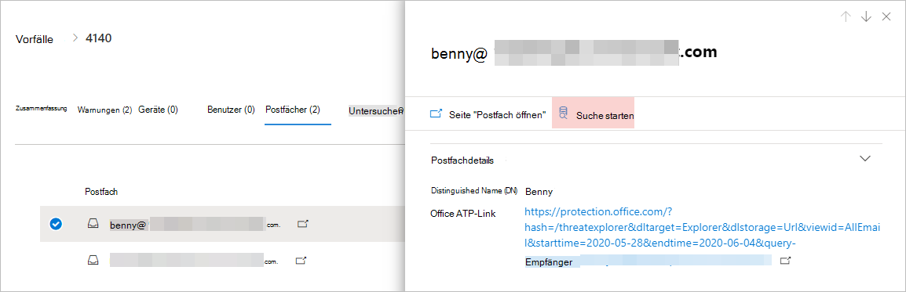
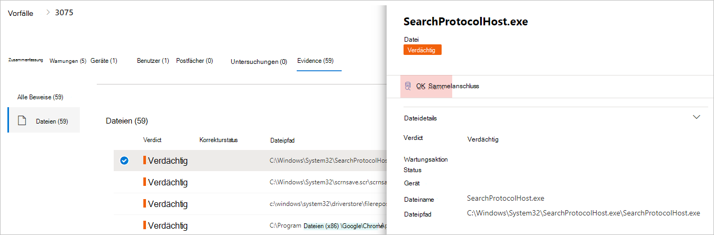

# <a name="quickly-hunt-for-entity-or-event-information-with-go-hunt"></a><span data-ttu-id="20029-104">Schnelle Suche nach Entitäts-oder Ereignisinformationen mit Go Hunt</span><span class="sxs-lookup"><span data-stu-id="20029-104">Quickly hunt for entity or event information with go hunt</span></span>

[!INCLUDE [Microsoft 365 Defender rebranding](../includes/microsoft-defender.md)]


<span data-ttu-id="20029-105">**Gilt für:**</span><span class="sxs-lookup"><span data-stu-id="20029-105">**Applies to:**</span></span>
- <span data-ttu-id="20029-106">Microsoft Threat Protection</span><span class="sxs-lookup"><span data-stu-id="20029-106">Microsoft Threat Protection</span></span>

<span data-ttu-id="20029-107">Mit der *Go Hunt* -Aktion können Sie schnell Ereignisse und verschiedene Entitätstypen mithilfe leistungsfähiger abfragebasierter [Erweiterter Jagd](advanced-hunting-overview.md) Funktionen untersuchen.</span><span class="sxs-lookup"><span data-stu-id="20029-107">With the *go hunt* action, you can quickly investigate events and various entity types using powerful query-based [advanced hunting](advanced-hunting-overview.md) capabilities.</span></span> <span data-ttu-id="20029-108">Mit dieser Aktion wird automatisch eine erweiterte Suchabfrage ausgeführt, um relevante Informationen zu dem ausgewählten Ereignis oder der ausgewählten Entität zu finden.</span><span class="sxs-lookup"><span data-stu-id="20029-108">This action automatically runs an advanced hunting query to find relevant information about the selected event or entity.</span></span>

<span data-ttu-id="20029-109">Die *Go Hunt* -Aktion steht in verschiedenen Abschnitten des Sicherheitscenters zur Verfügung, wenn Ereignis-oder Entitäts Details angezeigt werden.</span><span class="sxs-lookup"><span data-stu-id="20029-109">The *go hunt* action is available in various sections of the security center whenever event or entity details are displayed.</span></span> <span data-ttu-id="20029-110">Beispielsweise können Sie *Go Hunt* aus den folgenden Abschnitten verwenden:</span><span class="sxs-lookup"><span data-stu-id="20029-110">For example, you can use *go hunt* from the following sections:</span></span>

- <span data-ttu-id="20029-111">Auf der [Seite Vorfall](investigate-incidents.md#incident-overview)können Sie Details zu Benutzern, Geräten und vielen anderen Entitäten anzeigen, die einem Vorfall zugeordnet sind.</span><span class="sxs-lookup"><span data-stu-id="20029-111">In the [incident page](investigate-incidents.md#incident-overview), you can review details about users, devices, and many other entities associated with an incident.</span></span> <span data-ttu-id="20029-112">Wenn Sie eine Entität auswählen, erhalten Sie zusätzliche Informationen sowie verschiedene Aktionen, die Sie für diese entitity ausführen können.</span><span class="sxs-lookup"><span data-stu-id="20029-112">As you select an entity, you get additional information as well as various actions you could take on that entitity.</span></span> <span data-ttu-id="20029-113">Im folgenden Beispiel wird ein Postfach ausgewählt, in dem Details zu dem Postfach angezeigt werden, sowie die Option zum Durchsuchen weiterer Informationen zum Postfach.</span><span class="sxs-lookup"><span data-stu-id="20029-113">In the example below, a mailbox is selected, showing details about the mailbox as well the option to hunt for more information about the mailbox.</span></span>

    

- <span data-ttu-id="20029-115">Auf der Seite Vorfall können Sie auch auf eine Liste von Entitäten unter der Registerkarte Beweise zugreifen. Wenn Sie eine dieser Entitäten auswählen, können Sie schnell nach Informationen zu dieser Entität suchen.</span><span class="sxs-lookup"><span data-stu-id="20029-115">In the incident page, you can also access a list of entities under the evidence tab. Selecting one of those entities provides an option to quickly hunt for information about that entity.</span></span>

    


- <span data-ttu-id="20029-117">Wenn Sie die Zeitachse für ein Gerät anzeigen, können Sie ein Ereignis in der Zeitachse auswählen, um zusätzliche Informationen zu diesem Ereignis anzuzeigen.</span><span class="sxs-lookup"><span data-stu-id="20029-117">When viewing the timeline for a device, you can select an event in the timeline to view additional information about that event.</span></span> <span data-ttu-id="20029-118">Nachdem ein Ereignis ausgewählt wurde, haben Sie die Möglichkeit, andere relevante Ereignisse in der erweiterten Suche zu übernehmen.</span><span class="sxs-lookup"><span data-stu-id="20029-118">Once an event is selected, you get the option to hunt for other relevant events in advanced hunting.</span></span>

    

<span data-ttu-id="20029-120">Durch Auswählen von **Go Hunt** oder **Hunt für verwandte Ereignisse** werden unterschiedliche Abfragen übergeben, je nachdem, ob Sie eine Entität oder ein Ereignis ausgewählt haben.</span><span class="sxs-lookup"><span data-stu-id="20029-120">Selecting **Go hunt** or **Hunt for related events** passes different queries, depending on whether you've selected an entity or an event.</span></span>

## <a name="query-for-entity-information"></a><span data-ttu-id="20029-121">Abfrage für Entitätsinformationen</span><span class="sxs-lookup"><span data-stu-id="20029-121">Query for entity information</span></span>
<span data-ttu-id="20029-122">Bei Verwendung von *Go Hunt* zum Abfragen von Informationen zu einem Benutzer, Gerät oder einem anderen Entitätstyp überprüft die Abfrage alle relevanten Schema Tabellen auf alle Ereignisse, die diese Entität betreffen.</span><span class="sxs-lookup"><span data-stu-id="20029-122">When using *go hunt* to query for information about a user, device, or any other type of entity, the query checks all relevant schema tables for any events involving that entity.</span></span> <span data-ttu-id="20029-123">Um die Ergebnisse verwaltbar zu halten, wird die Abfrage auf den gleichen Zeitraum wie die früheste Aktivität in den letzten 30 Tagen beschränkt, die die Entität umfasst und dem Vorfall zugeordnet ist.</span><span class="sxs-lookup"><span data-stu-id="20029-123">To keep the results manageable, the query is scoped to around the same time period as the earliest activity in the past 30 days that involves the entity and is associated with the incident.</span></span>

<span data-ttu-id="20029-124">Hier ist ein Beispiel für die Go Hunt-Abfrage für ein Gerät:</span><span class="sxs-lookup"><span data-stu-id="20029-124">Here is an example of the go hunt query for a device:</span></span>

```kusto
let selectedTimestamp = datetime(2020-06-02T02:06:47.1167157Z);
let deviceName = "fv-az770.example.com";
let deviceId = "device-guid";
search in (DeviceLogonEvents, DeviceProcessEvents, DeviceNetworkEvents, DeviceFileEvents, DeviceRegistryEvents, DeviceImageLoadEvents, DeviceEvents, DeviceImageLoadEvents, IdentityLogonEvents, IdentityQueryEvents)
Timestamp between ((selectedTimestamp - 1h) .. (selectedTimestamp + 1h))
and DeviceName == deviceName
// or RemoteDeviceName == deviceName
// or DeviceId == deviceId
| take 100
```
### <a name="supported-entity-types"></a><span data-ttu-id="20029-125">Unterstützte Entitätstypen</span><span class="sxs-lookup"><span data-stu-id="20029-125">Supported entity types</span></span>
<span data-ttu-id="20029-126">Sie können *Go Hunt* verwenden, nachdem Sie einen dieser Entitätstypen ausgewählt haben:</span><span class="sxs-lookup"><span data-stu-id="20029-126">You can use *go hunt* after selecting any of these entity types:</span></span>

- <span data-ttu-id="20029-127">Dateien</span><span class="sxs-lookup"><span data-stu-id="20029-127">Files</span></span>
- <span data-ttu-id="20029-128">E-Mails</span><span class="sxs-lookup"><span data-stu-id="20029-128">Emails</span></span>
- <span data-ttu-id="20029-129">E-Mail-Cluster</span><span class="sxs-lookup"><span data-stu-id="20029-129">Email clusters</span></span>
- <span data-ttu-id="20029-130">Postfächer</span><span class="sxs-lookup"><span data-stu-id="20029-130">Mailboxes</span></span>
- <span data-ttu-id="20029-131">Benutzer</span><span class="sxs-lookup"><span data-stu-id="20029-131">Users</span></span>
- <span data-ttu-id="20029-132">Geräte</span><span class="sxs-lookup"><span data-stu-id="20029-132">Devices</span></span>
- <span data-ttu-id="20029-133">IP-Adressen</span><span class="sxs-lookup"><span data-stu-id="20029-133">IP addresses</span></span>
- <span data-ttu-id="20029-134">URLs</span><span class="sxs-lookup"><span data-stu-id="20029-134">URLs</span></span>

## <a name="query-for-event-information"></a><span data-ttu-id="20029-135">Abfragen von Ereignisinformationen</span><span class="sxs-lookup"><span data-stu-id="20029-135">Query for event information</span></span>
<span data-ttu-id="20029-136">Bei Verwendung von *Go Hunt* zum Abfragen von Informationen zu einem zeitachsenereignis überprüft die Abfrage alle relevanten Schema Tabellen auf andere Ereignisse um den Zeitpunkt des ausgewählten Ereignisses.</span><span class="sxs-lookup"><span data-stu-id="20029-136">When using *go hunt* to query for information about a timeline event, the query checks all relevant schema tables for other events around the time of the selected event.</span></span> <span data-ttu-id="20029-137">In der folgenden Abfrage werden beispielsweise Ereignisse in verschiedenen Schema Tabellen aufgelistet, die um denselben Zeitraum auf demselben Gerät aufgetreten sind:</span><span class="sxs-lookup"><span data-stu-id="20029-137">For example, the following query lists events in various schema tables that occured around the same time period on the same device:</span></span>

```kusto
// List relevant events 30 minutes before and after selected LogonAttempted event
let selectedEventTimestamp = datetime(2020-06-04T01:29:09.2496688Z);
search in (DeviceFileEvents, DeviceProcessEvents, DeviceEvents, DeviceRegistryEvents, DeviceNetworkEvents, DeviceImageLoadEvents, DeviceLogonEvents)
    Timestamp between ((selectedEventTimestamp - 30m) .. (selectedEventTimestamp + 30m))
    and DeviceId == "079ecf9c5798d249128817619606c1c47369eb3e"
| sort by Timestamp desc
| extend Relevance = iff(Timestamp == selectedEventTimestamp, "Selected event", iff(Timestamp < selectedEventTimestamp, "Earlier event", "Later event"))
| project-reorder Relevance
```

## <a name="adjust-the-query"></a><span data-ttu-id="20029-138">Anpassen der Abfrage</span><span class="sxs-lookup"><span data-stu-id="20029-138">Adjust the query</span></span>
<span data-ttu-id="20029-139">Mit einigen Kenntnissen der [Abfragesprache](advanced-hunting-query-language.md)können Sie die Abfrage nach Ihren Wünschen anpassen.</span><span class="sxs-lookup"><span data-stu-id="20029-139">With some knowledge of the [query language](advanced-hunting-query-language.md), you can adjust the query to your preference.</span></span> <span data-ttu-id="20029-140">Sie können beispielsweise diese Reihe anpassen, die die Größe des Zeitfensters bestimmt:</span><span class="sxs-lookup"><span data-stu-id="20029-140">For example, you can adjust this line, which determines the size of the time window:</span></span>

```kusto
Timestamp between ((selectedTimestamp - 1h) .. (selectedTimestamp + 1h))
```

<span data-ttu-id="20029-141">Zusätzlich zum Ändern der Abfrage, um relevantere Ergebnisse zu erhalten, können Sie auch folgende Aufgaben durchführen:</span><span class="sxs-lookup"><span data-stu-id="20029-141">In addition to modifying the query to get more relevant results, you can also:</span></span>
- [<span data-ttu-id="20029-142">Anzeigen der Ergebnisse als Diagramme</span><span class="sxs-lookup"><span data-stu-id="20029-142">View the results as charts</span></span>](advanced-hunting-query-results.md#view-query-results-as-a-table-or-chart)
- [<span data-ttu-id="20029-143">Erstellen einer benutzerdefinierten Erkennungsregel</span><span class="sxs-lookup"><span data-stu-id="20029-143">Create a custom detection rule</span></span>](custom-detection-rules.md)

## <a name="related-topics"></a><span data-ttu-id="20029-144">Verwandte Themen</span><span class="sxs-lookup"><span data-stu-id="20029-144">Related topics</span></span>
- [<span data-ttu-id="20029-145">Übersicht über die erweiterte Suche</span><span class="sxs-lookup"><span data-stu-id="20029-145">Advanced hunting overview</span></span>](advanced-hunting-overview.md)
- [<span data-ttu-id="20029-146">Lernen der Abfragesprache</span><span class="sxs-lookup"><span data-stu-id="20029-146">Learn the query language</span></span>](advanced-hunting-query-language.md)
- [<span data-ttu-id="20029-147">Arbeiten mit Abfrageergebnissen</span><span class="sxs-lookup"><span data-stu-id="20029-147">Work with query results</span></span>](advanced-hunting-query-results.md)
- [<span data-ttu-id="20029-148">Benutzerdefinierte Erkennungsregeln</span><span class="sxs-lookup"><span data-stu-id="20029-148">Custom detection rules</span></span>](custom-detection-rules.md)
