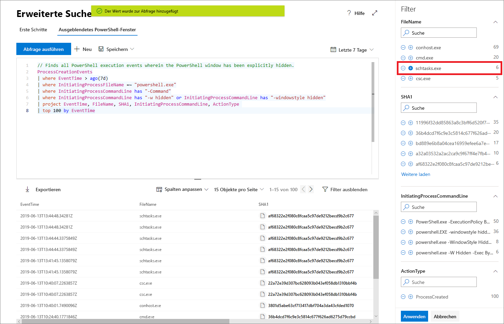

# Proaktive Suche nach Bedrohungen mit der erweiterten Suche in Microsoft Threat Protection

**Gilt für:**
- Microsoft Threat Protection

[!include[Prerelease information](prerelease.md)]

Bei der erweiterten Suche handelt es sich um ein abfragebasiertes Tool für die Bedrohungssuche, mit dem Sie Rohdaten von bis zu 30 Tagen erkunden können. Sie können Ereignisse in Ihrem Netzwerk proaktiv prüfen, um interessante Indikatoren und Entitäten zu ermitteln. Der flexible Zugriff auf Daten ermöglicht eine uneingeschränkte Suche nach bekannten und potenziellen Bedrohungen.

Im Microsoft 365 Security Center unterstützt die erweiterte Suche Abfragen für Daten aus Microsoft Defender ATP und deckt sowohl Daten von eingebundenen Geräten als auch aus Office 365 ATP ab und stellt Daten aus E-Mails bereit. Um die erweiterte Suche verwenden zu können, [aktivieren Sie Microsoft Threat Protection](mtp-enable.md).

## Erste Schritte mit der erweiterten Suche

Es wird empfohlen, mehrere Schritte durchzugehen, um schnell mit der Verwendung der erweiterten Suche loszulegen.

| Lernziel | Beschreibung | Ressource |
|--|--|--|
| **Gespür für die Sprache** | Die erweiterte Suche basiert auf der [Kusto-Abfragesprache](https://docs.microsoft.com/azure/kusto/query/), die dieselbe Syntax und dieselben Operatoren unterstützt. Beginnen Sie, die Abfragesprache zu erlernen, indem Sie die erste Abfrage ausführen. | [Übersicht über die Abfragesprache](advanced-hunting-query-language.md) |
| **Grundlegendes zum Schema** | Verschaffen Sie sich einen allgemeinen Überblick über die Tabellen im Schema und die zugehörigen Spalten. Auf diese Weise können Sie bestimmen, wo nach Daten gesucht wird und wie Sie Ihre Abfragen erstellen. | [Schemareferenz](advanced-hunting-schema-tables.md) |
| **Verwenden vordefinierter Abfragen** | Erkunden Sie Sammlungen vordefinierten Abfragen, die unterschiedliche Bedrohungssuchszenarien umfassen. | [Verwenden freigegebener Abfragen](advanced-hunting-shared-queries.md)
| **Optimieren von Abfragen** | Erfahren Sie, wie Sie effiziente Abfragen und Abfragen erstellen, die Daten aus E-Mails und Geräten kombinieren. | [Bewährte Methoden für Abfragen](advanced-hunting-shared-queries.md), [Suche auf Geräten und E-Mails](advanced-hunting-best-practices.md)

## Hilfe beim Schreiben von Abfragen
Nutzen Sie die folgenden Funktionen, um Abfragen schneller zu schreiben:
- **Vorschlagssuche** – Beim Schreiben von Abfragen stellt die erweiterte Suche Vorschläge bereit. 
- **Schemareferenz** – Eine Schemareferenz, die die Liste der Tabellen und die zugehörigen Spalten enthält, wird neben dem Arbeitsbereich bereitgestellt. Wenn Sie weitere Informationen erhalten möchten, zeigen Sie mit dem Mauszeiger auf ein Element. Doppelklicken Sie auf ein Element, um es im Abfrage-Editor einzufügen.

## Ausführen eines Drilldowns für Abfrageergebnisse
Wenn Sie weitere Informationen zu Entitäten, z. B. Computern, Dateien, Benutzern, IP-Adressen und URLs, anzeigen möchten, klicken Sie in den Abfrageergebnissen einfach auf den Entitätsbezeichner. Dadurch wird eine detaillierte Profilseite für die ausgewählte Entität im Microsoft Defender Security Center geöffnet.

## Optimieren von Abfragen aus den Ergebnissen
Klicken Sie mit der rechten Maustaste auf einen Wert im Resultset, um die Abfrage schnell zu erweitern. Sie können die folgenden Optionen für Folgendes verwenden:

- Explizites Suchen nach dem ausgewählten Wert (`==`)
- Ausschließen des ausgewählten Werts aus der Abfrage (`!=`)
- Abrufen weiterer erweiterter Operatoren zum Hinzufügen des Werts zu Ihrer Abfrage, z. B. `contains`, `starts with` und `ends with` 

## Filtern der Abfrageergebnisse
Die rechts angezeigten Filter bieten eine Zusammenfassung des Resultsets. Jede Spalte verfügt über einen eigenen Abschnitt, in dem die für diese Spalte und die Anzahl der Instanzen eindeutigen Werte aufgelistet werden.

Verfeinern Sie Ihre Abfrage, indem Sie die Schaltflächen „+“ oder „-“ für die Werte verwenden, die Sie ein- bzw. ausschließen möchten, und dann **Abfrage ausführen** auswählen.

Sobald der Filter zum Ändern der Abfrage angewendet und die Abfrage ausgeführt wurde, werden die Ergebnisse entsprechend aktualisiert.

## Verwandte Themen
- [Lernen der Abfragesprache](advanced-hunting-query-language.md)
- [Verwenden freigegebener Abfragen](advanced-hunting-shared-queries.md)
- [Suche nach Bedrohungen auf Geräten und in E-Mails](advanced-hunting-query-emails-devices.md)
- [Grundlegendes zum Schema](advanced-hunting-schema-tables.md)
- [Anwenden bewährter Methoden für Abfragen](advanced-hunting-best-practices.md)