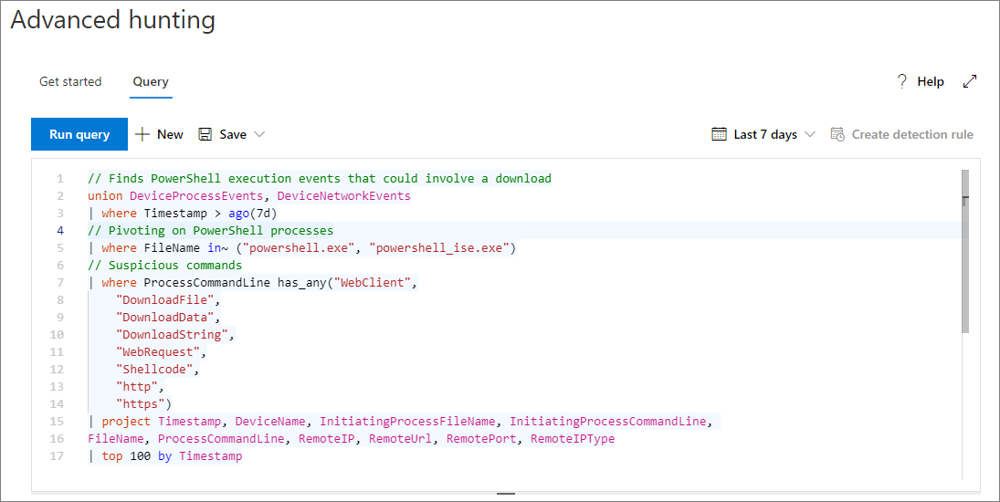

# <a name="learn-the-advanced-hunting-query-language"></a><span data-ttu-id="ada33-104">Erlernen der Abfragesprache für die erweiterte Suche</span><span class="sxs-lookup"><span data-stu-id="ada33-104">Learn the advanced hunting query language</span></span>

<span data-ttu-id="ada33-105">**Gilt für:**</span><span class="sxs-lookup"><span data-stu-id="ada33-105">**Applies to:**</span></span>
- <span data-ttu-id="ada33-106">Microsoft Threat Protection</span><span class="sxs-lookup"><span data-stu-id="ada33-106">Microsoft Threat Protection</span></span>

<span data-ttu-id="ada33-107">Die erweiterte Suche basiert auf der [Kusto-Abfragesprache](https://docs.microsoft.com/azure/kusto/query/).</span><span class="sxs-lookup"><span data-stu-id="ada33-107">Advanced hunting is based on the [Kusto query language](https://docs.microsoft.com/azure/kusto/query/).</span></span> <span data-ttu-id="ada33-108">Sie können die Kusto-Syntax und -Operatoren verwenden, um Abfragen zu erstellen, die Informationen im [Schema](advanced-hunting-schema-tables.md) suchen, die speziell für die erweiterte Suche strukturiert sind.</span><span class="sxs-lookup"><span data-stu-id="ada33-108">You can use Kusto syntax and operators to construct queries that locate information in the [schema](advanced-hunting-schema-tables.md) specifically structured for advanced hunting.</span></span> <span data-ttu-id="ada33-109">Wenn Sie diese Konzepte besser verstehen möchten, führen Sie Ihre erste Abfrage aus.</span><span class="sxs-lookup"><span data-stu-id="ada33-109">To understand these concepts better, run your first query.</span></span>

## <a name="try-your-first-query"></a><span data-ttu-id="ada33-110">Testen Ihrer ersten Abfrage</span><span class="sxs-lookup"><span data-stu-id="ada33-110">Try your first query</span></span>

<span data-ttu-id="ada33-111">Wechseln Sie im Microsoft 365 Security Center zu **Hunting** , um die erste Abfrage auszuführen.</span><span class="sxs-lookup"><span data-stu-id="ada33-111">In Microsoft 365 security center, go to **Hunting** to run your first query.</span></span> <span data-ttu-id="ada33-112">Verwenden Sie das folgende Beispiel:</span><span class="sxs-lookup"><span data-stu-id="ada33-112">Use the following example:</span></span>

```kusto
// Finds PowerShell execution events that could involve a download
union DeviceProcessEvents, DeviceNetworkEvents
| where Timestamp > ago(7d)
// Pivoting on PowerShell processes
| where FileName in~ ("powershell.exe", "powershell_ise.exe")
// Suspicious commands
| where ProcessCommandLine has_any("WebClient",
 "DownloadFile",
 "DownloadData",
 "DownloadString",
"WebRequest",
"Shellcode",
"http",
"https")
| project Timestamp, DeviceName, InitiatingProcessFileName, InitiatingProcessCommandLine, 
FileName, ProcessCommandLine, RemoteIP, RemoteUrl, RemotePort, RemoteIPType
| top 100 by Timestamp
```

<span data-ttu-id="ada33-113">So sieht es in der erweiterten Suche aus.</span><span class="sxs-lookup"><span data-stu-id="ada33-113">This is how it will look like in advanced hunting.</span></span>



### <a name="describe-the-query-and-specify-the-tables-to-search"></a><span data-ttu-id="ada33-115">Beschreiben der Abfrage und angeben der zu durchsuchenden Tabellen</span><span class="sxs-lookup"><span data-stu-id="ada33-115">Describe the query and specify the tables to search</span></span>
<span data-ttu-id="ada33-116">Ein kurzer Kommentar zum Anfang der Abfrage wurde hinzugefügt, um zu beschreiben, wofür er verwendet wird.</span><span class="sxs-lookup"><span data-stu-id="ada33-116">A short comment has been added to the beginning of the query to describe what it is for.</span></span> <span data-ttu-id="ada33-117">Dies hilft, wenn Sie später entscheiden, die Abfrage zu speichern und für andere Personen in Ihrer Organisation freizugeben.</span><span class="sxs-lookup"><span data-stu-id="ada33-117">This helps if you later decide to save the query and share it with others in your organization.</span></span> 

```kusto
// Finds PowerShell execution events that could involve a download
```

<span data-ttu-id="ada33-118">Die Abfrage selbst beginnt in der Regel mit einem Tabellennamen gefolgt von einer Reihe von Elementen, die mit einer Pipe (`|`) beginnen.</span><span class="sxs-lookup"><span data-stu-id="ada33-118">The query itself will typically start with a table name followed by a series of elements started by a pipe (`|`).</span></span> <span data-ttu-id="ada33-119">In diesem Beispiel beginnen wir mit dem Erstellen einer Vereinigung von zwei Tabellen und fügen bei Bedarf weitergeleitete `DeviceProcessEvents` `DeviceNetworkEvents` Elemente hinzu.</span><span class="sxs-lookup"><span data-stu-id="ada33-119">In this example, we start by creating a union of two tables,  `DeviceProcessEvents` and `DeviceNetworkEvents`, and add piped elements as needed.</span></span>

```kusto
union DeviceProcessEvents, DeviceNetworkEvents
```
### <a name="set-the-time-range"></a><span data-ttu-id="ada33-120">Festlegen des Zeitbereichs</span><span class="sxs-lookup"><span data-stu-id="ada33-120">Set the time range</span></span>
<span data-ttu-id="ada33-121">Das erste piped-Element ist ein Zeitfilter, der auf die vorherigen sieben Tage beschränkt ist.</span><span class="sxs-lookup"><span data-stu-id="ada33-121">The first piped element is a time filter scoped to the previous seven days.</span></span> <span data-ttu-id="ada33-122">Wenn Sie den Zeitabschnitt so eng wie möglich lassen, wird sichergestellt, dass Abfragen gut ausgeführt werden, überschaubare Ergebnisse zurückgeben und keine Zeitüberschreitungen auftreten.</span><span class="sxs-lookup"><span data-stu-id="ada33-122">Keeping the time range as narrow as possible ensures that queries perform well, return manageable results, and don't time out.</span></span>

```kusto
| where Timestamp > ago(7d)
```

### <a name="check-specific-processes"></a><span data-ttu-id="ada33-123">Überprüfen bestimmter Prozesse</span><span class="sxs-lookup"><span data-stu-id="ada33-123">Check specific processes</span></span>
<span data-ttu-id="ada33-124">Auf den Zeitbereich folgt unmittelbar eine Suche nach Prozess Dateinamen, die die PowerShell-Anwendung darstellen.</span><span class="sxs-lookup"><span data-stu-id="ada33-124">The time range is immediately followed by a search for process file names representing the PowerShell application.</span></span>

```kusto
// Pivoting on PowerShell processes
| where FileName in~ ("powershell.exe", "powershell_ise.exe")
```

### <a name="search-for-specific-command-strings"></a><span data-ttu-id="ada33-125">Suchen nach bestimmten Befehlszeichenfolgen</span><span class="sxs-lookup"><span data-stu-id="ada33-125">Search for specific command strings</span></span>
<span data-ttu-id="ada33-126">Anschließend sucht die Abfrage nach Zeichenfolgen in Befehlszeilen, die in der Regel zum Herunterladen von Dateien mithilfe von PowerShell verwendet werden.</span><span class="sxs-lookup"><span data-stu-id="ada33-126">Afterwards, the query looks for strings in command lines that are typically used to download files using PowerShell.</span></span>

```kusto
// Suspicious commands
| where ProcessCommandLine has_any("WebClient",
    "DownloadFile",
    "DownloadData",
    "DownloadString",
    "WebRequest",
    "Shellcode",
    "http",
    "https")
```

### <a name="customize-result-columns-and-length"></a><span data-ttu-id="ada33-127">Anpassen von Ergebnisspalten und-Länge</span><span class="sxs-lookup"><span data-stu-id="ada33-127">Customize result columns and length</span></span> 
<span data-ttu-id="ada33-128">Da die Abfrage nun die zu suchenden Daten eindeutig identifiziert, können Sie Elemente hinzufügen, die definieren, wie die Ergebnisse aussehen.</span><span class="sxs-lookup"><span data-stu-id="ada33-128">Now that your query clearly identifies the data you want to locate, you can add elements that define what the results look like.</span></span> <span data-ttu-id="ada33-129">`project`gibt bestimmte Spalten zurück und `top` schränkt die Anzahl der Ergebnisse ein.</span><span class="sxs-lookup"><span data-stu-id="ada33-129">`project` returns specific columns, and `top` limits the number of results.</span></span> <span data-ttu-id="ada33-130">Diese Operatoren tragen dazu bei, dass die Ergebnisse gut formatiert und relativ umfangreich und einfach zu verarbeiten sind.</span><span class="sxs-lookup"><span data-stu-id="ada33-130">These operators help ensure the results are well-formatted and reasonably large and easy to process.</span></span>

```kusto
| project Timestamp, DeviceName, InitiatingProcessFileName, InitiatingProcessCommandLine, 
FileName, ProcessCommandLine, RemoteIP, RemoteUrl, RemotePort, RemoteIPType
| top 100 by Timestamp
```

<span data-ttu-id="ada33-131">Klicken Sie auf **Abfrage ausführen** aus, um die Ergebnisse anzuzeigen.</span><span class="sxs-lookup"><span data-stu-id="ada33-131">Click **Run query** to see the results.</span></span> <span data-ttu-id="ada33-132">Wählen Sie das Erweiterungssymbol oben rechts im Abfrage-Editor aus, um sich auf Ihre Jagd Abfrage und die Ergebnisse zu konzentrieren.</span><span class="sxs-lookup"><span data-stu-id="ada33-132">Select the expand icon at the top right of the query editor to focus on your hunting query and the results.</span></span> 


>[!TIP]
><span data-ttu-id="ada33-134">Sie können Abfrageergebnisse als Diagramme anzeigen und Filter schnell anpassen.</span><span class="sxs-lookup"><span data-stu-id="ada33-134">You can view query results as charts and quickly adjust filters.</span></span> <span data-ttu-id="ada33-135">[Informationen zum Arbeiten mit Abfrageergebnissen finden Sie](advanced-hunting-query-results.md) unter Anleitung.</span><span class="sxs-lookup"><span data-stu-id="ada33-135">For guidance, [read about working with query results](advanced-hunting-query-results.md)</span></span>

## <a name="learn-common-query-operators-for-advanced-hunting"></a><span data-ttu-id="ada33-136">Erlernen häufig verwendeter Operatoren für die erweiterte Suche</span><span class="sxs-lookup"><span data-stu-id="ada33-136">Learn common query operators for advanced hunting</span></span>

<span data-ttu-id="ada33-137">Da Sie nun Ihre erste Abfrage ausgeführt und eine allgemeine Vorstellung von deren Komponenten haben, gehen wir einen Schritt zurück und befassen uns mit ein paar Grundlagen.</span><span class="sxs-lookup"><span data-stu-id="ada33-137">Now that you've run your first query and have a general idea of its components, it's time to backtrack a little bit and learn some basics.</span></span> <span data-ttu-id="ada33-138">Die von der erweiterten Suche verwendete Kusto-Abfragesprache unterstützt eine Reihe von Operatoren, darunter die folgenden allgemeinen Operatoren.</span><span class="sxs-lookup"><span data-stu-id="ada33-138">The Kusto query language used by advanced hunting supports a range of operators, including the following common ones.</span></span>

| <span data-ttu-id="ada33-139">Operator</span><span class="sxs-lookup"><span data-stu-id="ada33-139">Operator</span></span> | <span data-ttu-id="ada33-140">Beschreibung und Verwendung</span><span class="sxs-lookup"><span data-stu-id="ada33-140">Description and usage</span></span> |
|--|--|
| `where` | <span data-ttu-id="ada33-141">Filtern einer Tabelle auf die Teilmenge von Zeilen, die einem Prädikat entsprechen.</span><span class="sxs-lookup"><span data-stu-id="ada33-141">Filter a table to the subset of rows that satisfy a predicate.</span></span> |
| `summarize` | <span data-ttu-id="ada33-142">Erstellen einer Tabelle, in der die Inhalte der Eingabetabelle gesammelt werden.</span><span class="sxs-lookup"><span data-stu-id="ada33-142">Produce a table that aggregates the content of the input table.</span></span> |
| `join` | <span data-ttu-id="ada33-143">Zusammenführen der Zeilen von zwei Tabellen, um eine neue Tabelle zu erstellen, indem Werte der angegebenen Spalten aus jeder Tabelle zugeordnet werden.</span><span class="sxs-lookup"><span data-stu-id="ada33-143">Merge the rows of two tables to form a new table by matching values of the specified column(s) from each table.</span></span> |
| `count` | <span data-ttu-id="ada33-144">Zurückgeben der Anzahl von Datensätzen im Eingabedatensatz.</span><span class="sxs-lookup"><span data-stu-id="ada33-144">Return the number of records in the input record set.</span></span> |
| `top` | <span data-ttu-id="ada33-145">Zurückgeben der ersten n Einträge, sortiert anhand der angegebenen Spalten.</span><span class="sxs-lookup"><span data-stu-id="ada33-145">Return the first N records sorted by the specified columns.</span></span> |
| `limit` | <span data-ttu-id="ada33-146">Zurückkehren nach oben zur angegebenen Zeilenanzahl.</span><span class="sxs-lookup"><span data-stu-id="ada33-146">Return up to the specified number of rows.</span></span> |
| `project` | <span data-ttu-id="ada33-147">Auswählen der Spalten, um neue berechnete Spalten aufzunehmen, umzubenennen, zu löschen oder einzufügen.</span><span class="sxs-lookup"><span data-stu-id="ada33-147">Select the columns to include, rename or drop, and insert new computed columns.</span></span> |
| `extend` | <span data-ttu-id="ada33-148">Erstellen von berechneten Spalten und Anfügen an das Resultset.</span><span class="sxs-lookup"><span data-stu-id="ada33-148">Create calculated columns and append them to the result set.</span></span> |
| `makeset` |  <span data-ttu-id="ada33-149">Zurückgeben eines dynamischen (JSON)-Arrays der Gruppe eindeutiger Werte, die der Ausdruck in der Gruppe verwendet.</span><span class="sxs-lookup"><span data-stu-id="ada33-149">Return a dynamic (JSON) array of the set of distinct values that Expr takes in the group.</span></span> |
| `find` | <span data-ttu-id="ada33-150">Suchen von Zeilen, die mit einem Prädikat über eine Reihe von Tabellen hinweg übereinstimmen.</span><span class="sxs-lookup"><span data-stu-id="ada33-150">Find rows that match a predicate across a set of tables.</span></span> |

<span data-ttu-id="ada33-151">Wenn Sie ein Beispiel für diese Operatoren sehen möchten, führen Sie diese im Abschnitt **Erste Schritte** in der erweiterten Suche aus.</span><span class="sxs-lookup"><span data-stu-id="ada33-151">To see a live example of these operators, run them from the **Get started** section in advanced hunting.</span></span>

## <a name="understand-data-types-and-their-query-syntax-implications"></a><span data-ttu-id="ada33-152">Grundlegendes zu Datentypen und deren Auswirkungen auf die Abfragesyntax</span><span class="sxs-lookup"><span data-stu-id="ada33-152">Understand data types and their query syntax implications</span></span>

<span data-ttu-id="ada33-153">Daten in erweiterten Suchtabellen werden in der Regel in die folgenden Datentypen unterteilt.</span><span class="sxs-lookup"><span data-stu-id="ada33-153">Data in advanced hunting tables are generally classified into the following data types.</span></span>

| <span data-ttu-id="ada33-154">Datentyp</span><span class="sxs-lookup"><span data-stu-id="ada33-154">Data type</span></span> | <span data-ttu-id="ada33-155">Beschreibung und Auswirkungen der Abfrage</span><span class="sxs-lookup"><span data-stu-id="ada33-155">Description and query implications</span></span> |
|--|--|
| `datetime` | <span data-ttu-id="ada33-156">Daten- und Zeitinformationen, die in der Regel Ereigniszeitstempel darstellen</span><span class="sxs-lookup"><span data-stu-id="ada33-156">Data and time information typically representing event timestamps</span></span> |
| `string` | <span data-ttu-id="ada33-157">Zeichenfolge</span><span class="sxs-lookup"><span data-stu-id="ada33-157">Character string</span></span> |
| `bool` | <span data-ttu-id="ada33-158">„True“ oder „False“</span><span class="sxs-lookup"><span data-stu-id="ada33-158">True or false</span></span> |
| `int` | <span data-ttu-id="ada33-159">Ein numerischer 32-Bit-Wert.</span><span class="sxs-lookup"><span data-stu-id="ada33-159">32-bit numeric value</span></span>  |
| `long` | <span data-ttu-id="ada33-160">Ein numerischer 64-Bit-Wert.</span><span class="sxs-lookup"><span data-stu-id="ada33-160">64-bit numeric value</span></span> |

## <a name="get-help-as-you-write-queries"></a><span data-ttu-id="ada33-161">Hilfe beim Schreiben von Abfragen</span><span class="sxs-lookup"><span data-stu-id="ada33-161">Get help as you write queries</span></span>
<span data-ttu-id="ada33-162">Nutzen Sie die folgenden Funktionen, um Abfragen schneller zu schreiben:</span><span class="sxs-lookup"><span data-stu-id="ada33-162">Take advantage of the following functionality to write queries faster:</span></span>
- <span data-ttu-id="ada33-163">**AutoSuggest** – beim Schreiben von Abfragen stellt Advanced Hunting Vorschläge von IntelliSense zur Verfügung.</span><span class="sxs-lookup"><span data-stu-id="ada33-163">**Autosuggest** — as you write queries, advanced hunting provides suggestions from IntelliSense.</span></span> 
- <span data-ttu-id="ada33-164">**Schemastruktur** : eine Schemadarstellung, die die Liste der Tabellen und deren Spalten enthält, wird neben dem Arbeitsbereich bereitgestellt.</span><span class="sxs-lookup"><span data-stu-id="ada33-164">**Schema tree** — a schema representation that includes the list of tables and their columns is provided next to your working area.</span></span> <span data-ttu-id="ada33-165">Wenn Sie weitere Informationen erhalten möchten, zeigen Sie mit dem Mauszeiger auf ein Element.</span><span class="sxs-lookup"><span data-stu-id="ada33-165">For more information, hover over an item.</span></span> <span data-ttu-id="ada33-166">Doppelklicken Sie auf ein Element, um es im Abfrage-Editor einzufügen.</span><span class="sxs-lookup"><span data-stu-id="ada33-166">Double-click an item to insert it to the query editor.</span></span>
- <span data-ttu-id="ada33-167">**[Schema Referenz](advanced-hunting-schema-tables.md#get-schema-information-in-the-security-center)** – in-Portal-Referenz mit Tabellen-und Spaltenbeschreibungen sowie unterstützten Ereignistypen ( `ActionType` Werte) und Beispielabfragen</span><span class="sxs-lookup"><span data-stu-id="ada33-167">**[Schema reference](advanced-hunting-schema-tables.md#get-schema-information-in-the-security-center)** — in-portal reference with table and column descriptions as well as supported event types (`ActionType` values) and sample queries</span></span>

## <a name="work-with-multiple-queries-in-the-editor"></a><span data-ttu-id="ada33-168">Arbeiten mit mehreren Abfragen im Editor</span><span class="sxs-lookup"><span data-stu-id="ada33-168">Work with multiple queries in the editor</span></span>
<span data-ttu-id="ada33-169">Der Abfrage-Editor kann als Scratch Pad für das Experimentieren mit mehreren Abfragen dienen.</span><span class="sxs-lookup"><span data-stu-id="ada33-169">The query editor can serve as your scratch pad for experimenting with multiple queries.</span></span> <span data-ttu-id="ada33-170">So verwenden Sie mehrere Abfragen:</span><span class="sxs-lookup"><span data-stu-id="ada33-170">To use multiple queries:</span></span>

- <span data-ttu-id="ada33-171">Trennen Sie jede Abfrage durch eine leere Textreihe.</span><span class="sxs-lookup"><span data-stu-id="ada33-171">Separate each query with an empty line.</span></span>
- <span data-ttu-id="ada33-172">Platzieren Sie den Cursor auf einem beliebigen Teil einer Abfrage, um diese Abfrage vor dem Ausführen auszuwählen.</span><span class="sxs-lookup"><span data-stu-id="ada33-172">Place the cursor on any part of a query to select that query before running it.</span></span> <span data-ttu-id="ada33-173">Dadurch wird nur die ausgewählte Abfrage ausgeführt.</span><span class="sxs-lookup"><span data-stu-id="ada33-173">This will run only the selected query.</span></span> <span data-ttu-id="ada33-174">Wenn Sie eine andere Abfrage ausführen möchten, bewegen Sie den Cursor entsprechend, und wählen Sie **Abfrage ausführen**aus.</span><span class="sxs-lookup"><span data-stu-id="ada33-174">To run another query, move the cursor accordingly and select **Run query**.</span></span>


## <a name="use-sample-queries"></a><span data-ttu-id="ada33-176">Verwenden von Beispielabfragen</span><span class="sxs-lookup"><span data-stu-id="ada33-176">Use sample queries</span></span>

<span data-ttu-id="ada33-177">Der Abschnitt **Erste Schritte** bietet einige einfache Abfragen mit häufig verwendeten Operatoren.</span><span class="sxs-lookup"><span data-stu-id="ada33-177">The **Get started** section provides a few simple queries using commonly used operators.</span></span> <span data-ttu-id="ada33-178">Versuchen Sie, diese Abfragen auszuführen und kleine Änderungen daran vorzunehmen.</span><span class="sxs-lookup"><span data-stu-id="ada33-178">Try running these queries and making small modifications to them.</span></span>


>[!NOTE]
><span data-ttu-id="ada33-180">Abgesehen von den einfachen Abfragebeispielen können Sie auch auf [freigegebene Abfragen](advanced-hunting-shared-queries.md) für bestimmte Szenarien zur Bedrohungssuche zugreifen.</span><span class="sxs-lookup"><span data-stu-id="ada33-180">Apart from the basic query samples, you can also access [shared queries](advanced-hunting-shared-queries.md) for specific threat hunting scenarios.</span></span> <span data-ttu-id="ada33-181">Erkunden Sie die freigegebenen Abfragen auf der linken Seite oder das GitHub-Abfragerepository.</span><span class="sxs-lookup"><span data-stu-id="ada33-181">Explore the shared queries on the left side of the page or the GitHub query repository.</span></span>

## <a name="access-query-language-documentation"></a><span data-ttu-id="ada33-182">Zugreifen auf die Dokumentation zur Abfragesprache</span><span class="sxs-lookup"><span data-stu-id="ada33-182">Access query language documentation</span></span>

<span data-ttu-id="ada33-183">Weitere Informationen zur Kusto-Abfragesprache und zu unterstützten Operatoren finden Sie unter [Dokumentation zur Kusto-Abfragesprache](https://docs.microsoft.com/azure/kusto/query/).</span><span class="sxs-lookup"><span data-stu-id="ada33-183">For more information on Kusto query language and supported operators, see [Kusto query language documentation](https://docs.microsoft.com/azure/kusto/query/).</span></span>

## <a name="related-topics"></a><span data-ttu-id="ada33-184">Verwandte Themen</span><span class="sxs-lookup"><span data-stu-id="ada33-184">Related topics</span></span>
- [<span data-ttu-id="ada33-185">Übersicht über die erweiterte Suche</span><span class="sxs-lookup"><span data-stu-id="ada33-185">Advanced hunting overview</span></span>](advanced-hunting-overview.md)
- [<span data-ttu-id="ada33-186">Arbeiten mit Abfrageergebnissen</span><span class="sxs-lookup"><span data-stu-id="ada33-186">Work with query results</span></span>](advanced-hunting-query-results.md)
- [<span data-ttu-id="ada33-187">Verwenden freigegebener Abfragen</span><span class="sxs-lookup"><span data-stu-id="ada33-187">Use shared queries</span></span>](advanced-hunting-shared-queries.md)
- [<span data-ttu-id="ada33-188">Suche nach Bedrohungen auf Geräten und in E-Mails</span><span class="sxs-lookup"><span data-stu-id="ada33-188">Hunt for threats across devices and emails</span></span>](advanced-hunting-query-emails-devices.md)
- [<span data-ttu-id="ada33-189">Grundlegendes zum Schema</span><span class="sxs-lookup"><span data-stu-id="ada33-189">Understand the schema</span></span>](advanced-hunting-schema-tables.md)
- [<span data-ttu-id="ada33-190">Anwenden bewährter Methoden für Abfragen</span><span class="sxs-lookup"><span data-stu-id="ada33-190">Apply query best practices</span></span>](advanced-hunting-best-practices.md)
