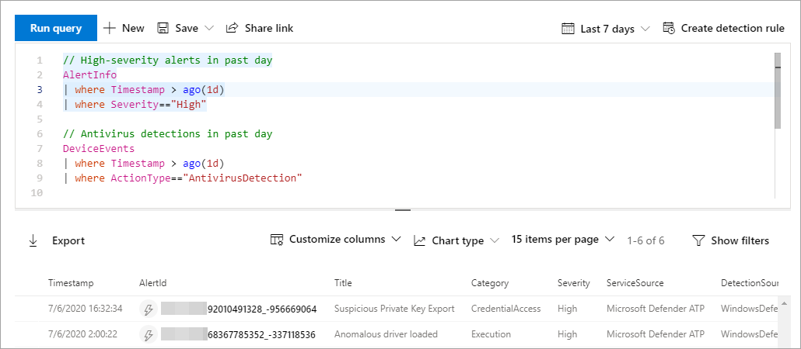

# <a name="learn-the-advanced-hunting-query-language"></a>Erlernen der Abfragesprache für die erweiterte Suche

[!INCLUDE [Microsoft 365 Defender rebranding](../includes/microsoft-defender.md)]


**Gilt für:**
- Microsoft Threat Protection

Die erweiterte Suche basiert auf der [Kusto-Abfragesprache](https://docs.microsoft.com/azure/kusto/query/). Sie können die Kusto-Syntax und-Operatoren verwenden, um Abfragen zu erstellen, die Informationen im speziellen [Schema](advanced-hunting-schema-tables.md)suchen. Wenn Sie diese Konzepte besser verstehen möchten, führen Sie Ihre erste Abfrage aus.

## <a name="try-your-first-query"></a>Testen Ihrer ersten Abfrage

Wechseln Sie im Microsoft 365 Security Center zu **Hunting** , um die erste Abfrage auszuführen. Verwenden Sie das folgende Beispiel:

```kusto
// Finds PowerShell execution events that could involve a download
union DeviceProcessEvents, DeviceNetworkEvents
| where Timestamp > ago(7d)
// Pivoting on PowerShell processes
| where FileName in~ ("powershell.exe", "powershell_ise.exe")
// Suspicious commands
| where ProcessCommandLine has_any("WebClient",
 "DownloadFile",
 "DownloadData",
 "DownloadString",
"WebRequest",
"Shellcode",
"http",
"https")
| project Timestamp, DeviceName, InitiatingProcessFileName, InitiatingProcessCommandLine, 
FileName, ProcessCommandLine, RemoteIP, RemoteUrl, RemotePort, RemoteIPType
| top 100 by Timestamp
```

**[Ausführen dieser Abfrage in Advanced Hunting](https://security.microsoft.com/hunting?query=H4sIAAAAAAAEAI2TW0sCURSF93PQfxh8Moisp956yYIgQtLoMaYczJpbzkkTpN_et_dcdPQkcpjbmrXXWftyetKTQG5lKqmMpeB9IJksJJKZDOWdZ8wKeP5wvcm3OLgZbMXmXCmIxjnYIfcAVgYvRi8w3TnfsXEDGAG47pCCZXyP5ViO4KeNbt-Up-hEuJmB6lvButnY8XSL-cDl0M2I-GwxVX8Fe2H5zMzHiKjEVB0eEsnBrszfBIWuXOLrxCJ7VqEBfM3DWUYTkNKrv1p5y3X0jwetemzOQ_NSVuuXZ1c6aNTKRaN8VvWhY9n7OS-o6J5r7mYeQypdEKc1m1qfiqpjCSuspsDntt2J61bEvTlXls5AgQfFl5bHM_gr_BhO2RF1rztoBv2tWahrso_TtzkL93KGMGZVr2pe7eWR-xeZl91f_113UOsx3nDR4Y9j5R6kaCq8ajr_YWfFeedsd27L7it-Z6dAZyxsJq1d9-2ZOSzK3y2NVd8-zUPjtZaJnYsIH4Md7AmdeAcd2Cl1XoURc5PzXlfU8U9P54WcswL6t_TW9Q__qX-xygQAAA&runQuery=true&timeRangeId=week)**

### <a name="describe-the-query-and-specify-the-tables-to-search"></a>Beschreiben der Abfrage und angeben der zu durchsuchenden Tabellen
Ein kurzer Kommentar zum Anfang der Abfrage wurde hinzugefügt, um zu beschreiben, wofür er verwendet wird. Dieser Kommentar hilft Ihnen, wenn Sie sich später entscheiden, die Abfrage zu speichern und für andere Personen in Ihrer Organisation freizugeben. 

```kusto
// Finds PowerShell execution events that could involve a download
```

Die Abfrage selbst beginnt in der Regel mit einem Tabellennamen, gefolgt von mehreren Elementen, die mit einer Pipe beginnen ( `|` ). In diesem Beispiel beginnen wir mit dem Erstellen einer Vereinigung von zwei Tabellen und fügen bei Bedarf weitergeleitete  `DeviceProcessEvents` `DeviceNetworkEvents` Elemente hinzu.

```kusto
union DeviceProcessEvents, DeviceNetworkEvents
```
### <a name="set-the-time-range"></a>Festlegen des Zeitbereichs
Das erste piped-Element ist ein Zeitfilter, der auf die vorherigen sieben Tage beschränkt ist. Durch die Begrenzung des Zeitbereichs wird sichergestellt, dass Abfragen gut ausgeführt werden, verwaltbare Ergebnisse zurückgegeben werden und keine Zeitüberschreitung auftritt.

```kusto
| where Timestamp > ago(7d)
```

### <a name="check-specific-processes"></a>Überprüfen bestimmter Prozesse
Auf den Zeitbereich folgt unmittelbar eine Suche nach Prozess Dateinamen, die die PowerShell-Anwendung darstellen.

```kusto
// Pivoting on PowerShell processes
| where FileName in~ ("powershell.exe", "powershell_ise.exe")
```

### <a name="search-for-specific-command-strings"></a>Suchen nach bestimmten Befehlszeichenfolgen
Anschließend sucht die Abfrage nach Zeichenfolgen in Befehlszeilen, die in der Regel zum Herunterladen von Dateien mithilfe von PowerShell verwendet werden.

```kusto
// Suspicious commands
| where ProcessCommandLine has_any("WebClient",
    "DownloadFile",
    "DownloadData",
    "DownloadString",
    "WebRequest",
    "Shellcode",
    "http",
    "https")
```

### <a name="customize-result-columns-and-length"></a>Anpassen von Ergebnisspalten und-Länge 
Da Ihre Abfrage nun eindeutig die Daten identifiziert, die Sie suchen möchten, können Sie definieren, wie die Ergebnisse aussehen. `project` gibt bestimmte Spalten zurück und `top` schränkt die Anzahl der Ergebnisse ein. Diese Operatoren tragen dazu bei, dass die Ergebnisse gut formatiert und relativ umfangreich und einfach zu verarbeiten sind.

```kusto
| project Timestamp, DeviceName, InitiatingProcessFileName, InitiatingProcessCommandLine, 
FileName, ProcessCommandLine, RemoteIP, RemoteUrl, RemotePort, RemoteIPType
| top 100 by Timestamp
```

Wählen Sie **Abfrage ausführen** aus, um die Ergebnisse anzuzeigen. Verwenden Sie das Erweiterungssymbol oben rechts im Abfrage-Editor, um sich auf Ihre Jagd Abfrage und die Ergebnisse zu konzentrieren. 


>[!TIP]
>Sie können Abfrageergebnisse als Diagramme anzeigen und Filter schnell anpassen. [Informationen zum Arbeiten mit Abfrageergebnissen finden Sie](advanced-hunting-query-results.md) unter Anleitung.

## <a name="learn-common-query-operators"></a>Erlernen allgemeiner Abfrageoperatoren

Sie haben soeben die erste Abfrage ausgeführt und haben eine allgemeine Vorstellung von deren Komponenten. Es ist an der Zeit, etwas zu BackTrack und einige Grundlagen zu erfahren. Die von der erweiterten Suche verwendete Kusto-Abfragesprache unterstützt eine Reihe von Operatoren, darunter die folgenden allgemeinen Operatoren.

| Operator | Beschreibung und Verwendung |
|--|--|
| `where` | Filtern einer Tabelle auf die Teilmenge von Zeilen, die einem Prädikat entsprechen. |
| `summarize` | Erstellen einer Tabelle, in der die Inhalte der Eingabetabelle gesammelt werden. |
| `join` | Zusammenführen der Zeilen von zwei Tabellen, um eine neue Tabelle zu erstellen, indem Werte der angegebenen Spalten aus jeder Tabelle zugeordnet werden. |
| `count` | Zurückgeben der Anzahl von Datensätzen im Eingabedatensatz. |
| `top` | Zurückgeben der ersten n Einträge, sortiert anhand der angegebenen Spalten. |
| `limit` | Zurückkehren nach oben zur angegebenen Zeilenanzahl. |
| `project` | Auswählen der Spalten, um neue berechnete Spalten aufzunehmen, umzubenennen, zu löschen oder einzufügen. |
| `extend` | Erstellen von berechneten Spalten und Anfügen an das Resultset. |
| `makeset` |  Zurückgeben eines dynamischen (JSON)-Arrays der Gruppe eindeutiger Werte, die der Ausdruck in der Gruppe verwendet. |
| `find` | Suchen von Zeilen, die mit einem Prädikat über eine Reihe von Tabellen hinweg übereinstimmen. |

Wenn Sie ein Beispiel für diese Operatoren sehen möchten, führen Sie diese im Abschnitt **Erste Schritte** in der erweiterten Suche aus.

## <a name="understand-data-types"></a>Grundlegendes zu Datentypen

Advanced Hunting unterstützt Kusto-Datentypen, einschließlich der folgenden gängigen Typen:

| Datentyp | Beschreibung und Auswirkungen der Abfrage |
|--|--|
| `datetime` | Daten-und Zeit Informationen, die in der Regel ereigniszeitstempel darstellen. [Siehe Unterstützte DateTime-Formate](https://docs.microsoft.com/azure/data-explorer/kusto/query/scalar-data-types/datetime) |
| `string` | Zeichenfolge in UTF-8, die in Apostrophen ( `'` ) oder Anführungszeichen () eingeschlossen ist `"` . [Lesen Sie mehr über Zeichenfolgen](https://docs.microsoft.com/azure/data-explorer/kusto/query/scalar-data-types/string) |
| `bool` | Dieser Datentyp unterstützt `true` oder `false` besagt. [Siehe unterstützte Literale und Operatoren](https://docs.microsoft.com/azure/data-explorer/kusto/query/scalar-data-types/bool) |
| `int` | 32-Bit-Ganzzahl  |
| `long` | 64-Bit-Ganzzahl |

Weitere Informationen zu diesen Datentypen finden [Sie unter Kusto Scalar Data Types](https://docs.microsoft.com/azure/data-explorer/kusto/query/scalar-data-types/).

## <a name="get-help-as-you-write-queries"></a>Hilfe beim Schreiben von Abfragen
Nutzen Sie die folgenden Funktionen, um Abfragen schneller zu schreiben:
- **AutoSuggest**– beim Schreiben von Abfragen stellt Advanced Hunting Vorschläge von IntelliSense zur Verfügung. 
- **Schemastruktur**: eine Schemadarstellung, die die Liste der Tabellen und deren Spalten enthält, wird neben dem Arbeitsbereich bereitgestellt. Wenn Sie weitere Informationen erhalten möchten, zeigen Sie mit dem Mauszeiger auf ein Element. Doppelklicken Sie auf ein Element, um es im Abfrage-Editor einzufügen.
- **[Schema Referenz](advanced-hunting-schema-tables.md#get-schema-information-in-the-security-center)**– in-Portal-Referenz mit Tabellen-und Spaltenbeschreibungen sowie unterstützten Ereignistypen ( `ActionType` Werte) und Beispielabfragen

## <a name="work-with-multiple-queries-in-the-editor"></a>Arbeiten mit mehreren Abfragen im Editor
Sie können den Abfrage-Editor verwenden, um mit mehreren Abfragen zu experimentieren. So verwenden Sie mehrere Abfragen:

- Trennen Sie jede Abfrage durch eine leere Textreihe.
- Platzieren Sie den Cursor auf einem beliebigen Teil einer Abfrage, um diese Abfrage vor dem Ausführen auszuwählen. Dadurch wird nur die ausgewählte Abfrage ausgeführt. Wenn Sie eine andere Abfrage ausführen möchten, bewegen Sie den Cursor entsprechend, und wählen Sie **Abfrage ausführen**aus.



## <a name="use-sample-queries"></a>Verwenden von Beispielabfragen

Der Abschnitt **Erste Schritte** bietet einige einfache Abfragen mit häufig verwendeten Operatoren. Versuchen Sie, diese Abfragen auszuführen und kleine Änderungen daran vorzunehmen.


>[!NOTE]
>Abgesehen von den einfachen Abfragebeispielen können Sie auch auf [freigegebene Abfragen](advanced-hunting-shared-queries.md) für bestimmte Szenarien zur Bedrohungssuche zugreifen. Erkunden Sie die freigegebenen Abfragen auf der linken Seite oder im [GitHub-Abfrage-Repository](https://aka.ms/hunting-queries).

## <a name="access-query-language-documentation"></a>Zugreifen auf die Dokumentation zur Abfragesprache

Weitere Informationen zur Kusto-Abfragesprache und zu unterstützten Operatoren finden Sie unter [Dokumentation zur Kusto-Abfragesprache](https://docs.microsoft.com/azure/kusto/query/).

## <a name="related-topics"></a>Verwandte Themen
- [Übersicht über die erweiterte Suche](advanced-hunting-overview.md)
- [Arbeiten mit Abfrageergebnissen](advanced-hunting-query-results.md)
- [Verwenden freigegebener Abfragen](advanced-hunting-shared-queries.md)
- [Suchen auf Geräten, in E-Mails, Apps und Identitäten](advanced-hunting-query-emails-devices.md)
- [Grundlegendes zum Schema](advanced-hunting-schema-tables.md)
- [Anwenden bewährter Methoden für Abfragen](advanced-hunting-best-practices.md)
