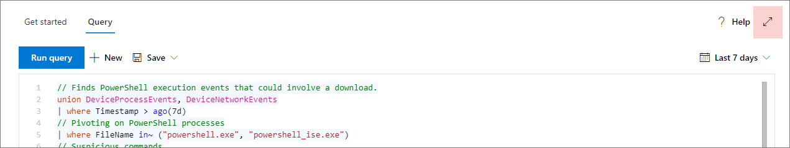

# <a name="learn-the-advanced-hunting-query-language"></a><span data-ttu-id="e197d-104">Erlernen der Abfragesprache für die erweiterte Suche</span><span class="sxs-lookup"><span data-stu-id="e197d-104">Learn the advanced hunting query language</span></span>

[!INCLUDE [Microsoft 365 Defender rebranding](../includes/microsoft-defender.md)]


<span data-ttu-id="e197d-105">**Gilt für:**</span><span class="sxs-lookup"><span data-stu-id="e197d-105">**Applies to:**</span></span>
- <span data-ttu-id="e197d-106">Microsoft 365 Defender</span><span class="sxs-lookup"><span data-stu-id="e197d-106">Microsoft 365 Defender</span></span>

<span data-ttu-id="e197d-107">Die erweiterte Suche basiert auf der [Kusto-Abfragesprache](https://docs.microsoft.com/azure/kusto/query/).</span><span class="sxs-lookup"><span data-stu-id="e197d-107">Advanced hunting is based on the [Kusto query language](https://docs.microsoft.com/azure/kusto/query/).</span></span> <span data-ttu-id="e197d-108">Sie können Kusto-Operatoren und-Anweisungen verwenden, um Abfragen zu erstellen, die Informationen in einem speziellen [Schema](advanced-hunting-schema-tables.md)suchen.</span><span class="sxs-lookup"><span data-stu-id="e197d-108">You can use Kusto operators and statements to construct queries that locate information in a specialized [schema](advanced-hunting-schema-tables.md).</span></span> <span data-ttu-id="e197d-109">Wenn Sie diese Konzepte besser verstehen möchten, führen Sie Ihre erste Abfrage aus.</span><span class="sxs-lookup"><span data-stu-id="e197d-109">To understand these concepts better, run your first query.</span></span>

## <a name="try-your-first-query"></a><span data-ttu-id="e197d-110">Testen Ihrer ersten Abfrage</span><span class="sxs-lookup"><span data-stu-id="e197d-110">Try your first query</span></span>

<span data-ttu-id="e197d-111">Wechseln Sie im Microsoft 365 Security Center zu **Hunting** , um die erste Abfrage auszuführen.</span><span class="sxs-lookup"><span data-stu-id="e197d-111">In Microsoft 365 security center, go to **Hunting** to run your first query.</span></span> <span data-ttu-id="e197d-112">Verwenden Sie das folgende Beispiel:</span><span class="sxs-lookup"><span data-stu-id="e197d-112">Use the following example:</span></span>

```kusto
// Finds PowerShell execution events that could involve a download
union DeviceProcessEvents, DeviceNetworkEvents
| where Timestamp > ago(7d)
// Pivoting on PowerShell processes
| where FileName in~ ("powershell.exe", "powershell_ise.exe")
// Suspicious commands
| where ProcessCommandLine has_any("WebClient",
 "DownloadFile",
 "DownloadData",
 "DownloadString",
"WebRequest",
"Shellcode",
"http",
"https")
| project Timestamp, DeviceName, InitiatingProcessFileName, InitiatingProcessCommandLine, 
FileName, ProcessCommandLine, RemoteIP, RemoteUrl, RemotePort, RemoteIPType
| top 100 by Timestamp
```

<span data-ttu-id="e197d-113">**[Ausführen dieser Abfrage in Advanced Hunting](https://security.microsoft.com/hunting?query=H4sIAAAAAAAEAI2TW0sCURSF93PQfxh8Moisp956yYIgQtLoMaYczJpbzkkTpN_et_dcdPQkcpjbmrXXWftyetKTQG5lKqmMpeB9IJksJJKZDOWdZ8wKeP5wvcm3OLgZbMXmXCmIxjnYIfcAVgYvRi8w3TnfsXEDGAG47pCCZXyP5ViO4KeNbt-Up-hEuJmB6lvButnY8XSL-cDl0M2I-GwxVX8Fe2H5zMzHiKjEVB0eEsnBrszfBIWuXOLrxCJ7VqEBfM3DWUYTkNKrv1p5y3X0jwetemzOQ_NSVuuXZ1c6aNTKRaN8VvWhY9n7OS-o6J5r7mYeQypdEKc1m1qfiqpjCSuspsDntt2J61bEvTlXls5AgQfFl5bHM_gr_BhO2RF1rztoBv2tWahrso_TtzkL93KGMGZVr2pe7eWR-xeZl91f_113UOsx3nDR4Y9j5R6kaCq8ajr_YWfFeedsd27L7it-Z6dAZyxsJq1d9-2ZOSzK3y2NVd8-zUPjtZaJnYsIH4Md7AmdeAcd2Cl1XoURc5PzXlfU8U9P54WcswL6t_TW9Q__qX-xygQAAA&runQuery=true&timeRangeId=week)**</span><span class="sxs-lookup"><span data-stu-id="e197d-113">**[Run this query in advanced hunting](https://security.microsoft.com/hunting?query=H4sIAAAAAAAEAI2TW0sCURSF93PQfxh8Moisp956yYIgQtLoMaYczJpbzkkTpN_et_dcdPQkcpjbmrXXWftyetKTQG5lKqmMpeB9IJksJJKZDOWdZ8wKeP5wvcm3OLgZbMXmXCmIxjnYIfcAVgYvRi8w3TnfsXEDGAG47pCCZXyP5ViO4KeNbt-Up-hEuJmB6lvButnY8XSL-cDl0M2I-GwxVX8Fe2H5zMzHiKjEVB0eEsnBrszfBIWuXOLrxCJ7VqEBfM3DWUYTkNKrv1p5y3X0jwetemzOQ_NSVuuXZ1c6aNTKRaN8VvWhY9n7OS-o6J5r7mYeQypdEKc1m1qfiqpjCSuspsDntt2J61bEvTlXls5AgQfFl5bHM_gr_BhO2RF1rztoBv2tWahrso_TtzkL93KGMGZVr2pe7eWR-xeZl91f_113UOsx3nDR4Y9j5R6kaCq8ajr_YWfFeedsd27L7it-Z6dAZyxsJq1d9-2ZOSzK3y2NVd8-zUPjtZaJnYsIH4Md7AmdeAcd2Cl1XoURc5PzXlfU8U9P54WcswL6t_TW9Q__qX-xygQAAA&runQuery=true&timeRangeId=week)**</span></span>

### <a name="describe-the-query-and-specify-the-tables-to-search"></a><span data-ttu-id="e197d-114">Beschreiben der Abfrage und angeben der zu durchsuchenden Tabellen</span><span class="sxs-lookup"><span data-stu-id="e197d-114">Describe the query and specify the tables to search</span></span>
<span data-ttu-id="e197d-115">Ein kurzer Kommentar zum Anfang der Abfrage wurde hinzugefügt, um zu beschreiben, wofür er verwendet wird.</span><span class="sxs-lookup"><span data-stu-id="e197d-115">A short comment has been added to the beginning of the query to describe what it is for.</span></span> <span data-ttu-id="e197d-116">Dieser Kommentar hilft Ihnen, wenn Sie sich später entscheiden, die Abfrage zu speichern und für andere Personen in Ihrer Organisation freizugeben.</span><span class="sxs-lookup"><span data-stu-id="e197d-116">This comment helps if you later decide to save the query and share it with others in your organization.</span></span> 

```kusto
// Finds PowerShell execution events that could involve a download
```

<span data-ttu-id="e197d-117">Die Abfrage selbst beginnt in der Regel mit einem Tabellennamen, gefolgt von mehreren Elementen, die mit einer Pipe beginnen ( `|` ).</span><span class="sxs-lookup"><span data-stu-id="e197d-117">The query itself will typically start with a table name followed by several elements that start with a pipe (`|`).</span></span> <span data-ttu-id="e197d-118">In diesem Beispiel beginnen wir mit dem Erstellen einer Vereinigung von zwei Tabellen und fügen bei Bedarf weitergeleitete  `DeviceProcessEvents` `DeviceNetworkEvents` Elemente hinzu.</span><span class="sxs-lookup"><span data-stu-id="e197d-118">In this example, we start by creating a union of two tables,  `DeviceProcessEvents` and `DeviceNetworkEvents`, and add piped elements as needed.</span></span>

```kusto
union DeviceProcessEvents, DeviceNetworkEvents
```
### <a name="set-the-time-range"></a><span data-ttu-id="e197d-119">Festlegen des Zeitbereichs</span><span class="sxs-lookup"><span data-stu-id="e197d-119">Set the time range</span></span>
<span data-ttu-id="e197d-120">Das erste piped-Element ist ein Zeitfilter, der auf die vorherigen sieben Tage beschränkt ist.</span><span class="sxs-lookup"><span data-stu-id="e197d-120">The first piped element is a time filter scoped to the previous seven days.</span></span> <span data-ttu-id="e197d-121">Durch die Begrenzung des Zeitbereichs wird sichergestellt, dass Abfragen gut ausgeführt werden, verwaltbare Ergebnisse zurückgegeben werden und keine Zeitüberschreitung auftritt.</span><span class="sxs-lookup"><span data-stu-id="e197d-121">Limiting the time range helps ensure that queries perform well, return manageable results, and don't time out.</span></span>

```kusto
| where Timestamp > ago(7d)
```

### <a name="check-specific-processes"></a><span data-ttu-id="e197d-122">Überprüfen bestimmter Prozesse</span><span class="sxs-lookup"><span data-stu-id="e197d-122">Check specific processes</span></span>
<span data-ttu-id="e197d-123">Auf den Zeitbereich folgt unmittelbar eine Suche nach Prozess Dateinamen, die die PowerShell-Anwendung darstellen.</span><span class="sxs-lookup"><span data-stu-id="e197d-123">The time range is immediately followed by a search for process file names representing the PowerShell application.</span></span>

```kusto
// Pivoting on PowerShell processes
| where FileName in~ ("powershell.exe", "powershell_ise.exe")
```

### <a name="search-for-specific-command-strings"></a><span data-ttu-id="e197d-124">Suchen nach bestimmten Befehlszeichenfolgen</span><span class="sxs-lookup"><span data-stu-id="e197d-124">Search for specific command strings</span></span>
<span data-ttu-id="e197d-125">Anschließend sucht die Abfrage nach Zeichenfolgen in Befehlszeilen, die in der Regel zum Herunterladen von Dateien mithilfe von PowerShell verwendet werden.</span><span class="sxs-lookup"><span data-stu-id="e197d-125">Afterwards, the query looks for strings in command lines that are typically used to download files using PowerShell.</span></span>

```kusto
// Suspicious commands
| where ProcessCommandLine has_any("WebClient",
    "DownloadFile",
    "DownloadData",
    "DownloadString",
    "WebRequest",
    "Shellcode",
    "http",
    "https")
```

### <a name="customize-result-columns-and-length"></a><span data-ttu-id="e197d-126">Anpassen von Ergebnisspalten und-Länge</span><span class="sxs-lookup"><span data-stu-id="e197d-126">Customize result columns and length</span></span> 
<span data-ttu-id="e197d-127">Da Ihre Abfrage nun eindeutig die Daten identifiziert, die Sie suchen möchten, können Sie definieren, wie die Ergebnisse aussehen.</span><span class="sxs-lookup"><span data-stu-id="e197d-127">Now that your query clearly identifies the data you want to locate, you can define what the results look like.</span></span> <span data-ttu-id="e197d-128">`project` gibt bestimmte Spalten zurück und `top` schränkt die Anzahl der Ergebnisse ein.</span><span class="sxs-lookup"><span data-stu-id="e197d-128">`project` returns specific columns, and `top` limits the number of results.</span></span> <span data-ttu-id="e197d-129">Diese Operatoren tragen dazu bei, dass die Ergebnisse gut formatiert und relativ umfangreich und einfach zu verarbeiten sind.</span><span class="sxs-lookup"><span data-stu-id="e197d-129">These operators help ensure the results are well-formatted and reasonably large and easy to process.</span></span>

```kusto
| project Timestamp, DeviceName, InitiatingProcessFileName, InitiatingProcessCommandLine, 
FileName, ProcessCommandLine, RemoteIP, RemoteUrl, RemotePort, RemoteIPType
| top 100 by Timestamp
```

<span data-ttu-id="e197d-130">Wählen Sie **Abfrage ausführen** aus, um die Ergebnisse anzuzeigen.</span><span class="sxs-lookup"><span data-stu-id="e197d-130">Select **Run query** to see the results.</span></span> <span data-ttu-id="e197d-131">Verwenden Sie das Erweiterungssymbol oben rechts im Abfrage-Editor, um sich auf Ihre Jagd Abfrage und die Ergebnisse zu konzentrieren.</span><span class="sxs-lookup"><span data-stu-id="e197d-131">Use the expand icon at the top right of the query editor to focus on your hunting query and the results.</span></span> 



>[!TIP]
><span data-ttu-id="e197d-133">Sie können Abfrageergebnisse als Diagramme anzeigen und Filter schnell anpassen.</span><span class="sxs-lookup"><span data-stu-id="e197d-133">You can view query results as charts and quickly adjust filters.</span></span> <span data-ttu-id="e197d-134">[Informationen zum Arbeiten mit Abfrageergebnissen finden Sie](advanced-hunting-query-results.md) unter Anleitung.</span><span class="sxs-lookup"><span data-stu-id="e197d-134">For guidance, [read about working with query results](advanced-hunting-query-results.md)</span></span>

## <a name="learn-common-query-operators"></a><span data-ttu-id="e197d-135">Erlernen allgemeiner Abfrageoperatoren</span><span class="sxs-lookup"><span data-stu-id="e197d-135">Learn common query operators</span></span>

<span data-ttu-id="e197d-136">Sie haben soeben die erste Abfrage ausgeführt und haben eine allgemeine Vorstellung von deren Komponenten.</span><span class="sxs-lookup"><span data-stu-id="e197d-136">You've just run your first query and have a general idea of its components.</span></span> <span data-ttu-id="e197d-137">Es ist an der Zeit, etwas zu BackTrack und einige Grundlagen zu erfahren.</span><span class="sxs-lookup"><span data-stu-id="e197d-137">It's time to backtrack slightly and learn some basics.</span></span> <span data-ttu-id="e197d-138">Die von der erweiterten Suche verwendete Kusto-Abfragesprache unterstützt eine Reihe von Operatoren, darunter die folgenden allgemeinen Operatoren.</span><span class="sxs-lookup"><span data-stu-id="e197d-138">The Kusto query language used by advanced hunting supports a range of operators, including the following common ones.</span></span>

| <span data-ttu-id="e197d-139">Operator</span><span class="sxs-lookup"><span data-stu-id="e197d-139">Operator</span></span> | <span data-ttu-id="e197d-140">Beschreibung und Verwendung</span><span class="sxs-lookup"><span data-stu-id="e197d-140">Description and usage</span></span> |
|--|--|
| `where` | <span data-ttu-id="e197d-141">Filtern einer Tabelle auf die Teilmenge von Zeilen, die einem Prädikat entsprechen.</span><span class="sxs-lookup"><span data-stu-id="e197d-141">Filter a table to the subset of rows that satisfy a predicate.</span></span> |
| `summarize` | <span data-ttu-id="e197d-142">Erstellen einer Tabelle, in der die Inhalte der Eingabetabelle gesammelt werden.</span><span class="sxs-lookup"><span data-stu-id="e197d-142">Produce a table that aggregates the content of the input table.</span></span> |
| `join` | <span data-ttu-id="e197d-143">Zusammenführen der Zeilen von zwei Tabellen, um eine neue Tabelle zu erstellen, indem Werte der angegebenen Spalten aus jeder Tabelle zugeordnet werden.</span><span class="sxs-lookup"><span data-stu-id="e197d-143">Merge the rows of two tables to form a new table by matching values of the specified column(s) from each table.</span></span> |
| `count` | <span data-ttu-id="e197d-144">Zurückgeben der Anzahl von Datensätzen im Eingabedatensatz.</span><span class="sxs-lookup"><span data-stu-id="e197d-144">Return the number of records in the input record set.</span></span> |
| `top` | <span data-ttu-id="e197d-145">Zurückgeben der ersten n Einträge, sortiert anhand der angegebenen Spalten.</span><span class="sxs-lookup"><span data-stu-id="e197d-145">Return the first N records sorted by the specified columns.</span></span> |
| `limit` | <span data-ttu-id="e197d-146">Zurückkehren nach oben zur angegebenen Zeilenanzahl.</span><span class="sxs-lookup"><span data-stu-id="e197d-146">Return up to the specified number of rows.</span></span> |
| `project` | <span data-ttu-id="e197d-147">Auswählen der Spalten, um neue berechnete Spalten aufzunehmen, umzubenennen, zu löschen oder einzufügen.</span><span class="sxs-lookup"><span data-stu-id="e197d-147">Select the columns to include, rename or drop, and insert new computed columns.</span></span> |
| `extend` | <span data-ttu-id="e197d-148">Erstellen von berechneten Spalten und Anfügen an das Resultset.</span><span class="sxs-lookup"><span data-stu-id="e197d-148">Create calculated columns and append them to the result set.</span></span> |
| `makeset` |  <span data-ttu-id="e197d-149">Zurückgeben eines dynamischen (JSON)-Arrays der Gruppe eindeutiger Werte, die der Ausdruck in der Gruppe verwendet.</span><span class="sxs-lookup"><span data-stu-id="e197d-149">Return a dynamic (JSON) array of the set of distinct values that Expr takes in the group.</span></span> |
| `find` | <span data-ttu-id="e197d-150">Suchen von Zeilen, die mit einem Prädikat über eine Reihe von Tabellen hinweg übereinstimmen.</span><span class="sxs-lookup"><span data-stu-id="e197d-150">Find rows that match a predicate across a set of tables.</span></span> |

<span data-ttu-id="e197d-151">Wenn Sie ein Beispiel für diese Operatoren sehen möchten, führen Sie diese im Abschnitt **Erste Schritte** in der erweiterten Suche aus.</span><span class="sxs-lookup"><span data-stu-id="e197d-151">To see a live example of these operators, run them from the **Get started** section in advanced hunting.</span></span>

## <a name="understand-data-types"></a><span data-ttu-id="e197d-152">Grundlegendes zu Datentypen</span><span class="sxs-lookup"><span data-stu-id="e197d-152">Understand data types</span></span>

<span data-ttu-id="e197d-153">Advanced Hunting unterstützt Kusto-Datentypen, einschließlich der folgenden gängigen Typen:</span><span class="sxs-lookup"><span data-stu-id="e197d-153">Advanced hunting supports Kusto data types, including the following common types:</span></span>

| <span data-ttu-id="e197d-154">Datentyp</span><span class="sxs-lookup"><span data-stu-id="e197d-154">Data type</span></span> | <span data-ttu-id="e197d-155">Beschreibung und Auswirkungen der Abfrage</span><span class="sxs-lookup"><span data-stu-id="e197d-155">Description and query implications</span></span> |
|--|--|
| `datetime` | <span data-ttu-id="e197d-156">Daten-und Zeit Informationen, die in der Regel ereigniszeitstempel darstellen.</span><span class="sxs-lookup"><span data-stu-id="e197d-156">Data and time information typically representing event timestamps.</span></span> [<span data-ttu-id="e197d-157">Siehe Unterstützte DateTime-Formate</span><span class="sxs-lookup"><span data-stu-id="e197d-157">See supported datetime formats</span></span>](https://docs.microsoft.com/azure/data-explorer/kusto/query/scalar-data-types/datetime) |
| `string` | <span data-ttu-id="e197d-158">Zeichenfolge in UTF-8, die in Apostrophen ( `'` ) oder Anführungszeichen () eingeschlossen ist `"` .</span><span class="sxs-lookup"><span data-stu-id="e197d-158">Character string in UTF-8 enclosed in single quotes (`'`) or double quotes (`"`).</span></span> [<span data-ttu-id="e197d-159">Lesen Sie mehr über Zeichenfolgen</span><span class="sxs-lookup"><span data-stu-id="e197d-159">Read more about strings</span></span>](https://docs.microsoft.com/azure/data-explorer/kusto/query/scalar-data-types/string) |
| `bool` | <span data-ttu-id="e197d-160">Dieser Datentyp unterstützt `true` oder `false` besagt.</span><span class="sxs-lookup"><span data-stu-id="e197d-160">This data type supports `true` or `false` states.</span></span> [<span data-ttu-id="e197d-161">Siehe unterstützte Literale und Operatoren</span><span class="sxs-lookup"><span data-stu-id="e197d-161">See supported literals and operators</span></span>](https://docs.microsoft.com/azure/data-explorer/kusto/query/scalar-data-types/bool) |
| `int` | <span data-ttu-id="e197d-162">32-Bit-Ganzzahl</span><span class="sxs-lookup"><span data-stu-id="e197d-162">32-bit integer</span></span>  |
| `long` | <span data-ttu-id="e197d-163">64-Bit-Ganzzahl</span><span class="sxs-lookup"><span data-stu-id="e197d-163">64-bit integer</span></span> |

<span data-ttu-id="e197d-164">Weitere Informationen zu diesen Datentypen finden [Sie unter Kusto Scalar Data Types](https://docs.microsoft.com/azure/data-explorer/kusto/query/scalar-data-types/).</span><span class="sxs-lookup"><span data-stu-id="e197d-164">To learn more about these data types, [read about Kusto scalar data types](https://docs.microsoft.com/azure/data-explorer/kusto/query/scalar-data-types/).</span></span>

## <a name="get-help-as-you-write-queries"></a><span data-ttu-id="e197d-165">Hilfe beim Schreiben von Abfragen</span><span class="sxs-lookup"><span data-stu-id="e197d-165">Get help as you write queries</span></span>
<span data-ttu-id="e197d-166">Nutzen Sie die folgenden Funktionen, um Abfragen schneller zu schreiben:</span><span class="sxs-lookup"><span data-stu-id="e197d-166">Take advantage of the following functionality to write queries faster:</span></span>
- <span data-ttu-id="e197d-167">**AutoSuggest** – beim Schreiben von Abfragen stellt Advanced Hunting Vorschläge von IntelliSense zur Verfügung.</span><span class="sxs-lookup"><span data-stu-id="e197d-167">**Autosuggest** —as you write queries, advanced hunting provides suggestions from IntelliSense.</span></span> 
- <span data-ttu-id="e197d-168">**Schemastruktur** : eine Schemadarstellung, die die Liste der Tabellen und deren Spalten enthält, wird neben dem Arbeitsbereich bereitgestellt.</span><span class="sxs-lookup"><span data-stu-id="e197d-168">**Schema tree** —a schema representation that includes the list of tables and their columns is provided next to your working area.</span></span> <span data-ttu-id="e197d-169">Wenn Sie weitere Informationen erhalten möchten, zeigen Sie mit dem Mauszeiger auf ein Element.</span><span class="sxs-lookup"><span data-stu-id="e197d-169">For more information, hover over an item.</span></span> <span data-ttu-id="e197d-170">Doppelklicken Sie auf ein Element, um es im Abfrage-Editor einzufügen.</span><span class="sxs-lookup"><span data-stu-id="e197d-170">Double-click an item to insert it to the query editor.</span></span>
- <span data-ttu-id="e197d-171">**[Schema Referenz](advanced-hunting-schema-tables.md#get-schema-information-in-the-security-center)** – in-Portal-Referenz mit Tabellen-und Spaltenbeschreibungen sowie unterstützten Ereignistypen ( `ActionType` Werte) und Beispielabfragen</span><span class="sxs-lookup"><span data-stu-id="e197d-171">**[Schema reference](advanced-hunting-schema-tables.md#get-schema-information-in-the-security-center)** —in-portal reference with table and column descriptions as well as supported event types (`ActionType` values) and sample queries</span></span>

## <a name="work-with-multiple-queries-in-the-editor"></a><span data-ttu-id="e197d-172">Arbeiten mit mehreren Abfragen im Editor</span><span class="sxs-lookup"><span data-stu-id="e197d-172">Work with multiple queries in the editor</span></span>
<span data-ttu-id="e197d-173">Sie können den Abfrage-Editor verwenden, um mit mehreren Abfragen zu experimentieren.</span><span class="sxs-lookup"><span data-stu-id="e197d-173">You can use the query editor to experiment with multiple queries.</span></span> <span data-ttu-id="e197d-174">So verwenden Sie mehrere Abfragen:</span><span class="sxs-lookup"><span data-stu-id="e197d-174">To use multiple queries:</span></span>

- <span data-ttu-id="e197d-175">Trennen Sie jede Abfrage durch eine leere Textreihe.</span><span class="sxs-lookup"><span data-stu-id="e197d-175">Separate each query with an empty line.</span></span>
- <span data-ttu-id="e197d-176">Platzieren Sie den Cursor auf einem beliebigen Teil einer Abfrage, um diese Abfrage vor dem Ausführen auszuwählen.</span><span class="sxs-lookup"><span data-stu-id="e197d-176">Place the cursor on any part of a query to select that query before running it.</span></span> <span data-ttu-id="e197d-177">Dadurch wird nur die ausgewählte Abfrage ausgeführt.</span><span class="sxs-lookup"><span data-stu-id="e197d-177">This will run only the selected query.</span></span> <span data-ttu-id="e197d-178">Wenn Sie eine andere Abfrage ausführen möchten, bewegen Sie den Cursor entsprechend, und wählen Sie **Abfrage ausführen** aus.</span><span class="sxs-lookup"><span data-stu-id="e197d-178">To run another query, move the cursor accordingly and select **Run query**.</span></span>


## <a name="use-sample-queries"></a><span data-ttu-id="e197d-180">Verwenden von Beispielabfragen</span><span class="sxs-lookup"><span data-stu-id="e197d-180">Use sample queries</span></span>

<span data-ttu-id="e197d-181">Der Abschnitt **Erste Schritte** bietet einige einfache Abfragen mit häufig verwendeten Operatoren.</span><span class="sxs-lookup"><span data-stu-id="e197d-181">The **Get started** section provides a few simple queries using commonly used operators.</span></span> <span data-ttu-id="e197d-182">Versuchen Sie, diese Abfragen auszuführen und kleine Änderungen daran vorzunehmen.</span><span class="sxs-lookup"><span data-stu-id="e197d-182">Try running these queries and making small modifications to them.</span></span>


>[!NOTE]
><span data-ttu-id="e197d-184">Abgesehen von den einfachen Abfragebeispielen können Sie auch auf [freigegebene Abfragen](advanced-hunting-shared-queries.md) für bestimmte Szenarien zur Bedrohungssuche zugreifen.</span><span class="sxs-lookup"><span data-stu-id="e197d-184">Apart from the basic query samples, you can also access [shared queries](advanced-hunting-shared-queries.md) for specific threat hunting scenarios.</span></span> <span data-ttu-id="e197d-185">Erkunden Sie die freigegebenen Abfragen auf der linken Seite oder im [GitHub-Abfrage-Repository](https://aka.ms/hunting-queries).</span><span class="sxs-lookup"><span data-stu-id="e197d-185">Explore the shared queries on the left side of the page or the [GitHub query repository](https://aka.ms/hunting-queries).</span></span>

## <a name="access-query-language-documentation"></a><span data-ttu-id="e197d-186">Zugreifen auf die Dokumentation zur Abfragesprache</span><span class="sxs-lookup"><span data-stu-id="e197d-186">Access query language documentation</span></span>

<span data-ttu-id="e197d-187">Weitere Informationen zur Kusto-Abfragesprache und zu unterstützten Operatoren finden Sie unter [Dokumentation zur Kusto-Abfragesprache](https://docs.microsoft.com/azure/kusto/query/).</span><span class="sxs-lookup"><span data-stu-id="e197d-187">For more information on Kusto query language and supported operators, see [Kusto query language documentation](https://docs.microsoft.com/azure/kusto/query/).</span></span>

## <a name="related-topics"></a><span data-ttu-id="e197d-188">Verwandte Themen</span><span class="sxs-lookup"><span data-stu-id="e197d-188">Related topics</span></span>
- [<span data-ttu-id="e197d-189">Übersicht über die erweiterte Suche</span><span class="sxs-lookup"><span data-stu-id="e197d-189">Advanced hunting overview</span></span>](advanced-hunting-overview.md)
- [<span data-ttu-id="e197d-190">Arbeiten mit Abfrageergebnissen</span><span class="sxs-lookup"><span data-stu-id="e197d-190">Work with query results</span></span>](advanced-hunting-query-results.md)
- [<span data-ttu-id="e197d-191">Verwenden freigegebener Abfragen</span><span class="sxs-lookup"><span data-stu-id="e197d-191">Use shared queries</span></span>](advanced-hunting-shared-queries.md)
- [<span data-ttu-id="e197d-192">Suchen auf Geräten, in E-Mails, Apps und Identitäten</span><span class="sxs-lookup"><span data-stu-id="e197d-192">Hunt across devices, emails, apps, and identities</span></span>](advanced-hunting-query-emails-devices.md)
- [<span data-ttu-id="e197d-193">Grundlegendes zum Schema</span><span class="sxs-lookup"><span data-stu-id="e197d-193">Understand the schema</span></span>](advanced-hunting-schema-tables.md)
- [<span data-ttu-id="e197d-194">Anwenden bewährter Methoden für Abfragen</span><span class="sxs-lookup"><span data-stu-id="e197d-194">Apply query best practices</span></span>](advanced-hunting-best-practices.md)
