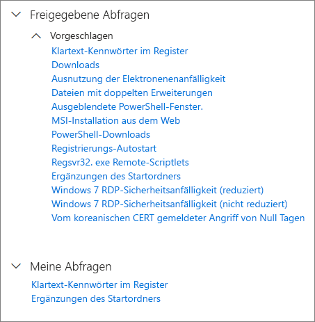
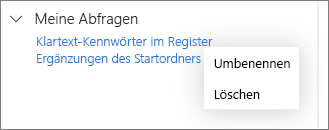

# Verwenden von freigegebenen Abfragen bei der erweiterten SucheUse shared queries in advanced hunting

**Gilt für:****Applies to:**
- Microsoft-BedrohungsschutzMicrosoft Threat Protection

[!include[Prerelease information](prerelease.md)]

[Erweiterte Suche](advanced-hunting-overview.md)-Abfragen können von Benutzern derselben Organisation geteilt werden.[Advanced hunting](advanced-hunting-overview.md) queries can be shared among users in the same organization. Sie können öffentlich freigegebene Abfragen auch auf GitHub finden.You can also find queries shared publicly on GitHub. Mit diesen Abfragen können Sie bestimmte Bedrohungsszenarien schnell verfolgen, ohne dass Sie Abfragen von Grund auf neu erstellen müssen.These queries let you quickly pursue specific threat hunting scenarios without having to write queries from scratch.

## Speichern, Ändern und Freigeben einer AbfrageSave, modify, and share a query
Sie können eine neue oder vorhandene Abfrage so speichern, dass Sie nur für Sie zugänglich oder für andere Benutzer in Ihrer Organisation freigegeben ist.You can save a new or existing query so that it is only accessible to you or shared with other users in your organization. 

1. Erstellen oder Ändern einer Abfrage.Create or modify a lookup table 

2. Klicken Sie auf die Dropdownschaltfläche **Abfrage speichern**, und wählen Sie **Speichern unter**aus.Click the **Save query** drop-down button and select **Save as**.
    
3. Geben Sie einen Namen für die Abfrage ein.Enter a descriptive name for the connection. 

   

4. Wählen Sie den Ordner aus, in dem Sie die Abfrage speichern möchten.Select the folder where you'd like to save the query.
    - **Freigegebene Abfragen** – für alle Benutzer in Ihrer Organisation freigegeben**Shared queries** — shared to all users your organization
    - **Meine Abfragen** – nur für Sie zugänglich**My queries** — accessible only to you
    
5. Klicken Sie auf **Speichern**.Select **Save**. 

## Löschen oder Umbenennen einer AbfrageDelete or rename a query
1. Klicken Sie mit der rechten Maustaste auf eine Abfrage, die Sie umbenennen oder löschen möchten.Right-click on a query you want to rename or delete.

    

2. Wählen Sie **Löschen** aus, und bestätigen Sie Löschung.Select **Delete** and confirm deletion. Oder wählen Sie **Umbenennen** aus und geben Sie einen neuen Namen für die Abfrage ein.Or select **Rename** and provide a new name for the query.

## Access-Abfragen im GitHub-RepositoryAccess queries in the GitHub repository  
Microsoft-Sicherheitsexperten Teilen regelmäßig Abfragen zur erweiterten Suche in einem [dazu vorgesehenen öffentlichen Repository auf GitHub](https://github.com/microsoft/MTP-AHQ).Microsoft security researchers regularly share advanced hunting queries in a [designated public repository on GitHub](https://github.com/microsoft/MTP-AHQ). Dieses Repository ist für Beiträge geöffnet.This repository is open to contributions. Um dazu beizutragen, [treten Sie GitHub kostenlos bei](https://github.com/).To contribute, [join GitHub for free](https://github.com/).

>[!tip]
>Microsoft-Sicherheitsexperten stellen zudem Abfragen zur erweiterten Suche bereit, mit denen Sie Aktivitäten und Indikatoren finden können, die mit neuen Bedrohungen verbunden sind.Microsoft security researchers also provide advanced hunting queries that you can use to locate activities and indicators associated with emerging threats. Diese Abfragen werden als Bestandteil der [Bedrohungsanalyse](https://docs.microsoft.com/windows/security/threat-protection/microsoft-defender-atp/threat-analytics)-Berichte im Microsoft Defender Security Center bereitgestellt.These queries are provided as part of the [threat analytics](https://docs.microsoft.com/windows/security/threat-protection/microsoft-defender-atp/threat-analytics) reports in Microsoft Defender Security Center.

## Verwandte ThemenRelated topics
- [Vorbeugende Suche nach BedrohungenProactively hunt for threats](advanced-hunting-overview.md)
- [Lernen der AbfragespracheLearn the query language](advanced-hunting-query-language.md)
- [Suche nach Bedrohungen auf Geräten und in E-MailsHunt for threats across devices and emails](advanced-hunting-query-emails-devices.md)
- [Grundlegendes zum SchemaUnderstand the schema](advanced-hunting-schema-tables.md)
- [Anwenden bewährter Methoden für AbfragenApply query best practices](advanced-hunting-best-practices.md)