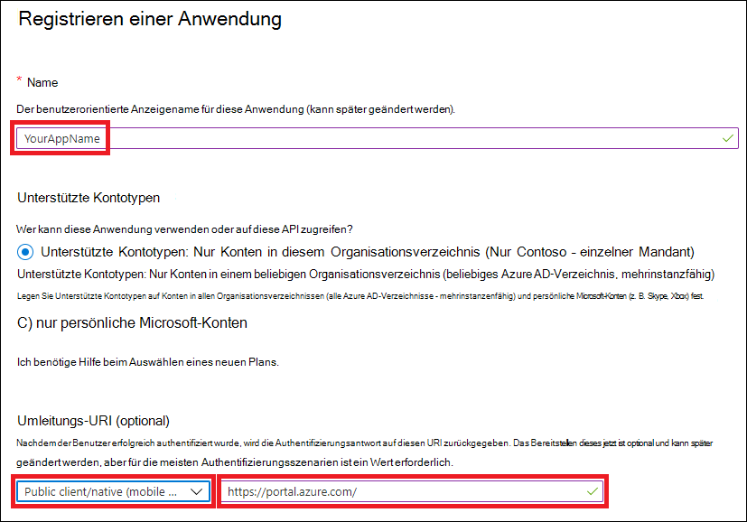
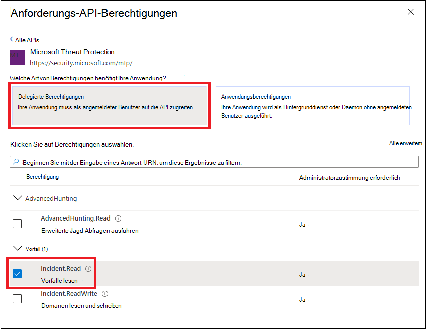

# <a name="access-microsoft-threat-protection-apis-on-behalf-of-user"></a><span data-ttu-id="f0dd2-104">Zugriff auf Microsoft Threat Protection-APIs im Namen des Benutzers</span><span class="sxs-lookup"><span data-stu-id="f0dd2-104">Access Microsoft Threat Protection APIs on behalf of user</span></span>

<span data-ttu-id="f0dd2-105">**Gilt für:**</span><span class="sxs-lookup"><span data-stu-id="f0dd2-105">**Applies to:**</span></span>
- <span data-ttu-id="f0dd2-106">Microsoft Threat Protection</span><span class="sxs-lookup"><span data-stu-id="f0dd2-106">Microsoft Threat Protection</span></span>

>[!IMPORTANT] 
><span data-ttu-id="f0dd2-107">Einige Informationen beziehen sich auf Vorabversionen von Produkten, die vor der kommerziellen Veröffentlichung noch erheblich geändert werden können.</span><span class="sxs-lookup"><span data-stu-id="f0dd2-107">Some information relates to prereleased product which may be substantially modified before it's commercially released.</span></span> <span data-ttu-id="f0dd2-108">Microsoft übernimmt mit diesen Informationen keinerlei Gewährleistung, sei sie ausdrücklich oder konkludent.</span><span class="sxs-lookup"><span data-stu-id="f0dd2-108">Microsoft makes no warranties, express or implied, with respect to the information provided here.</span></span>


<span data-ttu-id="f0dd2-109">Auf dieser Seite wird beschrieben, wie Sie eine Anwendung erstellen, um den programmgesteuerten Zugriff auf Microsoft Threat Protection im Namen eines Benutzers zu erhalten.</span><span class="sxs-lookup"><span data-stu-id="f0dd2-109">This page describes how to create an application to get programmatic access to Microsoft Threat Protection on behalf of a user.</span></span>

<span data-ttu-id="f0dd2-110">Wenn Sie den programmgesteuerten Zugriff auf Microsoft Threat Protection ohne Benutzer benötigen, finden Sie weitere Informationen unter [Erstellen einer APP für den Zugriff auf Microsoft Threat Protection ohne Benutzer](api-create-app-web.md).</span><span class="sxs-lookup"><span data-stu-id="f0dd2-110">If you need programmatic access Microsoft Threat Protection without a user, refer to [Create an app to access Microsoft Threat Protection without a user](api-create-app-web.md).</span></span>

<span data-ttu-id="f0dd2-111">Wenn Sie nicht sicher sind, welchen Zugriff Sie benötigen, lesen Sie den [Zugriff auf die Microsoft Threat Protection-APIs](api-access.md).</span><span class="sxs-lookup"><span data-stu-id="f0dd2-111">If you are not sure which access you need, read the [Access the Microsoft Threat Protection APIs](api-access.md).</span></span>

<span data-ttu-id="f0dd2-112">Microsoft Threat Protection macht einen Großteil seiner Daten und Aktionen über eine Reihe von programmgesteuerten APIs verfügbar.</span><span class="sxs-lookup"><span data-stu-id="f0dd2-112">Microsoft Threat Protection exposes much of its data and actions through a set of programmatic APIs.</span></span> <span data-ttu-id="f0dd2-113">Mit diesen APIs können Sie Arbeitsabläufe und Innovationen basierend auf den Microsoft Threat Protection-Funktionen automatisieren.</span><span class="sxs-lookup"><span data-stu-id="f0dd2-113">Those APIs will enable you to automate work flows and innovate based on Microsoft Threat Protection capabilities.</span></span> <span data-ttu-id="f0dd2-114">Für den API-Zugriff ist die OAuth 2.0-Authentifizierung erforderlich.</span><span class="sxs-lookup"><span data-stu-id="f0dd2-114">The API access requires OAuth2.0 authentication.</span></span> <span data-ttu-id="f0dd2-115">Weitere Informationen finden Sie unter [OAuth 2,0-Autorisierungs Code Fluss](https://docs.microsoft.com/azure/active-directory/develop/active-directory-v2-protocols-oauth-code).</span><span class="sxs-lookup"><span data-stu-id="f0dd2-115">For more information, see [OAuth 2.0 Authorization Code Flow](https://docs.microsoft.com/azure/active-directory/develop/active-directory-v2-protocols-oauth-code).</span></span>

<span data-ttu-id="f0dd2-116">Im Allgemeinen müssen Sie die folgenden Schritte ausführen, um die APIs zu verwenden:</span><span class="sxs-lookup"><span data-stu-id="f0dd2-116">In general, you’ll need to take the following steps to use the APIs:</span></span>
- <span data-ttu-id="f0dd2-117">Erstellen einer Aad-Anwendung</span><span class="sxs-lookup"><span data-stu-id="f0dd2-117">Create an AAD application</span></span>
- <span data-ttu-id="f0dd2-118">Abrufen eines Zugriffstokens mithilfe dieser Anwendung</span><span class="sxs-lookup"><span data-stu-id="f0dd2-118">Get an access token using this application</span></span>
- <span data-ttu-id="f0dd2-119">Verwenden des Tokens für den Zugriff auf die Microsoft Threat Protection-API</span><span class="sxs-lookup"><span data-stu-id="f0dd2-119">Use the token to access Microsoft Threat Protection API</span></span>

<span data-ttu-id="f0dd2-120">Auf dieser Seite wird erklärt, wie Sie eine Aad-Anwendung erstellen, ein Zugriffstoken für Microsoft Threat Protection abrufen und das Token überprüfen.</span><span class="sxs-lookup"><span data-stu-id="f0dd2-120">This page explains how to create an AAD application, get an access token to Microsoft Threat Protection and validate the token.</span></span>

>[!NOTE]
> <span data-ttu-id="f0dd2-121">Wenn Sie im Namen eines Benutzers auf die Microsoft Threat Protection-API zugreifen, benötigen Sie die richtige Anwendungs-und Benutzerberechtigung.</span><span class="sxs-lookup"><span data-stu-id="f0dd2-121">When accessing Microsoft Threat Protection API on behalf of a user, you will need the correct Application permission and user permission.</span></span>


>[!TIP]
> <span data-ttu-id="f0dd2-122">Wenn Sie über die Berechtigung zum Ausführen einer Aktion im Portal verfügen, haben Sie die Berechtigung, die Aktion in der API auszuführen.</span><span class="sxs-lookup"><span data-stu-id="f0dd2-122">If you have the permission to perform an action in the portal, you have the permission to perform the action in the API.</span></span>

## <a name="create-an-app"></a><span data-ttu-id="f0dd2-123">Erstellen einer APP</span><span class="sxs-lookup"><span data-stu-id="f0dd2-123">Create an app</span></span>

1. <span data-ttu-id="f0dd2-124">Melden Sie sich bei [Azure](https://portal.azure.com) mit dem Benutzer an, der über eine **globale Administrator** Rolle verfügt.</span><span class="sxs-lookup"><span data-stu-id="f0dd2-124">Log on to [Azure](https://portal.azure.com) with user that has **Global Administrator** role.</span></span>

2. <span data-ttu-id="f0dd2-125">Navigieren Sie zu **Azure Active Directory**  >  **App Registrations**  >  **New Registration**.</span><span class="sxs-lookup"><span data-stu-id="f0dd2-125">Navigate to **Azure Active Directory** > **App registrations** > **New registration**.</span></span> 

   

3. <span data-ttu-id="f0dd2-127">Geben Sie im Feld Registrierung von die folgenden Informationen ein, und klicken Sie dann auf **registrieren**.</span><span class="sxs-lookup"><span data-stu-id="f0dd2-127">In the registration from, enter the following information then click **Register**.</span></span>

   

   - <span data-ttu-id="f0dd2-129">**Name:** Name Ihrer Anwendung</span><span class="sxs-lookup"><span data-stu-id="f0dd2-129">**Name:** Your application name</span></span>
   - <span data-ttu-id="f0dd2-130">**Anwendungstyp:** Öffentlicher Client</span><span class="sxs-lookup"><span data-stu-id="f0dd2-130">**Application type:** Public client</span></span>
   - <span data-ttu-id="f0dd2-131">**Umleitungs-URI:**https://portal.azure.com</span><span class="sxs-lookup"><span data-stu-id="f0dd2-131">**Redirect URI:** https://portal.azure.com</span></span>

4. <span data-ttu-id="f0dd2-132">Um Ihrer APP den Zugriff auf Microsoft Threat Protection und das Zuweisen von IT-Berechtigungen zu ermöglichen, wählen Sie auf Ihrer Anwendungsseite **API-Berechtigungen**  >  **Add permission**  >  **APIs meine Organisation verwendet** > aus, geben Sie **Microsoft Threat Protection**ein, und wählen Sie dann **Microsoft Threat Protection**aus.</span><span class="sxs-lookup"><span data-stu-id="f0dd2-132">To enable your app to access Microsoft Threat Protection and assign it permissions, on your application page, select **API Permissions** > **Add permission** > **APIs my organization uses** >, type **Microsoft Threat Protection**, and then select **Microsoft Threat Protection**.</span></span>

    >[!NOTE]
    > <span data-ttu-id="f0dd2-133">Microsoft Threat Protection wird nicht in der ursprünglichen Liste angezeigt.</span><span class="sxs-lookup"><span data-stu-id="f0dd2-133">Microsoft Threat Protection does not appear in the original list.</span></span> <span data-ttu-id="f0dd2-134">Sie müssen mit dem Schreiben des Namens in das Textfeld beginnen, damit dieser angezeigt wird.</span><span class="sxs-lookup"><span data-stu-id="f0dd2-134">You need to start writing its name in the text box to see it appear.</span></span>

      

    - <span data-ttu-id="f0dd2-136">Wählen Sie **Delegierte Berechtigungen** > wählen Sie die entsprechenden Berechtigungen für Ihr Szenario aus, beispielsweise **Incident. Read**, und wählen Sie dann **Berechtigungen hinzufügen**aus.</span><span class="sxs-lookup"><span data-stu-id="f0dd2-136">Choose **Delegated permissions** > Choose the relevant permissions for your scenario, e.g. **Incident.Read**, and then select **Add permissions**.</span></span>

      

     >[!IMPORTANT]
     ><span data-ttu-id="f0dd2-138">Sie müssen die entsprechenden Berechtigungen auswählen.</span><span class="sxs-lookup"><span data-stu-id="f0dd2-138">You need to select the relevant permissions.</span></span> 

    -  <span data-ttu-id="f0dd2-139">Um zu ermitteln, welche Berechtigungen Sie benötigen, sehen Sie sich den Abschnitt **Berechtigungen** in der API an, die Sie aufrufen möchten.</span><span class="sxs-lookup"><span data-stu-id="f0dd2-139">To determine which permission you need, please look at the **Permissions** section in the API you are interested to call.</span></span>

    - <span data-ttu-id="f0dd2-140">Klicken Sie auf **Zustimmung erteilen** .</span><span class="sxs-lookup"><span data-stu-id="f0dd2-140">Click **Grant consent**</span></span>

      >[!NOTE]
      ><span data-ttu-id="f0dd2-141">Jedes Mal, wenn Sie die Berechtigung hinzufügen, müssen Sie auf **Zustimmung erteilen** klicken, damit die neue Berechtigung wirksam wird.</span><span class="sxs-lookup"><span data-stu-id="f0dd2-141">Every time you add permission you must click on **Grant consent** for the new permission to take effect.</span></span>

      

6. <span data-ttu-id="f0dd2-143">Notieren Sie Ihre Anwendungs-ID und ihre Mandanten-ID:</span><span class="sxs-lookup"><span data-stu-id="f0dd2-143">Write down your application ID and your tenant ID:</span></span>

   - <span data-ttu-id="f0dd2-144">Wechseln Sie auf der Seite der Anwendung zu **Übersicht** , und kopieren Sie Folgendes:</span><span class="sxs-lookup"><span data-stu-id="f0dd2-144">On your application page, go to **Overview** and copy the following:</span></span>

   


## <a name="get-an-access-token-using-powershell"></a><span data-ttu-id="f0dd2-146">Abrufen eines Zugriffstokens mithilfe von PowerShell</span><span class="sxs-lookup"><span data-stu-id="f0dd2-146">Get an access token using PowerShell</span></span>

```
#Install the ADAL.PS package if it's not installed.
if(!(Get-Package adal.ps)) { Install-Package -Name adal.ps }

$authority = "https://login.windows.net/{tenant-id}" # replace {tenant-id} with your tenant ID.

$clientId = "{application-id}" #replace {application-id} with your application ID.

$redirectUri = "{redirect-uri}" # replace {redirect-uri} with your application redirect URI.

$resourceUrl = "https://api.security.microsoft.com"

$response = Get-ADALToken -Resource $resourceUrl -ClientId $clientId -RedirectUri $redirectUri -Authority $authority -PromptBehavior:Always
$response.AccessToken | clip
$response.AccessToken
```

## <a name="related-topics"></a><span data-ttu-id="f0dd2-147">Verwandte Themen</span><span class="sxs-lookup"><span data-stu-id="f0dd2-147">Related topics</span></span>
- [<span data-ttu-id="f0dd2-148">Zugreifen auf die Microsoft Threat Protection-APIs</span><span class="sxs-lookup"><span data-stu-id="f0dd2-148">Access the Microsoft Threat Protection APIs</span></span>](api-access.md)
- [<span data-ttu-id="f0dd2-149">Zugriff auf Microsoft Threat Protection mit Anwendungskontext</span><span class="sxs-lookup"><span data-stu-id="f0dd2-149">Access  Microsoft Threat Protection with application context</span></span>](api-create-app-web.md)
