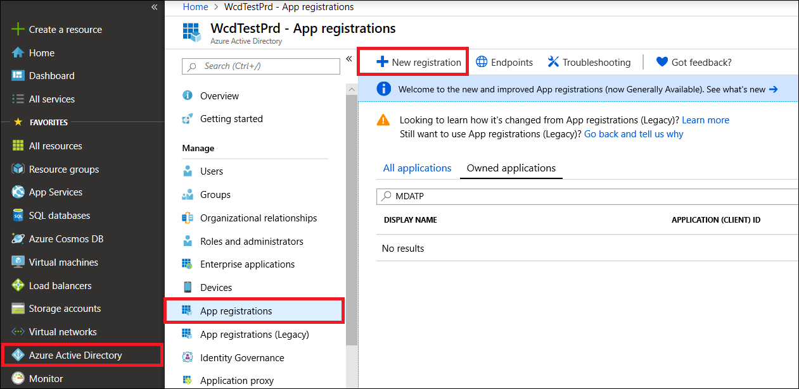

# <a name="create-an-app-to-access-microsoft-threat-protection-without-a-user"></a><span data-ttu-id="0f99e-104">Erstellen einer APP für den Zugriff auf Microsoft Threat Protection ohne Benutzer</span><span class="sxs-lookup"><span data-stu-id="0f99e-104">Create an app to access Microsoft Threat Protection without a user</span></span>

[!INCLUDE [Microsoft 365 Defender rebranding](../includes/microsoft-defender.md)]


<span data-ttu-id="0f99e-105">**Gilt für:**</span><span class="sxs-lookup"><span data-stu-id="0f99e-105">**Applies to:**</span></span>
- <span data-ttu-id="0f99e-106">Microsoft Threat Protection</span><span class="sxs-lookup"><span data-stu-id="0f99e-106">Microsoft Threat Protection</span></span>

>[!IMPORTANT] 
><span data-ttu-id="0f99e-107">Einige Informationen beziehen sich auf Vorabversionen von Produkten, die vor der kommerziellen Veröffentlichung noch erheblich geändert werden können.</span><span class="sxs-lookup"><span data-stu-id="0f99e-107">Some information relates to prereleased product which may be substantially modified before it's commercially released.</span></span> <span data-ttu-id="0f99e-108">Microsoft übernimmt mit diesen Informationen keinerlei Gewährleistung, sei sie ausdrücklich oder konkludent.</span><span class="sxs-lookup"><span data-stu-id="0f99e-108">Microsoft makes no warranties, express or implied, with respect to the information provided here.</span></span>

<span data-ttu-id="0f99e-109">Auf dieser Seite wird beschrieben, wie Sie eine Anwendung erstellen, um den programmgesteuerten Zugriff auf Microsoft Threat Protection ohne Benutzer zu erhalten.</span><span class="sxs-lookup"><span data-stu-id="0f99e-109">This page describes how to create an application to get programmatic access to Microsoft Threat Protection without a user.</span></span> <span data-ttu-id="0f99e-110">Wenn Sie im Namen eines Benutzers programmgesteuerten Zugriff auf Microsoft Threat Protection benötigen, finden Sie weitere Informationen unter [Get Access with User Context](api-create-app-user-context.md).</span><span class="sxs-lookup"><span data-stu-id="0f99e-110">If you need programmatic access to Microsoft Threat Protection on behalf of a user, see [Get access with user context](api-create-app-user-context.md).</span></span> <span data-ttu-id="0f99e-111">Wenn Sie nicht sicher sind, welchen Zugriff Sie benötigen, finden Sie weitere Informationen unter [Erste Schritte](api-access.md).</span><span class="sxs-lookup"><span data-stu-id="0f99e-111">If you are not sure which access you need, see [Get started](api-access.md).</span></span>

<span data-ttu-id="0f99e-112">Microsoft Threat Protection macht einen Großteil seiner Daten und Aktionen über eine Reihe von programmgesteuerten APIs verfügbar.</span><span class="sxs-lookup"><span data-stu-id="0f99e-112">Microsoft Threat Protection exposes much of its data and actions through a set of programmatic APIs.</span></span> <span data-ttu-id="0f99e-113">Diese APIs unterstützen Sie bei der Automatisierung von Arbeitsabläufen und Innovationen basierend auf den Microsoft Threat Protection-Funktionen.</span><span class="sxs-lookup"><span data-stu-id="0f99e-113">Those APIs will help you automate work flows and innovate based on Microsoft Threat Protection capabilities.</span></span> <span data-ttu-id="0f99e-114">Für den API-Zugriff ist die OAuth 2.0-Authentifizierung erforderlich.</span><span class="sxs-lookup"><span data-stu-id="0f99e-114">The API access requires OAuth2.0 authentication.</span></span> <span data-ttu-id="0f99e-115">Weitere Informationen finden Sie unter [OAuth 2,0-Autorisierungs Code Fluss](https://docs.microsoft.com/azure/active-directory/develop/active-directory-v2-protocols-oauth-code).</span><span class="sxs-lookup"><span data-stu-id="0f99e-115">For more information, see [OAuth 2.0 Authorization Code Flow](https://docs.microsoft.com/azure/active-directory/develop/active-directory-v2-protocols-oauth-code).</span></span>

<span data-ttu-id="0f99e-116">Im Allgemeinen müssen Sie die folgenden Schritte ausführen, um die APIs zu verwenden:</span><span class="sxs-lookup"><span data-stu-id="0f99e-116">In general, you'll need to take the following steps to use the APIs:</span></span>
- <span data-ttu-id="0f99e-117">Erstellen Sie eine Azure Active Directory (Azure AD)-Anwendung.</span><span class="sxs-lookup"><span data-stu-id="0f99e-117">Create an Azure Active Directory (Azure AD) application.</span></span>
- <span data-ttu-id="0f99e-118">Abrufen eines Zugriffstokens mithilfe dieser Anwendung.</span><span class="sxs-lookup"><span data-stu-id="0f99e-118">Get an access token using this application.</span></span>
- <span data-ttu-id="0f99e-119">Verwenden Sie das Token, um auf die Microsoft Threat Protection-API zuzugreifen.</span><span class="sxs-lookup"><span data-stu-id="0f99e-119">Use the token to access Microsoft Threat Protection API.</span></span>

<span data-ttu-id="0f99e-120">In diesem Artikel wird erklärt, wie Sie eine Azure AD Anwendung erstellen, ein Zugriffstoken für Microsoft Threat Protection abrufen und das Token überprüfen.</span><span class="sxs-lookup"><span data-stu-id="0f99e-120">This article explains how to create an Azure AD application, get an access token to Microsoft Threat Protection, and validate the token.</span></span>

## <a name="create-an-app"></a><span data-ttu-id="0f99e-121">Erstellen einer APP</span><span class="sxs-lookup"><span data-stu-id="0f99e-121">Create an app</span></span>

1. <span data-ttu-id="0f99e-122">Melden Sie sich bei [Azure](https://portal.azure.com) mit einem Benutzer an, der über die **globale Administrator** Rolle verfügt.</span><span class="sxs-lookup"><span data-stu-id="0f99e-122">Log on to [Azure](https://portal.azure.com) with a user that has the **Global Administrator** role.</span></span>

2. <span data-ttu-id="0f99e-123">Navigieren Sie zu **Azure Active Directory**  >  **App Registrations**  >  **New Registration**.</span><span class="sxs-lookup"><span data-stu-id="0f99e-123">Navigate to **Azure Active Directory** > **App registrations** > **New registration**.</span></span> 

   

3. <span data-ttu-id="0f99e-125">Wählen Sie im Registrierungsformular einen Namen für Ihre Anwendung aus, und wählen Sie dann **registrieren**aus.</span><span class="sxs-lookup"><span data-stu-id="0f99e-125">In the registration form, choose a name for your application, and then select **Register**.</span></span>

4. <span data-ttu-id="0f99e-126">Um Ihrer APP den Zugriff auf Microsoft Threat Protection und das Zuweisen von IT-Berechtigungen zu ermöglichen, wählen Sie auf Ihrer Anwendungsseite **API-Berechtigungen**  >  **Add permission**  >  **APIs meine Organisation verwendet** > aus, geben Sie **Microsoft Threat Protection**ein, und wählen Sie dann **Microsoft Threat Protection**aus.</span><span class="sxs-lookup"><span data-stu-id="0f99e-126">To enable your app to access Microsoft Threat Protection and assign it permissions, on your application page, select **API Permissions** > **Add permission** > **APIs my organization uses** >, type **Microsoft Threat Protection**, and then select **Microsoft Threat Protection**.</span></span>

   > [!NOTE]
   > <span data-ttu-id="0f99e-127">Microsoft Threat Protection wird nicht in der ursprünglichen Liste angezeigt.</span><span class="sxs-lookup"><span data-stu-id="0f99e-127">Microsoft Threat Protection does not appear in the original list.</span></span> <span data-ttu-id="0f99e-128">Sie müssen mit dem Schreiben des Namens in das Textfeld beginnen, damit dieser angezeigt wird.</span><span class="sxs-lookup"><span data-stu-id="0f99e-128">You need to start writing its name in the text box to see it appear.</span></span>

   

   - <span data-ttu-id="0f99e-130">Wählen Sie **Anwendungsberechtigungen** > wählen Sie die relevanten Berechtigungen für Ihr Szenario aus, beispielsweise **Incident. Read. all**, und wählen Sie dann **Berechtigungen hinzufügen**aus.</span><span class="sxs-lookup"><span data-stu-id="0f99e-130">Select **Application permissions** > Choose the relevant permissions for your scenario, e.g. **Incident.Read.All**, and then select **Add permissions**.</span></span>

   

    >[!NOTE]
    ><span data-ttu-id="0f99e-132">Sie müssen die relevanten Berechtigungen für Ihr Szenario auswählen, **"alle Vorfälle lesen"** ist nur ein Beispiel.</span><span class="sxs-lookup"><span data-stu-id="0f99e-132">You need to select the relevant permissions for your scenario, **'Read all incidents'** is just an example.</span></span> <span data-ttu-id="0f99e-133">Um zu ermitteln, welche Berechtigungen Sie benötigen, sehen Sie sich den Abschnitt **Berechtigungen** in der API an, die Sie aufrufen möchten.</span><span class="sxs-lookup"><span data-stu-id="0f99e-133">To determine which permission you need, please look at the **Permissions** section in the API you are interested to call.</span></span>

5. <span data-ttu-id="0f99e-134">Wählen Sie **Zustimmung erteilen**aus.</span><span class="sxs-lookup"><span data-stu-id="0f99e-134">Select **Grant consent**.</span></span>

     > [!NOTE]
     > <span data-ttu-id="0f99e-135">Jedes Mal, wenn Sie eine Berechtigung hinzufügen, müssen Sie **Zustimmung erteilen** auswählen, damit die neue Berechtigung wirksam wird.</span><span class="sxs-lookup"><span data-stu-id="0f99e-135">Every time you add a permission, you must select **Grant consent** for the new permission to take effect.</span></span>

    

6. <span data-ttu-id="0f99e-137">Um der Anwendung ein Geheimnis hinzuzufügen, wählen Sie **Zertifikate & Secrets**aus, fügen Sie eine Beschreibung zum geheimen Schlüssel hinzu, und wählen Sie dann **Hinzufügen**aus.</span><span class="sxs-lookup"><span data-stu-id="0f99e-137">To add a secret to the application, select **Certificates & secrets**, add a description to the secret, and then select **Add**.</span></span>

    > [!NOTE]
    > <span data-ttu-id="0f99e-138">Nachdem Sie **Hinzufügen**ausgewählt haben, wählen Sie **den generierten geheimen Wert kopieren**aus.</span><span class="sxs-lookup"><span data-stu-id="0f99e-138">After you select **Add**, select **copy the generated secret value**.</span></span> <span data-ttu-id="0f99e-139">Sie können diesen Wert nach dem verlassen nicht mehr abrufen.</span><span class="sxs-lookup"><span data-stu-id="0f99e-139">You won't be able to retrieve this value after you leave.</span></span>

    

7. <span data-ttu-id="0f99e-141">Notieren Sie Ihre Anwendungs-ID und ihre Mandanten-ID.</span><span class="sxs-lookup"><span data-stu-id="0f99e-141">Write down your application ID and your tenant ID.</span></span> <span data-ttu-id="0f99e-142">Wechseln Sie auf Ihrer Anwendungsseite zur **Übersicht** , und kopieren Sie Folgendes.</span><span class="sxs-lookup"><span data-stu-id="0f99e-142">On your application page, go to **Overview** and copy the following.</span></span>

   

8. <span data-ttu-id="0f99e-144">**Nur für Microsoft Threat Protection-Partner**.</span><span class="sxs-lookup"><span data-stu-id="0f99e-144">**For Microsoft Threat Protection Partners only**.</span></span> <span data-ttu-id="0f99e-145">[Befolgen Sie die Anweisungen hier](https://docs.microsoft.com/microsoft-365/security/mtp/api-partner-access).</span><span class="sxs-lookup"><span data-stu-id="0f99e-145">[Follow the instructions here](https://docs.microsoft.com/microsoft-365/security/mtp/api-partner-access).</span></span> <span data-ttu-id="0f99e-146">Legen Sie fest, dass Ihre APP mehrmandantenfähig ist (nach Zustimmung in allen Mandanten verfügbar).</span><span class="sxs-lookup"><span data-stu-id="0f99e-146">Set your app to be multi-tenanted (available in all tenants after consent).</span></span> <span data-ttu-id="0f99e-147">Dies ist für apps von Drittanbietern **erforderlich** (beispielsweise, wenn Sie eine APP erstellen, die in Mandanten mehrerer Kunden ausgeführt werden soll).</span><span class="sxs-lookup"><span data-stu-id="0f99e-147">This is **required** for third-party apps (for example, if you create an app that is intended to run in multiple customers' tenant).</span></span> <span data-ttu-id="0f99e-148">Dies ist **nicht erforderlich** , wenn Sie einen Dienst erstellen, der nur in Ihrem Mandanten ausgeführt werden soll (beispielsweise, wenn Sie eine Anwendung für Ihre eigene Nutzung erstellen, die nur mit ihren eigenen Daten interagiert).</span><span class="sxs-lookup"><span data-stu-id="0f99e-148">This is **not required** if you create a service that you want to run in your tenant only (for example, if you create an application for your own usage that will only interact with your own data).</span></span> <span data-ttu-id="0f99e-149">So legen Sie eine mehrmandantenfähige App fest:</span><span class="sxs-lookup"><span data-stu-id="0f99e-149">To set your app to be multi-tenanted:</span></span>

    - <span data-ttu-id="0f99e-150">Wechseln Sie zu **Authentifizierung**, und fügen Sie https://portal.azure.com als **Umleitungs-URI**hinzu.</span><span class="sxs-lookup"><span data-stu-id="0f99e-150">Go to **Authentication**, and add https://portal.azure.com as the **Redirect URI**.</span></span>

    - <span data-ttu-id="0f99e-151">Wählen Sie unten auf der Seite unter **unterstützte Kontotypen**die **Konten in einer beliebigen Organisations Verzeichnis** -Anwendungs Zustimmung für Ihre mandantenfähige App aus.</span><span class="sxs-lookup"><span data-stu-id="0f99e-151">On the bottom of the page, under **Supported account types**, select the **Accounts in any organizational directory** application consent for your multi-tenant app.</span></span>

    <span data-ttu-id="0f99e-152">Sie müssen Ihre Anwendung in jedem Mandanten genehmigen, in dem Sie Sie verwenden möchten.</span><span class="sxs-lookup"><span data-stu-id="0f99e-152">You need your application to be approved in each tenant where you intend to use it.</span></span> <span data-ttu-id="0f99e-153">Dies liegt daran, dass Ihre Anwendung Microsoft Threat Protection im Namen Ihres Kunden interagiert.</span><span class="sxs-lookup"><span data-stu-id="0f99e-153">This is because your application interacts Microsoft Threat Protection on behalf of your customer.</span></span>

    <span data-ttu-id="0f99e-154">Sie (oder Ihr Kunde, wenn Sie eine Drittanbieter-app schreiben) müssen den Zustimmungs Link auswählen und Ihre APP genehmigen.</span><span class="sxs-lookup"><span data-stu-id="0f99e-154">You (or your customer if you are writing a third-party app) need to select the consent link and approve your app.</span></span> <span data-ttu-id="0f99e-155">Die Zustimmung sollte mit einem Benutzer erfolgen, der über Administratorrechte in Active Directory verfügt.</span><span class="sxs-lookup"><span data-stu-id="0f99e-155">The consent should be done with a user who has administrative privileges in Active Directory.</span></span>

    <span data-ttu-id="0f99e-156">Der Zustimmungs Link wird wie folgt gebildet:</span><span class="sxs-lookup"><span data-stu-id="0f99e-156">The consent link is formed as follows:</span></span> 

    ```
    https://login.microsoftonline.com/common/oauth2/authorize?prompt=consent&client_id=00000000-0000-0000-0000-000000000000&response_type=code&sso_reload=true
    ```

    <span data-ttu-id="0f99e-157">Wobei 00000000-0000-0000-0000-000000000000 durch Ihre Anwendungs-ID ersetzt wird.</span><span class="sxs-lookup"><span data-stu-id="0f99e-157">Where 00000000-0000-0000-0000-000000000000 is replaced with your application ID.</span></span>


<span data-ttu-id="0f99e-158">**Fertig!**</span><span class="sxs-lookup"><span data-stu-id="0f99e-158">**Done!**</span></span> <span data-ttu-id="0f99e-159">Sie haben eine Anwendung erfolgreich registriert!</span><span class="sxs-lookup"><span data-stu-id="0f99e-159">You have successfully registered an application!</span></span> <span data-ttu-id="0f99e-160">In den folgenden Beispielen finden Sie Informationen zur Token-Erfassung und-Validierung.</span><span class="sxs-lookup"><span data-stu-id="0f99e-160">See examples below for token acquisition and validation.</span></span>

## <a name="get-an-access-token"></a><span data-ttu-id="0f99e-161">Abrufen eines Zugriffstokens</span><span class="sxs-lookup"><span data-stu-id="0f99e-161">Get an access token</span></span>

<span data-ttu-id="0f99e-162">Weitere Informationen zu Azure AD Token finden Sie im [Azure AD-Lernprogramm](https://docs.microsoft.com/azure/active-directory/develop/active-directory-v2-protocols-oauth-client-creds).</span><span class="sxs-lookup"><span data-stu-id="0f99e-162">For more details on Azure AD tokens, see the [Azure AD tutorial](https://docs.microsoft.com/azure/active-directory/develop/active-directory-v2-protocols-oauth-client-creds).</span></span>

### <a name="use-powershell"></a><span data-ttu-id="0f99e-163">Verwenden von PowerShell</span><span class="sxs-lookup"><span data-stu-id="0f99e-163">Use PowerShell</span></span>

```
# That code gets the App Context Token and save it to a file named "Latest-token.txt" under the current directory
# Paste below your Tenant ID, App ID and App Secret (App key).

$tenantId = '' ### Paste your tenant ID here
$appId = '' ### Paste your Application ID here
$appSecret = '' ### Paste your Application key here

$resourceAppIdUri = 'https://api.security.microsoft.com'
$oAuthUri = "https://login.windows.net/$TenantId/oauth2/token"
$authBody = [Ordered] @{
    resource = "$resourceAppIdUri"
    client_id = "$appId"
    client_secret = "$appSecret"
    grant_type = 'client_credentials'
}
$authResponse = Invoke-RestMethod -Method Post -Uri $oAuthUri -Body $authBody -ErrorAction Stop
$token = $authResponse.access_token
Out-File -FilePath "./Latest-token.txt" -InputObject $token
return $token
```

### <a name="use-c"></a><span data-ttu-id="0f99e-164">Verwenden von C#:</span><span class="sxs-lookup"><span data-stu-id="0f99e-164">Use C#:</span></span>

<span data-ttu-id="0f99e-165">Der folgende Code wurde mit Nuget Microsoft. IdentityModel. Clients. ActiveDirectory 3.19.8 getestet.</span><span class="sxs-lookup"><span data-stu-id="0f99e-165">The following code was tested with Nuget Microsoft.IdentityModel.Clients.ActiveDirectory 3.19.8.</span></span>

1. <span data-ttu-id="0f99e-166">Erstellen Sie eine neue Konsolenanwendung.</span><span class="sxs-lookup"><span data-stu-id="0f99e-166">Create a new console application.</span></span>
1. <span data-ttu-id="0f99e-167">Installieren Sie Nuget [Microsoft. IdentityModel. Clients. ActiveDirectory](https://www.nuget.org/packages/Microsoft.IdentityModel.Clients.ActiveDirectory/).</span><span class="sxs-lookup"><span data-stu-id="0f99e-167">Install Nuget [Microsoft.IdentityModel.Clients.ActiveDirectory](https://www.nuget.org/packages/Microsoft.IdentityModel.Clients.ActiveDirectory/).</span></span>
1. <span data-ttu-id="0f99e-168">Fügen Sie Folgendes hinzu:</span><span class="sxs-lookup"><span data-stu-id="0f99e-168">Add the following:</span></span>

    ```
    using Microsoft.IdentityModel.Clients.ActiveDirectory;
    ```

1. <span data-ttu-id="0f99e-169">Kopieren Sie den folgenden Code, und fügen Sie ihn in Ihre APP ein (vergessen Sie nicht, die drei Variablen zu aktualisieren: ```tenantId, appId, appSecret``` ):</span><span class="sxs-lookup"><span data-stu-id="0f99e-169">Copy and paste the following code in your app (don't forget to update the three variables: ```tenantId, appId, appSecret```):</span></span>

    ```
    string tenantId = "00000000-0000-0000-0000-000000000000"; // Paste your own tenant ID here
    string appId = "11111111-1111-1111-1111-111111111111"; // Paste your own app ID here
    string appSecret = "22222222-2222-2222-2222-222222222222"; // Paste your own app secret here for a test, and then store it in a safe place! 

    const string authority = "https://login.windows.net";
    const string wdatpResourceId = "https://api.security.microsoft.com";

    AuthenticationContext auth = new AuthenticationContext($"{authority}/{tenantId}/");
    ClientCredential clientCredential = new ClientCredential(appId, appSecret);
    AuthenticationResult authenticationResult = auth.AcquireTokenAsync(wdatpResourceId, clientCredential).GetAwaiter().GetResult();
    string token = authenticationResult.AccessToken;
    ```


### <a name="use-python"></a><span data-ttu-id="0f99e-170">Verwenden von python</span><span class="sxs-lookup"><span data-stu-id="0f99e-170">Use Python</span></span> 

```
import json
import urllib.request
import urllib.parse

tenantId = '00000000-0000-0000-0000-000000000000' # Paste your own tenant ID here
appId = '11111111-1111-1111-1111-111111111111' # Paste your own app ID here
appSecret = '22222222-2222-2222-2222-222222222222' # Paste your own app secret here

url = "https://login.windows.net/%s/oauth2/token" % (tenantId)

resourceAppIdUri = 'https://api.securitycenter.windows.com'

body = {
    'resource' : resourceAppIdUri,
    'client_id' : appId,
    'client_secret' : appSecret,
    'grant_type' : 'client_credentials'
}

data = urllib.parse.urlencode(body).encode("utf-8")

req = urllib.request.Request(url, data)
response = urllib.request.urlopen(req)
jsonResponse = json.loads(response.read())
aadToken = jsonResponse["access_token"]
```
### <a name="use-curl"></a><span data-ttu-id="0f99e-171">Verwenden von curl</span><span class="sxs-lookup"><span data-stu-id="0f99e-171">Use Curl</span></span>

> [!NOTE]
> <span data-ttu-id="0f99e-172">Im folgenden Verfahren wird davon ausgegangen, dass curl für Windows bereits auf Ihrem Computer installiert ist.</span><span class="sxs-lookup"><span data-stu-id="0f99e-172">The following procedure assumes that Curl for Windows is already installed on your computer.</span></span>

1. <span data-ttu-id="0f99e-173">Öffnen Sie eine Eingabeaufforderung, und legen Sie CLIENT_ID auf Ihre Azure-Anwendungs-ID fest.</span><span class="sxs-lookup"><span data-stu-id="0f99e-173">Open a command prompt, and set CLIENT_ID to your Azure application ID.</span></span>
1. <span data-ttu-id="0f99e-174">Legen Sie CLIENT_SECRET auf Ihren Azure-Anwendungsschlüssel fest.</span><span class="sxs-lookup"><span data-stu-id="0f99e-174">Set CLIENT_SECRET to your Azure application secret.</span></span>
1. <span data-ttu-id="0f99e-175">Legen Sie TENANT_ID auf die Azure-Mandanten-ID des Kunden fest, der Ihre APP für den Zugriff auf Microsoft Threat Protection verwenden möchte.</span><span class="sxs-lookup"><span data-stu-id="0f99e-175">Set TENANT_ID to the Azure tenant ID of the customer that wants to use your app to access Microsoft Threat Protection.</span></span>
1. <span data-ttu-id="0f99e-176">Führen Sie den folgenden Befehl aus:</span><span class="sxs-lookup"><span data-stu-id="0f99e-176">Run the following command:</span></span>

```
curl -i -X POST -H "Content-Type:application/x-www-form-urlencoded" -d "grant_type=client_credentials" -d "client_id=%CLIENT_ID%" -d "scope=https://securitycenter.onmicrosoft.com/windowsatpservice/.default" -d "client_secret=%CLIENT_SECRET%" "https://login.microsoftonline.com/%TENANT_ID%/oauth2/v2.0/token" -k
```

<span data-ttu-id="0f99e-177">Sie erhalten eine Antwort in folgendem Format:</span><span class="sxs-lookup"><span data-stu-id="0f99e-177">You will get an answer in the following form:</span></span>

```
{"token_type":"Bearer","expires_in":3599,"ext_expires_in":0,"access_token":"eyJ0eXAiOiJKV1QiLCJhbGciOiJSUzI1NiIsIn <truncated> aWReH7P0s0tjTBX8wGWqJUdDA"}
```

## <a name="validate-the-token"></a><span data-ttu-id="0f99e-178">Überprüfen des Tokens</span><span class="sxs-lookup"><span data-stu-id="0f99e-178">Validate the token</span></span>

<span data-ttu-id="0f99e-179">Stellen Sie sicher, dass Sie das richtige Token erhalten haben:</span><span class="sxs-lookup"><span data-stu-id="0f99e-179">Ensure that you got the correct token:</span></span>

1. <span data-ttu-id="0f99e-180">Kopieren Sie das Token, das Sie im vorherigen Schritt erhalten haben, und fügen Sie es in [JWT](https://jwt.ms) ein, um es zu decodieren.</span><span class="sxs-lookup"><span data-stu-id="0f99e-180">Copy and paste the token you got in the previous step into [JWT](https://jwt.ms) in order to decode it.</span></span>
1. <span data-ttu-id="0f99e-181">Überprüfen, ob ein "Roles"-Anspruch mit den gewünschten Berechtigungen erhalten wird</span><span class="sxs-lookup"><span data-stu-id="0f99e-181">Validate that you get a 'roles' claim with the desired permissions</span></span>
1. <span data-ttu-id="0f99e-182">In der folgenden Abbildung sehen Sie ein decodiertes Token, das von einer APP mit ```Incidents.Read.All``` ```Incidents.ReadWrite.All``` und Berechtigungen erworben wurde ```AdvancedHunting.Read.All``` :</span><span class="sxs-lookup"><span data-stu-id="0f99e-182">In the following image, you can see a decoded token acquired from an app with ```Incidents.Read.All```, ```Incidents.ReadWrite.All``` and ```AdvancedHunting.Read.All``` permissions:</span></span>


## <a name="use-the-token-to-access-microsoft-threat-protection-api"></a><span data-ttu-id="0f99e-184">Verwenden des Tokens für den Zugriff auf die Microsoft Threat Protection-API</span><span class="sxs-lookup"><span data-stu-id="0f99e-184">Use the token to access Microsoft Threat Protection API</span></span>

1. <span data-ttu-id="0f99e-185">Wählen Sie die API aus, die Sie verwenden möchten.</span><span class="sxs-lookup"><span data-stu-id="0f99e-185">Choose the API you want to use.</span></span> <span data-ttu-id="0f99e-186">Weitere Informationen finden Sie unter [Supported Microsoft Threat Protection APIs](api-supported.md).</span><span class="sxs-lookup"><span data-stu-id="0f99e-186">For more information, see [Supported Microsoft Threat Protection APIs](api-supported.md).</span></span>

2. <span data-ttu-id="0f99e-187">Legen Sie den Autorisierungsheader in der HTTP-Anforderung, die Sie an "Bearer {Token}" senden (Inhaber ist das Autorisierungsschema).</span><span class="sxs-lookup"><span data-stu-id="0f99e-187">Set the authorization header in the http request you send to "Bearer {token}" (Bearer is the authorization scheme).</span></span>

3. <span data-ttu-id="0f99e-188">Die Ablaufzeit des Tokens beträgt eine Stunde.</span><span class="sxs-lookup"><span data-stu-id="0f99e-188">The expiration time of the token is one hour.</span></span> <span data-ttu-id="0f99e-189">Sie können mehr als eine Anforderung mit demselben Token senden.</span><span class="sxs-lookup"><span data-stu-id="0f99e-189">You can send more then one request with the same token.</span></span>

<span data-ttu-id="0f99e-190">Im folgenden finden Sie ein Beispiel für das Senden einer Anforderung zum Abrufen einer Liste von Vorfällen **mithilfe von C#**:</span><span class="sxs-lookup"><span data-stu-id="0f99e-190">The following is an example of sending a request to get a list of incidents **using C#**:</span></span> 

```
    var httpClient = new HttpClient();

    var request = new HttpRequestMessage(HttpMethod.Get, "https://api.security.microsoft.com/api/incidents");

    request.Headers.Authorization = new AuthenticationHeaderValue("Bearer", token);

    var response = httpClient.SendAsync(request).GetAwaiter().GetResult();

    // Do something useful with the response
```

## <a name="related-topics"></a><span data-ttu-id="0f99e-191">Verwandte Themen</span><span class="sxs-lookup"><span data-stu-id="0f99e-191">Related topics</span></span>
- [<span data-ttu-id="0f99e-192">Zugreifen auf die Microsoft Threat Protection-APIs</span><span class="sxs-lookup"><span data-stu-id="0f99e-192">Access the Microsoft Threat Protection APIs</span></span>](api-access.md)
- [<span data-ttu-id="0f99e-193">Zugriff auf Microsoft Threat Protection mit Anwendungskontext</span><span class="sxs-lookup"><span data-stu-id="0f99e-193">Access  Microsoft Threat Protection with application context</span></span>](api-create-app-web.md)
- [<span data-ttu-id="0f99e-194">Zugriff auf Microsoft Threat Protection mit Benutzerkontext</span><span class="sxs-lookup"><span data-stu-id="0f99e-194">Access  Microsoft Threat Protection with user context</span></span>](api-create-app-user-context.md)
