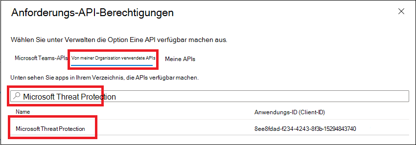
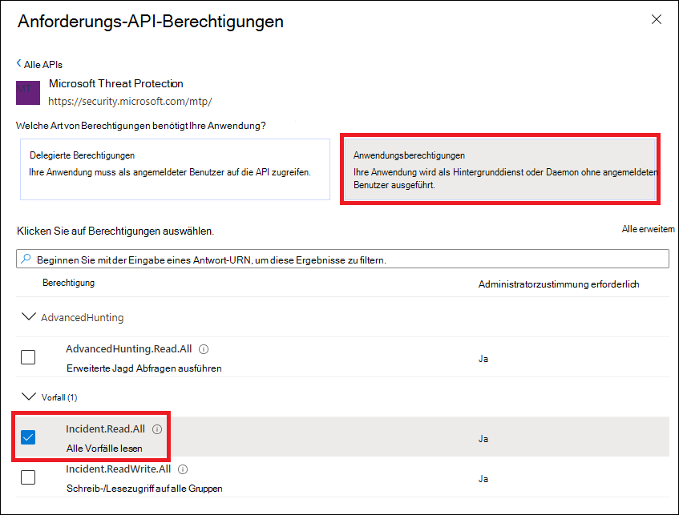

# <a name="hello-world-for-microsoft-threat-protection-rest-api"></a><span data-ttu-id="ab5a7-104">Hello World für Microsoft Threat Protection-Rest-API</span><span class="sxs-lookup"><span data-stu-id="ab5a7-104">Hello World for Microsoft Threat Protection REST API</span></span> 

<span data-ttu-id="ab5a7-105">**Gilt für:**</span><span class="sxs-lookup"><span data-stu-id="ab5a7-105">**Applies to:**</span></span>
- <span data-ttu-id="ab5a7-106">Microsoft Threat Protection</span><span class="sxs-lookup"><span data-stu-id="ab5a7-106">Microsoft Threat Protection</span></span>

>[!IMPORTANT] 
><span data-ttu-id="ab5a7-107">Einige Informationen beziehen sich auf Vorabversionen von Produkten, die vor der kommerziellen Veröffentlichung noch erheblich geändert werden können.</span><span class="sxs-lookup"><span data-stu-id="ab5a7-107">Some information relates to prereleased product which may be substantially modified before it's commercially released.</span></span> <span data-ttu-id="ab5a7-108">Microsoft übernimmt mit diesen Informationen keinerlei Gewährleistung, sei sie ausdrücklich oder konkludent.</span><span class="sxs-lookup"><span data-stu-id="ab5a7-108">Microsoft makes no warranties, express or implied, with respect to the information provided here.</span></span>


## <a name="get-incidents-using-a-simple-powershell-script"></a><span data-ttu-id="ab5a7-109">Abrufen von Vorfällen mithilfe eines einfachen PowerShell-Skripts</span><span class="sxs-lookup"><span data-stu-id="ab5a7-109">Get incidents using a simple PowerShell script</span></span>

### <a name="how-long-it-takes-to-go-through-this-example"></a><span data-ttu-id="ab5a7-110">Wie lange dauert das durchlaufen dieses Beispiels?</span><span class="sxs-lookup"><span data-stu-id="ab5a7-110">How long it takes to go through this example?</span></span>
<span data-ttu-id="ab5a7-111">Es dauert nur 5 Minuten in zwei Schritten:</span><span class="sxs-lookup"><span data-stu-id="ab5a7-111">It only takes 5 minutes done in two steps:</span></span>
- <span data-ttu-id="ab5a7-112">Anwendungsregistrierung</span><span class="sxs-lookup"><span data-stu-id="ab5a7-112">Application registration</span></span>
- <span data-ttu-id="ab5a7-113">Verwendungsbeispiele: benötigt nur Kopie/Paste eines kurzen PowerShell-Skripts</span><span class="sxs-lookup"><span data-stu-id="ab5a7-113">Use examples: only requires copy/paste of a short PowerShell script</span></span>

### <a name="do-i-need-a-permission-to-connect"></a><span data-ttu-id="ab5a7-114">Benötige ich eine Berechtigung für eine Verbindung?</span><span class="sxs-lookup"><span data-stu-id="ab5a7-114">Do I need a permission to connect?</span></span>
<span data-ttu-id="ab5a7-115">Für die Anwendungs Registrierungsphase benötigen Sie eine **globale Administrator** Rolle in Ihrem Azure Active Directory (Azure AD)-Mandanten.</span><span class="sxs-lookup"><span data-stu-id="ab5a7-115">For the Application registration stage, you must have a **Global administrator** role in your Azure Active Directory (Azure AD) tenant.</span></span>

### <a name="step-1---create-an-app-in-azure-active-directory"></a><span data-ttu-id="ab5a7-116">Schritt 1: Erstellen einer APP in Azure Active Directory</span><span class="sxs-lookup"><span data-stu-id="ab5a7-116">Step 1 - Create an App in Azure Active Directory</span></span>

1. <span data-ttu-id="ab5a7-117">Melden Sie sich bei [Azure](https://portal.azure.com) mit Ihrem **globalen Administrator** Benutzer an.</span><span class="sxs-lookup"><span data-stu-id="ab5a7-117">Log on to [Azure](https://portal.azure.com) with your **Global administrator** user.</span></span>

2. <span data-ttu-id="ab5a7-118">Navigieren Sie zu **Azure Active Directory**  >  **App Registrations**  >  **New Registration**.</span><span class="sxs-lookup"><span data-stu-id="ab5a7-118">Navigate to **Azure Active Directory** > **App registrations** > **New registration**.</span></span> 

   

3. <span data-ttu-id="ab5a7-120">Wählen Sie im Registrierungsformular einen Namen für Ihre Anwendung aus, und wählen Sie dann **registrieren**aus.</span><span class="sxs-lookup"><span data-stu-id="ab5a7-120">In the registration form, choose a name for your application and then select **Register**.</span></span>

4. <span data-ttu-id="ab5a7-121">Erlauben Sie Ihrer Anwendung den Zugriff auf Microsoft Defender ATP, und weisen Sie Ihr die Berechtigung " **alle Vorfälle lesen** " zu:</span><span class="sxs-lookup"><span data-stu-id="ab5a7-121">Allow your Application to access Microsoft Defender ATP and assign it **Read all incidents** permission:</span></span>

   - <span data-ttu-id="ab5a7-122">Wählen Sie auf Ihrer Anwendungsseite **API-Berechtigungen**  >  **Add permission**  >  **APIs meine Organisation verwendet** > geben Sie **Microsoft Threat Protection** ein, und wählen Sie unter **Microsoft Threat Protection**aus.</span><span class="sxs-lookup"><span data-stu-id="ab5a7-122">On your application page, select **API Permissions** > **Add permission** > **APIs my organization uses** > type **Microsoft Threat Protection** and select on **Microsoft Threat Protection**.</span></span>

   >[!NOTE]
   ><span data-ttu-id="ab5a7-123">Microsoft Threat Protection wird nicht in der ursprünglichen Liste angezeigt.</span><span class="sxs-lookup"><span data-stu-id="ab5a7-123">Microsoft Threat Protection does not appear in the original list.</span></span> <span data-ttu-id="ab5a7-124">Sie müssen mit dem Schreiben des Namens in das Textfeld beginnen, damit dieser angezeigt wird.</span><span class="sxs-lookup"><span data-stu-id="ab5a7-124">You need to start writing its name in the text box to see it appear.</span></span>

   

   - <span data-ttu-id="ab5a7-126">Wählen Sie **Anwendungsberechtigungen**  >  **Incident. Read. all** > Select on **Add Permissions** aus.</span><span class="sxs-lookup"><span data-stu-id="ab5a7-126">Choose **Application permissions** > **Incident.Read.All** > Select on **Add permissions**</span></span>

   

   >[!IMPORTANT]
   ><span data-ttu-id="ab5a7-128">Sie müssen die entsprechenden Berechtigungen auswählen.</span><span class="sxs-lookup"><span data-stu-id="ab5a7-128">You need to select the relevant permissions.</span></span> 

     <span data-ttu-id="ab5a7-129">Zum Beispiel</span><span class="sxs-lookup"><span data-stu-id="ab5a7-129">For instance,</span></span>

     - <span data-ttu-id="ab5a7-130">Um zu ermitteln, welche Berechtigungen Sie benötigen, sehen Sie sich den Abschnitt **Berechtigungen** in der API an, die Sie aufrufen möchten.</span><span class="sxs-lookup"><span data-stu-id="ab5a7-130">To determine which permission you need, please look at the **Permissions** section in the API you are interested to call.</span></span>

5. <span data-ttu-id="ab5a7-131">Wählen Sie **Administrator Zustimmung erteilen** aus.</span><span class="sxs-lookup"><span data-stu-id="ab5a7-131">Select **Grant admin consent**</span></span>

    - >[!NOTE]
      > <span data-ttu-id="ab5a7-132">Jedes Mal, wenn Sie die Berechtigung hinzufügen, müssen Sie die Option " **Zustimmung erteilen** " auswählen, damit die neue Berechtigung wirksam wird.</span><span class="sxs-lookup"><span data-stu-id="ab5a7-132">Every time you add permission you must select on **Grant consent** for the new permission to take effect.</span></span>

    

6. <span data-ttu-id="ab5a7-134">Fügen Sie der Anwendung ein Kennwort hinzu.</span><span class="sxs-lookup"><span data-stu-id="ab5a7-134">Add a secret to the application.</span></span>

    - <span data-ttu-id="ab5a7-135">Wählen Sie **Zertifikate & Geheimnisse**aus, fügen Sie der geheimen Verschlüsselung eine Beschreibung hinzu, und wählen Sie **Hinzufügen**</span><span class="sxs-lookup"><span data-stu-id="ab5a7-135">Select **Certificates & secrets**, add description to the secret and select **Add**.</span></span>

    >[!IMPORTANT]
    > <span data-ttu-id="ab5a7-136">Nachdem **Sie hinzufügen**ausgewählt haben, **Kopieren Sie den generierten geheimen Wert**.</span><span class="sxs-lookup"><span data-stu-id="ab5a7-136">After selecting **Add**, **copy the generated secret value**.</span></span> <span data-ttu-id="ab5a7-137">Sie können nach dem verlassen nicht mehr abrufen.</span><span class="sxs-lookup"><span data-stu-id="ab5a7-137">You won't be able to retrieve after you leave!</span></span>

    

7. <span data-ttu-id="ab5a7-139">Notieren Sie Ihre Anwendungs-ID und ihre Mandanten-ID:</span><span class="sxs-lookup"><span data-stu-id="ab5a7-139">Write down your application ID and your tenant ID:</span></span>

   - <span data-ttu-id="ab5a7-140">Wechseln Sie auf der Seite der Anwendung zu **Übersicht** , und kopieren Sie Folgendes:</span><span class="sxs-lookup"><span data-stu-id="ab5a7-140">On your application page, go to **Overview** and copy the following:</span></span>

   


<span data-ttu-id="ab5a7-142">Fertig!</span><span class="sxs-lookup"><span data-stu-id="ab5a7-142">Done!</span></span> <span data-ttu-id="ab5a7-143">Sie haben eine Anwendung erfolgreich registriert.</span><span class="sxs-lookup"><span data-stu-id="ab5a7-143">You have successfully registered an application.</span></span>

### <a name="step-2---get-a-token-using-the-app-and-use-this-token-to-access-the-api"></a><span data-ttu-id="ab5a7-144">Schritt 2: Abrufen eines Tokens mithilfe der APP und verwenden dieses Tokens für den Zugriff auf die API.</span><span class="sxs-lookup"><span data-stu-id="ab5a7-144">Step 2 - Get a token using the App and use this token to access the API.</span></span>

-   <span data-ttu-id="ab5a7-145">Kopieren Sie das Skript unten in PowerShell ISE oder in einen Text-Editor, und speichern Sie es als "**Get-Token.ps1**".</span><span class="sxs-lookup"><span data-stu-id="ab5a7-145">Copy the script below to PowerShell ISE or to a text editor, and save it as "**Get-Token.ps1**"</span></span>
-   <span data-ttu-id="ab5a7-146">Durch das Ausführen dieses Skripts wird ein Token generiert, das im Arbeitsordner unter dem Namen "**Latest-token.txt**" gespeichert wird.</span><span class="sxs-lookup"><span data-stu-id="ab5a7-146">Running this script will generate a token and will save it in the working folder under the name "**Latest-token.txt**".</span></span>

```
# That code gets the App Context Token and save it to a file named "Latest-token.txt" under the current directory
# Paste below your Tenant ID, App ID and App Secret (App key).

$tenantId = '' ### Paste your tenant ID here
$appId = '' ### Paste your Application ID here
$appSecret = '' ### Paste your Application secret here

$resourceAppIdUri = 'https://api.security.microsoft.com'
$oAuthUri = "https://login.windows.net/$TenantId/oauth2/token"
$authBody = [Ordered] @{
    resource = "$resourceAppIdUri"
    client_id = "$appId"
    client_secret = "$appSecret"
    grant_type = 'client_credentials'
}
$authResponse = Invoke-RestMethod -Method Post -Uri $oAuthUri -Body $authBody -ErrorAction Stop
$token = $authResponse.access_token
Out-File -FilePath "./Latest-token.txt" -InputObject $token
return $token
```

-   <span data-ttu-id="ab5a7-147">Sanity Check:</span><span class="sxs-lookup"><span data-stu-id="ab5a7-147">Sanity Check:</span></span><br>
<span data-ttu-id="ab5a7-148">Führen Sie das Skript aus.</span><span class="sxs-lookup"><span data-stu-id="ab5a7-148">Run the script.</span></span><br>
<span data-ttu-id="ab5a7-149">Wechseln Sie in Ihrem Browser zu: https://jwt.ms/</span><span class="sxs-lookup"><span data-stu-id="ab5a7-149">In your browser go to: https://jwt.ms/</span></span> <br>
<span data-ttu-id="ab5a7-150">Kopieren Sie das Token (den Inhalt der Latest-token.txt Datei).</span><span class="sxs-lookup"><span data-stu-id="ab5a7-150">Copy the token (the content of the Latest-token.txt file).</span></span><br>
<span data-ttu-id="ab5a7-151">Fügen Sie in das obere Feld ein.</span><span class="sxs-lookup"><span data-stu-id="ab5a7-151">Paste in the top box.</span></span><br>
<span data-ttu-id="ab5a7-152">Suchen Sie nach dem Abschnitt "Roles".</span><span class="sxs-lookup"><span data-stu-id="ab5a7-152">Look for the "roles" section.</span></span> <span data-ttu-id="ab5a7-153">Suchen Sie nach der ```Incidents.Read.All``` Rolle.</span><span class="sxs-lookup"><span data-stu-id="ab5a7-153">Find the ```Incidents.Read.All``` role.</span></span><br>
<span data-ttu-id="ab5a7-154">Das folgende Beispiel stammt aus einer APP, die ```Incidents.Read.All``` über ```Incidents.ReadWrite.All``` ```AdvancedHunting.Read.All``` Berechtigungen verfügt.</span><span class="sxs-lookup"><span data-stu-id="ab5a7-154">The below example is from an app that has ```Incidents.Read.All```, ```Incidents.ReadWrite.All``` and ```AdvancedHunting.Read.All``` permissions.</span></span>


### <a name="lets-get-the-incidents"></a><span data-ttu-id="ab5a7-156">Lets get the Incidents!</span><span class="sxs-lookup"><span data-stu-id="ab5a7-156">Lets get the Incidents!</span></span>

-   <span data-ttu-id="ab5a7-157">Im folgenden Skript wird **Get-Token.ps1** verwendet, um auf die API zuzugreifen, und die letzten Ereignisse werden in den letzten 48 Stunden aktualisiert.</span><span class="sxs-lookup"><span data-stu-id="ab5a7-157">The script below will use **Get-Token.ps1** to access the API and will get the incidents last updated in past 48 hours.</span></span>
-   <span data-ttu-id="ab5a7-158">Speichern Sie dieses Skript im gleichen Ordner, in dem Sie das vorherige Skript **Get-Token.ps1**gespeichert haben.</span><span class="sxs-lookup"><span data-stu-id="ab5a7-158">Save this script in the same folder you saved the previous script **Get-Token.ps1**.</span></span> 
-   <span data-ttu-id="ab5a7-159">Das Skript eine JSON-Datei mit den Daten im gleichen Ordner wie die Skripts.</span><span class="sxs-lookup"><span data-stu-id="ab5a7-159">The script a json file with the data in the same folder as the scripts.</span></span>

```
# Returns Incidents last updated in the past 48 hours.

$token = ./Get-Token.ps1       #run the script Get-Token.ps1  - make sure you are running this script from the same folder of Get-Token.ps1

# Get Incidents from the last 48 hours. Make sure you have incidents in that time frame.
$dateTime = (Get-Date).ToUniversalTime().AddHours(-48).ToString("o")

# The URL contains the type of query and the time filter we created above
$url = "https://api.security.microsoft.com/api/incidents?$filter=lastUpdateTime+ge+$dateTime"

# Set the WebRequest headers
$headers = @{ 
    'Content-Type' = 'application/json'
    'Accept' = 'application/json'
    'Authorization' = "Bearer $token"
}

# Send the webrequest and get the results. 
$response = Invoke-WebRequest -Method Get -Uri $url -Headers $headers -ErrorAction Stop

# Extract the incidents from the results. 
$incidents =  ($response | ConvertFrom-Json).value | ConvertTo-Json -Depth 99

# Get string with the execution time. We concatenate that string to the output file to avoid overwrite the file
$dateTimeForFileName = Get-Date -Format o | foreach {$_ -replace ":", "."}    

# Save the result as json
$outputJsonPath = "./Latest Incidents $dateTimeForFileName.json"     

Out-File -FilePath $outputJsonPath -InputObject $incidents 
```

<span data-ttu-id="ab5a7-160">Sie sind fertig!</span><span class="sxs-lookup"><span data-stu-id="ab5a7-160">You're all done!</span></span> <span data-ttu-id="ab5a7-161">Sie haben soeben erfolgreich Folgendes ausgeführt:</span><span class="sxs-lookup"><span data-stu-id="ab5a7-161">You have just successfully:</span></span>
-   <span data-ttu-id="ab5a7-162">Erstellt und registriert und Anwendung</span><span class="sxs-lookup"><span data-stu-id="ab5a7-162">Created and registered and application</span></span>
-   <span data-ttu-id="ab5a7-163">Gewährte Berechtigung für diese Anwendung zum Lesen von Warnungen</span><span class="sxs-lookup"><span data-stu-id="ab5a7-163">Granted permission for that application to read alerts</span></span>
-   <span data-ttu-id="ab5a7-164">Verbindung mit der API hergestellt</span><span class="sxs-lookup"><span data-stu-id="ab5a7-164">Connected the API</span></span>
-   <span data-ttu-id="ab5a7-165">Verwenden eines PowerShell-Skripts zum Zurückgeben von Vorfällen, die in den letzten 48 Stunden erstellt wurden</span><span class="sxs-lookup"><span data-stu-id="ab5a7-165">Used a PowerShell script to return incidents created in the past 48 hours</span></span>


## <a name="related-topic"></a><span data-ttu-id="ab5a7-166">Verwandtes Thema</span><span class="sxs-lookup"><span data-stu-id="ab5a7-166">Related topic</span></span>
- [<span data-ttu-id="ab5a7-167">Zugreifen auf die Microsoft Threat Protection-APIs</span><span class="sxs-lookup"><span data-stu-id="ab5a7-167">Access the Microsoft Threat Protection APIs</span></span>](api-access.md)
- [<span data-ttu-id="ab5a7-168">Zugriff auf Microsoft Threat Protection mit Anwendungskontext</span><span class="sxs-lookup"><span data-stu-id="ab5a7-168">Access  Microsoft Threat Protection with application context</span></span>](api-create-app-web.md)
- [<span data-ttu-id="ab5a7-169">Zugriff auf Microsoft Threat Protection mit Benutzerkontext</span><span class="sxs-lookup"><span data-stu-id="ab5a7-169">Access  Microsoft Threat Protection with user context</span></span>](api-create-app-user-context.md)
