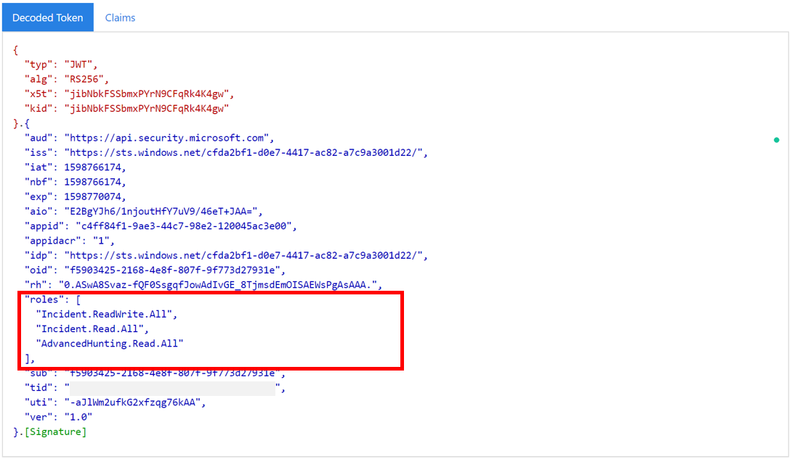

# <a name="hello-world-for-microsoft-365-defender-rest-api"></a>Hello World für Microsoft 365 Defender REST-API

[!INCLUDE [Microsoft 365 Defender rebranding](../includes/microsoft-defender.md)]

**Gilt für:**

- Microsoft 365 Defender

> [!IMPORTANT]
> Einige Informationen beziehen sich auf Vorabversionen von Produkten, die vor der kommerziellen Veröffentlichung noch erheblich geändert werden können. Microsoft übernimmt mit diesen Informationen keinerlei Gewährleistung, sei sie ausdrücklich oder konkludent.

## <a name="get-incidents-using-a-simple-powershell-script"></a>Erhalten von Vorfällen mithilfe eines einfachen PowerShell-Skripts

Es sollte 5 bis 10 Minuten dauern, bis dieses Projekt abgeschlossen ist. Diese Zeitschätzung umfasst das Registrieren der Anwendung und das Anwenden des Codes aus dem PowerShell-Beispielskript.

### <a name="register-an-app-in-azure-active-directory"></a>Registrieren einer App in Azure Active Directory

1. Melden Sie sich [bei Azure](https://portal.azure.com) als Benutzer mit der rolle **"Globaler Administrator"** an.

2. Navigieren Sie zu **Azure Active**  >  **Directory-App-Registrierungen**  >  **Neue Registrierung.**

   

3. Wählen Sie im Registrierungsformular einen Namen für Ihre Anwendung aus, und wählen Sie dann **"Registrieren" aus.** Das Auswählen eines Umleitungs-URI ist optional. Sie benötigen keinen, um dieses Beispiel zu vervollständigen.

4. Wählen Sie auf der Anwendungsseite **die API-Berechtigungen** Hinzufügen von Berechtigungs-APIs aus, die meine Organisation >, geben Sie  >    >   Microsoft **Threat Protection** ein, und wählen Sie **Microsoft Threat Protection aus.** Ihre App kann jetzt auf Microsoft 365 Defender zugreifen.

   > [!TIP]
   > *Microsoft Threat Protection* ist ein früherer Name für Microsoft 365 Defender und wird nicht in der ursprünglichen Liste angezeigt. Sie müssen damit beginnen, den Namen in das Textfeld zu schreiben, damit er angezeigt wird.
   

   - Wählen **Sie "Anwendungsberechtigungen**  >  **Incident.Read.All"** und dann **"Berechtigungen hinzufügen" aus.**

   

5. Wählen Sie **Administratorzuserteilung aus.** Jedes Mal, wenn Sie eine Berechtigung hinzufügen, müssen Sie die Administratorzuserteilung **auswählen,** damit sie wirksam wird.

    

6. Fügen Sie der Anwendung einen geheimen Schlüssel hinzu. Wählen **Sie & Schlüssel aus,** fügen Sie dem geheimen Schlüssel eine Beschreibung hinzu, und wählen Sie dann **"Hinzufügen" aus.**

    > [!TIP]
    > Nachdem Sie **"Hinzufügen"** ausgewählt haben, wählen **Sie "Den generierten geheimen Wert kopieren" aus.** Sie können den geheimen Wert nach dem Verlassen nicht mehr abrufen.

    

7. Noten Sie Ihre Anwendungs-ID und Ihre Mandanten-ID an einem sicheren Ort auf. Sie werden auf der **Anwendungsseite unter "Übersicht"** aufgeführt.

   

### <a name="get-a-token-using-the-app-and-use-the-token-to-access-the-api"></a>Abrufen eines Tokens mithilfe der App und Verwenden des Tokens für den Zugriff auf die API

Weitere Informationen zu Azure Active Directory-Token finden Sie im [Azure AD-Lernprogramm.](https://docs.microsoft.com/azure/active-directory/develop/active-directory-v2-protocols-oauth-client-creds)

> [!IMPORTANT]
> Obwohl das Beispiel in dieser Demo-App Sie dazu ermuntert, ihren geheimen Wert zu Testzwecken einzugeben, sollten Sie geheime Schlüssel niemals in eine Anwendung hartcodieren, die in der Produktion ausgeführt wird.  Ein Drittanbieter kann Ihr Geheimnis für den Zugriff auf Ressourcen verwenden. Mithilfe von Azure Key Vault können Sie die Geheimen Ihrer App [schützen.](https://docs.microsoft.com/azure/key-vault/general/about-keys-secrets-certificates) Ein praktisches Beispiel, wie Sie Ihre App schützen können, finden Sie unter "Verwalten geheimer Schlüssel [in Ihren Server-Apps mit Azure Key Vault".](https://docs.microsoft.com/learn/modules/manage-secrets-with-azure-key-vault/)

1. Kopieren Sie das folgende Skript, und fügen Sie es in Ihren bevorzugten Texteditor ein. Speichern unter **Get-Token.ps1**. Sie können den Code auch wie in PowerShell ISE ausführen, aber Sie sollten ihn speichern, da wir ihn erneut ausführen müssen, wenn wir das Skript zum Abrufen von Vorfällen im nächsten Abschnitt verwenden.

    Dieses Skript generiert ein Token und speichern es im Arbeitsordner unter dem Namen *Latest-token.txt*.

    ```PowerShell
    # This script gets the app context token and saves it to a file named "Latest-token.txt" under the current directory.
    # Paste in your tenant ID, client ID and app secret (App key).

    $tenantId = '' # Paste your directory (tenant) ID here
    $clientId = '' # Paste your application (client) ID here
    $appSecret = '' # # Paste your own app secret here to test, then store it in a safe place!

    $resourceAppIdUri = 'https://api.security.microsoft.com'
    $oAuthUri = "https://login.windows.net/$tenantId/oauth2/token"
    $authBody = [Ordered] @{
      resource = $resourceAppIdUri
      client_id = $clientId
      client_secret = $appSecret
      grant_type = 'client_credentials'
    }
    $authResponse = Invoke-RestMethod -Method Post -Uri $oAuthUri -Body $authBody -ErrorAction Stop
    $token = $authResponse.access_token
    Out-File -FilePath "./Latest-token.txt" -InputObject $token
    return $token
    ```

#### <a name="validate-the-token"></a>Überprüfen des Tokens

1. Kopieren Sie das token, das Sie erhalten haben, und fügen Sie es in [JWT](https://jwt.ms) ein, um es zu decodieren.
1. *JWT* steht für *JSON Web Token*. Das decodierte Token enthält eine Reihe von JSON-formatierten Elementen oder Ansprüchen. Stellen Sie sicher, dass *der Rollenanspruch* innerhalb des decodierten Tokens die gewünschten Berechtigungen enthält.

    In der folgenden Abbildung sehen Sie ein decodiertes Token, das von einer App mit ```Incidents.Read.All``` , und Berechtigungen erworben ```Incidents.ReadWrite.All``` ```AdvancedHunting.Read.All``` wurde:

    

### <a name="get-a-list-of-recent-incidents"></a>Eine Liste der letzten Vorfälle erhalten

Das folgende Skript verwendet **Get-Token.ps1** für den Zugriff auf die API. Anschließend wird eine Liste der Vorfälle abgerufen, die innerhalb der letzten 48 Stunden zuletzt aktualisiert wurden, und die Liste wird als JSON-Datei gespeichert.

> [!IMPORTANT]
> Speichern Sie dieses Skript in demselben Ordner, den **Sie** Get-Token.ps1.

```PowerShell
# This script returns incidents last updated within the past 48 hours.

$token = ./Get-Token.ps1

# Get incidents from the past 48 hours.
# The script may appear to fail if you don't have any incidents in that time frame.
$dateTime = (Get-Date).ToUniversalTime().AddHours(-48).ToString("o")

# This URL contains the type of query and the time filter we created above.
# Note that `$filter` does not refer to a local variable in our script --
# it's actually an OData operator and part of the API's syntax.
$url = "https://api.security.microsoft.com/api/incidents?$filter=lastUpdateTime+ge+$dateTime"

# Set the webrequest headers
$headers = @{
    'Content-Type' = 'application/json'
    'Accept' = 'application/json'
    'Authorization' = "Bearer $token"
}

# Send the request and get the results.
$response = Invoke-WebRequest -Method Get -Uri $url -Headers $headers -ErrorAction Stop

# Extract the incidents from the results.
$incidents =  ($response | ConvertFrom-Json).value | ConvertTo-Json -Depth 99

# Get a string containing the execution time. We concatenate that string to the name 
# of the output file to avoid overwriting the file on consecutive runs of the script.
$dateTimeForFileName = Get-Date -Format o | foreach {$_ -replace ":", "."}

# Save the result as json
$outputJsonPath = "./Latest Incidents $dateTimeForFileName.json"

Out-File -FilePath $outputJsonPath -InputObject $incidents
```

Sie sind fertig! Sie haben dies erfolgreich abgeschlossen:

- Eine Anwendung wurde erstellt und registriert.
- Dieser Anwendung wurde die Berechtigung zum Lesen von Warnungen erteilt.
- Verbunden mit der API.
- Verwenden eines PowerShell-Skripts zum Zurückgeben von Vorfällen, die in den letzten 48 Stunden aktualisiert wurden.

## <a name="related-articles"></a>Verwandte Artikel

- [Übersicht über Microsoft 365 Defender-APIs](api-overview.md)
- [Zugreifen auf die Microsoft 365 Defender-APIs](api-access.md)
- [Erstellen einer App für den Zugriff auf Microsoft 365 Defender ohne Benutzer](api-create-app-web.md)
- [Erstellen einer App für den Zugriff auf Microsoft 365 Defender-APIs im Auftrag eines Benutzers](api-create-app-user-context.md)
- [Erstellen einer App mit Mehr-Mandanten-Partnerzugriff auf Microsoft 365 -Defender-APIs](api-partner-access.md)
- [Verwalten geheimer Schlüssel in Ihren Server-Apps mit Azure Key Vault](https://docs.microsoft.com/learn/modules/manage-secrets-with-azure-key-vault/)
- [OAuth 2.0-Autorisierung für die Benutzerauthentifizierung und den Zugriff auf die API](https://docs.microsoft.com/azure/active-directory/develop/active-directory-v2-protocols-oauth-code)
