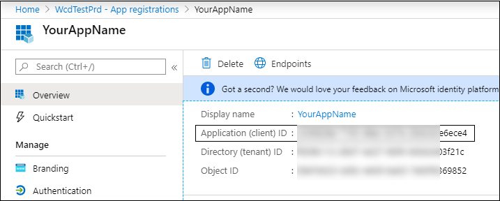

# <a name="partner-access-through-microsoft-threat-protection-apis"></a>Partner Zugriff über Microsoft Threat Protection-APIs

**Gilt für:**
- Microsoft Threat Protection

>[!IMPORTANT] 
>Einige Informationen beziehen sich auf Vorabversionen von Produkten, die vor der kommerziellen Veröffentlichung noch erheblich geändert werden können. Microsoft übernimmt mit diesen Informationen keinerlei Gewährleistung, sei sie ausdrücklich oder konkludent.


Auf dieser Seite wird beschrieben, wie Sie eine Aad-Anwendung erstellen, um den programmgesteuerten Zugriff auf Microsoft Threat Protection im Namen Ihrer Kunden zu erhalten.

Microsoft Threat Protection macht einen Großteil seiner Daten und Aktionen über eine Reihe von programmgesteuerten APIs verfügbar. Diese APIs unterstützen Sie bei der Automatisierung von Arbeitsabläufen und Innovationen basierend auf den Microsoft Threat Protection-Funktionen. Für den API-Zugriff ist die OAuth 2.0-Authentifizierung erforderlich. Weitere Informationen finden Sie unter [OAuth 2,0-Autorisierungs Code Fluss](https://docs.microsoft.com/azure/active-directory/develop/active-directory-v2-protocols-oauth-code).

Im Allgemeinen müssen Sie die folgenden Schritte ausführen, um die APIs zu verwenden:
- Erstellen Sie eine Aad-Anwendung mit **mehreren Mandanten** .
- Erhalten Sie autorisierte (Zustimmung) von Ihrem Kundenadministrator für Ihre Anwendung, um auf die erforderlichen Microsoft Threat Protection-Ressourcen zuzugreifen.
- Abrufen eines Zugriffstokens mithilfe dieser Anwendung.
- Verwenden Sie das Token, um auf die Microsoft Threat Protection-API zuzugreifen.

Die folgenden Schritte finden Sie unter Anleitung zum Erstellen einer Aad-Anwendung, Abrufen eines Zugriffstokens für Microsoft Threat Protection und Überprüfen des Tokens.

## <a name="create-the-multi-tenant-app"></a>Erstellen der Multi-Mandanten-App

1. Melden Sie sich bei Ihrem [Azure-Mandanten](https://portal.azure.com) mit dem Benutzer an, der über eine **globale Administrator** Rolle verfügt.

2. Navigieren Sie zu **Azure Active Directory**  >  **App Registrations**  >  **New Registration**. 

   

3. Im Registrierungsformular:

    - Wählen Sie einen Namen für Ihre Anwendung aus.

    - Unterstützte Kontotypen-Konten in einem beliebigen Organisations Verzeichnis.

    - Umleitungs-URI-Typ: Internet, URI: https://portal.azure.com

    


4. Ermöglichen Sie Ihrer Anwendung den Zugriff auf Microsoft Threat Protection, und weisen Sie Sie mit dem minimalen Satz von Berechtigungen zu, die erforderlich sind, um die Integration abzuschließen.

   - Klicken Sie auf Ihrer Anwendungsseite auf **API-Berechtigungen**  >  **Add permission**  >  **APIs meine Organisation verwendet** > geben Sie **Microsoft Threat Protection** ein, und klicken Sie auf **Microsoft Threat Protection**.

   >[!NOTE]
   >Microsoft Threat Protection wird nicht in der ursprünglichen Liste angezeigt. Sie müssen mit dem Schreiben des Namens in das Textfeld beginnen, damit dieser angezeigt wird.

   
   
   ### <a name="request-api-permissions"></a>Anforderungs-API-Berechtigungen

   Um zu ermitteln, welche Berechtigungen Sie benötigen, sehen Sie sich den Abschnitt **Berechtigungen** in der API an, die Sie aufrufen möchten. 

   Im folgenden Beispiel wird die Berechtigung **"alle Vorfälle lesen"** verwendet:

   Wählen Sie **Anwendungsberechtigungen**  >  **Incidents. Read. all** > klicken Sie auf **Berechtigungen hinzufügen** .

   


5. Klicken Sie auf **Zustimmung erteilen** .

    >[!NOTE]
    >Jedes Mal, wenn Sie die Berechtigung hinzufügen, müssen Sie auf **Zustimmung erteilen** klicken, damit die neue Berechtigung wirksam wird.

    

6. Fügen Sie der Anwendung ein Kennwort hinzu.

    - Klicken Sie auf **Zertifikate & Geheimnisse**, fügen Sie dem geheimen eine Beschreibung hinzu, und klicken Sie auf **Hinzufügen**

    >[!IMPORTANT]
    > Nachdem **Sie hinzufügen**ausgewählt haben, **Kopieren Sie den generierten geheimen Wert**. Sie können nach dem verlassen nicht mehr abrufen.

    

7. Notieren Sie Ihre Anwendungs-ID:

   - Wechseln Sie auf der Seite der Anwendung zu **Übersicht** , und kopieren Sie Folgendes:

   

8. Fügen Sie die Anwendung dem Mandanten des Kunden hinzu.

    Sie müssen Ihre Anwendung in jedem Kundenmandanten genehmigen, in dem Sie Sie verwenden möchten. Dies liegt daran, dass Ihre Anwendung im Namen Ihres Kunden mit der Microsoft Threat Protection-Anwendung interagiert.

    Ein Benutzer mit **globalem Administrator** vom Mandanten des Kunden muss auf den Zustimmungs Link klicken und die Anwendung genehmigen.

    Der Zustimmungs Link hat folgendes Format:

    ```
    https://login.microsoftonline.com/common/oauth2/authorize?prompt=consent&client_id=00000000-0000-0000-0000-000000000000&response_type=code&sso_reload=true
    ```

    Wobei 00000000-0000-0000-0000-000000000000 durch Ihre Anwendungs-ID ersetzt werden soll

    Nachdem Sie auf den Link Zustimmung geklickt haben, melden Sie sich beim globalen Administrator des Mandanten des Kunden an, und stimmen Sie der Anwendung zu.

    

    Darüber hinaus müssen Sie Ihren Kunden um die Mandanten-ID bitten und ihn zur späteren Verwendung beim Erwerb des Tokens speichern.

- **Fertig!** Sie haben eine Anwendung erfolgreich registriert! 
- In den folgenden Beispielen finden Sie Informationen zur Token-Erfassung und-Validierung.

## <a name="get-an-access-token-examples"></a>Abrufen von Zugriffstoken-Beispielen:

>[!NOTE]
> Um Zugriffstoken im Namen Ihres Kunden zu erhalten, verwenden Sie die Mandanten-ID des Kunden für die folgenden Token-Akquisitionen.

<br>Weitere Informationen zum Aad-Token finden Sie unter [Aad Tutorial](https://docs.microsoft.com/azure/active-directory/develop/active-directory-v2-protocols-oauth-client-creds)

### <a name="using-powershell"></a>Verwendung von PowerShell

```
# That code gets the App Context Token and save it to a file named "Latest-token.txt" under the current directory
# Paste below your Tenant ID, App ID and App Secret (App key).

$tenantId = '' ### Paste your tenant ID here
$appId = '' ### Paste your Application ID here
$appSecret = '' ### Paste your Application key here

$resourceAppIdUri = 'https://api.security.microsoft.com'
$oAuthUri = "https://login.windows.net/$TenantId/oauth2/token"
$authBody = [Ordered] @{
    resource = "$resourceAppIdUri"
    client_id = "$appId"
    client_secret = "$appSecret"
    grant_type = 'client_credentials'
}
$authResponse = Invoke-RestMethod -Method Post -Uri $oAuthUri -Body $authBody -ErrorAction Stop
$token = $authResponse.access_token
Out-File -FilePath "./Latest-token.txt" -InputObject $token
return $token
```

### <a name="using-c"></a>Verwenden von C#:

>Der folgende Code wurde mit Nuget Microsoft. IdentityModel. Clients. ActiveDirectory getestet.

- Erstellen einer neuen Konsolenanwendung
- Installieren von Nuget [Microsoft. IdentityModel. Clients. ActiveDirectory](https://www.nuget.org/packages/Microsoft.IdentityModel.Clients.ActiveDirectory/)
- Fügen Sie den folgenden mithilfe von hinzu

    ```
    using Microsoft.IdentityModel.Clients.ActiveDirectory;
    ```

- Kopieren/Einfügen des Codes unten in Ihrer Anwendung (vergessen Sie nicht, die 3-Variablen zu aktualisieren: ```tenantId, appId, appSecret``` )

    ```
    string tenantId = "00000000-0000-0000-0000-000000000000"; // Paste your own tenant ID here
    string appId = "11111111-1111-1111-1111-111111111111"; // Paste your own app ID here
    string appSecret = "22222222-2222-2222-2222-222222222222"; // Paste your own app secret here for a test, and then store it in a safe place! 

    const string authority = "https://login.windows.net";
    const string mtpResourceId = "https://api.security.microsoft.com";

    AuthenticationContext auth = new AuthenticationContext($"{authority}/{tenantId}/");
    ClientCredential clientCredential = new ClientCredential(appId, appSecret);
    AuthenticationResult authenticationResult = auth.AcquireTokenAsync(mtpResourceId, clientCredential).GetAwaiter().GetResult();
    string token = authenticationResult.AccessToken;
    ```


### <a name="using-curl"></a>Verwenden von curl

> [!NOTE]
> Im folgenden Verfahren sollte curl für Windows bereits auf Ihrem Computer installiert sein.

- Öffnen eines Befehlsfensters
- Festlegen CLIENT_ID auf Ihre Azure-Anwendungs-ID
- Festlegen von CLIENT_SECRET auf Ihren Azure-Anwendungsschlüssel
- Legen Sie TENANT_ID auf die Azure-Mandanten-ID des Kunden fest, der Ihre Anwendung für den Zugriff auf Microsoft Threat Protection-Anwendung verwenden möchte.
- Führen Sie den folgenden Befehl aus:

```
curl -i -X POST -H "Content-Type:application/x-www-form-urlencoded" -d "grant_type=client_credentials" -d "client_id=%CLIENT_ID%" -d "scope=https://api.security.microsoft.com.default" -d "client_secret=%CLIENT_SECRET%" "https://login.microsoftonline.com/%TENANT_ID%/oauth2/v2.0/token" -k
```

Sie erhalten eine Antwort des Formulars:

```
{"token_type":"Bearer","expires_in":3599,"ext_expires_in":0,"access_token":"eyJ0eXAiOiJKV1QiLCJhbGciOiJSUzI1NiIsIn <truncated> aWReH7P0s0tjTBX8wGWqJUdDA"}
```

## <a name="validate-the-token"></a>Überprüfen des Tokens

Sanity Check, um sicherzustellen, dass Sie ein korrektes Token erhalten:

- Kopieren/Einfügen in [JWT](https://jwt.ms) das Token, das Sie im vorherigen Schritt erhalten haben, um es zu decodieren
- Überprüfen Sie erhalten einen "Roles"-Anspruch mit den gewünschten Berechtigungen
- Im folgenden Screenshot sehen Sie ein decodiertes Token, das von einer Anwendung mit mehreren Berechtigungen für Microsoft Threat Protection erworben wurde:
- Der "TID"-Anspruch ist die Mandanten-ID, zu der das Token gehört.


## <a name="use-the-token-to-access-microsoft-threat-protection-api"></a>Verwenden des Tokens für den Zugriff auf die Microsoft Threat Protection-API

- Wählen Sie die API aus, die Sie verwenden möchten, weitere Informationen finden Sie unter [unterstützte Microsoft Threat Protection-APIs](api-supported.md)
- Festlegen des Autorisierungs Headers in der HTTP-Anforderung, die Sie an "Bearer {Token}" senden (Inhaber ist das Autorisierungsschema)
- Die Ablaufzeit des Tokens beträgt 1 Stunde (Sie können mehr als eine Anforderung mit demselben Token senden)

- Beispiel für das Senden einer Anforderung zum Abrufen einer Liste von Vorfällen **mithilfe von C#** 
    ```
    var httpClient = new HttpClient();

    var request = new HttpRequestMessage(HttpMethod.Get, "https://api.security.microsoft.com/api/incidents");

    request.Headers.Authorization = new AuthenticationHeaderValue("Bearer", token);

    var response = httpClient.SendAsync(request).GetAwaiter().GetResult();

    // Do something useful with the response
    ```

## <a name="related-topics"></a>Verwandte Themen 

- [Zugreifen auf die Microsoft Threat Protection-APIs](api-access.md)
- [Zugriff auf Microsoft Threat Protection mit Anwendungskontext](api-create-app-web.md)
- [Zugriff auf Microsoft Threat Protection mit Benutzerkontext](api-create-app-user-context.md)
