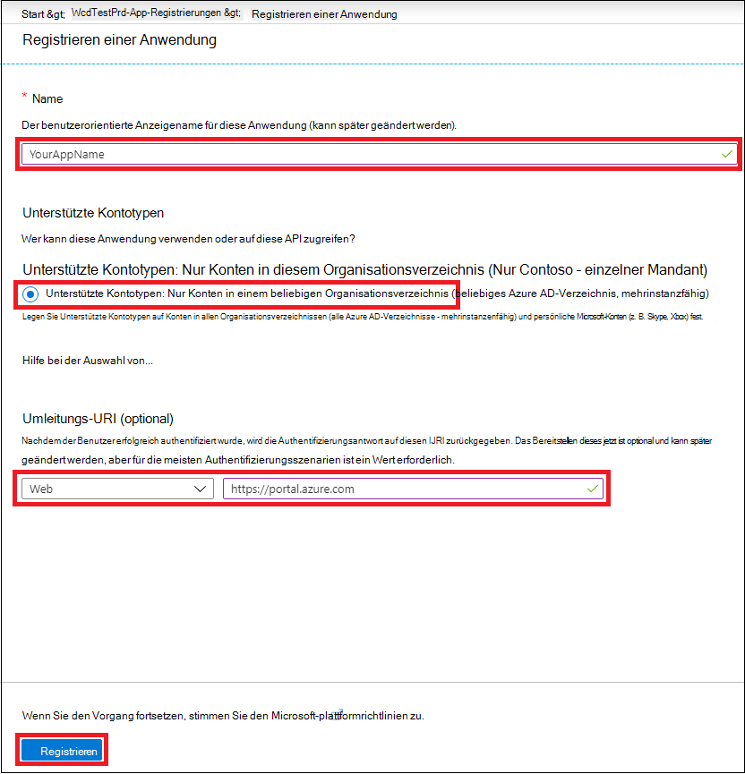
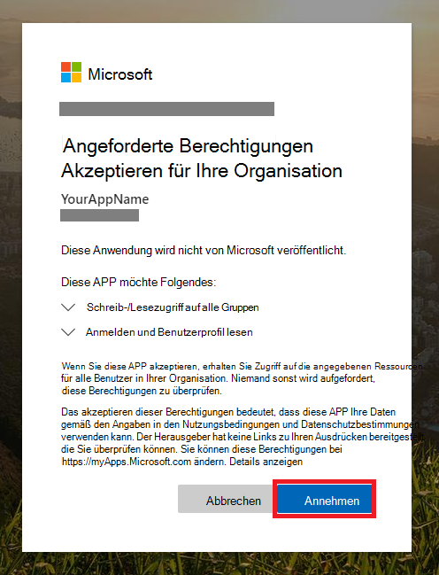

# <a name="partner-access-through-microsoft-365-defender-apis"></a><span data-ttu-id="f27af-104">Partner Zugriff über Microsoft 365 Defender-APIs</span><span class="sxs-lookup"><span data-stu-id="f27af-104">Partner access through Microsoft 365 Defender APIs</span></span>

[!INCLUDE [Microsoft 365 Defender rebranding](../includes/microsoft-defender.md)]


<span data-ttu-id="f27af-105">**Gilt für:**</span><span class="sxs-lookup"><span data-stu-id="f27af-105">**Applies to:**</span></span>
- <span data-ttu-id="f27af-106">Microsoft 365 Defender</span><span class="sxs-lookup"><span data-stu-id="f27af-106">Microsoft 365 Defender</span></span>

>[!IMPORTANT] 
><span data-ttu-id="f27af-107">Einige Informationen beziehen sich auf Vorabversionen von Produkten, die vor der kommerziellen Veröffentlichung noch erheblich geändert werden können.</span><span class="sxs-lookup"><span data-stu-id="f27af-107">Some information relates to prereleased product which may be substantially modified before it's commercially released.</span></span> <span data-ttu-id="f27af-108">Microsoft übernimmt mit diesen Informationen keinerlei Gewährleistung, sei sie ausdrücklich oder konkludent.</span><span class="sxs-lookup"><span data-stu-id="f27af-108">Microsoft makes no warranties, express or implied, with respect to the information provided here.</span></span>


<span data-ttu-id="f27af-109">Auf dieser Seite wird beschrieben, wie Sie eine Aad-Anwendung erstellen, um den programmgesteuerten Zugriff auf Microsoft 365 Defender im Namen Ihrer Kunden zu erhalten.</span><span class="sxs-lookup"><span data-stu-id="f27af-109">This page describes how to create an AAD application to get programmatic access to Microsoft 365 Defender on behalf of your customers.</span></span>

<span data-ttu-id="f27af-110">Microsoft 365 Defender macht einen Großteil seiner Daten und Aktionen über eine Reihe von programmgesteuerten APIs verfügbar.</span><span class="sxs-lookup"><span data-stu-id="f27af-110">Microsoft 365 Defender exposes much of its data and actions through a set of programmatic APIs.</span></span> <span data-ttu-id="f27af-111">Diese APIs unterstützen Sie bei der Automatisierung von Arbeitsabläufen und Innovationen basierend auf den Microsoft 365 Defender-Funktionen.</span><span class="sxs-lookup"><span data-stu-id="f27af-111">Those APIs will help you automate work flows and innovate based on Microsoft 365 Defender capabilities.</span></span> <span data-ttu-id="f27af-112">Für den API-Zugriff ist die OAuth 2.0-Authentifizierung erforderlich.</span><span class="sxs-lookup"><span data-stu-id="f27af-112">The API access requires OAuth2.0 authentication.</span></span> <span data-ttu-id="f27af-113">Weitere Informationen finden Sie unter [OAuth 2,0-Autorisierungs Code Fluss](https://docs.microsoft.com/azure/active-directory/develop/active-directory-v2-protocols-oauth-code).</span><span class="sxs-lookup"><span data-stu-id="f27af-113">For more information, see [OAuth 2.0 Authorization Code Flow](https://docs.microsoft.com/azure/active-directory/develop/active-directory-v2-protocols-oauth-code).</span></span>

<span data-ttu-id="f27af-114">Im Allgemeinen müssen Sie die folgenden Schritte ausführen, um die APIs zu verwenden:</span><span class="sxs-lookup"><span data-stu-id="f27af-114">In general, you’ll need to take the following steps to use the APIs:</span></span>
- <span data-ttu-id="f27af-115">Erstellen Sie eine Aad-Anwendung mit **mehreren Mandanten** .</span><span class="sxs-lookup"><span data-stu-id="f27af-115">Create a **multi-tenant** AAD application.</span></span>
- <span data-ttu-id="f27af-116">Erhalten Sie autorisierte (Zustimmung) von Ihrem Kundenadministrator für Ihre Anwendung, um auf Microsoft 365 Defender-Ressourcen zuzugreifen, die Sie benötigt.</span><span class="sxs-lookup"><span data-stu-id="f27af-116">Get authorized (consent) by your customer administrator for your application to access Microsoft 365 Defender resources it needs.</span></span>
- <span data-ttu-id="f27af-117">Abrufen eines Zugriffstokens mithilfe dieser Anwendung.</span><span class="sxs-lookup"><span data-stu-id="f27af-117">Get an access token using this application.</span></span>
- <span data-ttu-id="f27af-118">Verwenden Sie das Token, um auf die Microsoft 365 Defender-API zuzugreifen.</span><span class="sxs-lookup"><span data-stu-id="f27af-118">Use the token to access Microsoft 365 Defender API.</span></span>

<span data-ttu-id="f27af-119">Die folgenden Schritte finden Sie unter Anleitung zum Erstellen einer Aad-Anwendung, Abrufen eines Zugriffstokens für Microsoft 365 Defender und Überprüfen des Tokens.</span><span class="sxs-lookup"><span data-stu-id="f27af-119">The following steps with guide you how to create an AAD application, get an access token to Microsoft 365 Defender and validate the token.</span></span>

## <a name="create-the-multi-tenant-app"></a><span data-ttu-id="f27af-120">Erstellen der Multi-Mandanten-App</span><span class="sxs-lookup"><span data-stu-id="f27af-120">Create the multi-tenant app</span></span>

1. <span data-ttu-id="f27af-121">Melden Sie sich bei Ihrem [Azure-Mandanten](https://portal.azure.com) mit dem Benutzer an, der über eine **globale Administrator** Rolle verfügt.</span><span class="sxs-lookup"><span data-stu-id="f27af-121">Log on to your [Azure tenant](https://portal.azure.com) with user that has **Global Administrator** role.</span></span>

2. <span data-ttu-id="f27af-122">Navigieren Sie zu **Azure Active Directory**  >  **App Registrations**  >  **New Registration**.</span><span class="sxs-lookup"><span data-stu-id="f27af-122">Navigate to **Azure Active Directory** > **App registrations** > **New registration**.</span></span> 

   

3. <span data-ttu-id="f27af-124">Im Registrierungsformular:</span><span class="sxs-lookup"><span data-stu-id="f27af-124">In the registration form:</span></span>

    - <span data-ttu-id="f27af-125">Wählen Sie einen Namen für Ihre Anwendung aus.</span><span class="sxs-lookup"><span data-stu-id="f27af-125">Choose a name for your application.</span></span>

    - <span data-ttu-id="f27af-126">Unterstützte Kontotypen-Konten in einem beliebigen Organisations Verzeichnis.</span><span class="sxs-lookup"><span data-stu-id="f27af-126">Supported account types - accounts in any organizational directory.</span></span>

    - <span data-ttu-id="f27af-127">Umleitungs-URI-Typ: Internet, URI: https://portal.azure.com</span><span class="sxs-lookup"><span data-stu-id="f27af-127">Redirect URI - type: Web, URI: https://portal.azure.com</span></span>

    


4. <span data-ttu-id="f27af-129">Erlauben Sie Ihrer Anwendung den Zugriff auf Microsoft 365 Defender, und weisen Sie Ihr die minimale Berechtigungsgruppe zu, die zum Abschließen der Integration erforderlich ist.</span><span class="sxs-lookup"><span data-stu-id="f27af-129">Allow your Application to access Microsoft 365 Defender and assign it with the minimal set of permissions required to complete the integration.</span></span>

   - <span data-ttu-id="f27af-130">Klicken Sie auf Ihrer Anwendungsseite auf **API-Berechtigungen**  >  **Add permission**  >  **APIs meine Organisation verwendet** > geben Sie **Microsoft 365 Defender** ein, und klicken Sie auf **Microsoft 365 Defender**.</span><span class="sxs-lookup"><span data-stu-id="f27af-130">On your application page, click **API Permissions** > **Add permission** > **APIs my organization uses** > type **Microsoft 365 Defender** and click on **Microsoft 365 Defender**.</span></span>

   >[!NOTE]
   ><span data-ttu-id="f27af-131">Microsoft 365 Defender wird nicht in der ursprünglichen Liste angezeigt.</span><span class="sxs-lookup"><span data-stu-id="f27af-131">Microsoft 365 Defender does not appear in the original list.</span></span> <span data-ttu-id="f27af-132">Sie müssen mit dem Schreiben des Namens in das Textfeld beginnen, damit dieser angezeigt wird.</span><span class="sxs-lookup"><span data-stu-id="f27af-132">You need to start writing its name in the text box to see it appear.</span></span>

   
   
   ### <a name="request-api-permissions"></a><span data-ttu-id="f27af-134">Anforderungs-API-Berechtigungen</span><span class="sxs-lookup"><span data-stu-id="f27af-134">Request API permissions</span></span>

   <span data-ttu-id="f27af-135">Um zu ermitteln, welche Berechtigungen Sie benötigen, sehen Sie sich den Abschnitt **Berechtigungen** in der API an, die Sie aufrufen möchten.</span><span class="sxs-lookup"><span data-stu-id="f27af-135">To determine which permission you need, please look at the **Permissions** section in the API you are interested to call.</span></span> 

   <span data-ttu-id="f27af-136">Im folgenden Beispiel wird die Berechtigung **"alle Vorfälle lesen"** verwendet:</span><span class="sxs-lookup"><span data-stu-id="f27af-136">In the following example we will use **'Read all incidents'** permission:</span></span>

   <span data-ttu-id="f27af-137">Wählen Sie **Anwendungsberechtigungen**  >  **Incidents. Read. all** > klicken Sie auf **Berechtigungen hinzufügen** .</span><span class="sxs-lookup"><span data-stu-id="f27af-137">Choose **Application permissions** > **Incidents.Read.All** > Click on **Add permissions**</span></span>

   


5. <span data-ttu-id="f27af-139">Klicken Sie auf **Zustimmung erteilen** .</span><span class="sxs-lookup"><span data-stu-id="f27af-139">Click **Grant consent**</span></span>

    >[!NOTE]
    ><span data-ttu-id="f27af-140">Jedes Mal, wenn Sie die Berechtigung hinzufügen, müssen Sie auf **Zustimmung erteilen** klicken, damit die neue Berechtigung wirksam wird.</span><span class="sxs-lookup"><span data-stu-id="f27af-140">Every time you add permission you must click on **Grant consent** for the new permission to take effect.</span></span>

    

6. <span data-ttu-id="f27af-142">Fügen Sie der Anwendung ein Kennwort hinzu.</span><span class="sxs-lookup"><span data-stu-id="f27af-142">Add a secret to the application.</span></span>

    - <span data-ttu-id="f27af-143">Klicken Sie auf **Zertifikate & Geheimnisse** , fügen Sie dem geheimen eine Beschreibung hinzu, und klicken Sie auf **Hinzufügen**</span><span class="sxs-lookup"><span data-stu-id="f27af-143">Click **Certificates & secrets** , add description to the secret and click **Add**.</span></span>

    >[!IMPORTANT]
    > <span data-ttu-id="f27af-144">Nachdem **Sie hinzufügen** ausgewählt haben, **Kopieren Sie den generierten geheimen Wert**.</span><span class="sxs-lookup"><span data-stu-id="f27af-144">After selecting **Add** , **copy the generated secret value**.</span></span> <span data-ttu-id="f27af-145">Sie können nach dem verlassen nicht mehr abrufen.</span><span class="sxs-lookup"><span data-stu-id="f27af-145">You won't be able to retrieve after you leave!</span></span>

    

7. <span data-ttu-id="f27af-147">Notieren Sie Ihre Anwendungs-ID:</span><span class="sxs-lookup"><span data-stu-id="f27af-147">Write down your application ID:</span></span>

   - <span data-ttu-id="f27af-148">Wechseln Sie auf der Seite der Anwendung zu **Übersicht** , und kopieren Sie Folgendes:</span><span class="sxs-lookup"><span data-stu-id="f27af-148">On your application page, go to **Overview** and copy the following:</span></span>

   

8. <span data-ttu-id="f27af-150">Fügen Sie die Anwendung dem Mandanten des Kunden hinzu.</span><span class="sxs-lookup"><span data-stu-id="f27af-150">Add the application to your customer's tenant.</span></span>

    <span data-ttu-id="f27af-151">Sie müssen Ihre Anwendung in jedem Kundenmandanten genehmigen, in dem Sie Sie verwenden möchten.</span><span class="sxs-lookup"><span data-stu-id="f27af-151">You need your application to be approved in each customer tenant where you intend to use it.</span></span> <span data-ttu-id="f27af-152">Dies liegt daran, dass Ihre Anwendung im Namen Ihres Kunden mit der Microsoft 365 Defender-Anwendung interagiert.</span><span class="sxs-lookup"><span data-stu-id="f27af-152">This is because your application interacts with Microsoft 365 Defender application on behalf of your customer.</span></span>

    <span data-ttu-id="f27af-153">Ein Benutzer mit **globalem Administrator** vom Mandanten des Kunden muss auf den Zustimmungs Link klicken und die Anwendung genehmigen.</span><span class="sxs-lookup"><span data-stu-id="f27af-153">A user with **Global Administrator** from your customer's tenant need to click the consent link and approve your application.</span></span>

    <span data-ttu-id="f27af-154">Der Zustimmungs Link hat folgendes Format:</span><span class="sxs-lookup"><span data-stu-id="f27af-154">Consent link is of the form:</span></span>

    ```
    https://login.microsoftonline.com/common/oauth2/authorize?prompt=consent&client_id=00000000-0000-0000-0000-000000000000&response_type=code&sso_reload=true
    ```

    <span data-ttu-id="f27af-155">Wobei 00000000-0000-0000-0000-000000000000 durch Ihre Anwendungs-ID ersetzt werden soll</span><span class="sxs-lookup"><span data-stu-id="f27af-155">Where 00000000-0000-0000-0000-000000000000 should be replaced with your Application ID</span></span>

    <span data-ttu-id="f27af-156">Nachdem Sie auf den Link Zustimmung geklickt haben, melden Sie sich beim globalen Administrator des Mandanten des Kunden an, und stimmen Sie der Anwendung zu.</span><span class="sxs-lookup"><span data-stu-id="f27af-156">After clicking on the consent link, login with the Global Administrator of the customer's tenant and consent the application.</span></span>

    

    <span data-ttu-id="f27af-158">Darüber hinaus müssen Sie Ihren Kunden um die Mandanten-ID bitten und ihn zur späteren Verwendung beim Erwerb des Tokens speichern.</span><span class="sxs-lookup"><span data-stu-id="f27af-158">In addition, you will need to ask your customer for their tenant ID and save it for future use when acquiring the token.</span></span>

- <span data-ttu-id="f27af-159">**Fertig!**</span><span class="sxs-lookup"><span data-stu-id="f27af-159">**Done!**</span></span> <span data-ttu-id="f27af-160">Sie haben eine Anwendung erfolgreich registriert!</span><span class="sxs-lookup"><span data-stu-id="f27af-160">You have successfully registered an application!</span></span> 
- <span data-ttu-id="f27af-161">In den folgenden Beispielen finden Sie Informationen zur Token-Erfassung und-Validierung.</span><span class="sxs-lookup"><span data-stu-id="f27af-161">See examples below for token acquisition and validation.</span></span>

## <a name="get-an-access-token-examples"></a><span data-ttu-id="f27af-162">Abrufen von Zugriffstoken-Beispielen:</span><span class="sxs-lookup"><span data-stu-id="f27af-162">Get an access token examples:</span></span>

>[!NOTE]
> <span data-ttu-id="f27af-163">Um Zugriffstoken im Namen Ihres Kunden zu erhalten, verwenden Sie die Mandanten-ID des Kunden für die folgenden Token-Akquisitionen.</span><span class="sxs-lookup"><span data-stu-id="f27af-163">To get access token on behalf of your customer, use the customer's tenant ID on the following token acquisitions.</span></span>

<br><span data-ttu-id="f27af-164">Weitere Informationen zum Aad-Token finden Sie unter [Aad Tutorial](https://docs.microsoft.com/azure/active-directory/develop/active-directory-v2-protocols-oauth-client-creds)</span><span class="sxs-lookup"><span data-stu-id="f27af-164">For more details on AAD token, refer to [AAD tutorial](https://docs.microsoft.com/azure/active-directory/develop/active-directory-v2-protocols-oauth-client-creds)</span></span>

### <a name="using-powershell"></a><span data-ttu-id="f27af-165">Verwendung von PowerShell</span><span class="sxs-lookup"><span data-stu-id="f27af-165">Using PowerShell</span></span>

```
# That code gets the App Context Token and save it to a file named "Latest-token.txt" under the current directory
# Paste below your Tenant ID, App ID and App Secret (App key).

$tenantId = '' ### Paste your tenant ID here
$appId = '' ### Paste your Application ID here
$appSecret = '' ### Paste your Application key here

$resourceAppIdUri = 'https://api.security.microsoft.com'
$oAuthUri = "https://login.windows.net/$TenantId/oauth2/token"
$authBody = [Ordered] @{
    resource = "$resourceAppIdUri"
    client_id = "$appId"
    client_secret = "$appSecret"
    grant_type = 'client_credentials'
}
$authResponse = Invoke-RestMethod -Method Post -Uri $oAuthUri -Body $authBody -ErrorAction Stop
$token = $authResponse.access_token
Out-File -FilePath "./Latest-token.txt" -InputObject $token
return $token
```

### <a name="using-c"></a><span data-ttu-id="f27af-166">Verwenden von C#:</span><span class="sxs-lookup"><span data-stu-id="f27af-166">Using C#:</span></span>

><span data-ttu-id="f27af-167">Der folgende Code wurde mit Nuget Microsoft. IdentityModel. Clients. ActiveDirectory getestet.</span><span class="sxs-lookup"><span data-stu-id="f27af-167">The below code was tested with Nuget Microsoft.IdentityModel.Clients.ActiveDirectory</span></span>

- <span data-ttu-id="f27af-168">Erstellen einer neuen Konsolenanwendung</span><span class="sxs-lookup"><span data-stu-id="f27af-168">Create a new Console Application</span></span>
- <span data-ttu-id="f27af-169">Installieren von Nuget [Microsoft. IdentityModel. Clients. ActiveDirectory](https://www.nuget.org/packages/Microsoft.IdentityModel.Clients.ActiveDirectory/)</span><span class="sxs-lookup"><span data-stu-id="f27af-169">Install Nuget [Microsoft.IdentityModel.Clients.ActiveDirectory](https://www.nuget.org/packages/Microsoft.IdentityModel.Clients.ActiveDirectory/)</span></span>
- <span data-ttu-id="f27af-170">Fügen Sie den folgenden mithilfe von hinzu</span><span class="sxs-lookup"><span data-stu-id="f27af-170">Add the below using</span></span>

    ```
    using Microsoft.IdentityModel.Clients.ActiveDirectory;
    ```

- <span data-ttu-id="f27af-171">Kopieren/Einfügen des Codes unten in Ihrer Anwendung (vergessen Sie nicht, die 3-Variablen zu aktualisieren: ```tenantId, appId, appSecret``` )</span><span class="sxs-lookup"><span data-stu-id="f27af-171">Copy/Paste the below code in your application (do not forget to update the 3 variables: ```tenantId, appId, appSecret```)</span></span>

    ```
    string tenantId = "00000000-0000-0000-0000-000000000000"; // Paste your own tenant ID here
    string appId = "11111111-1111-1111-1111-111111111111"; // Paste your own app ID here
    string appSecret = "22222222-2222-2222-2222-222222222222"; // Paste your own app secret here for a test, and then store it in a safe place! 

    const string authority = "https://login.windows.net";
    const string mtpResourceId = "https://api.security.microsoft.com";

    AuthenticationContext auth = new AuthenticationContext($"{authority}/{tenantId}/");
    ClientCredential clientCredential = new ClientCredential(appId, appSecret);
    AuthenticationResult authenticationResult = auth.AcquireTokenAsync(mtpResourceId, clientCredential).GetAwaiter().GetResult();
    string token = authenticationResult.AccessToken;
    ```


### <a name="using-curl"></a><span data-ttu-id="f27af-172">Verwenden von curl</span><span class="sxs-lookup"><span data-stu-id="f27af-172">Using Curl</span></span>

> [!NOTE]
> <span data-ttu-id="f27af-173">Im folgenden Verfahren sollte curl für Windows bereits auf Ihrem Computer installiert sein.</span><span class="sxs-lookup"><span data-stu-id="f27af-173">The below procedure supposed Curl for Windows is already installed on your computer</span></span>

- <span data-ttu-id="f27af-174">Öffnen eines Befehlsfensters</span><span class="sxs-lookup"><span data-stu-id="f27af-174">Open a command window</span></span>
- <span data-ttu-id="f27af-175">Festlegen CLIENT_ID auf Ihre Azure-Anwendungs-ID</span><span class="sxs-lookup"><span data-stu-id="f27af-175">Set CLIENT_ID to your Azure application ID</span></span>
- <span data-ttu-id="f27af-176">Festlegen von CLIENT_SECRET auf Ihren Azure-Anwendungsschlüssel</span><span class="sxs-lookup"><span data-stu-id="f27af-176">Set CLIENT_SECRET to your Azure application secret</span></span>
- <span data-ttu-id="f27af-177">Legen Sie TENANT_ID auf die Azure-Mandanten-ID des Kunden fest, der Ihre Anwendung für den Zugriff auf die Microsoft 365 Defender-Anwendung verwenden möchte.</span><span class="sxs-lookup"><span data-stu-id="f27af-177">Set TENANT_ID to the Azure tenant ID of the customer that wants to use your application to access Microsoft 365 Defender application</span></span>
- <span data-ttu-id="f27af-178">Führen Sie den folgenden Befehl aus:</span><span class="sxs-lookup"><span data-stu-id="f27af-178">Run the below command:</span></span>

```
curl -i -X POST -H "Content-Type:application/x-www-form-urlencoded" -d "grant_type=client_credentials" -d "client_id=%CLIENT_ID%" -d "scope=https://api.security.microsoft.com.default" -d "client_secret=%CLIENT_SECRET%" "https://login.microsoftonline.com/%TENANT_ID%/oauth2/v2.0/token" -k
```

<span data-ttu-id="f27af-179">Sie erhalten eine Antwort des Formulars:</span><span class="sxs-lookup"><span data-stu-id="f27af-179">You will get an answer of the form:</span></span>

```
{"token_type":"Bearer","expires_in":3599,"ext_expires_in":0,"access_token":"eyJ0eXAiOiJKV1QiLCJhbGciOiJSUzI1NiIsIn <truncated> aWReH7P0s0tjTBX8wGWqJUdDA"}
```

## <a name="validate-the-token"></a><span data-ttu-id="f27af-180">Überprüfen des Tokens</span><span class="sxs-lookup"><span data-stu-id="f27af-180">Validate the token</span></span>

<span data-ttu-id="f27af-181">Sanity Check, um sicherzustellen, dass Sie ein korrektes Token erhalten:</span><span class="sxs-lookup"><span data-stu-id="f27af-181">Sanity check to make sure you got a correct token:</span></span>

- <span data-ttu-id="f27af-182">Kopieren/Einfügen in [JWT](https://jwt.ms) das Token, das Sie im vorherigen Schritt erhalten haben, um es zu decodieren</span><span class="sxs-lookup"><span data-stu-id="f27af-182">Copy/paste into [JWT](https://jwt.ms) the token you get in the previous step in order to decode it</span></span>
- <span data-ttu-id="f27af-183">Überprüfen Sie erhalten einen "Roles"-Anspruch mit den gewünschten Berechtigungen</span><span class="sxs-lookup"><span data-stu-id="f27af-183">Validate you get a 'roles' claim with the desired permissions</span></span>
- <span data-ttu-id="f27af-184">Im folgenden Screenshot sehen Sie ein decodiertes Token, das von einer Anwendung mit mehreren Berechtigungen für Microsoft 365 Defender erworben wurde:</span><span class="sxs-lookup"><span data-stu-id="f27af-184">In the screenshot below, you can see a decoded token acquired from an Application with multiple permissions to Microsoft 365 Defender:</span></span>
- <span data-ttu-id="f27af-185">Der "TID"-Anspruch ist die Mandanten-ID, zu der das Token gehört.</span><span class="sxs-lookup"><span data-stu-id="f27af-185">The "tid" claim is the tenant ID the token belongs to.</span></span>


## <a name="use-the-token-to-access-microsoft-365-defender-api"></a><span data-ttu-id="f27af-187">Verwenden des Tokens für den Zugriff auf die Microsoft 365 Defender-API</span><span class="sxs-lookup"><span data-stu-id="f27af-187">Use the token to access Microsoft 365 Defender API</span></span>

- <span data-ttu-id="f27af-188">Wählen Sie die API aus, die Sie verwenden möchten, weitere Informationen finden Sie unter [Supported Microsoft 365 Defender APIs](api-supported.md)</span><span class="sxs-lookup"><span data-stu-id="f27af-188">Choose the API you want to use, for more information, see [Supported Microsoft 365 Defender APIs](api-supported.md)</span></span>
- <span data-ttu-id="f27af-189">Festlegen des Autorisierungs Headers in der HTTP-Anforderung, die Sie an "Bearer {Token}" senden (Inhaber ist das Autorisierungsschema)</span><span class="sxs-lookup"><span data-stu-id="f27af-189">Set the Authorization header in the Http request you send to "Bearer {token}" (Bearer is the Authorization scheme)</span></span>
- <span data-ttu-id="f27af-190">Die Ablaufzeit des Tokens beträgt 1 Stunde (Sie können mehr als eine Anforderung mit demselben Token senden)</span><span class="sxs-lookup"><span data-stu-id="f27af-190">The Expiration time of the token is 1 hour (you can send more then one request with the same token)</span></span>

- <span data-ttu-id="f27af-191">Beispiel für das Senden einer Anforderung zum Abrufen einer Liste von Vorfällen **mithilfe von C#**</span><span class="sxs-lookup"><span data-stu-id="f27af-191">Example of sending a request to get a list of incidents **using C#**</span></span> 
    ```
    var httpClient = new HttpClient();

    var request = new HttpRequestMessage(HttpMethod.Get, "https://api.security.microsoft.com/api/incidents");

    request.Headers.Authorization = new AuthenticationHeaderValue("Bearer", token);

    var response = httpClient.SendAsync(request).GetAwaiter().GetResult();

    // Do something useful with the response
    ```

## <a name="related-topics"></a><span data-ttu-id="f27af-192">Verwandte Themen</span><span class="sxs-lookup"><span data-stu-id="f27af-192">Related topics</span></span> 

- [<span data-ttu-id="f27af-193">Zugreifen auf die Microsoft 365 Defender-APIs</span><span class="sxs-lookup"><span data-stu-id="f27af-193">Access the Microsoft 365 Defender APIs</span></span>](api-access.md)
- [<span data-ttu-id="f27af-194">Zugriff auf Microsoft 365 Defender mit Anwendungskontext</span><span class="sxs-lookup"><span data-stu-id="f27af-194">Access  Microsoft 365 Defender with application context</span></span>](api-create-app-web.md)
- [<span data-ttu-id="f27af-195">Zugriff auf Microsoft 365 Defender mit Benutzerkontext</span><span class="sxs-lookup"><span data-stu-id="f27af-195">Access  Microsoft 365 Defender with user context</span></span>](api-create-app-user-context.md)
