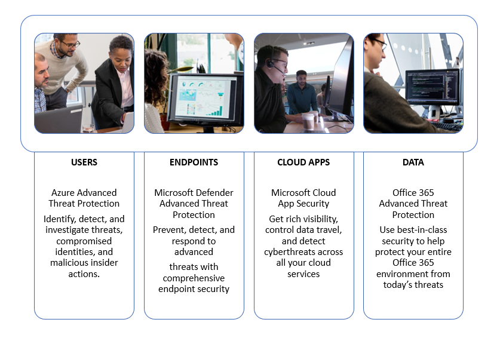
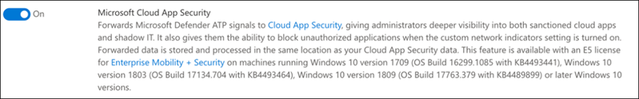

# Konfigurieren von Microsoft 365 Defender-Säulen für Ihre Test Labor-oder Pilotumgebung

[!INCLUDE [Microsoft 365 Defender rebranding](../includes/microsoft-defender.md)]

**Gilt für:**
- Microsoft 365 Defender

Das Erstellen eines Microsoft 365 Defender-Testlabors oder einer Pilotumgebung und deren Bereitstellung ist ein dreistufiger Prozess:

 
<table border="0" width="100%" align="center">
  <tr style="text-align:center;">
    <td align="center" style="width:25%; border:0;" >
      <a href= "https://docs.microsoft.com/microsoft-365/security/mtp/prepare-mtpeval?view=o365-worldwide"> 
        
       Phase 1: Vorbereiten </a> 
    </td>
     <td align="center">
      <a href="https://docs.microsoft.com/microsoft-365/security/mtp/setup-mtpeval?view=o365-worldwide">
        
       Phase 2: Setup </a> 
    </td>
    <td align="center" bgcolor="#d5f5e3">
      <a href="https://docs.microsoft.com/microsoft-365/security/mtp/config-mtpeval?view=o365-worldwide">
        
       Phase 3: Konfigurieren von & Onboard </a> 
</td>
  </tr>
</table>

Sie befinden sich derzeit in der Konfigurationsphase.

Die Vorbereitung ist für eine erfolgreiche Bereitstellung entscheidend. In diesem Artikel werden Sie mit den Punkten geführt, die Sie bei der Vorbereitung der Bereitstellung von Microsoft Defender für Endpoint berücksichtigen müssen.

## Microsoft 365 Defender-Säulen
Microsoft 365 Defender besteht aus vier Pfeilern. Auch wenn ein Pfeiler bereits einen Mehrwert für die Sicherheit ihrer Netzwerkorganisation bieten kann, bietet die Aktivierung der vier Microsoft 365 Defender-Säulen Ihrem Unternehmen den größten Nutzen.

In diesem Abschnitt erhalten Sie Informationen zu configure:
-   Microsoft Defender für Office 365
-   Microsoft Defender für Identity 
-   Microsoft Cloud App-Sicherheit
-   Microsoft Defender für Endpunkt

## Konfigurieren von Microsoft Defender für Office 365

>[!NOTE]
>Überspringen Sie diesen Schritt, wenn Sie Defender bereits für Office 365 aktiviert haben. 

Es gibt ein PowerShell-Modul mit dem Namen *Office 365 Advanced Threat Protection Recommended Configuration Analyzer (Orca)* , mit dem einige dieser Einstellungen ermittelt werden können. Wenn Sie als Administrator in Ihrem Mandanten ausgeführt wird, hilft Get-ORCAReport bei der Erstellung einer Bewertung der Anti-Spam-, Anti-Phishing-und anderer Nachrichten Hygiene Einstellungen. Sie können dieses Modul aus herunterladen https://www.powershellgallery.com/packages/ORCA/ . 

1. Navigieren Sie zu [Office 365 Security & Compliance Center](https://protection.office.com/homepage)  >  **Threat Management**  >  **Policy**.

   
 
2. Klicken Sie auf **Anti-Phishing** , wählen Sie **Create** aus, und geben Sie den Richtliniennamen und die Beschreibung ein. Klicken Sie auf **Weiter**.

   

   > [!NOTE]
   > Bearbeiten Sie die erweiterte Richtlinie zum Schutz vor Phishing in Microsoft Defender für Office 365. Ändern Sie den **Advanced Phishing Threshold** in **2-aggressive**.

3. Klicken Sie auf das Dropdownmenü **Bedingung hinzufügen** , und wählen Sie Ihre Domäne (n) als Empfängerdomäne aus. Klicken Sie auf **Weiter**.

   
 
4. Überprüfen Sie Ihre Einstellungen. Klicken Sie zum bestätigen auf **Diese Richtlinie erstellen** . 

   
 
5. Wählen Sie **sichere Anlagen** aus, und aktivieren Sie die Option **ATP für SharePoint, OneDrive und Microsoft Teams aktivieren** .

   

6. Klicken Sie auf das Symbol +, um eine neue Richtlinie für sichere Anlagen zu erstellen und diese als Empfängerdomäne auf Ihre Domänen anzuwenden. Klicken Sie auf **Speichern**.

   
 
7. Wählen Sie als nächstes die Richtlinie für **sichere Links** aus, und klicken Sie dann auf das Bleistiftsymbol, um die Standardrichtlinie zu bearbeiten.

8. Stellen Sie sicher, dass die Option nicht **nachverfolgen, wenn Benutzer auf sichere Links klicken** ausgewählt ist, während die restlichen Optionen ausgewählt sind. Details finden Sie unter [Einstellungen für sichere Links](https://docs.microsoft.com/microsoft-365/security/office-365-security/recommended-settings-for-eop-and-office365-atp) . Klicken Sie auf **Speichern**. 

   

9. Wählen Sie als nächstes die **Antischadsoftware-** Richtlinie aus, wählen Sie die Standardeinstellung aus, und wählen Sie das Bleistiftsymbol aus.

10. Klicken Sie auf **Einstellungen** und dann auf **Ja, und verwenden Sie den standardmäßigen Benachrichtigungstext** , um die **Malware Erkennungs Antwort** zu aktivieren. Aktivieren Sie den **Filter allgemeine Anlagentypen** . Klicken Sie auf **Speichern**.

    
  
11. Navigieren Sie zu [Office 365 Security & Compliance Center](https://protection.office.com/homepage)  >  - **Such**  >  **Überwachungsprotokoll-Suche** , und aktivieren Sie die Überwachung.

    

12. Integrieren Sie Microsoft Defender für Office 365 mit Microsoft Defender für Endpoint. Navigieren Sie zu [Office 365 Security & Compliance Center](https://protection.office.com/homepage)  >  **Threat Management**  >  **Explorer** , und wählen Sie in der oberen rechten Ecke des Bildschirms **Microsoft Defender for Endpoint Settings** aus. Aktivieren Sie im Dialogfeld Verteidiger für Endpunkt Verbindung die Option **Verbindung mit Microsoft Defender für Endpunkt herstellen**.

    

## Konfigurieren von Microsoft Defender für Identity

>[!NOTE]
>Überspringen Sie diesen Schritt, wenn Sie Microsoft Defender bereits für Identity aktiviert haben.

1. Navigieren Sie zum [Microsoft 365 Security Center](https://security.microsoft.com/info) > wählen Sie **Weitere Ressourcen**  >  **Microsoft Defender for Identity** aus.

   

2. Klicken Sie auf **Erstellen** , um den Microsoft Defender for Identity-Assistenten zu starten. 

   

3. Wählen Sie **Geben Sie einen Benutzernamen und ein Kennwort ein, um eine Verbindung mit Ihrer Active Directory Gesamtstruktur herzustellen**.  

   

4. Geben Sie Ihre Active Directory lokalen Anmeldeinformationen ein. Hierbei kann es sich um ein beliebiges Benutzerkonto handeln, das über Lesezugriff auf Active Directory verfügt.

   

5. Wählen Sie als nächstes **Download Sensor Setup** aus, und übertragen Sie die Datei auf Ihren Domänencontroller.

   

6. Führen Sie den Microsoft Defender für Identity Sensor Setup aus, und folgen Sie dem Assistenten.

   
 
7. Klicken Sie im Sensor Bereitstellungs auf **weiter** .

   
 
8. Kopieren Sie die Zugriffstaste, da Sie Sie als nächstes im Assistenten eingeben müssen.

   
 
9. Kopieren Sie den Zugriffsschlüssel in den Assistenten, und klicken Sie auf **Installieren**. 

   

10. Herzlichen Glückwunsch, Sie haben Microsoft Defender erfolgreich für Identity auf Ihrem Domänencontroller konfiguriert.

    
 
11. Wählen Sie im Abschnitt [Microsoft Defender for Identity](https://go.microsoft.com/fwlink/?linkid=2040449) Settings die Option * * Microsoft Defender for Endpoint * * aus, und aktivieren Sie dann die Umschaltfläche. Klicken Sie auf **Speichern**. 

    

>[!NOTE]
>Windows Defender ATP wurde als Microsoft Defender für Endpoint umbenannt. Das neubranding von Änderungen in allen Portalen wird für die Konsistenz eingeführt.

## Konfigurieren der Microsoft Cloud-App-Sicherheit

>[!NOTE]
>Überspringen Sie diesen Schritt, wenn Sie Microsoft Cloud App Security bereits aktiviert haben. 

1. Navigieren Sie zu [Microsoft 365 Security Center](https://security.microsoft.com/info)  >  **Weitere Ressourcen**  >  **Microsoft Cloud-App-Sicherheit**.

   

2. Wählen Sie an der Informations Aufforderung zur Integration von Microsoft Defender for Identity die Option **Microsoft Defender für die Identitätsdaten Integration aktivieren** aus.
  
   

   > [!NOTE]
   > Wenn diese Aufforderung nicht angezeigt wird, kann dies bedeuten, dass Ihr Microsoft Defender for Identity Data Integration bereits aktiviert wurde. Wenn Sie sich jedoch nicht sicher sind, wenden Sie sich an Ihren IT-Administrator, um dies zu bestätigen. 

3. Wechseln Sie zu **Einstellungen** , aktivieren Sie die Umschaltfläche **Microsoft Defender for Identity Integration** , und klicken Sie dann auf **Speichern**. 

   
   
   > [!NOTE]
   > Für neue Microsoft Defender für Identitäts Instanzen wird diese Integration Toggle automatisch aktiviert. Vergewissern Sie sich, dass Ihr Microsoft Defender for Identity Integration aktiviert wurde, bevor Sie mit dem nächsten Schritt fortfahren.
 
4. Wählen Sie unter den Einstellungen für die Cloud-Ermittlung die Option **Microsoft Defender für die Endpunkt Integration** aus, und aktivieren Sie dann die Integration. Klicken Sie auf **Speichern**.

   

5. Wählen Sie unter Einstellungen für die Cloud-Ermittlung die Option **Benutzer Bereicherung** aus, und aktivieren Sie dann die Integration in Azure Active Directory.

   

## Konfigurieren von Microsoft Defender für den Endpunkt

>[!NOTE]
>Überspringen Sie diesen Schritt, wenn Sie Microsoft Defender für Endpoint bereits aktiviert haben.

1. Navigieren Sie zu [Microsoft 365 Security Center](https://security.microsoft.com/info)  >  **Weitere Ressourcen**  >  **Microsoft Defender Security Center**. Klicken Sie auf **Öffnen**.

   
 
2. Führen Sie den Microsoft Defender for Endpoint-Assistenten aus. Klicken Sie auf **Weiter**. 

   

3. Wählen Sie basierend auf dem bevorzugten Datenspeicherort, der Datenaufbewahrungsrichtlinie, der Organisationsgröße und dem Opt-in für Vorschau Features aus.

   
   
   > [!NOTE]
   > Einige Einstellungen wie der Datenspeicherort können anschließend nicht mehr geändert werden. 

   Klicken Sie auf **Weiter**. 

4. Klicken Sie auf **weiter** , und stellt Ihren Microsoft Defender für den Endpunkt Mandanten zur Verfügung.

   

5. An Bord ihrer Endpunkte über Gruppenrichtlinien, Microsoft Endpoint Manager oder durch Ausführen eines lokalen Skripts an Microsoft Defender für Endpoint. Zur Vereinfachung verwendet dieses Handbuch das lokale Skript.

6. Klicken Sie auf **Paket herunterladen** , und kopieren Sie das Onboarding-Skript an Ihre (n) Endpunkte.

   

7. Führen Sie auf ihrem Endpunkt das Onboarding-Skript als Administrator aus, und wählen Sie Y aus. 

   

8. Herzlichen Glückwunsch, Sie haben ihren ersten Endpunkt an Bord.

   

9. Copy-fügen Sie den Erkennungstest aus dem Microsoft Defender for Endpoint-Assistenten ein.

   

10. Kopieren Sie das PowerShell-Skript an eine Eingabeaufforderung mit erhöhten Rechten, und führen Sie es aus. 

    

11. Wählen Sie im Assistenten **Microsoft Defender für Endpoint starten** aus.

    
 
12. Besuchen Sie das [Microsoft Defender Security Center](https://securitycenter.windows.com/). Wechseln Sie zu **Einstellungen** , und wählen Sie dann **Erweiterte Funktionen** aus. 

    

13. Aktivieren Sie die Integration mit **Microsoft Defender für Identity**.  

    

14. Aktivieren Sie die Integration mit **Office 365 Threat Intelligence**.

    

15. Aktivieren Sie die Integration in **Microsoft Cloud App Security**.

    

16. Scrollen Sie nach unten, und klicken Sie auf **Einstellungen speichern** , um die neuen Integrationen zu bestätigen.

    

## Starten des Microsoft 365 Defender-Diensts

>[!NOTE]
>Ab dem 1. Juni 2020 Microsoft 365 Defender-Features für alle berechtigten Mandanten automatisch aktiviert. Weitere Informationen finden Sie [in diesem Artikel Microsoft Tech Community on License Berechtigung](https://techcommunity.microsoft.com/t5/security-privacy-and-compliance/microsoft-threat-protection-will-automatically-turn-on-for/ba-p/1345426) . 

Wechseln Sie zu [Microsoft 365 Security Center](https://security.microsoft.com/homepage). Navigieren Sie zu **Einstellungen** , und wählen Sie dann **Microsoft 365 Defender** aus.

  

Eine umfassendere Anleitung finden Sie unter [Aktivieren von Microsoft 365 Defender](mtp-enable.md). 

Herzlichen Glückwunsch! Sie haben soeben Ihr Microsoft 365 Defender-Test Labor oder Ihre Pilotumgebung erstellt. Jetzt können Sie sich mit der Benutzeroberfläche von Microsoft 365 Defender vertraut machen. Erfahren Sie, was Sie im folgenden interaktiven Leitfaden von Microsoft 365 Defender erfahren und wie Sie die einzelnen Dashboards für Ihre täglichen Aufgaben im Zusammenarbeit mit dem Sicherheitsdienst verwenden können.

>[!VIDEO https://aka.ms/MTP-Interactive-Guide]

Als nächstes können Sie einen Angriff simulieren und sehen, wie die produktübergreifenden Funktionen erkennen, Warnungen erstellen und automatisch auf einen Datei übergreifenden Angriff auf einen Endpunkt reagieren.

## Nächster Schritt
|  [Angriffs Simulationsphase](mtp-pilot-simulate.md) | Führen Sie die Angriffssimulation für Ihre Microsoft 365 Defender-Pilotumgebung aus.
|:-------|:-----|
