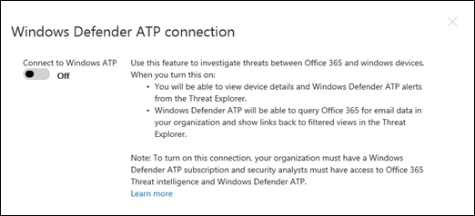

# Konfigurieren von Microsoft 365 Defender-Säulen für Ihre Test Labor-oder PilotumgebungConfigure Microsoft 365 Defender pillars for your trial lab or pilot environment

[!INCLUDE [Microsoft 365 Defender rebranding](../includes/microsoft-defender.md)]

**Gilt für:****Applies to:**
- Microsoft 365 DefenderMicrosoft 365 Defender

Das Erstellen eines Microsoft 365 Defender-Testlabors oder einer Pilotumgebung und deren Bereitstellung ist ein dreistufiger Prozess:Creating a Microsoft 365 Defender trial lab or pilot environment and deploying it is a three-phase process:

 
<table border="0" width="100%" align="center">
  <tr style="text-align:center;">
    <td align="center" style="width:25%; border:0;" >
      <a href= "https://docs.microsoft.com/microsoft-365/security/mtp/prepare-mtpeval?view=o365-worldwide"> 
        
       Phase 1: Vorbereiten </a>Phase 1: Prepare </a> 
    </td>
     <td align="center">
      <a href="https://docs.microsoft.com/microsoft-365/security/mtp/setup-mtpeval?view=o365-worldwide">
        
       Phase 2: Setup </a>Phase 2: Setup </a> 
    </td>
    <td align="center" bgcolor="#d5f5e3">
      <a href="https://docs.microsoft.com/microsoft-365/security/mtp/config-mtpeval?view=o365-worldwide">
        
       Phase 3: Konfigurieren von & Onboard </a>Phase 3: Configure & Onboard </a> 
</td>
  </tr>
</table>

Sie befinden sich derzeit in der Konfigurationsphase.You're currently in the configuration phase.

Die Vorbereitung ist für eine erfolgreiche Bereitstellung entscheidend.Preparation is key to any successful deployment. In diesem Artikel werden Sie mit den Punkten geführt, die Sie bei der Vorbereitung der Bereitstellung von Microsoft Defender für Endpoint berücksichtigen müssen.In this article, you'll be guided on the points you'll need to consider as you prepare to deploy Microsoft Defender for Endpoint.

## Microsoft 365 Defender-SäulenMicrosoft 365 Defender pillars
Microsoft 365 Defender besteht aus vier Pfeilern.Microsoft 365 Defender consists of four pillars. Auch wenn ein Pfeiler bereits einen Mehrwert für die Sicherheit ihrer Netzwerkorganisation bieten kann, bietet die Aktivierung der vier Microsoft 365 Defender-Säulen Ihrem Unternehmen den größten Nutzen.Although one pillar can already provide value to your network organization's security, enabling the four Microsoft 365 Defender pillars will give your organization the most value.

In diesem Abschnitt erhalten Sie Informationen zu configure:This section will guide you to configure:
-   Microsoft Defender für Office 365Microsoft Defender for Office 365
-   Microsoft Defender für IdentityMicrosoft Defender for Identity 
-   Microsoft Cloud App-SicherheitMicrosoft Cloud App Security
-   Microsoft Defender für EndpunktMicrosoft Defender for Endpoint

## Konfigurieren von Microsoft Defender für Office 365Configure Microsoft Defender for Office 365

>[!NOTE]
>Überspringen Sie diesen Schritt, wenn Sie Defender bereits für Office 365 aktiviert haben.Skip this step if you've already enabled Defender for Office 365. 

Es gibt ein PowerShell-Modul mit dem Namen *Office 365 Advanced Threat Protection Recommended Configuration Analyzer (Orca)* , mit dem einige dieser Einstellungen ermittelt werden können.There's a PowerShell Module called the *Office 365 Advanced Threat Protection Recommended Configuration Analyzer (ORCA)* that helps determine some of these settings. Wenn Sie als Administrator in Ihrem Mandanten ausgeführt wird, hilft Get-ORCAReport bei der Erstellung einer Bewertung der Anti-Spam-, Anti-Phishing-und anderer Nachrichten Hygiene Einstellungen.When run as an administrator in your tenant, get-ORCAReport will help generate an assessment of the anti-spam, anti-phish, and other message hygiene settings. Sie können dieses Modul aus herunterladen https://www.powershellgallery.com/packages/ORCA/ .You can download this module from https://www.powershellgallery.com/packages/ORCA/. 

1. Navigieren Sie zu [Office 365 Security & Compliance Center](https://protection.office.com/homepage)  >  **Threat Management**  >  **Policy**.Navigate to [Office 365 Security & Compliance Center](https://protection.office.com/homepage) > **Threat management** > **Policy**.

   
 
2. Klicken Sie auf **Anti-Phishing** , wählen Sie **Create** aus, und geben Sie den Richtliniennamen und die Beschreibung ein.Click **Anti-phishing** , select **Create** and fill in the policy name and description. Klicken Sie auf **Weiter**.Click **Next**.

   

   > [!NOTE]
   > Bearbeiten Sie die erweiterte Richtlinie zum Schutz vor Phishing in Microsoft Defender für Office 365.Edit your Advanced anti-phishing policy in Microsoft Defender for Office 365. Ändern Sie den **Advanced Phishing Threshold** in **2-aggressive**.Change **Advanced Phishing Threshold** to **2 - Aggressive**.

3. Klicken Sie auf das Dropdownmenü **Bedingung hinzufügen** , und wählen Sie Ihre Domäne (n) als Empfängerdomäne aus.Click the **Add a condition** drop-down menu and select your domain(s) as recipient domain. Klicken Sie auf **Weiter**.Click **Next**.

   
 
4. Überprüfen Sie Ihre Einstellungen.Review your settings. Klicken Sie zum bestätigen auf **Diese Richtlinie erstellen** .Click **Create this policy** to confirm. 

   
 
5. Wählen Sie **sichere Anlagen** aus, und aktivieren Sie die Option **ATP für SharePoint, OneDrive und Microsoft Teams aktivieren** .Select **Safe Attachments** and select the **Turn on ATP for SharePoint, OneDrive, and Microsoft Teams** option.

   

6. Klicken Sie auf das Symbol +, um eine neue Richtlinie für sichere Anlagen zu erstellen und diese als Empfängerdomäne auf Ihre Domänen anzuwenden.Click the + icon to create a new safe attachment policy, apply it as recipient domain to your domains. Klicken Sie auf **Speichern**.Click **Save**.

   
 
7. Wählen Sie als nächstes die Richtlinie für **sichere Links** aus, und klicken Sie dann auf das Bleistiftsymbol, um die Standardrichtlinie zu bearbeiten.Next, select the **Safe Links** policy, then click the pencil icon to edit the default policy.

8. Stellen Sie sicher, dass die Option nicht **nachverfolgen, wenn Benutzer auf sichere Links klicken** ausgewählt ist, während die restlichen Optionen ausgewählt sind.Make sure that the **Do not track when users click safe links** option is not selected, while the rest of the options are selected. Details finden Sie unter [Einstellungen für sichere Links](https://docs.microsoft.com/microsoft-365/security/office-365-security/recommended-settings-for-eop-and-office365-atp) .See [Safe Links settings](https://docs.microsoft.com/microsoft-365/security/office-365-security/recommended-settings-for-eop-and-office365-atp) for details. Klicken Sie auf **Speichern**.Click **Save**. 

   

9. Wählen Sie als nächstes die **Antischadsoftware-** Richtlinie aus, wählen Sie die Standardeinstellung aus, und wählen Sie das Bleistiftsymbol aus.Next select the **Anti-malware** policy, select the default, and choose the pencil icon.

10. Klicken Sie auf **Einstellungen** und dann auf **Ja, und verwenden Sie den standardmäßigen Benachrichtigungstext** , um die **Malware Erkennungs Antwort** zu aktivieren.Click **Settings** and select **Yes and use the default notification text** to enable **Malware Detection Response**. Aktivieren Sie den **Filter allgemeine Anlagentypen** .Turn the **Common Attachment Types Filter** on. Klicken Sie auf **Speichern**.Click **Save**.

    
  
11. Navigieren Sie zu [Office 365 Security & Compliance Center](https://protection.office.com/homepage)  >  - **Such**  >  **Überwachungsprotokoll-Suche** , und aktivieren Sie die Überwachung.Navigate to [Office 365 Security & Compliance Center](https://protection.office.com/homepage) > **Search** > **Audit log search** and turn Auditing on.

    

12. Integrieren Sie Microsoft Defender für Office 365 mit Microsoft Defender für Endpoint.Integrate Microsoft Defender for Office 365 with Microsoft Defender for Endpoint. Navigieren Sie zu [Office 365 Security & Compliance Center](https://protection.office.com/homepage)  >  **Threat Management**  >  **Explorer** , und wählen Sie in der oberen rechten Ecke des Bildschirms **Microsoft Defender for Endpoint Settings** aus.Navigate to [Office 365 Security & Compliance Center](https://protection.office.com/homepage) > **Threat management** > **Explorer** and select **Microsoft Defender for Endpoint Settings** on the upper right corner of the screen. Aktivieren Sie im Dialogfeld Verteidiger für Endpunkt Verbindung die Option **Verbindung mit Microsoft Defender für Endpunkt herstellen**.In the Defender for Endpoint connection dialog box, turn on **Connect to Microsoft Defender for Endpoint**.

    

## Konfigurieren von Microsoft Defender für IdentityConfigure Microsoft Defender for Identity

>[!NOTE]
>Überspringen Sie diesen Schritt, wenn Sie Microsoft Defender bereits für Identity aktiviert haben.Skip this step if you've already enabled Microsoft Defender for Identity

1. Navigieren Sie zum [Microsoft 365 Security Center](https://security.microsoft.com/info) > wählen Sie **Weitere Ressourcen**  >  **Microsoft Defender for Identity** aus.Navigate to [Microsoft 365 Security Center](https://security.microsoft.com/info) > select **More Resources** > **Microsoft Defender for Identity**.

   

2. Klicken Sie auf **Erstellen** , um den Microsoft Defender for Identity-Assistenten zu starten.Click **Create** to start the Microsoft Defender for Identity wizard. 

   

3. Wählen Sie **Geben Sie einen Benutzernamen und ein Kennwort ein, um eine Verbindung mit Ihrer Active Directory Gesamtstruktur herzustellen**.Choose **Provide a username and password to connect to your Active Directory forest**.  

   

4. Geben Sie Ihre Active Directory lokalen Anmeldeinformationen ein.Enter your Active Directory on-premises credentials. Hierbei kann es sich um ein beliebiges Benutzerkonto handeln, das über Lesezugriff auf Active Directory verfügt.This can be any user account that has read access to Active Directory.

   

5. Wählen Sie als nächstes **Download Sensor Setup** aus, und übertragen Sie die Datei auf Ihren Domänencontroller.Next, choose **Download Sensor Setup** and transfer file to your domain controller.

   

6. Führen Sie den Microsoft Defender für Identity Sensor Setup aus, und folgen Sie dem Assistenten.Execute the Microsoft Defender for Identity Sensor Setup and begin following the wizard.

   
 
7. Klicken Sie im Sensor Bereitstellungs auf **weiter** .Click **Next** at the sensor deployment type.

   
 
8. Kopieren Sie die Zugriffstaste, da Sie Sie als nächstes im Assistenten eingeben müssen.Copy the access key because you need to enter it next in the Wizard.

   
 
9. Kopieren Sie den Zugriffsschlüssel in den Assistenten, und klicken Sie auf **Installieren**.Copy the access key into the Wizard and click **Install**. 

   

10. Herzlichen Glückwunsch, Sie haben Microsoft Defender erfolgreich für Identity auf Ihrem Domänencontroller konfiguriert.Congratulations, you've successfully configured Microsoft Defender for Identity on your domain controller.

    
 
11. Wählen Sie im Abschnitt [Microsoft Defender for Identity](https://go.microsoft.com/fwlink/?linkid=2040449) Settings die Option \* \* Microsoft Defender for Endpoint \* \* aus, und aktivieren Sie dann die Umschaltfläche.Under the [Microsoft Defender for Identity](https://go.microsoft.com/fwlink/?linkid=2040449) settings section, select \*\*Microsoft Defender for Endpoint \*\*, then turn on the toggle. Klicken Sie auf **Speichern**.Click **Save**. 

    

>[!NOTE]
>Windows Defender ATP wurde als Microsoft Defender für Endpoint umbenannt.Windows Defender ATP has been rebranded as Microsoft Defender for Endpoint. Das neubranding von Änderungen in allen Portalen wird für die Konsistenz eingeführt.Rebranding changes across all of our portals are being rolled out the for consistency.

## Konfigurieren der Microsoft Cloud-App-SicherheitConfigure Microsoft Cloud App Security

>[!NOTE]
>Überspringen Sie diesen Schritt, wenn Sie Microsoft Cloud App Security bereits aktiviert haben.Skip this step if you've already enabled Microsoft Cloud App Security. 

1. Navigieren Sie zu [Microsoft 365 Security Center](https://security.microsoft.com/info)  >  **Weitere Ressourcen**  >  **Microsoft Cloud-App-Sicherheit**.Navigate to [Microsoft 365 Security Center](https://security.microsoft.com/info) > **More Resources** > **Microsoft Cloud App Security**.

   

2. Wählen Sie an der Informations Aufforderung zur Integration von Microsoft Defender for Identity die Option **Microsoft Defender für die Identitätsdaten Integration aktivieren** aus.At the information prompt to integrate Microsoft Defender for Identity, select **Enable Microsoft Defender for Identity data integration**.
  
   

   > [!NOTE]
   > Wenn diese Aufforderung nicht angezeigt wird, kann dies bedeuten, dass Ihr Microsoft Defender for Identity Data Integration bereits aktiviert wurde.If you don’t see this prompt, it might mean that your Microsoft Defender for Identity data integration has already been enabled. Wenn Sie sich jedoch nicht sicher sind, wenden Sie sich an Ihren IT-Administrator, um dies zu bestätigen.However, if you are not sure, contact your IT Administrator to confirm. 

3. Wechseln Sie zu **Einstellungen** , aktivieren Sie die Umschaltfläche **Microsoft Defender for Identity Integration** , und klicken Sie dann auf **Speichern**.Go to **Settings** , turn on the **Microsoft Defender for Identity integration** toggle, then click **Save**. 

   
   
   > [!NOTE]
   > Für neue Microsoft Defender für Identitäts Instanzen wird diese Integration Toggle automatisch aktiviert.For new Microsoft Defender for Identity instances, this integration toggle is automatically turned on. Vergewissern Sie sich, dass Ihr Microsoft Defender for Identity Integration aktiviert wurde, bevor Sie mit dem nächsten Schritt fortfahren.Confirm that your Microsoft Defender for Identity integration has been enabled before you proceed to the next step.
 
4. Wählen Sie unter den Einstellungen für die Cloud-Ermittlung die Option **Microsoft Defender für die Endpunkt Integration** aus, und aktivieren Sie dann die Integration.Under the Cloud discovery settings, select **Microsoft Defender for Endpoint integration** , then enable the integration. Klicken Sie auf **Speichern**.Click **Save**.

   

5. Wählen Sie unter Einstellungen für die Cloud-Ermittlung die Option **Benutzer Bereicherung** aus, und aktivieren Sie dann die Integration in Azure Active Directory.Under Cloud discovery settings, select **User enrichment** , then enable the integration with Azure Active Directory.

   

## Konfigurieren von Microsoft Defender für den EndpunktConfigure Microsoft Defender for Endpoint

>[!NOTE]
>Überspringen Sie diesen Schritt, wenn Sie Microsoft Defender für Endpoint bereits aktiviert haben.Skip this step if you've already enabled Microsoft Defender for Endpoint.

1. Navigieren Sie zu [Microsoft 365 Security Center](https://security.microsoft.com/info)  >  **Weitere Ressourcen**  >  **Microsoft Defender Security Center**.Navigate to [Microsoft 365 Security Center](https://security.microsoft.com/info) > **More Resources** > **Microsoft Defender Security Center**. Klicken Sie auf **Öffnen**.Click **Open**.

   
 
2. Führen Sie den Microsoft Defender for Endpoint-Assistenten aus.Follow the Microsoft Defender for Endpoint wizard. Klicken Sie auf **Weiter**.Click **Next**. 

   

3. Wählen Sie basierend auf dem bevorzugten Datenspeicherort, der Datenaufbewahrungsrichtlinie, der Organisationsgröße und dem Opt-in für Vorschau Features aus.Choose based on your preferred data storage location, data retention policy, organization size, and opt-in for preview features.

   
   
   > [!NOTE]
   > Einige Einstellungen wie der Datenspeicherort können anschließend nicht mehr geändert werden.You cannot change some of the settings, like data storage location, afterwards. 

   Klicken Sie auf **Weiter**.Click **Next**. 

4. Klicken Sie auf **weiter** , und stellt Ihren Microsoft Defender für den Endpunkt Mandanten zur Verfügung.Click **Continue** and it will provision your Microsoft Defender for Endpoint tenant.

   

5. An Bord ihrer Endpunkte über Gruppenrichtlinien, Microsoft Endpoint Manager oder durch Ausführen eines lokalen Skripts an Microsoft Defender für Endpoint.Onboard your endpoints through Group Policies, Microsoft Endpoint Manager or by running a local script to Microsoft Defender for Endpoint. Zur Vereinfachung verwendet dieses Handbuch das lokale Skript.For simplicity, this guide uses the local script.

6. Klicken Sie auf **Paket herunterladen** , und kopieren Sie das Onboarding-Skript an Ihre (n) Endpunkte.Click **Download package** and copy the onboarding script to your endpoint(s).

   

7. Führen Sie auf ihrem Endpunkt das Onboarding-Skript als Administrator aus, und wählen Sie Y aus.On your endpoint, run the onboarding script as Administrator and choose Y. 

   

8. Herzlichen Glückwunsch, Sie haben ihren ersten Endpunkt an Bord.Congratulations, you've onboarded your first endpoint.

   

9. Copy-fügen Sie den Erkennungstest aus dem Microsoft Defender for Endpoint-Assistenten ein.Copy-paste the detection test from the Microsoft Defender for Endpoint wizard.

   

10. Kopieren Sie das PowerShell-Skript an eine Eingabeaufforderung mit erhöhten Rechten, und führen Sie es aus.Copy the PowerShell script to an elevated command prompt and run it. 

    

11. Wählen Sie im Assistenten **Microsoft Defender für Endpoint starten** aus.Select **Start using Microsoft Defender for Endpoint** from the Wizard.

    
 
12. Besuchen Sie das [Microsoft Defender Security Center](https://securitycenter.windows.com/).Visit the [Microsoft Defender Security Center](https://securitycenter.windows.com/). Wechseln Sie zu **Einstellungen** , und wählen Sie dann **Erweiterte Funktionen** aus.Go to **Settings** and then select **Advanced features**. 

    

13. Aktivieren Sie die Integration mit **Microsoft Defender für Identity**.Turn on the integration with **Microsoft Defender for Identity**.  

    

14. Aktivieren Sie die Integration mit **Office 365 Threat Intelligence**.Turn on the integration with **Office 365 Threat Intelligence**.

    

15. Aktivieren Sie die Integration in **Microsoft Cloud App Security**.Turn on integration with **Microsoft Cloud App Security**.

    

16. Scrollen Sie nach unten, und klicken Sie auf **Einstellungen speichern** , um die neuen Integrationen zu bestätigen.Scroll down and click **Save preferences** to confirm the new integrations.

    

## Starten des Microsoft 365 Defender-DienstsStart the Microsoft 365 Defender service

>[!NOTE]
>Ab dem 1. Juni 2020 Microsoft 365 Defender-Features für alle berechtigten Mandanten automatisch aktiviert.Starting June 1, 2020, Microsoft automatically enables Microsoft 365 Defender features for all eligible tenants. Weitere Informationen finden Sie [in diesem Artikel Microsoft Tech Community on License Berechtigung](https://techcommunity.microsoft.com/t5/security-privacy-and-compliance/microsoft-threat-protection-will-automatically-turn-on-for/ba-p/1345426) .See this [Microsoft Tech Community article on license eligibility](https://techcommunity.microsoft.com/t5/security-privacy-and-compliance/microsoft-threat-protection-will-automatically-turn-on-for/ba-p/1345426) for details. 

Wechseln Sie zu [Microsoft 365 Security Center](https://security.microsoft.com/homepage).Go to [Microsoft 365 Security Center](https://security.microsoft.com/homepage). Navigieren Sie zu **Einstellungen** , und wählen Sie dann **Microsoft 365 Defender** aus.Navigate to **Settings** and then select **Microsoft 365 Defender**.

  

Eine umfassendere Anleitung finden Sie unter [Aktivieren von Microsoft 365 Defender](mtp-enable.md).For a more comprehensive guidance, see [Turn on Microsoft 365 Defender](mtp-enable.md). 

Herzlichen Glückwunsch!Congratulations! Sie haben soeben Ihr Microsoft 365 Defender-Test Labor oder Ihre Pilotumgebung erstellt.You've just created your Microsoft 365 Defender trial lab or pilot environment! Jetzt können Sie sich mit der Benutzeroberfläche von Microsoft 365 Defender vertraut machen.Now you can familiarize yourself with the Microsoft 365 Defender user interface! Erfahren Sie, was Sie im folgenden interaktiven Leitfaden von Microsoft 365 Defender erfahren und wie Sie die einzelnen Dashboards für Ihre täglichen Aufgaben im Zusammenarbeit mit dem Sicherheitsdienst verwenden können.See what you can learn from the following Microsoft 365 Defender interactive guide and know how to use each dashboard for your day-to-day security operation tasks.

>[!VIDEO https://aka.ms/MTP-Interactive-Guide]

Als nächstes können Sie einen Angriff simulieren und sehen, wie die produktübergreifenden Funktionen erkennen, Warnungen erstellen und automatisch auf einen Datei übergreifenden Angriff auf einen Endpunkt reagieren.Next, you can simulate an attack and see how the cross product capabilities detect, create alerts, and automatically respond to a fileless attack on an endpoint.

## Nächster SchrittNext step
|  [Angriffs SimulationsphaseAttack simulation phase](mtp-pilot-simulate.md) | Führen Sie die Angriffssimulation für Ihre Microsoft 365 Defender-Pilotumgebung aus.Run the attack simulation for your Microsoft 365 Defender pilot environment.
|:-------|:-----|
