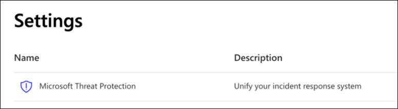

# Konfigurieren von Microsoft 365 Defender-Säulen für Ihre Testumgebung oder Pilotumgebung

[!INCLUDE [Microsoft 365 Defender rebranding](../includes/microsoft-defender.md)]

**Gilt für:**
- Microsoft 365 Defender

Das Erstellen einer Microsoft 365 Defender-Testumgebung oder -Pilotumgebung und deren Bereitstellung besteht aus drei Phasen:

| [Phase 1: Vorbereiten](prepare-mtpeval.md) | [Phase 2: Einrichten](setup-mtpeval.md) | Phase 3: Onboarding |  [Zurück zum Pilot-Playbook](mtp-pilot.md) |
|--|--|--|--|
|| |*Sie sind hier!* | |

Sie sind derzeit in der Konfigurationsphase.

Die Vorbereitung ist für eine erfolgreiche Bereitstellung entscheidend. In diesem Artikel werden Sie zu den Punkten geführt, die Sie bei der Vorbereitung der Bereitstellung von Microsoft Defender for Endpoint berücksichtigen müssen.

## Microsoft 365 Defender–Säulen
Microsoft 365 Defender besteht aus vier Säulen. Obwohl eine Säule bereits einen Nutzen für die Sicherheit Ihrer Netzwerkorganisation bieten kann, bietet die Aktivierung der vier Microsoft 365 -Defender-Säulen Ihrer Organisation den größten Nutzen.

Dieser Abschnitt enthält Anleitungen zur Konfiguration:
-   Microsoft Defender für Office 365
-   Microsoft Defender for Identity 
-   Microsoft Cloud App-Sicherheit
-   Microsoft Defender für Endpunkt

## Konfigurieren von Microsoft Defender für Office 365

>[!NOTE]
>Überspringen Sie diesen Schritt, wenn Sie Defender für Office 365 bereits aktiviert haben. 

Es gibt ein PowerShell-Modul, das als *Office 365 Advanced Threat Protection Recommended Configuration Analyzer (ORCA)* bezeichnet wird, mit dem einige dieser Einstellungen ermittelt werden können. Wenn sie als Administrator in Ihrem Mandanten ausgeführt wird, hilft get-ORCAReport bei der Generierung einer Bewertung der Antispam-, Antispam-, Antispam- und anderen Nachrichtenschutzeinstellungen. Sie können dieses Modul von https://www.powershellgallery.com/packages/ORCA/ herunterladen. 

1. Navigieren Sie [zu Office 365 Security & Compliance Center](https://protection.office.com/homepage)Threat  >  **Management**  >  **Policy**.

   
 
2. Klicken **Sie auf "Antiphishing",** wählen **Sie "Erstellen"** aus, und geben Sie den Richtliniennamen und die Beschreibung ein. Klicken Sie auf **Weiter**.

   

   > [!NOTE]
   > Bearbeiten Sie Ihre erweiterte Antiphishingrichtlinie in Microsoft Defender für Office 365. Ändern **Sie den erweiterten Phishingschwellenwert** auf **2 – Aggressiv.**

3. Klicken Sie **auf das Dropdownmenü** "Bedingung hinzufügen", und wählen Sie Ihre(n) Domäne(n) als Empfängerdomäne aus. Klicken Sie auf **Weiter**.

   
 
4. Überprüfen Sie Ihre Einstellungen. Klicken **Sie zur Bestätigung auf "Diese** Richtlinie erstellen". 

   
 
5. Wählen **Sie "Sichere Anlagen"** aus, und wählen Sie die **Option "ATP für SharePoint, OneDrive und Microsoft Teams aktivieren"** aus.

   

6. Klicken Sie auf das +-Symbol, um eine neue richtlinie für sichere Anlagen zu erstellen, und wenden Sie sie als Empfängerdomäne auf Ihre Domänen an. Klicken Sie auf **Speichern**.

   
 
7. Wählen Sie als Nächstes die Richtlinie für **sichere** Links aus, und klicken Sie dann auf das Stiftsymbol, um die Standardrichtlinie zu bearbeiten.

8. Stellen Sie sicher, dass die Option "Nicht **nachverfolgen, wenn** Benutzer auf sichere Links klicken" nicht aktiviert ist, während die restlichen Optionen ausgewählt sind. Weitere [Informationen finden Sie unter "Einstellungen für](https://docs.microsoft.com/microsoft-365/security/office-365-security/recommended-settings-for-eop-and-office365-atp) sichere Links". Klicken Sie auf **Speichern**. 

   

9. Wählen Sie als Nächstes die **Ansoftwarerichtlinie** aus, wählen Sie die Standardeinstellung aus, und wählen Sie das Stiftsymbol aus.

10. Klicken **Sie auf "Einstellungen",** wählen **Sie "Ja" aus,** und verwenden Sie den Standardbenachrichtigungstext, um die Reaktion auf **schadsoftwareerkennung zu aktivieren.** Aktivieren Sie **den Filter "Allgemeine Anlagentypen".** Klicken Sie auf **Speichern**.

    
  
11. Navigieren Sie [zur Office 365 Security & Compliance](https://protection.office.com/homepage)Center-Überwachungsprotokollsuche,  >    >   und aktivieren Sie die Überwachung.

    

12. Integrieren Sie Microsoft Defender für Office 365 in Microsoft Defender for Endpoint. Navigieren Sie [zu Office 365 Security & Compliance Center](https://protection.office.com/homepage)Threat Management Explorer, und wählen Sie in der oberen rechten Ecke des Bildschirms Microsoft Defender  >    >   **für** Endpunkteinstellungen aus. Aktivieren Sie im Dialogfeld "Verbindung mit Defender für Endpunkt" die Verbindung **mit Microsoft Defender für Endpunkt.**

    

## Konfigurieren von Microsoft Defender for Identity

>[!NOTE]
>Überspringen Sie diesen Schritt, wenn Sie Microsoft Defender for Identity bereits aktiviert haben.

1. Navigieren Sie [zu Microsoft 365 Security Center,](https://security.microsoft.com/info) > **Microsoft** Defender for Identity weitere  >  **Ressourcen auswählen.**

   

2. Klicken **Sie auf "Erstellen",** um den Microsoft Defender for Identity-Assistenten zu starten. 

   

3. Wählen **Sie "Geben Sie einen Benutzernamen und ein Kennwort ein, um eine Verbindung mit Ihrer Active Directory-Gesamtstruktur herzustellen".**  

   

4. Geben Sie Ihre lokalen Active Directory-Anmeldeinformationen ein. Dies kann ein beliebiges Benutzerkonto mit Lesezugriff auf Active Directory sein.

   

5. Wählen Sie als Nächstes **"Sensor einrichten herunterladen" aus,** und übertragen Sie die Datei auf ihren Domänencontroller.

   

6. Führen Sie das Setup des Microsoft Defender für Identitätssensors aus, und beginnen Sie mit dem Folgen des Assistenten.

   
 
7. Klicken **Sie im** Sensorbereitstellungstyp auf "Weiter".

   
 
8. Kopieren Sie die Zugriffstaste, da Sie sie als Nächstes im Assistenten eingeben müssen.

   
 
9. Kopieren Sie die Zugriffstaste in den Assistenten, und klicken Sie auf **"Installieren".** 

   

10. Herzlichen Glückwunsch, Sie haben Microsoft Defender for Identity erfolgreich auf Ihrem Domänencontroller konfiguriert.

    
 
11. Wählen Sie [im Abschnitt "Einstellungen für Microsoft Defender für](https://go.microsoft.com/fwlink/?linkid=2040449) Identität" die Option **Microsoft Defender für Endpunkt **, und aktivieren Sie dann den Umschalter. Klicken Sie auf **Speichern**. 

    

>[!NOTE]
>Windows Defender ATP wurde als Microsoft Defender for Endpoint umbenannt. Das Umbranding von Änderungen in allen unseren Portalen wird aus Gründen der Konsistenz durchgeführt.

## Konfigurieren von Microsoft Cloud App Security

>[!NOTE]
>Überspringen Sie diesen Schritt, wenn Sie Microsoft Cloud App Security bereits aktiviert haben. 

1. Navigieren Sie zu [Microsoft 365 Security Center](https://security.microsoft.com/info)weitere  >  **Ressourcen** microsoft Cloud  >  **App Security**.

   

2. Wählen Sie an der Eingabeaufforderung zur Integration von Microsoft Defender for Identity die Option **"Microsoft Defender für die Integration von Identitätsdaten aktivieren" aus.**
  
   

   > [!NOTE]
   > Wenn diese Eingabeaufforderung nicht angezeigt wird, bedeutet dies möglicherweise, dass Ihre Microsoft Defender for Identity-Datenintegration bereits aktiviert wurde. Wenn Sie jedoch nicht sicher sind, wenden Sie sich zur Bestätigung an Ihren IT-Administrator. 

3. Wechseln Sie **zu "Einstellungen",** aktivieren Sie den Umschalter für die Integration von **Microsoft Defender for Identity,** und klicken Sie dann auf **"Speichern".** 

   
   
   > [!NOTE]
   > Bei neuen Microsoft Defender for Identity-Instanzen wird diese Integrationsschalt umgeschaltet. Vergewissern Sie sich, dass die Integration von Microsoft Defender for Identity aktiviert wurde, bevor Sie mit dem nächsten Schritt fortfahren.
 
4. Wählen Sie unter den Cloud-Discovery-Einstellungen **Microsoft Defender für Endpunktintegration** aus, und aktivieren Sie dann die Integration. Klicken Sie auf **Speichern**.

   

5. Wählen Sie unter "Cloud-Discovery-Einstellungen" die Benutzeranreicherung aus, und aktivieren Sie dann die Integration in Azure Active Directory.

   

## Konfigurieren von Microsoft Defender für Endpunkt

>[!NOTE]
>Überspringen Sie diesen Schritt, wenn Sie Microsoft Defender for Endpoint bereits aktiviert haben.

1. Navigieren Sie [zu Microsoft 365 Security Center](https://security.microsoft.com/info)weitere  >  **Ressourcen** Microsoft Defender  >  **Security Center**. Klicken Sie auf **Öffnen**.

   
 
2. Folgen Sie dem Microsoft Defender für Endpoint-Assistenten. Klicken Sie auf **Weiter**. 

   

3. Wählen Sie basierend auf Dem bevorzugten Datenspeicherort, Datenaufbewahrungsrichtlinie, Organisationsgröße und Opt-in für Vorschaufeatures.

   
   
   > [!NOTE]
   > Sie können einige der Einstellungen, z. B. den Datenspeicherort, danach nicht mehr ändern. 

   Klicken Sie auf **Weiter**. 

4. Klicken **Sie auf** "Weiter", und es wird Ihr Microsoft Defender für Endpunkt-Mandant bereitgestellt.

   

5. Integrieren Sie Ihre Endpunkte über Gruppenrichtlinien, Microsoft Endpoint Manager oder durch Ausführen eines lokalen Skripts in Microsoft Defender for Endpoint. Der Einfachheit halber wird in diesem Handbuch das lokale Skript verwendet.

6. Klicken **Sie auf "Paket herunterladen",** und kopieren Sie das Onboardingskript auf Ihre Endpunkte.

   

7. Führen Sie auf Ihrem Endpunkt das Onboardingskript als Administrator aus, und wählen Sie Y aus. 

   

8. Herzlichen Glückwunsch, Sie haben Ihren ersten Endpunkt onboardiert.

   

9. Kopieren Sie den Erkennungstest aus dem Microsoft Defender für Endpunkt-Assistenten.

   

10. Kopieren Sie das PowerShell-Skript in eine Eingabeaufforderung mit erhöhten Rechten, und führen Sie es aus. 

    

11. Wählen **Sie im Assistenten "Mit Microsoft Defender für Endpunkt** starten" aus.

    
 
12. Besuchen Sie [das Microsoft Defender Security Center.](https://securitycenter.windows.com/) Wechseln Sie zu **"Einstellungen",** und wählen Sie dann **"Erweiterte Features" aus.** 

    

13. Aktivieren Sie die Integration in **Microsoft Defender for Identity.**  

    

14. Aktivieren Sie die Integration in **Office 365 Threat Intelligence.**

    

15. Aktivieren Sie die Integration in **Microsoft Cloud App Security.**

    

16. Scrollen Sie nach unten, und klicken **Sie auf "Einstellungen speichern",** um die neuen Integrationen zu bestätigen.

    

## Starten des Microsoft 365 Defender-Diensts

>[!NOTE]
>Ab dem 1. Juni 2020 aktiviert Microsoft automatisch Microsoft 365 Defender-Features für alle berechtigten Mandanten. Weitere Informationen zur [Lizenzberechtigung finden](https://techcommunity.microsoft.com/t5/security-privacy-and-compliance/microsoft-threat-protection-will-automatically-turn-on-for/ba-p/1345426) Sie in diesem Microsoft Tech Community-Artikel. 

Wechseln Sie [zum Microsoft 365 Security Center.](https://security.microsoft.com/homepage) Navigieren Sie zu **"Einstellungen",** und wählen **Sie dann Microsoft 365 Defender aus.**

  

Eine umfassendere Anleitung finden Sie unter ["Aktivieren von Microsoft 365 Defender".](mtp-enable.md) 

Herzlichen Glückwunsch! Sie haben gerade Ihre Microsoft 365 Defender-Testumgebung oder Pilotumgebung erstellt! Jetzt können Sie sich mit der Microsoft 365 Defender-Benutzeroberfläche vertraut machen! Erfahren Sie, was Sie aus dem folgenden interaktiven Microsoft 365 Defender-Leitfaden lernen können, und erfahren Sie, wie Sie jedes Dashboard für Ihre täglichen Sicherheitsaufgaben verwenden.

>[!VIDEO https://aka.ms/MTP-Interactive-Guide]

Als Nächstes können Sie einen Angriff simulieren und sehen, wie die produktübergreifenden Funktionen Warnungen erkennen, erstellen und automatisch auf einen dateilosen Angriff auf einen Endpunkt reagieren.

## Nächster Schritt
|[Angriffssimulationsphase](mtp-pilot-simulate.md) | Führen Sie die Angriffssimulation für Ihre Microsoft 365 Defender-Pilotumgebung aus.
|:-------|:-----|
