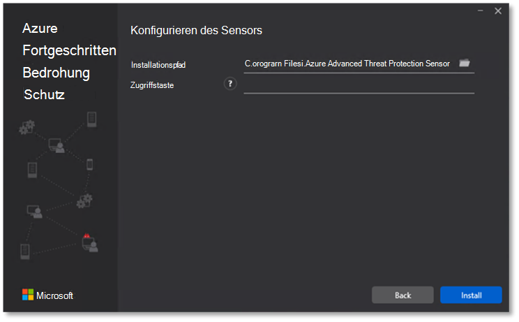

# Konfigurieren von Microsoft Threat Protection-Säulen für Ihre TestlaborumgebungConfigure Microsoft Threat Protection pillars for your trial lab environment

**Gilt für:****Applies to:**
- Microsoft Threat ProtectionMicrosoft Threat Protection

Das Erstellen einer Microsoft Threat Protection-Test Umgebungsumgebung und deren Bereitstellung ist ein dreistufiger Prozess:Creating a Microsoft Threat Protection trial lab environment and deploying it is a three-phase process:

 
<table border="0" width="100%" align="center">
  <tr style="text-align:center;">
    <td align="center" style="width:25%; border:0;" >
      <a href= "https://docs.microsoft.com/microsoft-365/security/mtp/prepare-mtpeval?view=o365-worldwide"> 
        
       Phase 1: Vorbereiten</a>Phase 1: Prepare </a> 
    </td>
     <td align="center">
      <a href="https://docs.microsoft.com/microsoft-365/security/mtp/setup-mtpeval?view=o365-worldwide">
        
       Phase 2: Setup</a>Phase 2: Setup </a> 
    </td>
    <td align="center" bgcolor="#d5f5e3">
      <a href="https://docs.microsoft.com/microsoft-365/security/mtp/config-mtpeval?view=o365-worldwide">
        
       Phase 3: Konfigurieren von & Onboard</a>Phase 3: Configure & Onboard </a> 
</td>

  </tr>
</table>

Sie befinden sich derzeit in der Konfigurationsphase.You are currently in the configuration phase.

Die Vorbereitung ist für eine erfolgreiche Bereitstellung entscheidend.Preparation is key to any successful deployment. In diesem Artikel werden Sie auf die Punkte hingewiesen, die Sie bei der Vorbereitung der Bereitstellung von Microsoft Defender ATP berücksichtigen müssen.In this article, you'll be guided on the points you'll need to consider as you prepare to deploy Microsoft Defender ATP.

## Microsoft Threat Protection-SäulenMicrosoft Threat Protection pillars
Microsoft Threat Protection besteht aus vier Pfeilern.Microsoft Threat Protection consists of four pillars. Auch wenn ein Pfeiler bereits einen Mehrwert für die Sicherheit ihrer Netzwerkorganisation bieten kann, bietet die Aktivierung der vier Microsoft-Bedrohungsschutz-Pfeiler Ihrer Organisation den größten Nutzen.Although one pillar can already provide value to your network organization's security, enabling the four Microsoft Threat Protection pillars will give your organization the most value.

![Image of_Microsoft Threat Protection-Lösung für Benutzer, Azure Advanced Threat Protection, für Endpoint Microsoft Defender Advanced Threat Protection, für Cloud-apps, Microsoft Cloud App Security und für Daten, Office 365 Advanced Threat ProtectionImage of_Microsoft Threat Protection solution for users, Azure Advanced Threat Protection, for endpoints Microsoft Defender Advanced Threat Protection, for cloud apps, Microsoft Cloud App Security, and for data, Office 365 Advanced Threat Protection  ](../../media/mtp-eval-31.png)  

In diesem Abschnitt erhalten Sie Informationen zu configure:This section will guide you to configure:
-   Office 365 Advanced Threat ProtectionOffice 365 Advanced Threat Protection
-   Azure Advanced Threat ProtectionAzure Advanced Threat Protection 
-   Microsoft Cloud App-SicherheitMicrosoft Cloud App Security
-   Microsoft Defender Advanced Threat ProtectionMicrosoft Defender Advanced Threat Protection

## Konfigurieren Office 365 Advanced Threat ProtectionConfigure Office 365 Advanced Threat Protection
>[!NOTE]
>Überspringen Sie diesen Schritt, wenn Sie bereits Office 365 Advanced Threat Protection aktiviert haben.Skip this step if you have already enabled Office 365 Advanced Threat Protection. 

Es gibt ein PowerShell-Modul namens *Office 365 Advanced Threat Protection Recommended Configuration Analyzer (Orca)* , mit dem einige dieser Einstellungen ermittelt werden können.There is a PowerShell Module called the *Office 365 Advanced Threat Protection Recommended Configuration Analyzer (ORCA)* that helps determine some of these settings. Wenn Sie als Administrator in Ihrem Mandanten ausgeführt wird, hilft Get-ORCAReport bei der Erstellung einer Bewertung der Anti-Spam-, Anti-Phishing-und anderer Nachrichten Hygiene Einstellungen.When run as an administrator in your tenant, get-ORCAReport will help generate an assessment of the anti-spam, anti-phish, and other message hygiene settings. Sie können dieses Modul aus herunterladen https://www.powershellgallery.com/packages/ORCA/ .You can download this module from https://www.powershellgallery.com/packages/ORCA/. 

1. Navigieren Sie zu [Office 365 Security & Compliance Center](https://protection.office.com/homepage)  >  **Threat Management**  >  **Policy**.Navigate to [Office 365 Security & Compliance Center](https://protection.office.com/homepage) > **Threat management** > **Policy**.
  
 
2. Klicken Sie auf **ATP-Anti-Phishing**, wählen Sie **Create** aus, und geben Sie den Richtliniennamen und die Beschreibung ein.Click **ATP anti-phishing**, select **Create** and fill in the policy name and description. Klicken Sie auf **Weiter**.Click **Next**.
  

>[!NOTE]
>Bearbeiten Sie Ihre erweiterte ATP-Richtlinie zum Schutz vor Phishing.Edit your Advanced ATP anti-phishing policy. Ändern Sie den **Advanced Phishing Threshold** in **2-aggressive**.Change **Advanced Phishing Threshold** to **2 - Aggressive**.
 

3. Klicken Sie auf das Dropdownmenü **Bedingung hinzufügen** , und wählen Sie Ihre Domäne (n) als Empfängerdomäne aus.Click the **Add a condition** drop-down menu and select your domain(s) as recipient domain. Klicken Sie auf **Weiter**.Click **Next**.
  
 
4. Überprüfen Sie Ihre Einstellungen.Review your settings. Klicken Sie zum bestätigen auf **Diese Richtlinie erstellen** .Click **Create this policy** to confirm. 
  
 
5. Wählen Sie **ATP-sichere Anlagen** aus, und aktivieren Sie die Option **ATP für SharePoint, OneDrive und Microsoft Teams aktivieren** .Select **ATP Safe attachments** and select the **Turn on ATP for SharePoint, OneDrive, and Microsoft Teams** option.  
  

6. Klicken Sie auf das Symbol +, um eine neue Richtlinie für sichere Anlagen zu erstellen und diese als Empfängerdomäne auf Ihre Domänen anzuwenden.Click the + icon to create a new safe attachment policy, apply it as recipient domain to your domains. Klicken Sie auf **Speichern**.Click **Save**.
  
 
7. Wählen Sie als nächstes die Richtlinie **ATP-sichere Links** aus, und klicken Sie dann auf das Bleistiftsymbol, um die Standardrichtlinie zu bearbeiten.Next, select the **ATP Safe Links** policy, then click the pencil icon to edit the default policy.

8. Stellen Sie sicher, dass die Option nicht **nachverfolgen, wenn Benutzer auf sichere Links klicken** ausgewählt ist, während die restlichen Optionen ausgewählt sind.Make sure that the **Do not track when users click safe links** option is not selected, while the rest of the options are selected. Details finden Sie unter [Einstellungen für sichere Links](https://docs.microsoft.com/microsoft-365/security/office-365-security/recommended-settings-for-eop-and-office365-atp?view=o365-worldwide) .See [Safe Links settings](https://docs.microsoft.com/microsoft-365/security/office-365-security/recommended-settings-for-eop-and-office365-atp?view=o365-worldwide) for details. Klicken Sie auf **Speichern**.Click **Save**. 
  

9. Wählen Sie als nächstes die **Antischadsoftware-** Richtlinie aus, wählen Sie die Standardeinstellung aus, und wählen Sie das Bleistiftsymbol aus.Next select the **Anti-malware** policy, select the default, and choose the pencil icon.

10. Klicken Sie auf **Einstellungen** und dann auf **Ja, und verwenden Sie den standardmäßigen Benachrichtigungstext** , um die **Malware Erkennungs Antwort**zu aktivieren.Click **Settings** and select **Yes and use the default notification text** to enable **Malware Detection Response**. Aktivieren Sie den **Filter allgemeine Anlagentypen** .Turn the **Common Attachment Types Filter** on. Klicken Sie auf **Speichern**.Click **Save**.
   
  
11. Navigieren Sie zu [Office 365 Security & Compliance Center](https://protection.office.com/homepage)  >  -**Such**  >  **Überwachungsprotokoll-Suche** , und aktivieren Sie die Überwachung.Navigate to [Office 365 Security & Compliance Center](https://protection.office.com/homepage) > **Search** > **Audit log search** and turn Auditing on.  
  

12. Integrieren Sie Office 365 ATP mit Microsoft Defender ATP.Integrate Office 365 ATP with Microsoft Defender ATP. Navigieren Sie zu [Office 365 Security & Compliance Center](https://protection.office.com/homepage)  >  **Threat Management**  >  **Explorer** , und wählen Sie **WDATP-Einstellungen** in der oberen rechten Ecke des Bildschirms aus.Navigate to [Office 365 Security & Compliance Center](https://protection.office.com/homepage) > **Threat management** > **Explorer** and select **WDATP Settings** on the upper right corner of the screen. Aktivieren Sie im Dialogfeld Microsoft Defender ATP Connection die Option **Connect to Windows ATP**.In the Microsoft Defender ATP connection dialog box, turn on **Connect to Windows ATP**.
  

## Konfigurieren von Azure Advanced Threat ProtectionConfigure Azure Advanced Threat Protection
>[!NOTE]
>Überspringen Sie diesen Schritt, wenn Sie Azure Advanced Threat Protection bereits aktiviert haben.Skip this step if you have already enabled Azure Advanced Threat Protection

1. Navigieren Sie zum [Microsoft 365 Security Center](https://security.microsoft.com/info) > wählen Sie **Weitere Ressourcen**  >  **Azure Advanced Threat Protection**aus.Navigate to [Microsoft 365 Security Center](https://security.microsoft.com/info) > select **More Resources** > **Azure Advanced Threat Protection**.
  

2. Klicken Sie auf **Erstellen** , um den Azure Advanced Threat Protection-Assistenten zu starten.Click **Create** to start the Azure Advanced Threat Protection wizard. 
   

3. Wählen Sie **Geben Sie einen Benutzernamen und ein Kennwort ein, um eine Verbindung mit Ihrer Active Directory Gesamtstruktur herzustellen**.Choose **Provide a username and password to connect to your Active Directory forest**.  
  

4. Geben Sie Ihre Active Directory lokalen Anmeldeinformationen ein.Enter your Active Directory on-premises credentials. Hierbei kann es sich um ein beliebiges Benutzerkonto handeln, das über Lesezugriff auf Active Directory verfügt.This can be any user account that has read access to Active Directory.
  

5. Wählen Sie als nächstes **Download Sensor Setup** aus, und übertragen Sie die Datei auf Ihren Domänencontroller.Next, choose **Download Sensor Setup** and transfer file to your domain controller. 
  

6. Führen Sie das Azure ATP-Sensor Setup aus, und folgen Sie dem Assistenten.Execute the Azure ATP Sensor Setup and begin following the wizard.
   
 
7. Klicken Sie im Sensor Bereitstellungs auf **weiter** .Click **Next** at the sensor deployment type.
   
 
8. Kopieren Sie die Zugriffstaste so, wie Sie Sie als nächstes im Assistenten eingeben müssen.Copy the access key as you will need to enter it next in the Wizard.
  
 
9. Kopieren Sie den Zugriffsschlüssel in den Assistenten, und klicken Sie auf **Installieren**.Copy the access key into the Wizard and click **Install**. 
   

10. Herzlichen Glückwunsch, Sie haben Azure Advanced Threat Protection auf Ihrem Domänencontroller erfolgreich konfiguriert.Congratulations, you have successfully configured Azure Advanced Threat Protection on your domain controller.
  
 
11. Wählen Sie im Abschnitt [Azure Azure ATP](https://go.microsoft.com/fwlink/?linkid=2040449) -Einstellungen die Option **Windows Defender ATP**aus, und aktivieren Sie dann die Umschaltfläche.Under the [Azure Azure ATP](https://go.microsoft.com/fwlink/?linkid=2040449) settings section, select **Windows Defender ATP**, then turn the toggle on. Klicken Sie auf **Speichern**.Click **Save**. 
  

>[!NOTE]
>Windows Defender ATP wurde als Microsoft Defender ATP umbenannt.Windows Defender ATP has been rebranded as Microsoft Defender ATP. Das neubranding von Änderungen in allen Portalen wird für die Konsistenz eingeführt.Rebranding changes across all of our portals are being rolled out the for consistency.

## Konfigurieren der Microsoft Cloud-App-SicherheitConfigure Microsoft Cloud App Security
>[!NOTE]
>Überspringen Sie diesen Schritt, wenn Sie Microsoft Cloud App Security bereits aktiviert haben.Skip this step if you have already enabled Microsoft Cloud App Security. 

1. Navigieren Sie zu [Microsoft 365 Security Center](https://security.microsoft.com/info)  >  **Weitere Ressourcen**  >  **Microsoft Cloud-App-Sicherheit**.Navigate to [Microsoft 365 Security Center](https://security.microsoft.com/info) > **More Resources** > **Microsoft Cloud App Security**.
  

2. Wählen Sie an der Informations Aufforderung zur Integration von Azure ATP die Option **Azure ATP-Datenintegration aktivieren**aus.At the information prompt to integrate Azure ATP, select **Enable Azure ATP data integration**. 
   

>[!NOTE]
>Wenn diese Eingabeaufforderung nicht angezeigt wird, kann dies bedeuten, dass Ihre Azure ATP-Datenintegration bereits aktiviert wurde.If you don’t see this prompt, it might mean that your Azure ATP data integration has already been enabled. Wenn Sie sich jedoch nicht sicher sind, wenden Sie sich an Ihren IT-Administrator, um dies zu bestätigen.However, if you are not sure, contact your IT Administrator to confirm. 

3. Wechseln Sie zu **Einstellungen**, aktivieren Sie die **Azure ATP-Integration** , und klicken Sie dann auf **Speichern**.Go to **Settings**, turn the **Azure ATP integration** toggle on, then click **Save**. 
  
>[!NOTE]
>Für neue Azure ATP-Instanzen wird diese Integrations Toggle automatisch aktiviert.For new Azure ATP instances, this integration toggle is automatically turned on. Vergewissern Sie sich, dass Ihre Azure ATP-Integration aktiviert wurde, bevor Sie mit dem nächsten Schritt fortfahren.Confirm that your Azure ATP integration has been enabled before you proceed to the next step.
 
4. Wählen Sie unter den Einstellungen für die Cloud-Ermittlung die Option **Microsoft Defender ATP-Integration**aus, und aktivieren Sie dann die Integration.Under the Cloud discovery settings, select **Microsoft Defender ATP integration**, then enable the integration. Klicken Sie auf **Speichern**.Click **Save**.
Click save.](../../media/mtp-eval-56.png)  

5. Wählen Sie unter Einstellungen für die Cloud-Ermittlung die Option **Benutzer Bereicherung**aus, und aktivieren Sie dann die Integration in Azure Active Directory.Under Cloud discovery settings, select **User enrichment**, then enable the integration with Azure Active Directory.
  

## Konfigurieren von Microsoft Defender Advanced Threat ProtectionConfigure Microsoft Defender Advanced Threat Protection
>[!NOTE]
>Überspringen Sie diesen Schritt, wenn Sie Microsoft Defender Advanced Threat Protection bereits aktiviert haben.Skip this step if you have already enabled Microsoft Defender Advanced Threat Protection.

1. Navigieren Sie zu [Microsoft 365 Security Center](https://security.microsoft.com/info)  >  **Weitere Ressourcen**  >  **Microsoft Defender Security Center**.Navigate to [Microsoft 365 Security Center](https://security.microsoft.com/info) > **More Resources** > **Microsoft Defender Security Center**. Klicken Sie auf **Öffnen**.Click **Open**.
   
 
2. Führen Sie den Microsoft Defender Advanced Threat Protection-Assistenten aus.Follow the Microsoft Defender Advanced Threat Protection wizard. Klicken Sie auf **Weiter**.Click **Next**. 
   

3. Wählen Sie basierend auf dem bevorzugten Datenspeicherort, der Datenaufbewahrungsrichtlinie, der Organisationsgröße und dem Opt-in für Vorschau Features aus.Choose based on your preferred data storage location, data retention policy, organization size, and opt-in for preview features. 
 Click next when you're done selecting.](../../media/mtp-eval-60.png)  
>[!NOTE]
>Einige Einstellungen wie der Datenspeicherort können anschließend nicht mehr geändert werden.You cannot change some of the settings, like data storage location, afterwards. 
 

Klicken Sie auf **Weiter**.Click **Next**. 

4. Klicken Sie auf **weiter** , und Sie wird Ihren Microsoft Defender ATP-Mandanten anbieten.Click **Continue** and it will provision your Microsoft Defender ATP tenant.
   

5. An Bord ihrer Endpunkte durch Gruppenrichtlinien, Microsoft Endpoint Manager oder durch Ausführen eines lokalen Skripts für Microsoft Defender ATP.Onboard your endpoints through Group Policies, Microsoft Endpoint Manager or by running a local script to Microsoft Defender ATP. Zur Vereinfachung verwendet dieses Handbuch das lokale Skript.For simplicity, this guide uses the local script.

6. Klicken Sie auf **Paket herunterladen** , und kopieren Sie das Onboarding-Skript an Ihre (n) Endpunkte.Click **Download package** and copy the onboarding script to your endpoint(s).  
   

7. Führen Sie auf ihrem Endpunkt das Onboarding-Skript als Administrator aus, und wählen Sie Y aus.On your endpoint, run the onboarding script as Administrator and choose Y.
   

8. Herzlichen Glückwunsch, Sie haben ihren ersten Endpunkt an Bord.Congratulations, you have onboarded your first endpoint.  
   

9. Copy-fügen Sie den Erkennungstest aus dem Microsoft Defender ATP-Assistenten ein.Copy-paste the detection test from the Microsoft Defender ATP wizard.
   

10. Kopieren Sie das PowerShell-Skript an eine Eingabeaufforderung mit erhöhten Rechten, und führen Sie es aus.Copy the PowerShell script to an elevated command prompt and run it. 
   

11. Wählen Sie im Assistenten die Option **mit Microsoft Defender ATP starten** aus.Select **Start using Microsoft Defender ATP** from the Wizard.
   
 
12. Besuchen Sie das [Microsoft Defender Security Center](https://securitycenter.windows.com/).Visit the [Microsoft Defender Security Center](https://securitycenter.windows.com/). Wechseln Sie zu **Einstellungen** , und wählen Sie dann **Erweiterte Funktionen**aus.Go to **Settings** and then select **Advanced features**. 
   

13. Aktivieren Sie die Integration in **Azure Advanced Threat Protection**.Turn on the integration with **Azure Advanced Threat Protection**.  
   

14. Aktivieren Sie die Integration mit **Office 365 Threat Intelligence**.Turn on the integration with **Office 365 Threat Intelligence**.
   

15. Aktivieren Sie die Integration in **Microsoft Cloud App Security**.Turn on integration with **Microsoft Cloud App Security**.
   

16. Scrollen Sie nach unten, und klicken Sie auf **Einstellungen speichern** , um die neuen Integrationen zu bestätigen.Scroll down and click **Save preferences** to confirm the new integrations.
   

## Aktivieren von Microsoft Threat ProtectionTurn on Microsoft Threat Protection
>[!NOTE]
>Ab dem 1. Juni 2020 Microsoft Threat Protection-Features für alle berechtigten Mandanten automatisch aktiviert.Starting June 1, 2020, Microsoft automatically enables Microsoft Threat Protection features for all eligible tenants. Weitere Informationen finden Sie [in diesem Artikel Microsoft Tech Community on License Berechtigung](https://techcommunity.microsoft.com/t5/security-privacy-and-compliance/microsoft-threat-protection-will-automatically-turn-on-for/ba-p/1345426) .See this [Microsoft Tech Community article on license eligibility](https://techcommunity.microsoft.com/t5/security-privacy-and-compliance/microsoft-threat-protection-will-automatically-turn-on-for/ba-p/1345426) for details. 
 
1. Wechseln Sie zu [Microsoft 365 Security Center](https://security.microsoft.com/homepage).Go to [Microsoft 365 Security Center](https://security.microsoft.com/homepage). Navigieren Sie zu **Einstellungen** , und wählen Sie dann **Microsoft Threat Protection**aus.Navigate to **Settings** and then select **Microsoft Threat Protection**.
   

2. Aktivieren Sie das Kontrollkästchen **Microsoft Threat Protection aktivieren** , und klicken Sie dann auf **Speichern**.Select the **Turn on Microsoft Threat Protection** checkbox, then click **Save**.
   

Herzlichen Glückwunsch!Congratulations! Sie haben soeben Ihre Microsoft Threat Protection Test Lab-Umgebung erstellt.You've just created your Microsoft Threat Protection trial lab environment! Sie können nun einen Angriff simulieren und sehen, wie die produktübergreifenden Funktionen erkennen, Warnungen erstellen und automatisch auf einen Datei übergreifenden Angriff auf einen Endpunkt reagieren.You can now simulate an attack and see how the cross product capabilities detect, create alerts, and automatically respond to a fileless attack on an endpoint.

## Nächste SchritteNext steps
[Generieren Sie eine Testwarnung](generate-test-alert.md).[Generate a test alert](generate-test-alert.md).
